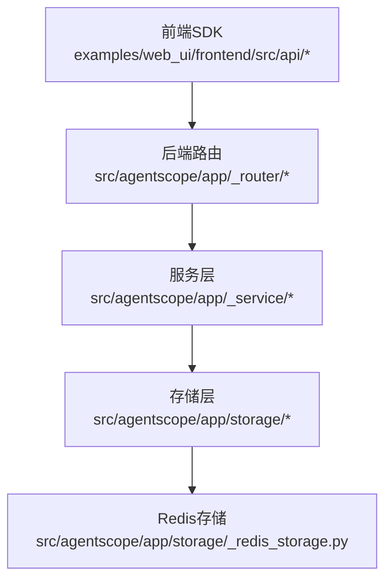
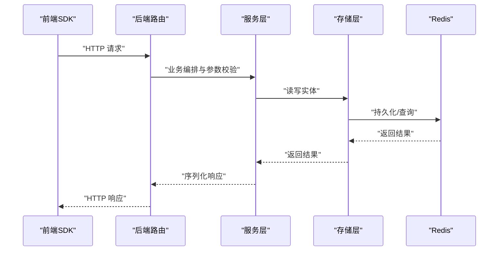
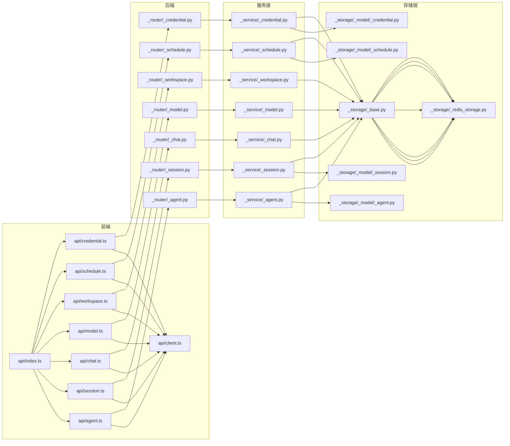

# API参考

<cite>
**本文引用的文件**
- [examples/web_ui/frontend/src/api/index.ts](file://examples/web_ui/frontend/src/api/index.ts)
- [examples/web_ui/frontend/src/api/client.ts](file://examples/web_ui/frontend/src/api/client.ts)
- [examples/web_ui/frontend/src/api/types.ts](file://examples/web_ui/frontend/src/api/types.ts)
- [examples/web_ui/frontend/src/api/agent.ts](file://examples/web_ui/frontend/src/api/agent.ts)
- [examples/web_ui/frontend/src/api/session.ts](file://examples/web_ui/frontend/src/api/session.ts)
- [examples/web_ui/frontend/src/api/chat.ts](file://examples/web_ui/frontend/src/api/chat.ts)
- [examples/web_ui/frontend/src/api/model.ts](file://examples/web_ui/frontend/src/api/model.ts)
- [examples/web_ui/frontend/src/api/workspace.ts](file://examples/web_ui/frontend/src/api/workspace.ts)
- [examples/web_ui/frontend/src/api/schedule.ts](file://examples/web_ui/frontend/src/api/schedule.ts)
- [examples/web_ui/frontend/src/api/credential.ts](file://examples/web_ui/frontend/src/api/credential.ts)
- [src/agentscope/app/_router/_agent.py](file://src/agentscope/app/_router/_agent.py)
- [src/agentscope/app/_router/_session.py](file://src/agentscope/app/_router/_session.py)
- [src/agentscope/app/_router/_chat.py](file://src/agentscope/app/_router/_chat.py)
- [src/agentscope/app/_router/_model.py](file://src/agentscope/app/_router/_model.py)
- [src/agentscope/app/_router/_workspace.py](file://src/agentscope/app/_router/_workspace.py)
- [src/agentscope/app/_router/_schedule.py](file://src/agentscope/app/_router/_schedule.py)
- [src/agentscope/app/_router/_credential.py](file://src/agentscope/app/_router/_credential.py)
- [src/agentscope/app/_service/_agent.py](file://src/agentscope/app/_service/_agent.py)
- [src/agentscope/app/_service/_session.py](file://src/agentscope/app/_service/_session.py)
- [src/agentscope/app/_service/_chat.py](file://src/agentscope/app/_service/_chat.py)
- [src/agentscope/app/_service/_model.py](file://src/agentscope/app/_service/_model.py)
- [src/agentscope/app/_service/_workspace.py](file://src/agentscope/app/_service/_workspace.py)
- [src/agentscope/app/_service/_schedule.py](file://src/agentscope/app/_service/_schedule.py)
- [src/agentscope/app/_service/_credential.py](file://src/agentscope/app/_service/_credential.py)
- [src/agentscope/app/storage/_redis_storage.py](file://src/agentscope/app/storage/_redis_storage.py)
- [src/agentscope/app/storage/_base.py](file://src/agentscope/app/storage/_base.py)
- [src/agentscope/app/storage/_model/_session.py](file://src/agentscope/app/storage/_model/_session.py)
- [src/agentscope/app/storage/_model/_agent.py](file://src/agentscope/app/storage/_model/_agent.py)
- [src/agentscope/app/storage/_model/_credential.py](file://src/agentscope/app/storage/_model/_credential.py)
- [src/agentscope/app/storage/_model/_schedule.py](file://src/agentscope/app/storage/_model/_schedule.py)
- [src/agentscope/app/_schema/_agent.py](file://src/agentscope/app/_schema/_agent.py)
- [src/agentscope/app/_schema/_session.py](file://src/agentscope/app/_schema/_session.py)
- [src/agentscope/app/_schema/_chat.py](file://src/agentscope/app/_schema/_chat.py)
- [src/agentscope/app/_schema/_model.py](file://src/agentscope/app/_schema/_model.py)
- [src/agentscope/app/_schema/_workspace.py](file://src/agentscope/app/_schema/_workspace.py)
- [src/agentscope/app/_schema/_schedule.py](file://src/agentscope/app/_schema/_schedule.py)
- [src/agentscope/app/_schema/_credential.py](file://src/agentscope/app/_schema/_credential.py)
</cite>

## 目录
1. [简介](#简介)
2. [项目结构](#项目结构)
3. [核心组件](#核心组件)
4. [架构总览](#架构总览)
5. [详细组件分析](#详细组件分析)
6. [依赖关系分析](#依赖关系分析)
7. [性能考虑](#性能考虑)
8. [故障排查指南](#故障排查指南)
9. [结论](#结论)
10. [附录](#附录)

## 简介
本文件为 AgentScope 的 API 参考文档，覆盖后端 REST API 与前端 SDK（Web 前端）的完整接口规范。内容包括：
- 智能体（Agent）相关：创建、查询、更新、删除
- 聊天（Chat）相关：消息发送（含流式事件）、历史查询、会话管理
- 模型（Model）相关：模型列表、配置与调用
- 会话（Session）相关：创建、状态查询、消息历史、清理
- 凭据（Credential）与工作空间（Workspace）、日程（Schedule）等扩展能力
- 错误码与响应格式约定
- 完整的调用示例与 SDK 使用指南

## 项目结构
AgentScope 后端采用 FastAPI 构建，通过路由模块组织各领域 API；前端 Web UI 提供 TypeScript SDK 封装，统一通过 HTTP 客户端访问后端。

图表来源
- [examples/web_ui/frontend/src/api/index.ts:1-8](file://examples/web_ui/frontend/src/api/index.ts#L1-L8)
- [src/agentscope/app/_router/_agent.py](file://src/agentscope/app/_router/_agent.py)
- [src/agentscope/app/_router/_session.py](file://src/agentscope/app/_router/_session.py)
- [src/agentscope/app/_router/_chat.py](file://src/agentscope/app/_router/_chat.py)
- [src/agentscope/app/_router/_model.py](file://src/agentscope/app/_router/_model.py)
- [src/agentscope/app/_router/_workspace.py](file://src/agentscope/app/_router/_workspace.py)
- [src/agentscope/app/_router/_schedule.py](file://src/agentscope/app/_router/_schedule.py)
- [src/agentscope/app/_router/_credential.py](file://src/agentscope/app/_router/_credential.py)
- [src/agentscope/app/_service/_agent.py](file://src/agentscope/app/_service/_agent.py)
- [src/agentscope/app/_service/_session.py](file://src/agentscope/app/_service/_session.py)
- [src/agentscope/app/_service/_chat.py](file://src/agentscope/app/_service/_chat.py)
- [src/agentscope/app/_service/_model.py](file://src/agentscope/app/_service/_model.py)
- [src/agentscope/app/_service/_workspace.py](file://src/agentscope/app/_service/_workspace.py)
- [src/agentscope/app/_service/_schedule.py](file://src/agentscope/app/_service/_schedule.py)
- [src/agentscope/app/_service/_credential.py](file://src/agentscope/app/_service/_credential.py)
- [src/agentscope/app/storage/_redis_storage.py](file://src/agentscope/app/storage/_redis_storage.py)

章节来源
- [examples/web_ui/frontend/src/api/index.ts:1-8](file://examples/web_ui/frontend/src/api/index.ts#L1-L8)

## 核心组件
- 前端 SDK：封装了对后端 REST API 的调用，提供类型安全的请求与响应定义，并支持聊天事件的流式读取。
- 后端路由：按领域拆分路由模块，统一处理鉴权、参数校验、业务编排与响应序列化。
- 服务层：封装具体业务逻辑，协调存储与外部模型服务。
- 存储层：抽象存储接口与 Redis 实现，支撑会话、智能体、凭据、日程等实体持久化。

章节来源
- [examples/web_ui/frontend/src/api/index.ts:1-8](file://examples/web_ui/frontend/src/api/index.ts#L1-L8)
- [src/agentscope/app/_router/_agent.py](file://src/agentscope/app/_router/_agent.py)
- [src/agentscope/app/_router/_session.py](file://src/agentscope/app/_router/_session.py)
- [src/agentscope/app/_router/_chat.py](file://src/agentscope/app/_router/_chat.py)
- [src/agentscope/app/_router/_model.py](file://src/agentscope/app/_router/_model.py)
- [src/agentscope/app/_router/_workspace.py](file://src/agentscope/app/_router/_workspace.py)
- [src/agentscope/app/_router/_schedule.py](file://src/agentscope/app/_router/_schedule.py)
- [src/agentscope/app/_router/_credential.py](file://src/agentscope/app/_router/_credential.py)
- [src/agentscope/app/_service/_agent.py](file://src/agentscope/app/_service/_agent.py)
- [src/agentscope/app/_service/_session.py](file://src/agentscope/app/_service/_session.py)
- [src/agentscope/app/_service/_chat.py](file://src/agentscope/app/_service/_chat.py)
- [src/agentscope/app/_service/_model.py](file://src/agentscope/app/_service/_model.py)
- [src/agentscope/app/_service/_workspace.py](file://src/agentscope/app/_service/_workspace.py)
- [src/agentscope/app/_service/_schedule.py](file://src/agentscope/app/_service/_schedule.py)
- [src/agentscope/app/_service/_credential.py](file://src/agentscope/app/_service/_credential.py)
- [src/agentscope/app/storage/_redis_storage.py](file://src/agentscope/app/storage/_redis_storage.py)

## 架构总览
下图展示了从前端到后端的关键交互流程，以及数据在服务层与存储层之间的流转。

图表来源
- [examples/web_ui/frontend/src/api/index.ts:1-8](file://examples/web_ui/frontend/src/api/index.ts#L1-L8)
- [src/agentscope/app/_router/_agent.py](file://src/agentscope/app/_router/_agent.py)
- [src/agentscope/app/_router/_session.py](file://src/agentscope/app/_router/_session.py)
- [src/agentscope/app/_router/_chat.py](file://src/agentscope/app/_router/_chat.py)
- [src/agentscope/app/_router/_model.py](file://src/agentscope/app/_router/_model.py)
- [src/agentscope/app/_router/_workspace.py](file://src/agentscope/app/_router/_workspace.py)
- [src/agentscope/app/_router/_schedule.py](file://src/agentscope/app/_router/_schedule.py)
- [src/agentscope/app/_router/_credential.py](file://src/agentscope/app/_router/_credential.py)
- [src/agentscope/app/_service/_agent.py](file://src/agentscope/app/_service/_agent.py)
- [src/agentscope/app/_service/_session.py](file://src/agentscope/app/_service/_session.py)
- [src/agentscope/app/_service/_chat.py](file://src/agentscope/app/_service/_chat.py)
- [src/agentscope/app/_service/_model.py](file://src/agentscope/app/_service/_model.py)
- [src/agentscope/app/_service/_workspace.py](file://src/agentscope/app/_service/_workspace.py)
- [src/agentscope/app/_service/_schedule.py](file://src/agentscope/app/_service/_schedule.py)
- [src/agentscope/app/_service/_credential.py](file://src/agentscope/app/_service/_credential.py)
- [src/agentscope/app/storage/_redis_storage.py](file://src/agentscope/app/storage/_redis_storage.py)

## 详细组件分析

### 智能体（Agent）API
- 功能：创建、查询、更新、删除智能体；支持列表与详情查询。
- 前端SDK：通过 agentApi 对外暴露方法。
- 后端路由：位于 _agent.py，提供 REST 接口。
- 服务层：_agent.py 实现业务逻辑。
- 数据模型：_schema/_agent.py 定义请求/响应结构。

章节来源
- [examples/web_ui/frontend/src/api/agent.ts](file://examples/web_ui/frontend/src/api/agent.ts)
- [src/agentscope/app/_router/_agent.py](file://src/agentscope/app/_router/_agent.py)
- [src/agentscope/app/_service/_agent.py](file://src/agentscope/app/_service/_agent.py)
- [src/agentscope/app/_schema/_agent.py](file://src/agentscope/app/_schema/_agent.py)

### 会话（Session）API
- 功能：创建、更新、删除、列出；查询会话内消息历史。
- 前端SDK：sessionApi 提供 list/create/update/delete/messages 方法。
- 后端路由：_session.py 提供 REST 接口，含分页查询消息。
- 服务层：_session.py 实现业务逻辑。
- 存储模型：storage/_model/_session.py 定义会话实体。
- 类型定义：types.ts 中包含 SessionRecord、CreateSessionRequest 等。

章节来源
- [examples/web_ui/frontend/src/api/session.ts:1-33](file://examples/web_ui/frontend/src/api/session.ts#L1-L33)
- [examples/web_ui/frontend/src/api/types.ts:93-134](file://examples/web_ui/frontend/src/api/types.ts#L93-L134)
- [src/agentscope/app/_router/_session.py:228-266](file://src/agentscope/app/_router/_session.py#L228-L266)
- [src/agentscope/app/_service/_session.py](file://src/agentscope/app/_service/_session.py)
- [src/agentscope/app/storage/_model/_session.py](file://src/agentscope/app/storage/_model/_session.py)

### 聊天（Chat）API
- 功能：向指定会话发送消息，后端以服务器推送事件（SSE）流式返回事件。
- 前端SDK：chatApi.stream 支持异步迭代 AgentEvent。
- 后端路由：_chat.py 处理聊天请求与事件推送。
- 服务层：_chat.py 实现聊天调度与事件生成。
- 类型定义：types.ts 中定义 ChatRequest、AgentEvent 等。

章节来源
- [examples/web_ui/frontend/src/api/chat.ts:1-28](file://examples/web_ui/frontend/src/api/chat.ts#L1-L28)
- [examples/web_ui/frontend/src/api/types.ts](file://examples/web_ui/frontend/src/api/types.ts)
- [src/agentscope/app/_router/_chat.py](file://src/agentscope/app/_router/_chat.py)
- [src/agentscope/app/_service/_chat.py](file://src/agentscope/app/_service/_chat.py)
- [src/agentscope/app/_schema/_chat.py](file://src/agentscope/app/_schema/_chat.py)

### 模型（Model）API
- 功能：查询可用模型列表、模型配置与调用。
- 前端SDK：modelApi 提供模型相关方法。
- 后端路由：_model.py 提供 REST 接口。
- 服务层：_model.py 实现模型选择与调用编排。
- 类型定义：_schema/_model.py 定义模型相关结构。

章节来源
- [examples/web_ui/frontend/src/api/model.ts](file://examples/web_ui/frontend/src/api/model.ts)
- [src/agentscope/app/_router/_model.py](file://src/agentscope/app/_router/_model.py)
- [src/agentscope/app/_service/_model.py](file://src/agentscope/app/_service/_model.py)
- [src/agentscope/app/_schema/_model.py](file://src/agentscope/app/_schema/_model.py)

### 工作空间（Workspace）API
- 功能：工作空间管理（创建、查询、更新、删除）。
- 前端SDK：workspaceApi。
- 后端路由：_workspace.py。
- 服务层：_workspace.py。
- 类型定义：_schema/_workspace.py。

章节来源
- [examples/web_ui/frontend/src/api/workspace.ts](file://examples/web_ui/frontend/src/api/workspace.ts)
- [src/agentscope/app/_router/_workspace.py](file://src/agentscope/app/_router/_workspace.py)
- [src/agentscope/app/_service/_workspace.py](file://src/agentscope/app/_service/_workspace.py)
- [src/agentscope/app/_schema/_workspace.py](file://src/agentscope/app/_schema/_workspace.py)

### 日程（Schedule）API
- 功能：日程的创建、查询、更新、停止与查看。
- 前端SDK：scheduleApi。
- 后端路由：_schedule.py。
- 服务层：_schedule.py。
- 类型定义：_schema/_schedule.py。

章节来源
- [examples/web_ui/frontend/src/api/schedule.ts](file://examples/web_ui/frontend/src/api/schedule.ts)
- [src/agentscope/app/_router/_schedule.py](file://src/agentscope/app/_router/_schedule.py)
- [src/agentscope/app/_service/_schedule.py](file://src/agentscope/app/_service/_schedule.py)
- [src/agentscope/app/_schema/_schedule.py](file://src/agentscope/app/_schema/_schedule.py)

### 凭据（Credential）API
- 功能：凭据的创建、查询、更新、删除。
- 前端SDK：credentialApi。
- 后端路由：_credential.py。
- 服务层：_credential.py。
- 类型定义：_schema/_credential.py。

章节来源
- [examples/web_ui/frontend/src/api/credential.ts](file://examples/web_ui/frontend/src/api/credential.ts)
- [src/agentscope/app/_router/_credential.py](file://src/agentscope/app/_router/_credential.py)
- [src/agentscope/app/_service/_credential.py](file://src/agentscope/app/_service/_credential.py)
- [src/agentscope/app/_schema/_credential.py](file://src/agentscope/app/_schema/_credential.py)

## 依赖关系分析
- 前端 SDK 通过统一客户端封装 HTTP 请求与 SSE 流式读取。
- 后端路由依赖服务层进行业务处理，服务层依赖存储层完成持久化。
- 存储层默认实现基于 Redis，提供高性能读写。

图表来源
- [examples/web_ui/frontend/src/api/index.ts:1-8](file://examples/web_ui/frontend/src/api/index.ts#L1-L8)
- [examples/web_ui/frontend/src/api/client.ts](file://examples/web_ui/frontend/src/api/client.ts)
- [examples/web_ui/frontend/src/api/agent.ts](file://examples/web_ui/frontend/src/api/agent.ts)
- [examples/web_ui/frontend/src/api/session.ts:1-33](file://examples/web_ui/frontend/src/api/session.ts#L1-L33)
- [examples/web_ui/frontend/src/api/chat.ts:1-28](file://examples/web_ui/frontend/src/api/chat.ts#L1-L28)
- [examples/web_ui/frontend/src/api/model.ts](file://examples/web_ui/frontend/src/api/model.ts)
- [examples/web_ui/frontend/src/api/workspace.ts](file://examples/web_ui/frontend/src/api/workspace.ts)
- [examples/web_ui/frontend/src/api/schedule.ts](file://examples/web_ui/frontend/src/api/schedule.ts)
- [examples/web_ui/frontend/src/api/credential.ts](file://examples/web_ui/frontend/src/api/credential.ts)
- [src/agentscope/app/_router/_agent.py](file://src/agentscope/app/_router/_agent.py)
- [src/agentscope/app/_router/_session.py](file://src/agentscope/app/_router/_session.py)
- [src/agentscope/app/_router/_chat.py](file://src/agentscope/app/_router/_chat.py)
- [src/agentscope/app/_router/_model.py](file://src/agentscope/app/_router/_model.py)
- [src/agentscope/app/_router/_workspace.py](file://src/agentscope/app/_router/_workspace.py)
- [src/agentscope/app/_router/_schedule.py](file://src/agentscope/app/_router/_schedule.py)
- [src/agentscope/app/_router/_credential.py](file://src/agentscope/app/_router/_credential.py)
- [src/agentscope/app/_service/_agent.py](file://src/agentscope/app/_service/_agent.py)
- [src/agentscope/app/_service/_session.py](file://src/agentscope/app/_service/_session.py)
- [src/agentscope/app/_service/_chat.py](file://src/agentscope/app/_service/_chat.py)
- [src/agentscope/app/_service/_model.py](file://src/agentscope/app/_service/_model.py)
- [src/agentscope/app/_service/_workspace.py](file://src/agentscope/app/_service/_workspace.py)
- [src/agentscope/app/_service/_schedule.py](file://src/agentscope/app/_service/_schedule.py)
- [src/agentscope/app/_service/_credential.py](file://src/agentscope/app/_service/_credential.py)
- [src/agentscope/app/storage/_base.py](file://src/agentscope/app/storage/_base.py)
- [src/agentscope/app/storage/_redis_storage.py](file://src/agentscope/app/storage/_redis_storage.py)
- [src/agentscope/app/storage/_model/_session.py](file://src/agentscope/app/storage/_model/_session.py)
- [src/agentscope/app/storage/_model/_agent.py](file://src/agentscope/app/storage/_model/_agent.py)
- [src/agentscope/app/storage/_model/_credential.py](file://src/agentscope/app/storage/_model/_credential.py)
- [src/agentscope/app/storage/_model/_schedule.py](file://src/agentscope/app/storage/_model/_schedule.py)

## 性能考虑
- 分页与批量：消息查询支持 offset/limit，建议前端按需加载，避免一次性拉取过多数据。
- 流式事件：聊天使用 SSE 流式推送，前端应正确处理断线重连与缓冲区拼接。
- 缓存策略：存储层基于 Redis，建议合理设置过期时间与键命名，降低热点压力。
- 并发控制：服务层对高并发场景应限制速率与队列长度，避免阻塞。

## 故障排查指南
- 常见错误码
  - 400：请求参数不合法或缺失
  - 401：未认证或令牌无效
  - 403：权限不足
  - 404：资源不存在（如会话、智能体）
  - 429：请求过于频繁（限流）
  - 500：服务器内部错误
- 建议排查步骤
  - 检查鉴权头与用户上下文是否正确传递
  - 校验请求体字段与类型是否符合 schema
  - 查看后端日志定位异常堆栈
  - 对于 SSE 流，确认网络连接与跨域配置

## 结论
本文档提供了 AgentScope 的完整 API 规范与前端 SDK 使用指南。通过清晰的路由、服务与存储分层，系统实现了从智能体管理到聊天会话、模型调用与资源管理的全链路能力。建议在生产环境中结合缓存、限流与监控体系，确保稳定性与可维护性。

## 附录

### API 调用示例与 SDK 使用指南

- 会话消息查询（分页）
  - 方法：GET
  - 路径：/sessions/{session_id}/messages
  - 查询参数：agent_id（必需），offset（非负），limit（1~200）
  - 响应：包含消息数组与运行状态
  - 示例路径：[examples/web_ui/frontend/src/api/session.ts:27-32](file://examples/web_ui/frontend/src/api/session.ts#L27-L32)

- 会话创建
  - 方法：POST
  - 路径：/sessions/
  - 请求体：包含 agent_id、workspace_id（可选）、chat_model_config（可选）、fallback_chat_model_config（可选）
  - 响应：session_id
  - 示例路径：[examples/web_ui/frontend/src/api/session.ts:19](file://examples/web_ui/frontend/src/api/session.ts#L19)

- 会话更新（PATCH）
  - 方法：PATCH
  - 路径：/sessions/{session_id}
  - 查询参数：agent_id（必需）
  - 请求体：name（可选）、chat_model_config（可选）、fallback_chat_model_config（可选，null 表示清空）、permission_mode（可选）
  - 响应：更新后的会话记录
  - 示例路径：[examples/web_ui/frontend/src/api/session.ts:21-22](file://examples/web_ui/frontend/src/api/session.ts#L21-L22)

- 会话删除
  - 方法：DELETE
  - 路径：/sessions/{session_id}
  - 查询参数：agent_id（必需）
  - 示例路径：[examples/web_ui/frontend/src/api/session.ts:24-25](file://examples/web_ui/frontend/src/api/session.ts#L24-L25)

- 聊天事件流式推送
  - 方法：POST
  - 路径：/chat/
  - 请求体：聊天请求（包含会话与消息内容）
  - 响应：SSE 流，逐行 data: JSON 事件
  - 前端使用：chatApi.stream 异步迭代 AgentEvent
  - 示例路径：[examples/web_ui/frontend/src/api/chat.ts:5-27](file://examples/web_ui/frontend/src/api/chat.ts#L5-L27)

- 智能体相关（示例）
  - 列表/详情/创建/更新/删除：通过 agentApi 访问
  - 示例路径：[examples/web_ui/frontend/src/api/agent.ts](file://examples/web_ui/frontend/src/api/agent.ts)

- 模型相关（示例）
  - 列表/配置/调用：通过 modelApi 访问
  - 示例路径：[examples/web_ui/frontend/src/api/model.ts](file://examples/web_ui/frontend/src/api/model.ts)

- 工作空间/日程/凭据（示例）
  - 通过 workspaceApi/scheduleApi/credentialApi 访问
  - 示例路径：[examples/web_ui/frontend/src/api/workspace.ts](file://examples/web_ui/frontend/src/api/workspace.ts)，[examples/web_ui/frontend/src/api/schedule.ts](file://examples/web_ui/frontend/src/api/schedule.ts)，[examples/web_ui/frontend/src/api/credential.ts](file://examples/web_ui/frontend/src/api/credential.ts)

### 数据模型与类型参考
- 会话记录与请求体
  - 类型定义：SessionRecord、CreateSessionRequest、UpdateSessionRequest、SessionListResponse
  - 示例路径：[examples/web_ui/frontend/src/api/types.ts:93-134](file://examples/web_ui/frontend/src/api/types.ts#L93-L134)

- 聊天事件与请求
  - 类型定义：AgentEvent、ChatRequest
  - 示例路径：[examples/web_ui/frontend/src/api/types.ts](file://examples/web_ui/frontend/src/api/types.ts)

- 存储模型
  - 会话：storage/_model/_session.py
  - 智能体：storage/_model/_agent.py
  - 凭据：storage/_model/_credential.py
  - 日程：storage/_model/_schedule.py
  - 示例路径：[src/agentscope/app/storage/_model/_session.py](file://src/agentscope/app/storage/_model/_session.py)，[src/agentscope/app/storage/_model/_agent.py](file://src/agentscope/app/storage/_model/_agent.py)，[src/agentscope/app/storage/_model/_credential.py](file://src/agentscope/app/storage/_model/_credential.py)，[src/agentscope/app/storage/_model/_schedule.py](file://src/agentscope/app/storage/_model/_schedule.py)