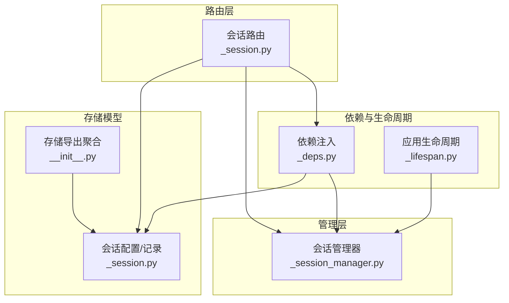
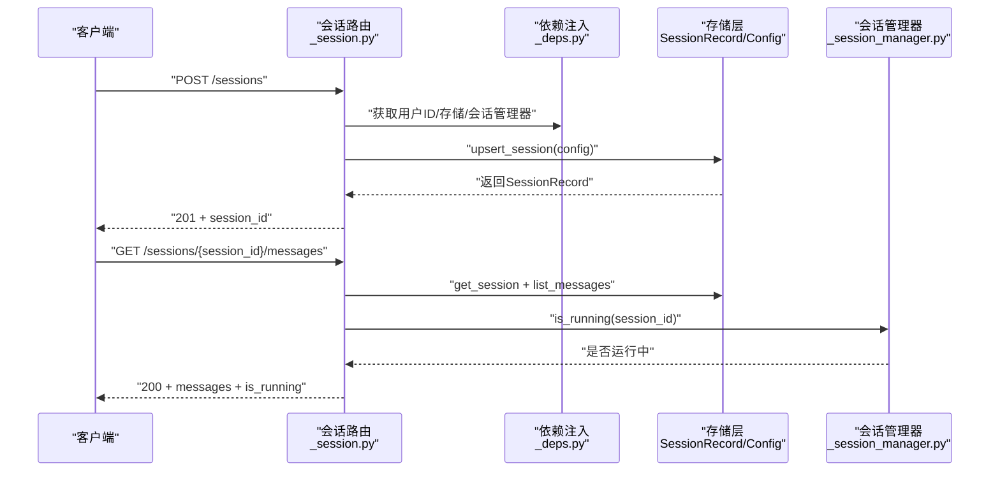
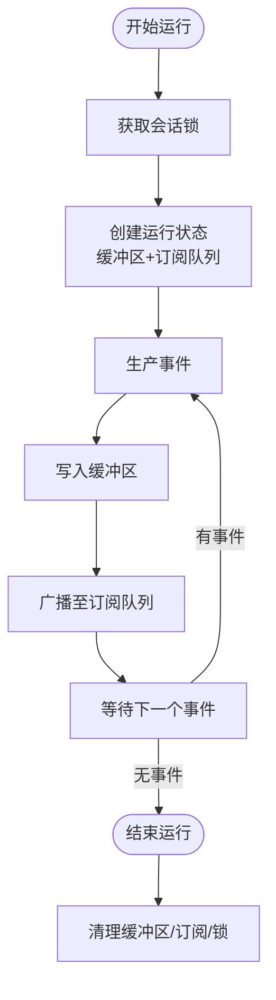
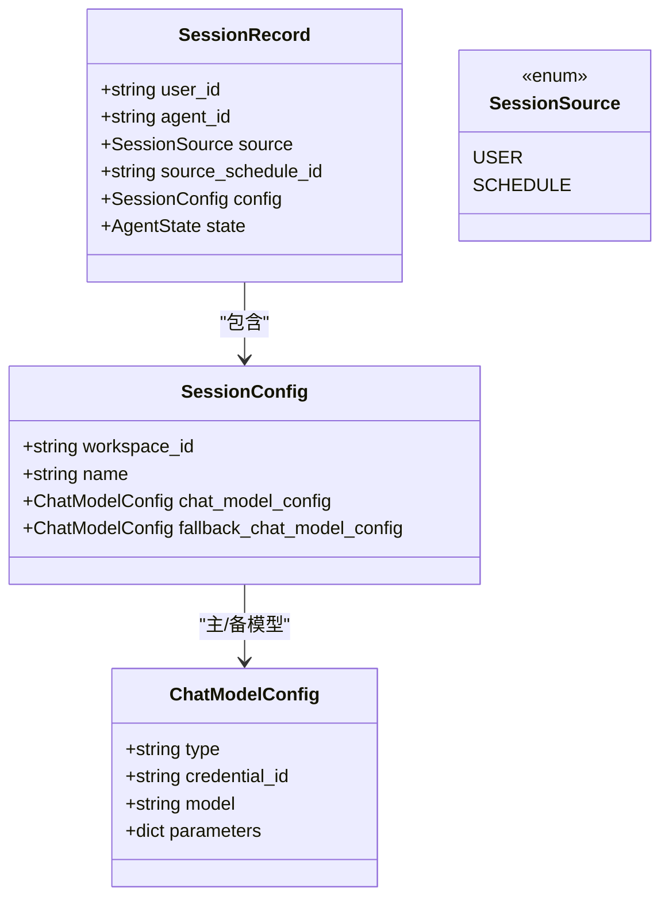
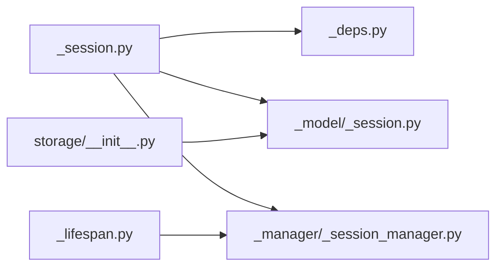

# 会话API

<cite>
**本文引用的文件**
- [src/agentscope/app/_router/_session.py](file://src/agentscope/app/_router/_session.py)
- [src/agentscope/app/_manager/_session_manager.py](file://src/agentscope/app/_manager/_session_manager.py)
- [src/agentscope/app/_schema/_session.py](file://src/agentscope/app/_schema/_session.py)
- [src/agentscope/app/storage/_model/_session.py](file://src/agentscope/app/storage/_model/_session.py)
- [src/agentscope/app/_deps.py](file://src/agentscope/app/_deps.py)
- [src/agentscope/app/_lifespan.py](file://src/agentscope/app/_lifespan.py)
- [src/agentscope/app/storage/__init__.py](file://src/agentscope/app/storage/__init__.py)
</cite>

## 目录
1. [简介](#简介)
2. [项目结构](#项目结构)
3. [核心组件](#核心组件)
4. [架构总览](#架构总览)
5. [详细组件分析](#详细组件分析)
6. [依赖分析](#依赖分析)
7. [性能考虑](#性能考虑)
8. [故障排查指南](#故障排查指南)
9. [结论](#结论)
10. [附录](#附录)

## 简介
本文件为“会话API”的权威技术文档，覆盖会话管理的完整REST接口与内部实现细节。内容包括：
- 会话端点：创建、查询、更新、删除、消息列表
- 会话状态管理：运行中、历史与归档（概念性说明）
- 会话数据结构：会话元数据、消息历史、上下文状态
- 生命周期管理与自动清理：并发串行化、事件缓冲与订阅、应用关闭时清理
- 多用户会话隔离与权限控制：基于用户ID的访问控制、权限模式更新
- 迁移与备份恢复：当前仓库未提供专用迁移/备份API，建议通过存储层抽象进行扩展

## 项目结构
会话API由以下模块协同实现：
- 路由层：定义HTTP端点与请求/响应模型
- 管理层：维护会话运行状态、事件缓冲与订阅
- 存储模型：定义会话配置、记录与消息持久化结构
- 依赖注入：提供用户ID提取、存储与会话管理器实例
- 应用生命周期：启动/关闭时初始化与清理资源

图表来源
- [src/agentscope/app/_router/_session.py:1-301](file://src/agentscope/app/_router/_session.py#L1-L301)
- [src/agentscope/app/_manager/_session_manager.py:1-198](file://src/agentscope/app/_manager/_session_manager.py#L1-L198)
- [src/agentscope/app/_schema/_session.py:1-80](file://src/agentscope/app/_schema/_session.py#L1-L80)
- [src/agentscope/app/storage/_model/_session.py:1-75](file://src/agentscope/app/storage/_model/_session.py#L1-L75)
- [src/agentscope/app/_deps.py:1-143](file://src/agentscope/app/_deps.py#L1-L143)
- [src/agentscope/app/_lifespan.py:1-64](file://src/agentscope/app/_lifespan.py#L1-L64)
- [src/agentscope/app/storage/__init__.py:1-36](file://src/agentscope/app/storage/__init__.py#L1-L36)

章节来源
- [src/agentscope/app/_router/_session.py:1-301](file://src/agentscope/app/_router/_session.py#L1-L301)
- [src/agentscope/app/_manager/_session_manager.py:1-198](file://src/agentscope/app/_manager/_session_manager.py#L1-L198)
- [src/agentscope/app/_schema/_session.py:1-80](file://src/agentscope/app/_schema/_session.py#L1-L80)
- [src/agentscope/app/storage/_model/_session.py:1-75](file://src/agentscope/app/storage/_model/_session.py#L1-L75)
- [src/agentscope/app/_deps.py:1-143](file://src/agentscope/app/_deps.py#L1-L143)
- [src/agentscope/app/_lifespan.py:1-64](file://src/agentscope/app/_lifespan.py#L1-L64)
- [src/agentscope/app/storage/__init__.py:1-36](file://src/agentscope/app/storage/__init__.py#L1-L36)

## 核心组件
- 会话路由（FastAPI）：提供会话的CRUD与消息列表端点，并在端点内完成用户与资源归属校验
- 会话管理器：负责同一会话的串行执行、事件缓冲、订阅分发与生命周期清理
- 会话数据模型：定义会话配置（工作区、名称、主/备模型）、会话记录（含用户/代理/来源/状态）
- 依赖注入：从请求头提取用户ID，注入存储与会话管理器实例
- 应用生命周期：启动时初始化会话管理器与调度器；关闭时取消运行中的会话与任务

章节来源
- [src/agentscope/app/_router/_session.py:58-301](file://src/agentscope/app/_router/_session.py#L58-L301)
- [src/agentscope/app/_manager/_session_manager.py:49-198](file://src/agentscope/app/_manager/_session_manager.py#L49-L198)
- [src/agentscope/app/storage/_model/_session.py:12-75](file://src/agentscope/app/storage/_model/_session.py#L12-L75)
- [src/agentscope/app/_deps.py:15-65](file://src/agentscope/app/_deps.py#L15-L65)
- [src/agentscope/app/_lifespan.py:35-63](file://src/agentscope/app/_lifespan.py#L35-L63)

## 架构总览
下图展示会话API的端到端调用链：客户端请求经路由层验证后，交由存储层持久化或查询，同时通过会话管理器维护运行状态与事件流。

图表来源
- [src/agentscope/app/_router/_session.py:94-301](file://src/agentscope/app/_router/_session.py#L94-L301)
- [src/agentscope/app/_deps.py:44-65](file://src/agentscope/app/_deps.py#L44-L65)
- [src/agentscope/app/_manager/_session_manager.py:118-127](file://src/agentscope/app/_manager/_session_manager.py#L118-L127)
- [src/agentscope/app/storage/_model/_session.py:55-75](file://src/agentscope/app/storage/_model/_session.py#L55-L75)

## 详细组件分析

### 会话端点与行为
- 列出会话
  - 方法与路径：GET /sessions
  - 查询参数：agent_id（必填），按当前用户过滤
  - 行为：校验代理归属，返回该用户下指定代理的所有会话及总数
- 创建会话
  - 方法与路径：POST /sessions
  - 请求体：包含agent_id、workspace_id（可选）、name（可选）、主/备模型配置
  - 行为：校验代理与凭证归属，去重（同一用户+代理+工作区最多一个会话），返回新会话ID
- 更新会话
  - 方法与路径：PATCH /sessions/{session_id}
  - 查询参数：agent_id（必填）
  - 请求体：name、主/备模型配置、权限模式（可选字段）
  - 行为：仅对显式提供的字段生效（PATCH语义），支持清空备用模型
- 删除会话
  - 方法与路径：DELETE /sessions/{session_id}
  - 查询参数：agent_id（必填）
  - 行为：永久删除会话及其状态；不存在则404
- 获取会话消息
  - 方法与路径：GET /sessions/{session_id}/messages
  - 查询参数：agent_id、offset（默认0）、limit（默认50，范围1-200）
  - 行为：返回指定会话的消息列表与运行状态标记

章节来源
- [src/agentscope/app/_router/_session.py:58-301](file://src/agentscope/app/_router/_session.py#L58-L301)

### 会话状态管理与生命周期
- 并发串行化
  - 同一session_id在同一时刻仅允许一次运行，其他请求排队等待
- 事件缓冲与订阅
  - 运行期间将事件写入缓冲区并广播给所有订阅者
  - 新订阅者可收到历史事件重放与后续事件流
- 应用关闭清理
  - 关闭时清空运行中会话与锁集合，终止SSE订阅

图表来源
- [src/agentscope/app/_manager/_session_manager.py:83-113](file://src/agentscope/app/_manager/_session_manager.py#L83-L113)
- [src/agentscope/app/_manager/_session_manager.py:145-184](file://src/agentscope/app/_manager/_session_manager.py#L145-L184)

章节来源
- [src/agentscope/app/_manager/_session_manager.py:49-198](file://src/agentscope/app/_manager/_session_manager.py#L49-L198)
- [src/agentscope/app/_lifespan.py:39-63](file://src/agentscope/app/_lifespan.py#L39-L63)

### 会话数据结构
- 会话配置（SessionConfig）
  - 字段：workspace_id（工作区ID）、name（显示名，默认当前时间）、chat_model_config（主模型配置，可空）、fallback_chat_model_config（备用模型配置，可空）
- 会话记录（SessionRecord）
  - 字段：user_id（用户ID）、agent_id（代理ID）、source（来源：用户/计划）、source_schedule_id（可选关联计划ID）、config（会话配置）、state（运行时状态，每次对话回合后更新）
- 模型配置（ChatModelConfig）
  - 字段：type（提供商类型）、credential_id（凭证ID）、model（模型名）、parameters（参数字典）

图表来源
- [src/agentscope/app/storage/_model/_session.py:19-75](file://src/agentscope/app/storage/_model/_session.py#L19-L75)

章节来源
- [src/agentscope/app/storage/_model/_session.py:12-75](file://src/agentscope/app/storage/_model/_session.py#L12-L75)

### 权限控制与多用户隔离
- 用户隔离
  - 所有端点均依赖注入当前用户ID（X-User-ID），并在存储查询/更新时以user_id作为过滤条件，确保跨用户数据隔离
- 凭证校验
  - 创建/更新会话时，若提供模型配置，需校验对应凭证属于当前用户，否则返回404
- 权限模式更新
  - 支持通过PATCH更新会话的权限模式，用于动态调整会话的权限策略

章节来源
- [src/agentscope/app/_router/_session.py:30-56](file://src/agentscope/app/_router/_session.py#L30-L56)
- [src/agentscope/app/_router/_session.py:100-147](file://src/agentscope/app/_router/_session.py#L100-L147)
- [src/agentscope/app/_router/_session.py:185-248](file://src/agentscope/app/_router/_session.py#L185-L248)
- [src/agentscope/app/_deps.py:15-41](file://src/agentscope/app/_deps.py#L15-L41)

### 迁移与备份恢复
- 当前仓库未提供专门的会话迁移或备份恢复API
- 建议方案
  - 通过存储层抽象（StorageBase）实现自定义导出/导入逻辑
  - 在应用生命周期中增加启动/停止时的备份/恢复钩子
  - 对于Redis存储，可利用键空间与批量操作实现增量备份

章节来源
- [src/agentscope/app/storage/__init__.py:4-35](file://src/agentscope/app/storage/__init__.py#L4-L35)

## 依赖分析
- 路由依赖
  - 会话路由依赖：用户ID提取、存储实例、会话管理器
- 管理器依赖
  - 会话管理器不直接依赖外部服务，仅维护内存中的锁与运行状态
- 存储模型依赖
  - 会话记录依赖AgentState作为运行时状态容器
- 生命周期依赖
  - 应用启动时创建会话管理器与调度器；关闭时统一清理

图表来源
- [src/agentscope/app/_router/_session.py:7-21](file://src/agentscope/app/_router/_session.py#L7-L21)
- [src/agentscope/app/_deps.py:5-12](file://src/agentscope/app/_deps.py#L5-L12)
- [src/agentscope/app/_manager/_session_manager.py:1-18](file://src/agentscope/app/_manager/_session_manager.py#L1-L18)
- [src/agentscope/app/_lifespan.py:39-51](file://src/agentscope/app/_lifespan.py#L39-L51)
- [src/agentscope/app/storage/__init__.py:6-18](file://src/agentscope/app/storage/__init__.py#L6-L18)

章节来源
- [src/agentscope/app/_router/_session.py:1-27](file://src/agentscope/app/_router/_session.py#L1-L27)
- [src/agentscope/app/_deps.py:1-14](file://src/agentscope/app/_deps.py#L1-L14)
- [src/agentscope/app/_manager/_session_manager.py:1-18](file://src/agentscope/app/_manager/_session_manager.py#L1-L18)
- [src/agentscope/app/_lifespan.py:35-52](file://src/agentscope/app/_lifespan.py#L35-L52)
- [src/agentscope/app/storage/__init__.py:1-36](file://src/agentscope/app/storage/__init__.py#L1-L36)

## 性能考虑
- 并发串行化
  - 通过会话级锁避免竞态，降低重复计算与状态冲突风险
- 事件缓冲与订阅
  - 缓冲区与订阅队列在运行结束后释放，避免长期占用内存
- 分页与限制
  - 消息列表默认每页50条，最大200条，有助于控制单次响应体积
- 存储层抽象
  - 可替换为高性能存储后端（如Redis），并结合键空间过期策略实现自动清理

## 故障排查指南
- 401 未授权
  - 现象：缺少或为空的X-User-ID头部
  - 处理：在请求头添加有效的X-User-ID
- 404 资源不存在
  - 现象：代理不存在、凭证不存在、会话不存在
  - 处理：确认agent_id与credential_id归属当前用户，检查session_id是否存在
- 409 冲突（概念性说明）
  - 现象：同一用户+代理+工作区重复创建会话
  - 处理：使用现有会话ID或提供不同的workspace_id
- 运行状态异常
  - 现象：is_running返回false但存在事件
  - 处理：检查会话管理器是否正确初始化与清理；确认应用生命周期钩子已执行

章节来源
- [src/agentscope/app/_deps.py:36-41](file://src/agentscope/app/_deps.py#L36-L41)
- [src/agentscope/app/_router/_session.py:83-88](file://src/agentscope/app/_router/_session.py#L83-L88)
- [src/agentscope/app/_router/_session.py:123-135](file://src/agentscope/app/_router/_session.py#L123-L135)
- [src/agentscope/app/_router/_session.py:172-177](file://src/agentscope/app/_router/_session.py#L172-L177)
- [src/agentscope/app/_router/_session.py:284-289](file://src/agentscope/app/_router/_session.py#L284-L289)

## 结论
会话API提供了完整的会话生命周期管理能力：从创建、查询、更新到删除，配合消息列表与运行状态查询，满足多用户隔离与权限控制需求。会话管理器通过串行化与事件缓冲保障了并发安全与流式体验。当前仓库未内置迁移与备份恢复API，建议基于存储层抽象进行扩展实现。

## 附录
- 端点一览
  - GET /sessions（列出会话）
  - POST /sessions（创建会话）
  - PATCH /sessions/{session_id}（更新会话）
  - DELETE /sessions/{session_id}（删除会话）
  - GET /sessions/{session_id}/messages（获取消息列表）
- 关键请求/响应模型
  - CreateSessionRequest/Response、UpdateSessionRequest、ListSessionsResponse、ListMessagesResponse
- 数据模型
  - SessionConfig、SessionRecord、ChatModelConfig、SessionSource

章节来源
- [src/agentscope/app/_router/_session.py:58-301](file://src/agentscope/app/_router/_session.py#L58-L301)
- [src/agentscope/app/_schema/_session.py:9-80](file://src/agentscope/app/_schema/_session.py#L9-L80)
- [src/agentscope/app/storage/_model/_session.py:19-75](file://src/agentscope/app/storage/_model/_session.py#L19-L75)