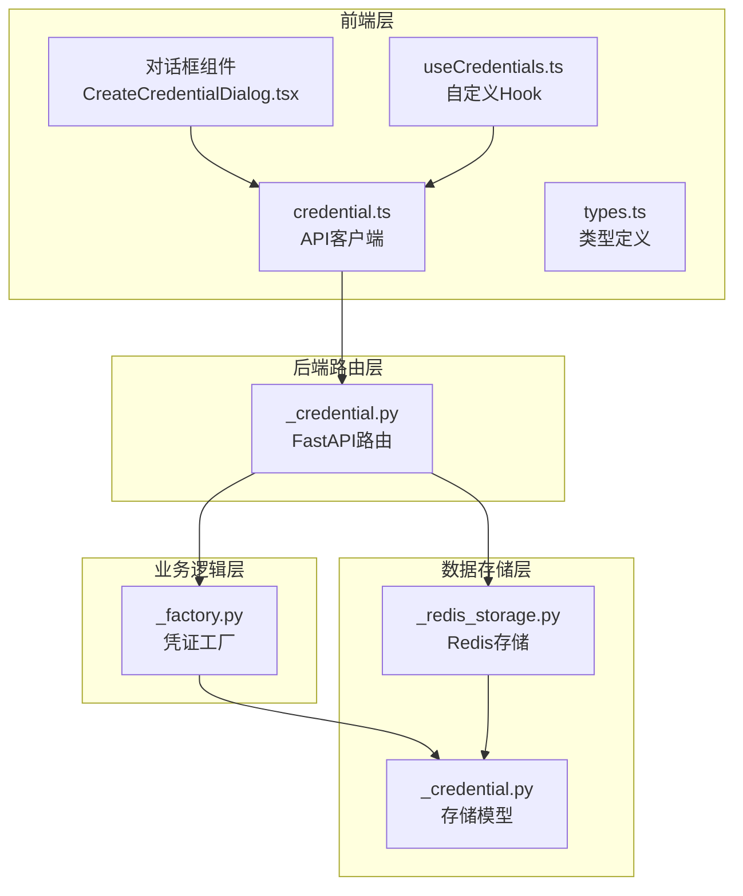
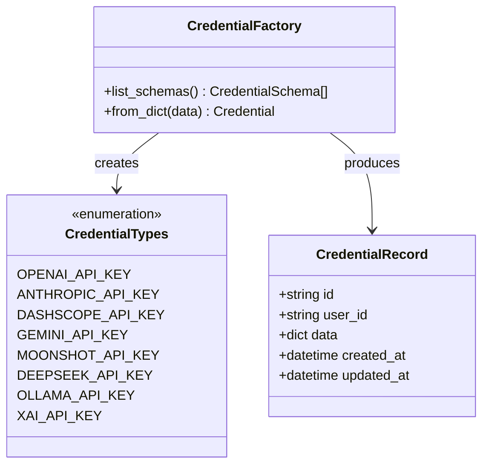
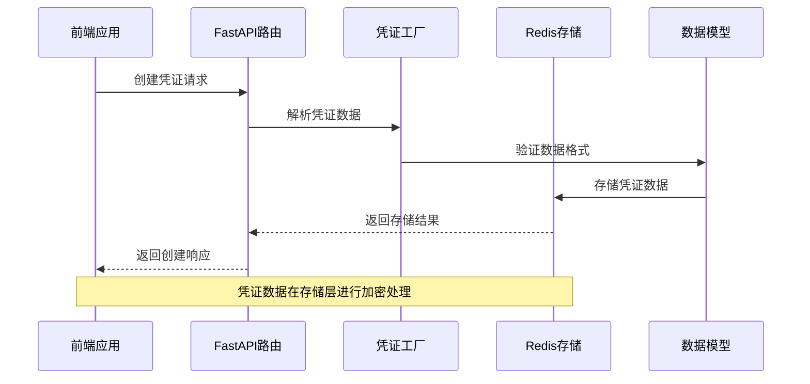
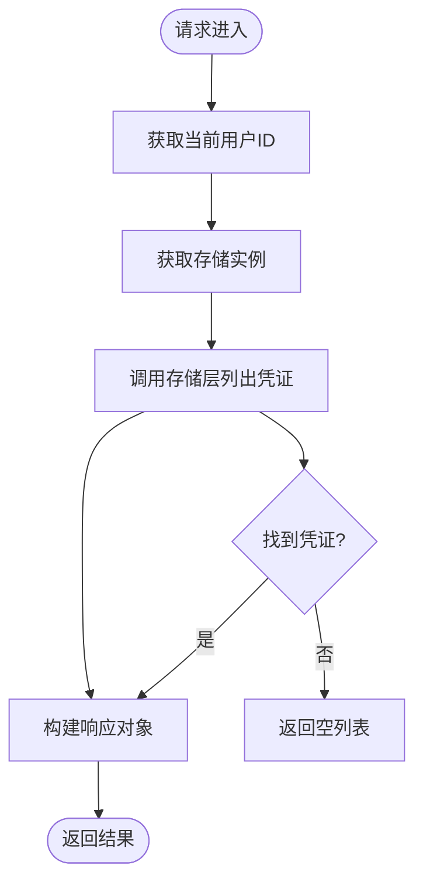
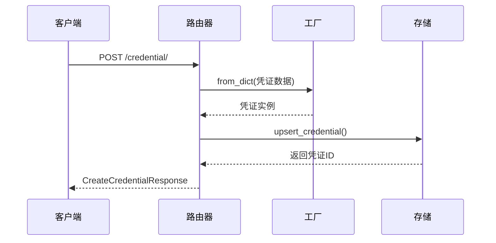
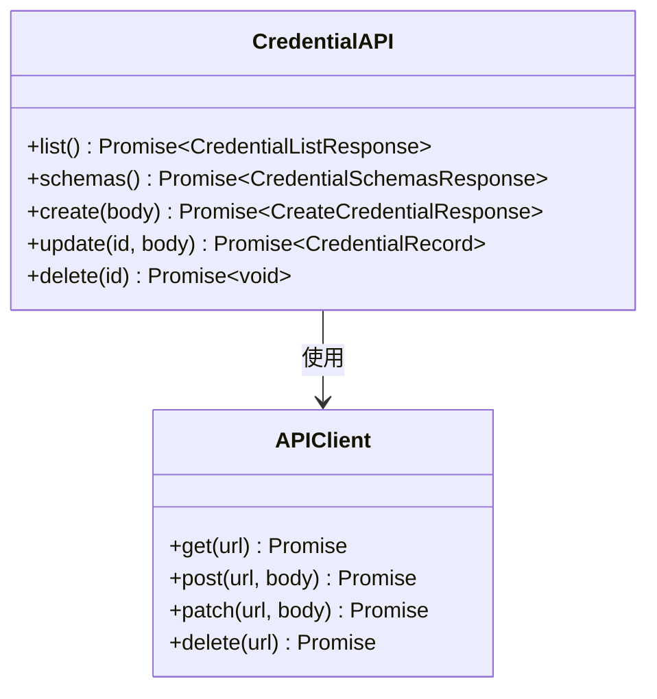
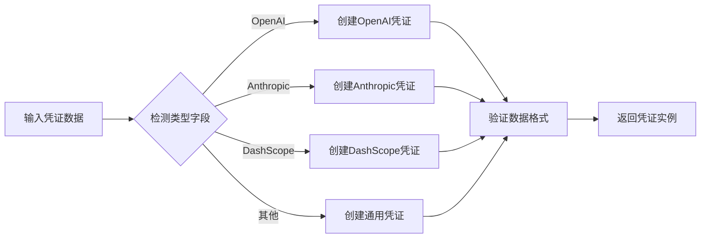
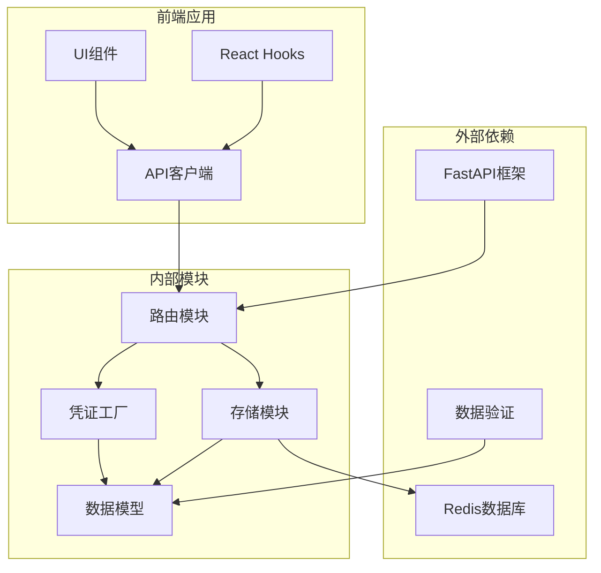

# 凭证API

<cite>
**本文档引用的文件**
- [credential.ts](file://examples/web_ui/frontend/src/api/credential.ts)
- [_credential.py](file://src/agentscope/app/_router/_credential.py)
- [_factory.py](file://src/agentscope/credential/_factory.py)
- [_redis_storage.py](file://src/agentscope/app/storage/_redis_storage.py)
- [_credential.py](file://src/agentscope/app/storage/_model/_credential.py)
- [types.ts](file://examples/web_ui/frontend/src/api/types.ts)
- [useCredentials.ts](file://examples/web_ui/frontend/src/hooks/useCredentials.ts)
- [CreateCredentialDialog.tsx](file://examples/web_ui/frontend/src/components/dialog/CreateCredentialDialog.tsx)
- [EditCredentialDialog.tsx](file://examples/web_ui/frontend/src/components/dialog/EditCredentialDialog.tsx)
</cite>

## 目录
1. [简介](#简介)
2. [项目结构](#项目结构)
3. [核心组件](#核心组件)
4. [架构概览](#架构概览)
5. [详细组件分析](#详细组件分析)
6. [依赖关系分析](#依赖关系分析)
7. [性能考虑](#性能考虑)
8. [故障排除指南](#故障排除指南)
9. [结论](#结论)

## 简介

凭证API是Agentscope平台中用于管理各种认证凭证的核心服务模块。该API提供了完整的凭证生命周期管理功能，包括凭证的创建、查询、更新和删除操作。系统支持多种类型的凭证，涵盖主流AI模型提供商的API密钥以及第三方服务认证。

凭证API采用现代化的Web服务架构，基于FastAPI构建RESTful接口，并通过Redis实现高性能的凭证存储。前端使用React和TypeScript开发，提供直观的用户界面来管理各种凭证类型。

## 项目结构

凭证API相关的代码分布在以下关键位置：



**图表来源**
- [credential.ts:1-23](file://examples/web_ui/frontend/src/api/credential.ts#L1-L23)
- [_credential.py:1-164](file://src/agentscope/app/_router/_credential.py#L1-L164)
- [_factory.py](file://src/agentscope/credential/_factory.py)

**章节来源**
- [credential.ts:1-23](file://examples/web_ui/frontend/src/api/credential.ts#L1-L23)
- [_credential.py:1-164](file://src/agentscope/app/_router/_credential.py#L1-L164)

## 核心组件

### API端点定义

凭证API提供四个核心REST端点，遵循标准的CRUD操作模式：

| 端点 | 方法 | 功能描述 | 响应类型 |
|------|------|----------|----------|
| `/credential/schemas` | GET | 获取所有凭证类型的JSON Schema定义 | ListCredentialSchemasResponse |
| `/credential/` | GET | 列出当前用户的所有凭证 | ListCredentialsResponse |
| `/credential/` | POST | 创建新的凭证 | CreateCredentialResponse |
| `/credential/{credential_id}` | PATCH | 更新指定凭证 | CredentialRecord |
| `/credential/{credential_id}` | DELETE | 删除指定凭证 | 204 No Content |

### 支持的凭证类型

系统通过凭证工厂模式支持多种凭证类型，每种类型都有特定的配置要求和用途：



**图表来源**
- [_factory.py](file://src/agentscope/credential/_factory.py)
- [_credential.py](file://src/agentscope/app/storage/_model/_credential.py)

**章节来源**
- [_credential.py:23-36](file://src/agentscope/app/_router/_credential.py#L23-L36)
- [_factory.py](file://src/agentscope/credential/_factory.py)

## 架构概览

凭证API采用分层架构设计，确保了良好的可维护性和扩展性：



**图表来源**
- [_credential.py:73-92](file://src/agentscope/app/_router/_credential.py#L73-L92)
- [_redis_storage.py:237-277](file://src/agentscope/app/storage/_redis_storage.py#L237-L277)

### 数据流处理

凭证数据在系统中的流转过程如下：

1. **前端请求**：用户通过Web界面提交凭证信息
2. **路由处理**：FastAPI路由接收并验证请求参数
3. **工厂解析**：凭证工厂根据类型解析和验证数据
4. **存储处理**：Redis存储层进行数据持久化
5. **响应返回**：系统返回标准化的响应结果

**章节来源**
- [_credential.py:73-135](file://src/agentscope/app/_router/_credential.py#L73-L135)
- [_redis_storage.py:237-308](file://src/agentscope/app/storage/_redis_storage.py#L237-L308)

## 详细组件分析

### 后端路由实现

#### 凭证列表端点


**图表来源**
- [_credential.py:44-64](file://src/agentscope/app/_router/_credential.py#L44-L64)

#### 凭证创建流程


**图表来源**
- [_credential.py:73-92](file://src/agentscope/app/_router/_credential.py#L73-L92)

**章节来源**
- [_credential.py:23-164](file://src/agentscope/app/_router/_credential.py#L23-L164)

### 前端API客户端

前端使用统一的API客户端封装所有凭证操作：



**图表来源**
- [credential.ts:11-22](file://examples/web_ui/frontend/src/api/credential.ts#L11-L22)

**章节来源**
- [credential.ts:1-23](file://examples/web_ui/frontend/src/api/credential.ts#L1-L23)

### 凭证工厂模式

凭证工厂负责根据凭证类型动态创建相应的凭证实例：



**图表来源**
- [_factory.py](file://src/agentscope/credential/_factory.py)

**章节来源**
- [_factory.py](file://src/agentscope/credential/_factory.py)

### 存储层实现

#### Redis存储架构
```mermaid
graph TB
subgraph "Redis数据结构"
IndexSet[凭证索引集合<br/>credential_index:{user_id}]
CredentialKey[凭证数据键<br/>credential:{user_id}:{credential_id}]
end
subgraph "数据持久化"
TTL[过期时间设置]
Encryption[数据加密]
Backup[备份策略]
end
IndexSet --> TTL
CredentialKey --> Encryption
Encryption --> Backup
```

**图表来源**
- [_redis_storage.py:266-277](file://src/agentscope/app/storage/_redis_storage.py#L266-L277)

**章节来源**
- [_redis_storage.py:237-317](file://src/agentscope/app/storage/_redis_storage.py#L237-L317)

## 依赖关系分析

凭证API的依赖关系体现了清晰的分层架构：



**图表来源**
- [_credential.py:1-20](file://src/agentscope/app/_router/_credential.py#L1-L20)
- [_redis_storage.py:1-50](file://src/agentscope/app/storage/_redis_storage.py#L1-L50)

**章节来源**
- [_credential.py:1-20](file://src/agentscope/app/_router/_credential.py#L1-L20)
- [_redis_storage.py:1-50](file://src/agentscope/app/storage/_redis_storage.py#L1-L50)

## 性能考虑

### 缓存策略
- **Redis缓存**：使用Redis作为主要存储，提供毫秒级响应时间
- **连接池管理**：合理配置Redis连接池大小，避免连接泄漏
- **TTL过期**：为凭证数据设置合理的过期时间，防止内存泄漏

### 并发处理
- **异步操作**：所有存储操作采用异步模式，提高并发性能
- **用户隔离**：通过用户ID隔离凭证数据，避免跨用户访问
- **乐观锁**：使用Redis的原子操作确保数据一致性

## 故障排除指南

### 常见错误及解决方案

| 错误类型 | 错误码 | 可能原因 | 解决方案 |
|----------|--------|----------|----------|
| 凭证不存在 | 404 | 凭证ID错误或已被删除 | 检查凭证ID有效性 |
| 权限不足 | 403 | 用户无权访问目标凭证 | 验证用户身份和权限 |
| 数据验证失败 | 422 | 凭证数据格式不正确 | 检查JSON Schema验证 |
| 存储异常 | 500 | Redis连接失败 | 检查Redis服务状态 |

### 调试建议
1. **启用详细日志**：在开发环境中启用详细的API日志
2. **监控指标**：使用Prometheus监控Redis性能指标
3. **错误追踪**：集成Sentry进行错误追踪和报告

**章节来源**
- [_credential.py:121-164](file://src/agentscope/app/_router/_credential.py#L121-L164)

## 结论

凭证API提供了完整、安全、高效的凭证管理解决方案。通过采用现代的Web技术栈和最佳实践，系统确保了：

- **安全性**：通过加密存储和严格的访问控制保护敏感信息
- **可扩展性**：模块化的架构设计支持新凭证类型的快速添加
- **易用性**：直观的前端界面和标准化的API接口
- **可靠性**：完善的错误处理和监控机制

该系统为Agentscope平台的各类AI服务集成提供了坚实的基础，支持多供应商的API密钥管理和第三方服务认证，满足了现代AI应用对凭证管理的各种需求。