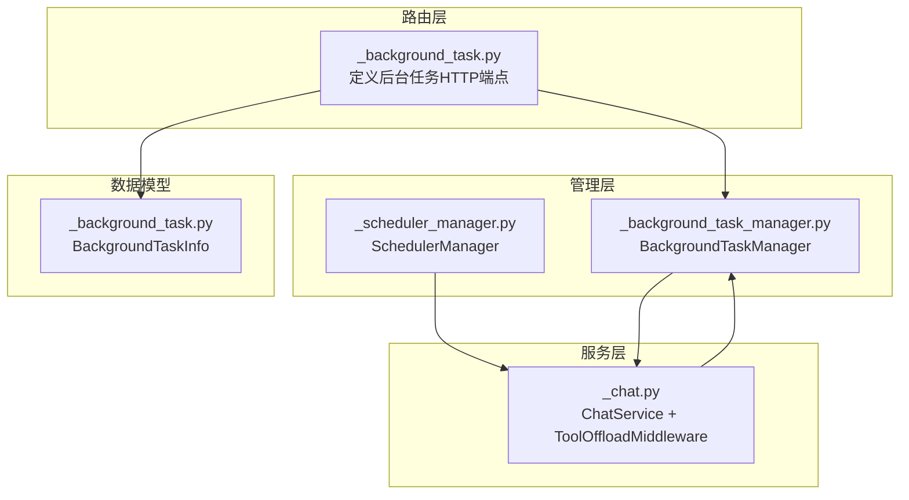
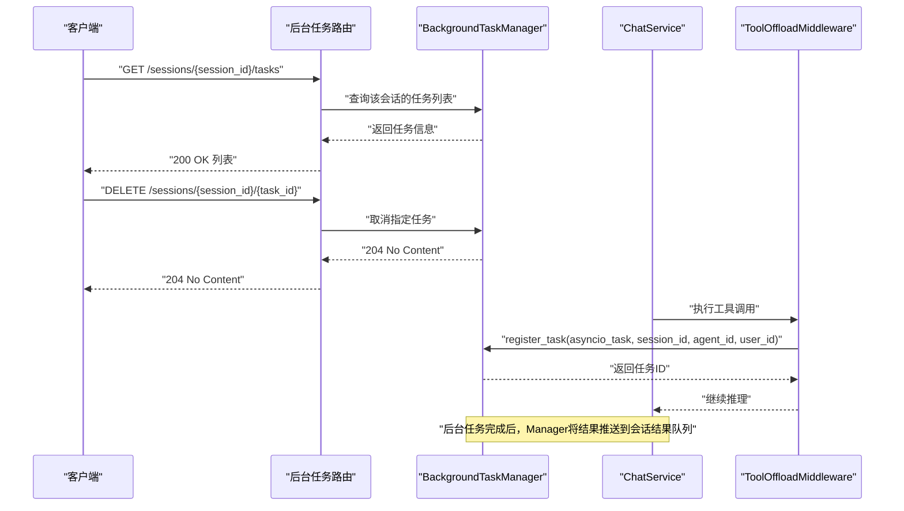
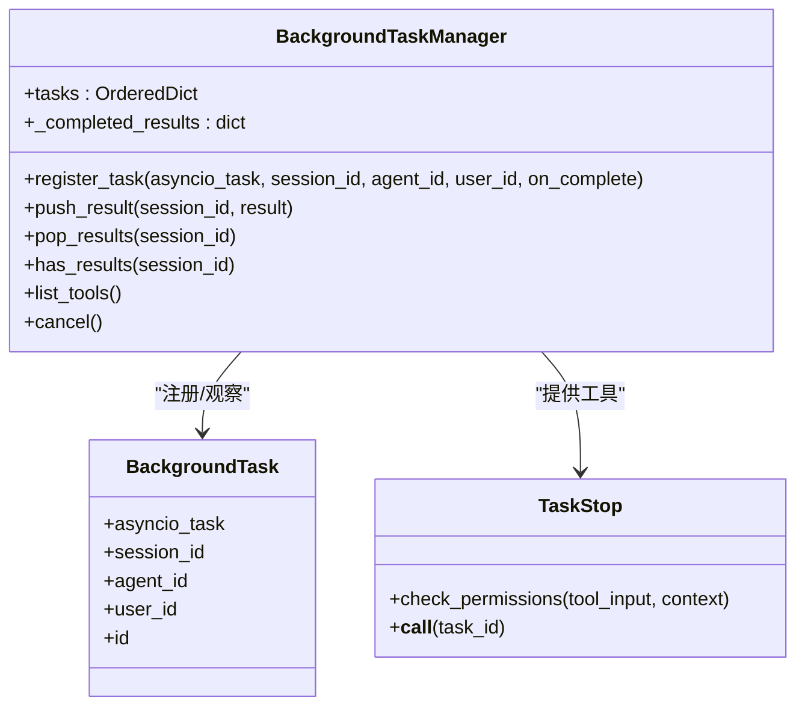
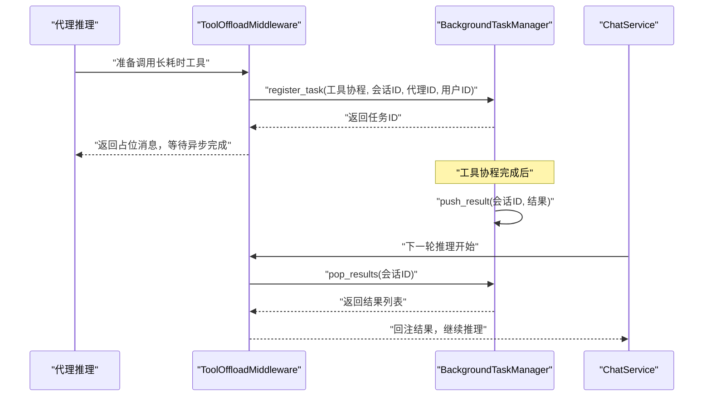
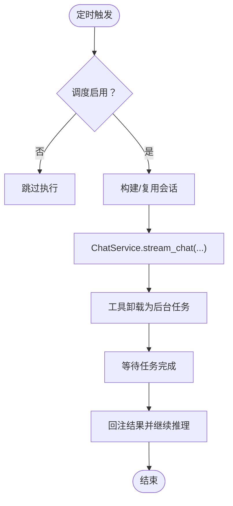
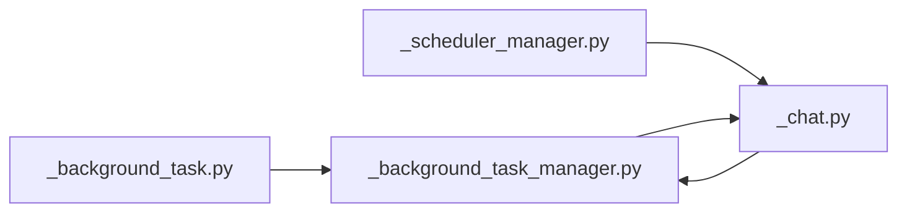

# 后台任务API

<cite>
**本文档引用的文件**
- [background_task.py](file://src/agentscope/app/_router/_background_task.py)
- [_background_task_manager.py](file://src/agentscope/app/_manager/_background_task_manager.py)
- [_background_task.py](file://src/agentscope/app/_schema/_background_task.py)
- [_chat.py](file://src/agentscope/app/_service/_chat.py)
- [_scheduler_manager.py](file://src/agentscope/app/_manager/_scheduler/_scheduler_manager.py)
- [_task_update.py](file://src/agentscope/tool/_task/_update_task.py)
- [task_tool_test.py](file://tests/task_tool_test.py)
- [toolkit_task_test.py](file://tests/toolkit_task_test.py)
</cite>

## 目录
1. [简介](#简介)
2. [项目结构](#项目结构)
3. [核心组件](#核心组件)
4. [架构总览](#架构总览)
5. [详细组件分析](#详细组件分析)
6. [依赖关系分析](#依赖关系分析)
7. [性能考虑](#性能考虑)
8. [故障排除指南](#故障排除指南)
9. [结论](#结论)

## 简介
本文件系统性梳理后台任务API的设计与实现，覆盖以下方面：
- 异步任务管理端点：任务创建、状态查询、结果获取、取消操作
- 任务队列与调度机制：基于 asyncio 的注册与观察、基于 APScheduler 的定时触发
- 任务状态与生命周期：pending → in_progress → completed 的状态流转
- 结果存储与清理策略：按会话聚合完成结果，消费后清理
- 任务优先级与并发控制：当前实现未暴露显式优先级字段，遵循会话内串行与工具卸载中间件的并发模型
- 监控与错误重试：日志记录、异常捕获与恢复、调度器容错

## 项目结构
后台任务能力由三层协同构成：
- 路由层：定义HTTP端点，负责请求解析与鉴权
- 管理层：维护任务注册表、结果存储、任务取消
- 服务层：在聊天流程中通过中间件实现工具卸载与结果回注

图表来源
- [background_task.py:11-79](file://src/agentscope/app/_router/_background_task.py#L11-L79)
- [_background_task_manager.py:151-335](file://src/agentscope/app/_manager/_background_task_manager.py#L151-L335)
- [_chat.py:30-238](file://src/agentscope/app/_service/_chat.py#L30-L238)
- [_scheduler_manager.py:24-423](file://src/agentscope/app/_manager/_scheduler/_scheduler_manager.py#L24-L423)
- [_background_task.py](file://src/agentscope/app/_schema/_background_task.py)

章节来源
- [background_task.py:11-79](file://src/agentscope/app/_router/_background_task.py#L11-L79)
- [_background_task_manager.py:151-335](file://src/agentscope/app/_manager/_background_task_manager.py#L151-L335)
- [_chat.py:30-238](file://src/agentscope/app/_service/_chat.py#L30-L238)
- [_scheduler_manager.py:24-423](file://src/agentscope/app/_manager/_scheduler/_scheduler_manager.py#L24-L423)

## 核心组件
- 路由器：提供后台任务的HTTP接口（列表、取消）
- 管理器：维护运行中的后台任务、注册/观察任务生命周期、存储完成结果、支持全局取消
- 服务与中间件：在聊天执行过程中将长耗时工具卸载为后台任务，并在完成后回注结果
- 调度器：基于 APScheduler 的定时触发，支持状态化/非状态化会话

章节来源
- [background_task.py:11-79](file://src/agentscope/app/_router/_background_task.py#L11-L79)
- [_background_task_manager.py:151-335](file://src/agentscope/app/_manager/_background_task_manager.py#L151-L335)
- [_chat.py:30-238](file://src/agentscope/app/_service/_chat.py#L30-L238)
- [_scheduler_manager.py:24-423](file://src/agentscope/app/_manager/_scheduler/_scheduler_manager.py#L24-L423)

## 架构总览
后台任务从“创建”到“完成”的关键路径如下：

图表来源
- [background_task.py:11-79](file://src/agentscope/app/_router/_background_task.py#L11-L79)
- [_background_task_manager.py:214-303](file://src/agentscope/app/_manager/_background_task_manager.py#L214-L303)
- [_chat.py:118-140](file://src/agentscope/app/_service/_chat.py#L118-L140)

## 详细组件分析

### 路由与端点
- GET /sessions/{session_id}/tasks
  - 功能：列出属于指定会话的所有后台任务及其总数
  - 返回：任务信息列表与总数
- DELETE /sessions/{session_id}/{task_id}
  - 功能：取消指定任务
  - 行为：立即取消底层 asyncio 任务；不会触发 on_complete 回调，也不会向代理上下文注入结果通知

章节来源
- [background_task.py:18-52](file://src/agentscope/app/_router/_background_task.py#L18-L52)
- [background_task.py:55-79](file://src/agentscope/app/_router/_background_task.py#L55-L79)

### 数据模型
- BackgroundTaskInfo：用于响应任务列表的轻量信息载体，包含任务ID、会话ID、代理ID等

章节来源
- [_background_task.py](file://src/agentscope/app/_schema/_background_task.py)

### 管理器：BackgroundTaskManager
职责与能力：
- 任务注册与观察：注册已运行的 asyncio 任务，自动观察完成/取消/异常，并在完成后移除注册
- 结果存储：按会话聚合完成结果，支持查询与一次性弹出
- 工具集成：提供 TaskStop 工具，允许以工具方式停止任务
- 全局关闭：应用关闭时批量取消所有任务

图表来源
- [_background_task_manager.py:21-51](file://src/agentscope/app/_manager/_background_task_manager.py#L21-L51)
- [_background_task_manager.py:151-335](file://src/agentscope/app/_manager/_background_task_manager.py#L151-L335)

章节来源
- [_background_task_manager.py:151-335](file://src/agentscope/app/_manager/_background_task_manager.py#L151-L335)

### 服务与中间件：工具卸载与结果回注
- ChatService 在每次推理循环中注入 ToolOffloadMiddleware
- 中间件将长耗时工具调用卸载为后台任务，避免阻塞主线程
- 任务完成后，管理器将结果推入会话结果队列；中间件在下一轮推理中拉取并回注结果，驱动后续动作

图表来源
- [_chat.py:118-140](file://src/agentscope/app/_service/_chat.py#L118-L140)
- [_background_task_manager.py:173-208](file://src/agentscope/app/_manager/_background_task_manager.py#L173-L208)

章节来源
- [_chat.py:30-238](file://src/agentscope/app/_service/_chat.py#L30-L238)
- [_background_task_manager.py:173-208](file://src/agentscope/app/_manager/_background_task_manager.py#L173-L208)

### 调度器：定时任务与后台任务的关系
- SchedulerManager 基于 APScheduler 定时触发 ChatService 执行
- 触发时可选择复用状态化会话或新建会话
- 触发过程中的工具调用同样可通过工具卸载中间件转为后台任务

图表来源
- [_scheduler_manager.py:95-271](file://src/agentscope/app/_manager/_scheduler/_scheduler_manager.py#L95-L271)
- [_chat.py:118-140](file://src/agentscope/app/_service/_chat.py#L118-L140)

章节来源
- [_scheduler_manager.py:24-423](file://src/agentscope/app/_manager/_scheduler/_scheduler_manager.py#L24-L423)

### 任务状态与生命周期
- 状态枚举（来自任务工具文档）：pending → in_progress → completed；使用 deleted 永久删除任务
- 生命周期要点：
  - 创建：通过工具卸载中间件注册为后台任务
  - 运行：被观察并在完成后自动清理
  - 完成：结果被推送到会话结果队列，供后续推理消费
  - 取消：DELETE 端点或 TaskStop 工具触发取消，不会调用 on_complete 回调

章节来源
- [_task_update.py:80-130](file://src/agentscope/tool/_task/_update_task.py#L80-L130)
- [background_task.py:55-79](file://src/agentscope/app/_router/_background_task.py#L55-L79)
- [_background_task_manager.py:214-303](file://src/agentscope/app/_manager/_background_task_manager.py#L214-L303)

### 结果存储与清理策略
- 存储：完成结果按会话ID聚合存储在内存队列中
- 查询：支持检查是否存在未消费结果
- 清理：一次性弹出并清空对应会话的结果队列，避免重复消费

章节来源
- [_background_task_manager.py:173-208](file://src/agentscope/app/_manager/_background_task_manager.py#L173-L208)

### 任务优先级与并发控制
- 当前实现未暴露显式优先级字段
- 并发控制：
  - 会话内推理串行推进
  - 工具卸载中间件允许将长耗时工具异步执行，避免阻塞主线程
  - 管理器对单个任务的注册/观察采用独立协程，互不阻塞

章节来源
- [_chat.py:118-140](file://src/agentscope/app/_service/_chat.py#L118-L140)
- [_background_task_manager.py:214-303](file://src/agentscope/app/_manager/_background_task_manager.py#L214-L303)

### 监控与错误重试
- 日志监控：任务注册、启动、完成、取消、异常均输出日志
- 错误处理：
  - 任务异常被捕获并记录，不影响任务注册表清理
  - 调度触发失败被捕获并记录，防止 APScheduler 移除作业
- 重试机制：未发现内置重试逻辑，建议在工具层面实现幂等与自恢复

章节来源
- [_background_task_manager.py:261-301](file://src/agentscope/app/_manager/_background_task_manager.py#L261-L301)
- [_scheduler_manager.py:264-270](file://src/agentscope/app/_manager/_scheduler/_scheduler_manager.py#L264-L270)

## 依赖关系分析
- 路由依赖管理器：列表与取消端点直接调用管理器方法
- 服务依赖中间件与管理器：中间件通过管理器注册任务并回注结果
- 调度器依赖服务：定时触发 ChatService 执行，间接产生后台任务

图表来源
- [background_task.py:11-79](file://src/agentscope/app/_router/_background_task.py#L11-L79)
- [_background_task_manager.py:151-335](file://src/agentscope/app/_manager/_background_task_manager.py#L151-L335)
- [_chat.py:30-238](file://src/agentscope/app/_service/_chat.py#L30-L238)
- [_scheduler_manager.py:24-423](file://src/agentscope/app/_manager/_scheduler/_scheduler_manager.py#L24-L423)

章节来源
- [background_task.py:11-79](file://src/agentscope/app/_router/_background_task.py#L11-L79)
- [_background_task_manager.py:151-335](file://src/agentscope/app/_manager/_background_task_manager.py#L151-L335)
- [_chat.py:30-238](file://src/agentscope/app/_service/_chat.py#L30-L238)
- [_scheduler_manager.py:24-423](file://src/agentscope/app/_manager/_scheduler/_scheduler_manager.py#L24-L423)

## 性能考虑
- 事件驱动与异步：基于 asyncio 的任务观察与结果回注，避免阻塞主线程
- 内存存储：结果按会话聚合，适合短期会话；若需持久化，可在业务侧扩展存储策略
- 调度容错：调度器捕获异常并继续运行，确保定时任务稳定性

## 故障排除指南
- 无法取消任务
  - 确认 task_id 是否正确且仍处于运行状态
  - 检查是否通过 DELETE 端点或 TaskStop 工具调用
- 任务未触发回调
  - 取消任务不会触发 on_complete 回调，属预期行为
- 结果未回注
  - 确认已完成任务的结果已被推送到管理器
  - 检查下一轮推理是否成功弹出并回注结果
- 调度未执行
  - 检查调度记录是否启用
  - 查看调度器日志确认异常被捕获与记录

章节来源
- [background_task.py:55-79](file://src/agentscope/app/_router/_background_task.py#L55-L79)
- [_background_task_manager.py:261-301](file://src/agentscope/app/_manager/_background_task_manager.py#L261-L301)
- [_scheduler_manager.py:264-270](file://src/agentscope/app/_manager/_scheduler/_scheduler_manager.py#L264-L270)

## 结论
本后台任务API以“路由-管理-服务”分层设计，结合 asyncio 的任务观察与 APScheduler 的定时触发，提供了可靠的异步任务管理能力。当前实现强调易用性与可观测性，未引入显式优先级与重试机制，建议在工具层实现幂等与自恢复，以满足生产环境的高可用需求。