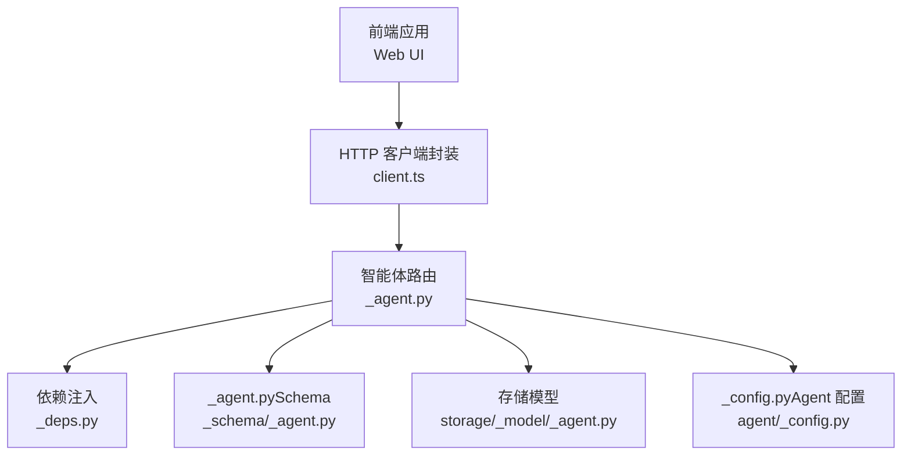
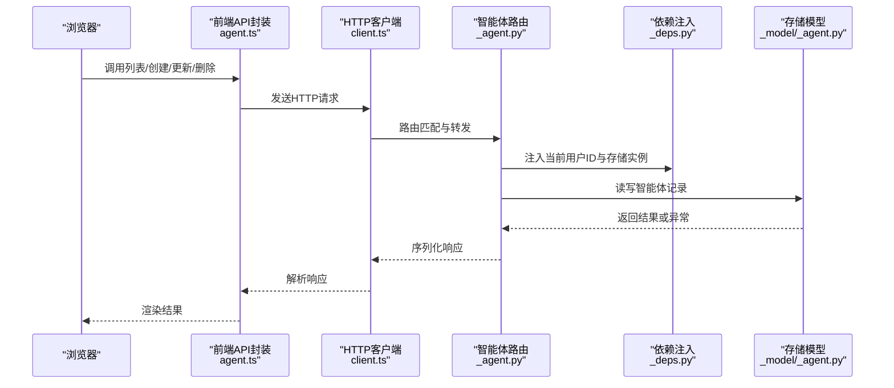
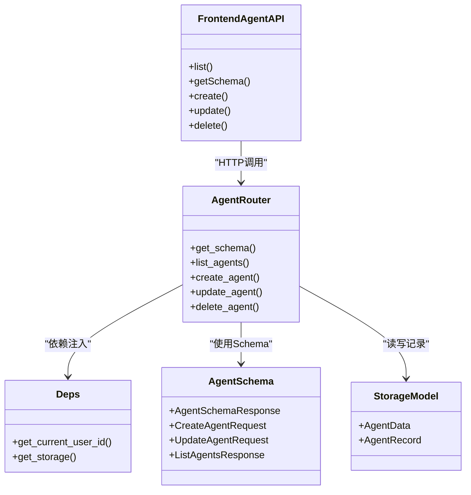

# 智能体API

<cite>
**本文引用的文件**
- [src/agentscope/app/_router/_agent.py](file://src/agentscope/app/_router/_agent.py)
- [src/agentscope/app/_schema/_agent.py](file://src/agentscope/app/_schema/_agent.py)
- [src/agentscope/app/storage/_model/_agent.py](file://src/agentscope/app/storage/_model/_agent.py)
- [src/agentscope/app/_deps.py](file://src/agentscope/app/_deps.py)
- [src/agentscope/agent/_config.py](file://src/agentscope/agent/_config.py)
- [examples/web_ui/frontend/src/api/agent.ts](file://examples/web_ui/frontend/src/api/agent.ts)
- [examples/web_ui/frontend/src/hooks/useAgentSchema.ts](file://examples/web_ui/frontend/src/hooks/useAgentSchema.ts)
- [examples/web_ui/frontend/src/components/form/AgentFormFields.tsx](file://examples/web_ui/frontend/src/components/form/AgentFormFields.tsx)
- [examples/web_ui/frontend/src/api/client.ts](file://examples/web_ui/frontend/src/api/client.ts)
- [src/agentscope/workspace/_mcp_gateway/_mcp_gateway_app.py](file://src/agentscope/workspace/_mcp_gateway/_mcp_gateway_app.py)
</cite>

## 目录
1. [简介](#简介)
2. [项目结构](#项目结构)
3. [核心组件](#核心组件)
4. [架构总览](#架构总览)
5. [详细组件分析](#详细组件分析)
6. [依赖关系分析](#依赖关系分析)
7. [性能考虑](#性能考虑)
8. [故障排除指南](#故障排除指南)
9. [结论](#结论)
10. [附录](#附录)

## 简介
本文件为智能体API的权威技术文档，覆盖智能体CRUD操作的完整端点定义与实现细节，包括：
- 获取智能体表单模式（JSON Schema）
- 列出智能体
- 创建智能体
- 更新智能体
- 删除智能体

文档同时解释智能体配置的数据结构（身份信息、上下文配置、ReAct配置）、认证与权限控制、错误处理策略以及常见问题的解决方案，并提供基于实际源码的端点规范、数据模型与调用流程图。

## 项目结构
后端采用FastAPI构建REST服务，路由集中在应用层，数据模型与存储在独立模块中，前端通过统一的HTTP客户端封装进行调用。

图表来源
- [src/agentscope/app/_router/_agent.py:1-42](file://src/agentscope/app/_router/_agent.py#L1-L42)
- [src/agentscope/app/_schema/_agent.py](file://src/agentscope/app/_schema/_agent.py)
- [src/agentscope/app/storage/_model/_agent.py](file://src/agentscope/app/storage/_model/_agent.py)
- [src/agentscope/app/_deps.py](file://src/agentscope/app/_deps.py)
- [src/agentscope/agent/_config.py](file://src/agentscope/agent/_config.py)
- [examples/web_ui/frontend/src/api/client.ts:39-84](file://examples/web_ui/frontend/src/api/client.ts#L39-L84)

章节来源
- [src/agentscope/app/_router/_agent.py:1-42](file://src/agentscope/app/_router/_agent.py#L1-L42)
- [examples/web_ui/frontend/src/api/agent.ts:1-22](file://examples/web_ui/frontend/src/api/agent.ts#L1-L22)

## 核心组件
- 路由器：提供智能体CRUD端点与表单Schema端点
- 数据模型与Schema：定义智能体配置结构与校验规则
- 存储模型：持久化智能体记录
- 依赖注入：用户认证与存储访问
- 前端API封装：统一HTTP调用与错误处理

章节来源
- [src/agentscope/app/_router/_agent.py:18-42](file://src/agentscope/app/_router/_agent.py#L18-L42)
- [src/agentscope/app/_schema/_agent.py](file://src/agentscope/app/_schema/_agent.py)
- [src/agentscope/app/storage/_model/_agent.py](file://src/agentscope/app/storage/_model/_agent.py)
- [src/agentscope/app/_deps.py](file://src/agentscope/app/_deps.py)

## 架构总览
下图展示从浏览器到后端服务的典型调用链路，包括认证、路由分发、业务处理与存储交互。

图表来源
- [examples/web_ui/frontend/src/api/agent.ts:11-22](file://examples/web_ui/frontend/src/api/agent.ts#L11-L22)
- [examples/web_ui/frontend/src/api/client.ts:39-84](file://examples/web_ui/frontend/src/api/client.ts#L39-L84)
- [src/agentscope/app/_router/_agent.py:18-42](file://src/agentscope/app/_router/_agent.py#L18-L42)
- [src/agentscope/app/_deps.py](file://src/agentscope/app/_deps.py)
- [src/agentscope/app/storage/_model/_agent.py](file://src/agentscope/app/storage/_model/_agent.py)

## 详细组件分析

### API端点规范

- 获取智能体表单Schema
  - 方法：GET
  - 路径：/agent/schema
  - 认证：需要登录（依赖注入返回当前用户ID）
  - 请求参数：无
  - 响应：AgentSchemaResponse（包含identity、context_config、react_config三段Schema片段）
  - 状态码：200 成功；404 未找到（理论上不会触发，因为该端点不查询资源）

- 列出智能体
  - 方法：GET
  - 路径：/agent/
  - 认证：需要登录
  - 查询参数：无
  - 响应：ListAgentsResponse（智能体列表与计数）
  - 状态码：200 成功；404 未找到（理论上不会触发）

- 创建智能体
  - 方法：POST
  - 路径：/agent/
  - 认证：需要登录
  - 请求体：CreateAgentRequest（包含智能体配置）
  - 响应：CreateAgentResponse（新创建的智能体记录）
  - 状态码：201 成功；400 参数无效；404 未找到（理论上不会触发）

- 更新智能体
  - 方法：PATCH
  - 路径：/agent/{agent_id}
  - 认证：需要登录
  - 路径参数：agent_id（智能体ID）
  - 请求体：UpdateAgentRequest（部分字段更新）
  - 响应：AgentRecord（更新后的智能体记录）
  - 状态码：200 成功；404 资源不存在；400 参数无效

- 删除智能体
  - 方法：DELETE
  - 路径：/agent/{agent_id}
  - 认证：需要登录
  - 路径参数：agent_id
  - 响应：无（204 No Content）
  - 状态码：204 成功；404 资源不存在

章节来源
- [src/agentscope/app/_router/_agent.py:25-42](file://src/agentscope/app/_router/_agent.py#L25-L42)
- [src/agentscope/app/_router/_agent.py:43-120](file://src/agentscope/app/_router/_agent.py#L43-L120)
- [src/agentscope/app/_router/_agent.py:121-180](file://src/agentscope/app/_router/_agent.py#L121-L180)
- [src/agentscope/app/_router/_agent.py:181-220](file://src/agentscope/app/_router/_agent.py#L181-L220)
- [src/agentscope/app/_router/_agent.py:221-240](file://src/agentscope/app/_router/_agent.py#L221-L240)

### 数据模型与JSON Schema

- 智能体Schema响应（AgentSchemaResponse）
  - 结构：包含三个字段
    - identity：身份信息相关Schema片段
    - context_config：上下文配置相关Schema片段
    - react_config：ReAct配置相关Schema片段
  - 用途：前端用于渲染“创建/编辑”表单

- 智能体记录（AgentRecord）
  - 字段：id、name、description、config（包含context_config与react_config）、create_time、update_time等
  - 来源：存储模型AgentData的序列化结果

- 请求与响应类型
  - CreateAgentRequest：创建时的输入结构
  - CreateAgentResponse：创建成功后的输出结构
  - UpdateAgentRequest：更新时的输入结构
  - ListAgentsResponse：列表查询的输出结构

章节来源
- [src/agentscope/app/_router/_agent.py:30-42](file://src/agentscope/app/_router/_agent.py#L30-L42)
- [src/agentscope/app/_schema/_agent.py](file://src/agentscope/app/_schema/_agent.py)
- [src/agentscope/app/storage/_model/_agent.py](file://src/agentscope/app/storage/_model/_agent.py)

### 智能体配置数据结构

- 身份信息（identity）
  - 字段：name、description等（具体以Schema为准）
  - 作用：标识智能体的基本属性

- 上下文配置（context_config）
  - 字段：与消息历史、工具可用性、权限等相关的配置项
  - 作用：决定智能体在对话中的上下文行为

- ReAct配置（react_config）
  - 字段：推理与行动循环相关的参数（如是否启用、最大步数、工具选择策略等）
  - 作用：控制智能体的思考-行动-观察循环

章节来源
- [src/agentscope/app/_schema/_agent.py](file://src/agentscope/app/_schema/_agent.py)
- [src/agentscope/agent/_config.py](file://src/agentscope/agent/_config.py)

### 认证机制与权限控制

- 认证方式
  - 后端通过依赖注入获取当前用户ID（get_current_user_id），所有智能体操作均绑定到当前用户
  - 存储层按用户维度隔离数据，确保用户只能访问自己的智能体

- 权限控制
  - 用户必须登录才能访问智能体相关端点
  - 删除与更新操作会检查目标智能体是否属于当前用户（通过存储层查询与比对）

- MCP网关鉴权（补充）
  - MCP网关支持可选的Bearer Token鉴权，若配置了token则所有请求必须携带对应Token，否则返回401

章节来源
- [src/agentscope/app/_deps.py](file://src/agentscope/app/_deps.py)
- [src/agentscope/app/_router/_agent.py:7-16](file://src/agentscope/app/_router/_agent.py#L7-L16)
- [src/agentscope/workspace/_mcp_gateway/_mcp_gateway_app.py:60-75](file://src/agentscope/workspace/_mcp_gateway/_mcp_gateway_app.py#L60-L75)

### 错误处理与状态码

- 典型错误场景
  - 400：请求参数无效（如JSON格式错误、字段缺失或类型不符）
  - 404：资源不存在（如指定agent_id不存在）
  - 401：未授权（MCP网关开启Token鉴权时）
  - 204：删除成功（无内容返回）

- 前端错误处理
  - HTTP客户端封装统一解析错误响应，提取detail并弹出提示
  - 对于204状态自动返回undefined，避免额外处理

章节来源
- [examples/web_ui/frontend/src/api/client.ts:39-84](file://examples/web_ui/frontend/src/api/client.ts#L39-L84)
- [src/agentscope/workspace/_mcp_gateway/_mcp_gateway_app.py:66-71](file://src/agentscope/workspace/_mcp_gateway/_mcp_gateway_app.py#L66-L71)

### 前端集成与表单渲染

- 表单Schema加载
  - 使用自定义Hook缓存Schema，避免重复请求
  - 首次加载时发起GET /agent/schema，随后复用缓存

- 表单渲染
  - 将Schema拆分为identity/context_config/react_config三段
  - 使用通用SchemaForm组件渲染各字段，支持标签与占位符本地化

- API调用
  - 列表：GET /agent/
  - 创建：POST /agent/
  - 更新：PATCH /agent/{agent_id}
  - 删除：DELETE /agent/{agent_id}

章节来源
- [examples/web_ui/frontend/src/hooks/useAgentSchema.ts:14-38](file://examples/web_ui/frontend/src/hooks/useAgentSchema.ts#L14-L38)
- [examples/web_ui/frontend/src/components/form/AgentFormFields.tsx:33-74](file://examples/web_ui/frontend/src/components/form/AgentFormFields.tsx#L33-L74)
- [examples/web_ui/frontend/src/api/agent.ts:11-22](file://examples/web_ui/frontend/src/api/agent.ts#L11-L22)

## 依赖关系分析

图表来源
- [src/agentscope/app/_router/_agent.py:18-42](file://src/agentscope/app/_router/_agent.py#L18-L42)
- [src/agentscope/app/_deps.py](file://src/agentscope/app/_deps.py)
- [src/agentscope/app/_schema/_agent.py](file://src/agentscope/app/_schema/_agent.py)
- [src/agentscope/app/storage/_model/_agent.py](file://src/agentscope/app/storage/_model/_agent.py)
- [examples/web_ui/frontend/src/api/agent.ts:11-22](file://examples/web_ui/frontend/src/api/agent.ts#L11-L22)

章节来源
- [src/agentscope/app/_router/_agent.py:18-42](file://src/agentscope/app/_router/_agent.py#L18-L42)
- [src/agentscope/app/_deps.py](file://src/agentscope/app/_deps.py)
- [src/agentscope/app/_schema/_agent.py](file://src/agentscope/app/_schema/_agent.py)
- [src/agentscope/app/storage/_model/_agent.py](file://src/agentscope/app/storage/_model/_agent.py)
- [examples/web_ui/frontend/src/api/agent.ts:11-22](file://examples/web_ui/frontend/src/api/agent.ts#L11-L22)

## 性能考虑
- Schema缓存：前端仅首次请求一次Schema，后续复用，降低网络开销
- 204无内容：删除操作返回204，减少响应体大小
- 依赖注入：通过依赖注入避免重复初始化，提升路由处理效率
- 建议：对列表接口增加分页参数以支持大数据集场景（当前实现未包含分页参数）

## 故障排除指南
- 401 未授权
  - 检查MCP网关是否启用了Token鉴权，确认请求头Authorization值
  - 参考：[src/agentscope/workspace/_mcp_gateway/_mcp_gateway_app.py:66-71](file://src/agentscope/workspace/_mcp_gateway/_mcp_gateway_app.py#L66-L71)

- 404 资源不存在
  - 确认agent_id是否正确且属于当前用户
  - 检查存储层是否存在该记录

- 400 参数无效
  - 校验请求体是否符合对应Schema
  - 确保JSON格式正确，字段类型与范围满足要求

- 前端错误提示
  - HTTP客户端会解析响应中的detail字段并弹出Toast提示
  - 参考：[examples/web_ui/frontend/src/api/client.ts:39-84](file://examples/web_ui/frontend/src/api/client.ts#L39-L84)

章节来源
- [src/agentscope/workspace/_mcp_gateway/_mcp_gateway_app.py:66-71](file://src/agentscope/workspace/_mcp_gateway/_mcp_gateway_app.py#L66-L71)
- [examples/web_ui/frontend/src/api/client.ts:39-84](file://examples/web_ui/frontend/src/api/client.ts#L39-L84)

## 结论
本文档基于后端FastAPI路由与前端API封装，给出了智能体CRUD端点的完整规范、数据模型与调用流程。通过依赖注入与存储隔离实现了严格的权限控制，配合前端Schema缓存与统一错误处理，提供了良好的开发与使用体验。建议在后续版本中引入分页与更细粒度的权限校验，以进一步提升系统的可扩展性与安全性。

## 附录

### 端点一览与示例（基于源码）
- 获取Schema
  - 请求：GET /agent/schema
  - 响应：AgentSchemaResponse（包含identity、context_config、react_config三段Schema）
  - 示例参考：[src/agentscope/app/_router/_agent.py:30-42](file://src/agentscope/app/_router/_agent.py#L30-L42)

- 列出智能体
  - 请求：GET /agent/
  - 响应：ListAgentsResponse
  - 示例参考：[src/agentscope/app/_router/_agent.py:43-120](file://src/agentscope/app/_router/_agent.py#L43-L120)

- 创建智能体
  - 请求：POST /agent/（Body：CreateAgentRequest）
  - 响应：CreateAgentResponse
  - 示例参考：[src/agentscope/app/_router/_agent.py:121-180](file://src/agentscope/app/_router/_agent.py#L121-L180)

- 更新智能体
  - 请求：PATCH /agent/{agent_id}（Body：UpdateAgentRequest）
  - 响应：AgentRecord
  - 示例参考：[src/agentscope/app/_router/_agent.py:181-220](file://src/agentscope/app/_router/_agent.py#L181-L220)

- 删除智能体
  - 请求：DELETE /agent/{agent_id}
  - 响应：204 No Content
  - 示例参考：[src/agentscope/app/_router/_agent.py:221-240](file://src/agentscope/app/_router/_agent.py#L221-L240)

### 前端调用示例（基于源码）
- 列表/创建/更新/删除
  - 参考：[examples/web_ui/frontend/src/api/agent.ts:11-22](file://examples/web_ui/frontend/src/api/agent.ts#L11-L22)