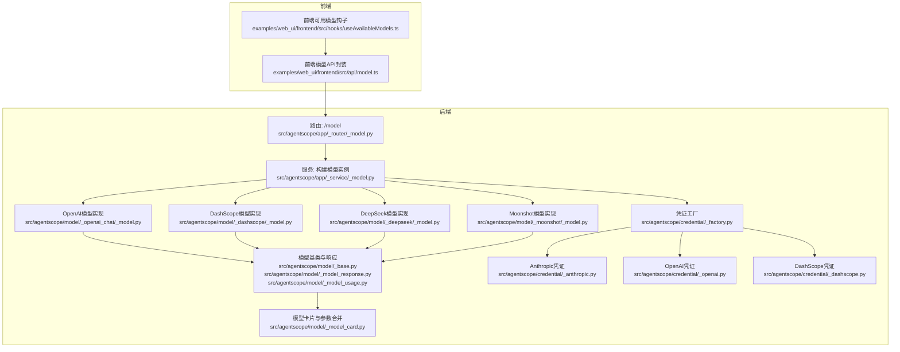
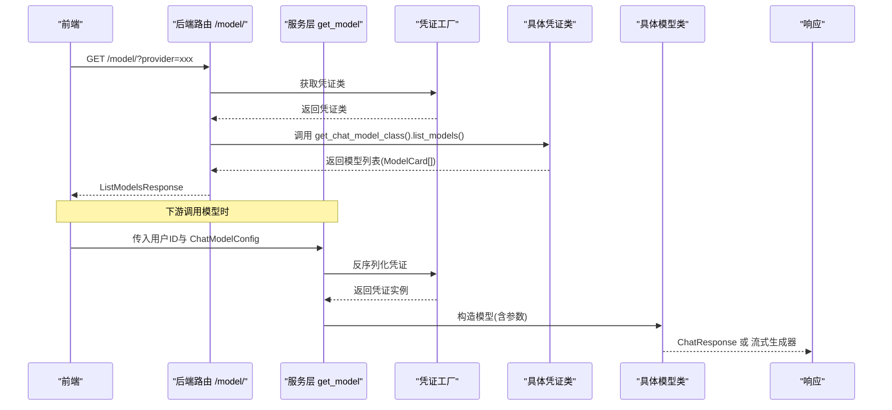
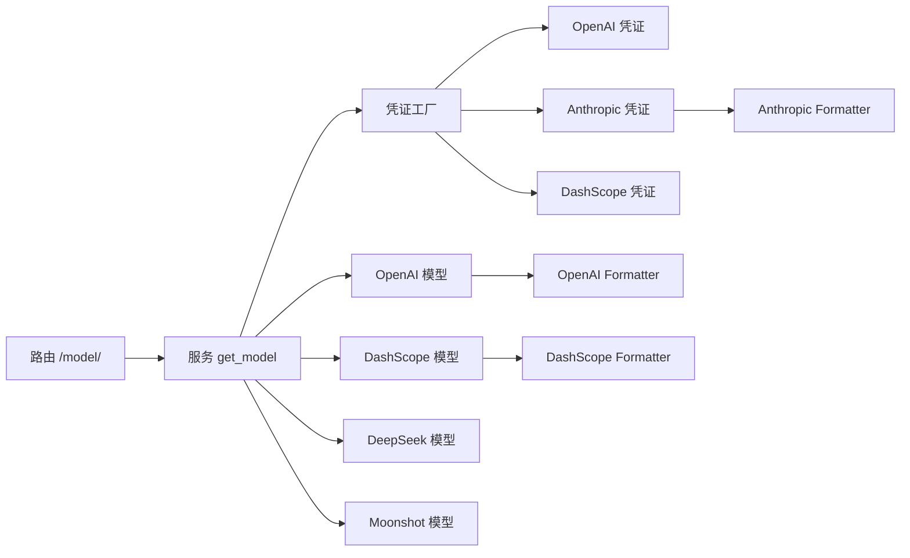

# 模型API

<cite>
**本文引用的文件**
- [src/agentscope/app/_router/_model.py](file://src/agentscope/app/_router/_model.py)
- [src/agentscope/app/_schema/_model.py](file://src/agentscope/app/_schema/_model.py)
- [src/agentscope/app/_service/_model.py](file://src/agentscope/app/_service/_model.py)
- [src/agentscope/credential/_factory.py](file://src/agentscope/credential/_factory.py)
- [src/agentscope/credential/_openai.py](file://src/agentscope/credential/_openai.py)
- [src/agentscope/credential/_anthropic.py](file://src/agentscope/credential/_anthropic.py)
- [src/agentscope/credential/_dashscope.py](file://src/agentscope/credential/_dashscope.py)
- [src/agentscope/model/__init__.py](file://src/agentscope/model/__init__.py)
- [src/agentscope/model/_base.py](file://src/agentscope/model/_base.py)
- [src/agentscope/model/_model_card.py](file://src/agentscope/model/_model_card.py)
- [src/agentscope/model/_model_response.py](file://src/agentscope/model/_model_response.py)
- [src/agentscope/model/_model_usage.py](file://src/agentscope/model/_model_usage.py)
- [src/agentscope/model/_openai_chat/_model.py](file://src/agentscope/model/_openai_chat/_model.py)
- [src/agentscope/model/_dashscope/_model.py](file://src/agentscope/model/_dashscope/_model.py)
- [src/agentscope/model/_deepseek/_model.py](file://src/agentscope/model/_deepseek/_model.py)
- [src/agentscope/model/_moonshot/_model.py](file://src/agentscope/model/_moonshot/_model.py)
- [src/agentscope/formatter/_openai_formatter.py](file://src/agentscope/formatter/_openai_formatter.py)
- [src/agentscope/formatter/_dashscope_formatter.py](file://src/agentscope/formatter/_dashscope_formatter.py)
- [src/agentscope/formatter/_anthropic_formatter.py](file://src/agentscope/formatter/_anthropic_formatter.py)
- [src/agentscope/app/storage/_redis_storage.py](file://src/agentscope/app/storage/_redis_storage.py)
- [examples/web_ui/frontend/src/api/model.ts](file://examples/web_ui/frontend/src/api/model.ts)
- [examples/web_ui/frontend/src/hooks/useAvailableModels.ts](file://examples/web_ui/frontend/src/hooks/useAvailableModels.ts)
- [CONTRIBUTING.md](file://CONTRIBUTING.md)
</cite>

## 目录
1. [简介](#简介)
2. [项目结构](#项目结构)
3. [核心组件](#核心组件)
4. [架构总览](#架构总览)
5. [详细组件分析](#详细组件分析)
6. [依赖分析](#依赖分析)
7. [性能考虑](#性能考虑)
8. [故障排查指南](#故障排查指南)
9. [结论](#结论)
10. [附录](#附录)

## 简介
本文件为 AgentScope 模型API的详细技术文档，覆盖以下内容：
- 模型管理端点：模型列表查询、模型配置获取与模型调用接口
- 支持的模型提供商与模型规格：OpenAI、Anthropic、DashScope、DeepSeek、Gemini、Moonshot、Ollama、xAI
- 模型配置参数说明：温度、最大令牌数、推理模式等
- 请求与响应格式：消息块类型、流式与非流式响应、用量统计
- 计费与配额管理：基于令牌用量的统计与可扩展的计量接口
- 认证与密钥配置：各提供商的API密钥与基础URL配置

## 项目结构
模型API相关的核心模块分布于后端路由、服务层、凭证工厂、模型实现与前端API封装中。下图展示与“模型”相关的模块关系。

图表来源
- [src/agentscope/app/_router/_model.py:1-41](file://src/agentscope/app/_router/_model.py#L1-L41)
- [src/agentscope/app/_service/_model.py:1-51](file://src/agentscope/app/_service/_model.py#L1-L51)
- [src/agentscope/credential/_factory.py:1-115](file://src/agentscope/credential/_factory.py#L1-L115)
- [src/agentscope/model/_base.py:1-600](file://src/agentscope/model/_base.py#L1-L600)
- [src/agentscope/model/_model_card.py:1-150](file://src/agentscope/model/_model_card.py#L1-L150)
- [src/agentscope/model/_openai_chat/_model.py:178-218](file://src/agentscope/model/_openai_chat/_model.py#L178-L218)
- [src/agentscope/model/_dashscope/_model.py:160-181](file://src/agentscope/model/_dashscope/_model.py#L160-L181)
- [src/agentscope/model/_deepseek/_model.py:173-213](file://src/agentscope/model/_deepseek/_model.py#L173-L213)
- [src/agentscope/model/_moonshot/_model.py:209-373](file://src/agentscope/model/_moonshot/_model.py#L209-L373)
- [src/agentscope/credential/_openai.py:1-49](file://src/agentscope/credential/_openai.py#L1-L49)
- [src/agentscope/credential/_anthropic.py:1-40](file://src/agentscope/credential/_anthropic.py#L1-L40)
- [src/agentscope/credential/_dashscope.py:1-43](file://src/agentscope/credential/_dashscope.py#L1-L43)
- [examples/web_ui/frontend/src/api/model.ts:1-6](file://examples/web_ui/frontend/src/api/model.ts#L1-L6)
- [examples/web_ui/frontend/src/hooks/useAvailableModels.ts:1-55](file://examples/web_ui/frontend/src/hooks/useAvailableModels.ts#L1-L55)

章节来源
- [src/agentscope/app/_router/_model.py:1-41](file://src/agentscope/app/_router/_model.py#L1-L41)
- [src/agentscope/app/_service/_model.py:1-51](file://src/agentscope/app/_service/_model.py#L1-L51)
- [src/agentscope/credential/_factory.py:1-115](file://src/agentscope/credential/_factory.py#L1-L115)
- [examples/web_ui/frontend/src/api/model.ts:1-6](file://examples/web_ui/frontend/src/api/model.ts#L1-L6)
- [examples/web_ui/frontend/src/hooks/useAvailableModels.ts:1-55](file://examples/web_ui/frontend/src/hooks/useAvailableModels.ts#L1-L55)

## 核心组件
- 路由与端点
  - GET /model/：根据提供商类型返回可用模型列表
- 服务层
  - 从存储读取凭证，反序列化为具体凭证类型，构建对应聊天模型实例
- 凭证工厂
  - 注册内置凭证类型，按 discriminator 字段动态选择具体凭证类
- 模型基类与响应
  - 统一的聊天响应结构、结构化响应结构与用量统计
- 模型卡片
  - 合并模型YAML配置与参数类JSON Schema，自动注入最大输出限制与隐藏参数
- 前端API封装
  - 提供模型列表查询的前端调用方法

章节来源
- [src/agentscope/app/_router/_model.py:16-41](file://src/agentscope/app/_router/_model.py#L16-L41)
- [src/agentscope/app/_service/_model.py:10-51](file://src/agentscope/app/_service/_model.py#L10-L51)
- [src/agentscope/credential/_factory.py:36-115](file://src/agentscope/credential/_factory.py#L36-L115)
- [src/agentscope/model/_model_response.py:19-76](file://src/agentscope/model/_model_response.py#L19-L76)
- [src/agentscope/model/_model_usage.py:9-32](file://src/agentscope/model/_model_usage.py#L9-L32)
- [src/agentscope/model/_model_card.py:88-150](file://src/agentscope/model/_model_card.py#L88-L150)
- [examples/web_ui/frontend/src/api/model.ts:1-6](file://examples/web_ui/frontend/src/api/model.ts#L1-L6)

## 架构总览
模型API的调用链路如下：

图表来源
- [src/agentscope/app/_router/_model.py:16-41](file://src/agentscope/app/_router/_model.py#L16-L41)
- [src/agentscope/app/_service/_model.py:10-51](file://src/agentscope/app/_service/_model.py#L10-L51)
- [src/agentscope/credential/_factory.py:72-115](file://src/agentscope/credential/_factory.py#L72-L115)
- [src/agentscope/model/_base.py:1-600](file://src/agentscope/model/_base.py#L1-L600)

## 详细组件分析

### 端点定义与数据模型
- 端点
  - GET /model/
    - 查询参数：provider（提供商类型）
    - 响应体：ListModelsResponse，包含 models: ModelCard[] 与 total: int
- 数据模型
  - ListModelsRequest：provider: str
  - ListModelsResponse：models: List[ModelCard], total: int

章节来源
- [src/agentscope/app/_router/_model.py:16-41](file://src/agentscope/app/_router/_model.py#L16-L41)
- [src/agentscope/app/_schema/_model.py:9-22](file://src/agentscope/app/_schema/_model.py#L9-L22)

### 凭证与提供商
- 内置凭证类型
  - OpenAI、Anthropic、DashScope、DeepSeek、Gemini、Moonshot、Ollama、xAI
- 凭证字段
  - api_key: SecretStr
  - base_url: str | None
  - organization: str | None（OpenAI）
- 凭证工厂
  - 通过 discriminator 字段 type 识别具体凭证类
  - 提供 from_dict 反序列化与 list_schemas 动态表单

章节来源
- [src/agentscope/credential/_factory.py:36-115](file://src/agentscope/credential/_factory.py#L36-L115)
- [src/agentscope/credential/_openai.py:13-49](file://src/agentscope/credential/_openai.py#L13-L49)
- [src/agentscope/credential/_anthropic.py:13-40](file://src/agentscope/credential/_anthropic.py#L13-L40)
- [src/agentscope/credential/_dashscope.py:15-43](file://src/agentscope/credential/_dashscope.py#L15-L43)

### 模型列表与模型卡片
- 模型列表
  - 路由层根据 provider 获取凭证类，再调用其聊天模型类的 list_models() 返回 ModelCard 列表
- 模型卡片
  - 合并 YAML 配置与参数类 Schema，自动处理：
    - 输出类型不支持“思维”时移除 thinking_* 参数
    - 将 max_tokens 的 maximum 设置为 output_size
    - 应用 parameter_overrides（含 hidden 字段隐藏参数）

章节来源
- [src/agentscope/app/_router/_model.py:32-40](file://src/agentscope/app/_router/_model.py#L32-L40)
- [src/agentscope/model/_model_card.py:88-150](file://src/agentscope/model/_model_card.py#L88-L150)

### 模型调用流程与参数
- 服务层构建模型
  - 从存储读取凭证记录，反序列化为具体凭证类
  - 依据凭证类获取聊天模型类，构造模型实例并传入 model 与 parameters
- OpenAI/DashScope/DeepSeek/Moonshot 等
  - 统一在 _call_api 中格式化消息、拼装参数（如 temperature、max_tokens、top_p、tool_choice 等）
  - 支持流式与非流式两种模式
- 结构化输出
  - 基类提供 generate_structured_output 接口，内部以工具调用方式引导模型生成结构化结果

章节来源
- [src/agentscope/app/_service/_model.py:29-51](file://src/agentscope/app/_service/_model.py#L29-L51)
- [src/agentscope/model/_openai_chat/_model.py:178-218](file://src/agentscope/model/_openai_chat/_model.py#L178-L218)
- [src/agentscope/model/_dashscope/_model.py:160-181](file://src/agentscope/model/_dashscope/_model.py#L160-L181)
- [src/agentscope/model/_deepseek/_model.py:173-213](file://src/agentscope/model/_deepseek/_model.py#L173-L213)
- [src/agentscope/model/_base.py:489-527](file://src/agentscope/model/_base.py#L489-L527)

### 请求与响应格式
- 请求消息块
  - 文本块、工具调用块、思维块、数据块
- 响应结构
  - ChatResponse：content（消息块序列）、is_last（是否最终响应）、id、created_at、usage、metadata
  - StructuredResponse：content（结构化字典）、id、created_at、usage、metadata
- 流式处理
  - 非最终增量响应 is_last=false；最终响应 is_last=true，并包含完整内容与用量

章节来源
- [src/agentscope/model/_model_response.py:19-76](file://src/agentscope/model/_model_response.py#L19-L76)
- [src/agentscope/model/_moonshot/_model.py:209-373](file://src/agentscope/model/_moonshot/_model.py#L209-L373)

### 计费与配额管理
- 用量统计
  - ChatUsage：输入/输出令牌数、耗时、缓存相关统计、元数据
- 集成点
  - 各模型解析上游API返回的用量信息并封装到 ChatUsage
  - 前端可基于 ChatResponse.usage 进行展示与统计
- 扩展建议
  - 在 ChatUsage.metadata 中扩展计费维度（如模型名、提供商、会话ID），便于后端聚合与配额控制

章节来源
- [src/agentscope/model/_model_usage.py:9-32](file://src/agentscope/model/_model_usage.py#L9-L32)
- [src/agentscope/model/_moonshot/_model.py:240-244](file://src/agentscope/model/_moonshot/_model.py#L240-L244)

### 前端集成
- 模型列表
  - 前端通过 modelApi.list(provider) 调用后端 /model/?provider
- 可用模型分组
  - useAvailableModels 钩子遍历用户凭证，按凭证类型调用模型列表接口并聚合结果

章节来源
- [examples/web_ui/frontend/src/api/model.ts:1-6](file://examples/web_ui/frontend/src/api/model.ts#L1-L6)
- [examples/web_ui/frontend/src/hooks/useAvailableModels.ts:16-55](file://examples/web_ui/frontend/src/hooks/useAvailableModels.ts#L16-L55)

## 依赖分析
- 路由依赖服务层，服务层依赖凭证工厂与存储
- 凭证工厂注册内置凭证类型，按 discriminator 选择具体凭证类
- 模型实现依赖格式化器（formatter）将消息转换为各提供商API期望格式
- 模型卡片与参数类共同决定前端表单与参数校验

图表来源
- [src/agentscope/app/_router/_model.py:1-41](file://src/agentscope/app/_router/_model.py#L1-L41)
- [src/agentscope/app/_service/_model.py:1-51](file://src/agentscope/app/_service/_model.py#L1-L51)
- [src/agentscope/credential/_factory.py:1-115](file://src/agentscope/credential/_factory.py#L1-L115)
- [src/agentscope/formatter/_openai_formatter.py:1-200](file://src/agentscope/formatter/_openai_formatter.py#L1-L200)
- [src/agentscope/formatter/_dashscope_formatter.py:1-200](file://src/agentscope/formatter/_dashscope_formatter.py#L1-L200)
- [src/agentscope/formatter/_anthropic_formatter.py:1-200](file://src/agentscope/formatter/_anthropic_formatter.py#L1-L200)

章节来源
- [src/agentscope/credential/_factory.py:36-115](file://src/agentscope/credential/_factory.py#L36-L115)
- [src/agentscope/model/_openai_chat/_model.py:178-218](file://src/agentscope/model/_openai_chat/_model.py#L178-L218)
- [src/agentscope/model/_dashscope/_model.py:160-181](file://src/agentscope/model/_dashscope/_model.py#L160-L181)
- [src/agentscope/model/_deepseek/_model.py:173-213](file://src/agentscope/model/_deepseek/_model.py#L173-L213)
- [src/agentscope/model/_moonshot/_model.py:209-373](file://src/agentscope/model/_moonshot/_model.py#L209-L373)

## 性能考虑
- 流式响应
  - 优先使用流式模式以降低首字节延迟，前端可逐步渲染
- 工具调用
  - 合理设置 tool_choice 与工具Schema，减少无效重试
- 上下文裁剪
  - 根据模型卡片的 context_size 与 output_size 控制消息长度，避免超限
- 并发与连接池
  - 外部SDK客户端复用连接，避免频繁握手开销

## 故障排查指南
- 404 Not Found
  - provider 类型不存在或未注册
  - 凭证不存在或不属于当前用户
- 用量统计缺失
  - 某些提供商可能不返回用量，需检查上游SDK版本与响应字段映射
- 流式解析异常
  - 确认 is_last 标志与最终响应合并逻辑正确
- 前端模型列表为空
  - 检查凭证类型与前端按 type 分组逻辑

章节来源
- [src/agentscope/app/_router/_model.py:32-40](file://src/agentscope/app/_router/_model.py#L32-L40)
- [src/agentscope/app/_router/_credential.py:121-135](file://src/agentscope/app/_router/_credential.py#L121-L135)
- [src/agentscope/app/storage/_redis_storage.py:237-279](file://src/agentscope/app/storage/_redis_storage.py#L237-L279)

## 结论
本模型API通过统一的路由、服务层与凭证工厂，实现了对多家大模型提供商的抽象与统一封装。结合模型卡片与参数Schema，既保证了前端表单的动态渲染，也确保了参数的强约束与最大输出限制。用量统计与流式响应进一步提升了可观测性与用户体验。后续可在 ChatUsage.metadata 中扩展计费维度，完善配额与账单能力。

## 附录

### 支持的模型提供商与模型规格
- OpenAI
  - 凭证字段：api_key、organization、base_url
  - 模型实现：OpenAIChatModel、OpenAIResponseModel
  - 规格：见模型卡片与参数Schema
- Anthropic
  - 凭证字段：api_key、base_url
  - 模型实现：AnthropicChatModel
  - 规格：见模型卡片与参数Schema
- DashScope
  - 凭证字段：api_key、base_url（默认兼容OpenAI风格）
  - 模型实现：DashScopeChatModel
  - 规格：见模型卡片与参数Schema
- DeepSeek
  - 凭证字段：api_key、base_url
  - 模型实现：DeepSeekChatModel
  - 规格：见模型卡片与参数Schema
- Gemini
  - 凭证字段：api_key、base_url
  - 模型实现：GeminiChatModel
  - 规格：见模型卡片与参数Schema
- Moonshot
  - 凭证字段：api_key、base_url
  - 模型实现：MoonshotChatModel
  - 规格：见模型卡片与参数Schema
- Ollama
  - 凭证字段：base_url
  - 模型实现：OllamaChatModel
  - 规格：见模型卡片与参数Schema
- xAI
  - 凭证字段：api_key、base_url
  - 模型实现：XAIChatModel
  - 规格：见模型卡片与参数Schema

章节来源
- [src/agentscope/credential/_openai.py:13-49](file://src/agentscope/credential/_openai.py#L13-L49)
- [src/agentscope/credential/_anthropic.py:13-40](file://src/agentscope/credential/_anthropic.py#L13-L40)
- [src/agentscope/credential/_dashscope.py:15-43](file://src/agentscope/credential/_dashscope.py#L15-L43)
- [src/agentscope/model/__init__.py:8-16](file://src/agentscope/model/__init__.py#L8-L16)
- [CONTRIBUTING.md:291-341](file://CONTRIBUTING.md#L291-L341)

### 模型配置参数说明
- 通用参数
  - temperature：采样温度，范围通常为[0,2]
  - max_tokens：最大输出令牌数，受模型卡片 output_size 限制
  - top_p：核采样概率质量
- 推理/思维参数（部分模型支持）
  - thinking_enable：启用推理
  - reasoning_effort：推理努力程度（low/medium/high）
- 工具调用
  - tools：函数Schema列表
  - tool_choice：工具选择策略
- 其他
  - stream：是否流式
  - base_url：自定义API基础地址（兼容OpenAI风格）

章节来源
- [src/agentscope/model/_openai_chat/_model.py:196-218](file://src/agentscope/model/_openai_chat/_model.py#L196-L218)
- [src/agentscope/model/_deepseek/_model.py:180-213](file://src/agentscope/model/_deepseek/_model.py#L180-L213)
- [src/agentscope/model/_xai/_model.py:42-79](file://src/agentscope/model/_xai/_model.py#L42-L79)
- [src/agentscope/model/_model_card.py:88-150](file://src/agentscope/model/_model_card.py#L88-L150)

### 认证与密钥配置
- 凭证存储
  - 使用存储后端保存凭证记录，支持增删改查
- 前端表单
  - 通过 /credential/schemas 获取所有凭证类型的JSON Schema，动态渲染
- 密钥安全
  - 凭证中的敏感字段使用 SecretStr 存储，序列化时进行脱敏处理

章节来源
- [src/agentscope/app/_router/_credential.py:23-36](file://src/agentscope/app/_router/_credential.py#L23-L36)
- [src/agentscope/app/storage/_redis_storage.py:237-279](file://src/agentscope/app/storage/_redis_storage.py#L237-L279)