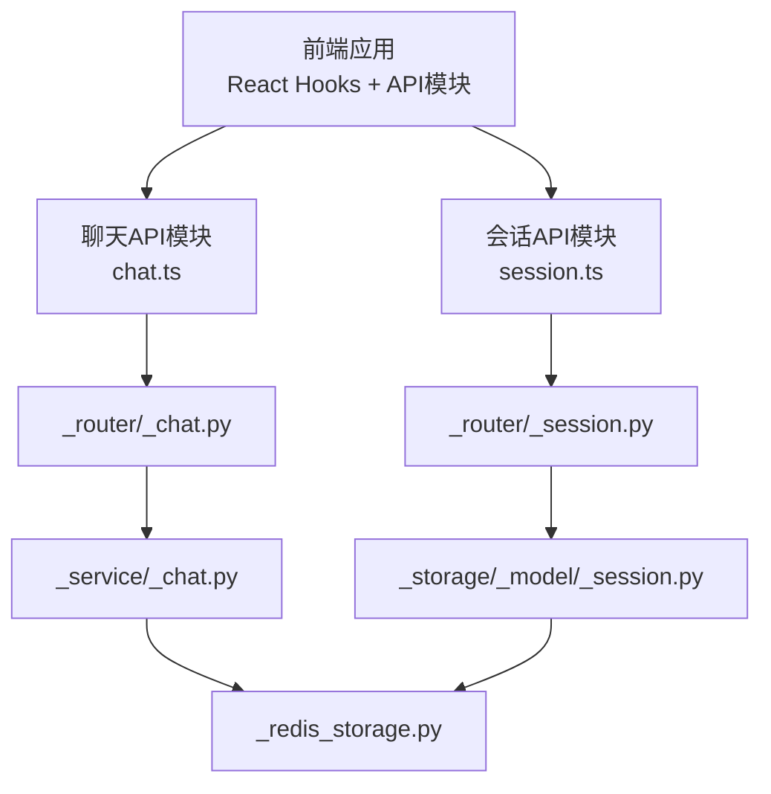
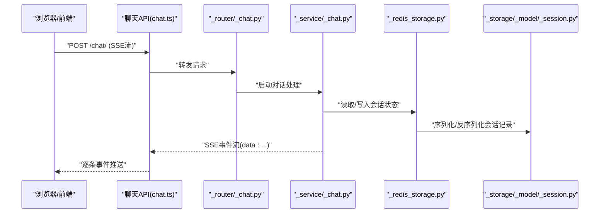
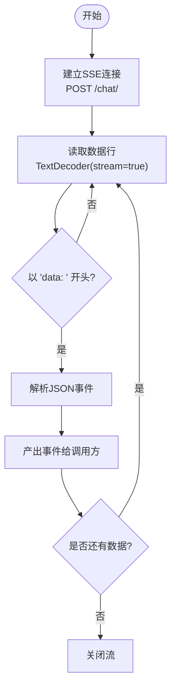
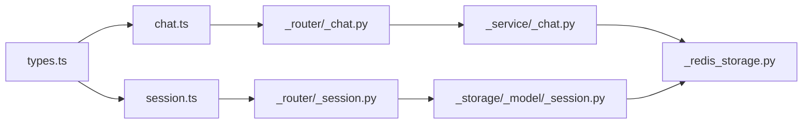

# 聊天API

<cite>
**本文引用的文件**
- [chat.ts](file://examples/web_ui/frontend/src/api/chat.ts)
- [session.ts](file://examples/web_ui/frontend/src/api/session.ts)
- [types.ts](file://examples/web_ui/frontend/src/api/types.ts)
- [_chat.py](file://src/agentscope/app/_router/_chat.py)
- [_session.py](file://src/agentscope/app/_router/_session.py)
- [_chat.py](file://src/agentscope/app/_service/_chat.py)
- [_session.py](file://src/agentscope/app/storage/_model/_session.py)
- [_redis_storage.py](file://src/agentscope/app/storage/_redis_storage.py)
- [_block.py](file://src/agentscope/message/_block.py)
- [useSessions.ts](file://examples/web_ui/frontend/src/hooks/useSessions.ts)
</cite>

## 目录
1. [简介](#简介)
2. [项目结构](#项目结构)
3. [核心组件](#核心组件)
4. [架构总览](#架构总览)
5. [详细组件分析](#详细组件分析)
6. [依赖关系分析](#依赖关系分析)
7. [性能考虑](#性能考虑)
8. [故障排查指南](#故障排查指南)
9. [结论](#结论)
10. [附录](#附录)

## 简介
本文件为聊天API的详细技术文档，覆盖以下内容：
- RESTful API端点：消息发送、历史查询、会话管理
- 实时通信（SSE）流程与事件格式
- 消息数据模型：文本消息、工具调用/结果消息、系统消息
- 会话状态管理与持久化（Redis）
- 客户端实现要点与最佳实践

## 项目结构
后端采用Python模块化路由与服务层，前端通过React Hooks与API模块对接，统一通过SSE进行流式输出。

图表来源
- [chat.ts:1-28](file://examples/web_ui/frontend/src/api/chat.ts#L1-L28)
- [session.ts:1-33](file://examples/web_ui/frontend/src/api/session.ts#L1-L33)
- [_chat.py](file://src/agentscope/app/_router/_chat.py)
- [_session.py](file://src/agentscope/app/_router/_session.py)
- [_chat.py](file://src/agentscope/app/_service/_chat.py)
- [_session.py](file://src/agentscope/app/storage/_model/_session.py)
- [_redis_storage.py](file://src/agentscope/app/storage/_redis_storage.py)

章节来源
- [chat.ts:1-28](file://examples/web_ui/frontend/src/api/chat.ts#L1-L28)
- [session.ts:1-33](file://examples/web_ui/frontend/src/api/session.ts#L1-L33)
- [_chat.py](file://src/agentscope/app/_router/_chat.py)
- [_session.py](file://src/agentscope/app/_router/_session.py)
- [_chat.py](file://src/agentscope/app/_service/_chat.py)
- [_session.py](file://src/agentscope/app/storage/_model/_session.py)
- [_redis_storage.py](file://src/agentscope/app/storage/_redis_storage.py)

## 核心组件
- 前端聊天API模块：封装SSE流式读取，解析事件数据
- 前端会话API模块：提供会话列表、创建、更新、删除、消息历史查询
- 后端聊天路由：接收聊天请求，触发服务层处理
- 后端聊天服务：执行对话逻辑，生成事件流
- 会话存储模型：定义会话记录的数据结构
- Redis存储实现：提供会话的增删改查与状态更新

章节来源
- [chat.ts:1-28](file://examples/web_ui/frontend/src/api/chat.ts#L1-L28)
- [session.ts:1-33](file://examples/web_ui/frontend/src/api/session.ts#L1-L33)
- [_chat.py](file://src/agentscope/app/_router/_chat.py)
- [_chat.py](file://src/agentscope/app/_service/_chat.py)
- [_session.py](file://src/agentscope/app/storage/_model/_session.py)
- [_redis_storage.py](file://src/agentscope/app/storage/_redis_storage.py)

## 架构总览
下图展示从浏览器到后端服务再到存储的完整链路，以及SSE事件的产生与消费。

图表来源
- [chat.ts:1-28](file://examples/web_ui/frontend/src/api/chat.ts#L1-L28)
- [_chat.py](file://src/agentscope/app/_router/_chat.py)
- [_chat.py](file://src/agentscope/app/_service/_chat.py)
- [_redis_storage.py](file://src/agentscope/app/storage/_redis_storage.py)
- [_session.py](file://src/agentscope/app/storage/_model/_session.py)

## 详细组件分析

### RESTful API 端点定义
- 聊天流式接口
  - 方法与路径：POST /chat/
  - 请求体：见“聊天请求模型”小节
  - 响应：SSE流，事件类型为“数据块”，每行以"data: "开头，后接JSON对象
- 会话管理接口
  - 列出会话：GET /sessions/?agent_id={agentId}
  - 创建会话：POST /sessions/（请求体见“会话创建模型”）
  - 更新会话：PATCH /sessions/{sessionId}（请求体见“会话更新模型”）
  - 删除会话：DELETE /sessions/{sessionId}
  - 查询消息历史：GET /sessions/{sessionId}/messages?agent_id={agentId}&offset={offset}&limit={limit}

章节来源
- [chat.ts:5-7](file://examples/web_ui/frontend/src/api/chat.ts#L5-L7)
- [session.ts:17-32](file://examples/web_ui/frontend/src/api/session.ts#L17-L32)
- [_chat.py](file://src/agentscope/app/_router/_chat.py)
- [_session.py](file://src/agentscope/app/_router/_session.py)

### 消息数据模型
- 通用消息字段
  - 角色：user、assistant、system等
  - 内容：文本块、数据块（图片/文件）、工具调用/结果、思考块、提示块
  - 元信息：时间戳、消息ID等（由后端生成或填充）
- 系统消息限制
  - 不允许包含数据块、思考块、提示块、工具调用/结果块
- 工具调用/结果
  - 工具调用块：包含工具名、输入参数、唯一标识
  - 工具结果块：包含工具返回结果、状态、关联的调用ID
- 多模态内容
  - 文本与二进制数据混合，支持图片等媒体类型

章节来源
- [_block.py](file://src/agentscope/message/_block.py)
- [types.ts](file://examples/web_ui/frontend/src/api/types.ts)

### 会话状态管理与持久化
- 会话记录结构
  - 字段：会话ID、所属用户与代理、模型配置、创建/更新时间、状态等
- Redis存储策略
  - 使用集合维护“用户-代理”的会话索引
  - 单条会话键值存储完整记录，并设置TTL
  - 支持按索引批量读取、单条读取、更新状态、删除清理
- 一致性与并发
  - 通过原子操作与键空间管理保证会话列表与记录的一致性

章节来源
- [_session.py](file://src/agentscope/app/storage/_model/_session.py)
- [_redis_storage.py](file://src/agentscope/app/storage/_redis_storage.py)

### 实时通信（SSE）流程
- 建立连接
  - 前端通过fetch获取可读流，逐行解析"data: "前缀的JSON事件
- 事件类型
  - 数据块事件：包含增量内容、工具调用/结果片段、最终完成标记
  - 错误事件：网络异常或后端错误时的终止信号
- 流控制
  - 前端在取消信号触发时中断读取；后端根据上下文生命周期结束事件流

图表来源
- [chat.ts:5-27](file://examples/web_ui/frontend/src/api/chat.ts#L5-L27)

章节来源
- [chat.ts:1-28](file://examples/web_ui/frontend/src/api/chat.ts#L1-L28)

### WebSocket 连接说明
- 当前实现采用SSE而非WebSocket
- 若需迁移至WebSocket，建议：
  - 在后端定义WS路由与连接管理器
  - 统一事件协议（与SSE事件结构保持一致）
  - 客户端侧使用标准WebSocket API，处理重连与心跳

[本节为概念性说明，不直接对应具体源码文件]

### 前端集成与最佳实践
- 使用React Hook管理会话列表与刷新
  - 变更代理ID时自动清空并重新拉取
  - 提供创建/更新/删除会话的封装函数
- 聊天流式渲染
  - 逐条事件追加到消息列表
  - 对工具调用/结果进行专门渲染
- 错误处理
  - 捕获网络异常与后端错误，显示提示并允许重试
- 性能优化
  - 避免不必要的重渲染，使用稳定引用
  - 分页加载历史消息，避免一次性传输过多数据

章节来源
- [useSessions.ts:1-50](file://examples/web_ui/frontend/src/hooks/useSessions.ts#L1-L50)
- [session.ts:1-33](file://examples/web_ui/frontend/src/api/session.ts#L1-L33)

## 依赖关系分析
- 前端API模块依赖类型定义与HTTP客户端
- 路由层负责参数校验与请求转发
- 服务层编排业务逻辑并与存储交互
- 存储层抽象于Redis，提供高可用的会话状态管理

图表来源
- [types.ts](file://examples/web_ui/frontend/src/api/types.ts)
- [chat.ts:1-28](file://examples/web_ui/frontend/src/api/chat.ts#L1-L28)
- [session.ts:1-33](file://examples/web_ui/frontend/src/api/session.ts#L1-L33)
- [_chat.py](file://src/agentscope/app/_router/_chat.py)
- [_session.py](file://src/agentscope/app/_router/_session.py)
- [_chat.py](file://src/agentscope/app/_service/_chat.py)
- [_session.py](file://src/agentscope/app/storage/_model/_session.py)
- [_redis_storage.py](file://src/agentscope/app/storage/_redis_storage.py)

## 性能考虑
- SSE vs WebSocket
  - SSE实现简单、兼容性好；WebSocket适合高频双向交互
- 流式输出
  - 后端应尽快开始发送事件，减少首字节延迟
  - 前端按事件增量渲染，避免全量重绘
- 存储访问
  - Redis键命名规范与TTL设置合理，避免内存泄漏
  - 批量读取会话列表时注意网络往返次数
- 多模态内容
  - 图片/文件建议外部存储+URL引用，减少消息体积

[本节提供一般性指导，不直接分析具体文件]

## 故障排查指南
- SSE连接失败
  - 检查后端路由是否正确映射到聊天处理器
  - 确认CORS与鉴权配置
- 事件解析错误
  - 确保事件行以"data: "开头且为合法JSON
  - 检查编码与缓冲区拼接逻辑
- 会话查询为空
  - 核对agent_id与user_id是否匹配
  - 确认会话未过期或被删除
- 工具调用失败
  - 检查工具注册与权限配置
  - 关注后端日志中的工具未找到错误

章节来源
- [chat.ts:5-27](file://examples/web_ui/frontend/src/api/chat.ts#L5-L27)
- [_redis_storage.py](file://src/agentscope/app/storage/_redis_storage.py)

## 结论
本聊天API以SSE实现低耦合的流式交互，结合Redis提供可靠的会话状态管理。通过清晰的REST端点与事件协议，既满足实时对话需求，又便于扩展多模态与工具调用能力。建议在生产环境中完善鉴权、限流与监控，并根据场景选择SSE或WebSocket。

[本节为总结性内容，不直接分析具体文件]

## 附录

### 聊天请求模型（前端类型）
- 字段概览
  - agent_id：目标代理标识
  - session_id：会话标识（可选）
  - messages：消息数组（遵循消息数据模型）
  - model_config：模型参数（如温度、最大长度等）
  - [更多字段参考前端类型定义]

章节来源
- [types.ts](file://examples/web_ui/frontend/src/api/types.ts)

### 会话创建/更新模型（前端类型）
- 创建
  - 字段：agent_id、model_config、初始名称等
- 更新
  - 字段：名称、模型配置、状态等

章节来源
- [types.ts](file://examples/web_ui/frontend/src/api/types.ts)
- [session.ts:19-22](file://examples/web_ui/frontend/src/api/session.ts#L19-L22)

### 事件类型与状态
- 事件类型
  - 数据块：增量文本、工具调用/结果片段
  - 完成：对话结束标志
- 状态管理
  - 会话状态字段用于表示运行中/已结束等
  - Redis中保存最新状态并带过期时间

章节来源
- [chat.ts:5-27](file://examples/web_ui/frontend/src/api/chat.ts#L5-L27)
- [_redis_storage.py](file://src/agentscope/app/storage/_redis_storage.py)