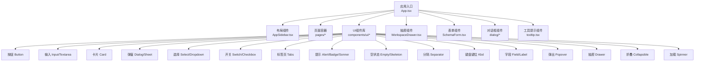
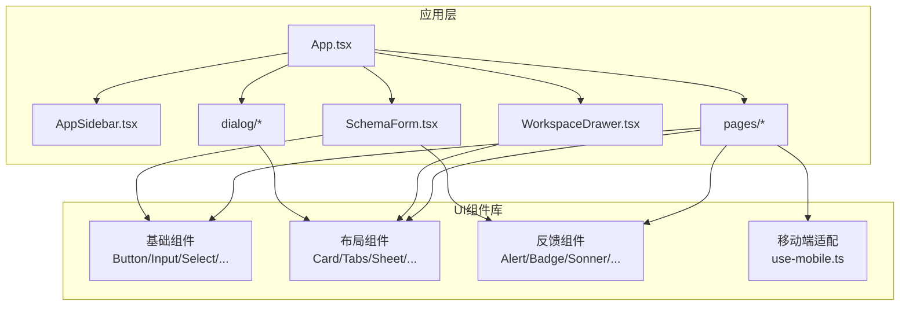
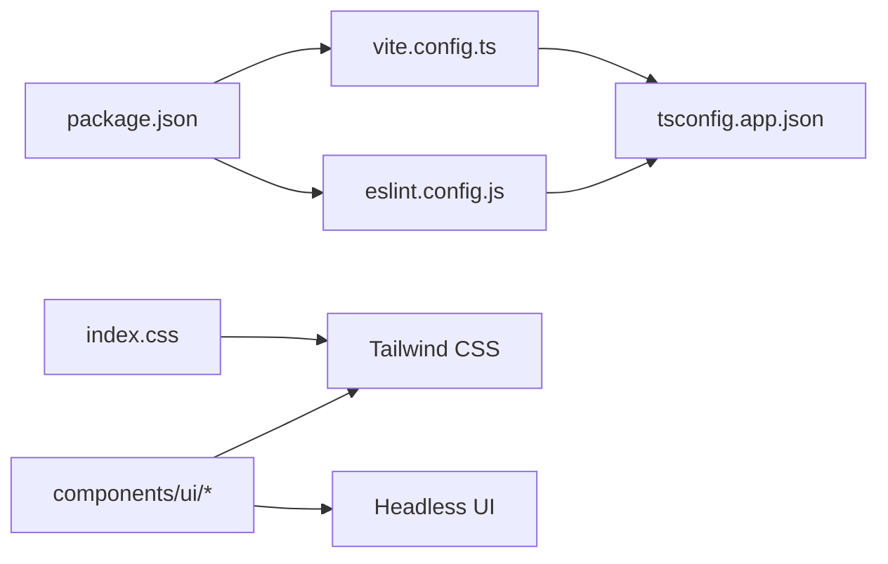

# UI组件库

<cite>
**本文引用的文件**
- [App.tsx](file://examples/web_ui/frontend/src/App.tsx)
- [index.css](file://examples/web_ui/frontend/src/index.css)
- [button.tsx](file://examples/web_ui/frontend/src/components/ui/button.tsx)
- [input.tsx](file://examples/web_ui/frontend/src/components/ui/input.tsx)
- [dialog.tsx](file://examples/web_ui/frontend/src/components/ui/dialog.tsx)
- [card.tsx](file://examples/web_ui/frontend/src/components/ui/card.tsx)
- [sidebar.tsx](file://examples/web_ui/frontend/src/components/layout/AppSidebar.tsx)
- [drawer.tsx](file://examples/web_ui/frontend/src/components/drawer/WorkspaceDrawer.tsx)
- [form.tsx](file://examples/web_ui/frontend/src/components/form/SchemaForm.tsx)
- [tabs.tsx](file://examples/web_ui/frontend/src/components/ui/tabs.tsx)
- [tooltip.tsx](file://examples/web_ui/frontend/src/components/ui/tooltip.tsx)
- [alert.tsx](file://examples/web_ui/frontend/src/components/ui/alert.tsx)
- [badge.tsx](file://examples/web_ui/frontend/src/components/ui/badge.tsx)
- [checkbox.tsx](file://examples/web_ui/frontend/src/components/ui/checkbox.tsx)
- [collapsible.tsx](file://examples/web_ui/frontend/src/components/ui/collapsible.tsx)
- [dropdown-menu.tsx](file://examples/web_ui/frontend/src/components/ui/dropdown-menu.tsx)
- [empty.tsx](file://examples/web_ui/frontend/src/components/ui/empty.tsx)
- [field.tsx](file://examples/web_ui/frontend/src/components/ui/field.tsx)
- [input-group.tsx](file://examples/web_ui/frontend/src/components/ui/input-group.tsx)
- [item.tsx](file://examples/web_ui/frontend/src/components/ui/item.tsx)
- [kbd.tsx](file://examples/web_ui/frontend/src/components/ui/kbd.tsx)
- [label.tsx](file://examples/web_ui/frontend/src/components/ui/label.tsx)
- [popover.tsx](file://examples/web_ui/frontend/src/components/ui/popover.tsx)
- [select.tsx](file://examples/web_ui/frontend/src/components/ui/select.tsx)
- [separator.tsx](file://examples/web_ui/frontend/src/components/ui/separator.tsx)
- [sheet.tsx](file://examples/web_ui/frontend/src/components/ui/sheet.tsx)
- [skeleton.tsx](file://examples/web_ui/frontend/src/components/ui/skeleton.tsx)
- [sonner.tsx](file://examples/web_ui/frontend/src/components/ui/sonner.tsx)
- [spinner.tsx](file://examples/web_ui/frontend/src/components/ui/spinner.tsx)
- [switch.tsx](file://examples/web_ui/frontend/src/components/ui/switch.tsx)
- [textarea.tsx](file://examples/web_ui/frontend/src/components/ui/textarea.tsx)
- [use-mobile.ts](file://examples/web_ui/frontend/src/hooks/use-mobile.ts)
- [useAgentSchema.ts](file://examples/web_ui/frontend/src/hooks/useAgentSchema.ts)
- [useAgents.ts](file://examples/web_ui/frontend/src/hooks/useAgents.ts)
- [useAvailableModels.ts](file://examples/web_ui/frontend/src/hooks/useAvailableModels.ts)
- [useChat.ts](file://examples/web_ui/frontend/src/hooks/useChat.ts)
- [useCredentials.ts](file://examples/web_ui/frontend/src/hooks/useCredentials.ts)
- [useMessages.ts](file://examples/web_ui/frontend/src/hooks/useMessages.ts)
- [useModels.ts](file://examples/web_ui/frontend/src/hooks/useModels.ts)
- [useSchedules.ts](file://examples/web_ui/frontend/src/hooks/useSchedules.ts)
- [useSessions.ts](file://examples/web_ui/frontend/src/hooks/useSessions.ts)
- [useSkills.ts](file://examples/web_ui/frontend/src/hooks/useSkills.ts)
- [useWorkspace.ts](file://examples/web_ui/frontend/src/hooks/useWorkspace.ts)
- [package.json](file://examples/web_ui/frontend/package.json)
- [vite.config.ts](file://examples/web_ui/frontend/vite.config.ts)
- [tsconfig.app.json](file://examples/web_ui/frontend/tsconfig.app.json)
- [eslint.config.js](file://examples/web_ui/frontend/eslint.config.js)
- [components.json](file://examples/web_ui/frontend/components.json)
</cite>

## 目录
1. [简介](#简介)
2. [项目结构](#项目结构)
3. [核心组件](#核心组件)
4. [架构总览](#架构总览)
5. [详细组件分析](#详细组件分析)
6. [依赖分析](#依赖分析)
7. [性能考虑](#性能考虑)
8. [故障排查指南](#故障排查指南)
9. [结论](#结论)
10. [附录](#附录)

## 简介
本文件为 AgentScope Web UI 组件库的系统化技术文档，聚焦于基于 Headless UI 与 Tailwind CSS 的组件设计体系，涵盖原子化设计原则、主题定制方案、组件分类与 API 设计、复用策略（组合模式、高阶组件、Hook 封装）、可访问性与跨浏览器兼容性建议，并提供使用示例与最佳实践。

## 项目结构
前端位于 examples/web_ui/frontend，采用 Vite + TypeScript + Tailwind CSS 构建，组件集中于 src/components/ui 与 src/components/layout 等目录；应用入口在 src/App.tsx，全局样式在 src/index.css 中引入 Tailwind 基础层叠与自定义变量。

图表来源
- [App.tsx:1-200](file://examples/web_ui/frontend/src/App.tsx#L1-L200)
- [AppSidebar.tsx:1-200](file://examples/web_ui/frontend/src/components/layout/AppSidebar.tsx#L1-L200)
- [WorkspaceDrawer.tsx:1-200](file://examples/web_ui/frontend/src/components/drawer/WorkspaceDrawer.tsx#L1-L200)
- [SchemaForm.tsx:1-200](file://examples/web_ui/frontend/src/components/form/SchemaForm.tsx#L1-L200)
- [button.tsx:1-200](file://examples/web_ui/frontend/src/components/ui/button.tsx#L1-L200)
- [input.tsx:1-200](file://examples/web_ui/frontend/src/components/ui/input.tsx#L1-L200)
- [dialog.tsx:1-200](file://examples/web_ui/frontend/src/components/ui/dialog.tsx#L1-L200)
- [card.tsx:1-200](file://examples/web_ui/frontend/src/components/ui/card.tsx#L1-L200)
- [sidebar.tsx:1-200](file://examples/web_ui/frontend/src/components/layout/AppSidebar.tsx#L1-L200)
- [drawer.tsx:1-200](file://examples/web_ui/frontend/src/components/drawer/WorkspaceDrawer.tsx#L1-L200)
- [form.tsx:1-200](file://examples/web_ui/frontend/src/components/form/SchemaForm.tsx#L1-L200)
- [tabs.tsx:1-200](file://examples/web_ui/frontend/src/components/ui/tabs.tsx#L1-L200)
- [tooltip.tsx:1-200](file://examples/web_ui/frontend/src/components/ui/tooltip.tsx#L1-L200)
- [alert.tsx:1-200](file://examples/web_ui/frontend/src/components/ui/alert.tsx#L1-L200)
- [badge.tsx:1-200](file://examples/web_ui/frontend/src/components/ui/badge.tsx#L1-L200)
- [checkbox.tsx:1-200](file://examples/web_ui/frontend/src/components/ui/checkbox.tsx#L1-L200)
- [collapsible.tsx:1-200](file://examples/web_ui/frontend/src/components/ui/collapsible.tsx#L1-L200)
- [dropdown-menu.tsx:1-200](file://examples/web_ui/frontend/src/components/ui/dropdown-menu.tsx#L1-L200)
- [empty.tsx:1-200](file://examples/web_ui/frontend/src/components/ui/empty.tsx#L1-L200)
- [field.tsx:1-200](file://examples/web_ui/frontend/src/components/ui/field.tsx#L1-L200)
- [input-group.tsx:1-200](file://examples/web_ui/frontend/src/components/ui/input-group.tsx#L1-L200)
- [item.tsx:1-200](file://examples/web_ui/frontend/src/components/ui/item.tsx#L1-L200)
- [kbd.tsx:1-200](file://examples/web_ui/frontend/src/components/ui/kbd.tsx#L1-L200)
- [label.tsx:1-200](file://examples/web_ui/frontend/src/components/ui/label.tsx#L1-L200)
- [popover.tsx:1-200](file://examples/web_ui/frontend/src/components/ui/popover.tsx#L1-L200)
- [select.tsx:1-200](file://examples/web_ui/frontend/src/components/ui/select.tsx#L1-L200)
- [separator.tsx:1-200](file://examples/web_ui/frontend/src/components/ui/separator.tsx#L1-L200)
- [sheet.tsx:1-200](file://examples/web_ui/frontend/src/components/ui/sheet.tsx#L1-L200)
- [skeleton.tsx:1-200](file://examples/web_ui/frontend/src/components/ui/skeleton.tsx#L1-L200)
- [sonner.tsx:1-200](file://examples/web_ui/frontend/src/components/ui/sonner.tsx#L1-L200)
- [spinner.tsx:1-200](file://examples/web_ui/frontend/src/components/ui/spinner.tsx#L1-L200)
- [switch.tsx:1-200](file://examples/web_ui/frontend/src/components/ui/switch.tsx#L1-L200)
- [textarea.tsx:1-200](file://examples/web_ui/frontend/src/components/ui/textarea.tsx#L1-L200)

章节来源
- [App.tsx:1-200](file://examples/web_ui/frontend/src/App.tsx#L1-L200)
- [index.css:1-200](file://examples/web_ui/frontend/src/index.css#L1-L200)
- [package.json:1-200](file://examples/web_ui/frontend/package.json#L1-L200)
- [vite.config.ts:1-200](file://examples/web_ui/frontend/vite.config.ts#L1-L200)
- [tsconfig.app.json:1-200](file://examples/web_ui/frontend/tsconfig.app.json#L1-L200)
- [eslint.config.js:1-200](file://examples/web_ui/frontend/eslint.config.js#L1-L200)
- [components.json:1-200](file://examples/web_ui/frontend/components.json#L1-L200)

## 核心组件
- 基础组件：按钮、输入框、文本域、选择器、开关、复选框、标签、字段、分隔线、键盘键位、空状态、骨架屏、加载指示器等。
- 布局组件：侧边栏、抽屉、卡片、标签页、弹出层、下拉菜单、抽屉式面板等。
- 复合组件：表单（SchemaForm）、对话框（含多类业务对话框）、通知（Sonner）、提示（Alert/Badge）等。

章节来源
- [button.tsx:1-200](file://examples/web_ui/frontend/src/components/ui/button.tsx#L1-L200)
- [input.tsx:1-200](file://examples/web_ui/frontend/src/components/ui/input.tsx#L1-L200)
- [textarea.tsx:1-200](file://examples/web_ui/frontend/src/components/ui/textarea.tsx#L1-L200)
- [select.tsx:1-200](file://examples/web_ui/frontend/src/components/ui/select.tsx#L1-L200)
- [switch.tsx:1-200](file://examples/web_ui/frontend/src/components/ui/switch.tsx#L1-L200)
- [checkbox.tsx:1-200](file://examples/web_ui/frontend/src/components/ui/checkbox.tsx#L1-L200)
- [label.tsx:1-200](file://examples/web_ui/frontend/src/components/ui/label.tsx#L1-L200)
- [field.tsx:1-200](file://examples/web_ui/frontend/src/components/ui/field.tsx#L1-L200)
- [separator.tsx:1-200](file://examples/web_ui/frontend/src/components/ui/separator.tsx#L1-L200)
- [kbd.tsx:1-200](file://examples/web_ui/frontend/src/components/ui/kbd.tsx#L1-L200)
- [empty.tsx:1-200](file://examples/web_ui/frontend/src/components/ui/empty.tsx#L1-L200)
- [skeleton.tsx:1-200](file://examples/web_ui/frontend/src/components/ui/skeleton.tsx#L1-L200)
- [spinner.tsx:1-200](file://examples/web_ui/frontend/src/components/ui/spinner.tsx#L1-L200)
- [card.tsx:1-200](file://examples/web_ui/frontend/src/components/ui/card.tsx#L1-L200)
- [tabs.tsx:1-200](file://examples/web_ui/frontend/src/components/ui/tabs.tsx#L1-L200)
- [popover.tsx:1-200](file://examples/web_ui/frontend/src/components/ui/popover.tsx#L1-L200)
- [dropdown-menu.tsx:1-200](file://examples/web_ui/frontend/src/components/ui/dropdown-menu.tsx#L1-L200)
- [sheet.tsx:1-200](file://examples/web_ui/frontend/src/components/ui/sheet.tsx#L1-L200)
- [drawer.tsx:1-200](file://examples/web_ui/frontend/src/components/drawer/WorkspaceDrawer.tsx#L1-L200)
- [sidebar.tsx:1-200](file://examples/web_ui/frontend/src/components/layout/AppSidebar.tsx#L1-L200)
- [form.tsx:1-200](file://examples/web_ui/frontend/src/components/form/SchemaForm.tsx#L1-L200)
- [dialog.tsx:1-200](file://examples/web_ui/frontend/src/components/ui/dialog.tsx#L1-L200)
- [alert.tsx:1-200](file://examples/web_ui/frontend/src/components/ui/alert.tsx#L1-L200)
- [badge.tsx:1-200](file://examples/web_ui/frontend/src/components/ui/badge.tsx#L1-L200)
- [sonner.tsx:1-200](file://examples/web_ui/frontend/src/components/ui/sonner.tsx#L1-L200)

## 架构总览
组件库以“原子化设计 + Headless UI + Tailwind”为核心，通过组合模式实现高内聚低耦合的 UI 组件。应用层通过布局组件组织页面结构，UI 组件库提供可复用的基础能力，业务组件（如对话框、表单）在更高层级组合基础组件完成具体功能。

图表来源
- [App.tsx:1-200](file://examples/web_ui/frontend/src/App.tsx#L1-L200)
- [AppSidebar.tsx:1-200](file://examples/web_ui/frontend/src/components/layout/AppSidebar.tsx#L1-L200)
- [WorkspaceDrawer.tsx:1-200](file://examples/web_ui/frontend/src/components/drawer/WorkspaceDrawer.tsx#L1-L200)
- [SchemaForm.tsx:1-200](file://examples/web_ui/frontend/src/components/form/SchemaForm.tsx#L1-L200)
- [button.tsx:1-200](file://examples/web_ui/frontend/src/components/ui/button.tsx#L1-L200)
- [card.tsx:1-200](file://examples/web_ui/frontend/src/components/ui/card.tsx#L1-L200)
- [tabs.tsx:1-200](file://examples/web_ui/frontend/src/components/ui/tabs.tsx#L1-L200)
- [alert.tsx:1-200](file://examples/web_ui/frontend/src/components/ui/alert.tsx#L1-L200)
- [use-mobile.ts:1-200](file://examples/web_ui/frontend/src/hooks/use-mobile.ts#L1-L200)

## 详细组件分析

### 按钮 Button
- 设计要点：基于原子化类名组合，支持尺寸、状态、形状、颜色等变体；通过 Headless UI 提供语义化交互。
- 关键属性：禁用、加载、强调、轮廓、无边框、尺寸等。
- 事件：点击回调。
- 插槽：可扩展前缀/后缀图标或文本。
- 样式定制：通过 Tailwind 变量与自定义颜色空间统一风格。

章节来源
- [button.tsx:1-200](file://examples/web_ui/frontend/src/components/ui/button.tsx#L1-L200)

### 输入 Input/Textarea
- 设计要点：统一边框、内间距、悬停/聚焦态；支持错误态、禁用态、只读态。
- 关键属性：类型、占位符、必填、错误消息、最大长度、禁用/只读。
- 事件：变更、失焦、回车。
- 插槽：前后缀图标/徽标。
- 样式定制：基于 Tailwind 原子类与变量覆盖。

章节来源
- [input.tsx:1-200](file://examples/web_ui/frontend/src/components/ui/input.tsx#L1-L200)
- [textarea.tsx:1-200](file://examples/web_ui/frontend/src/components/ui/textarea.tsx#L1-L200)

### 选择 Select/Dropdown
- 设计要点：下拉菜单与触发器解耦，支持搜索、多选、分组、清空。
- 关键属性：选项列表、默认值、可搜索、可多选、禁用、占位。
- 事件：选择变更、搜索过滤。
- 插槽：选项模板、空状态。
- 样式定制：统一动画、阴影、滚动条。

章节来源
- [select.tsx:1-200](file://examples/web_ui/frontend/src/components/ui/select.tsx#L1-L200)
- [dropdown-menu.tsx:1-200](file://examples/web_ui/frontend/src/components/ui/dropdown-menu.tsx#L1-L200)

### 开关 Switch/复选框 Checkbox
- 设计要点：触控目标尺寸符合可访问性要求；切换动画流畅。
- 关键属性：选中状态、禁用、半选（三态）。
- 事件：变更回调。
- 插槽：图标/文本。
- 样式定制：颜色与尺寸变量化。

章节来源
- [switch.tsx:1-200](file://examples/web_ui/frontend/src/components/ui/switch.tsx#L1-L200)
- [checkbox.tsx:1-200](file://examples/web_ui/frontend/src/components/ui/checkbox.tsx#L1-L200)

### 卡片 Card
- 设计要点：内容区留白、阴影与圆角；支持头部/底部操作区。
- 关键属性：标题、描述、操作按钮、禁用遮罩。
- 事件：点击、操作按钮点击。
- 插槽：头部、内容、底部。
- 样式定制：背景色、边框色、阴影深度。

章节来源
- [card.tsx:1-200](file://examples/web_ui/frontend/src/components/ui/card.tsx#L1-L200)

### 弹窗 Dialog/Sheet
- 设计要点：模态遮罩、Esc 关闭、焦点陷阱；支持右滑关闭抽屉式面板。
- 关键属性：打开/关闭、标题、宽度、可取消、遮罩点击关闭。
- 事件：确认、取消、关闭。
- 插槽：头部、主体、底部。
- 样式定制：动画缓动、z-index 层级。

章节来源
- [dialog.tsx:1-200](file://examples/web_ui/frontend/src/components/ui/dialog.tsx#L1-L200)
- [sheet.tsx:1-200](file://examples/web_ui/frontend/src/components/ui/sheet.tsx#L1-L200)

### 抽屉 Drawer
- 设计要点：从侧边滑入，支持手势关闭；适合移动端场景。
- 关键属性：方向、尺寸、遮罩、可拖拽。
- 事件：打开、关闭、拖拽进度。
- 插槽：内容区。
- 样式定制：滑动动画曲线。

章节来源
- [drawer.tsx:1-200](file://examples/web_ui/frontend/src/components/drawer/WorkspaceDrawer.tsx#L1-L200)

### 侧边栏 Sidebar
- 设计要点：固定宽度、折叠状态、响应式隐藏；与主内容区联动。
- 关键属性：展开/折叠、宽度、折叠阈值。
- 事件：折叠状态变更。
- 插槽：菜单项、品牌区。
- 样式定制：过渡时长、阴影。

章节来源
- [sidebar.tsx:1-200](file://examples/web_ui/frontend/src/components/layout/AppSidebar.tsx#L1-L200)

### 表单 SchemaForm
- 设计要点：根据 JSON Schema 动态渲染字段；支持校验、错误提示、联动。
- 关键属性：schema、初始数据、只读、禁用。
- 事件：提交、字段变更、校验结果。
- 插槽：自定义渲染器。
- 样式定制：栅格与对齐。

章节来源
- [form.tsx:1-200](file://examples/web_ui/frontend/src/components/form/SchemaForm.tsx#L1-L200)

### 标签页 Tabs
- 设计要点：内容切换与路由解耦；支持禁用、新增、关闭。
- 关键属性：当前激活、方向、可关闭。
- 事件：切换、关闭。
- 插槽：标签头、内容。
- 样式定制：分割线与滚动条。

章节来源
- [tabs.tsx:1-200](file://examples/web_ui/frontend/src/components/ui/tabs.tsx#L1-L200)

### 工具提示 Tooltip
- 设计要点：轻量提示，避免阻塞用户；支持延迟显示/隐藏。
- 关键属性：内容、位置、延迟、禁用。
- 事件：显示/隐藏。
- 插槽：触发器。
- 样式定制：背景色与字体大小。

章节来源
- [tooltip.tsx:1-200](file://examples/web_ui/frontend/src/components/ui/tooltip.tsx#L1-L200)

### 反馈组件 Alert/Badge/Sonner
- 设计要点：明确状态与优先级；通知组件需可自动消失且不打断工作流。
- 关键属性：类型（成功/警告/错误/信息）、持久化、关闭按钮。
- 事件：关闭。
- 插槽：图标、副标题。
- 样式定制：颜色语义化。

章节来源
- [alert.tsx:1-200](file://examples/web_ui/frontend/src/components/ui/alert.tsx#L1-L200)
- [badge.tsx:1-200](file://examples/web_ui/frontend/src/components/ui/badge.tsx#L1-L200)
- [sonner.tsx:1-200](file://examples/web_ui/frontend/src/components/ui/sonner.tsx#L1-L200)

### 其他辅助组件
- 字段 Field/Label：用于表单字段的标签与错误信息展示。
- 分隔 Separator：内容分区与视觉引导。
- 键盘键位 Kbd：快捷键提示。
- 空状态 Empty/Skeleton：占位与加载态。
- 弹出 Popover：上下文菜单或选择面板。
- 折叠 Collapsible：可展开/收起的内容块。
- 加载 Spinner：局部加载指示。

章节来源
- [field.tsx:1-200](file://examples/web_ui/frontend/src/components/ui/field.tsx#L1-L200)
- [label.tsx:1-200](file://examples/web_ui/frontend/src/components/ui/label.tsx#L1-L200)
- [separator.tsx:1-200](file://examples/web_ui/frontend/src/components/ui/separator.tsx#L1-L200)
- [kbd.tsx:1-200](file://examples/web_ui/frontend/src/components/ui/kbd.tsx#L1-L200)
- [empty.tsx:1-200](file://examples/web_ui/frontend/src/components/ui/empty.tsx#L1-L200)
- [skeleton.tsx:1-200](file://examples/web_ui/frontend/src/components/ui/skeleton.tsx#L1-L200)
- [popover.tsx:1-200](file://examples/web_ui/frontend/src/components/ui/popover.tsx#L1-L200)
- [collapsible.tsx:1-200](file://examples/web_ui/frontend/src/components/ui/collapsible.tsx#L1-L200)
- [spinner.tsx:1-200](file://examples/web_ui/frontend/src/components/ui/spinner.tsx#L1-L200)

## 依赖分析
- 构建与工具链：Vite、TypeScript、ESLint、Tailwind CSS 配置文件与组件集配置。
- 运行时依赖：React 生态、Headless UI（用于可访问性与状态管理）、Tailwind 原子类。
- 主题与样式：通过 Tailwind 变量与自定义颜色空间统一风格；index.css 引入基础层叠与变量。

图表来源
- [vite.config.ts:1-200](file://examples/web_ui/frontend/vite.config.ts#L1-L200)
- [tsconfig.app.json:1-200](file://examples/web_ui/frontend/tsconfig.app.json#L1-L200)
- [eslint.config.js:1-200](file://examples/web_ui/frontend/eslint.config.js#L1-L200)
- [package.json:1-200](file://examples/web_ui/frontend/package.json#L1-L200)
- [index.css:1-200](file://examples/web_ui/frontend/src/index.css#L1-L200)

章节来源
- [package.json:1-200](file://examples/web_ui/frontend/package.json#L1-L200)
- [vite.config.ts:1-200](file://examples/web_ui/frontend/vite.config.ts#L1-L200)
- [tsconfig.app.json:1-200](file://examples/web_ui/frontend/tsconfig.app.json#L1-L200)
- [eslint.config.js:1-200](file://examples/web_ui/frontend/eslint.config.js#L1-L200)
- [index.css:1-200](file://examples/web_ui/frontend/src/index.css#L1-L200)

## 性能考虑
- 原子化类名：减少重复样式定义，提升构建体积与运行时性能。
- 懒加载与动态导入：对重型组件（如复杂表单、抽屉）按需加载。
- 虚拟滚动：在长列表场景中使用虚拟化以降低 DOM 节点数量。
- 事件节流/防抖：在高频交互（搜索、滚动）中控制回调频率。
- 图片与资源优化：压缩图片、启用懒加载与合适的格式。

## 故障排查指南
- 可访问性问题：确保所有交互元素具备键盘可达性与屏幕阅读器友好标签；使用 Headless UI 的状态钩子保证焦点管理正确。
- 样式冲突：避免在组件内部硬编码样式，统一通过 Tailwind 变量与主题配置；必要时使用作用域化类名。
- 移动端适配：使用响应式断点与触摸目标尺寸；结合 use-mobile Hook 在小屏设备上切换布局（如抽屉替代侧边栏）。
- 对话框与遮罩：确保模态层 z-index 正确，Esc 关闭与遮罩点击关闭行为一致；避免滚动穿透。
- 表单校验：在 SchemaForm 中统一错误提示位置与样式，避免覆盖默认样式导致不可见。

章节来源
- [use-mobile.ts:1-200](file://examples/web_ui/frontend/src/hooks/use-mobile.ts#L1-L200)
- [dialog.tsx:1-200](file://examples/web_ui/frontend/src/components/ui/dialog.tsx#L1-L200)
- [form.tsx:1-200](file://examples/web_ui/frontend/src/components/form/SchemaForm.tsx#L1-L200)

## 结论
AgentScope UI 组件库以 Headless UI 与 Tailwind CSS 为基础，实现了高可复用、可定制、可访问的组件体系。通过原子化设计与 Hook 封装，既保证了开发效率，也兼顾了维护性与一致性。建议在实际项目中遵循本文档的 API 设计、复用策略与最佳实践，持续完善主题与无障碍能力。

## 附录

### 组件 API 设计规范
- 属性命名：使用布尔型属性表达状态（如 disabled、loading），字符串/枚举表达外观（如 variant、size）。
- 事件命名：以 onXxx 形式，区分用户交互与内部状态变化。
- 插槽：以 children 或 render props 形式暴露，保持最小接口。
- 样式定制：通过 className 透传与 Tailwind 变量覆盖，避免内联样式污染。

### 复用策略
- 组合模式：将通用能力拆分为独立模块，通过 props 组合形成复杂组件。
- 高阶组件：对基础组件进行增强（如添加权限校验、日志埋点）。
- Hook 封装：将状态逻辑与副作用抽取为可复用 Hook（如 use-mobile、useChat、useAgents）。

章节来源
- [use-mobile.ts:1-200](file://examples/web_ui/frontend/src/hooks/use-mobile.ts#L1-L200)
- [useChat.ts:1-200](file://examples/web_ui/frontend/src/hooks/useChat.ts#L1-L200)
- [useAgents.ts:1-200](file://examples/web_ui/frontend/src/hooks/useAgents.ts#L1-L200)
- [useMessages.ts:1-200](file://examples/web_ui/frontend/src/hooks/useMessages.ts#L1-L200)
- [useSchedules.ts:1-200](file://examples/web_ui/frontend/src/hooks/useSchedules.ts#L1-L200)
- [useSessions.ts:1-200](file://examples/web_ui/frontend/src/hooks/useSessions.ts#L1-L200)
- [useSkills.ts:1-200](file://examples/web_ui/frontend/src/hooks/useSkills.ts#L1-L200)
- [useCredentials.ts:1-200](file://examples/web_ui/frontend/src/hooks/useCredentials.ts#L1-L200)
- [useModels.ts:1-200](file://examples/web_ui/frontend/src/hooks/useModels.ts#L1-L200)
- [useAvailableModels.ts:1-200](file://examples/web_ui/frontend/src/hooks/useAvailableModels.ts#L1-L200)
- [useAgentSchema.ts:1-200](file://examples/web_ui/frontend/src/hooks/useAgentSchema.ts#L1-L200)
- [useWorkspace.ts:1-200](file://examples/web_ui/frontend/src/hooks/useWorkspace.ts#L1-L200)

### 使用示例与最佳实践
- 示例路径参考：
  - [App.tsx:1-200](file://examples/web_ui/frontend/src/App.tsx#L1-L200)
  - [button.tsx:1-200](file://examples/web_ui/frontend/src/components/ui/button.tsx#L1-L200)
  - [input.tsx:1-200](file://examples/web_ui/frontend/src/components/ui/input.tsx#L1-L200)
  - [dialog.tsx:1-200](file://examples/web_ui/frontend/src/components/ui/dialog.tsx#L1-L200)
  - [card.tsx:1-200](file://examples/web_ui/frontend/src/components/ui/card.tsx#L1-L200)
  - [sidebar.tsx:1-200](file://examples/web_ui/frontend/src/components/layout/AppSidebar.tsx#L1-L200)
  - [drawer.tsx:1-200](file://examples/web_ui/frontend/src/components/drawer/WorkspaceDrawer.tsx#L1-L200)
  - [form.tsx:1-200](file://examples/web_ui/frontend/src/components/form/SchemaForm.tsx#L1-L200)
  - [tabs.tsx:1-200](file://examples/web_ui/frontend/src/components/ui/tabs.tsx#L1-L200)
  - [tooltip.tsx:1-200](file://examples/web_ui/frontend/src/components/ui/tooltip.tsx#L1-L200)
  - [alert.tsx:1-200](file://examples/web_ui/frontend/src/components/ui/alert.tsx#L1-L200)
  - [badge.tsx:1-200](file://examples/web_ui/frontend/src/components/ui/badge.tsx#L1-L200)
  - [sonner.tsx:1-200](file://examples/web_ui/frontend/src/components/ui/sonner.tsx#L1-L200)

### 无障碍访问与跨浏览器兼容性
- 无障碍：确保所有交互元素具备可访问名称与角色；键盘导航完整；焦点可见性良好；避免仅依赖颜色传达状态。
- 跨浏览器：针对旧版浏览器启用必要的 polyfill 与 CSS 前缀；测试关键交互在主流浏览器中的表现；关注 Headless UI 的兼容性矩阵。