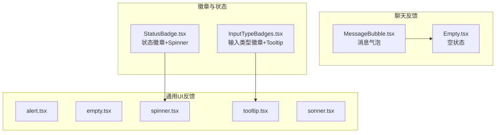
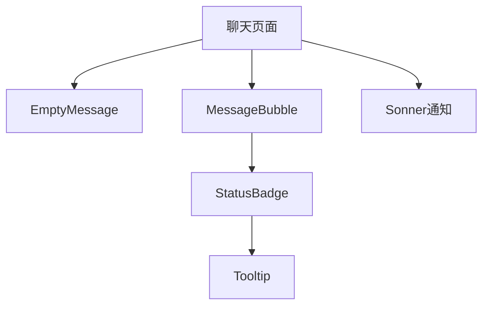
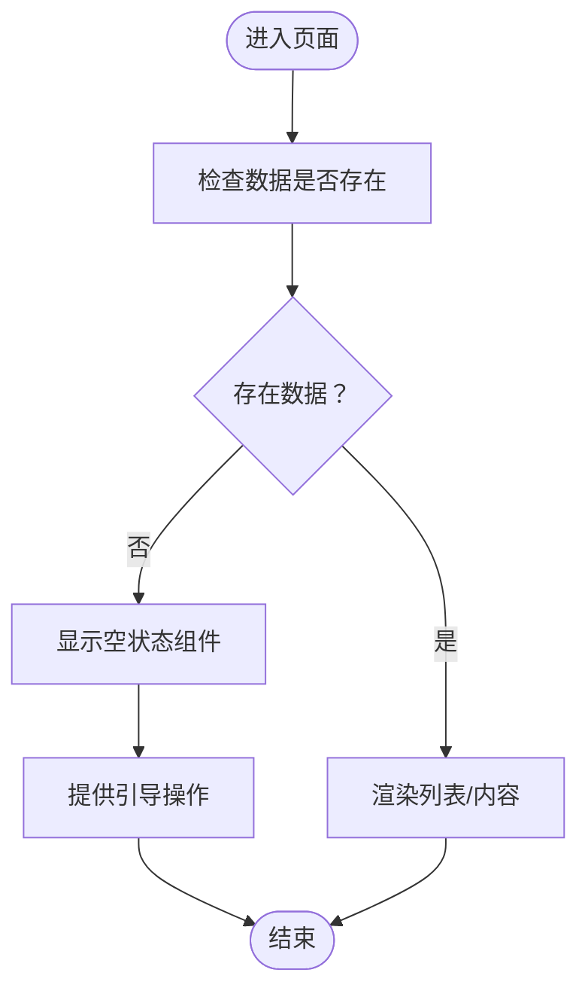
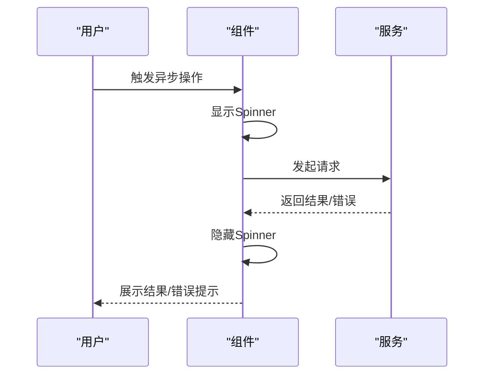
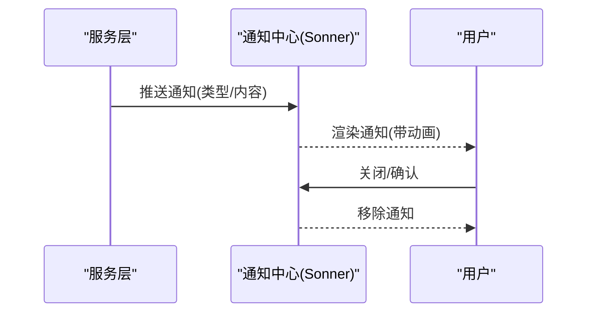
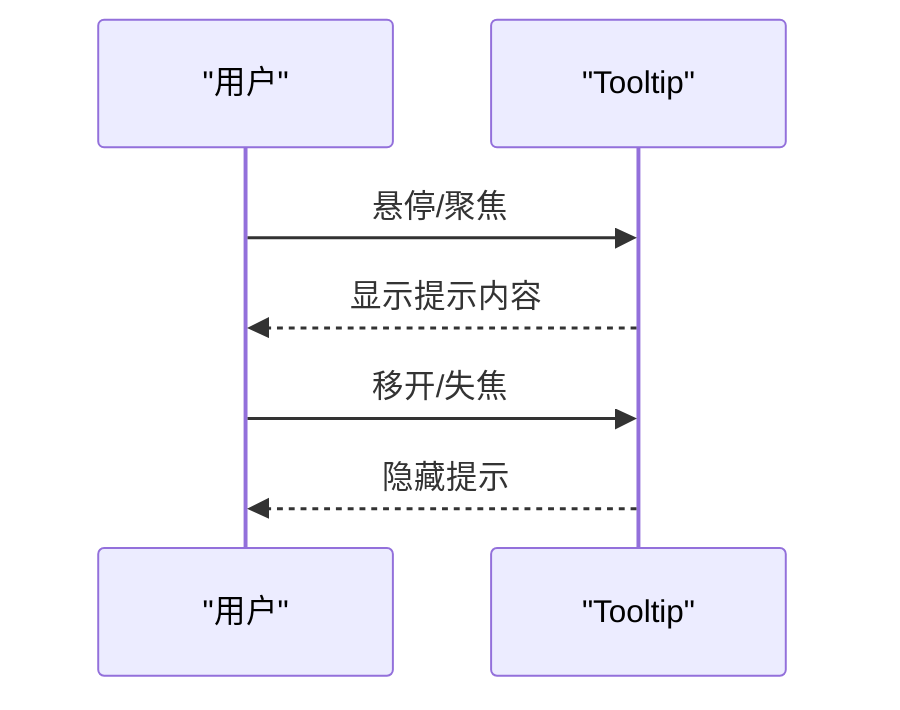
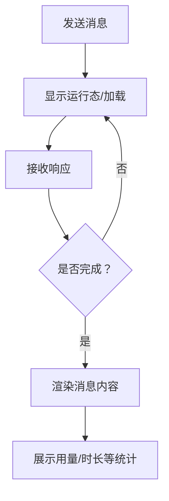
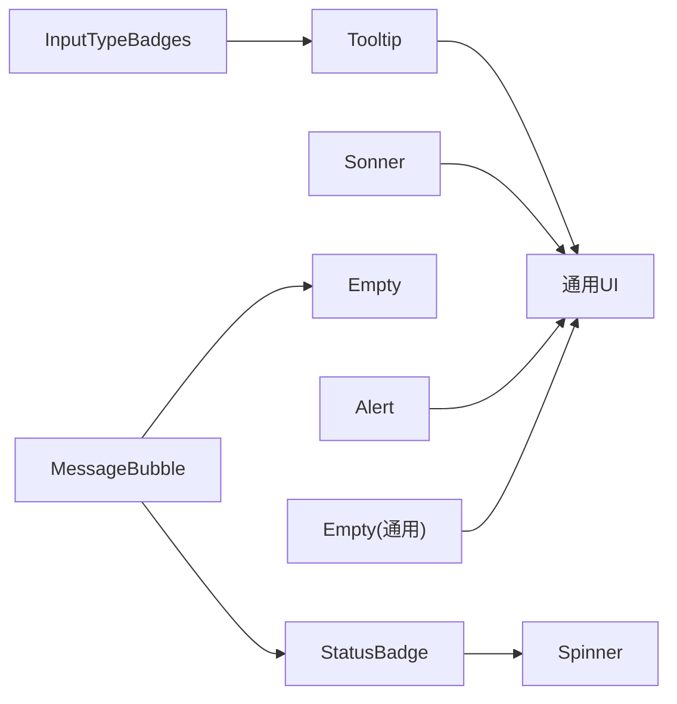

# 反馈组件

<cite>
**本文引用的文件**
- [README.md](file://README.md)
- [examples/web_ui/frontend/src/components/chat/Empty.tsx](file://examples/web_ui/frontend/src/components/chat/Empty.tsx)
- [examples/web_ui/frontend/src/components/chat/MessageBubble.tsx](file://examples/web_ui/frontend/src/components/chat/MessageBubble.tsx)
- [examples/web_ui/frontend/src/components/badge/InputTypeBadges.tsx](file://examples/web_ui/frontend/src/components/badge/InputTypeBadges.tsx)
- [examples/web_ui/frontend/src/components/badge/StatusBadge.tsx](file://examples/web_ui/frontend/src/components/badge/StatusBadge.tsx)
- [examples/web_ui/frontend/src/components/ui/alert.tsx](file://examples/web_ui/frontend/src/components/ui/alert.tsx)
- [examples/web_ui/frontend/src/components/ui/empty.tsx](file://examples/web_ui/frontend/src/components/ui/empty.tsx)
- [examples/web_ui/frontend/src/components/ui/spinner.tsx](file://examples/web_ui/frontend/src/components/ui/spinner.tsx)
- [examples/web_ui/frontend/src/components/ui/tooltip.tsx](file://examples/web_ui/frontend/src/components/ui/tooltip.tsx)
- [examples/web_ui/frontend/src/components/ui/sonner.tsx](file://examples/web_ui/frontend/src/components/ui/sonner.tsx)
</cite>

## 目录
1. [简介](#简介)
2. [项目结构](#项目结构)
3. [核心组件](#核心组件)
4. [架构总览](#架构总览)
5. [详细组件分析](#详细组件分析)
6. [依赖关系分析](#依赖关系分析)
7. [性能考量](#性能考量)
8. [故障排查指南](#故障排查指南)
9. [结论](#结论)
10. [附录](#附录)

## 简介
本文件聚焦于AgentScope Web前端中的“用户反馈组件”，涵盖警告、空状态、加载指示器、消息通知与气泡提示等交互反馈形态。文档从设计原则、反馈时机与类型选择、动画与过渡、典型场景示例、可访问性与屏幕阅读器支持、性能与最佳实践等维度进行系统化梳理，帮助开发者在复杂交互中保持一致、清晰且无障碍的用户体验。

## 项目结构
反馈组件主要分布在Web UI前端工程中，位于examples/web_ui/frontend/src/components目录下，按功能域划分为：
- chat：聊天消息展示与空状态
- badge：徽章与状态提示
- ui：通用UI反馈组件（alert、empty、spinner、tooltip、sonner）
- 其他：对话输入、工具渲染器等

**图表来源**
- [examples/web_ui/frontend/src/components/chat/Empty.tsx:12-30](file://examples/web_ui/frontend/src/components/chat/Empty.tsx#L12-L30)
- [examples/web_ui/frontend/src/components/chat/MessageBubble.tsx:210-248](file://examples/web_ui/frontend/src/components/chat/MessageBubble.tsx#L210-L248)
- [examples/web_ui/frontend/src/components/badge/InputTypeBadges.tsx:3-62](file://examples/web_ui/frontend/src/components/badge/InputTypeBadges.tsx#L3-L62)
- [examples/web_ui/frontend/src/components/badge/StatusBadge.tsx:3-30](file://examples/web_ui/frontend/src/components/badge/StatusBadge.tsx#L3-L30)
- [examples/web_ui/frontend/src/components/ui/empty.tsx](file://examples/web_ui/frontend/src/components/ui/empty.tsx)
- [examples/web_ui/frontend/src/components/ui/spinner.tsx](file://examples/web_ui/frontend/src/components/ui/spinner.tsx)
- [examples/web_ui/frontend/src/components/ui/tooltip.tsx](file://examples/web_ui/frontend/src/components/ui/tooltip.tsx)
- [examples/web_ui/frontend/src/components/ui/alert.tsx](file://examples/web_ui/frontend/src/components/ui/alert.tsx)
- [examples/web_ui/frontend/src/components/ui/sonner.tsx](file://examples/web_ui/frontend/src/components/ui/sonner.tsx)

**章节来源**
- [README.md](file://README.md)

## 核心组件
- 警告（Alert）：用于显式提示重要信息或错误，强调可读性与对比度，避免与成功/信息类反馈混淆。
- 空状态（Empty/EmptyMessage）：在无数据或无内容时提供明确指引与情感化表达，避免用户困惑。
- 加载指示器（Spinner）：在异步操作期间提供轻量、不打断的视觉反馈，避免阻塞交互。
- 消息通知（Sonner）：统一的消息通知通道，支持多种类型与持久化策略，便于用户感知系统事件。
- 气泡提示（Tooltip）：在悬停或焦点状态下提供上下文信息，避免干扰主流程。

这些组件共同构成“即时、明确、可恢复”的反馈体系，贯穿聊天、配置、状态等多个场景。

**章节来源**
- [examples/web_ui/frontend/src/components/ui/alert.tsx](file://examples/web_ui/frontend/src/components/ui/alert.tsx)
- [examples/web_ui/frontend/src/components/ui/empty.tsx](file://examples/web_ui/frontend/src/components/ui/empty.tsx)
- [examples/web_ui/frontend/src/components/ui/spinner.tsx](file://examples/web_ui/frontend/src/components/ui/spinner.tsx)
- [examples/web_ui/frontend/src/components/ui/sonner.tsx](file://examples/web_ui/frontend/src/components/ui/sonner.tsx)
- [examples/web_ui/frontend/src/components/ui/tooltip.tsx](file://examples/web_ui/frontend/src/components/ui/tooltip.tsx)

## 架构总览
反馈组件的使用遵循“场景驱动 + 组合优先”的原则：在具体页面中组合基础UI组件，形成面向用户的反馈闭环。

**图表来源**
- [examples/web_ui/frontend/src/components/chat/Empty.tsx:12-30](file://examples/web_ui/frontend/src/components/chat/Empty.tsx#L12-L30)
- [examples/web_ui/frontend/src/components/chat/MessageBubble.tsx:210-248](file://examples/web_ui/frontend/src/components/chat/MessageBubble.tsx#L210-L248)
- [examples/web_ui/frontend/src/components/badge/StatusBadge.tsx:3-30](file://examples/web_ui/frontend/src/components/badge/StatusBadge.tsx#L3-L30)
- [examples/web_ui/frontend/src/components/badge/InputTypeBadges.tsx:3-62](file://examples/web_ui/frontend/src/components/badge/InputTypeBadges.tsx#L3-L62)
- [examples/web_ui/frontend/src/components/ui/sonner.tsx](file://examples/web_ui/frontend/src/components/ui/sonner.tsx)

## 详细组件分析

### 警告（Alert）
- 设计原则
  - 明确语义：区分警告、错误、成功、信息四类，避免语义重叠导致认知负担。
  - 视觉层次：通过颜色、图标与布局建立层级，确保在复杂界面中仍能被注意到。
  - 行动导向：提供可点击的操作按钮或链接，引导用户采取下一步行动。
- 使用时机
  - 配置校验失败、权限不足、网络异常、任务执行失败等需要立即关注的场景。
- 类型选择
  - 警告：潜在风险但尚未造成损失；错误：已发生失败；成功：已完成；信息：一般性提示。
- 动画与过渡
  - 进入使用淡入或滑入，退出使用淡出，避免闪烁与跳变。
- 场景示例
  - 表单提交失败时弹出警告，附带重试按钮与错误原因摘要。
  - 权限不足时显示警告并引导至权限申请页面。

**章节来源**
- [examples/web_ui/frontend/src/components/ui/alert.tsx](file://examples/web_ui/frontend/src/components/ui/alert.tsx)

### 空状态（Empty/EmptyMessage）
- 设计原则
  - 清晰意图：明确告知“当前没有内容”以及“为什么没有内容”。
  - 正向引导：提供下一步操作建议，降低用户挫败感。
  - 情感化：使用简洁文案与恰当的插图/图标，提升亲和力。
- 使用时机
  - 列表为空、会话列表为空、搜索结果为空、初始化阶段无数据等。
- 动画与过渡
  - 首次出现采用淡入，切换到其他视图时使用平滑过渡，避免突兀。
- 场景示例
  - 聊天界面首次进入时显示空状态，提供“开始新对话”按钮。
  - 搜索无结果时显示空状态并建议调整关键词。

**图表来源**
- [examples/web_ui/frontend/src/components/chat/Empty.tsx:12-30](file://examples/web_ui/frontend/src/components/chat/Empty.tsx#L12-L30)

**章节来源**
- [examples/web_ui/frontend/src/components/chat/Empty.tsx:12-30](file://examples/web_ui/frontend/src/components/chat/Empty.tsx#L12-L30)

### 加载指示器（Spinner）
- 设计原则
  - 轻量不阻断：使用环形或线性进度条，避免遮挡关键信息。
  - 合理粒度：对整体页面使用覆盖层级加载，对局部使用内联指示器。
  - 可取消性：长耗时操作应允许用户中断或继续等待。
- 使用时机
  - 异步请求、模型推理、文件上传、批量操作等。
- 动画与过渡
  - 旋转动画需顺滑且帧率稳定；进入/退出使用淡入淡出，避免闪烁。
- 场景示例
  - 发送消息后显示加载指示器，直到收到响应或超时。
  - 列表滚动到底部触发分页加载时显示底部加载条。

**图表来源**
- [examples/web_ui/frontend/src/components/badge/StatusBadge.tsx:3-30](file://examples/web_ui/frontend/src/components/badge/StatusBadge.tsx#L3-L30)
- [examples/web_ui/frontend/src/components/ui/spinner.tsx](file://examples/web_ui/frontend/src/components/ui/spinner.tsx)

**章节来源**
- [examples/web_ui/frontend/src/components/badge/StatusBadge.tsx:3-30](file://examples/web_ui/frontend/src/components/badge/StatusBadge.tsx#L3-L30)
- [examples/web_ui/frontend/src/components/ui/spinner.tsx](file://examples/web_ui/frontend/src/components/ui/spinner.tsx)

### 消息通知（Sonner）
- 设计原则
  - 一致性：统一的通知样式、位置与行为，减少认知成本。
  - 可控性：支持自动消失与手动关闭，避免过度打扰。
  - 可访问性：提供键盘可达与屏幕阅读器支持。
- 使用时机
  - 系统事件、任务完成、错误上报、权限变更等。
- 动画与过渡
  - 入场使用滑入或淡入，出场使用滑出或淡出，保证流畅性。
- 场景示例
  - 保存成功后显示成功通知，包含简短描述与撤销操作。
  - 网络异常时显示错误通知，提供重试入口。

**图表来源**
- [examples/web_ui/frontend/src/components/ui/sonner.tsx](file://examples/web_ui/frontend/src/components/ui/sonner.tsx)

**章节来源**
- [examples/web_ui/frontend/src/components/ui/sonner.tsx](file://examples/web_ui/frontend/src/components/ui/sonner.tsx)

### 气泡提示（Tooltip）
- 设计原则
  - 精准信息：仅在必要时显示，避免信息过载。
  - 即时性：悬停/焦点即显，移开即隐，不阻断主流程。
  - 可访问性：支持键盘导航与屏幕阅读器朗读。
- 使用时机
  - 图标含义不明、快捷键提示、字段说明等。
- 动画与过渡
  - 出现使用淡入，隐藏使用淡出；避免抖动与延迟过长。
- 场景示例
  - 输入类型徽章的辅助说明，根据支持情况动态生成提示文本。

**图表来源**
- [examples/web_ui/frontend/src/components/badge/InputTypeBadges.tsx:3-62](file://examples/web_ui/frontend/src/components/badge/InputTypeBadges.tsx#L3-L62)
- [examples/web_ui/frontend/src/components/ui/tooltip.tsx](file://examples/web_ui/frontend/src/components/ui/tooltip.tsx)

**章节来源**
- [examples/web_ui/frontend/src/components/badge/InputTypeBadges.tsx:3-62](file://examples/web_ui/frontend/src/components/badge/InputTypeBadges.tsx#L3-L62)
- [examples/web_ui/frontend/src/components/ui/tooltip.tsx](file://examples/web_ui/frontend/src/components/ui/tooltip.tsx)

### 聊天消息反馈（MessageBubble）
- 设计原则
  - 时序清晰：区分用户消息、系统消息与运行中消息，提供时间戳与状态标识。
  - 运行态可见：在消息未完成时显示“思考中”等状态，避免用户重复提交。
  - 内容分组：将工具调用与文本内容分组展示，便于理解。
- 使用时机
  - 消息发送、接收、处理中、完成或失败。
- 动画与过渡
  - 新消息进入使用淡入；状态变化使用平滑过渡，避免闪烁。
- 场景示例
  - 用户发送消息后，显示加载指示器与“思考中”提示，完成后展示完整内容与用量统计。

**图表来源**
- [examples/web_ui/frontend/src/components/chat/MessageBubble.tsx:210-248](file://examples/web_ui/frontend/src/components/chat/MessageBubble.tsx#L210-L248)

**章节来源**
- [examples/web_ui/frontend/src/components/chat/MessageBubble.tsx:210-248](file://examples/web_ui/frontend/src/components/chat/MessageBubble.tsx#L210-L248)

## 依赖关系分析
反馈组件之间的依赖关系如下：

**图表来源**
- [examples/web_ui/frontend/src/components/badge/InputTypeBadges.tsx:3-62](file://examples/web_ui/frontend/src/components/badge/InputTypeBadges.tsx#L3-L62)
- [examples/web_ui/frontend/src/components/badge/StatusBadge.tsx:3-30](file://examples/web_ui/frontend/src/components/badge/StatusBadge.tsx#L3-L30)
- [examples/web_ui/frontend/src/components/chat/MessageBubble.tsx:210-248](file://examples/web_ui/frontend/src/components/chat/MessageBubble.tsx#L210-L248)
- [examples/web_ui/frontend/src/components/chat/Empty.tsx:12-30](file://examples/web_ui/frontend/src/components/chat/Empty.tsx#L12-L30)
- [examples/web_ui/frontend/src/components/ui/tooltip.tsx](file://examples/web_ui/frontend/src/components/ui/tooltip.tsx)
- [examples/web_ui/frontend/src/components/ui/spinner.tsx](file://examples/web_ui/frontend/src/components/ui/spinner.tsx)
- [examples/web_ui/frontend/src/components/ui/sonner.tsx](file://examples/web_ui/frontend/src/components/ui/sonner.tsx)
- [examples/web_ui/frontend/src/components/ui/alert.tsx](file://examples/web_ui/frontend/src/components/ui/alert.tsx)
- [examples/web_ui/frontend/src/components/ui/empty.tsx](file://examples/web_ui/frontend/src/components/ui/empty.tsx)

## 性能考量
- 延迟与节流
  - 对频繁触发的反馈（如滚动加载、实时消息）采用防抖/节流，避免频繁重绘。
- 渲染优化
  - 将大型列表项的反馈组件拆分为独立组件，使用key稳定化与虚拟滚动。
- 动画帧率
  - 使用CSS动画而非JS定时器，确保60fps；长动画可提供暂停/降速选项。
- 资源占用
  - 加载指示器尽量轻量，避免阻塞主线程；通知数量控制在合理范围。
- 可访问性
  - 为动画提供“减少动画偏好设置”支持；为屏幕阅读器提供等价文本描述。
- 最佳实践
  - 统一反馈生命周期管理，避免内存泄漏；对不可恢复错误提供兜底提示与重试路径。

## 故障排查指南
- 警告未显示
  - 检查类型参数与主题变量是否正确传入；确认容器层级与z-index。
- 空状态不出现
  - 核查数据判空逻辑与条件渲染分支；确保文案与图标资源可用。
- 加载指示器卡住
  - 检查异步请求是否被取消或抛错；确认状态回滚逻辑。
- 通知不消失
  - 检查自动关闭时间与用户交互事件绑定；确认通知队列未被阻塞。
- 提示不显示
  - 检查Tooltip容器与触发元素的定位；确认禁用状态与可见性。

**章节来源**
- [examples/web_ui/frontend/src/components/ui/alert.tsx](file://examples/web_ui/frontend/src/components/ui/alert.tsx)
- [examples/web_ui/frontend/src/components/ui/empty.tsx](file://examples/web_ui/frontend/src/components/ui/empty.tsx)
- [examples/web_ui/frontend/src/components/ui/spinner.tsx](file://examples/web_ui/frontend/src/components/ui/spinner.tsx)
- [examples/web_ui/frontend/src/components/ui/sonner.tsx](file://examples/web_ui/frontend/src/components/ui/sonner.tsx)
- [examples/web_ui/frontend/src/components/ui/tooltip.tsx](file://examples/web_ui/frontend/src/components/ui/tooltip.tsx)

## 结论
AgentScope的反馈组件以“清晰、即时、可恢复”为核心目标，通过Alert、Empty、Spinner、Sonner与Tooltip的协同，构建了覆盖多场景的反馈体系。遵循本文的设计原则、时机选择、动画过渡与可访问性要求，可在复杂交互中保持一致且友好的用户体验。

## 附录
- 反馈场景示例清单
  - 异步操作反馈：发送消息、文件上传、批量任务
  - 表单验证提示：必填字段、格式错误、冲突检测
  - 系统通知：权限变更、服务状态、错误上报
  - 状态提示：加载中、完成、失败、重试
- 可访问性清单
  - 键盘可达：Tab顺序、Enter/Space激活
  - 屏幕阅读器：等价文本、角色与状态描述
  - 动画偏好：减少动画模式下的降级体验
  - 对比度与色彩：满足WCAG AA/AAA标准