# 基础组件

<cite>
**本文引用的文件**
- [button.tsx](file://examples/web_ui/frontend/src/components/ui/button.tsx)
- [input.tsx](file://examples/web_ui/frontend/src/components/ui/input.tsx)
- [textarea.tsx](file://examples/web_ui/frontend/src/components/ui/textarea.tsx)
- [select.tsx](file://examples/web_ui/frontend/src/components/ui/select.tsx)
- [checkbox.tsx](file://examples/web_ui/frontend/src/components/ui/checkbox.tsx)
- [switch.tsx](file://examples/web_ui/frontend/src/components/ui/switch.tsx)
- [label.tsx](file://examples/web_ui/frontend/src/components/ui/label.tsx)
- [index.css](file://examples/web_ui/frontend/src/index.css)
- [button-group.tsx](file://examples/web_ui/frontend/src/components/ui/button-group.tsx)
- [field.tsx](file://examples/web_ui/frontend/src/components/ui/field.tsx)
- [input-group.tsx](file://examples/web_ui/frontend/src/components/ui/input-group.tsx)
- [badge.tsx](file://examples/web_ui/frontend/src/components/ui/badge.tsx)
- [alert.tsx](file://examples/web_ui/frontend/src/components/ui/alert.tsx)
- [card.tsx](file://examples/web_ui/frontend/src/components/ui/card.tsx)
- [dialog.tsx](file://examples/web_ui/frontend/src/components/ui/dialog.tsx)
- [drawer.tsx](file://examples/web_ui/frontend/src/components/ui/drawer.tsx)
- [dropdown-menu.tsx](file://examples/web_ui/frontend/src/components/ui/dropdown-menu.tsx)
- [popover.tsx](file://examples/web_ui/frontend/src/components/ui/popover.tsx)
- [tabs.tsx](file://examples/web_ui/frontend/src/components/ui/tabs.tsx)
- [tooltip.tsx](file://examples/web_ui/frontend/src/components/ui/tooltip.tsx)
- [calendar.tsx](file://examples/web_ui/frontend/src/components/ui/calendar.tsx)
- [collapsible.tsx](file://examples/web_ui/frontend/src/components/ui/collapsible.tsx)
- [empty.tsx](file://examples/web_ui/frontend/src/components/ui/empty.tsx)
- [item.tsx](file://examples/web_ui/frontend/src/components/ui/item.tsx)
- [kbd.tsx](file://examples/web_ui/frontend/src/components/ui/kbd.tsx)
- [separator.tsx](file://examples/web_ui/frontend/src/components/ui/separator.tsx)
- [sheet.tsx](file://examples/web_ui/frontend/src/components/ui/sheet.tsx)
- [sidebar.tsx](file://examples/web_ui/frontend/src/components/ui/sidebar.tsx)
- [skeleton.tsx](file://examples/web_ui/frontend/src/components/ui/skeleton.tsx)
- [sonner.tsx](file://examples/web_ui/frontend/src/components/ui/sonner.tsx)
- [spinner.tsx](file://examples/web_ui/frontend/src/components/ui/spinner.tsx)
- [App.tsx](file://examples/web_ui/frontend/src/App.tsx)
- [index.html](file://examples/web_ui/frontend/index.html)
- [package.json](file://examples/web_ui/frontend/package.json)
</cite>

## 目录
1. [简介](#简介)
2. [项目结构](#项目结构)
3. [核心组件](#核心组件)
4. [架构总览](#架构总览)
5. [详细组件分析](#详细组件分析)
6. [依赖关系分析](#依赖关系分析)
7. [性能考量](#性能考量)
8. [故障排查指南](#故障排查指南)
9. [结论](#结论)
10. [附录](#附录)

## 简介
本文件聚焦于 AgentScope Web UI 中的基础原子级组件，涵盖按钮、输入框、文本域、选择器、复选框、开关与标签等，并系统阐述其设计理念、属性定义、状态管理与事件处理机制；同时给出可访问性（无障碍）特性说明、主题定制与 CSS 变量覆盖方式、组件间组合模式与最佳实践。为避免直接粘贴代码，文中所有技术细节均以“文件路径+行号范围”的形式进行引用，便于读者在仓库中定位具体实现。

## 项目结构
前端位于 examples/web_ui/frontend，基础 UI 组件集中于 components/ui 目录下，采用按功能分层的组织方式：原子组件（button、input、label 等）、复合组件（button-group、input-group、field 等），以及布局与反馈类组件（card、alert、dialog、tabs 等）。样式入口在 index.css，应用入口在 App.tsx，页面通过路由或条件渲染组织。

```mermaid
graph TB
subgraph "应用入口"
APP["App.tsx"]
HTML["index.html"]
end
subgraph "样式入口"
CSS["index.css"]
end
subgraph "基础UI组件"
BTN["button.tsx"]
INP["input.tsx"]
TXT["textarea.tsx"]
SEL["select.tsx"]
CHK["checkbox.tsx"]
SW["switch.tsx"]
LAB["label.tsx"]
FLD["field.tsx"]
IG["input-group.tsx"]
BG["badge.tsx"]
AL["alert.tsx"]
CD["card.tsx"]
DLG["dialog.tsx"]
DRW["drawer.tsx"]
DDM["dropdown-menu.tsx"]
POP["popover.tsx"]
TAB["tabs.tsx"]
TIP["tooltip.tsx"]
CAL["calendar.tsx"]
COL["collapsible.tsx"]
EMP["empty.tsx"]
ITM["item.tsx"]
KBD["kbd.tsx"]
SEP["separator.tsx"]
SH["sheet.tsx"]
SB["sidebar.tsx"]
SK["skeleton.tsx"]
SN["sonner.tsx"]
SP["spinner.tsx"]
BGRP["button-group.tsx"]
end
APP --> BTN
APP --> INP
APP --> TXT
APP --> SEL
APP --> CHK
APP --> SW
APP --> LAB
APP --> FLD
APP --> IG
APP --> BG
APP --> AL
APP --> CD
APP --> DLG
APP --> DRW
APP --> DDM
APP --> POP
APP --> TAB
APP --> TIP
APP --> CAL
APP --> COL
APP --> EMP
APP --> ITM
APP --> KBD
APP --> SEP
APP --> SH
APP --> SB
APP --> SK
APP --> SN
APP --> SP
APP --> BGRP
HTML --> APP
CSS --> BTN
CSS --> INP
CSS --> TXT
CSS --> SEL
CSS --> CHK
CSS --> SW
CSS --> LAB
CSS --> FLD
CSS --> IG
CSS --> BG
CSS --> AL
CSS --> CD
CSS --> DLG
CSS --> DRW
CSS --> DDM
CSS --> POP
CSS --> TAB
CSS --> TIP
CSS --> CAL
CSS --> COL
CSS --> EMP
CSS --> ITM
CSS --> KBD
CSS --> SEP
CSS --> SH
CSS --> SB
CSS --> SK
CSS --> SN
CSS --> SP
CSS --> BGRP
```

图表来源
- [App.tsx](file://examples/web_ui/frontend/src/App.tsx)
- [index.html](file://examples/web_ui/frontend/index.html)
- [index.css](file://examples/web_ui/frontend/src/index.css)
- [button.tsx](file://examples/web_ui/frontend/src/components/ui/button.tsx)
- [input.tsx](file://examples/web_ui/frontend/src/components/ui/input.tsx)
- [textarea.tsx](file://examples/web_ui/frontend/src/components/ui/textarea.tsx)
- [select.tsx](file://examples/web_ui/frontend/src/components/ui/select.tsx)
- [checkbox.tsx](file://examples/web_ui/frontend/src/components/ui/checkbox.tsx)
- [switch.tsx](file://examples/web_ui/frontend/src/components/ui/switch.tsx)
- [label.tsx](file://examples/web_ui/frontend/src/components/ui/label.tsx)
- [field.tsx](file://examples/web_ui/frontend/src/components/ui/field.tsx)
- [input-group.tsx](file://examples/web_ui/frontend/src/components/ui/input-group.tsx)
- [badge.tsx](file://examples/web_ui/frontend/src/components/ui/badge.tsx)
- [alert.tsx](file://examples/web_ui/frontend/src/components/ui/alert.tsx)
- [card.tsx](file://examples/web_ui/frontend/src/components/ui/card.tsx)
- [dialog.tsx](file://examples/web_ui/frontend/src/components/ui/dialog.tsx)
- [drawer.tsx](file://examples/web_ui/frontend/src/components/ui/drawer.tsx)
- [dropdown-menu.tsx](file://examples/web_ui/frontend/src/components/ui/dropdown-menu.tsx)
- [popover.tsx](file://examples/web_ui/frontend/src/components/ui/popover.tsx)
- [tabs.tsx](file://examples/web_ui/frontend/src/components/ui/tabs.tsx)
- [tooltip.tsx](file://examples/web_ui/frontend/src/components/ui/tooltip.tsx)
- [calendar.tsx](file://examples/web_ui/frontend/src/components/ui/calendar.tsx)
- [collapsible.tsx](file://examples/web_ui/frontend/src/components/ui/collapsible.tsx)
- [empty.tsx](file://examples/web_ui/frontend/src/components/ui/empty.tsx)
- [item.tsx](file://examples/web_ui/frontend/src/components/ui/item.tsx)
- [kbd.tsx](file://examples/web_ui/frontend/src/components/ui/kbd.tsx)
- [separator.tsx](file://examples/web_ui/frontend/src/components/ui/separator.tsx)
- [sheet.tsx](file://examples/web_ui/frontend/src/components/ui/sheet.tsx)
- [sidebar.tsx](file://examples/web_ui/frontend/src/components/ui/sidebar.tsx)
- [skeleton.tsx](file://examples/web_ui/frontend/src/components/ui/skeleton.tsx)
- [sonner.tsx](file://examples/web_ui/frontend/src/components/ui/sonner.tsx)
- [spinner.tsx](file://examples/web_ui/frontend/src/components/ui/spinner.tsx)
- [button-group.tsx](file://examples/web_ui/frontend/src/components/ui/button-group.tsx)

章节来源
- [App.tsx](file://examples/web_ui/frontend/src/App.tsx)
- [index.html](file://examples/web_ui/frontend/index.html)
- [index.css](file://examples/web_ui/frontend/src/index.css)

## 核心组件
本节对基础原子组件进行概览式说明，重点强调设计理念与通用属性形态（如尺寸、状态、样式变体、可访问性属性等）。以下组件均位于 components/ui 目录，遵循一致的属性命名与导出规范，便于组合与主题化。

- 按钮（button）
  - 设计理念：语义明确、状态清晰、可组合性强；支持主次/危险/幽灵/链接等视觉变体与禁用态。
  - 关键属性：作为原子组件，通常包含 size、variant、disabled、className、onClick 等；部分按钮支持 loading 或 icon。
  - 状态管理：受控/非受控均可，建议通过上层表单或页面状态驱动。
  - 事件处理：onClick、onFocus、onBlur、onKeyDown 等键盘事件用于可访问性。
  - 可访问性：具备 aria-disabled、role="button" 或原生 button 的默认语义；支持 Tab 导航与 Enter/Space 触发。
  - 使用示例：参见 [button.tsx](file://examples/web_ui/frontend/src/components/ui/button.tsx)

- 输入框（input）
  - 设计理念：简洁、一致的边框与内边距；支持前缀/后缀图标、清空按钮、禁用与只读态。
  - 关键属性：type、value/onChange、placeholder、disabled、readOnly、size、className、aria-*。
  - 状态管理：受控组件，建议由父组件维护 value 与错误状态。
  - 事件处理：onChange、onBlur、onFocus、onKeyDown、onInput 等。
  - 可访问性：提供 aria-invalid、aria-describedby 等辅助信息；与 label 关联 via htmlFor。
  - 使用示例：参见 [input.tsx](file://examples/web_ui/frontend/src/components/ui/input.tsx)

- 文本域（textarea）
  - 设计理念：自适应高度或固定行数；支持禁用、只读、最大长度限制与字符计数。
  - 关键属性：value/onChange、placeholder、rows、disabled、readOnly、maxLength、className、aria-*。
  - 状态管理：受控组件；可结合字数提示与错误状态。
  - 事件处理：onChange、onBlur、onFocus、onKeyDown、onInput。
  - 可访问性：aria-invalid、aria-describedby；与 label 关联。
  - 使用示例：参见 [textarea.tsx](file://examples/web_ui/frontend/src/components/ui/textarea.tsx)

- 选择器（select）
  - 设计理念：下拉选项清晰、支持多选/单选、搜索过滤与分组。
  - 关键属性：value/onChange、options、placeholder、disabled、multiple、size、className、aria-*。
  - 状态管理：受控组件；多选时需处理数组值。
  - 事件处理：onChange、onFocus、onBlur、onKeyDown、onKeyUp。
  - 可访问性：aria-expanded、aria-controls、aria-selected；键盘导航（上下、回车、Esc）。
  - 使用示例：参见 [select.tsx](file://examples/web_ui/frontend/src/components/ui/select.tsx)

- 复选框（checkbox）
  - 设计理念：二态或多态（indeterminate）；常与 label 组合。
  - 关键属性：checked/onChange、disabled、indeterminate、size、className、aria-*。
  - 状态管理：受控/非受控皆可；indeterminate 常用于“全选”场景。
  - 事件处理：onChange、onFocus、onBlur、onKeyDown。
  - 可访问性：aria-checked；与 label 关联。
  - 使用示例：参见 [checkbox.tsx](file://examples/web_ui/frontend/src/components/ui/checkbox.tsx)

- 开关（switch）
  - 设计理念：语义化表示开/关；与复选框相比更强调“切换”动作。
  - 关键属性：checked/onChange、disabled、size、className、aria-*。
  - 状态管理：受控组件；适合表单字段开关。
  - 事件处理：onChange、onFocus、onBlur、onKeyDown。
  - 可访问性：aria-checked；键盘 Space 切换。
  - 使用示例：参见 [switch.tsx](file://examples/web_ui/frontend/src/components/ui/switch.tsx)

- 标签（label）
  - 设计理念：与表单控件强关联；提升点击区域与可访问性。
  - 关键属性：htmlFor、children、disabled、className、aria-*。
  - 状态管理：无状态；通过与控件联动实现交互。
  - 事件处理：onClick（可触发关联控件聚焦/激活）。
  - 可访问性：必须与控件 id 对应；支持键盘导航。
  - 使用示例：参见 [label.tsx](file://examples/web_ui/frontend/src/components/ui/label.tsx)

章节来源
- [button.tsx](file://examples/web_ui/frontend/src/components/ui/button.tsx)
- [input.tsx](file://examples/web_ui/frontend/src/components/ui/input.tsx)
- [textarea.tsx](file://examples/web_ui/frontend/src/components/ui/textarea.tsx)
- [select.tsx](file://examples/web_ui/frontend/src/components/ui/select.tsx)
- [checkbox.tsx](file://examples/web_ui/frontend/src/components/ui/checkbox.tsx)
- [switch.tsx](file://examples/web_ui/frontend/src/components/ui/switch.tsx)
- [label.tsx](file://examples/web_ui/frontend/src/components/ui/label.tsx)

## 架构总览
基础组件围绕“原子-复合-布局/反馈”三层结构组织，形成统一的风格与交互体验。原子组件负责最小可用功能与可访问性；复合组件在原子基础上提供组合能力（如输入组、字段容器）；布局与反馈组件则承担页面结构与状态提示职责。

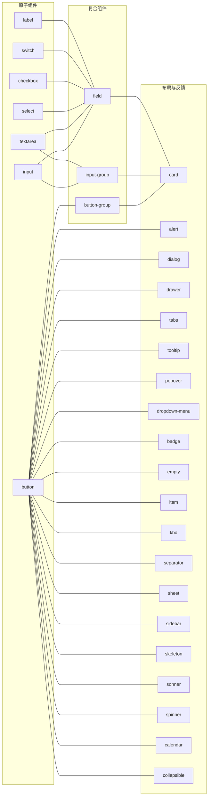

图表来源
- [button.tsx](file://examples/web_ui/frontend/src/components/ui/button.tsx)
- [input.tsx](file://examples/web_ui/frontend/src/components/ui/input.tsx)
- [textarea.tsx](file://examples/web_ui/frontend/src/components/ui/textarea.tsx)
- [select.tsx](file://examples/web_ui/frontend/src/components/ui/select.tsx)
- [checkbox.tsx](file://examples/web_ui/frontend/src/components/ui/checkbox.tsx)
- [switch.tsx](file://examples/web_ui/frontend/src/components/ui/switch.tsx)
- [label.tsx](file://examples/web_ui/frontend/src/components/ui/label.tsx)
- [button-group.tsx](file://examples/web_ui/frontend/src/components/ui/button-group.tsx)
- [input-group.tsx](file://examples/web_ui/frontend/src/components/ui/input-group.tsx)
- [field.tsx](file://examples/web_ui/frontend/src/components/ui/field.tsx)
- [card.tsx](file://examples/web_ui/frontend/src/components/ui/card.tsx)
- [alert.tsx](file://examples/web_ui/frontend/src/components/ui/alert.tsx)
- [dialog.tsx](file://examples/web_ui/frontend/src/components/ui/dialog.tsx)
- [drawer.tsx](file://examples/web_ui/frontend/src/components/ui/drawer.tsx)
- [tabs.tsx](file://examples/web_ui/frontend/src/components/ui/tabs.tsx)
- [tooltip.tsx](file://examples/web_ui/frontend/src/components/ui/tooltip.tsx)
- [popover.tsx](file://examples/web_ui/frontend/src/components/ui/popover.tsx)
- [dropdown-menu.tsx](file://examples/web_ui/frontend/src/components/ui/dropdown-menu.tsx)
- [badge.tsx](file://examples/web_ui/frontend/src/components/ui/badge.tsx)
- [empty.tsx](file://examples/web_ui/frontend/src/components/ui/empty.tsx)
- [item.tsx](file://examples/web_ui/frontend/src/components/ui/item.tsx)
- [kbd.tsx](file://examples/web_ui/frontend/src/components/ui/kbd.tsx)
- [separator.tsx](file://examples/web_ui/frontend/src/components/ui/separator.tsx)
- [sheet.tsx](file://examples/web_ui/frontend/src/components/ui/sheet.tsx)
- [sidebar.tsx](file://examples/web_ui/frontend/src/components/ui/sidebar.tsx)
- [skeleton.tsx](file://examples/web_ui/frontend/src/components/ui/skeleton.tsx)
- [sonner.tsx](file://examples/web_ui/frontend/src/components/ui/sonner.tsx)
- [spinner.tsx](file://examples/web_ui/frontend/src/components/ui/spinner.tsx)
- [calendar.tsx](file://examples/web_ui/frontend/src/components/ui/calendar.tsx)
- [collapsible.tsx](file://examples/web_ui/frontend/src/components/ui/collapsible.tsx)

## 详细组件分析

### 按钮组件（button）
- 设计理念：强调语义与一致性，支持多种视觉变体与尺寸；通过 className 与 style 支持主题覆盖。
- 属性定义：size（小/中/大）、variant（主按钮/次按钮/危险/幽灵/链接/文本）、disabled、loading、icon、onClick、className、aria-*。
- 状态管理：受控组件；可通过 loading 控制加载态；disabled 控制交互。
- 事件处理：onClick、onFocus、onBlur、onKeyDown（Space/Enter 触发）、onContextMenu。
- 可访问性：role="button" 或原生 button；aria-disabled；支持键盘导航与焦点管理。
- 使用示例：参见 [button.tsx](file://examples/web_ui/frontend/src/components/ui/button.tsx)

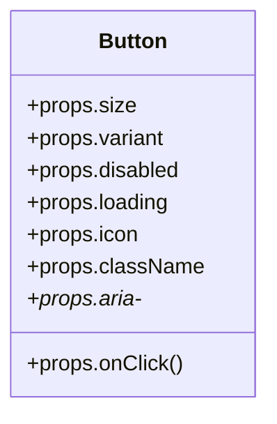

图表来源
- [button.tsx](file://examples/web_ui/frontend/src/components/ui/button.tsx)

章节来源
- [button.tsx](file://examples/web_ui/frontend/src/components/ui/button.tsx)

### 输入框组件（input）
- 设计理念：统一边框与内边距；支持前缀/后缀图标、清空按钮、禁用/只读态。
- 属性定义：type（text/password/email 等）、value/onChange、placeholder、disabled、readOnly、size、className、aria-*。
- 状态管理：受控组件；建议与表单状态联动；可结合错误态与帮助文案。
- 事件处理：onChange、onBlur、onFocus、onKeyDown、onInput。
- 可访问性：aria-invalid、aria-describedby；与 label 通过 htmlFor 关联。
- 使用示例：参见 [input.tsx](file://examples/web_ui/frontend/src/components/ui/input.tsx)

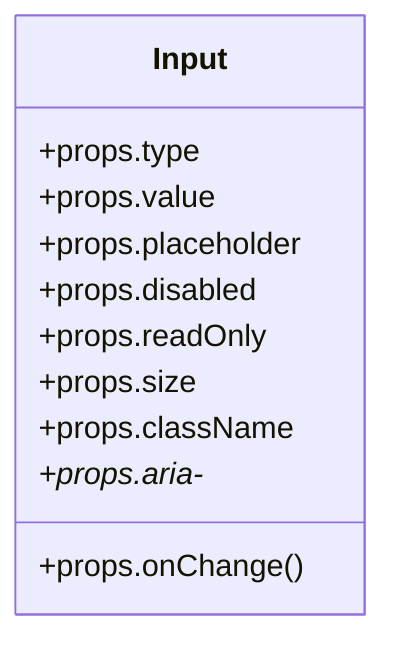

图表来源
- [input.tsx](file://examples/web_ui/frontend/src/components/ui/input.tsx)

章节来源
- [input.tsx](file://examples/web_ui/frontend/src/components/ui/input.tsx)

### 文本域组件（textarea）
- 设计理念：自适应高度或固定行数；支持禁用、只读、最大长度限制与字符计数。
- 属性定义：value/onChange、placeholder、rows、disabled、readOnly、maxLength、className、aria-*。
- 状态管理：受控组件；可结合字数提示与错误状态。
- 事件处理：onChange、onBlur、onFocus、onKeyDown、onInput。
- 可访问性：aria-invalid、aria-describedby；与 label 关联。
- 使用示例：参见 [textarea.tsx](file://examples/web_ui/frontend/src/components/ui/textarea.tsx)

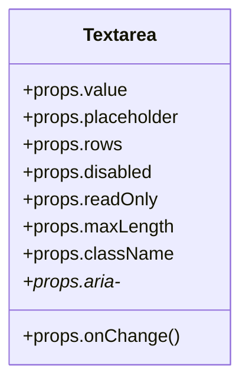

图表来源
- [textarea.tsx](file://examples/web_ui/frontend/src/components/ui/textarea.tsx)

章节来源
- [textarea.tsx](file://examples/web_ui/frontend/src/components/ui/textarea.tsx)

### 选择器组件（select）
- 设计理念：下拉选项清晰、支持多选/单选、搜索过滤与分组。
- 属性定义：value/onChange、options、placeholder、disabled、multiple、size、className、aria-*。
- 状态管理：受控组件；多选时需处理数组值；可结合搜索与分组。
- 事件处理：onChange、onFocus、onBlur、onKeyDown、onKeyUp。
- 可访问性：aria-expanded、aria-controls、aria-selected；键盘导航（上下、回车、Esc）。
- 使用示例：参见 [select.tsx](file://examples/web_ui/frontend/src/components/ui/select.tsx)

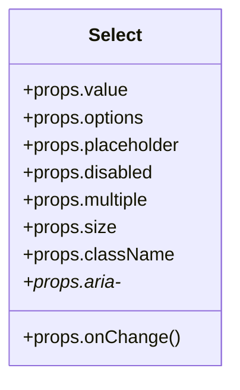

图表来源
- [select.tsx](file://examples/web_ui/frontend/src/components/ui/select.tsx)

章节来源
- [select.tsx](file://examples/web_ui/frontend/src/components/ui/select.tsx)

### 复选框组件（checkbox）
- 设计理念：二态或多态（indeterminate）；常与 label 组合。
- 属性定义：checked/onChange、disabled、indeterminate、size、className、aria-*。
- 状态管理：受控/非受控皆可；indeterminate 常用于“全选”场景。
- 事件处理：onChange、onFocus、onBlur、onKeyDown。
- 可访问性：aria-checked；与 label 关联。
- 使用示例：参见 [checkbox.tsx](file://examples/web_ui/frontend/src/components/ui/checkbox.tsx)

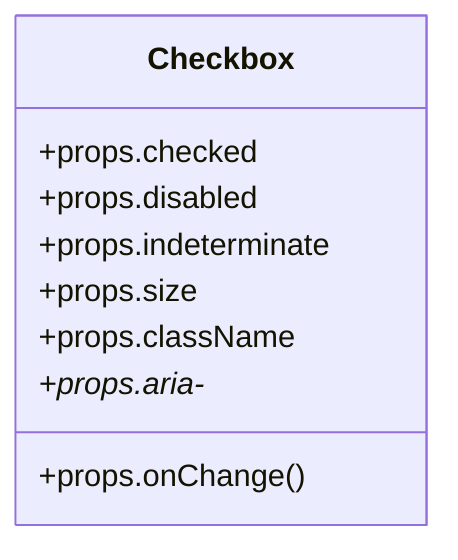

图表来源
- [checkbox.tsx](file://examples/web_ui/frontend/src/components/ui/checkbox.tsx)

章节来源
- [checkbox.tsx](file://examples/web_ui/frontend/src/components/ui/checkbox.tsx)

### 开关组件（switch）
- 设计理念：语义化表示开/关；与复选框相比更强调“切换”动作。
- 属性定义：checked/onChange、disabled、size、className、aria-*。
- 状态管理：受控组件；适合表单字段开关。
- 事件处理：onChange、onFocus、onBlur、onKeyDown。
- 可访问性：aria-checked；键盘 Space 切换。
- 使用示例：参见 [switch.tsx](file://examples/web_ui/frontend/src/components/ui/switch.tsx)

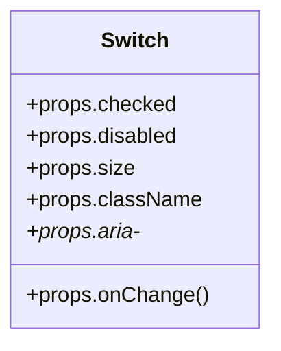

图表来源
- [switch.tsx](file://examples/web_ui/frontend/src/components/ui/switch.tsx)

章节来源
- [switch.tsx](file://examples/web_ui/frontend/src/components/ui/switch.tsx)

### 标签组件（label）
- 设计理念：与表单控件强关联；提升点击区域与可访问性。
- 属性定义：htmlFor、children、disabled、className、aria-*。
- 状态管理：无状态；通过与控件联动实现交互。
- 事件处理：onClick（可触发关联控件聚焦/激活）。
- 可访问性：必须与控件 id 对应；支持键盘导航。
- 使用示例：参见 [label.tsx](file://examples/web_ui/frontend/src/components/ui/label.tsx)

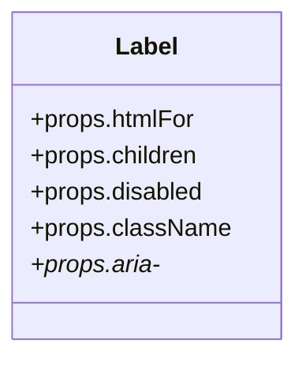

图表来源
- [label.tsx](file://examples/web_ui/frontend/src/components/ui/label.tsx)

章节来源
- [label.tsx](file://examples/web_ui/frontend/src/components/ui/label.tsx)

### 复合与布局/反馈组件（示意）
- 输入组合（input-group）：将 input 与前缀/后缀元素（图标、按钮、徽章）组合，提升信息密度与操作效率。
- 字段容器（field）：封装 label、输入控件与帮助文本/错误提示，统一布局与可访问性。
- 按钮组（button-group）：将多个按钮按水平/垂直排列，共享间距与对齐。
- 卡片（card）、警告（alert）、对话框（dialog）、抽屉（drawer）、标签页（tabs）、工具提示（tooltip）、气泡菜单（popover）、下拉菜单（dropdown-menu）、徽章（badge）、空状态（empty）、条目（item）、键盘键位（kbd）、分隔线（separator）、模态（sheet）、侧边栏（sidebar）、骨架屏（skeleton）、通知（sonner）、加载（spinner）、日历（calendar）、折叠面板（collapsible）等。

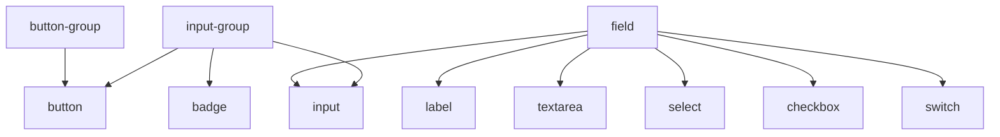

图表来源
- [input-group.tsx](file://examples/web_ui/frontend/src/components/ui/input-group.tsx)
- [field.tsx](file://examples/web_ui/frontend/src/components/ui/field.tsx)
- [button-group.tsx](file://examples/web_ui/frontend/src/components/ui/button-group.tsx)
- [input.tsx](file://examples/web_ui/frontend/src/components/ui/input.tsx)
- [textarea.tsx](file://examples/web_ui/frontend/src/components/ui/textarea.tsx)
- [select.tsx](file://examples/web_ui/frontend/src/components/ui/select.tsx)
- [checkbox.tsx](file://examples/web_ui/frontend/src/components/ui/checkbox.tsx)
- [switch.tsx](file://examples/web_ui/frontend/src/components/ui/switch.tsx)
- [label.tsx](file://examples/web_ui/frontend/src/components/ui/label.tsx)
- [badge.tsx](file://examples/web_ui/frontend/src/components/ui/badge.tsx)

章节来源
- [input-group.tsx](file://examples/web_ui/frontend/src/components/ui/input-group.tsx)
- [field.tsx](file://examples/web_ui/frontend/src/components/ui/field.tsx)
- [button-group.tsx](file://examples/web_ui/frontend/src/components/ui/button-group.tsx)

## 依赖关系分析
- 组件间依赖：基础原子组件被复合组件与布局/反馈组件广泛复用；复合组件进一步被页面与业务模块使用。
- 外部依赖：前端工程基于 Vite 与 React 生态，样式通过 CSS 变量与 Tailwind 类名组合；无额外 UI 库依赖。
- 主题与样式：index.css 提供全局 CSS 变量与基础样式，组件通过 className 与 style 覆盖变量实现主题定制。

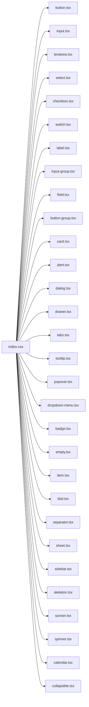

图表来源
- [index.css](file://examples/web_ui/frontend/src/index.css)
- [button.tsx](file://examples/web_ui/frontend/src/components/ui/button.tsx)
- [input.tsx](file://examples/web_ui/frontend/src/components/ui/input.tsx)
- [textarea.tsx](file://examples/web_ui/frontend/src/components/ui/textarea.tsx)
- [select.tsx](file://examples/web_ui/frontend/src/components/ui/select.tsx)
- [checkbox.tsx](file://examples/web_ui/frontend/src/components/ui/checkbox.tsx)
- [switch.tsx](file://examples/web_ui/frontend/src/components/ui/switch.tsx)
- [label.tsx](file://examples/web_ui/frontend/src/components/ui/label.tsx)
- [input-group.tsx](file://examples/web_ui/frontend/src/components/ui/input-group.tsx)
- [field.tsx](file://examples/web_ui/frontend/src/components/ui/field.tsx)
- [button-group.tsx](file://examples/web_ui/frontend/src/components/ui/button-group.tsx)
- [card.tsx](file://examples/web_ui/frontend/src/components/ui/card.tsx)
- [alert.tsx](file://examples/web_ui/frontend/src/components/ui/alert.tsx)
- [dialog.tsx](file://examples/web_ui/frontend/src/components/ui/dialog.tsx)
- [drawer.tsx](file://examples/web_ui/frontend/src/components/ui/drawer.tsx)
- [tabs.tsx](file://examples/web_ui/frontend/src/components/ui/tabs.tsx)
- [tooltip.tsx](file://examples/web_ui/frontend/src/components/ui/tooltip.tsx)
- [popover.tsx](file://examples/web_ui/frontend/src/components/ui/popover.tsx)
- [dropdown-menu.tsx](file://examples/web_ui/frontend/src/components/ui/dropdown-menu.tsx)
- [badge.tsx](file://examples/web_ui/frontend/src/components/ui/badge.tsx)
- [empty.tsx](file://examples/web_ui/frontend/src/components/ui/empty.tsx)
- [item.tsx](file://examples/web_ui/frontend/src/components/ui/item.tsx)
- [kbd.tsx](file://examples/web_ui/frontend/src/components/ui/kbd.tsx)
- [separator.tsx](file://examples/web_ui/frontend/src/components/ui/separator.tsx)
- [sheet.tsx](file://examples/web_ui/frontend/src/components/ui/sheet.tsx)
- [sidebar.tsx](file://examples/web_ui/frontend/src/components/ui/sidebar.tsx)
- [skeleton.tsx](file://examples/web_ui/frontend/src/components/ui/skeleton.tsx)
- [sonner.tsx](file://examples/web_ui/frontend/src/components/ui/sonner.tsx)
- [spinner.tsx](file://examples/web_ui/frontend/src/components/ui/spinner.tsx)
- [calendar.tsx](file://examples/web_ui/frontend/src/components/ui/calendar.tsx)
- [collapsible.tsx](file://examples/web_ui/frontend/src/components/ui/collapsible.tsx)

章节来源
- [index.css](file://examples/web_ui/frontend/src/index.css)
- [package.json](file://examples/web_ui/frontend/package.json)

## 性能考量
- 渲染优化：原子组件尽量保持轻量，避免不必要的重渲染；使用 React.memo 包裹复杂子树（如 select 下拉列表）。
- 事件处理：统一在上层进行防抖/节流（如搜索型 select 的输入事件），减少频繁更新。
- 样式计算：优先使用 CSS 变量与 className 切换，避免内联样式的频繁变更。
- 懒加载：下拉菜单、弹窗、抽屉等内容可在首次打开时再加载，降低初始渲染压力。
- 可访问性成本：键盘导航与 ARIA 属性会增加少量 DOM 与事件处理开销，但显著提升可用性。

## 故障排查指南
- 可访问性问题
  - 症状：无法通过键盘触发按钮或切换开关。
  - 排查：确认组件是否具备 aria-disabled、aria-checked、role 等属性；检查键盘事件绑定（onKeyDown）。
  - 参考：[button.tsx](file://examples/web_ui/frontend/src/components/ui/button.tsx)、[switch.tsx](file://examples/web_ui/frontend/src/components/ui/switch.tsx)、[checkbox.tsx](file://examples/web_ui/frontend/src/components/ui/checkbox.tsx)
- 表单联动问题
  - 症状：label 不触发控件聚焦，或错误状态不显示。
  - 排查：确保 htmlFor 与控件 id 一致；检查 aria-invalid 与 aria-describedby 的关联。
  - 参考：[label.tsx](file://examples/web_ui/frontend/src/components/ui/label.tsx)、[input.tsx](file://examples/web_ui/frontend/src/components/ui/input.tsx)、[textarea.tsx](file://examples/web_ui/frontend/src/components/ui/textarea.tsx)
- 主题不生效
  - 症状：修改 CSS 变量后样式未变化。
  - 排查：确认变量名与作用域；检查组件是否正确读取 className/style；确认 index.css 的加载顺序。
  - 参考：[index.css](file://examples/web_ui/frontend/src/index.css)

章节来源
- [button.tsx](file://examples/web_ui/frontend/src/components/ui/button.tsx)
- [switch.tsx](file://examples/web_ui/frontend/src/components/ui/switch.tsx)
- [checkbox.tsx](file://examples/web_ui/frontend/src/components/ui/checkbox.tsx)
- [label.tsx](file://examples/web_ui/frontend/src/components/ui/label.tsx)
- [input.tsx](file://examples/web_ui/frontend/src/components/ui/input.tsx)
- [textarea.tsx](file://examples/web_ui/frontend/src/components/ui/textarea.tsx)
- [index.css](file://examples/web_ui/frontend/src/index.css)

## 结论
AgentScope 的基础 UI 组件以原子组件为核心，通过统一的属性体系、可访问性设计与主题化能力，构建了高内聚、低耦合的组件库。复合与布局/反馈组件在此基础上扩展出丰富的交互模式。遵循本文档的属性约定、状态管理策略与主题定制方法，可快速搭建一致、易用且可访问的界面。

## 附录
- 主题定制与 CSS 变量覆盖
  - 全局样式入口：index.css
  - 覆盖方式：通过修改 CSS 变量（如 --radius、--primary 等）影响组件外观；或通过 className 与 style 在组件上叠加样式。
  - 参考：[index.css](file://examples/web_ui/frontend/src/index.css)
- 组件组合与最佳实践
  - 字段容器：使用 field 封装 label、输入控件与提示文本，保证一致的布局与可访问性。
  - 输入组合：使用 input-group 将图标、按钮、徽章与输入框组合，提升信息密度。
  - 按钮组：使用 button-group 统一按钮间距与对齐，避免重复样式。
  - 参考：[field.tsx](file://examples/web_ui/frontend/src/components/ui/field.tsx)、[input-group.tsx](file://examples/web_ui/frontend/src/components/ui/input-group.tsx)、[button-group.tsx](file://examples/web_ui/frontend/src/components/ui/button-group.tsx)

章节来源
- [index.css](file://examples/web_ui/frontend/src/index.css)
- [field.tsx](file://examples/web_ui/frontend/src/components/ui/field.tsx)
- [input-group.tsx](file://examples/web_ui/frontend/src/components/ui/input-group.tsx)
- [button-group.tsx](file://examples/web_ui/frontend/src/components/ui/button-group.tsx)