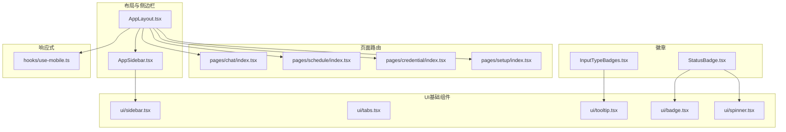
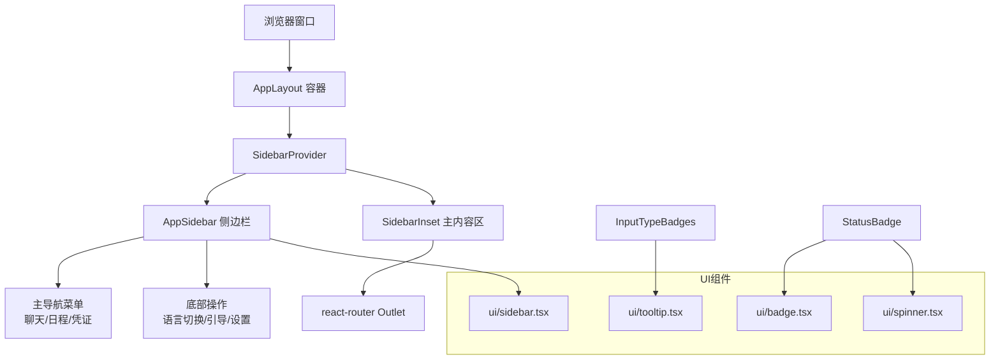
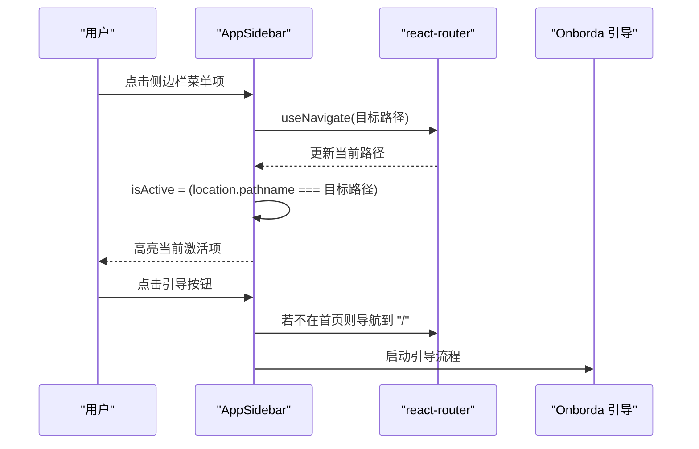
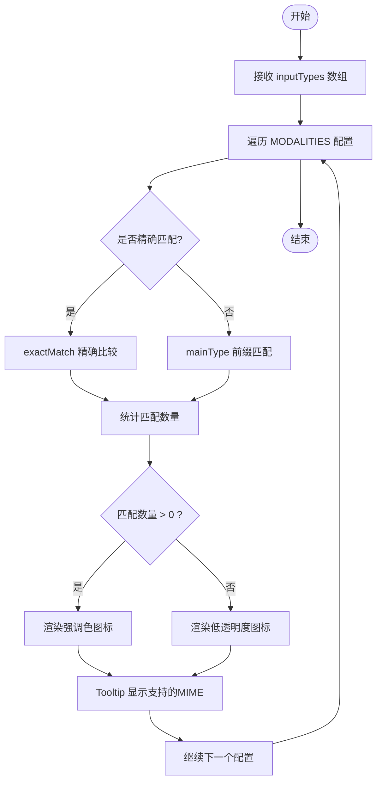
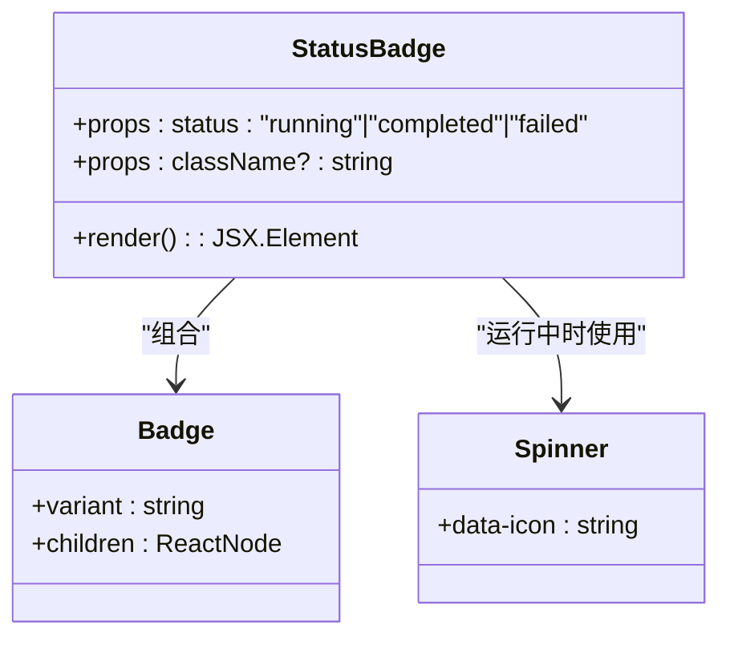
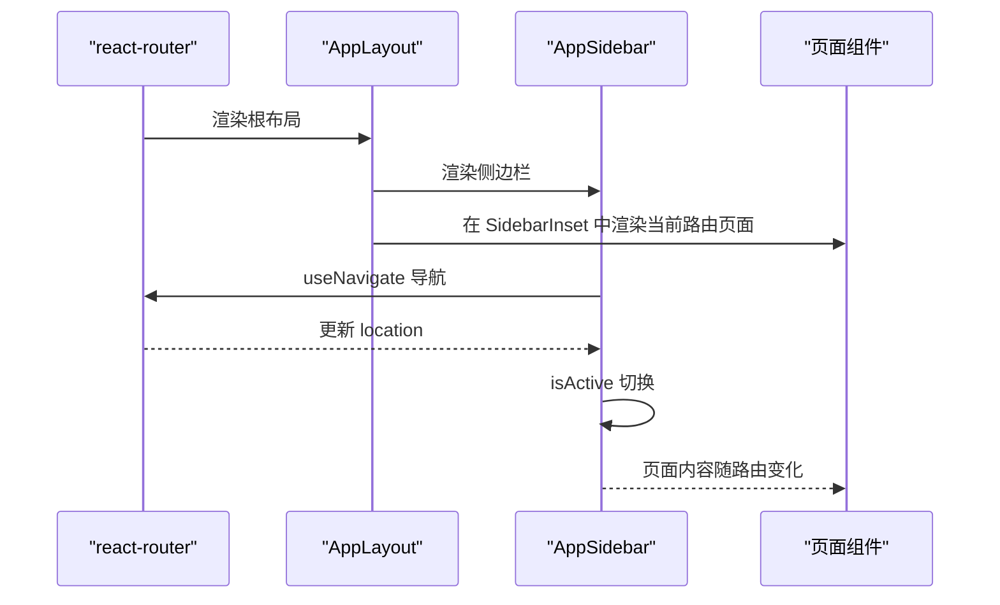
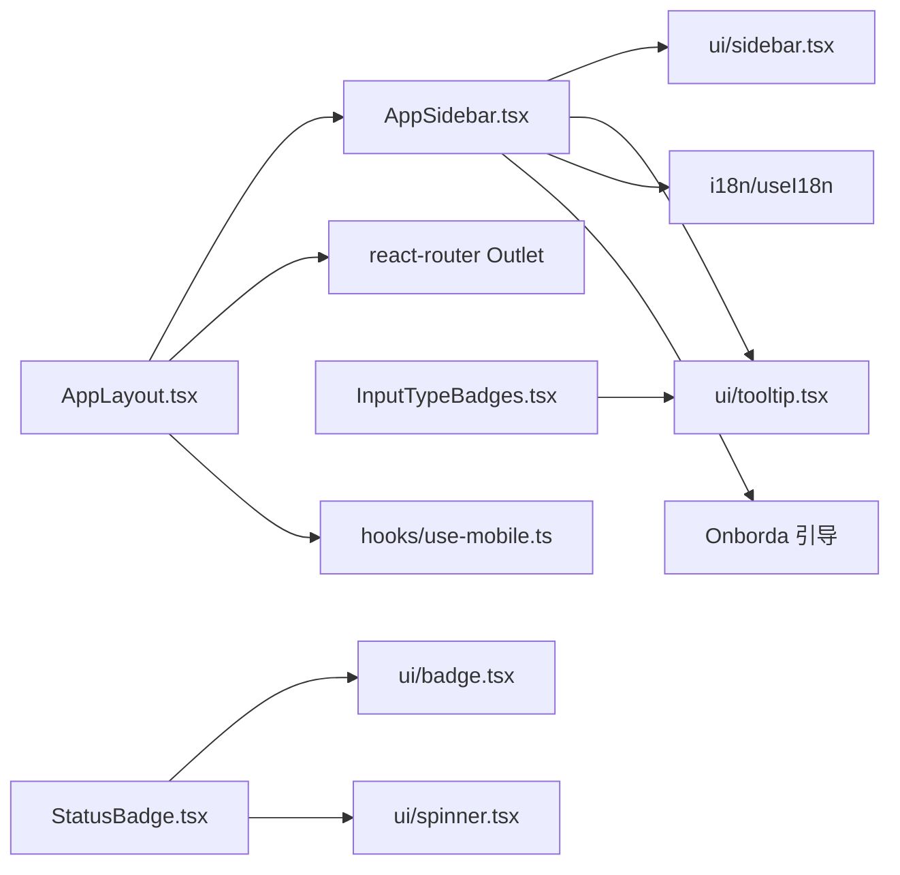

# 导航组件

<cite>
**本文引用的文件**
- [AppLayout.tsx](file://examples/web_ui/frontend/src/components/layout/AppLayout.tsx)
- [AppSidebar.tsx](file://examples/web_ui/frontend/src/components/layout/AppSidebar.tsx)
- [InputTypeBadges.tsx](file://examples/web_ui/frontend/src/components/badge/InputTypeBadges.tsx)
- [StatusBadge.tsx](file://examples/web_ui/frontend/src/components/badge/StatusBadge.tsx)
- [index.ts](file://examples/web_ui/frontend/src/pages/chat/index.tsx)
- [index.ts](file://examples/web_ui/frontend/src/pages/schedule/index.tsx)
- [index.ts](file://examples/web_ui/frontend/src/pages/credential/index.tsx)
- [index.ts](file://examples/web_ui/frontend/src/pages/setup/index.tsx)
- [use-mobile.ts](file://examples/web_ui/frontend/src/hooks/use-mobile.ts)
- [sidebar.tsx](file://examples/web_ui/frontend/src/components/ui/sidebar.tsx)
- [tabs.tsx](file://examples/web_ui/frontend/src/components/ui/tabs.tsx)
- [dialog.tsx](file://examples/web_ui/frontend/src/components/ui/dialog.tsx)
- [drawer.tsx](file://examples/web_ui/frontend/src/components/ui/drawer.tsx)
- [tooltip.tsx](file://examples/web_ui/frontend/src/components/ui/tooltip.tsx)
- [button.tsx](file://examples/web_ui/frontend/src/components/ui/button.tsx)
- [alert.tsx](file://examples/web_ui/frontend/src/components/ui/alert.tsx)
- [spinner.tsx](file://examples/web_ui/frontend/src/components/ui/spinner.tsx)
- [badge.tsx](file://examples/web_ui/frontend/src/components/ui/badge.tsx)
</cite>

## 目录
1. [简介](#简介)
2. [项目结构](#项目结构)
3. [核心组件](#核心组件)
4. [架构总览](#架构总览)
5. [组件详解](#组件详解)
6. [依赖关系分析](#依赖关系分析)
7. [性能考量](#性能考量)
8. [故障排查指南](#故障排查指南)
9. [结论](#结论)
10. [附录](#附录)

## 简介
本文件系统化梳理 AgentScope Web 前端的导航体系，聚焦应用布局、侧边栏、徽章与标签页等导航相关组件的设计模式与实现细节。文档覆盖响应式导航架构（移动端折叠、桌面端展开与导航状态同步）、导航层级结构（面包屑导航、标签页切换与路由集成）、典型导航场景（多级菜单、权限控制、动态路由）、可访问性与键盘操作支持，以及性能优化与用户体验提升的实践建议。

## 项目结构
导航相关代码主要位于前端工程的组件层与页面层：
- 布局与侧边栏：位于 components/layout
- 徽章组件：位于 components/badge
- 页面路由：位于 pages 下各功能模块
- UI 基础组件：位于 components/ui（如 sidebar、tabs、tooltip 等）
- 响应式工具：hooks/use-mobile.ts

**图表来源**
- [AppLayout.tsx:1-18](file://examples/web_ui/frontend/src/components/layout/AppLayout.tsx#L1-L18)
- [AppSidebar.tsx:1-134](file://examples/web_ui/frontend/src/components/layout/AppSidebar.tsx#L1-L134)
- [InputTypeBadges.tsx:1-66](file://examples/web_ui/frontend/src/components/badge/InputTypeBadges.tsx#L1-L66)
- [StatusBadge.tsx:1-56](file://examples/web_ui/frontend/src/components/badge/StatusBadge.tsx#L1-L56)
- [sidebar.tsx](file://examples/web_ui/frontend/src/components/ui/sidebar.tsx)
- [tabs.tsx](file://examples/web_ui/frontend/src/components/ui/tabs.tsx)
- [tooltip.tsx](file://examples/web_ui/frontend/src/components/ui/tooltip.tsx)
- [badge.tsx](file://examples/web_ui/frontend/src/components/ui/badge.tsx)
- [spinner.tsx](file://examples/web_ui/frontend/src/components/ui/spinner.tsx)
- [use-mobile.ts](file://examples/web_ui/frontend/src/hooks/use-mobile.ts)

**章节来源**
- [AppLayout.tsx:1-18](file://examples/web_ui/frontend/src/components/layout/AppLayout.tsx#L1-L18)
- [AppSidebar.tsx:1-134](file://examples/web_ui/frontend/src/components/layout/AppSidebar.tsx#L1-L134)

## 核心组件
- 应用布局容器：负责整体屏幕高度与主内容区域溢出处理，嵌套 SidebarProvider 以启用全局侧边栏状态管理。
- 侧边栏：承载主导航菜单、语言切换、引导向导入口与设置入口；基于 react-router 的当前路径进行激活态高亮。
- 徽章组件：
  - 输入类型徽章：根据 MIME 类型集合展示对应模态图标与提示信息，用于工具或消息输入类型的可视化标识。
  - 状态徽章：根据执行状态显示不同颜色与图标的徽章，配合加载指示器表示运行中状态。
- 响应式与交互：通过 use-mobile 判断设备类型，结合 UI 组件库的 sidebar 实现移动端折叠与桌面端展开。

**章节来源**
- [AppLayout.tsx:6-17](file://examples/web_ui/frontend/src/components/layout/AppLayout.tsx#L6-L17)
- [AppSidebar.tsx:21-133](file://examples/web_ui/frontend/src/components/layout/AppSidebar.tsx#L21-L133)
- [InputTypeBadges.tsx:35-65](file://examples/web_ui/frontend/src/components/badge/InputTypeBadges.tsx#L35-L65)
- [StatusBadge.tsx:15-55](file://examples/web_ui/frontend/src/components/badge/StatusBadge.tsx#L15-L55)
- [use-mobile.ts](file://examples/web_ui/frontend/src/hooks/use-mobile.ts)

## 架构总览
导航系统采用“布局容器 + 侧边栏 + 主内容区”的三层结构，配合 UI 组件库与路由库实现导航状态同步与响应式行为。

**图表来源**
- [AppLayout.tsx:6-17](file://examples/web_ui/frontend/src/components/layout/AppLayout.tsx#L6-L17)
- [AppSidebar.tsx:44-131](file://examples/web_ui/frontend/src/components/layout/AppSidebar.tsx#L44-L131)
- [sidebar.tsx](file://examples/web_ui/frontend/src/components/ui/sidebar.tsx)
- [tooltip.tsx](file://examples/web_ui/frontend/src/components/ui/tooltip.tsx)
- [badge.tsx](file://examples/web_ui/frontend/src/components/ui/badge.tsx)
- [spinner.tsx](file://examples/web_ui/frontend/src/components/ui/spinner.tsx)

## 组件详解

### 应用布局 AppLayout
- 责任边界：统一屏幕高度、提供 Flex 布局与溢出控制；包裹 SidebarProvider 以启用全局侧边栏状态。
- 关键点：SidebarInset 作为主内容区容器，内部渲染 Outlet，确保路由页面在布局内正确挂载。

**章节来源**
- [AppLayout.tsx:6-17](file://examples/web_ui/frontend/src/components/layout/AppLayout.tsx#L6-L17)

### 侧边栏 AppSidebar
- 导航菜单：
  - 主要入口：聊天、日程、凭证。
  - 激活态：依据当前路由路径设置按钮激活态。
  - 点击行为：使用 useNavigate 进行路由跳转。
- 底部操作：
  - 语言切换：根据当前语言切换至另一种语言。
  - 引导向导：触发 Onborda 引导流程，必要时先导航到首页再启动。
  - 设置入口：导航至设置页面。
- 设计要点：SidebarHeader 放置 Logo 区域；SidebarContent 分组放置菜单；SidebarFooter 放置底部操作；整体宽度由主题变量控制。

**图表来源**
- [AppSidebar.tsx:27-36](file://examples/web_ui/frontend/src/components/layout/AppSidebar.tsx#L27-L36)
- [AppSidebar.tsx:54-63](file://examples/web_ui/frontend/src/components/layout/AppSidebar.tsx#L54-L63)
- [AppSidebar.tsx:110-128](file://examples/web_ui/frontend/src/components/layout/AppSidebar.tsx#L110-L128)

**章节来源**
- [AppSidebar.tsx:21-133](file://examples/web_ui/frontend/src/components/layout/AppSidebar.tsx#L21-L133)

### 徽章组件

#### 输入类型徽章 InputTypeBadges
- 功能：根据传入的 MIME 类型数组，匹配预设的模态配置，渲染对应的图标与提示文本。
- 匹配策略：
  - 精确匹配：如 text/plain 使用 exactMatch。
  - 前缀匹配：如 image/video/audio 使用 mainType 前缀匹配。
- 视觉反馈：支持的类型使用强调色，不支持的类型透明度降低；Tooltip 提供悬浮提示。
- 复杂度：对每个配置项遍历 MIME 数组进行筛选，时间复杂度 O(k·n)，空间复杂度 O(n)。

**图表来源**
- [InputTypeBadges.tsx:35-65](file://examples/web_ui/frontend/src/components/badge/InputTypeBadges.tsx#L35-L65)

**章节来源**
- [InputTypeBadges.tsx:35-65](file://examples/web_ui/frontend/src/components/badge/InputTypeBadges.tsx#L35-L65)

#### 状态徽章 StatusBadge
- 功能：根据执行状态（运行中/已完成/失败）渲染不同颜色与图标的徽章。
- 交互细节：运行中状态搭配加载指示器，完成/失败分别使用成功/失败图标。
- 国际化：标签文本来自翻译钩子，确保多语言一致显示。

**图表来源**
- [StatusBadge.tsx:15-55](file://examples/web_ui/frontend/src/components/badge/StatusBadge.tsx#L15-L55)
- [badge.tsx](file://examples/web_ui/frontend/src/components/ui/badge.tsx)
- [spinner.tsx](file://examples/web_ui/frontend/src/components/ui/spinner.tsx)

**章节来源**
- [StatusBadge.tsx:15-55](file://examples/web_ui/frontend/src/components/badge/StatusBadge.tsx#L15-L55)

### 响应式导航与状态同步
- 响应式策略：通过 use-mobile 判定移动设备，结合 UI 组件库的 sidebar 折叠/展开行为，实现移动端紧凑、桌面端展开的体验。
- 导航状态同步：侧边栏按钮通过 useLocation 获取当前路径，自动高亮匹配的菜单项，保证视觉一致性。
- 交互一致性：所有导航均通过 useNavigate 触发，避免直接修改历史记录，保持路由状态可控。

**章节来源**
- [AppSidebar.tsx:22-25](file://examples/web_ui/frontend/src/components/layout/AppSidebar.tsx#L22-L25)
- [AppSidebar.tsx:54-63](file://examples/web_ui/frontend/src/components/layout/AppSidebar.tsx#L54-L63)
- [use-mobile.ts](file://examples/web_ui/frontend/src/hooks/use-mobile.ts)

### 导航层级结构与路由集成
- 布局与路由：AppLayout 作为根布局，SidebarInset 内部渲染 Outlet，页面路由在该容器内生效。
- 页面路由：
  - 聊天页、日程页、凭证页、设置页等页面入口文件存在，与侧边栏菜单路径一一对应。
- 标签页与对话框：UI 层提供 Tabs、Dialog、Drawer 等组件，可用于在页面内实现二级导航与弹窗交互。

**图表来源**
- [AppLayout.tsx:6-17](file://examples/web_ui/frontend/src/components/layout/AppLayout.tsx#L6-L17)
- [AppSidebar.tsx:22-25](file://examples/web_ui/frontend/src/components/layout/AppSidebar.tsx#L22-L25)

**章节来源**
- [AppLayout.tsx:6-17](file://examples/web_ui/frontend/src/components/layout/AppLayout.tsx#L6-L17)
- [index.ts](file://examples/web_ui/frontend/src/pages/chat/index.tsx)
- [index.ts](file://examples/web_ui/frontend/src/pages/schedule/index.tsx)
- [index.ts](file://examples/web_ui/frontend/src/pages/credential/index.tsx)
- [index.ts](file://examples/web_ui/frontend/src/pages/setup/index.tsx)

### 典型导航场景

#### 多级菜单
- 当前实现：侧边栏为一级菜单，未见二级菜单展开逻辑。
- 扩展建议：可在 SidebarMenuButton 下增加子菜单容器，结合状态管理实现点击展开；或在页面内使用 Tabs 实现二级导航。

**章节来源**
- [AppSidebar.tsx:50-93](file://examples/web_ui/frontend/src/components/layout/AppSidebar.tsx#L50-L93)

#### 权限控制
- 当前实现：侧边栏未体现权限过滤逻辑。
- 实践建议：在渲染菜单前根据用户权限过滤可用入口；或在页面级通过中间件拦截未授权访问。

#### 动态路由
- 当前实现：侧边栏菜单与页面路由路径硬编码对应。
- 实践建议：将菜单配置化，从后端或本地配置读取动态菜单；在 AppSidebar 中按配置渲染菜单项。

### 可访问性与键盘操作
- 图标按钮具备 Tooltip 提示，便于理解用途。
- 建议增强：
  - 为菜单按钮添加 aria-label 或 title，提升屏幕阅读器友好度。
  - 支持键盘导航（Tab 切换、Enter/Space 触发），确保无鼠标也能完成导航。

**章节来源**
- [AppSidebar.tsx:55-61](file://examples/web_ui/frontend/src/components/layout/AppSidebar.tsx#L55-L61)
- [tooltip.tsx](file://examples/web_ui/frontend/src/components/ui/tooltip.tsx)

## 依赖关系分析

**图表来源**
- [AppLayout.tsx:1-18](file://examples/web_ui/frontend/src/components/layout/AppLayout.tsx#L1-L18)
- [AppSidebar.tsx:1-25](file://examples/web_ui/frontend/src/components/layout/AppSidebar.tsx#L1-L25)
- [InputTypeBadges.tsx:1-6](file://examples/web_ui/frontend/src/components/badge/InputTypeBadges.tsx#L1-L6)
- [StatusBadge.tsx:1-6](file://examples/web_ui/frontend/src/components/badge/StatusBadge.tsx#L1-L6)
- [use-mobile.ts](file://examples/web_ui/frontend/src/hooks/use-mobile.ts)

**章节来源**
- [AppLayout.tsx:1-18](file://examples/web_ui/frontend/src/components/layout/AppLayout.tsx#L1-L18)
- [AppSidebar.tsx:1-25](file://examples/web_ui/frontend/src/components/layout/AppSidebar.tsx#L1-L25)
- [InputTypeBadges.tsx:1-6](file://examples/web_ui/frontend/src/components/badge/InputTypeBadges.tsx#L1-L6)
- [StatusBadge.tsx:1-6](file://examples/web_ui/frontend/src/components/badge/StatusBadge.tsx#L1-L6)

## 性能考量
- 渲染优化：
  - 将菜单项与徽章组件拆分为独立模块，避免不必要的重渲染。
  - 对 Tooltip、Badge 等轻量组件使用 memo 化策略。
- 路由与懒加载：
  - 页面路由采用懒加载策略，减少首屏体积。
- 响应式性能：
  - 移动端折叠侧边栏减少 DOM 节点数量，提高滚动与交互流畅度。
- 状态管理：
  - 使用 SidebarProvider 统一管理侧边栏状态，避免多处重复监听。

[本节为通用指导，无需具体文件引用]

## 故障排查指南
- 侧边栏不激活：
  - 检查当前路径与菜单项路径是否完全一致；确认 useLocation 返回值与 isActive 判断条件。
- 导航跳转无效：
  - 确认 useNavigate 是否被调用且目标路径存在；检查路由配置与页面入口文件是否存在。
- 徽章不显示或样式异常：
  - 检查输入的 MIME 类型格式是否符合预期；确认 Tooltip 与 Badge 组件可用。
- 移动端显示异常：
  - 检查 use-mobile 判定逻辑与 UI 组件库的响应式断点配置。

**章节来源**
- [AppSidebar.tsx:54-63](file://examples/web_ui/frontend/src/components/layout/AppSidebar.tsx#L54-L63)
- [InputTypeBadges.tsx:35-65](file://examples/web_ui/frontend/src/components/badge/InputTypeBadges.tsx#L35-L65)
- [use-mobile.ts](file://examples/web_ui/frontend/src/hooks/use-mobile.ts)

## 结论
AgentScope 的导航体系以简洁的布局容器与侧边栏为核心，结合 UI 组件库实现了基础的导航状态同步与响应式行为。徽章组件为内容提供了直观的状态与类型标识。未来可在多级菜单、权限控制、动态路由与可访问性方面进一步完善，以满足更复杂的业务场景与用户体验需求。

[本节为总结性内容，无需具体文件引用]

## 附录
- 相关页面入口文件：
  - 聊天页：[index.ts](file://examples/web_ui/frontend/src/pages/chat/index.tsx)
  - 日程页：[index.ts](file://examples/web_ui/frontend/src/pages/schedule/index.tsx)
  - 凭证页：[index.ts](file://examples/web_ui/frontend/src/pages/credential/index.tsx)
  - 设置页：[index.ts](file://examples/web_ui/frontend/src/pages/setup/index.tsx)
- UI 组件参考：
  - 侧边栏：[sidebar.tsx](file://examples/web_ui/frontend/src/components/ui/sidebar.tsx)
  - 标签页：[tabs.tsx](file://examples/web_ui/frontend/src/components/ui/tabs.tsx)
  - 对话框：[dialog.tsx](file://examples/web_ui/frontend/src/components/ui/dialog.tsx)
  - 抽屉：[drawer.tsx](file://examples/web_ui/frontend/src/components/ui/drawer.tsx)
  - 工具提示：[tooltip.tsx](file://examples/web_ui/frontend/src/components/ui/tooltip.tsx)
  - 按钮：[button.tsx](file://examples/web_ui/frontend/src/components/ui/button.tsx)
  - 警告：[alert.tsx](file://examples/web_ui/frontend/src/components/ui/alert.tsx)
  - 加载：[spinner.tsx](file://examples/web_ui/frontend/src/components/ui/spinner.tsx)
  - 徽章：[badge.tsx](file://examples/web_ui/frontend/src/components/ui/badge.tsx)

[本节为补充材料，无需具体文件引用]