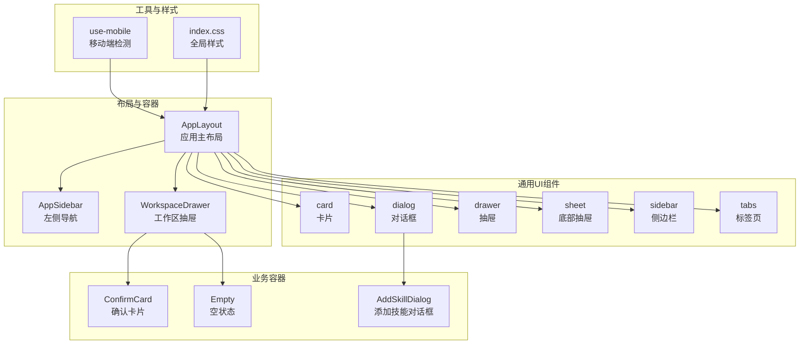
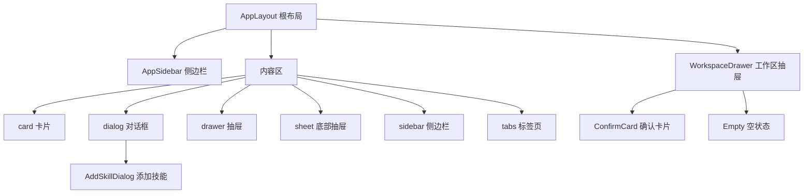
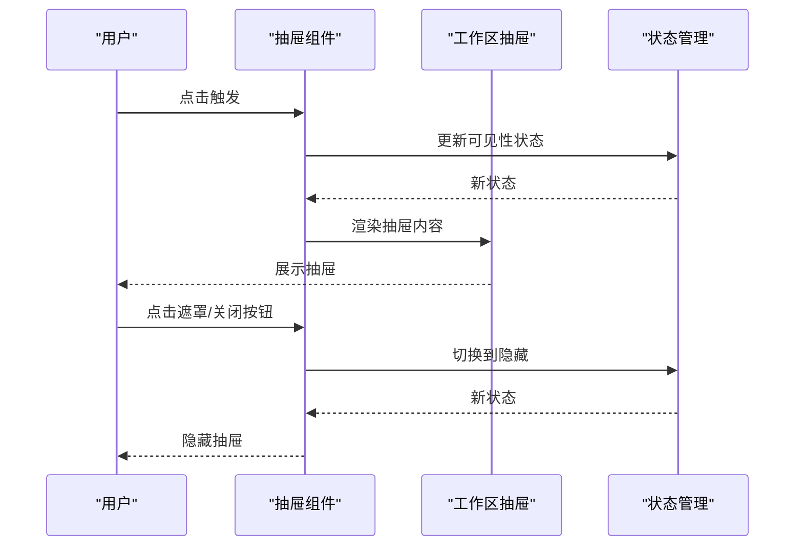
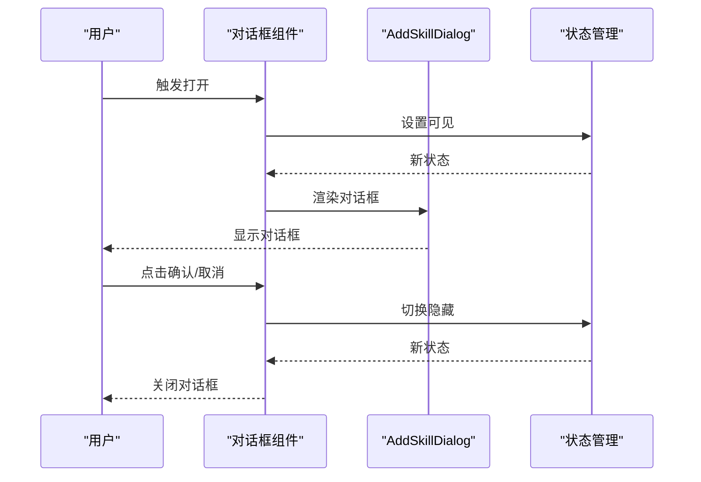
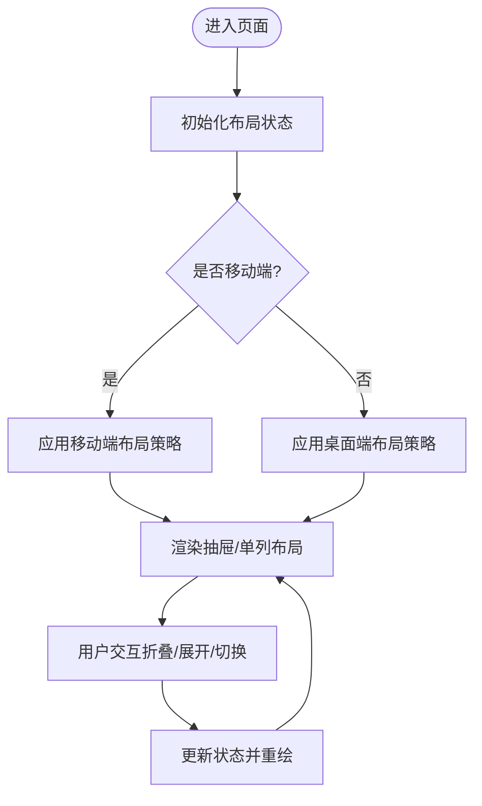
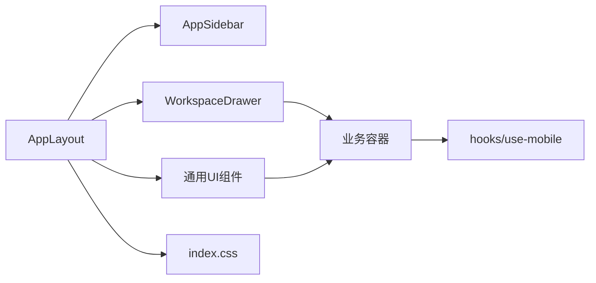

# 布局组件

<cite>
**本文引用的文件**
- [card.tsx](file://examples/web_ui/frontend/src/components/ui/card.tsx)
- [dialog.tsx](file://examples/web_ui/frontend/src/components/ui/dialog.tsx)
- [drawer.tsx](file://examples/web_ui/frontend/src/components/ui/drawer.tsx)
- [sheet.tsx](file://examples/web_ui/frontend/src/components/ui/sheet.tsx)
- [sidebar.tsx](file://examples/web_ui/frontend/src/components/ui/sidebar.tsx)
- [tabs.tsx](file://examples/web_ui/frontend/src/components/ui/tabs.tsx)
- [AppLayout.tsx](file://examples/web_ui/frontend/src/components/layout/AppLayout.tsx)
- [AppSidebar.tsx](file://examples/web_ui/frontend/src/components/layout/AppSidebar.tsx)
- [WorkspaceDrawer.tsx](file://examples/web_ui/frontend/src/components/drawer/WorkspaceDrawer.tsx)
- [ConfirmCard.tsx](file://examples/web_ui/frontend/src/components/chat/ConfirmCard.tsx)
- [Empty.tsx](file://examples/web_ui/frontend/src/components/chat/Empty.tsx)
- [AddSkillDialog.tsx](file://examples/web_ui/frontend/src/components/dialog/AddSkillDialog.tsx)
- [use-mobile.ts](file://examples/web_ui/frontend/src/hooks/use-mobile.ts)
- [index.css](file://examples/web_ui/frontend/src/index.css)
</cite>

## 目录
1. [简介](#简介)
2. [项目结构](#项目结构)
3. [核心组件](#核心组件)
4. [架构总览](#架构总览)
5. [详细组件分析](#详细组件分析)
6. [依赖关系分析](#依赖关系分析)
7. [性能考量](#性能考量)
8. [故障排查指南](#故障排查指南)
9. [结论](#结论)
10. [附录](#附录)

## 简介
本文件系统性梳理 AgentScope Web 前端中的布局与容器类组件，覆盖卡片、抽屉、对话框、侧边栏、标签页与工作台等关键 UI 组件。重点阐述：
- 设计原理与适用场景
- 响应式布局策略与断点配置
- 状态管理（打开/关闭、动画、模态）
- 嵌套布局与复杂页面结构的实现思路
- 尺寸控制、间距规范与对齐方式
- 移动端适配与触摸交互最佳实践

## 项目结构
前端采用按功能域分层的组织方式：components/ui 提供通用 UI 组件，components/layout 提供应用级布局，components/drawer 与 components/dialog 提供特定业务容器，hooks 提供横切能力（如移动端检测），pages 与各子目录承载页面与业务组件。

**图表来源**
- [AppLayout.tsx](file://examples/web_ui/frontend/src/components/layout/AppLayout.tsx)
- [AppSidebar.tsx](file://examples/web_ui/frontend/src/components/layout/AppSidebar.tsx)
- [WorkspaceDrawer.tsx](file://examples/web_ui/frontend/src/components/drawer/WorkspaceDrawer.tsx)
- [card.tsx](file://examples/web_ui/frontend/src/components/ui/card.tsx)
- [dialog.tsx](file://examples/web_ui/frontend/src/components/ui/dialog.tsx)
- [drawer.tsx](file://examples/web_ui/frontend/src/components/ui/drawer.tsx)
- [sheet.tsx](file://examples/web_ui/frontend/src/components/ui/sheet.tsx)
- [sidebar.tsx](file://examples/web_ui/frontend/src/components/ui/sidebar.tsx)
- [tabs.tsx](file://examples/web_ui/frontend/src/components/ui/tabs.tsx)
- [ConfirmCard.tsx](file://examples/web_ui/frontend/src/components/chat/ConfirmCard.tsx)
- [Empty.tsx](file://examples/web_ui/frontend/src/components/chat/Empty.tsx)
- [AddSkillDialog.tsx](file://examples/web_ui/frontend/src/components/dialog/AddSkillDialog.tsx)
- [use-mobile.ts](file://examples/web_ui/frontend/src/hooks/use-mobile.ts)
- [index.css](file://examples/web_ui/frontend/src/index.css)

**章节来源**
- [AppLayout.tsx](file://examples/web_ui/frontend/src/components/layout/AppLayout.tsx)
- [AppSidebar.tsx](file://examples/web_ui/frontend/src/components/layout/AppSidebar.tsx)
- [WorkspaceDrawer.tsx](file://examples/web_ui/frontend/src/components/drawer/WorkspaceDrawer.tsx)
- [card.tsx](file://examples/web_ui/frontend/src/components/ui/card.tsx)
- [dialog.tsx](file://examples/web_ui/frontend/src/components/ui/dialog.tsx)
- [drawer.tsx](file://examples/web_ui/frontend/src/components/ui/drawer.tsx)
- [sheet.tsx](file://examples/web_ui/frontend/src/components/ui/sheet.tsx)
- [sidebar.tsx](file://examples/web_ui/frontend/src/components/ui/sidebar.tsx)
- [tabs.tsx](file://examples/web_ui/frontend/src/components/ui/tabs.tsx)
- [ConfirmCard.tsx](file://examples/web_ui/frontend/src/components/chat/ConfirmCard.tsx)
- [Empty.tsx](file://examples/web_ui/frontend/src/components/chat/Empty.tsx)
- [AddSkillDialog.tsx](file://examples/web_ui/frontend/src/components/dialog/AddSkillDialog.tsx)
- [use-mobile.ts](file://examples/web_ui/frontend/src/hooks/use-mobile.ts)
- [index.css](file://examples/web_ui/frontend/src/index.css)

## 核心组件
- 卡片（Card）：用于信息分组与内容承载，强调层级与可读性，常用于消息气泡、设置项、卡片列表等。
- 抽屉（Drawer）：从侧边滑出的容器，适合工作区、筛选器、详情面板等需要局部展开的场景。
- 对话框（Dialog）：模态弹窗，用于打断用户流程、确认操作或展示重要信息。
- 侧边栏（Sidebar）：页面主侧导航或辅助区域，支持折叠与展开。
- 标签页（Tabs）：在有限空间内切换不同视图，适合设置页、多视图对比等。
- 工作台（AppLayout/AppSidebar）：应用级主布局，协调头部、侧栏、内容区与抽屉的关系。

**章节来源**
- [card.tsx](file://examples/web_ui/frontend/src/components/ui/card.tsx)
- [drawer.tsx](file://examples/web_ui/frontend/src/components/ui/drawer.tsx)
- [dialog.tsx](file://examples/web_ui/frontend/src/components/ui/dialog.tsx)
- [sidebar.tsx](file://examples/web_ui/frontend/src/components/ui/sidebar.tsx)
- [tabs.tsx](file://examples/web_ui/frontend/src/components/ui/tabs.tsx)
- [AppLayout.tsx](file://examples/web_ui/frontend/src/components/layout/AppLayout.tsx)
- [AppSidebar.tsx](file://examples/web_ui/frontend/src/components/layout/AppSidebar.tsx)

## 架构总览
整体采用“布局容器 + 通用UI + 业务容器”的分层设计。AppLayout 作为根布局，协调 AppSidebar 与内容区；WorkspaceDrawer 作为工作区抽屉依附于布局；通用 UI 组件（card、dialog、drawer、sheet、sidebar、tabs）为上层页面与业务容器提供基础能力；业务容器（ConfirmCard、Empty、AddSkillDialog）封装具体业务交互。

**图表来源**
- [AppLayout.tsx](file://examples/web_ui/frontend/src/components/layout/AppLayout.tsx)
- [AppSidebar.tsx](file://examples/web_ui/frontend/src/components/layout/AppSidebar.tsx)
- [WorkspaceDrawer.tsx](file://examples/web_ui/frontend/src/components/drawer/WorkspaceDrawer.tsx)
- [card.tsx](file://examples/web_ui/frontend/src/components/ui/card.tsx)
- [dialog.tsx](file://examples/web_ui/frontend/src/components/ui/dialog.tsx)
- [drawer.tsx](file://examples/web_ui/frontend/src/components/ui/drawer.tsx)
- [sheet.tsx](file://examples/web_ui/frontend/src/components/ui/sheet.tsx)
- [sidebar.tsx](file://examples/web_ui/frontend/src/components/ui/sidebar.tsx)
- [tabs.tsx](file://examples/web_ui/frontend/src/components/ui/tabs.tsx)
- [ConfirmCard.tsx](file://examples/web_ui/frontend/src/components/chat/ConfirmCard.tsx)
- [Empty.tsx](file://examples/web_ui/frontend/src/components/chat/Empty.tsx)
- [AddSkillDialog.tsx](file://examples/web_ui/frontend/src/components/dialog/AddSkillDialog.tsx)

## 详细组件分析

### 卡片（Card）
- 设计原理：以圆角、阴影与背景色区分层级，内部通过网格或弹性布局组织内容，强调视觉分组与可读性。
- 使用场景：消息气泡、设置项、工具卡片、列表项等。
- 状态与动画：通常无显式开合状态，但可结合外部状态（如折叠）实现展开/收起的过渡动画。
- 尺寸与间距：建议使用统一的内边距与外边距变量，避免硬编码；卡片宽度根据容器自适应。
- 对齐方式：标题左对齐，正文两端对齐或根据内容类型调整；按钮组右对齐或居中。
- 响应式：在窄屏下减少内边距与字体大小，必要时将横向布局改为纵向堆叠。

**章节来源**
- [card.tsx](file://examples/web_ui/frontend/src/components/ui/card.tsx)
- [ConfirmCard.tsx](file://examples/web_ui/frontend/src/components/chat/ConfirmCard.tsx)
- [Empty.tsx](file://examples/web_ui/frontend/src/components/chat/Empty.tsx)

### 抽屉（Drawer）
- 设计原理：从屏幕边缘滑入，承载次要任务或设置面板，不影响主内容区。
- 使用场景：工作区设置、筛选器、详情面板、侧栏菜单等。
- 状态与动画：通过开关状态驱动滑入/滑出动画；支持遮罩层与点击遮罩关闭。
- 模态行为：默认模态，阻止与主界面交互；可配置是否允许键盘事件穿透。
- 尺寸控制：宽度/高度可配置，移动端建议使用百分比或固定断点下的固定宽度。
- 对齐方式：内容区通常左对齐，标题与操作区右对齐或居中。
- 响应式：在小屏设备上优先使用底部抽屉（Sheet）替代右侧抽屉。

**图表来源**
- [drawer.tsx](file://examples/web_ui/frontend/src/components/ui/drawer.tsx)
- [WorkspaceDrawer.tsx](file://examples/web_ui/frontend/src/components/drawer/WorkspaceDrawer.tsx)

**章节来源**
- [drawer.tsx](file://examples/web_ui/frontend/src/components/ui/drawer.tsx)
- [WorkspaceDrawer.tsx](file://examples/web_ui/frontend/src/components/drawer/WorkspaceDrawer.tsx)

### 对话框（Dialog）
- 设计原理：模态弹窗，用于打断当前流程，强调确认与反馈。
- 使用场景：删除确认、设置修改确认、引导提示、错误提示等。
- 状态与动画：通过开关状态控制显示/隐藏；进入/退出时播放淡入/淡出或缩放动画。
- 模态行为：默认模态，焦点锁定在对话框内；Esc 键可关闭。
- 尺寸控制：根据内容长度自适应，大内容建议滚动区域；提供最大宽度限制。
- 对齐方式：标题左对齐，按钮组右对齐；确认与取消按钮顺序遵循平台习惯。
- 响应式：在移动端采用全屏或接近全屏尺寸，按钮组改为垂直排列。

**图表来源**
- [dialog.tsx](file://examples/web_ui/frontend/src/components/ui/dialog.tsx)
- [AddSkillDialog.tsx](file://examples/web_ui/frontend/src/components/dialog/AddSkillDialog.tsx)

**章节来源**
- [dialog.tsx](file://examples/web_ui/frontend/src/components/ui/dialog.tsx)
- [AddSkillDialog.tsx](file://examples/web_ui/frontend/src/components/dialog/AddSkillDialog.tsx)

### 侧边栏（Sidebar）
- 设计原理：页面主侧导航或辅助区域，支持折叠/展开，节省水平空间。
- 使用场景：主菜单、分类筛选、快捷入口等。
- 状态与动画：折叠/展开通过状态切换实现平滑过渡；支持手势或键盘快捷键。
- 尺寸控制：展开时使用固定宽度，折叠时仅保留图标列；内容区宽度随侧边栏状态自适应。
- 对齐方式：图标与文字左对齐，菜单项垂直堆叠。
- 响应式：在超小屏设备上隐藏为汉堡菜单或抽屉模式。

**章节来源**
- [sidebar.tsx](file://examples/web_ui/frontend/src/components/ui/sidebar.tsx)
- [AppSidebar.tsx](file://examples/web_ui/frontend/src/components/layout/AppSidebar.tsx)

### 标签页（Tabs）
- 设计原理：在同一区域内切换不同视图，减少页面跳转成本。
- 使用场景：设置页、多视图对比、分步骤向导等。
- 状态与动画：通过激活索引切换视图；可选过渡动画；支持禁用标签。
- 尺寸控制：标签宽度自适应文本长度，超出时可启用滚动条或省略号。
- 对齐方式：标签左对齐或居中；内容区与标签对齐。
- 响应式：在窄屏下将标签置于顶部，内容区紧随其后。

**章节来源**
- [tabs.tsx](file://examples/web_ui/frontend/src/components/ui/tabs.tsx)

### 工作台（AppLayout/AppSidebar）
- 设计原理：应用级主布局，协调头部、侧栏、内容区与抽屉的关系，确保一致的视觉与交互体验。
- 使用场景：所有页面的基础布局容器。
- 状态与动画：侧栏折叠、抽屉开关、面包屑与工具区的显示/隐藏均可通过状态控制。
- 尺寸控制：侧栏宽度、内容区最小宽度、抽屉宽度等均需统一配置。
- 对齐方式：内容区主轴对齐，辅轴居中或拉伸。
- 响应式：在小屏设备上自动降级为抽屉式导航与单列布局。

**图表来源**
- [AppLayout.tsx](file://examples/web_ui/frontend/src/components/layout/AppLayout.tsx)
- [AppSidebar.tsx](file://examples/web_ui/frontend/src/components/layout/AppSidebar.tsx)
- [use-mobile.ts](file://examples/web_ui/frontend/src/hooks/use-mobile.ts)

**章节来源**
- [AppLayout.tsx](file://examples/web_ui/frontend/src/components/layout/AppLayout.tsx)
- [AppSidebar.tsx](file://examples/web_ui/frontend/src/components/layout/AppSidebar.tsx)
- [use-mobile.ts](file://examples/web_ui/frontend/src/hooks/use-mobile.ts)

## 依赖关系分析
- 组件耦合：AppLayout 与 AppSidebar 强耦合，共同决定页面骨架；抽屉与对话框作为上层容器依赖布局提供的空间与状态。
- 外部依赖：通用 UI 组件依赖设计系统（颜色、字体、间距变量）与主题系统；业务容器依赖上下文与状态管理。
- 可能的循环依赖：当前文件间未见直接循环导入；若在业务容器中引入布局组件需谨慎处理。

**图表来源**
- [AppLayout.tsx](file://examples/web_ui/frontend/src/components/layout/AppLayout.tsx)
- [AppSidebar.tsx](file://examples/web_ui/frontend/src/components/layout/AppSidebar.tsx)
- [WorkspaceDrawer.tsx](file://examples/web_ui/frontend/src/components/drawer/WorkspaceDrawer.tsx)
- [card.tsx](file://examples/web_ui/frontend/src/components/ui/card.tsx)
- [dialog.tsx](file://examples/web_ui/frontend/src/components/ui/dialog.tsx)
- [drawer.tsx](file://examples/web_ui/frontend/src/components/ui/drawer.tsx)
- [sheet.tsx](file://examples/web_ui/frontend/src/components/ui/sheet.tsx)
- [sidebar.tsx](file://examples/web_ui/frontend/src/components/ui/sidebar.tsx)
- [tabs.tsx](file://examples/web_ui/frontend/src/components/ui/tabs.tsx)
- [use-mobile.ts](file://examples/web_ui/frontend/src/hooks/use-mobile.ts)
- [index.css](file://examples/web_ui/frontend/src/index.css)

**章节来源**
- [AppLayout.tsx](file://examples/web_ui/frontend/src/components/layout/AppLayout.tsx)
- [AppSidebar.tsx](file://examples/web_ui/frontend/src/components/layout/AppSidebar.tsx)
- [WorkspaceDrawer.tsx](file://examples/web_ui/frontend/src/components/drawer/WorkspaceDrawer.tsx)
- [card.tsx](file://examples/web_ui/frontend/src/components/ui/card.tsx)
- [dialog.tsx](file://examples/web_ui/frontend/src/components/ui/dialog.tsx)
- [drawer.tsx](file://examples/web_ui/frontend/src/components/ui/drawer.tsx)
- [sheet.tsx](file://examples/web_ui/frontend/src/components/ui/sheet.tsx)
- [sidebar.tsx](file://examples/web_ui/frontend/src/components/ui/sidebar.tsx)
- [tabs.tsx](file://examples/web_ui/frontend/src/components/ui/tabs.tsx)
- [use-mobile.ts](file://examples/web_ui/frontend/src/hooks/use-mobile.ts)
- [index.css](file://examples/web_ui/frontend/src/index.css)

## 性能考量
- 渲染优化：抽屉与对话框在隐藏时应移除 DOM 或使用条件渲染，避免不必要的计算与重绘。
- 动画性能：使用 transform 与 opacity 实现过渡，避免触发布局抖动；长列表在抽屉内使用虚拟滚动。
- 资源加载：布局组件尽量复用主题与样式变量，减少重复定义；图片与字体懒加载。
- 事件处理：监听窗口 resize 时使用防抖；移动端触摸事件避免过度绑定。

## 故障排查指南
- 抽屉/对话框无法关闭：检查状态管理逻辑与事件绑定；确认遮罩点击回调与键盘事件（Esc）已正确注册。
- 响应式异常：核对断点配置与媒体查询；确保移动端检测 hook 返回值正确。
- 内容溢出：为滚动区域设置最大高度与 overflow；在窄屏下将横向布局改为纵向。
- 交互冲突：模态组件内禁止外部滚动穿透；确保焦点管理正确。

**章节来源**
- [drawer.tsx](file://examples/web_ui/frontend/src/components/ui/drawer.tsx)
- [dialog.tsx](file://examples/web_ui/frontend/src/components/ui/dialog.tsx)
- [use-mobile.ts](file://examples/web_ui/frontend/src/hooks/use-mobile.ts)

## 结论
AgentScope 的布局与容器组件以“布局骨架 + 通用UI + 业务容器”三层架构实现，兼顾了可维护性与扩展性。通过统一的状态管理、明确的响应式策略与清晰的尺寸/间距规范，能够支撑从简单页面到复杂工作台的多样化需求。建议在实际开发中遵循本文档的断点配置、动画策略与交互约定，确保一致的用户体验。

## 附录
- 断点与尺寸建议
  - 移动端：最大宽度 100%，抽屉宽度 90%；对话框全屏或接近全屏。
  - 平板：抽屉宽度 60%-80%，对话框宽度 80%。
  - 桌面端：抽屉宽度 300px-400px，对话框宽度 500px-700px。
- 间距规范
  - 小间距：8px、12px
  - 中间距：16px、24px
  - 大间距：32px、48px
- 对齐方式
  - 标题：左对齐
  - 正文：两端对齐或根据内容类型调整
  - 操作区：右对齐或居中
- 移动端最佳实践
  - 使用抽屉替代右侧抽屉
  - 按钮组垂直排列，增大点击目标
  - 避免深色背景与高对比度元素造成眩光
  - 合理使用安全区域与刘海屏适配