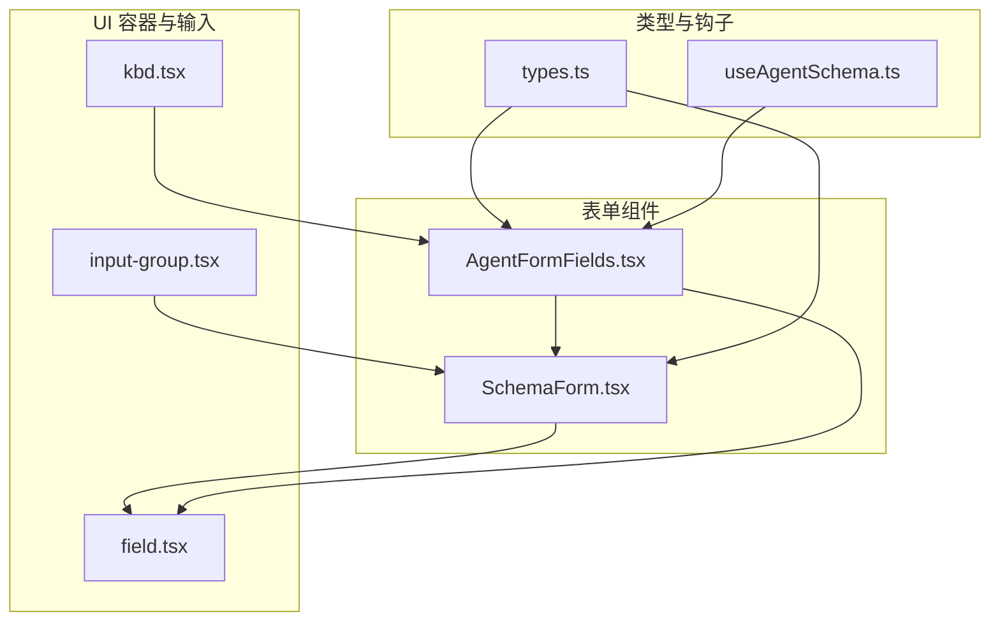
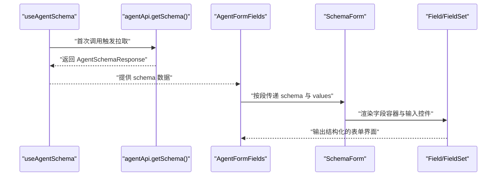
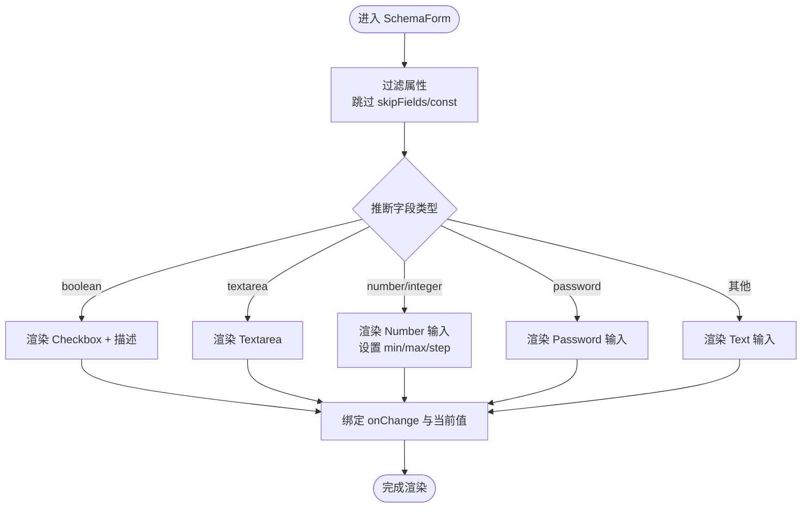
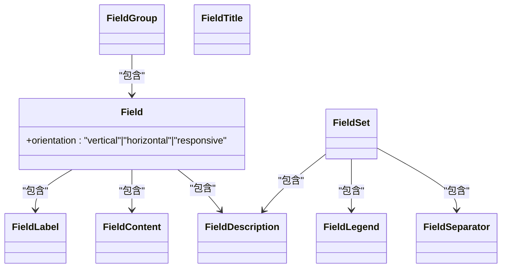
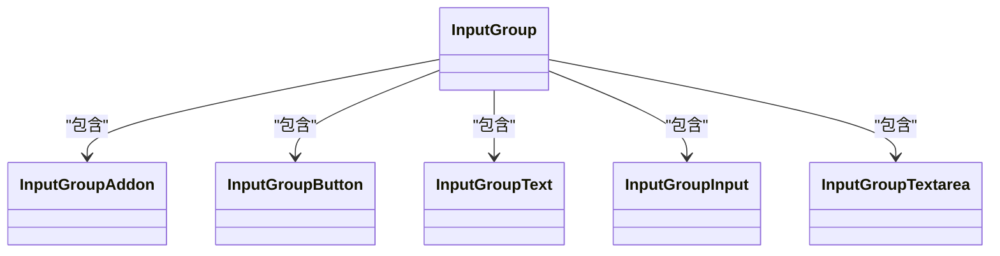
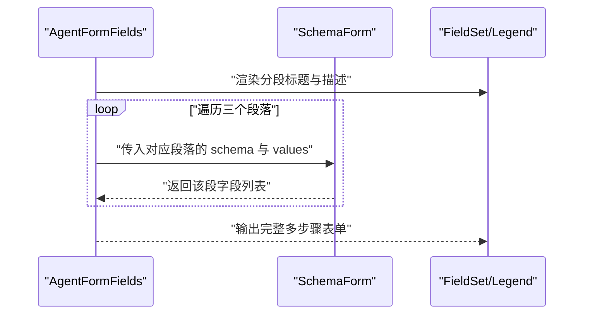
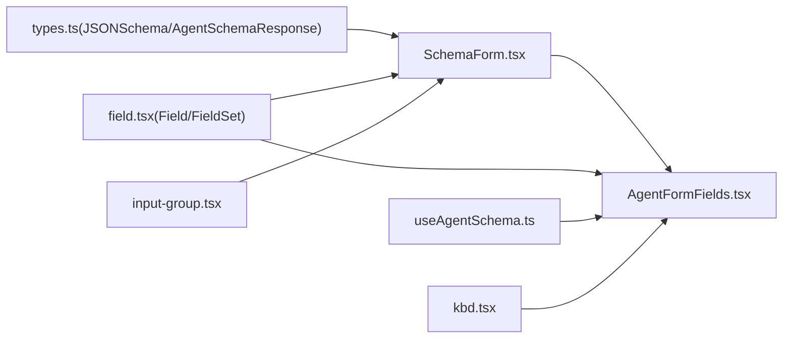

# 表单组件

<cite>
**本文引用的文件**
- [SchemaForm.tsx](file://examples/web_ui/frontend/src/components/form/SchemaForm.tsx)
- [AgentFormFields.tsx](file://examples/web_ui/frontend/src/components/form/AgentFormFields.tsx)
- [field.tsx](file://examples/web_ui/frontend/src/components/ui/field.tsx)
- [input-group.tsx](file://examples/web_ui/frontend/src/components/ui/input-group.tsx)
- [kbd.tsx](file://examples/web_ui/frontend/src/components/ui/kbd.tsx)
- [types.ts](file://examples/web_ui/frontend/src/api/types.ts)
- [useAgentSchema.ts](file://examples/web_ui/frontend/src/hooks/useAgentSchema.ts)
</cite>

## 目录
1. [简介](#简介)
2. [项目结构](#项目结构)
3. [核心组件](#核心组件)
4. [架构总览](#架构总览)
5. [详细组件分析](#详细组件分析)
6. [依赖关系分析](#依赖关系分析)
7. [性能考量](#性能考量)
8. [故障排查指南](#故障排查指南)
9. [结论](#结论)
10. [附录](#附录)

## 简介
本文件系统化梳理 AgentScope Web 前端中的表单体系，重点覆盖以下方面：
- 动态表单生成：基于 JSON Schema 的字段推断与渲染
- 字段容器与布局：Field/FieldGroup/FieldSet 等语义化容器
- 输入组与复合控件：InputGroup 及其插槽化扩展能力
- 键盘快捷键与可访问性：Kbd/KbdGroup 组件与无障碍标签
- 表单状态管理：数据绑定、实时校验与错误展示
- 复杂场景示例：多步骤表单、条件显示与嵌套对象编辑
- 性能优化与大数据量处理最佳实践

## 项目结构
表单相关代码主要位于前端工程的 components/form 与 components/ui 下，并通过 API 类型定义与 hooks 协同工作。

图表来源
- [SchemaForm.tsx:1-175](file://examples/web_ui/frontend/src/components/form/SchemaForm.tsx#L1-L175)
- [AgentFormFields.tsx:1-94](file://examples/web_ui/frontend/src/components/form/AgentFormFields.tsx#L1-L94)
- [field.tsx:1-228](file://examples/web_ui/frontend/src/components/ui/field.tsx#L1-L228)
- [input-group.tsx:1-144](file://examples/web_ui/frontend/src/components/ui/input-group.tsx#L1-L144)
- [kbd.tsx:1-27](file://examples/web_ui/frontend/src/components/ui/kbd.tsx#L1-L27)
- [types.ts:67-176](file://examples/web_ui/frontend/src/api/types.ts#L67-L176)
- [useAgentSchema.ts:1-39](file://examples/web_ui/frontend/src/hooks/useAgentSchema.ts#L1-L39)

章节来源
- [SchemaForm.tsx:1-175](file://examples/web_ui/frontend/src/components/form/SchemaForm.tsx#L1-L175)
- [AgentFormFields.tsx:1-94](file://examples/web_ui/frontend/src/components/form/AgentFormFields.tsx#L1-L94)
- [field.tsx:1-228](file://examples/web_ui/frontend/src/components/ui/field.tsx#L1-L228)
- [input-group.tsx:1-144](file://examples/web_ui/frontend/src/components/ui/input-group.tsx#L1-L144)
- [kbd.tsx:1-27](file://examples/web_ui/frontend/src/components/ui/kbd.tsx#L1-L27)
- [types.ts:67-176](file://examples/web_ui/frontend/src/api/types.ts#L67-L176)
- [useAgentSchema.ts:1-39](file://examples/web_ui/frontend/src/hooks/useAgentSchema.ts#L1-L39)

## 核心组件
- SchemaForm：根据 JSON Schema 动态渲染字段，支持布尔、数字、文本、密码、多行文本等类型；提供默认值提取、必填标记、占位符与描述文案的定制入口。
- AgentFormFields：将多段 JSON Schema（identity/context_config/react_config）组织为分节表单，使用 FieldSet/FieldLegend/FieldSeparator 实现清晰的分组与分隔。
- Field/FieldGroup/FieldSet：语义化表单容器，统一布局、方向与可访问性属性。
- InputGroup：复合输入控件，支持前后缀、按钮、快捷键提示等扩展。
- Kbd/KbdGroup：键盘快捷键展示组件，配合 Tooltip 或内联说明提升可发现性。
- useAgentSchema：拉取并缓存后端返回的 Agent JSON Schema 片段，避免重复请求。

章节来源
- [SchemaForm.tsx:52-175](file://examples/web_ui/frontend/src/components/form/SchemaForm.tsx#L52-L175)
- [AgentFormFields.tsx:33-94](file://examples/web_ui/frontend/src/components/form/AgentFormFields.tsx#L33-L94)
- [field.tsx:8-228](file://examples/web_ui/frontend/src/components/ui/field.tsx#L8-L228)
- [input-group.tsx:9-144](file://examples/web_ui/frontend/src/components/ui/input-group.tsx#L9-L144)
- [kbd.tsx:3-27](file://examples/web_ui/frontend/src/components/ui/kbd.tsx#L3-L27)
- [useAgentSchema.ts:25-39](file://examples/web_ui/frontend/src/hooks/useAgentSchema.ts#L25-L39)

## 架构总览
下图展示了从“拉取 Schema”到“渲染多段表单”的端到端流程。

图表来源
- [useAgentSchema.ts:14-39](file://examples/web_ui/frontend/src/hooks/useAgentSchema.ts#L14-L39)
- [AgentFormFields.tsx:33-74](file://examples/web_ui/frontend/src/components/form/AgentFormFields.tsx#L33-L74)
- [SchemaForm.tsx:52-175](file://examples/web_ui/frontend/src/components/form/SchemaForm.tsx#L52-L175)
- [field.tsx:8-228](file://examples/web_ui/frontend/src/components/ui/field.tsx#L8-L228)

## 详细组件分析

### SchemaForm：动态表单生成与字段映射
- JSON Schema 解析
  - 读取 properties、required、title、description、default、const、format、minimum/maximum 等字段，用于决定渲染类型与约束。
  - 支持 anyOf 中推断有效类型，结合 minimum/maximum/exclusiveMinimum/exclusiveMaximum 提供范围约束。
- 字段映射与渲染策略
  - 布尔：Checkbox + FieldLabel，水平布局，支持描述信息。
  - 数字/整数：Input(type="number")，自动推断 step，空输入转为 undefined，避免后端类型转换失败。
  - 密码：Input(type="password")。
  - 多行文本：Textarea(format="textarea")。
  - 文本：Input(type="text")。
  - 必填项：标题后追加星号标记。
- 默认值与跳过字段
  - defaultValuesFromSchema：从各段 Schema 的 default 提取初始值。
  - skipFields：默认跳过 id、type 等保留字段，且忽略 const 字段。
- 回调与 ID 前缀
  - onChange(key, value)：统一的数据变更回调，便于上层聚合。
  - idPrefix：为每个字段生成唯一 DOM ID，避免页面多实例冲突。

图表来源
- [SchemaForm.tsx:52-175](file://examples/web_ui/frontend/src/components/form/SchemaForm.tsx#L52-L175)
- [types.ts:139-159](file://examples/web_ui/frontend/src/api/types.ts#L139-L159)

章节来源
- [SchemaForm.tsx:27-50](file://examples/web_ui/frontend/src/components/form/SchemaForm.tsx#L27-L50)
- [SchemaForm.tsx:52-175](file://examples/web_ui/frontend/src/components/form/SchemaForm.tsx#L52-L175)
- [types.ts:139-159](file://examples/web_ui/frontend/src/api/types.ts#L139-L159)

### 字段容器与布局：Field/FieldGroup/FieldSet
- Field：单个字段的语义容器，支持 orientation（vertical/horizontal/responsive），自动组合 FieldLabel、FieldDescription、FieldError 等子元素。
- FieldGroup：字段集合容器，提供响应式栅格与对齐能力，内部字段共享样式与间距。
- FieldSet：逻辑分组容器，搭配 FieldLegend/FieldDescription/FieldSeparator 使用，适合多步骤或多配置段落。
- FieldSeparator：分组间分隔线，支持自定义内容，增强视觉层次。

图表来源
- [field.tsx:67-228](file://examples/web_ui/frontend/src/components/ui/field.tsx#L67-L228)

章节来源
- [field.tsx:8-228](file://examples/web_ui/frontend/src/components/ui/field.tsx#L8-L228)

### 输入组与复合控件：InputGroup
- InputGroup：复合输入的外层容器，支持聚焦态边框与阴影高亮，以及错误态样式联动。
- InputGroupAddon：前后缀区域，支持 inline-start/block-start 等对齐方式，点击可聚焦内部输入。
- InputGroupButton：小尺寸按钮，适配输入组场景。
- InputGroupText：静态文本提示，常与快捷键 Kbd 配合。
- InputGroupInput/InputGroupTextarea：包裹原生 Input/Textarea，去除多余边框与阴影，保持与输入组风格一致。

图表来源
- [input-group.tsx:9-144](file://examples/web_ui/frontend/src/components/ui/input-group.tsx#L9-L144)

章节来源
- [input-group.tsx:9-144](file://examples/web_ui/frontend/src/components/ui/input-group.tsx#L9-L144)

### 键盘快捷键：Kbd/KbdGroup
- Kbd：用于展示单个按键或组合键，内置紧凑样式与对比色背景，适配 Tooltip 或内联说明。
- KbdGroup：组合多个 Kbd，形成“Ctrl+Shift+K”等复合快捷键展示。

章节来源
- [kbd.tsx:3-27](file://examples/web_ui/frontend/src/components/ui/kbd.tsx#L3-L27)

### 多步骤表单与嵌套对象编辑：AgentFormFields
- 将 AgentSchemaResponse 拆分为 identity/context_config/react_config 三段，分别渲染为独立 FieldSet。
- 支持 i18n 标签与描述文案的动态注入，标题与描述优先来自翻译键，否则回退到 schema.title/description。
- 通过 idPrefix 与 labelFor/placeholderFor 的组合，确保每段表单的 DOM ID 唯一且可本地化。

图表来源
- [AgentFormFields.tsx:33-74](file://examples/web_ui/frontend/src/components/form/AgentFormFields.tsx#L33-L74)
- [field.tsx:21-37](file://examples/web_ui/frontend/src/components/ui/field.tsx#L21-L37)

章节来源
- [AgentFormFields.tsx:33-94](file://examples/web_ui/frontend/src/components/form/AgentFormFields.tsx#L33-L94)

### 表单状态管理与验证
- 数据绑定
  - SchemaForm 接收 values 与 onChange，以 key-value 形式维护字段状态，支持 undefined/null 表示未填写。
  - 数字输入在空字符串时转换为 undefined，避免后端类型转换异常。
- 实时验证与错误展示
  - FieldError 组件负责错误聚合与去重，支持单条或多条错误列表展示。
  - 输入组通过 aria-invalid 与输入控件的样式联动，直观反馈错误状态。
- 可访问性
  - 所有输入均绑定 htmlFor 对应的 FieldLabel，保证屏幕阅读器正确识别。
  - FieldGroup/FieldSet 使用语义化标签，提供分组与层级信息。

章节来源
- [SchemaForm.tsx:117-153](file://examples/web_ui/frontend/src/components/form/SchemaForm.tsx#L117-L153)
- [field.tsx:168-214](file://examples/web_ui/frontend/src/components/ui/field.tsx#L168-L214)
- [input-group.tsx:14-21](file://examples/web_ui/frontend/src/components/ui/input-group.tsx#L14-L21)

## 依赖关系分析
- SchemaForm 依赖 JSONSchema 类型与 UI 输入组件（Input/Textarea/Checkbox）。
- AgentFormFields 依赖 SchemaForm 与 Field 容器，同时通过 useAgentSchema 获取全局缓存的 AgentSchemaResponse。
- InputGroup 与 Kbd 组件作为通用 UI 扩展，被多种表单场景复用。

图表来源
- [types.ts:67-176](file://examples/web_ui/frontend/src/api/types.ts#L67-L176)
- [SchemaForm.tsx:1-25](file://examples/web_ui/frontend/src/components/form/SchemaForm.tsx#L1-L25)
- [AgentFormFields.tsx:1-23](file://examples/web_ui/frontend/src/components/form/AgentFormFields.tsx#L1-L23)
- [field.tsx:1-7](file://examples/web_ui/frontend/src/components/ui/field.tsx#L1-L7)
- [useAgentSchema.ts:1-13](file://examples/web_ui/frontend/src/hooks/useAgentSchema.ts#L1-L13)
- [input-group.tsx:1-8](file://examples/web_ui/frontend/src/components/ui/input-group.tsx#L1-L8)
- [kbd.tsx:1-3](file://examples/web_ui/frontend/src/components/ui/kbd.tsx#L1-L3)

章节来源
- [types.ts:67-176](file://examples/web_ui/frontend/src/api/types.ts#L67-L176)
- [SchemaForm.tsx:1-25](file://examples/web_ui/frontend/src/components/form/SchemaForm.tsx#L1-L25)
- [AgentFormFields.tsx:1-23](file://examples/web_ui/frontend/src/components/form/AgentFormFields.tsx#L1-L23)
- [field.tsx:1-7](file://examples/web_ui/frontend/src/components/ui/field.tsx#L1-L7)
- [useAgentSchema.ts:1-13](file://examples/web_ui/frontend/src/hooks/useAgentSchema.ts#L1-L13)
- [input-group.tsx:1-8](file://examples/web_ui/frontend/src/components/ui/input-group.tsx#L1-L8)
- [kbd.tsx:1-3](file://examples/web_ui/frontend/src/components/ui/kbd.tsx#L1-L3)

## 性能考量
- 模块级缓存：useAgentSchema 在会话期间缓存 AgentSchemaResponse，避免重复网络请求。
- 虚拟化与分页：对于大型表单或长列表输入，建议采用虚拟滚动与分步加载。
- 渲染优化：将 onChange 限制在必要字段，减少不必要的重渲染；对复杂输入使用防抖。
- 输入组样式：InputGroup 通过最小化边框与阴影，降低重绘成本。
- 大数据量处理：对数值输入采用空字符串到 undefined 的转换，避免无效字符串传播至后端。

章节来源
- [useAgentSchema.ts:11-23](file://examples/web_ui/frontend/src/hooks/useAgentSchema.ts#L11-L23)
- [SchemaForm.tsx:135-147](file://examples/web_ui/frontend/src/components/form/SchemaForm.tsx#L135-L147)
- [input-group.tsx:14-21](file://examples/web_ui/frontend/src/components/ui/input-group.tsx#L14-L21)

## 故障排查指南
- 数字输入异常
  - 现象：输入空值时报类型错误或后端拒绝。
  - 处理：确认空字符串已转换为 undefined，后端再应用默认值。
  - 参考路径：[SchemaForm.tsx:135-147](file://examples/web_ui/frontend/src/components/form/SchemaForm.tsx#L135-L147)
- 必填项未生效
  - 现象：星号标记缺失或校验未触发。
  - 处理：检查 schema.required 是否包含对应字段；确保 onChange 正确更新 values。
  - 参考路径：[SchemaForm.tsx:70-71](file://examples/web_ui/frontend/src/components/form/SchemaForm.tsx#L70-L71)
- 多实例冲突
  - 现象：页面存在多个 SchemaForm 时 ID 冲突导致可访问性问题。
  - 处理：为每个实例设置不同的 idPrefix。
  - 参考路径：[SchemaForm.tsx:60-61](file://examples/web_ui/frontend/src/components/form/SchemaForm.tsx#L60-L61)
- 错误信息不显示
  - 现象：输入错误但无提示。
  - 处理：确认 FieldError 接收的 errors 数组非空且 message 存在；检查 aria-invalid 与样式联动。
  - 参考路径：[field.tsx:168-214](file://examples/web_ui/frontend/src/components/ui/field.tsx#L168-L214)

章节来源
- [SchemaForm.tsx:60-71](file://examples/web_ui/frontend/src/components/form/SchemaForm.tsx#L60-L71)
- [SchemaForm.tsx:135-147](file://examples/web_ui/frontend/src/components/form/SchemaForm.tsx#L135-L147)
- [field.tsx:168-214](file://examples/web_ui/frontend/src/components/ui/field.tsx#L168-L214)

## 结论
本表单体系以 JSON Schema 为核心驱动，通过 SchemaForm 与 AgentFormFields 实现动态、可本地化、可扩展的表单渲染；借助 Field/FieldSet 等容器与 InputGroup/Kbd 等扩展组件，兼顾可访问性与用户体验。配合 useAgentSchema 的缓存机制与输入组样式优化，可在复杂场景下保持良好的性能与一致性。

## 附录
- 复杂场景实现要点
  - 多步骤表单：使用 AgentFormFields 将不同段落拆分为独立 FieldSet，分别渲染。
  - 条件显示：利用 schema.properties 中的 const/required/format 等元数据控制字段可见性与交互。
  - 嵌套对象编辑：通过 JSON Schema 的嵌套结构与 InputGroup 的组合扩展，实现复合输入与快捷键提示。