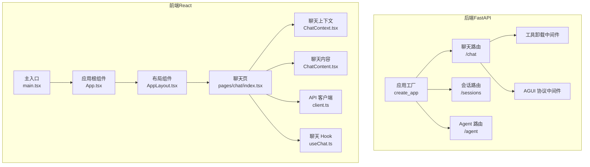
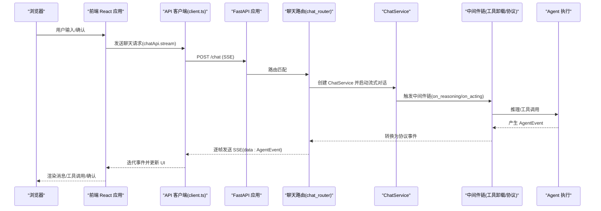
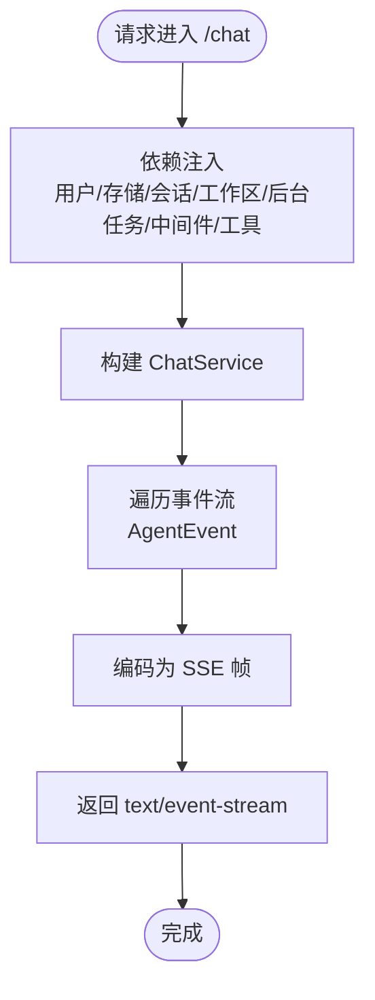
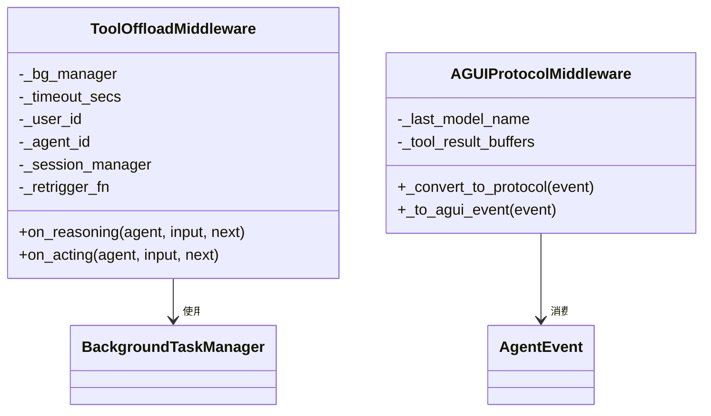
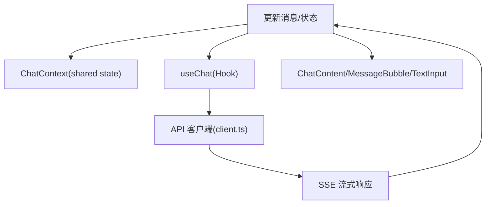
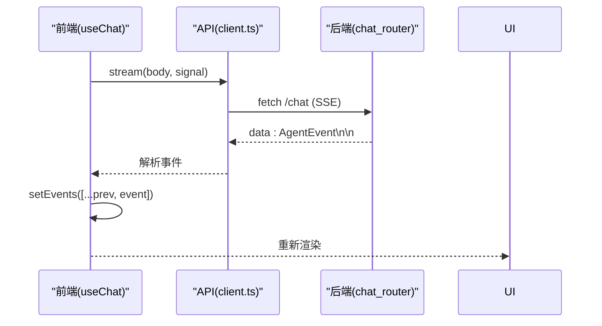
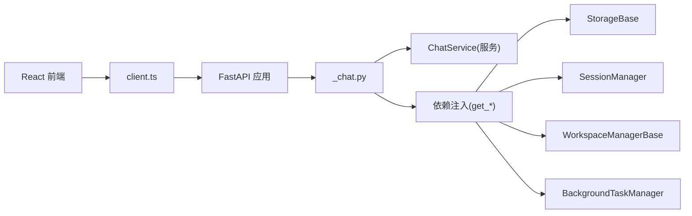

# Web界面

<cite>
**本文引用的文件**
- [后端入口 index.ts](file://examples/web_ui/backend/src/index.ts)
- [前端包配置 package.json](file://examples/web_ui/frontend/package.json)
- [应用工厂 _app.py](file://src/agentscope/app/_app.py)
- [聊天路由 _chat.py](file://src/agentscope/app/_router/_chat.py)
- [会话路由 _session.py](file://src/agentscope/app/_router/_session.py)
- [Agent 路由 _agent.py](file://src/agentscope/app/_router/_agent.py)
- [工具卸载中间件 _tool_offload_middleware.py](file://src/agentscope/app/_middleware/_tool_offload_middleware.py)
- [AGUI 协议中间件 _agui.py](file://src/agentscope/app/_middleware/_protocol/_agui.py)
- [前端应用 App.tsx](file://examples/web_ui/frontend/src/App.tsx)
- [前端主入口 main.tsx](file://examples/web_ui/frontend/src/main.tsx)
- [聊天页 index.tsx](file://examples/web_ui/frontend/src/pages/chat/index.tsx)
- [布局组件 AppLayout.tsx](file://examples/web_ui/frontend/src/components/layout/AppLayout.tsx)
- [聊天上下文 ChatContext.tsx](file://examples/web_ui/frontend/src/context/ChatContext.tsx)
- [聊天内容 ChatContent.tsx](file://examples/web_ui/frontend/src/components/chat/ChatContent.tsx)
- [聊天钩子 useChat.ts](file://examples/web_ui/frontend/src/hooks/useChat.ts)
- [API 客户端 client.ts](file://examples/web_ui/frontend/src/api/client.ts)
</cite>

## 目录
1. [简介](#简介)
2. [项目结构](#项目结构)
3. [核心组件](#核心组件)
4. [架构总览](#架构总览)
5. [详细组件分析](#详细组件分析)
6. [依赖关系分析](#依赖关系分析)
7. [性能考虑](#性能考虑)
8. [故障排查指南](#故障排查指南)
9. [结论](#结论)
10. [附录](#附录)

## 简介
本文件面向 AgentScope Web 界面的使用者与开发者，系统性说明基于 FastAPI 的后端服务架构（API 路由、中间件、协议转换）与基于 React 的前端应用（组件结构、状态管理、实时通信）。重点覆盖以下方面：
- 后端：以 FastAPI 应用工厂为核心，注册多路由模块（聊天、会话、Agent、模型等），通过依赖注入与中间件链路实现多租户与多会话支持；采用 Server-Sent Events（SSE）进行事件流传输。
- 前端：以 React + Vite 构建，采用路由驱动的页面组织、上下文共享状态、Hook 封装 API 请求与 SSE 流式处理；提供聊天界面、智能体管理、会话管理与工作区工具面板。
- 实时通信：后端以 SSE 输出 AgentEvent 事件帧，前端使用 fetch + 可中断流式读取，结合 UI 状态同步与自动滚动策略。
- 多租户与多会话：通过用户标识、会话隔离与权限模式控制，结合后台任务中间件保障长耗时工具在会话空闲时的续跑与结果回注。

## 项目结构
Web 界面由“后端 FastAPI 服务”和“前端 React 应用”两部分组成，分别位于 examples/web_ui/backend 与 examples/web_ui/frontend。后端负责业务逻辑与数据持久化，前端负责用户交互与实时渲染。

**图表来源**
- [应用工厂 _app.py:29-130](file://src/agentscope/app/_app.py#L29-L130)
- [聊天路由 _chat.py:27-131](file://src/agentscope/app/_router/_chat.py#L27-L131)
- [会话路由 _session.py:23-301](file://src/agentscope/app/_router/_session.py#L23-L301)
- [Agent 路由 _agent.py:18-210](file://src/agentscope/app/_router/_agent.py#L18-L210)
- [工具卸载中间件 _tool_offload_middleware.py:21-407](file://src/agentscope/app/_middleware/_tool_offload_middleware.py#L21-L407)
- [AGUI 协议中间件 _agui.py:43-258](file://src/agentscope/app/_middleware/_protocol/_agui.py#L43-L258)
- [前端主入口 main.tsx:1-16](file://examples/web_ui/frontend/src/main.tsx#L1-L16)
- [前端应用 App.tsx:1-65](file://examples/web_ui/frontend/src/App.tsx#L1-L65)
- [布局组件 AppLayout.tsx:1-18](file://examples/web_ui/frontend/src/components/layout/AppLayout.tsx#L1-L18)
- [聊天页 index.tsx:1-613](file://examples/web_ui/frontend/src/pages/chat/index.tsx#L1-L613)
- [聊天上下文 ChatContext.tsx:1-46](file://examples/web_ui/frontend/src/context/ChatContext.tsx#L1-L46)
- [聊天内容 ChatContent.tsx:1-116](file://examples/web_ui/frontend/src/components/chat/ChatContent.tsx#L1-L116)
- [API 客户端 client.ts:1-112](file://examples/web_ui/frontend/src/api/client.ts#L1-L112)
- [聊天钩子 useChat.ts:1-49](file://examples/web_ui/frontend/src/hooks/useChat.ts#L1-L49)

**章节来源**
- [应用工厂 _app.py:29-130](file://src/agentscope/app/_app.py#L29-L130)
- [前端包配置 package.json:1-64](file://examples/web_ui/frontend/package.json#L1-L64)

## 核心组件
- 后端应用工厂：集中注册内置路由与可选中间件，挂载共享状态（存储、工作区、额外中间件/工具工厂），支持独立运行或挂载到现有应用。
- 聊天路由：提供 SSE 流式聊天接口，封装事件编码与依赖注入，返回 text/event-stream。
- 会话路由：提供会话生命周期管理（创建、查询、更新、删除），并支持分页列出消息。
- Agent 路由：提供 Agent 配置的增删改查与表单 Schema 返回。
- 工具卸载中间件：对超时工具调用进行后台任务卸载，保证推理循环不阻塞，并在会话空闲时回注结果。
- AGUI 协议中间件：将 AgentScope 事件转换为 AGUI 协议事件，便于前端统一消费。
- 前端应用：路由驱动页面（聊天、日程、凭据、设置），全局 Toast 提示与向导引导。
- 前端聊天页：侧边栏管理 Agent 与会话，顶部选择模型与权限模式，主区域展示消息与输入框。
- 前端 Hook 与客户端：封装 SSE 流式请求、错误处理与中止能力，配合上下文共享当前选中的 Agent 与会话。

**章节来源**
- [应用工厂 _app.py:29-130](file://src/agentscope/app/_app.py#L29-L130)
- [聊天路由 _chat.py:27-131](file://src/agentscope/app/_router/_chat.py#L27-L131)
- [会话路由 _session.py:23-301](file://src/agentscope/app/_router/_session.py#L23-L301)
- [Agent 路由 _agent.py:18-210](file://src/agentscope/app/_router/_agent.py#L18-L210)
- [工具卸载中间件 _tool_offload_middleware.py:21-407](file://src/agentscope/app/_middleware/_tool_offload_middleware.py#L21-L407)
- [AGUI 协议中间件 _agui.py:43-258](file://src/agentscope/app/_middleware/_protocol/_agui.py#L43-L258)
- [前端应用 App.tsx:1-65](file://examples/web_ui/frontend/src/App.tsx#L1-L65)
- [聊天页 index.tsx:1-613](file://examples/web_ui/frontend/src/pages/chat/index.tsx#L1-L613)
- [聊天钩子 useChat.ts:1-49](file://examples/web_ui/frontend/src/hooks/useChat.ts#L1-L49)
- [API 客户端 client.ts:1-112](file://examples/web_ui/frontend/src/api/client.ts#L1-L112)

## 架构总览
下图展示从浏览器到后端服务再到 Agent 执行的端到端流程，以及事件流如何通过 SSE 回传至前端。

**图表来源**
- [聊天路由 _chat.py:34-131](file://src/agentscope/app/_router/_chat.py#L34-L131)
- [工具卸载中间件 _tool_offload_middleware.py:106-407](file://src/agentscope/app/_middleware/_tool_offload_middleware.py#L106-L407)
- [AGUI 协议中间件 _agui.py:60-258](file://src/agentscope/app/_middleware/_protocol/_agui.py#L60-L258)
- [聊天钩子 useChat.ts:22-40](file://examples/web_ui/frontend/src/hooks/useChat.ts#L22-L40)
- [API 客户端 client.ts:109-112](file://examples/web_ui/frontend/src/api/client.ts#L109-L112)

## 详细组件分析

### 后端：FastAPI 应用与路由
- 应用工厂 create_app
  - 注册内置路由：agent、background_task、chat、credential、schedule、session、workspace、model。
  - 支持挂载到现有应用（mount），并注入共享状态（存储、工作区、额外中间件/工具工厂）。
  - 生命周期由 lifespan 管理，确保资源正确初始化与释放。
- 聊天路由 /chat
  - 依赖注入：当前用户、存储、会话管理器、工作区管理器、后台任务管理器、额外中间件/工具工厂。
  - SSE 编码：将 AgentEvent 逐帧序列化为 data: JSON\n\n 的格式。
  - 返回类型：text/event-stream，设置缓存控制与缓冲标志。
- 会话路由 /sessions
  - 列表、创建、更新、删除会话；支持分页列出消息。
  - 权限校验：确保引用的凭据属于当前用户。
  - 更新语义：PATCH 支持仅更新显式字段，允许清空回退模型配置。
- Agent 路由 /agent
  - 返回用于表单渲染的 JSON Schema 片段（身份、上下文、ReAct）。
  - 列表、创建、更新、删除 Agent 配置。

**图表来源**
- [聊天路由 _chat.py:34-131](file://src/agentscope/app/_router/_chat.py#L34-L131)

**章节来源**
- [应用工厂 _app.py:29-130](file://src/agentscope/app/_app.py#L29-L130)
- [聊天路由 _chat.py:27-131](file://src/agentscope/app/_router/_chat.py#L27-L131)
- [会话路由 _session.py:23-301](file://src/agentscope/app/_router/_session.py#L23-L301)
- [Agent 路由 _agent.py:18-210](file://src/agentscope/app/_router/_agent.py#L18-L210)

### 中间件：工具卸载与协议转换
- 工具卸载中间件
  - 在工具执行超时前，将任务注册到后台任务管理器，返回占位响应以避免阻塞推理。
  - 在会话空闲时，将后台任务结果注入上下文，触发重新推理。
  - 对需要实时状态注入或外部等待的工具，强制同步执行。
- AGUI 协议中间件
  - 将 AgentScope 的事件体系映射为 AGUI 协议事件，便于前端统一消费与渲染。

**图表来源**
- [工具卸载中间件 _tool_offload_middleware.py:21-407](file://src/agentscope/app/_middleware/_tool_offload_middleware.py#L21-L407)
- [AGUI 协议中间件 _agui.py:43-258](file://src/agentscope/app/_middleware/_protocol/_agui.py#L43-L258)

**章节来源**
- [工具卸载中间件 _tool_offload_middleware.py:21-407](file://src/agentscope/app/_middleware/_tool_offload_middleware.py#L21-L407)
- [AGUI 协议中间件 _agui.py:43-258](file://src/agentscope/app/_middleware/_protocol/_agui.py#L43-L258)

### 前端：React 组件与状态管理
- 应用入口与布局
  - main.tsx 渲染根节点并包裹 TooltipProvider。
  - App.tsx 使用 React Router 配置路由，AppLayout 提供侧边栏容器与 Outlet 插槽。
- 聊天页
  - 通过 ChatContext 共享当前选中的 Agent 与会话。
  - 侧边栏：Agent 选择、会话列表、重命名/删除操作。
  - 顶部：模型选择（含参数编辑）、回退模型、权限模式切换。
  - 主区域：ChatContent 展示消息，TextInput 输入与文件处理。
- Hook 与 API
  - useChat 封装 SSE 流式请求，支持中止、错误捕获与事件累积。
  - client.ts 封装通用请求与流式请求，自动添加用户标识头，解析非 2xx 错误并弹出 Toast。

**图表来源**
- [聊天页 index.tsx:1-613](file://examples/web_ui/frontend/src/pages/chat/index.tsx#L1-L613)
- [聊天上下文 ChatContext.tsx:1-46](file://examples/web_ui/frontend/src/context/ChatContext.tsx#L1-L46)
- [聊天钩子 useChat.ts:1-49](file://examples/web_ui/frontend/src/hooks/useChat.ts#L1-L49)
- [API 客户端 client.ts:1-112](file://examples/web_ui/frontend/src/api/client.ts#L1-L112)
- [聊天内容 ChatContent.tsx:1-116](file://examples/web_ui/frontend/src/components/chat/ChatContent.tsx#L1-L116)

**章节来源**
- [前端主入口 main.tsx:1-16](file://examples/web_ui/frontend/src/main.tsx#L1-L16)
- [前端应用 App.tsx:1-65](file://examples/web_ui/frontend/src/App.tsx#L1-L65)
- [布局组件 AppLayout.tsx:1-18](file://examples/web_ui/frontend/src/components/layout/AppLayout.tsx#L1-L18)
- [聊天页 index.tsx:1-613](file://examples/web_ui/frontend/src/pages/chat/index.tsx#L1-L613)
- [聊天上下文 ChatContext.tsx:1-46](file://examples/web_ui/frontend/src/context/ChatContext.tsx#L1-L46)
- [聊天内容 ChatContent.tsx:1-116](file://examples/web_ui/frontend/src/components/chat/ChatContent.tsx#L1-L116)
- [聊天钩子 useChat.ts:1-49](file://examples/web_ui/frontend/src/hooks/useChat.ts#L1-L49)
- [API 客户端 client.ts:1-112](file://examples/web_ui/frontend/src/api/client.ts#L1-L112)

### 实时通信机制：SSE 与 UI 同步
- 后端 SSE
  - 路由返回 text/event-stream，每帧为 data: JSON\n\n。
  - 事件按顺序到达，前端逐帧解析并追加到事件数组。
- 前端流式处理
  - useChat 中使用 AbortController 控制流中断，避免并发请求冲突。
  - client.stream 返回 Response，前端循环读取事件并更新 UI。
- UI 同步策略
  - ChatContent 自动滚动至底部（当用户靠近底部时）。
  - 事件累积后触发渲染，消息气泡组件根据事件类型渲染文本、思考块、工具调用与结果。

**图表来源**
- [聊天钩子 useChat.ts:22-40](file://examples/web_ui/frontend/src/hooks/useChat.ts#L22-L40)
- [API 客户端 client.ts:73-98](file://examples/web_ui/frontend/src/api/client.ts#L73-L98)
- [聊天路由 _chat.py:114-130](file://src/agentscope/app/_router/_chat.py#L114-L130)

**章节来源**
- [聊天钩子 useChat.ts:1-49](file://examples/web_ui/frontend/src/hooks/useChat.ts#L1-L49)
- [API 客户端 client.ts:1-112](file://examples/web_ui/frontend/src/api/client.ts#L1-L112)
- [聊天路由 _chat.py:34-131](file://src/agentscope/app/_router/_chat.py#L34-L131)

### 多租户与多会话支持
- 多租户
  - 通过 X-User-ID 请求头与 get_current_user_id 依赖注入，确保所有资源操作绑定到当前用户。
  - 会话与 Agent 的查询/更新/删除均进行用户归属校验。
- 多会话
  - 每个 (user_id, agent_id, workspace_id) 最多一个活动会话；重复创建会更新现有会话。
  - 会话状态包含权限上下文（如权限模式），支持在会话级动态调整。
  - 工具卸载中间件在会话空闲时回注后台任务结果，保持多轮对话连贯性。

**章节来源**
- [聊天路由 _chat.py:8-16](file://src/agentscope/app/_router/_chat.py#L8-L16)
- [会话路由 _session.py:100-147](file://src/agentscope/app/_router/_session.py#L100-L147)
- [工具卸载中间件 _tool_offload_middleware.py:106-165](file://src/agentscope/app/_middleware/_tool_offload_middleware.py#L106-L165)

### 部署指南与自定义开发建议
- 后端部署
  - 使用应用工厂 create_app 构建 FastAPI 应用，可独立运行或挂载到现有应用。
  - 配置存储后端（如 RedisStorage）与工作区管理器（如 LocalWorkspaceManager）。
  - 可通过 extra_middlewares 注入自定义 ASGI 中间件，通过 extra_agent_middlewares/extra_agent_tools 注入按租户/会话定制的中间件与工具。
- 前端部署
  - 使用 Vite 构建，依赖包在 package.json 中声明。
  - 首次访问需完成服务器地址与用户名配置（localStorage 存储）。
- 自定义开发
  - 新增路由：在 app/_router 下新增模块并在 create_app 中 include_router。
  - 新增中间件：实现 MiddlewareBase 或继承现有中间件，注入到 extra_middlewares。
  - 前端扩展：新增页面路由，在 App.tsx 中注册；通过 useChat 与 API 客户端对接后端 SSE。

**章节来源**
- [应用工厂 _app.py:29-130](file://src/agentscope/app/_app.py#L29-L130)
- [前端包配置 package.json:1-64](file://examples/web_ui/frontend/package.json#L1-L64)
- [前端应用 App.tsx:27-38](file://examples/web_ui/frontend/src/App.tsx#L27-L38)

## 依赖关系分析
后端依赖注入链路清晰，路由层仅负责编排与编码，核心逻辑下沉到服务层与中间件链；前端通过 Hook 与客户端解耦网络细节，专注于 UI 与交互。

**图表来源**
- [聊天路由 _chat.py:8-16](file://src/agentscope/app/_router/_chat.py#L8-L16)
- [聊天路由 _chat.py:51-65](file://src/agentscope/app/_router/_chat.py#L51-L65)
- [API 客户端 client.ts:100-112](file://examples/web_ui/frontend/src/api/client.ts#L100-L112)

**章节来源**
- [聊天路由 _chat.py:8-16](file://src/agentscope/app/_router/_chat.py#L8-L16)
- [API 客户端 client.ts:100-112](file://examples/web_ui/frontend/src/api/client.ts#L100-L112)

## 性能考虑
- SSE 流式传输：减少一次性大响应开销，前端逐帧渲染提升感知性能。
- 工具卸载中间件：对长耗时工具异步执行，避免阻塞推理循环，提高吞吐。
- 自动滚动优化：仅在用户靠近底部时滚动到底部，避免频繁重排。
- 依赖注入与生命周期：通过 lifespan 管理资源，降低冷启动与内存泄漏风险。

## 故障排查指南
- 常见错误
  - 非 2xx 响应：client.ts 会解析 detail 字段并通过 Toast 提示；可在调用方设置 silent=true 抑制自动提示。
  - SSE 中断：useChat 支持 AbortController 中止当前流，再次发送请求前先中止上一次流。
  - 权限/归属错误：会话与 Agent 操作失败通常因未找到或不属于当前用户，检查 X-User-ID 与路由参数。
- 建议排查步骤
  - 检查浏览器 Network 面板中 /chat 的 SSE 流是否持续收到 data 帧。
  - 查看前端控制台是否有 AbortError（主动中止）或 API 错误。
  - 后端日志中确认 ChatService 是否正常启动与事件生成。

**章节来源**
- [API 客户端 client.ts:62-71](file://examples/web_ui/frontend/src/api/client.ts#L62-L71)
- [聊天钩子 useChat.ts:35-40](file://examples/web_ui/frontend/src/hooks/useChat.ts#L35-L40)

## 结论
AgentScope Web 界面通过“后端 FastAPI + 前端 React”的组合，实现了高内聚的聊天服务与灵活的前端交互。后端以路由与中间件为核心，提供多租户隔离、多会话支持与长耗时工具的后台处理；前端以 Hook 与 SSE 为基础，提供流畅的消息渲染与工具调用反馈。该架构易于扩展与定制，适合在企业级场景中快速落地。

## 附录
- 快速启动
  - 后端：使用 create_app 构建应用并运行（可挂载或独立运行）。
  - 前端：安装依赖后运行 dev，首次访问完成服务器地址与用户名配置。
- 关键路径参考
  - 后端健康检查：/api/health（示例后端）
  - 聊天流式接口：POST /chat（后端路由）
  - 前端流式 Hook：useChat（前端 Hook）

**章节来源**
- [后端入口 index.ts:10-12](file://examples/web_ui/backend/src/index.ts#L10-L12)
- [聊天路由 _chat.py:68-131](file://src/agentscope/app/_router/_chat.py#L68-L131)
- [聊天钩子 useChat.ts:1-49](file://examples/web_ui/frontend/src/hooks/useChat.ts#L1-L49)