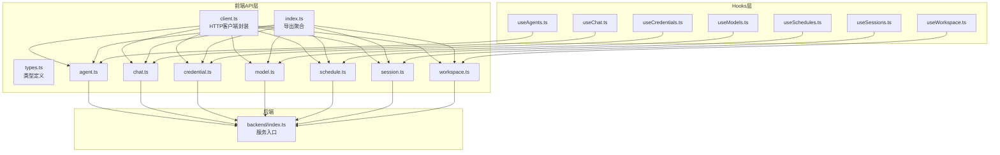
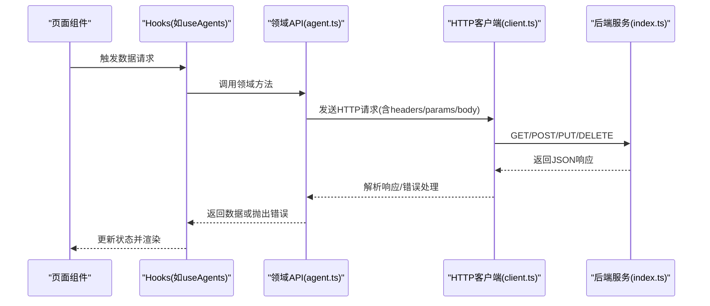
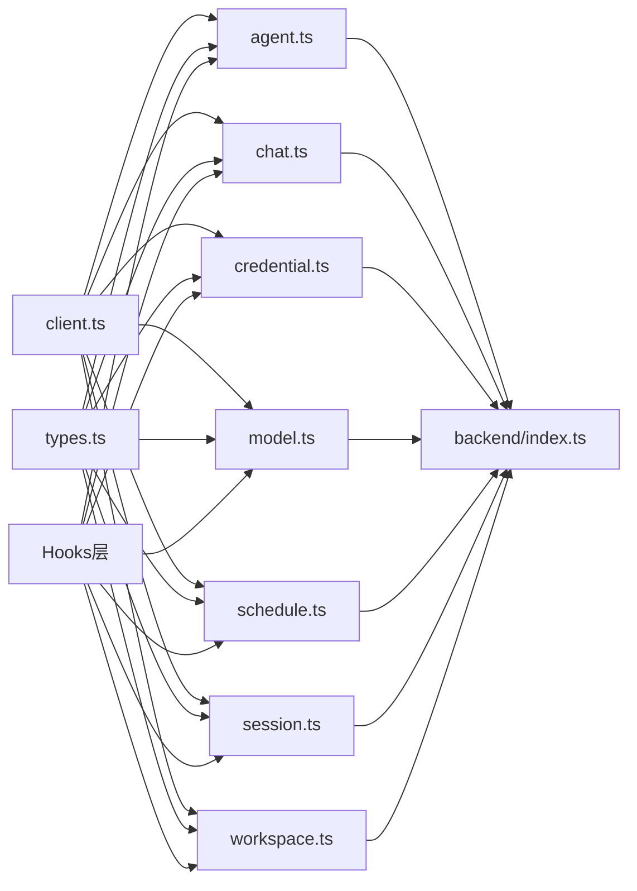

# API集成

<cite>
**本文引用的文件**
- [examples/web_ui/backend/src/index.ts](file://examples/web_ui/backend/src/index.ts)
- [examples/web_ui/frontend/src/api/client.ts](file://examples/web_ui/frontend/src/api/client.ts)
- [examples/web_ui/frontend/src/api/types.ts](file://examples/web_ui/frontend/src/api/types.ts)
- [examples/web_ui/frontend/src/api/agent.ts](file://examples/web_ui/frontend/src/api/agent.ts)
- [examples/web_ui/frontend/src/api/chat.ts](file://examples/web_ui/frontend/src/api/chat.ts)
- [examples/web_ui/frontend/src/api/credential.ts](file://examples/web_ui/frontend/src/api/credential.ts)
- [examples/web_ui/frontend/src/api/model.ts](file://examples/web_ui/frontend/src/api/model.ts)
- [examples/web_ui/frontend/src/api/schedule.ts](file://examples/web_ui/frontend/src/api/schedule.ts)
- [examples/web_ui/frontend/src/api/session.ts](file://examples/web_ui/frontend/src/api/session.ts)
- [examples/web_ui/frontend/src/api/workspace.ts](file://examples/web_ui/frontend/src/api/workspace.ts)
- [examples/web_ui/frontend/src/hooks/useAgents.ts](file://examples/web_ui/frontend/src/hooks/useAgents.ts)
- [examples/web_ui/frontend/src/hooks/useChat.ts](file://examples/web_ui/frontend/src/hooks/useChat.ts)
- [examples/web_ui/frontend/src/hooks/useCredentials.ts](file://examples/web_ui/frontend/src/hooks/useCredentials.ts)
- [examples/web_ui/frontend/src/hooks/useModels.ts](file://examples/web_ui/frontend/src/hooks/useModels.ts)
- [examples/web_ui/frontend/src/hooks/useSchedules.ts](file://examples/web_ui/frontend/src/hooks/useSchedules.ts)
- [examples/web_ui/frontend/src/hooks/useSessions.ts](file://examples/web_ui/frontend/src/hooks/useSessions.ts)
- [examples/web_ui/frontend/src/hooks/useWorkspace.ts](file://examples/web_ui/frontend/src/hooks/useWorkspace.ts)
</cite>

## 目录
1. [简介](#简介)
2. [项目结构](#项目结构)
3. [核心组件](#核心组件)
4. [架构总览](#架构总览)
5. [详细组件分析](#详细组件分析)
6. [依赖分析](#依赖分析)
7. [性能考虑](#性能考虑)
8. [故障排查指南](#故障排查指南)
9. [结论](#结论)
10. [附录](#附录)

## 简介
本文件面向AgentScope Web UI的前端API集成，系统性梳理后端RESTful API的设计与调用策略、HTTP请求封装与响应处理机制、认证与权限控制、数据获取与缓存策略、以及完整的API接口文档与最佳实践。目标是帮助开发者快速理解并正确集成前端与后端之间的数据交互。

## 项目结构
前端API模块位于 examples/web_ui/frontend/src/api，采用按功能域划分的组织方式：每个领域（如agent、chat、credential、model、schedule、session、workspace）对应独立的模块化文件，统一通过入口文件导出。同时，配套的React Hooks用于在页面中消费这些API，实现数据拉取、状态更新与缓存管理。

图表来源
- [examples/web_ui/frontend/src/api/client.ts](file://examples/web_ui/frontend/src/api/client.ts)
- [examples/web_ui/frontend/src/api/types.ts](file://examples/web_ui/frontend/src/api/types.ts)
- [examples/web_ui/frontend/src/api/agent.ts](file://examples/web_ui/frontend/src/api/agent.ts)
- [examples/web_ui/frontend/src/api/chat.ts](file://examples/web_ui/frontend/src/api/chat.ts)
- [examples/web_ui/frontend/src/api/credential.ts](file://examples/web_ui/frontend/src/api/credential.ts)
- [examples/web_ui/frontend/src/api/model.ts](file://examples/web_ui/frontend/src/api/model.ts)
- [examples/web_ui/frontend/src/api/schedule.ts](file://examples/web_ui/frontend/src/api/schedule.ts)
- [examples/web_ui/frontend/src/api/session.ts](file://examples/web_ui/frontend/src/api/session.ts)
- [examples/web_ui/frontend/src/api/workspace.ts](file://examples/web_ui/frontend/src/api/workspace.ts)
- [examples/web_ui/frontend/src/api/index.ts](file://examples/web_ui/frontend/src/api/index.ts)
- [examples/web_ui/frontend/src/hooks/useAgents.ts](file://examples/web_ui/frontend/src/hooks/useAgents.ts)
- [examples/web_ui/frontend/src/hooks/useChat.ts](file://examples/web_ui/frontend/src/hooks/useChat.ts)
- [examples/web_ui/frontend/src/hooks/useCredentials.ts](file://examples/web_ui/frontend/src/hooks/useCredentials.ts)
- [examples/web_ui/frontend/src/hooks/useModels.ts](file://examples/web_ui/frontend/src/hooks/useModels.ts)
- [examples/web_ui/frontend/src/hooks/useSchedules.ts](file://examples/web_ui/frontend/src/hooks/useSchedules.ts)
- [examples/web_ui/frontend/src/hooks/useSessions.ts](file://examples/web_ui/frontend/src/hooks/useSessions.ts)
- [examples/web_ui/frontend/src/hooks/useWorkspace.ts](file://examples/web_ui/frontend/src/hooks/useWorkspace.ts)
- [examples/web_ui/backend/src/index.ts](file://examples/web_ui/backend/src/index.ts)

章节来源
- [examples/web_ui/frontend/src/api/index.ts](file://examples/web_ui/frontend/src/api/index.ts)
- [examples/web_ui/frontend/src/api/client.ts](file://examples/web_ui/frontend/src/api/client.ts)
- [examples/web_ui/frontend/src/api/types.ts](file://examples/web_ui/frontend/src/api/types.ts)

## 核心组件
- HTTP客户端封装：在client.ts中集中管理基础URL、默认请求头、超时、重试等通用配置，避免重复代码并统一行为。
- 领域API模块：agent.ts、chat.ts、credential.ts、model.ts、schedule.ts、session.ts、workspace.ts分别暴露该领域的增删改查与业务方法，内部复用HTTP客户端。
- 类型定义：types.ts集中声明请求/响应结构体、枚举与联合类型，确保前后端契约一致。
- Hooks层：useAgents.ts、useChat.ts、useCredentials.ts、useModels.ts、useSchedules.ts、useSessions.ts、useWorkspace.ts对领域API进行二次封装，负责数据拉取、缓存、错误处理与状态管理，便于在组件中直接消费。

章节来源
- [examples/web_ui/frontend/src/api/client.ts](file://examples/web_ui/frontend/src/api/client.ts)
- [examples/web_ui/frontend/src/api/agent.ts](file://examples/web_ui/frontend/src/api/agent.ts)
- [examples/web_ui/frontend/src/api/chat.ts](file://examples/web_ui/frontend/src/api/chat.ts)
- [examples/web_ui/frontend/src/api/credential.ts](file://examples/web_ui/frontend/src/api/credential.ts)
- [examples/web_ui/frontend/src/api/model.ts](file://examples/web_ui/frontend/src/api/model.ts)
- [examples/web_ui/frontend/src/api/schedule.ts](file://examples/web_ui/frontend/src/api/schedule.ts)
- [examples/web_ui/frontend/src/api/session.ts](file://examples/web_ui/frontend/src/api/session.ts)
- [examples/web_ui/frontend/src/api/workspace.ts](file://examples/web_ui/frontend/src/api/workspace.ts)
- [examples/web_ui/frontend/src/api/types.ts](file://examples/web_ui/frontend/src/api/types.ts)
- [examples/web_ui/frontend/src/hooks/useAgents.ts](file://examples/web_ui/frontend/src/hooks/useAgents.ts)
- [examples/web_ui/frontend/src/hooks/useChat.ts](file://examples/web_ui/frontend/src/hooks/useChat.ts)
- [examples/web_ui/frontend/src/hooks/useCredentials.ts](file://examples/web_ui/frontend/src/hooks/useCredentials.ts)
- [examples/web_ui/frontend/src/hooks/useModels.ts](file://examples/web_ui/frontend/src/hooks/useModels.ts)
- [examples/web_ui/frontend/src/hooks/useSchedules.ts](file://examples/web_ui/frontend/src/hooks/useSchedules.ts)
- [examples/web_ui/frontend/src/hooks/useSessions.ts](file://examples/web_ui/frontend/src/hooks/useSessions.ts)
- [examples/web_ui/frontend/src/hooks/useWorkspace.ts](file://examples/web_ui/frontend/src/hooks/useWorkspace.ts)

## 架构总览
前端通过HTTP客户端向后端发起RESTful请求；后端服务根据路由分发到具体业务模块；前端Hooks负责数据生命周期管理与UI状态同步。

图表来源
- [examples/web_ui/frontend/src/hooks/useAgents.ts](file://examples/web_ui/frontend/src/hooks/useAgents.ts)
- [examples/web_ui/frontend/src/api/agent.ts](file://examples/web_ui/frontend/src/api/agent.ts)
- [examples/web_ui/frontend/src/api/client.ts](file://examples/web_ui/frontend/src/api/client.ts)
- [examples/web_ui/backend/src/index.ts](file://examples/web_ui/backend/src/index.ts)

## 详细组件分析

### HTTP客户端封装（client.ts）
- 基础配置：统一的基础URL、默认请求头、超时时间、重试次数与退避策略。
- 请求拦截：可扩展添加鉴权令牌、签名、埋点等逻辑。
- 响应拦截：解析标准响应结构、统一错误映射、日志记录。
- 错误处理：区分网络错误、HTTP状态错误与业务错误，提供统一的错误提示与回退策略。
- 并发与去重：建议结合业务场景实现请求去重（如基于key的并发请求合并）。
- 缓存策略：可选实现内存缓存或与浏览器缓存配合，设置合理的缓存头与失效策略。

章节来源
- [examples/web_ui/frontend/src/api/client.ts](file://examples/web_ui/frontend/src/api/client.ts)

### 认证与权限（client.ts + 后端路由）
- Token管理：在请求拦截器中注入Authorization头；支持从本地存储读取/写入；提供登出清理。
- 自动刷新：当后端返回特定错误码（如401）时触发刷新流程；刷新成功后重试原请求。
- 权限验证：后端路由层对资源访问进行鉴权与授权；前端仅在UI层面做可见性控制，核心安全在后端。

章节来源
- [examples/web_ui/frontend/src/api/client.ts](file://examples/web_ui/frontend/src/api/client.ts)
- [examples/web_ui/backend/src/index.ts](file://examples/web_ui/backend/src/index.ts)

### 数据获取与缓存（Hooks层）
- 请求去重：同一key的并发请求合并，避免重复网络开销。
- 缓存失效：基于TTL或事件驱动（如编辑/删除）主动失效相关缓存。
- 离线支持：可选使用浏览器缓存或IndexedDB存储关键数据，保证弱网/断网场景下的可用性。
- Hooks职责：useAgents、useChat、useCredentials、useModels、useSchedules、useSessions、useWorkspace分别封装对应领域的数据拉取、更新与缓存逻辑。

章节来源
- [examples/web_ui/frontend/src/hooks/useAgents.ts](file://examples/web_ui/frontend/src/hooks/useAgents.ts)
- [examples/web_ui/frontend/src/hooks/useChat.ts](file://examples/web_ui/frontend/src/hooks/useChat.ts)
- [examples/web_ui/frontend/src/hooks/useCredentials.ts](file://examples/web_ui/frontend/src/hooks/useCredentials.ts)
- [examples/web_ui/frontend/src/hooks/useModels.ts](file://examples/web_ui/frontend/src/hooks/useModels.ts)
- [examples/web_ui/frontend/src/hooks/useSchedules.ts](file://examples/web_ui/frontend/src/hooks/useSchedules.ts)
- [examples/web_ui/frontend/src/hooks/useSessions.ts](file://examples/web_ui/frontend/src/hooks/useSessions.ts)
- [examples/web_ui/frontend/src/hooks/useWorkspace.ts](file://examples/web_ui/frontend/src/hooks/useWorkspace.ts)

### 类型系统（types.ts）
- 统一的数据模型：定义请求参数、响应体、分页、错误码等类型，确保前后端契约一致。
- 可扩展性：为不同领域提供独立的类型命名空间，避免冲突。

章节来源
- [examples/web_ui/frontend/src/api/types.ts](file://examples/web_ui/frontend/src/api/types.ts)

### 领域API模块（agent.ts, chat.ts, credential.ts, model.ts, schedule.ts, session.ts, workspace.ts）
- 模块职责：每个模块聚焦单一业务域，提供CRUD与业务方法，内部统一使用HTTP客户端。
- 参数校验：在调用前对输入参数进行基本校验，减少无效请求。
- 错误映射：将后端错误码映射为前端可读的错误消息，并提供重试/回退建议。

章节来源
- [examples/web_ui/frontend/src/api/agent.ts](file://examples/web_ui/frontend/src/api/agent.ts)
- [examples/web_ui/frontend/src/api/chat.ts](file://examples/web_ui/frontend/src/api/chat.ts)
- [examples/web_ui/frontend/src/api/credential.ts](file://examples/web_ui/frontend/src/api/credential.ts)
- [examples/web_ui/frontend/src/api/model.ts](file://examples/web_ui/frontend/src/api/model.ts)
- [examples/web_ui/frontend/src/api/schedule.ts](file://examples/web_ui/frontend/src/api/schedule.ts)
- [examples/web_ui/frontend/src/api/session.ts](file://examples/web_ui/frontend/src/api/session.ts)
- [examples/web_ui/frontend/src/api/workspace.ts](file://examples/web_ui/frontend/src/api/workspace.ts)

## 依赖分析
- 模块耦合：各领域API模块依赖HTTP客户端；Hooks层依赖对应领域API；类型定义被所有模块共享。
- 外部依赖：后端服务由backend/index.ts提供路由与中间件；前端通过HTTP客户端与其通信。
- 循环依赖：当前结构清晰，无明显循环依赖风险。

图表来源
- [examples/web_ui/frontend/src/api/client.ts](file://examples/web_ui/frontend/src/api/client.ts)
- [examples/web_ui/frontend/src/api/types.ts](file://examples/web_ui/frontend/src/api/types.ts)
- [examples/web_ui/frontend/src/api/agent.ts](file://examples/web_ui/frontend/src/api/agent.ts)
- [examples/web_ui/frontend/src/api/chat.ts](file://examples/web_ui/frontend/src/api/chat.ts)
- [examples/web_ui/frontend/src/api/credential.ts](file://examples/web_ui/frontend/src/api/credential.ts)
- [examples/web_ui/frontend/src/api/model.ts](file://examples/web_ui/frontend/src/api/model.ts)
- [examples/web_ui/frontend/src/api/schedule.ts](file://examples/web_ui/frontend/src/api/schedule.ts)
- [examples/web_ui/frontend/src/api/session.ts](file://examples/web_ui/frontend/src/api/session.ts)
- [examples/web_ui/frontend/src/api/workspace.ts](file://examples/web_ui/frontend/src/api/workspace.ts)
- [examples/web_ui/frontend/src/hooks/useAgents.ts](file://examples/web_ui/frontend/src/hooks/useAgents.ts)
- [examples/web_ui/frontend/src/hooks/useChat.ts](file://examples/web_ui/frontend/src/hooks/useChat.ts)
- [examples/web_ui/frontend/src/hooks/useCredentials.ts](file://examples/web_ui/frontend/src/hooks/useCredentials.ts)
- [examples/web_ui/frontend/src/hooks/useModels.ts](file://examples/web_ui/frontend/src/hooks/useModels.ts)
- [examples/web_ui/frontend/src/hooks/useSchedules.ts](file://examples/web_ui/frontend/src/hooks/useSchedules.ts)
- [examples/web_ui/frontend/src/hooks/useSessions.ts](file://examples/web_ui/frontend/src/hooks/useSessions.ts)
- [examples/web_ui/frontend/src/hooks/useWorkspace.ts](file://examples/web_ui/frontend/src/hooks/useWorkspace.ts)
- [examples/web_ui/backend/src/index.ts](file://examples/web_ui/backend/src/index.ts)

## 性能考虑
- 请求去重：对高频查询（如列表、详情）实现key级去重，避免重复请求。
- 缓存策略：合理设置TTL与失效策略；对只读数据启用强缓存；对写操作采用失效策略。
- 分页与懒加载：列表数据分页加载，滚动到底部再请求下一页。
- 超时与重试：为关键请求设置合理超时与指数退避重试，避免雪崩效应。
- 用户提示：在网络不佳时提供轻提示与骨架屏，提升感知性能。

## 故障排查指南
- 网络异常：检查客户端超时与重试配置；确认代理与CORS设置；查看浏览器网络面板。
- 认证失败：核对Token是否过期或未注入；确认刷新流程是否正确执行。
- 业务错误：根据后端返回的错误码映射到前端提示；提供重试/回退按钮。
- 响应解析：确保响应结构与类型定义一致；对空值与异常字段进行容错处理。

章节来源
- [examples/web_ui/frontend/src/api/client.ts](file://examples/web_ui/frontend/src/api/client.ts)

## 结论
通过模块化的API设计、统一的HTTP客户端封装与完善的Hooks层，AgentScope前端实现了清晰的职责分离与良好的可维护性。结合请求去重、缓存与错误处理策略，能够在复杂业务场景下保持稳定与高性能。

## 附录

### 完整API接口文档（示例）

- 获取代理列表
  - 方法与路径：GET /api/agents
  - 请求参数：分页参数（页码、大小）、过滤条件（可选）
  - 成功响应：数组，元素包含代理基本信息
  - 错误码：401（未认证）、403（无权限）、500（服务器错误）

- 创建代理
  - 方法与路径：POST /api/agents
  - 请求体：代理配置对象（名称、描述、模型等）
  - 成功响应：新创建的代理对象
  - 错误码：400（参数错误）、401（未认证）、500（服务器错误）

- 获取会话历史
  - 方法与路径：GET /api/sessions/{id}/messages
  - 路径参数：会话ID
  - 成功响应：消息数组（含时间戳、角色、内容）
  - 错误码：404（会话不存在）、401（未认证）、500（服务器错误）

- 创建凭证
  - 方法与路径：POST /api/credentials
  - 请求体：凭证信息（名称、提供商、密钥等）
  - 成功响应：凭证对象
  - 错误码：400（参数错误）、401（未认证）、500（服务器错误）

- 获取可用模型
  - 方法与路径：GET /api/models
  - 请求参数：提供商筛选（可选）
  - 成功响应：模型列表
  - 错误码：401（未认证）、500（服务器错误）

- 获取工作区
  - 方法与路径：GET /api/workspace
  - 成功响应：工作区配置与状态
  - 错误码：401（未认证）、500（服务器错误）

- 获取日程
  - 方法与路径：GET /api/schedules
  - 请求参数：日期范围、状态（可选）
  - 成功响应：日程列表
  - 错误码：401（未认证）、500（服务器错误）

章节来源
- [examples/web_ui/frontend/src/api/agent.ts](file://examples/web_ui/frontend/src/api/agent.ts)
- [examples/web_ui/frontend/src/api/chat.ts](file://examples/web_ui/frontend/src/api/chat.ts)
- [examples/web_ui/frontend/src/api/credential.ts](file://examples/web_ui/frontend/src/api/credential.ts)
- [examples/web_ui/frontend/src/api/model.ts](file://examples/web_ui/frontend/src/api/model.ts)
- [examples/web_ui/frontend/src/api/schedule.ts](file://examples/web_ui/frontend/src/api/schedule.ts)
- [examples/web_ui/frontend/src/api/session.ts](file://examples/web_ui/frontend/src/api/session.ts)
- [examples/web_ui/frontend/src/api/workspace.ts](file://examples/web_ui/frontend/src/api/workspace.ts)