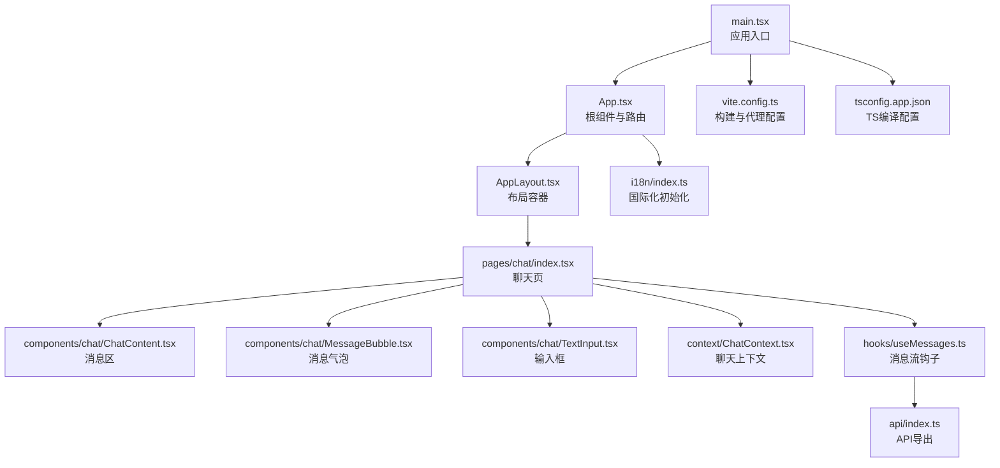
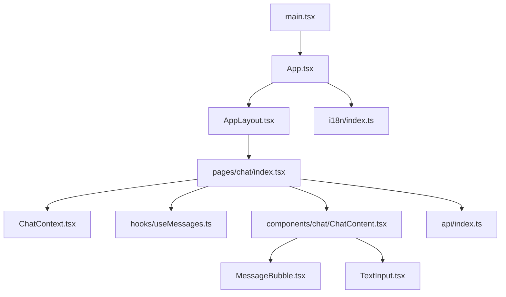
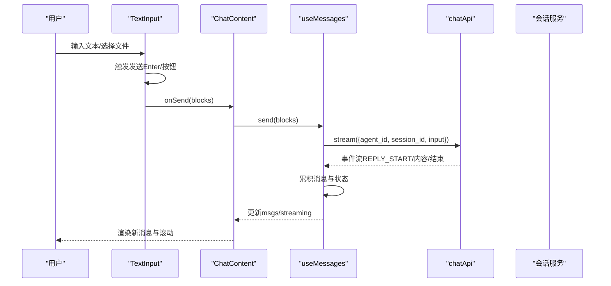
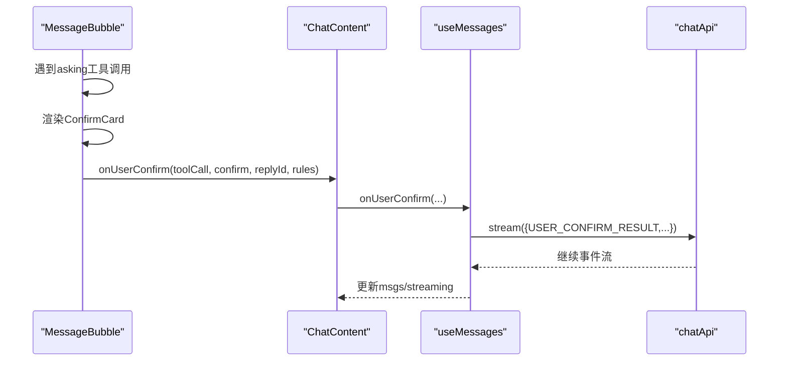
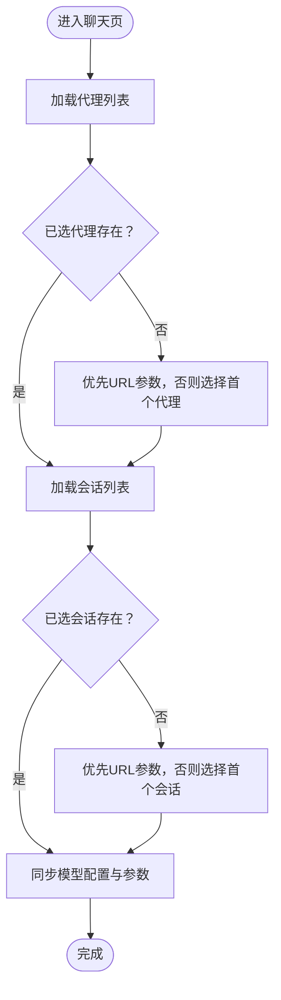
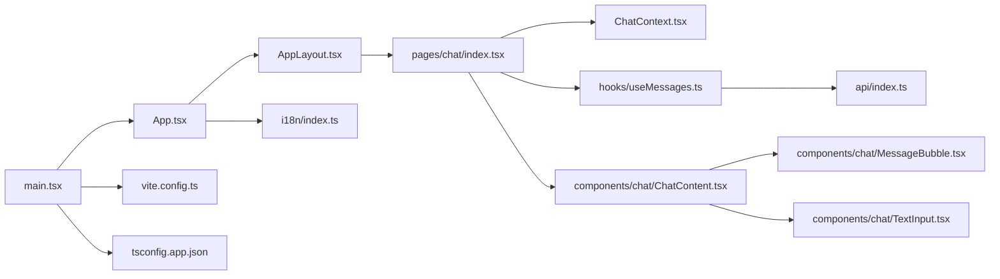

# 前端React应用

<cite>
**本文引用的文件**
- [main.tsx](file://examples/web_ui/frontend/src/main.tsx)
- [App.tsx](file://examples/web_ui/frontend/src/App.tsx)
- [vite.config.ts](file://examples/web_ui/frontend/vite.config.ts)
- [package.json](file://examples/web_ui/frontend/package.json)
- [tsconfig.app.json](file://examples/web_ui/frontend/tsconfig.app.json)
- [AppLayout.tsx](file://examples/web_ui/frontend/src/components/layout/AppLayout.tsx)
- [index.tsx（聊天页）](file://examples/web_ui/frontend/src/pages/chat/index.tsx)
- [ChatContent.tsx](file://examples/web_ui/frontend/src/components/chat/ChatContent.tsx)
- [ChatContext.tsx](file://examples/web_ui/frontend/src/context/ChatContext.tsx)
- [useChat.ts](file://examples/web_ui/frontend/src/hooks/useChat.ts)
- [MessageBubble.tsx](file://examples/web_ui/frontend/src/components/chat(MessageBubble).tsx)
- [TextInput.tsx](file://examples/web_ui/frontend/src/components/chat/TextInput.tsx)
- [useMessages.ts](file://examples/web_ui/frontend/src/hooks/useMessages.ts)
- [api/index.ts](file://examples/web_ui/frontend/src/api/index.ts)
- [i18n/index.ts](file://examples/web_ui/frontend/src/i18n/index.ts)
</cite>

## 目录
1. [引言](#引言)
2. [项目结构](#项目结构)
3. [核心组件](#核心组件)
4. [架构总览](#架构总览)
5. [组件详解](#组件详解)
6. [依赖关系分析](#依赖关系分析)
7. [性能考量](#性能考量)
8. [故障排查指南](#故障排查指南)
9. [结论](#结论)
10. [附录](#附录)

## 引言
本文件面向AgentScope前端React应用，系统性梳理基于Vite构建的单页应用（SPA）架构与实现细节。内容覆盖应用入口、路由配置、组件树结构、核心组件设计模式、状态管理策略、组件间通信机制、组件API规范、国际化与本地存储方案，以及开发、构建与部署流程。

## 项目结构
前端位于 examples/web_ui/frontend，采用Vite + React 19 + TypeScript + TailwindCSS + shadcn/ui生态，路由由react-router-dom v7驱动，UI组件来自自研与第三方库组合。项目通过别名@指向src目录，便于模块化组织。

图表来源
- [main.tsx:1-16](file://examples/web_ui/frontend/src/main.tsx#L1-L16)
- [App.tsx:1-65](file://examples/web_ui/frontend/src/App.tsx#L1-L65)
- [AppLayout.tsx:1-18](file://examples/web_ui/frontend/src/components/layout/AppLayout.tsx#L1-L18)
- [index.tsx（聊天页）:1-613](file://examples/web_ui/frontend/src/pages/chat/index.tsx#L1-L613)
- [ChatContent.tsx:1-116](file://examples/web_ui/frontend/src/components/chat/ChatContent.tsx#L1-L116)
- [MessageBubble.tsx:1-310](file://examples/web_ui/frontend/src/components/chat/MessageBubble.tsx#L1-L310)
- [TextInput.tsx:1-367](file://examples/web_ui/frontend/src/components/chat/TextInput.tsx#L1-L367)
- [ChatContext.tsx:1-46](file://examples/web_ui/frontend/src/context/ChatContext.tsx#L1-L46)
- [useMessages.ts:1-149](file://examples/web_ui/frontend/src/hooks/useMessages.ts#L1-L149)
- [api/index.ts:1-9](file://examples/web_ui/frontend/src/api/index.ts#L1-L9)
- [i18n/index.ts:1-26](file://examples/web_ui/frontend/src/i18n/index.ts#L1-L26)
- [vite.config.ts:1-25](file://examples/web_ui/frontend/vite.config.ts#L1-L25)
- [tsconfig.app.json:1-33](file://examples/web_ui/frontend/tsconfig.app.json#L1-L33)

章节来源
- [main.tsx:1-16](file://examples/web_ui/frontend/src/main.tsx#L1-L16)
- [App.tsx:1-65](file://examples/web_ui/frontend/src/App.tsx#L1-L65)
- [vite.config.ts:1-25](file://examples/web_ui/frontend/vite.config.ts#L1-L25)
- [package.json:1-64](file://examples/web_ui/frontend/package.json#L1-L64)
- [tsconfig.app.json:1-33](file://examples/web_ui/frontend/tsconfig.app.json#L1-L33)

## 核心组件
- 应用入口与根组件：负责初始化国际化、主题提示器、路由与引导向导，并按需渲染设置页或主路由。
- 聊天页：承载侧边栏（代理选择/会话列表）、工作区抽屉、模型参数与权限模式控制、消息区与输入区。
- 消息区：滚动容器、消息气泡渲染、用户确认工具调用等。
- 输入区：文本输入、自动补全、文件附件处理、发送逻辑。
- 状态上下文：在聊天页根部提供选中代理与会话ID的共享状态。
- 消息流钩子：封装SSE事件流、历史加载、中断与确认交互。
- 国际化：i18next多语言检测与缓存。
- 构建与类型：Vite插件链、SVGR、TailwindCSS、路径别名、TS严格配置。

章节来源
- [App.tsx:1-65](file://examples/web_ui/frontend/src/App.tsx#L1-L65)
- [index.tsx（聊天页）:1-613](file://examples/web_ui/frontend/src/pages/chat/index.tsx#L1-L613)
- [ChatContent.tsx:1-116](file://examples/web_ui/frontend/src/components/chat/ChatContent.tsx#L1-L116)
- [MessageBubble.tsx:1-310](file://examples/web_ui/frontend/src/components/chat/MessageBubble.tsx#L1-L310)
- [TextInput.tsx:1-367](file://examples/web_ui/frontend/src/components/chat/TextInput.tsx#L1-L367)
- [ChatContext.tsx:1-46](file://examples/web_ui/frontend/src/context/ChatContext.tsx#L1-L46)
- [useMessages.ts:1-149](file://examples/web_ui/frontend/src/hooks/useMessages.ts#L1-L149)
- [i18n/index.ts:1-26](file://examples/web_ui/frontend/src/i18n/index.ts#L1-L26)

## 架构总览
应用采用“入口 -> 根组件 -> 布局 -> 页面 -> 组件”的分层结构；路由以AppLayout为壳，内部包含聊天、日程、凭据与设置页；聊天页内再细分为侧边栏、主内容区与工作区抽屉；消息区与输入区通过上下文与钩子协作完成状态同步与事件流转。

图表来源
- [App.tsx:1-65](file://examples/web_ui/frontend/src/App.tsx#L1-L65)
- [AppLayout.tsx:1-18](file://examples/web_ui/frontend/src/components/layout/AppLayout.tsx#L1-L18)
- [index.tsx（聊天页）:1-613](file://examples/web_ui/frontend/src/pages/chat/index.tsx#L1-L613)
- [ChatContent.tsx:1-116](file://examples/web_ui/frontend/src/components/chat/ChatContent.tsx#L1-L116)
- [MessageBubble.tsx:1-310](file://examples/web_ui/frontend/src/components/chat/MessageBubble.tsx#L1-L310)
- [TextInput.tsx:1-367](file://examples/web_ui/frontend/src/components/chat/TextInput.tsx#L1-L367)
- [ChatContext.tsx:1-46](file://examples/web_ui/frontend/src/context/ChatContext.tsx#L1-L46)
- [useMessages.ts:1-149](file://examples/web_ui/frontend/src/hooks/useMessages.ts#L1-L149)
- [api/index.ts:1-9](file://examples/web_ui/frontend/src/api/index.ts#L1-L9)
- [i18n/index.ts:1-26](file://examples/web_ui/frontend/src/i18n/index.ts#L1-L26)
- [main.tsx:1-16](file://examples/web_ui/frontend/src/main.tsx#L1-L16)

## 组件详解

### 应用入口与根组件
- 入口：创建根节点，注入TooltipProvider，挂载App。
- 根组件：初始化国际化与通知；根据本地存储判断是否进入设置页；配置路由与Tour卡片；提供Onborda引导。

章节来源
- [main.tsx:1-16](file://examples/web_ui/frontend/src/main.tsx#L1-L16)
- [App.tsx:1-65](file://examples/web_ui/frontend/src/App.tsx#L1-L65)

### 布局组件
- AppLayout：提供SidebarProvider与SidebarInset，Outlet承载子路由内容，形成左右分栏布局。

章节来源
- [AppLayout.tsx:1-18](file://examples/web_ui/frontend/src/components/layout/AppLayout.tsx#L1-L18)

### 聊天页组件树与职责
- 聊天页：负责代理与会话选择、模型与参数配置、权限模式切换、消息区与输入区、工作区抽屉、凭据与会话对话框、Tour控制器。
- ChatContent：消息列表滚动与自动定位、空态占位、消息气泡渲染、输入区集成。
- MessageBubble：消息块分组、工具调用组渲染、Markdown展示、复制代码、思考态展开、用量统计与耗时显示。
- TextInput：文本输入、自动补全、文件附件处理（Electron与浏览器差异）、发送与清空。

章节来源
- [index.tsx（聊天页）:1-613](file://examples/web_ui/frontend/src/pages/chat/index.tsx#L1-L613)
- [ChatContent.tsx:1-116](file://examples/web_ui/frontend/src/components/chat/ChatContent.tsx#L1-L116)
- [MessageBubble.tsx:1-310](file://examples/web_ui/frontend/src/components/chat/MessageBubble.tsx#L1-L310)
- [TextInput.tsx:1-367](file://examples/web_ui/frontend/src/components/chat/TextInput.tsx#L1-L367)

### 状态管理策略
- 全局状态（上下文）：ChatContext提供selectedAgentId与selectedSessionId，避免跨层级props传递。
- 局部状态（组件内）：聊天页内使用useState管理侧边栏开关、模型与回退模型、权限模式、对话框开关等。
- 钩子状态（业务域）：useMessages统一管理消息历史、流式事件、错误与中断；useChat封装通用SSE流。
- 本地存储：用于记录服务端URL，作为初始引导条件；国际化语言检测与缓存。

章节来源
- [ChatContext.tsx:1-46](file://examples/web_ui/frontend/src/context/ChatContext.tsx#L1-L46)
- [index.tsx（聊天页）:1-613](file://examples/web_ui/frontend/src/pages/chat/index.tsx#L1-L613)
- [useMessages.ts:1-149](file://examples/web_ui/frontend/src/hooks/useMessages.ts#L1-L149)
- [useChat.ts:1-49](file://examples/web_ui/frontend/src/hooks/useChat.ts#L1-L49)
- [i18n/index.ts:1-26](file://examples/web_ui/frontend/src/i18n/index.ts#L1-L26)

### 组件间通信机制
- Props传递：父组件向子组件传递数据与回调（如ChatContent的msgs、onSend、allowedInputTypes）。
- 事件处理：按钮点击、下拉选择、键盘事件（Enter/Shift+Enter/Tab）触发行为。
- 回调函数：onUserConfirm、onChange、onSend等回调在组件树中逐层传递，最终由useMessages或useChat消费。
- 上下文：ChatContext在聊天页根部提供共享状态，减少重复传参。

章节来源
- [ChatContent.tsx:1-116](file://examples/web_ui/frontend/src/components/chat/ChatContent.tsx#L1-L116)
- [MessageBubble.tsx:1-310](file://examples/web_ui/frontend/src/components/chat/MessageBubble.tsx#L1-L310)
- [TextInput.tsx:1-367](file://examples/web_ui/frontend/src/components/chat/TextInput.tsx#L1-L367)
- [ChatContext.tsx:1-46](file://examples/web_ui/frontend/src/context/ChatContext.tsx#L1-L46)

### 组件API文档

#### ChatContent
- 属性
  - msgs: 消息数组
  - sending: 是否正在接收流
  - disabled: 是否禁用发送
  - onSend: 发送回调
  - onUserConfirm: 用户确认工具调用回调
  - autoComplete: 自动补全函数
  - className: 容器样式类
  - allowedInputTypes: 允许的文件类型数组
  - fileProcessor: 文件处理函数（返回ContentBlock）
- 事件与行为
  - 接收消息流并滚动至底部（仅当用户靠近底部时）
  - 渲染空态或消息列表
  - 将onSend与allowedInputTypes透传给TextInput

章节来源
- [ChatContent.tsx:10-27](file://examples/web_ui/frontend/src/components/chat/ChatContent.tsx#L10-L27)

#### MessageBubble
- 属性
  - message: Msg对象
  - onUserConfirm: 用户确认回调
- 行为
  - 对tool_call进行分组，遇到asking状态插入ConfirmCard
  - 支持Markdown渲染、代码块复制、媒体类型渲染
  - 显示运行状态、耗时与token用量

章节来源
- [MessageBubble.tsx:200-208](file://examples/web_ui/frontend/src/components/chat/MessageBubble.tsx#L200-L208)

#### TextInput
- 属性
  - onSend: 发送回调
  - placeholder: 占位符
  - autoComplete: 自动补全函数
  - disabled: 是否禁用
  - className: 样式类
  - allowedInputTypes: 允许的文件类型数组
  - fileProcessor: 文件处理函数
- Ref
  - focus(): 聚焦输入框
- 行为
  - 文本输入与自动补全建议叠加显示
  - 支持多文件选择与并发处理
  - Enter发送、Shift+Enter换行、Tab选择建议
  - 附件按钮禁用规则：当allowedInputTypes为空数组时禁用

章节来源
- [TextInput.tsx:31-58](file://examples/web_ui/frontend/src/components/chat/TextInput.tsx#L31-L58)
- [TextInput.tsx:60-62](file://examples/web_ui/frontend/src/components/chat/TextInput.tsx#L60-L62)

#### ChatContext
- 提供
  - selectedAgentId: 当前选中的代理ID
  - setSelectedAgentId: 设置代理ID
  - selectedSessionId: 当前选中的会话ID
  - setSelectedSessionId: 设置会话ID
- 使用
  - 必须包裹在ChatProvider之下
  - 在聊天页根部提供上下文

章节来源
- [ChatContext.tsx:4-11](file://examples/web_ui/frontend/src/context/ChatContext.tsx#L4-L11)
- [ChatContext.tsx:19-35](file://examples/web_ui/frontend/src/context/ChatContext.tsx#L19-L35)
- [ChatContext.tsx:41-45](file://examples/web_ui/frontend/src/context/ChatContext.tsx#L41-L45)

#### useMessages
- 返回
  - msgs: 消息数组
  - loading: 历史加载状态
  - streaming: 流式接收状态
  - error: 错误对象
  - send: 发送内容块
  - onUserConfirm: 处理用户确认工具调用
  - abort: 中断当前流
- 行为
  - 加载历史并标记是否仍在运行
  - 解析REPLY_START与后续事件，累积到当前回复
  - 支持中断与恢复

章节来源
- [useMessages.ts:16-148](file://examples/web_ui/frontend/src/hooks/useMessages.ts#L16-L148)

#### useChat
- 返回
  - events: SSE事件数组
  - streaming: 流式状态
  - error: 错误对象
  - send: 发送请求并流式接收
  - abort: 中断当前流
- 行为
  - 每次发送前取消上一次流
  - 将事件写入状态

章节来源
- [useChat.ts:12-48](file://examples/web_ui/frontend/src/hooks/useChat.ts#L12-L48)

### 数据流与交互序列

#### 聊天消息发送流程

图表来源
- [TextInput.tsx:142-167](file://examples/web_ui/frontend/src/components/chat/TextInput.tsx#L142-L167)
- [ChatContent.tsx:103-110](file://examples/web_ui/frontend/src/components/chat/ChatContent.tsx#L103-L110)
- [useMessages.ts:103-114](file://examples/web_ui/frontend/src/hooks/useMessages.ts#L103-L114)
- [useMessages.ts:80-101](file://examples/web_ui/frontend/src/hooks/useMessages.ts#L80-L101)

#### 工具调用确认流程

图表来源
- [MessageBubble.tsx:110-118](file://examples/web_ui/frontend/src/components/chat/MessageBubble.tsx#L110-L118)
- [ChatContent.tsx:14-21](file://examples/web_ui/frontend/src/components/chat/ChatContent.tsx#L14-L21)
- [useMessages.ts:116-141](file://examples/web_ui/frontend/src/hooks/useMessages.ts#L116-L141)

#### 侧边栏与模型配置同步流程

图表来源
- [index.tsx（聊天页）:135-210](file://examples/web_ui/frontend/src/pages/chat/index.tsx#L135-L210)

## 依赖关系分析

图表来源
- [main.tsx:1-16](file://examples/web_ui/frontend/src/main.tsx#L1-L16)
- [App.tsx:1-65](file://examples/web_ui/frontend/src/App.tsx#L1-L65)
- [AppLayout.tsx:1-18](file://examples/web_ui/frontend/src/components/layout/AppLayout.tsx#L1-L18)
- [index.tsx（聊天页）:1-613](file://examples/web_ui/frontend/src/pages/chat/index.tsx#L1-L613)
- [ChatContext.tsx:1-46](file://examples/web_ui/frontend/src/context/ChatContext.tsx#L1-L46)
- [useMessages.ts:1-149](file://examples/web_ui/frontend/src/hooks/useMessages.ts#L1-L149)
- [ChatContent.tsx:1-116](file://examples/web_ui/frontend/src/components/chat/ChatContent.tsx#L1-L116)
- [MessageBubble.tsx:1-310](file://examples/web_ui/frontend/src/components/chat/MessageBubble.tsx#L1-L310)
- [TextInput.tsx:1-367](file://examples/web_ui/frontend/src/components/chat/TextInput.tsx#L1-L367)
- [api/index.ts:1-9](file://examples/web_ui/frontend/src/api/index.ts#L1-L9)
- [i18n/index.ts:1-26](file://examples/web_ui/frontend/src/i18n/index.ts#L1-L26)
- [vite.config.ts:1-25](file://examples/web_ui/frontend/vite.config.ts#L1-L25)
- [tsconfig.app.json:1-33](file://examples/web_ui/frontend/tsconfig.app.json#L1-L33)

章节来源
- [package.json:13-44](file://examples/web_ui/frontend/package.json#L13-L44)

## 性能考量
- 滚动优化：仅在用户靠近底部时自动滚动，避免频繁重排。
- 请求帧更新：useMessages使用requestAnimationFrame批量更新消息，降低渲染抖动。
- 流中断：每次发送前取消上一请求，避免并发冲突与资源浪费。
- 文件处理：并发处理多个附件，UI显示处理中状态，失败静默移除。
- 类型与别名：TS严格配置与路径别名提升开发体验与编译效率。

## 故障排查指南
- 无法连接后端
  - 检查Vite代理配置与后端地址一致性。
  - 参考：[vite.config.ts:11-13](file://examples/web_ui/frontend/vite.config.ts#L11-L13)
- 国际化不生效
  - 确认i18n初始化与语言检测配置，检查本地缓存键值。
  - 参考：[i18n/index.ts:8-23](file://examples/web_ui/frontend/src/i18n/index.ts#L8-L23)
- 模型/凭据不可选
  - 确认已添加凭据且类型匹配；查看模型分组加载状态。
  - 参考：[index.tsx（聊天页）:88-89](file://examples/web_ui/frontend/src/pages/chat/index.tsx#L88-L89)
- 附件发送失败
  - 检查fileProcessor返回值与allowedInputTypes限制；确认文件类型支持。
  - 参考：[TextInput.tsx:169-210](file://examples/web_ui/frontend/src/components/chat/TextInput.tsx#L169-L210)
- 流中断或重复
  - 确认每次发送前调用abort；检查useMessages与useChat的中断逻辑。
  - 参考：[useMessages.ts:82-84](file://examples/web_ui/frontend/src/hooks/useMessages.ts#L82-L84)、[useChat.ts:22-25](file://examples/web_ui/frontend/src/hooks/useChat.ts#L22-L25)

章节来源
- [vite.config.ts:10-14](file://examples/web_ui/frontend/vite.config.ts#L10-L14)
- [i18n/index.ts:8-23](file://examples/web_ui/frontend/src/i18n/index.ts#L8-L23)
- [index.tsx（聊天页）:88-89](file://examples/web_ui/frontend/src/pages/chat/index.tsx#L88-L89)
- [TextInput.tsx:169-210](file://examples/web_ui/frontend/src/components/chat/TextInput.tsx#L169-L210)
- [useMessages.ts:82-84](file://examples/web_ui/frontend/src/hooks/useMessages.ts#L82-L84)
- [useChat.ts:22-25](file://examples/web_ui/frontend/src/hooks/useChat.ts#L22-L25)

## 结论
该前端应用以清晰的分层与模块化设计实现了AgentScope的Web交互界面：入口与根组件负责初始化与路由，布局组件提供一致的页面骨架，聊天页整合代理/会话/模型/权限/工作区等能力，消息区与输入区通过上下文与钩子协同完成流式交互。配合国际化、本地存储与严格的TS配置，整体具备良好的可维护性与扩展性。

## 附录

### 开发环境配置
- 启动命令：dev（Vite开发服务器）
- 代理：/api -> http://localhost:3000
- 路径别名：@ -> src
- 插件：React、TailwindCSS、SVG资源（SVGR）

章节来源
- [package.json:6-11](file://examples/web_ui/frontend/package.json#L6-L11)
- [vite.config.ts:8-20](file://examples/web_ui/frontend/vite.config.ts#L8-L20)
- [tsconfig.app.json:27-29](file://examples/web_ui/frontend/tsconfig.app.json#L27-L29)

### 构建与预览
- 构建命令：先TypeScript编译，再Vite打包
- 预览命令：Vite预览

章节来源
- [package.json:8](file://examples/web_ui/frontend/package.json#L8)

### 部署指南
- 生成产物：Vite构建输出静态资源
- 代理与后端：确保生产环境代理指向实际后端地址
- 国际化：默认英文，语言检测与缓存已在运行时启用

章节来源
- [vite.config.ts:10-14](file://examples/web_ui/frontend/vite.config.ts#L10-L14)
- [i18n/index.ts:15-23](file://examples/web_ui/frontend/src/i18n/index.ts#L15-L23)