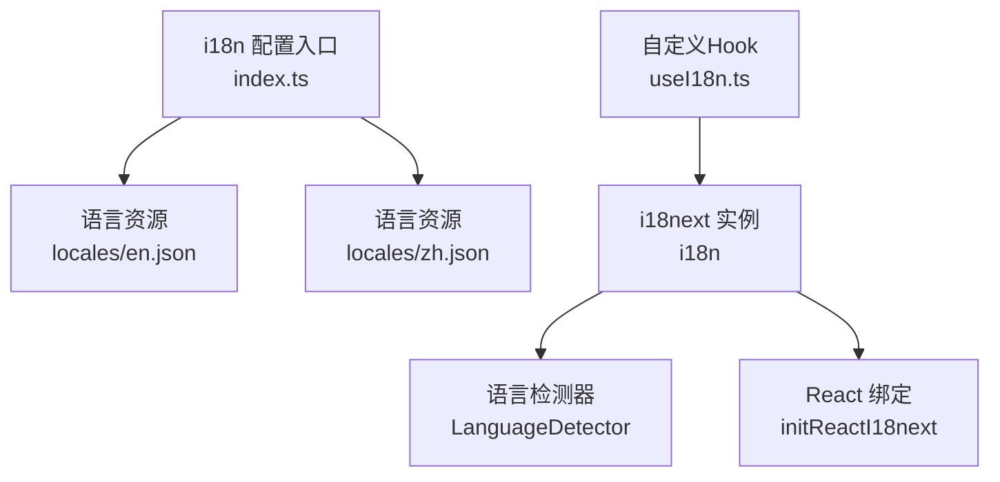
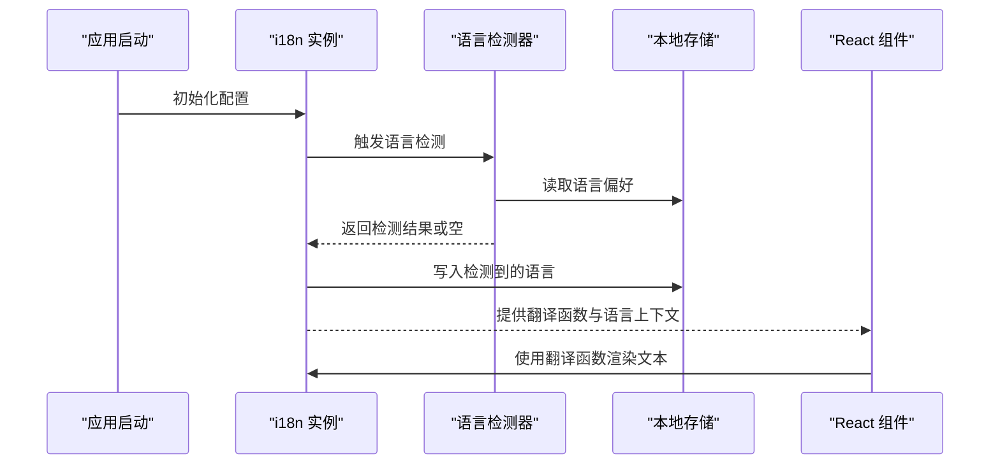
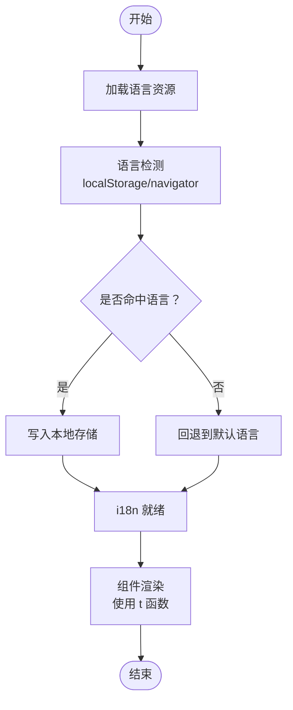
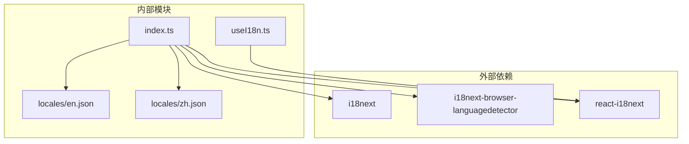

# 国际化

<cite>
**本文引用的文件**
- [examples/web_ui/frontend/src/i18n/index.ts](file://examples/web_ui/frontend/src/i18n/index.ts)
- [examples/web_ui/frontend/src/i18n/useI18n.ts](file://examples/web_ui/frontend/src/i18n/useI18n.ts)
- [examples/web_ui/frontend/src/i18n/locales/en.json](file://examples/web_ui/frontend/src/i18n/locales/en.json)
- [examples/web_ui/frontend/src/i18n/locales/zh.json](file://examples/web_ui/frontend/src/i18n/locales/zh.json)
</cite>

## 目录
1. [简介](#简介)
2. [项目结构](#项目结构)
3. [核心组件](#核心组件)
4. [架构总览](#架构总览)
5. [详细组件分析](#详细组件分析)
6. [依赖关系分析](#依赖关系分析)
7. [性能考量](#性能考量)
8. [故障排查指南](#故障排查指南)
9. [结论](#结论)
10. [附录](#附录)

## 简介
本文件面向AgentScope前端的国际化（i18n）实现，聚焦于i18n框架的集成与配置策略、多语言资源管理、语言检测与切换机制、文本提取与翻译流程、日期/数字/货币格式化、RTL语言支持与文本方向处理，以及完整的国际化开发指南（新增语言、翻译维护、本地化测试）、用户体验优化建议（语言偏好保存与自动语言检测）。  
当前仓库中，前端国际化主要位于 examples/web_ui/frontend/src/i18n 目录下，采用 i18next + react-i18next，并通过浏览器语言检测器与本地存储缓存实现语言偏好持久化。

## 项目结构
前端国际化相关文件集中在 examples/web_ui/frontend/src/i18n 目录，包含：
- 配置入口：index.ts
- 自定义Hook：useI18n.ts
- 多语言资源：locales/en.json、locales/zh.json

图表来源
- [examples/web_ui/frontend/src/i18n/index.ts:1-25](file://examples/web_ui/frontend/src/i18n/index.ts#L1-L25)
- [examples/web_ui/frontend/src/i18n/useI18n.ts:1-5](file://examples/web_ui/frontend/src/i18n/useI18n.ts#L1-L5)

章节来源
- [examples/web_ui/frontend/src/i18n/index.ts:1-25](file://examples/web_ui/frontend/src/i18n/index.ts#L1-L25)
- [examples/web_ui/frontend/src/i18n/useI18n.ts:1-5](file://examples/web_ui/frontend/src/i18n/useI18n.ts#L1-L5)
- [examples/web_ui/frontend/src/i18n/locales/en.json](file://examples/web_ui/frontend/src/i18n/locales/en.json)
- [examples/web_ui/frontend/src/i18n/locales/zh.json](file://examples/web_ui/frontend/src/i18n/locales/zh.json)

## 核心组件
- i18n 配置入口（index.ts）
  - 使用 i18next 初始化实例，注册 LanguageDetector 与 initReactI18next 插件
  - 加载 en/zh 资源并设置回退语言为英语
  - 启用 localStorage 缓存与 navigator 检测顺序
  - 关闭 escapeValue，避免在模板字符串中二次转义
- 自定义 Hook（useI18n.ts）
  - 封装 useTranslation，统一命名空间 'translation'
- 语言资源（locales/*.json）
  - 分别提供英文与中文键值对，供 i18n 实例加载

章节来源
- [examples/web_ui/frontend/src/i18n/index.ts:1-25](file://examples/web_ui/frontend/src/i18n/index.ts#L1-L25)
- [examples/web_ui/frontend/src/i18n/useI18n.ts:1-5](file://examples/web_ui/frontend/src/i18n/useI18n.ts#L1-L5)
- [examples/web_ui/frontend/src/i18n/locales/en.json](file://examples/web_ui/frontend/src/i18n/locales/en.json)
- [examples/web_ui/frontend/src/i18n/locales/zh.json](file://examples/web_ui/frontend/src/i18n/locales/zh.json)

## 架构总览
前端国际化整体流程如下：
- 应用启动时初始化 i18n 实例
- 语言检测器根据顺序从 localStorage 或 navigator 获取语言
- 若检测到语言则缓存至 localStorage，否则回退到默认语言
- React 组件通过 useI18n Hook 访问翻译函数与语言状态

图表来源
- [examples/web_ui/frontend/src/i18n/index.ts:8-23](file://examples/web_ui/frontend/src/i18n/index.ts#L8-L23)
- [examples/web_ui/frontend/src/i18n/useI18n.ts:1-5](file://examples/web_ui/frontend/src/i18n/useI18n.ts#L1-L5)

## 详细组件分析

### i18n 配置入口（index.ts）
- 插件链路
  - LanguageDetector：从 localStorage 与 navigator 中按序检测语言
  - initReactI18next：将 i18n 与 React 绑定，提供 React 组件内的翻译能力
- 资源加载
  - resources 中以语言代码为键，映射到命名空间下的翻译对象
- 语言检测与缓存
  - detection.order 指定检测顺序；caches 指定缓存位置
- 插值与转义
  - interpolation.escapeValue 设为 false，便于在 JSX 中直接使用模板字符串
- 回退语言
  - fallbackLng 设置为 'en'，确保无匹配语言时显示英文

章节来源
- [examples/web_ui/frontend/src/i18n/index.ts:1-25](file://examples/web_ui/frontend/src/i18n/index.ts#L1-L25)

### 自定义 Hook（useI18n.ts）
- 作用
  - 对 useTranslation 进行封装，固定命名空间为 'translation'
  - 统一组件内调用方式，降低耦合度
- 使用场景
  - 在任意 React 组件中调用 useTranslation，获取 t 函数与语言信息

章节来源
- [examples/web_ui/frontend/src/i18n/useI18n.ts:1-5](file://examples/web_ui/frontend/src/i18n/useI18n.ts#L1-L5)

### 语言资源（locales/*.json）
- 结构
  - 以键值对形式组织文案，键名遵循语义化命名，值为对应语言的文本
- 维护要点
  - 新增语言时需同步补充对应 JSON 文件
  - 键名保持一致，避免运行时报错或回退到默认语言

章节来源
- [examples/web_ui/frontend/src/i18n/locales/en.json](file://examples/web_ui/frontend/src/i18n/locales/en.json)
- [examples/web_ui/frontend/src/i18n/locales/zh.json](file://examples/web_ui/frontend/src/i18n/locales/zh.json)

### 文本提取与翻译流程
- 静态文本标记
  - 在组件中通过 useTranslation 返回的 t 函数包裹静态文案键
  - 建议将文案集中于资源文件，避免硬编码
- 动态文本处理
  - 利用命名空间与键路径访问嵌套文案
  - 通过插值参数传递动态内容（如用户输入、变量等）
- 占位符替换
  - 使用 i18next 的插值语法进行占位符替换
  - 注意避免在 JSX 中对已转义的值再次转义

图表来源
- [examples/web_ui/frontend/src/i18n/index.ts:8-23](file://examples/web_ui/frontend/src/i18n/index.ts#L8-L23)

### 日期、数字与货币格式化
- 当前实现
  - 仓库未见专门的日期/数字/货币格式化模块
- 建议方案
  - 使用 Intl.DateTimeFormat、Intl.NumberFormat、Intl.Locale
  - 在 i18n 初始化后，结合语言环境选择合适的格式化策略
  - 可在组件层按需引入格式化工具，或通过自定义 Hook 暴露统一接口

[本节为通用实践建议，不直接分析具体文件，故无章节来源]

### RTL 语言支持与文本方向处理
- 当前实现
  - 仓库未见针对 RTL 语言（如阿拉伯语、希伯来语）的方向处理逻辑
- 建议方案
  - 在检测到 RTL 语言时，为根元素设置 dir="rtl" 并调整布局样式
  - 使用 CSS 方向属性（direction、text-align、margin/padding 方向变体）适配 RTL 布局
  - 为 RTL 语言补充独立样式文件或条件样式

[本节为通用实践建议，不直接分析具体文件，故无章节来源]

## 依赖关系分析
- 外部依赖
  - i18next：核心国际化库
  - i18next-browser-languagedetector：浏览器语言检测
  - react-i18next：React 绑定与上下文提供
- 内部依赖
  - index.ts 导出 i18n 实例供全局使用
  - useI18n.ts 通过 useTranslation 提供统一 Hook
  - locales/*.json 作为资源文件被 index.ts 引入

图表来源
- [examples/web_ui/frontend/src/i18n/index.ts:1-25](file://examples/web_ui/frontend/src/i18n/index.ts#L1-L25)
- [examples/web_ui/frontend/src/i18n/useI18n.ts:1-5](file://examples/web_ui/frontend/src/i18n/useI18n.ts#L1-L5)

章节来源
- [examples/web_ui/frontend/src/i18n/index.ts:1-25](file://examples/web_ui/frontend/src/i18n/index.ts#L1-L25)
- [examples/web_ui/frontend/src/i18n/useI18n.ts:1-5](file://examples/web_ui/frontend/src/i18n/useI18n.ts#L1-L5)

## 性能考量
- 资源加载
  - 将语言资源拆分为按页面或功能域的命名空间，减少初始加载体积
- 语言检测
  - 优先从 localStorage 读取，避免每次刷新都触发 navigator 检测
- 渲染优化
  - 使用 React.memo 或类似手段避免不必要的重渲染
  - 将频繁使用的文案键集中管理，减少重复查找

[本节提供通用指导，不直接分析具体文件，故无章节来源]

## 故障排查指南
- 语言未生效或回退到默认语言
  - 检查资源文件是否正确引入与命名空间一致
  - 确认检测顺序与缓存配置是否符合预期
- 文本未翻译或显示键名
  - 确保使用 t 函数包裹文案键，且键名在对应语言资源中存在
- 插值异常或报错
  - 检查插值参数类型与数量，避免在 JSX 中重复转义
- RTL 布局异常
  - 确认根元素方向设置与样式适配是否正确

章节来源
- [examples/web_ui/frontend/src/i18n/index.ts:16-23](file://examples/web_ui/frontend/src/i18n/index.ts#L16-L23)
- [examples/web_ui/frontend/src/i18n/useI18n.ts:1-5](file://examples/web_ui/frontend/src/i18n/useI18n.ts#L1-L5)

## 结论
AgentScope 前端国际化以 i18next 为核心，结合语言检测器与本地存储实现语言偏好持久化，具备良好的扩展性。建议后续完善日期/数字/货币格式化、RTL 支持与命名空间拆分，以提升多语言体验与可维护性。

## 附录

### 开发指南：新增语言
- 步骤
  - 在 locales 目录新增对应语言的 JSON 文件（如 fr.json）
  - 在 index.ts 的 resources 中注册该语言资源
  - 在 detection.caches 中启用相应缓存策略
  - 在组件中通过 useTranslation 使用新语言文案
- 注意事项
  - 保持键名一致性，避免运行时报错
  - 测试语言切换与回退逻辑

章节来源
- [examples/web_ui/frontend/src/i18n/index.ts:5-14](file://examples/web_ui/frontend/src/i18n/index.ts#L5-L14)
- [examples/web_ui/frontend/src/i18n/locales/en.json](file://examples/web_ui/frontend/src/i18n/locales/en.json)
- [examples/web_ui/frontend/src/i18n/locales/zh.json](file://examples/web_ui/frontend/src/i18n/locales/zh.json)

### 开发指南：翻译维护
- 建议
  - 使用键名语义化，避免深层嵌套
  - 为复杂文案提供命名空间，便于模块化管理
  - 定期清理未使用键，保持资源精简

[本节为通用实践建议，不直接分析具体文件，故无章节来源]

### 开发指南：本地化测试
- 建议
  - 手动切换语言并验证文案显示
  - 检查插值参数与占位符替换
  - 验证 RTL 语言方向与布局适配
  - 使用自动化测试覆盖关键页面的多语言渲染

[本节为通用实践建议，不直接分析具体文件，故无章节来源]

### 用户体验优化
- 语言偏好保存
  - 通过 localStorage 持久化用户选择的语言
- 自动语言检测
  - 优先使用浏览器语言，其次回退到默认语言
- 切换反馈
  - 提供语言切换按钮与即时预览，增强交互体验

章节来源
- [examples/web_ui/frontend/src/i18n/index.ts:19-22](file://examples/web_ui/frontend/src/i18n/index.ts#L19-L22)