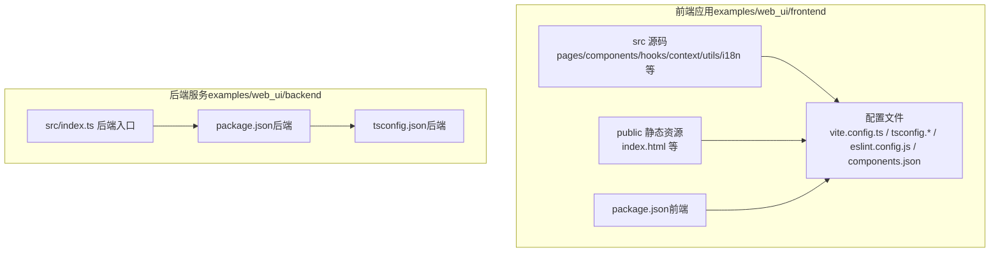
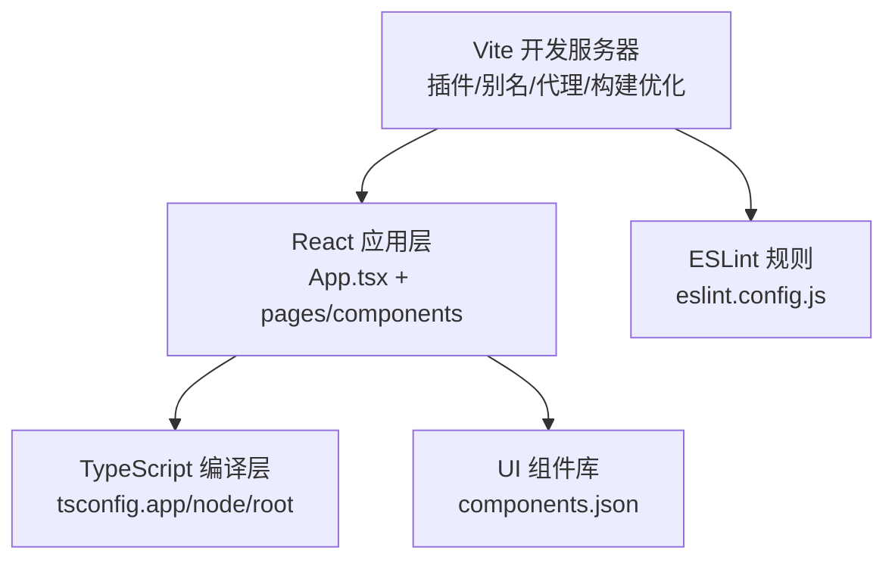
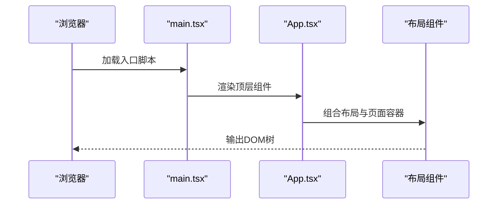
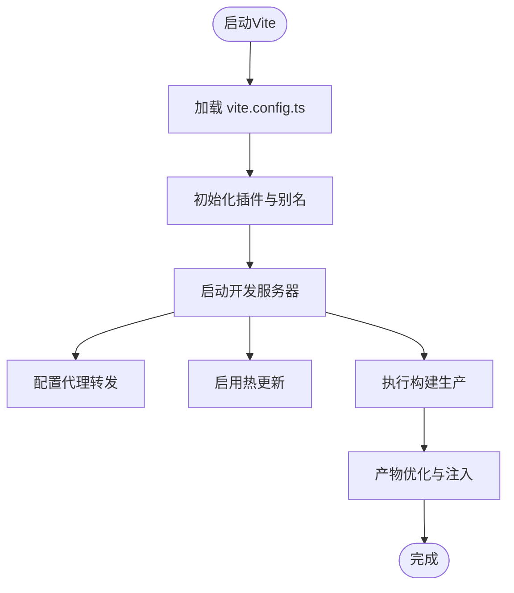
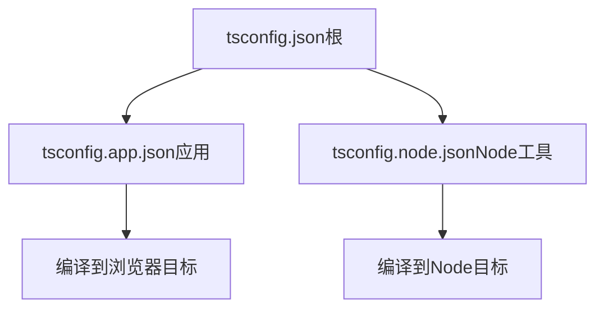
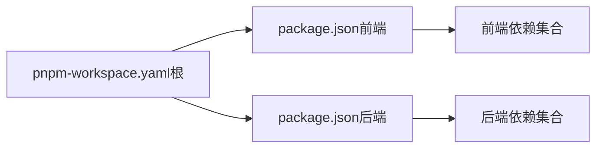
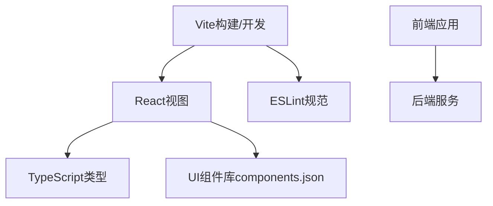

# 应用架构

<cite>
**本文引用的文件**
- [vite.config.ts](file://examples/web_ui/frontend/vite.config.ts)
- [package.json（前端）](file://examples/web_ui/frontend/package.json)
- [tsconfig.json（前端）](file://examples/web_ui/frontend/tsconfig.json)
- [tsconfig.app.json（前端）](file://examples/web_ui/frontend/tsconfig.app.json)
- [tsconfig.node.json（前端）](file://examples/web_ui/frontend/tsconfig.node.json)
- [index.html（前端）](file://examples/web_ui/frontend/index.html)
- [main.tsx（前端）](file://examples/web_ui/frontend/src/main.tsx)
- [App.tsx（前端）](file://examples/web_ui/frontend/src/App.tsx)
- [eslint.config.js（前端）](file://examples/web_ui/frontend/eslint.config.js)
- [components.json（前端）](file://examples/web_ui/frontend/components.json)
- [README.md（前端）](file://examples/web_ui/frontend/README.md)
- [package.json（后端）](file://examples/web_ui/backend/package.json)
- [tsconfig.json（后端）](file://examples/web_ui/backend/tsconfig.json)
- [src/index.ts（后端）](file://examples/web_ui/backend/src/index.ts)
- [README.md（项目根）](file://README.md)
</cite>

## 目录
1. [引言](#引言)
2. [项目结构](#项目结构)
3. [核心组件](#核心组件)
4. [架构总览](#架构总览)
5. [组件详解](#组件详解)
6. [依赖关系分析](#依赖关系分析)
7. [性能与构建优化](#性能与构建优化)
8. [故障排查指南](#故障排查指南)
9. [结论](#结论)
10. [附录：开发与部署指南](#附录开发与部署指南)

## 引言
本文件面向AgentScope Web前端应用，系统化梳理其基于Vite + React + TypeScript的现代前端架构设计，覆盖应用入口点配置、构建工具设置、开发服务器配置、目录结构设计原则、TypeScript配置策略、包管理与依赖管理、开发环境搭建以及生产构建优化与部署准备等主题。目标是帮助开发者快速理解并高效参与前端工程的开发与维护。

## 项目结构
前端位于 examples/web_ui/frontend，采用“单包多配置”的结构：一个Vite应用作为Web UI，配套一个独立的TypeScript后端服务用于演示或集成。整体目录遵循“源码组织 + 资源管理 + 配置文件”的清晰分层。

- 源码组织
  - src：React + TypeScript源代码，按功能域划分（pages、components、hooks、context、utils、i18n等）
  - public：静态资源（如favicon、index.html模板等）
- 资源管理
  - 图片、国际化资源等按模块放置在对应目录，便于按需加载与Tree-shaking
- 配置文件
  - vite.config.ts：Vite构建与开发服务器配置
  - tsconfig.*：多环境TypeScript编译配置（app/node）
  - eslint.config.js：ESLint规则
  - components.json：UI组件库（如shadcn/ui）配置
  - package.json：依赖与脚本

**图表来源**
- [vite.config.ts](file://examples/web_ui/frontend/vite.config.ts)
- [package.json（前端）](file://examples/web_ui/frontend/package.json)
- [tsconfig.json（前端）](file://examples/web_ui/frontend/tsconfig.json)
- [tsconfig.app.json（前端）](file://examples/web_ui/frontend/tsconfig.app.json)
- [tsconfig.node.json（前端）](file://examples/web_ui/frontend/tsconfig.node.json)
- [eslint.config.js（前端）](file://examples/web_ui/frontend/eslint.config.js)
- [components.json（前端）](file://examples/web_ui/frontend/components.json)
- [src/index.ts（后端）](file://examples/web_ui/backend/src/index.ts)
- [package.json（后端）](file://examples/web_ui/backend/package.json)
- [tsconfig.json（后端）](file://examples/web_ui/backend/tsconfig.json)

**章节来源**
- [README.md（项目根）](file://README.md)
- [README.md（前端）](file://examples/web_ui/frontend/README.md)

## 核心组件
- 应用入口与渲染
  - main.tsx：React根节点挂载与Provider注入
  - App.tsx：顶层路由与布局容器
- 构建与开发服务器
  - vite.config.ts：插件、别名、代理、构建优化等
- 类型系统
  - tsconfig.app.json/tsconfig.node.json：区分应用与Node工具链的编译目标
  - tsconfig.json：根级TS配置
- 规范与工具
  - eslint.config.js：统一代码风格与质量控制
  - components.json：UI组件库约定

**章节来源**
- [main.tsx（前端）](file://examples/web_ui/frontend/src/main.tsx)
- [App.tsx（前端）](file://examples/web_ui/frontend/src/App.tsx)
- [vite.config.ts](file://examples/web_ui/frontend/vite.config.ts)
- [tsconfig.app.json（前端）](file://examples/web_ui/frontend/tsconfig.app.json)
- [tsconfig.node.json（前端）](file://examples/web_ui/frontend/tsconfig.node.json)
- [tsconfig.json（前端）](file://examples/web_ui/frontend/tsconfig.json)
- [eslint.config.js（前端）](file://examples/web_ui/frontend/eslint.config.js)
- [components.json（前端）](file://examples/web_ui/frontend/components.json)

## 架构总览
前端采用Vite提供高性能开发体验，React负责视图层，TypeScript保障类型安全；通过多tsconfig实现“应用侧”和“Node工具侧”的差异化编译目标；ESLint与UI组件库配置确保团队协作一致性。

**图表来源**
- [vite.config.ts](file://examples/web_ui/frontend/vite.config.ts)
- [App.tsx（前端）](file://examples/web_ui/frontend/src/App.tsx)
- [tsconfig.app.json（前端）](file://examples/web_ui/frontend/tsconfig.app.json)
- [tsconfig.node.json（前端）](file://examples/web_ui/frontend/tsconfig.node.json)
- [tsconfig.json（前端）](file://examples/web_ui/frontend/tsconfig.json)
- [eslint.config.js（前端）](file://examples/web_ui/frontend/eslint.config.js)
- [components.json（前端）](file://examples/web_ui/frontend/components.json)

## 组件详解

### 应用入口与渲染流程
- main.tsx：创建根DOM节点，渲染App，并注入全局上下文（如国际化、主题、对话状态等）
- App.tsx：定义路由与顶层布局，承载页面容器与侧边栏、抽屉等通用UI

**图表来源**
- [main.tsx（前端）](file://examples/web_ui/frontend/src/main.tsx)
- [App.tsx（前端）](file://examples/web_ui/frontend/src/App.tsx)

**章节来源**
- [main.tsx（前端）](file://examples/web_ui/frontend/src/main.tsx)
- [App.tsx（前端）](file://examples/web_ui/frontend/src/App.tsx)

### Vite配置与开发服务器
- 插件体系：包含对React、TypeScript、路径别名、静态资源处理等的支持
- 别名映射：简化import路径，提升可读性与可维护性
- 代理配置：将API请求转发至后端服务，避免跨域问题
- 开发服务器：热更新、快速启动、错误提示友好
- 构建优化：产物最小化、按需打包、资源指纹、HTML注入等

**图表来源**
- [vite.config.ts](file://examples/web_ui/frontend/vite.config.ts)

**章节来源**
- [vite.config.ts](file://examples/web_ui/frontend/vite.config.ts)

### TypeScript配置策略
- tsconfig.app.json：面向浏览器运行时的编译目标，约束React JSX运行环境
- tsconfig.node.json：面向Node工具链（如Vite插件、脚本）的编译目标
- tsconfig.json：根级TS配置，聚合与继承上述两份配置
- 类型检查：在开发阶段进行严格类型检查，保证API与组件契约一致

**图表来源**
- [tsconfig.json（前端）](file://examples/web_ui/frontend/tsconfig.json)
- [tsconfig.app.json（前端）](file://examples/web_ui/frontend/tsconfig.app.json)
- [tsconfig.node.json（前端）](file://examples/web_ui/frontend/tsconfig.node.json)

**章节来源**
- [tsconfig.json（前端）](file://examples/web_ui/frontend/tsconfig.json)
- [tsconfig.app.json（前端）](file://examples/web_ui/frontend/tsconfig.app.json)
- [tsconfig.node.json（前端）](file://examples/web_ui/frontend/tsconfig.node.json)

### 包管理与依赖管理
- 前端：package.json（前端）集中声明依赖与脚本（dev/build/start等），使用pnpm作为包管理器
- 后端：package.json（后端）独立管理后端依赖与脚本
- 工作区：根目录存在pnpm-workspace.yaml，支持monorepo式管理（当前示例中前端与后端为独立包）

**图表来源**
- [package.json（前端）](file://examples/web_ui/frontend/package.json)
- [package.json（后端）](file://examples/web_ui/backend/package.json)

**章节来源**
- [package.json（前端）](file://examples/web_ui/frontend/package.json)
- [package.json（后端）](file://examples/web_ui/backend/package.json)

### ESLint与UI组件库规范
- eslint.config.js：统一代码风格、禁用规则与最佳实践，保障团队一致性
- components.json：UI组件库（如shadcn/ui）的本地化配置，约束组件导入与样式生成

**章节来源**
- [eslint.config.js（前端）](file://examples/web_ui/frontend/eslint.config.js)
- [components.json（前端）](file://examples/web_ui/frontend/components.json)

## 依赖关系分析
- 前端应用依赖于Vite提供的开发与构建能力，React提供视图层，TypeScript提供类型保障
- ESLint与UI组件库配置贯穿开发流程，确保代码质量与一致性
- 后端服务与前端应用解耦，通过代理或独立端口提供API，便于前后端并行开发

**图表来源**
- [vite.config.ts](file://examples/web_ui/frontend/vite.config.ts)
- [App.tsx（前端）](file://examples/web_ui/frontend/src/App.tsx)
- [tsconfig.app.json（前端）](file://examples/web_ui/frontend/tsconfig.app.json)
- [eslint.config.js（前端）](file://examples/web_ui/frontend/eslint.config.js)
- [components.json（前端）](file://examples/web_ui/frontend/components.json)
- [src/index.ts（后端）](file://examples/web_ui/backend/src/index.ts)

**章节来源**
- [vite.config.ts](file://examples/web_ui/frontend/vite.config.ts)
- [App.tsx（前端）](file://examples/web_ui/frontend/src/App.tsx)
- [src/index.ts（后端）](file://examples/web_ui/backend/src/index.ts)

## 性能与构建优化
- 构建产物优化：最小化、分包、资源指纹、HTML注入
- 开发体验：热更新、快速启动、错误提示
- 依赖拆分：按需加载、动态导入、Tree-shaking
- 资源策略：图片、字体、CSS按需引入，避免冗余

[本节为通用指导，不直接分析具体文件]

## 故障排查指南
- 开发服务器无法启动
  - 检查端口占用与代理配置是否冲突
  - 确认Vite配置文件语法与插件版本兼容
- 类型检查报错
  - 对照tsconfig.app/node/root的编译目标差异，修正类型使用
  - 在App侧与Node工具侧分别定位类型问题
- ESLint报错
  - 根据eslint.config.js规则调整代码风格
  - 使用编辑器自动修复或手动修正
- UI组件导入异常
  - 检查components.json中的组件映射与导入路径
  - 确保组件库已正确初始化与生成

**章节来源**
- [vite.config.ts](file://examples/web_ui/frontend/vite.config.ts)
- [tsconfig.app.json（前端）](file://examples/web_ui/frontend/tsconfig.app.json)
- [tsconfig.node.json（前端）](file://examples/web_ui/frontend/tsconfig.node.json)
- [eslint.config.js（前端）](file://examples/web_ui/frontend/eslint.config.js)
- [components.json（前端）](file://examples/web_ui/frontend/components.json)

## 结论
AgentScope前端应用以Vite为核心，结合React与TypeScript，形成高效率、强类型、可扩展的现代前端架构。通过多tsconfig分层编译、ESLint与UI组件库规范、以及清晰的目录结构，有效提升了开发体验与代码质量。配合独立后端服务与代理机制，实现了前后端协同开发与部署的灵活性。

## 附录：开发与部署指南

### 开发环境搭建
- Node.js版本要求
  - 建议使用LTS版本（如18.x或20.x），以确保Vite与TypeScript生态稳定
- 包管理器
  - 使用pnpm，具备更快安装速度与更严格的依赖隔离
- 安装与启动
  - 进入前端目录，安装依赖后启动开发服务器
  - 如需联调后端，可在后端目录单独启动服务或通过Vite代理转发

**章节来源**
- [README.md（前端）](file://examples/web_ui/frontend/README.md)
- [package.json（前端）](file://examples/web_ui/frontend/package.json)

### 生产构建与部署准备
- 构建命令
  - 执行生产构建，输出静态资源与HTML
- 部署建议
  - 将构建产物部署至静态站点或反向代理（Nginx/Apache）
  - 若后端独立部署，确保代理或CORS配置正确
  - 对静态资源启用缓存与压缩，提升加载性能

**章节来源**
- [vite.config.ts](file://examples/web_ui/frontend/vite.config.ts)
- [index.html（前端）](file://examples/web_ui/frontend/index.html)
- [package.json（前端）](file://examples/web_ui/frontend/package.json)