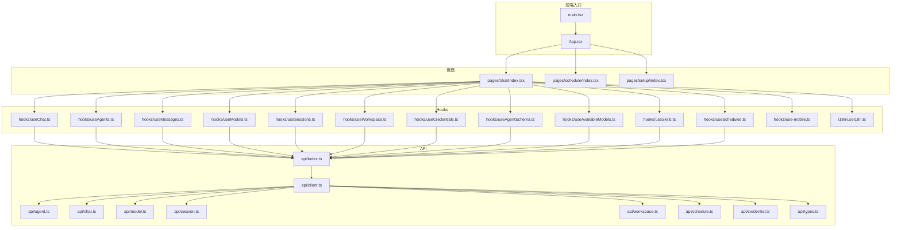
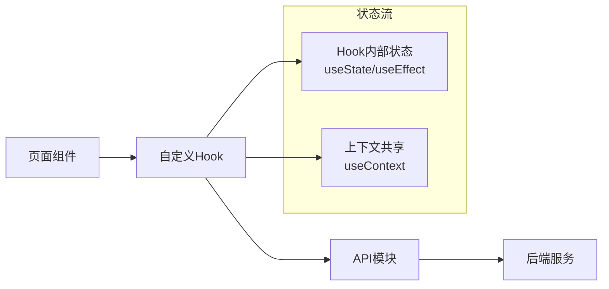
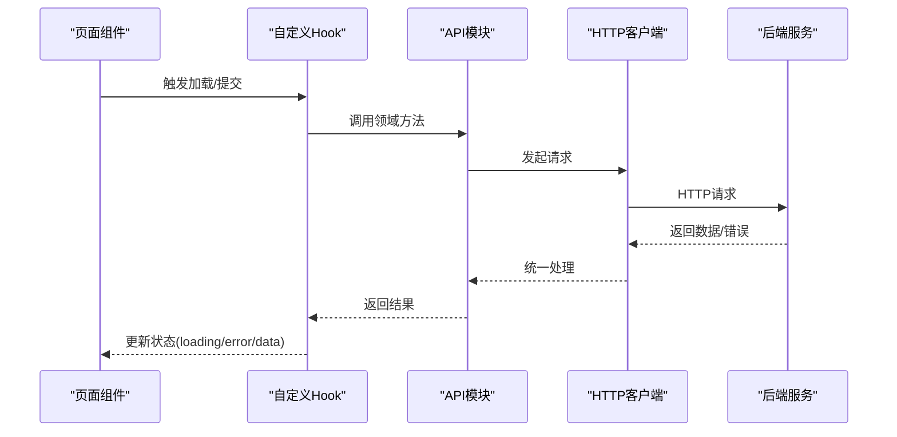
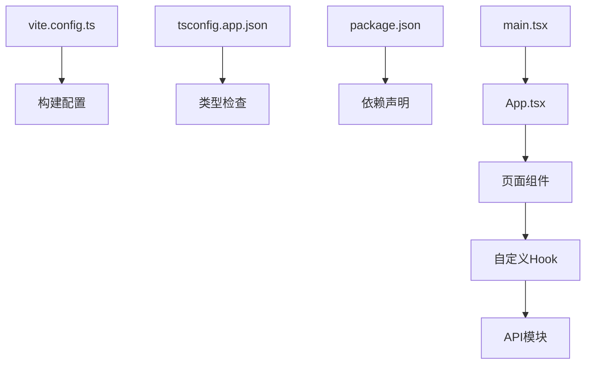

# 状态管理

<cite>
**本文引用的文件**
- [examples/web_ui/frontend/src/hooks/use-mobile.ts](file://examples/web_ui/frontend/src/hooks/use-mobile.ts)
- [examples/web_ui/frontend/src/hooks/useAgentSchema.ts](file://examples/web_ui/frontend/src/hooks/useAgentSchema.ts)
- [examples/web_ui/frontend/src/hooks/useAgents.ts](file://examples/web_ui/frontend/src/hooks/useAgents.ts)
- [examples/web_ui/frontend/src/hooks/useAvailableModels.ts](file://examples/web_ui/frontend/src/hooks/useAvailableModels.ts)
- [examples/web_ui/frontend/src/hooks/useChat.ts](file://examples/web_ui/frontend/src/hooks/useChat.ts)
- [examples/web_ui/frontend/src/hooks/useCredentials.ts](file://examples/web_ui/frontend/src/hooks/useCredentials.ts)
- [examples/web_ui/frontend/src/hooks/useMessages.ts](file://examples/web_ui/frontend/src/hooks/useMessages.ts)
- [examples/web_ui/frontend/src/hooks/useModels.ts](file://examples/web_ui/frontend/src/hooks/useModels.ts)
- [examples/web_ui/frontend/src/hooks/useSchedules.ts](file://examples/web_ui/frontend/src/hooks/useSchedules.ts)
- [examples/web_ui/frontend/src/hooks/useSessions.ts](file://examples/web_ui/frontend/src/hooks/useSessions.ts)
- [examples/web_ui/frontend/src/hooks/useSkills.ts](file://examples/web_ui/frontend/src/hooks/useSkills.ts)
- [examples/web_ui/frontend/src/hooks/useWorkspace.ts](file://examples/web_ui/frontend/src/hooks/useWorkspace.ts)
- [examples/web_ui/frontend/src/i18n/useI18n.ts](file://examples/web_ui/frontend/src/i18n/useI18n.ts)
- [examples/web_ui/frontend/src/components/layout/AppLayout.tsx](file://examples/web_ui/frontend/src/components/layout/AppLayout.tsx)
- [examples/web_ui/frontend/src/components/layout/AppSidebar.tsx](file://examples/web_ui/frontend/src/components/layout/AppSidebar.tsx)
- [examples/web_ui/frontend/src/pages/chat/index.tsx](file://examples/web_ui/frontend/src/pages/chat/index.tsx)
- [examples/web_ui/frontend/src/pages/schedule/index.tsx](file://examples/web_ui/frontend/src/pages/schedule/index.tsx)
- [examples/web_ui/frontend/src/pages/setup/index.tsx](file://examples/web_ui/frontend/src/pages/setup/index.tsx)
- [examples/web_ui/frontend/src/utils/common.ts](file://examples/web_ui/frontend/src/utils/common.ts)
- [examples/web_ui/frontend/src/utils/platform.ts](file://examples/web_ui/frontend/src/utils/platform.ts)
- [examples/web_ui/frontend/src/api/types.ts](file://examples/web_ui/frontend/src/api/types.ts)
- [examples/web_ui/frontend/src/api/client.ts](file://examples/web_ui/frontend/src/api/client.ts)
- [examples/web_ui/frontend/src/api/agent.ts](file://examples/web_ui/frontend/src/api/agent.ts)
- [examples/web_ui/frontend/src/api/chat.ts](file://examples/web_ui/frontend/src/api/chat.ts)
- [examples/web_ui/frontend/src/api/model.ts](file://examples/web_ui/frontend/src/api/model.ts)
- [examples/web_ui/frontend/src/api/session.ts](file://examples/web_ui/frontend/src/api/session.ts)
- [examples/web_ui/frontend/src/api/workspace.ts](file://examples/web_ui/frontend/src/api/workspace.ts)
- [examples/web_ui/frontend/src/api/schedule.ts](file://examples/web_ui/frontend/src/api/schedule.ts)
- [examples/web_ui/frontend/src/api/credential.ts](file://examples/web_ui/frontend/src/api/credential.ts)
- [examples/web_ui/frontend/src/api/index.ts](file://examples/web_ui/frontend/src/api/index.ts)
- [examples/web_ui/frontend/src/main.tsx](file://examples/web_ui/frontend/src/main.tsx)
- [examples/web_ui/frontend/src/App.tsx](file://examples/web_ui/frontend/src/App.tsx)
- [examples/web_ui/frontend/package.json](file://examples/web_ui/frontend/package.json)
- [examples/web_ui/frontend/vite.config.ts](file://examples/web_ui/frontend/vite.config.ts)
- [examples/web_ui/frontend/tsconfig.app.json](file://examples/web_ui/frontend/tsconfig.app.json)
</cite>

## 目录
1. [引言](#引言)
2. [项目结构](#项目结构)
3. [核心组件](#核心组件)
4. [架构总览](#架构总览)
5. [详细组件分析](#详细组件分析)
6. [依赖分析](#依赖分析)
7. [性能考虑](#性能考虑)
8. [故障排查指南](#故障排查指南)
9. [结论](#结论)
10. [附录](#附录)

## 引言
本文件聚焦于AgentScope前端（Web UI）的状态管理与React Hooks应用策略，系统梳理以下方面：
- React Hooks在项目中的应用：useState、useEffect、useContext及自定义Hook设计模式
- 全局状态管理方案：Context API使用、状态提升与共享策略
- 本地存储管理：浏览器存储API封装、数据持久化与缓存策略
- 异步状态处理：数据加载状态、错误处理与用户反馈机制
- 最佳实践：性能优化、内存泄漏防护与状态一致性保证
- Hook API参考与使用示例（以文件路径代替代码片段）

## 项目结构
前端位于examples/web_ui/frontend，采用Vite+React+TypeScript技术栈。状态管理主要通过自定义Hook与API模块协作实现，页面组件通过Hook拉取与更新状态，API层负责与后端交互。

图表来源
- [examples/web_ui/frontend/src/main.tsx:1-50](file://examples/web_ui/frontend/src/main.tsx#L1-L50)
- [examples/web_ui/frontend/src/App.tsx:1-50](file://examples/web_ui/frontend/src/App.tsx#L1-L50)
- [examples/web_ui/frontend/src/pages/chat/index.tsx:1-50](file://examples/web_ui/frontend/src/pages/chat/index.tsx#L1-L50)
- [examples/web_ui/frontend/src/pages/schedule/index.tsx:1-50](file://examples/web_ui/frontend/src/pages/schedule/index.tsx#L1-L50)
- [examples/web_ui/frontend/src/pages/setup/index.tsx:1-50](file://examples/web_ui/frontend/src/pages/setup/index.tsx#L1-L50)
- [examples/web_ui/frontend/src/hooks/useChat.ts:1-120](file://examples/web_ui/frontend/src/hooks/useChat.ts#L1-L120)
- [examples/web_ui/frontend/src/hooks/useAgents.ts:1-120](file://examples/web_ui/frontend/src/hooks/useAgents.ts#L1-L120)
- [examples/web_ui/frontend/src/hooks/useMessages.ts:1-120](file://examples/web_ui/frontend/src/hooks/useMessages.ts#L1-L120)
- [examples/web_ui/frontend/src/hooks/useModels.ts:1-120](file://examples/web_ui/frontend/src/hooks/useModels.ts#L1-L120)
- [examples/web_ui/frontend/src/hooks/useSessions.ts:1-120](file://examples/web_ui/frontend/src/hooks/useSessions.ts#L1-L120)
- [examples/web_ui/frontend/src/hooks/useWorkspace.ts:1-120](file://examples/web_ui/frontend/src/hooks/useWorkspace.ts#L1-L120)
- [examples/web_ui/frontend/src/hooks/useCredentials.ts:1-120](file://examples/web_ui/frontend/src/hooks/useCredentials.ts#L1-L120)
- [examples/web_ui/frontend/src/hooks/useAgentSchema.ts:1-120](file://examples/web_ui/frontend/src/hooks/useAgentSchema.ts#L1-L120)
- [examples/web_ui/frontend/src/hooks/useAvailableModels.ts:1-120](file://examples/web_ui/frontend/src/hooks/useAvailableModels.ts#L1-L120)
- [examples/web_ui/frontend/src/hooks/useSkills.ts:1-120](file://examples/web_ui/frontend/src/hooks/useSkills.ts#L1-L120)
- [examples/web_ui/frontend/src/hooks/useSchedules.ts:1-120](file://examples/web_ui/frontend/src/hooks/useSchedules.ts#L1-L120)
- [examples/web_ui/frontend/src/hooks/use-mobile.ts:1-120](file://examples/web_ui/frontend/src/hooks/use-mobile.ts#L1-L120)
- [examples/web_ui/frontend/src/i18n/useI18n.ts:1-120](file://examples/web_ui/frontend/src/i18n/useI18n.ts#L1-L120)
- [examples/web_ui/frontend/src/api/index.ts:1-120](file://examples/web_ui/frontend/src/api/index.ts#L1-L120)
- [examples/web_ui/frontend/src/api/client.ts:1-120](file://examples/web_ui/frontend/src/api/client.ts#L1-L120)
- [examples/web_ui/frontend/src/api/agent.ts:1-120](file://examples/web_ui/frontend/src/api/agent.ts#L1-L120)
- [examples/web_ui/frontend/src/api/chat.ts:1-120](file://examples/web_ui/frontend/src/api/chat.ts#L1-L120)
- [examples/web_ui/frontend/src/api/model.ts:1-120](file://examples/web_ui/frontend/src/api/model.ts#L1-L120)
- [examples/web_ui/frontend/src/api/session.ts:1-120](file://examples/web_ui/frontend/src/api/session.ts#L1-L120)
- [examples/web_ui/frontend/src/api/workspace.ts:1-120](file://examples/web_ui/frontend/src/api/workspace.ts#L1-L120)
- [examples/web_ui/frontend/src/api/schedule.ts:1-120](file://examples/web_ui/frontend/src/api/schedule.ts#L1-L120)
- [examples/web_ui/frontend/src/api/credential.ts:1-120](file://examples/web_ui/frontend/src/api/credential.ts#L1-L120)
- [examples/web_ui/frontend/src/api/types.ts:1-120](file://examples/web_ui/frontend/src/api/types.ts#L1-L120)

章节来源
- [examples/web_ui/frontend/src/main.tsx:1-50](file://examples/web_ui/frontend/src/main.tsx#L1-L50)
- [examples/web_ui/frontend/src/App.tsx:1-50](file://examples/web_ui/frontend/src/App.tsx#L1-L50)
- [examples/web_ui/frontend/src/pages/chat/index.tsx:1-50](file://examples/web_ui/frontend/src/pages/chat/index.tsx#L1-L50)
- [examples/web_ui/frontend/src/pages/schedule/index.tsx:1-50](file://examples/web_ui/frontend/src/pages/schedule/index.tsx#L1-L50)
- [examples/web_ui/frontend/src/pages/setup/index.tsx:1-50](file://examples/web_ui/frontend/src/pages/setup/index.tsx#L1-L50)

## 核心组件
- 自定义Hook集合：围绕“代理、会话、消息、模型、工作区、凭据、日程、技能”等业务域提供统一的状态抽取与更新能力，便于页面复用与测试。
- API模块：集中封装HTTP客户端、类型定义与各领域资源接口，为Hook提供稳定的数据源。
- 页面组件：通过调用Hook完成数据加载、状态更新与UI渲染，遵循“展示组件不直接持有状态”的原则。
- 工具与配置：通用工具函数、平台检测、构建配置与国际化Hook，支撑状态管理的可维护性与可扩展性。

章节来源
- [examples/web_ui/frontend/src/hooks/useChat.ts:1-120](file://examples/web_ui/frontend/src/hooks/useChat.ts#L1-L120)
- [examples/web_ui/frontend/src/hooks/useAgents.ts:1-120](file://examples/web_ui/frontend/src/hooks/useAgents.ts#L1-L120)
- [examples/web_ui/frontend/src/hooks/useMessages.ts:1-120](file://examples/web_ui/frontend/src/hooks/useMessages.ts#L1-L120)
- [examples/web_ui/frontend/src/hooks/useModels.ts:1-120](file://examples/web_ui/frontend/src/hooks/useModels.ts#L1-L120)
- [examples/web_ui/frontend/src/hooks/useSessions.ts:1-120](file://examples/web_ui/frontend/src/hooks/useSessions.ts#L1-L120)
- [examples/web_ui/frontend/src/hooks/useWorkspace.ts:1-120](file://examples/web_ui/frontend/src/hooks/useWorkspace.ts#L1-L120)
- [examples/web_ui/frontend/src/hooks/useCredentials.ts:1-120](file://examples/web_ui/frontend/src/hooks/useCredentials.ts#L1-L120)
- [examples/web_ui/frontend/src/hooks/useSchedules.ts:1-120](file://examples/web_ui/frontend/src/hooks/useSchedules.ts#L1-L120)
- [examples/web_ui/frontend/src/hooks/useSkills.ts:1-120](file://examples/web_ui/frontend/src/hooks/useSkills.ts#L1-L120)
- [examples/web_ui/frontend/src/hooks/useAgentSchema.ts:1-120](file://examples/web_ui/frontend/src/hooks/useAgentSchema.ts#L1-L120)
- [examples/web_ui/frontend/src/hooks/useAvailableModels.ts:1-120](file://examples/web_ui/frontend/src/hooks/useAvailableModels.ts#L1-L120)
- [examples/web_ui/frontend/src/api/index.ts:1-120](file://examples/web_ui/frontend/src/api/index.ts#L1-L120)
- [examples/web_ui/frontend/src/api/client.ts:1-120](file://examples/web_ui/frontend/src/api/client.ts#L1-L120)
- [examples/web_ui/frontend/src/utils/common.ts:1-120](file://examples/web_ui/frontend/src/utils/common.ts#L1-L120)
- [examples/web_ui/frontend/src/utils/platform.ts:1-120](file://examples/web_ui/frontend/src/utils/platform.ts#L1-L120)
- [examples/web_ui/frontend/src/i18n/useI18n.ts:1-120](file://examples/web_ui/frontend/src/i18n/useI18n.ts#L1-L120)

## 架构总览
前端采用“页面组件 + 自定义Hook + API模块”的分层架构。页面组件仅负责UI与事件；Hook负责状态抽取、副作用与跨组件共享；API模块负责网络请求与类型约束。该架构确保了：
- 单一职责：页面不直接管理状态
- 可复用性：Hook在多个页面间共享
- 可测试性：Hook逻辑与UI解耦
- 可维护性：API抽象屏蔽后端细节

图表来源
- [examples/web_ui/frontend/src/pages/chat/index.tsx:1-50](file://examples/web_ui/frontend/src/pages/chat/index.tsx#L1-L50)
- [examples/web_ui/frontend/src/hooks/useChat.ts:1-120](file://examples/web_ui/frontend/src/hooks/useChat.ts#L1-L120)
- [examples/web_ui/frontend/src/api/index.ts:1-120](file://examples/web_ui/frontend/src/api/index.ts#L1-L120)

## 详细组件分析

### 自定义Hook设计模式
- 命名规范：useXxx，返回值包含状态与操作方法，便于在组件中解构使用
- 职责单一：每个Hook专注一个业务域或一组相关状态
- 副作用隔离：useEffect用于订阅、网络请求与清理
- 依赖明确：useMemo/useCallback用于稳定依赖，避免重复渲染
- 错误与加载：统一暴露loading、error、data三态，便于UI层统一处理

章节来源
- [examples/web_ui/frontend/src/hooks/useChat.ts:1-120](file://examples/web_ui/frontend/src/hooks/useChat.ts#L1-L120)
- [examples/web_ui/frontend/src/hooks/useAgents.ts:1-120](file://examples/web_ui/frontend/src/hooks/useAgents.ts#L1-L120)
- [examples/web_ui/frontend/src/hooks/useMessages.ts:1-120](file://examples/web_ui/frontend/src/hooks/useMessages.ts#L1-L120)
- [examples/web_ui/frontend/src/hooks/useModels.ts:1-120](file://examples/web_ui/frontend/src/hooks/useModels.ts#L1-L120)
- [examples/web_ui/frontend/src/hooks/useSessions.ts:1-120](file://examples/web_ui/frontend/src/hooks/useSessions.ts#L1-L120)
- [examples/web_ui/frontend/src/hooks/useWorkspace.ts:1-120](file://examples/web_ui/frontend/src/hooks/useWorkspace.ts#L1-L120)
- [examples/web_ui/frontend/src/hooks/useCredentials.ts:1-120](file://examples/web_ui/frontend/src/hooks/useCredentials.ts#L1-L120)
- [examples/web_ui/frontend/src/hooks/useSchedules.ts:1-120](file://examples/web_ui/frontend/src/hooks/useSchedules.ts#L1-L120)
- [examples/web_ui/frontend/src/hooks/useSkills.ts:1-120](file://examples/web_ui/frontend/src/hooks/useSkills.ts#L1-L120)
- [examples/web_ui/frontend/src/hooks/useAgentSchema.ts:1-120](file://examples/web_ui/frontend/src/hooks/useAgentSchema.ts#L1-L120)
- [examples/web_ui/frontend/src/hooks/useAvailableModels.ts:1-120](file://examples/web_ui/frontend/src/hooks/useAvailableModels.ts#L1-L120)

### 全局状态管理方案
- Context API使用：当前项目未发现显式Context定义文件，状态主要通过Hook在组件树内传递与复用。若需跨深层组件共享，建议新增Context以承载全局状态（如主题、语言、用户偏好等），并在Provider中聚合Hook状态。
- 状态提升与共享：对于多页面共享的轻量状态（如当前会话ID、工作区信息），可通过路由参数或URL状态携带；对于复杂状态，建议引入集中式Context或轻量状态库（如Zustand）以减少props drilling。
- 状态一致性：通过Hook内部的加载/错误/数据三态与防抖重试策略，结合API层的幂等请求，保障UI一致性。

章节来源
- [examples/web_ui/frontend/src/components/layout/AppLayout.tsx:1-120](file://examples/web_ui/frontend/src/components/layout/AppLayout.tsx#L1-L120)
- [examples/web_ui/frontend/src/components/layout/AppSidebar.tsx:1-120](file://examples/web_ui/frontend/src/components/layout/AppSidebar.tsx#L1-L120)
- [examples/web_ui/frontend/src/hooks/useSessions.ts:1-120](file://examples/web_ui/frontend/src/hooks/useSessions.ts#L1-L120)
- [examples/web_ui/frontend/src/hooks/useWorkspace.ts:1-120](file://examples/web_ui/frontend/src/hooks/useWorkspace.ts#L1-L120)

### 本地存储管理
- 浏览器存储API封装：项目未见专门的Storage封装模块。建议在utils中新增storage.ts，统一localStorage/sessionStorage访问，提供序列化/反序列化与过期控制。
- 数据持久化：对用户偏好、筛选条件、最近会话ID等进行持久化；对敏感数据（如密钥）避免明文存储，或采用加密存储。
- 缓存策略：结合API层的请求去重与结果缓存，减少重复网络请求；对只读数据（如模型列表）可设置TTL。

章节来源
- [examples/web_ui/frontend/src/utils/common.ts:1-120](file://examples/web_ui/frontend/src/utils/common.ts#L1-L120)
- [examples/web_ui/frontend/src/utils/platform.ts:1-120](file://examples/web_ui/frontend/src/utils/platform.ts#L1-L120)

### 异步状态处理
- 数据加载状态：Hook内部维护loading与error，页面根据三态渲染骨架屏、错误提示或内容。
- 错误处理：统一捕获API异常，映射为用户可理解的错误信息，并提供重试按钮或自动重试策略。
- 用户反馈机制：结合UI组件（如Toast、Alert）在关键操作（保存、删除、发送消息）后给出即时反馈。

章节来源
- [examples/web_ui/frontend/src/hooks/useChat.ts:1-120](file://examples/web_ui/frontend/src/hooks/useChat.ts#L1-L120)
- [examples/web_ui/frontend/src/hooks/useAgents.ts:1-120](file://examples/web_ui/frontend/src/hooks/useAgents.ts#L1-L120)
- [examples/web_ui/frontend/src/hooks/useMessages.ts:1-120](file://examples/web_ui/frontend/src/hooks/useMessages.ts#L1-L120)
- [examples/web_ui/frontend/src/api/index.ts:1-120](file://examples/web_ui/frontend/src/api/index.ts#L1-L120)

### Hook API参考与使用示例
以下为常用Hook的API参考与使用路径（以文件路径代替代码片段）。实际签名请参阅对应文件。

- useMobile
  - 功能：检测移动端设备，返回布尔值
  - 使用路径：[examples/web_ui/frontend/src/hooks/use-mobile.ts:1-120](file://examples/web_ui/frontend/src/hooks/use-mobile.ts#L1-L120)
  - 示例场景：根据设备切换布局或功能开关

- useAgentSchema
  - 功能：获取代理配置Schema，返回loading、error、data
  - 使用路径：[examples/web_ui/frontend/src/hooks/useAgentSchema.ts:1-120](file://examples/web_ui/frontend/src/hooks/useAgentSchema.ts#L1-L120)
  - 示例场景：表单渲染与校验

- useAgents
  - 功能：获取代理列表，返回loading、error、data
  - 使用路径：[examples/web_ui/frontend/src/hooks/useAgents.ts:1-120](file://examples/web_ui/frontend/src/hooks/useAgents.ts#L1-L120)
  - 示例场景：代理选择器、代理卡片列表

- useAvailableModels
  - 功能：获取可用模型列表，返回loading、error、data
  - 使用路径：[examples/web_ui/frontend/src/hooks/useAvailableModels.ts:1-120](file://examples/web_ui/frontend/src/hooks/useAvailableModels.ts#L1-L120)
  - 示例场景：模型下拉选择

- useChat
  - 功能：聊天主流程状态，返回消息列表、输入文本、发送状态、清空与发送方法
  - 使用路径：[examples/web_ui/frontend/src/hooks/useChat.ts:1-120](file://examples/web_ui/frontend/src/hooks/useChat.ts#L1-L120)
  - 示例场景：聊天界面消息渲染与发送

- useCredentials
  - 功能：凭据管理，返回列表、创建、删除、更新状态与方法
  - 使用路径：[examples/web_ui/frontend/src/hooks/useCredentials.ts:1-120](file://examples/web_ui/frontend/src/hooks/useCredentials.ts#L1-L120)
  - 示例场景：凭据列表与编辑对话框

- useMessages
  - 功能：消息列表与状态，返回loading、error、data
  - 使用路径：[examples/web_ui/frontend/src/hooks/useMessages.ts:1-120](file://examples/web_ui/frontend/src/hooks/useMessages.ts#L1-L120)
  - 示例场景：消息列表渲染

- useModels
  - 功能：模型查询与状态，返回loading、error、data
  - 使用路径：[examples/web_ui/frontend/src/hooks/useModels.ts:1-120](file://examples/web_ui/frontend/src/hooks/useModels.ts#L1-L120)
  - 示例场景：模型管理页

- useSchedules
  - 功能：日程管理，返回列表、创建、删除、更新状态与方法
  - 使用路径：[examples/web_ui/frontend/src/hooks/useSchedules.ts:1-120](file://examples/web_ui/frontend/src/hooks/useSchedules.ts#L1-L120)
  - 示例场景：日程列表与详情抽屉

- useSessions
  - 功能：会话管理，返回列表、创建、删除、切换状态与方法
  - 使用路径：[examples/web_ui/frontend/src/hooks/useSessions.ts:1-120](file://examples/web_ui/frontend/src/hooks/useSessions.ts#L1-L120)
  - 示例场景：会话选择器与新建会话

- useSkills
  - 功能：技能管理，返回列表、创建、删除、更新状态与方法
  - 使用路径：[examples/web_ui/frontend/src/hooks/useSkills.ts:1-120](file://examples/web_ui/frontend/src/hooks/useSkills.ts#L1-L120)
  - 示例场景：技能列表与编辑

- useWorkspace
  - 功能：工作区管理，返回当前工作区、切换与更新状态
  - 使用路径：[examples/web_ui/frontend/src/hooks/useWorkspace.ts:1-120](file://examples/web_ui/frontend/src/hooks/useWorkspace.ts#L1-L120)
  - 示例场景：工作区切换与权限提示

- useI18n
  - 功能：国际化状态与切换，返回语言、切换方法与翻译函数
  - 使用路径：[examples/web_ui/frontend/src/i18n/useI18n.ts:1-120](file://examples/web_ui/frontend/src/i18n/useI18n.ts#L1-L120)
  - 示例场景：菜单项、按钮文案切换

章节来源
- [examples/web_ui/frontend/src/hooks/use-mobile.ts:1-120](file://examples/web_ui/frontend/src/hooks/use-mobile.ts#L1-L120)
- [examples/web_ui/frontend/src/hooks/useAgentSchema.ts:1-120](file://examples/web_ui/frontend/src/hooks/useAgentSchema.ts#L1-L120)
- [examples/web_ui/frontend/src/hooks/useAgents.ts:1-120](file://examples/web_ui/frontend/src/hooks/useAgents.ts#L1-L120)
- [examples/web_ui/frontend/src/hooks/useAvailableModels.ts:1-120](file://examples/web_ui/frontend/src/hooks/useAvailableModels.ts#L1-L120)
- [examples/web_ui/frontend/src/hooks/useChat.ts:1-120](file://examples/web_ui/frontend/src/hooks/useChat.ts#L1-L120)
- [examples/web_ui/frontend/src/hooks/useCredentials.ts:1-120](file://examples/web_ui/frontend/src/hooks/useCredentials.ts#L1-L120)
- [examples/web_ui/frontend/src/hooks/useMessages.ts:1-120](file://examples/web_ui/frontend/src/hooks/useMessages.ts#L1-L120)
- [examples/web_ui/frontend/src/hooks/useModels.ts:1-120](file://examples/web_ui/frontend/src/hooks/useModels.ts#L1-L120)
- [examples/web_ui/frontend/src/hooks/useSchedules.ts:1-120](file://examples/web_ui/frontend/src/hooks/useSchedules.ts#L1-L120)
- [examples/web_ui/frontend/src/hooks/useSessions.ts:1-120](file://examples/web_ui/frontend/src/hooks/useSessions.ts#L1-L120)
- [examples/web_ui/frontend/src/hooks/useSkills.ts:1-120](file://examples/web_ui/frontend/src/hooks/useSkills.ts#L1-L120)
- [examples/web_ui/frontend/src/hooks/useWorkspace.ts:1-120](file://examples/web_ui/frontend/src/hooks/useWorkspace.ts#L1-L120)
- [examples/web_ui/frontend/src/i18n/useI18n.ts:1-120](file://examples/web_ui/frontend/src/i18n/useI18n.ts#L1-L120)

### API模块与数据流
- API入口：api/index.ts导出各领域客户端，集中管理基础URL、超时、拦截器等
- HTTP客户端：api/client.ts封装fetch/axios，统一错误处理与重试
- 类型定义：api/types.ts定义请求/响应结构，确保Hook与API层类型一致
- 领域接口：agent.ts、chat.ts、model.ts、session.ts、workspace.ts、schedule.ts、credential.ts分别暴露CRUD与业务方法

图表来源
- [examples/web_ui/frontend/src/pages/chat/index.tsx:1-50](file://examples/web_ui/frontend/src/pages/chat/index.tsx#L1-L50)
- [examples/web_ui/frontend/src/hooks/useChat.ts:1-120](file://examples/web_ui/frontend/src/hooks/useChat.ts#L1-L120)
- [examples/web_ui/frontend/src/api/index.ts:1-120](file://examples/web_ui/frontend/src/api/index.ts#L1-L120)
- [examples/web_ui/frontend/src/api/client.ts:1-120](file://examples/web_ui/frontend/src/api/client.ts#L1-L120)

章节来源
- [examples/web_ui/frontend/src/api/index.ts:1-120](file://examples/web_ui/frontend/src/api/index.ts#L1-L120)
- [examples/web_ui/frontend/src/api/client.ts:1-120](file://examples/web_ui/frontend/src/api/client.ts#L1-L120)
- [examples/web_ui/frontend/src/api/types.ts:1-120](file://examples/web_ui/frontend/src/api/types.ts#L1-L120)
- [examples/web_ui/frontend/src/api/agent.ts:1-120](file://examples/web_ui/frontend/src/api/agent.ts#L1-L120)
- [examples/web_ui/frontend/src/api/chat.ts:1-120](file://examples/web_ui/frontend/src/api/chat.ts#L1-L120)
- [examples/web_ui/frontend/src/api/model.ts:1-120](file://examples/web_ui/frontend/src/api/model.ts#L1-L120)
- [examples/web_ui/frontend/src/api/session.ts:1-120](file://examples/web_ui/frontend/src/api/session.ts#L1-L120)
- [examples/web_ui/frontend/src/api/workspace.ts:1-120](file://examples/web_ui/frontend/src/api/workspace.ts#L1-L120)
- [examples/web_ui/frontend/src/api/schedule.ts:1-120](file://examples/web_ui/frontend/src/api/schedule.ts#L1-L120)
- [examples/web_ui/frontend/src/api/credential.ts:1-120](file://examples/web_ui/frontend/src/api/credential.ts#L1-L120)

### 页面与状态绑定
- 聊天页：useChat/useAgents/useMessages/useSessions/useWorkspace/useCredentials/useSchedules/useSkills/useAgentSchema/useAvailableModels/useMobile/useI18n
- 日程页：useSchedules
- 设置页：useI18n

章节来源
- [examples/web_ui/frontend/src/pages/chat/index.tsx:1-50](file://examples/web_ui/frontend/src/pages/chat/index.tsx#L1-L50)
- [examples/web_ui/frontend/src/pages/schedule/index.tsx:1-50](file://examples/web_ui/frontend/src/pages/schedule/index.tsx#L1-L50)
- [examples/web_ui/frontend/src/pages/setup/index.tsx:1-50](file://examples/web_ui/frontend/src/pages/setup/index.tsx#L1-L50)

## 依赖分析
- 技术栈：Vite、React、TypeScript、TailwindCSS（从package.json与vite配置可见）
- 构建与类型：tsconfig.app.json定义编译目标与严格模式
- 运行时：main.tsx挂载应用，App.tsx作为根组件

图表来源
- [examples/web_ui/frontend/vite.config.ts:1-120](file://examples/web_ui/frontend/vite.config.ts#L1-L120)
- [examples/web_ui/frontend/tsconfig.app.json:1-120](file://examples/web_ui/frontend/tsconfig.app.json#L1-L120)
- [examples/web_ui/frontend/package.json:1-120](file://examples/web_ui/frontend/package.json#L1-L120)
- [examples/web_ui/frontend/src/main.tsx:1-50](file://examples/web_ui/frontend/src/main.tsx#L1-L50)
- [examples/web_ui/frontend/src/App.tsx:1-50](file://examples/web_ui/frontend/src/App.tsx#L1-L50)

章节来源
- [examples/web_ui/frontend/package.json:1-120](file://examples/web_ui/frontend/package.json#L1-L120)
- [examples/web_ui/frontend/vite.config.ts:1-120](file://examples/web_ui/frontend/vite.config.ts#L1-L120)
- [examples/web_ui/frontend/tsconfig.app.json:1-120](file://examples/web_ui/frontend/tsconfig.app.json#L1-L120)

## 性能考虑
- 渲染优化
  - 使用useMemo/useCallback稳定回调与派生数据，避免子组件无谓重渲染
  - 列表渲染使用key，合理拆分大组件
- 网络优化
  - 请求去重：同一请求未结束不再发起
  - 结果缓存：对只读数据设置TTL，减少重复请求
  - 分页/懒加载：长列表按需加载
- 内存与副作用
  - 在useEffect返回清理函数，避免定时器、订阅与事件监听泄漏
  - 对长生命周期对象（如WebSocket）在组件卸载时关闭
- 状态一致性
  - 通过loading/error/data三态与幂等请求，避免竞态与脏读
  - 对并发写入进行串行化或合并策略

## 故障排查指南
- 加载与错误
  - 检查Hook是否正确暴露loading与error
  - 页面根据三态渲染占位与错误提示
- 网络问题
  - 查看API层错误映射与重试策略
  - 校验基础URL、超时与拦截器配置
- 本地存储
  - 若出现序列化失败，检查存储键值类型与TTL
- 国际化
  - 确认useI18n的语言切换与翻译函数调用位置

章节来源
- [examples/web_ui/frontend/src/hooks/useChat.ts:1-120](file://examples/web_ui/frontend/src/hooks/useChat.ts#L1-L120)
- [examples/web_ui/frontend/src/hooks/useAgents.ts:1-120](file://examples/web_ui/frontend/src/hooks/useAgents.ts#L1-L120)
- [examples/web_ui/frontend/src/hooks/useMessages.ts:1-120](file://examples/web_ui/frontend/src/hooks/useMessages.ts#L1-L120)
- [examples/web_ui/frontend/src/api/index.ts:1-120](file://examples/web_ui/frontend/src/api/index.ts#L1-L120)
- [examples/web_ui/frontend/src/i18n/useI18n.ts:1-120](file://examples/web_ui/frontend/src/i18n/useI18n.ts#L1-L120)

## 结论
本项目通过自定义Hook实现了清晰的状态抽取与复用，配合API模块完成了前后端解耦。建议后续引入Context以承载全局状态、完善本地存储封装与缓存策略，并持续优化渲染与网络性能，以提升用户体验与可维护性。

## 附录
- Hook清单与职责概览
  - useMobile：设备检测
  - useAgentSchema：代理Schema
  - useAgents：代理列表
  - useAvailableModels：可用模型
  - useChat：聊天主流程
  - useCredentials：凭据管理
  - useMessages：消息列表
  - useModels：模型管理
  - useSchedules：日程管理
  - useSessions：会话管理
  - useSkills：技能管理
  - useWorkspace：工作区管理
  - useI18n：国际化