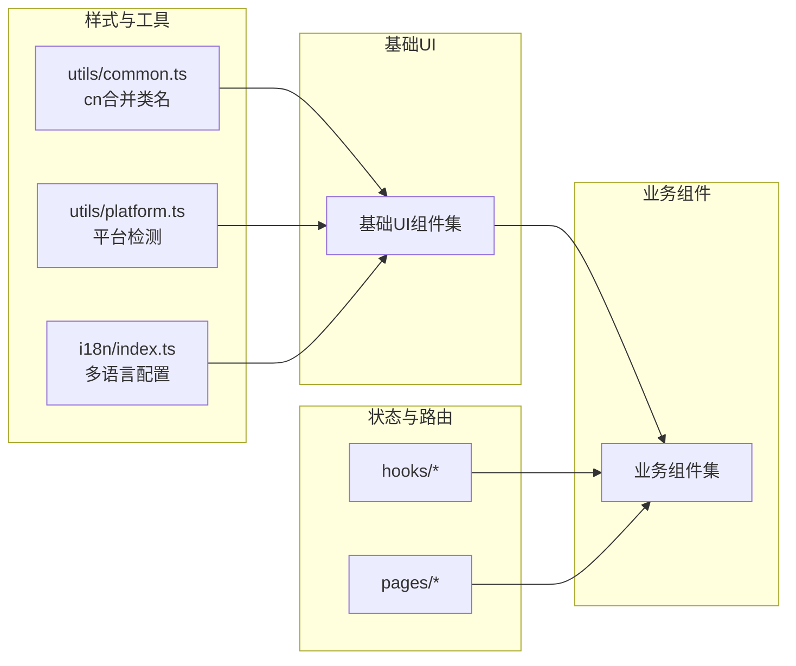
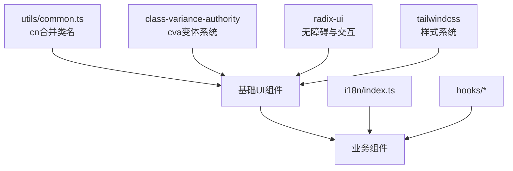

# 基础UI组件

<cite>
**本文引用的文件**
- [input.tsx](file://examples/web_ui/frontend/src/components/ui/input.tsx)
- [textarea.tsx](file://examples/web_ui/frontend/src/components/ui/textarea.tsx)
- [button.tsx](file://examples/web_ui/frontend/src/components/ui/button.tsx)
- [button-group.tsx](file://examples/web_ui/frontend/src/components/ui/button-group.tsx)
- [label.tsx](file://examples/web_ui/frontend/src/components/ui/label.tsx)
- [input-group.tsx](file://examples/web_ui/frontend/src/components/ui/input-group.tsx)
- [dialog.tsx](file://examples/web_ui/frontend/src/components/ui/dialog.tsx)
- [select.tsx](file://examples/web_ui/frontend/src/components/ui/select.tsx)
- [checkbox.tsx](file://examples/web_ui/frontend/src/components/ui/checkbox.tsx)
- [switch.tsx](file://examples/web_ui/frontend/src/components/ui/switch.tsx)
- [tooltip.tsx](file://examples/web_ui/frontend/src/components/ui/tooltip.tsx)
- [popover.tsx](file://examples/web_ui/frontend/src/components/ui/popover.tsx)
- [tabs.tsx](file://examples/web_ui/frontend/src/components/ui/tabs.tsx)
- [card.tsx](file://examples/web_ui/frontend/src/components/ui/card.tsx)
- [alert.tsx](file://examples/web_ui/frontend/src/components/ui/alert.tsx)
- [badge.tsx](file://examples/web_ui/frontend/src/components/ui/badge.tsx)
- [empty.tsx](file://examples/web_ui/frontend/src/components/ui/empty.tsx)
- [skeleton.tsx](file://examples/web_ui/frontend/src/components/ui/skeleton.tsx)
- [spinner.tsx](file://examples/web_ui/frontend/src/components/ui/spinner.tsx)
- [calendar.tsx](file://examples/web_ui/frontend/src/components/ui/calendar.tsx)
- [field.tsx](file://examples/web_ui/frontend/src/components/ui/field.tsx)
- [item.tsx](file://examples/web_ui/frontend/src/components/ui/item.tsx)
- [separator.tsx](file://examples/web_ui/frontend/src/components/ui/separator.tsx)
- [sidebar.tsx](file://examples/web_ui/frontend/src/components/ui/sidebar.tsx)
- [sheet.tsx](file://examples/web_ui/frontend/src/components/ui/sheet.tsx)
- [drawer.tsx](file://examples/web_ui/frontend/src/components/ui/drawer.tsx)
- [dropdown-menu.tsx](file://examples/web_ui/frontend/src/components/ui/dropdown-menu.tsx)
- [kbd.tsx](file://examples/web_ui/frontend/src/components/ui/kbd.tsx)
- [sonner.tsx](file://examples/web_ui/frontend/src/components/ui/sonner.tsx)
- [collapsible.tsx](file://examples/web_ui/frontend/src/components/ui/collapsible.tsx)
- [layout/AppLayout.tsx](file://examples/web_ui/frontend/src/components/layout/AppLayout.tsx)
- [layout/AppSidebar.tsx](file://examples/web_ui/frontend/src/components/layout/AppSidebar.tsx)
- [form/SchemaForm.tsx](file://examples/web_ui/frontend/src/components/form/SchemaForm.tsx)
- [chat/TextInput.tsx](file://examples/web_ui/frontend/src/components/chat/TextInput.tsx)
- [dialog/AgentDialog.tsx](file://examples/web_ui/frontend/src/components/dialog/AgentDialog.tsx)
- [dialog/DeleteDialog.tsx](file://examples/web_ui/frontend/src/components/dialog/DeleteDialog.tsx)
- [dialog/CreateCredentialDialog.tsx](file://examples/web_ui/frontend/src/components/dialog/CreateCredentialDialog.tsx)
- [dialog/EditAgentDialog.tsx](file://examples/web_ui/frontend/src/components/dialog/EditAgentDialog.tsx)
- [dialog/MCPDialog.tsx](file://examples/web_ui/frontend/src/components/dialog/MCPDialog.tsx)
- [dialog/RenameSessionDialog.tsx](file://examples/web_ui/frontend/src/components/dialog/RenameSessionDialog.tsx)
- [dialog/AddSkillDialog.tsx](file://examples/web_ui/frontend/src/components/dialog/AddSkillDialog.tsx)
- [dialog/DeleteAgentDialog.tsx](file://examples/web_ui/frontend/src/components/dialog/DeleteAgentDialog.tsx)
- [dialog/EditCredentialDialog.tsx](file://examples/web_ui/frontend/src/components/dialog/EditCredentialDialog.tsx)
- [popover/ModelParametersPopover.tsx](file://examples/web_ui/frontend/src/components/popover/ModelParametersPopover.tsx)
- [drawer/WorkspaceDrawer.tsx](file://examples/web_ui/frontend/src/components/drawer/WorkspaceDrawer.tsx)
- [select/LlmSelect.tsx](file://examples/web_ui/frontend/src/components/select/LlmSelect.tsx)
- [select/PermissionModeSelect.tsx](file://examples/web_ui/frontend/src/components/select/PermissionModeSelect.tsx)
- [select/TimezoneSelect.tsx](file://examples/web_ui/frontend/src/components/select/TimezoneSelect.tsx)
- [badge/InputTypeBadges.tsx](file://examples/web_ui/frontend/src/components/badge/InputTypeBadges.tsx)
- [badge/StatusBadge.tsx](file://examples/web_ui/frontend/src/components/badge/StatusBadge.tsx)
- [chat/MessageBubble.tsx](file://examples/web_ui/frontend/src/components/chat/MessageBubble.tsx)
- [chat/ChatContent.tsx](file://examples/web_ui/frontend/src/components/chat/ChatContent.tsx)
- [chat/Empty.tsx](file://examples/web_ui/frontend/src/components/chat/Empty.tsx)
- [chat/ConfirmCard.tsx](file://examples/web_ui/frontend/src/components/chat/ConfirmCard.tsx)
- [tour/ChatTourController.tsx](file://examples/web_ui/frontend/src/components/tour/ChatTourController.tsx)
- [tour/TourCard.tsx](file://examples/web_ui/frontend/src/components/tour/TourCard.tsx)
- [hooks/useChat.ts](file://examples/web_ui/frontend/src/components/hooks/useChat.ts)
- [hooks/useAgents.ts](file://examples/web_ui/frontend/src/components/hooks/useAgents.ts)
- [hooks/useModels.ts](file://examples/web_ui/frontend/src/components/hooks/useModels.ts)
- [hooks/useSchedules.ts](file://examples/web_ui/frontend/src/components/hooks/useSchedules.ts)
- [hooks/useSessions.ts](file://examples/web_ui/frontend/src/components/hooks/useSessions.ts)
- [hooks/useCredentials.ts](file://examples/web_ui/frontend/src/components/hooks/useCredentials.ts)
- [hooks/useMobile.ts](file://examples/web_ui/frontend/src/components/hooks/useMobile.ts)
- [hooks/useWorkspace.ts](file://examples/web_ui/frontend/src/components/hooks/useWorkspace.ts)
- [hooks/useAgentSchema.ts](file://examples/web_ui/frontend/src/components/hooks/useAgentSchema.ts)
- [i18n/index.ts](file://examples/web_ui/frontend/src/components/i18n/index.ts)
- [i18n/useI18n.ts](file://examples/web_ui/frontend/src/components/i18n/useI18n.ts)
- [pages/chat/index.tsx](file://examples/web_ui/frontend/src/components/pages/chat/index.tsx)
- [pages/credential/index.tsx](file://examples/web_ui/frontend/src/components/pages/credential/index.tsx)
- [pages/schedule/index.tsx](file://examples/web_ui/frontend/src/components/pages/schedule/index.tsx)
- [pages/setup/index.tsx](file://examples/web_ui/frontend/src/components/pages/setup/index.tsx)
- [utils/common.ts](file://examples/web_ui/frontend/src/components/utils/common.ts)
- [utils/platform.ts](file://examples/web_ui/frontend/src/components/utils/platform.ts)
- [App.tsx](file://examples/web_ui/frontend/src/App.tsx)
- [main.tsx](file://examples/web_ui/frontend/src/main.tsx)
- [index.css](file://examples/web_ui/frontend/src/index.css)
- [package.json](file://examples/web_ui/frontend/package.json)
- [vite.config.ts](file://examples/web_ui/frontend/vite.config.ts)
</cite>

## 目录
1. [简介](#简介)
2. [项目结构](#项目结构)
3. [核心组件](#核心组件)
4. [架构总览](#架构总览)
5. [详细组件分析](#详细组件分析)
6. [依赖关系分析](#依赖关系分析)
7. [性能考量](#性能考量)
8. [故障排查指南](#故障排查指南)
9. [结论](#结论)
10. [附录](#附录)

## 简介
本文件面向AgentScope前端UI基础组件，系统性梳理并说明按钮、输入框、对话框、选择器、文本域、标签、开关、提示、弹出层、页签、卡片、徽章、空态、骨架屏、加载指示器、日历、字段容器、条目、分隔线、侧边栏、抽屉、下拉菜单、快捷键、通知、可折叠等基础UI组件的设计规范与实现细节。内容涵盖：
- Props接口定义、默认值与类型约束
- 事件处理机制（如onClick、onChange、onSubmit等）
- 样式系统（Tailwind CSS类名使用规范与主题定制方法）
- 完整API参考（属性、事件回调签名与返回值）
- 实际使用示例与最佳实践

## 项目结构
前端位于examples/web_ui/frontend，采用React + TypeScript + Tailwind CSS + Radix UI + class-variance-authority的组合。基础UI组件集中在components/ui目录，业务组件分布在components/下各功能域（如chat、dialog、select、popover、drawer等），并通过hooks、i18n、utils等模块提供支撑。

```mermaid
graph TB
subgraph "前端应用"
APP["App.tsx"]
MAIN["main.tsx"]
CSS["index.css"]
end
subgraph "布局"
LAYOUT["layout/AppLayout.tsx"]
SIDEBAR["layout/AppSidebar.tsx"]
end
subgraph "基础UI组件"
BTN["ui/button.tsx"]
INPUT["ui/input.tsx"]
TEXTAREA["ui/textarea.tsx"]
LABEL["ui/label.tsx"]
SELECT["ui/select.tsx"]
CHECK["ui/checkbox.tsx"]
SWITCH["ui/switch.tsx"]
DLG["ui/dialog.tsx"]
POPOVER["ui/popover.tsx"]
TOOLTIP["ui/tooltip.tsx"]
TABS["ui/tabs.tsx"]
CARD["ui/card.tsx"]
BADGE["ui/badge.tsx"]
EMPTY["ui/empty.tsx"]
SKELETON["ui/skeleton.tsx"]
SPINNER["ui/spinner.tsx"]
CALENDAR["ui/calendar.tsx"]
FIELD["ui/field.tsx"]
ITEM["ui/item.tsx"]
SEPARATOR["ui/separator.tsx"]
SIDEBAR_UI["ui/sidebar.tsx"]
SHEET["ui/sheet.tsx"]
DRAWER["ui/drawer.tsx"]
DROPDOWN["ui/dropdown-menu.tsx"]
KBD["ui/kbd.tsx"]
SONNER["ui/sonner.tsx"]
COLLAPSIBLE["ui/collapsible.tsx"]
INPUT_GROUP["ui/input-group.tsx"]
BUTTON_GROUP["ui/button-group.tsx"]
ALERT["ui/alert.tsx"]
end
subgraph "业务组件"
CHAT_INPUT["chat/TextInput.tsx"]
MSG_BUBBLE["chat/MessageBubble.tsx"]
DIALOGS["dialog/*.tsx"]
SELECTS["select/*.tsx"]
POPOVERS["popover/*.tsx"]
DRAWERS["drawer/*.tsx"]
TOURS["tour/*.tsx"]
end
subgraph "工具与状态"
USECHAT["hooks/useChat.ts"]
USEAGENTS["hooks/useAgents.ts"]
USEMODELS["hooks/useModels.ts"]
USEMOBILE["hooks/useMobile.ts"]
I18N["i18n/index.ts"]
end
APP --> LAYOUT
LAYOUT --> SIDEBAR
LAYOUT --> CHAT_INPUT
CHAT_INPUT --> INPUT
CHAT_INPUT --> TEXTAREA
CHAT_INPUT --> DLG
CHAT_INPUT --> POPOVER
CHAT_INPUT --> SELECT
CHAT_INPUT --> USECHAT
DIALOGS --> DLG
SELECTS --> SELECT
POPOVERS --> POPOVER
DRAWERS --> DRAWER
TOURS --> CHAT_INPUT
INPUT_GROUP --> INPUT
INPUT_GROUP --> TEXTAREA
INPUT_GROUP --> BTN
BUTTON_GROUP --> BTN
USEAGENTS --> I18N
USEMODELS --> I18N
```

图表来源
- [App.tsx](file://examples/web_ui/frontend/src/App.tsx)
- [AppLayout.tsx](file://examples/web_ui/frontend/src/components/layout/AppLayout.tsx)
- [AppSidebar.tsx](file://examples/web_ui/frontend/src/components/layout/AppSidebar.tsx)
- [button.tsx](file://examples/web_ui/frontend/src/components/ui/button.tsx)
- [input.tsx](file://examples/web_ui/frontend/src/components/ui/input.tsx)
- [textarea.tsx](file://examples/web_ui/frontend/src/components/ui/textarea.tsx)
- [dialog.tsx](file://examples/web_ui/frontend/src/components/ui/dialog.tsx)
- [select.tsx](file://examples/web_ui/frontend/src/components/ui/select.tsx)
- [popover.tsx](file://examples/web_ui/frontend/src/components/ui/popover.tsx)
- [tooltip.tsx](file://examples/web_ui/frontend/src/components/ui/tooltip.tsx)
- [tabs.tsx](file://examples/web_ui/frontend/src/components/ui/tabs.tsx)
- [card.tsx](file://examples/web_ui/frontend/src/components/ui/card.tsx)
- [badge.tsx](file://examples/web_ui/frontend/src/components/ui/badge.tsx)
- [empty.tsx](file://examples/web_ui/frontend/src/components/ui/empty.tsx)
- [skeleton.tsx](file://examples/web_ui/frontend/src/components/ui/skeleton.tsx)
- [spinner.tsx](file://examples/web_ui/frontend/src/components/ui/spinner.tsx)
- [calendar.tsx](file://examples/web_ui/frontend/src/components/ui/calendar.tsx)
- [field.tsx](file://examples/web_ui/frontend/src/components/ui/field.tsx)
- [item.tsx](file://examples/web_ui/frontend/src/components/ui/item.tsx)
- [separator.tsx](file://examples/web_ui/frontend/src/components/ui/separator.tsx)
- [sidebar.tsx](file://examples/web_ui/frontend/src/components/ui/sidebar.tsx)
- [sheet.tsx](file://examples/web_ui/frontend/src/components/ui/sheet.tsx)
- [drawer.tsx](file://examples/web_ui/frontend/src/components/ui/drawer.tsx)
- [dropdown-menu.tsx](file://examples/web_ui/frontend/src/components/ui/dropdown-menu.tsx)
- [kbd.tsx](file://examples/web_ui/frontend/src/components/ui/kbd.tsx)
- [sonner.tsx](file://examples/web_ui/frontend/src/components/ui/sonner.tsx)
- [collapsible.tsx](file://examples/web_ui/frontend/src/components/ui/collapsible.tsx)
- [input-group.tsx](file://examples/web_ui/frontend/src/components/ui/input-group.tsx)
- [button-group.tsx](file://examples/web_ui/frontend/src/components/ui/button-group.tsx)
- [alert.tsx](file://examples/web_ui/frontend/src/components/ui/alert.tsx)
- [chat/TextInput.tsx](file://examples/web_ui/frontend/src/components/chat/TextInput.tsx)
- [dialog/*.tsx](file://examples/web_ui/frontend/src/components/dialog/*.tsx)
- [select/*.tsx](file://examples/web_ui/frontend/src/components/select/*.tsx)
- [popover/*.tsx](file://examples/web_ui/frontend/src/components/popover/*.tsx)
- [drawer/*.tsx](file://examples/web_ui/frontend/src/components/drawer/*.tsx)
- [tour/*.tsx](file://examples/web_ui/frontend/src/components/tour/*.tsx)
- [hooks/useChat.ts](file://examples/web_ui/frontend/src/components/hooks/useChat.ts)
- [hooks/useAgents.ts](file://examples/web_ui/frontend/src/components/hooks/useAgents.ts)
- [hooks/useModels.ts](file://examples/web_ui/frontend/src/components/hooks/useModels.ts)
- [hooks/useMobile.ts](file://examples/web_ui/frontend/src/components/hooks/useMobile.ts)
- [i18n/index.ts](file://examples/web_ui/frontend/src/components/i18n/index.ts)

章节来源
- [package.json](file://examples/web_ui/frontend/package.json)
- [vite.config.ts](file://examples/web_ui/frontend/vite.config.ts)

## 核心组件
本节对基础UI组件进行分类与要点总结，便于快速查阅与对比。

- 输入类
  - 输入框：支持类型、占位符、禁用、无效状态、聚焦环等，具备暗色模式适配与无障碍属性。
  - 文本域：多行文本输入，自适应高度、禁用与无效状态、聚焦环。
  - 组合输入：输入组容器，内含addon、按钮、纯文本、输入框、文本域，支持对齐与尺寸变体。
- 交互类
  - 按钮：支持尺寸、变体、禁用、阴影、图标按钮等；按钮组支持水平/垂直排列与间距。
  - 开关：受控/非受控切换，支持禁用与无障碍。
  - 复选框：受控/非受控勾选，支持禁用与半选状态。
  - 提示：悬浮提示，支持触发方式与定位。
  - 弹出层：弹出面板，支持触发、定位与关闭。
  - 下拉菜单：下拉动作集合，支持键盘导航与无障碍。
  - 对话框：模态对话框，支持遮罩、关闭、回车提交等。
  - 抽屉：右侧/底部抽屉，支持拖拽与键盘关闭。
  - 可折叠：可展开/收起区域，支持动画与无障碍。
- 呈现类
  - 标签：语义化标签，支持禁用态与字体权重。
  - 卡片：容器卡片，支持标题、描述、操作区。
  - 徽章：状态/类型徽章，支持颜色与尺寸。
  - 空态：空数据占位，支持图标与文案。
  - 骨架屏：加载占位，支持动画与圆角。
  - 加载指示器：旋转加载，支持尺寸与颜色。
  - 日历：日期选择，支持多语言与范围选择。
  - 字段容器：表单字段包装，支持标签与错误提示。
  - 条目：列表项，支持操作按钮与禁用态。
  - 分隔线：水平/垂直分隔，支持样式变体。
  - 侧边栏：页面侧边导航，支持折叠与跳转。
  - 快捷键：键盘按键样式，支持大小写与修饰键。
  - 通知：全局通知，支持位置与持续时间。
  - 警告：警示信息，支持标题与描述。
- 选择类
  - 选择器：通用选择器，支持清空、禁用、选项渲染。
  - LLM选择器：模型选择，支持过滤与分组。
  - 权限模式选择器：权限模式选择。
  - 时区选择器：时区列表选择。

章节来源
- [input.tsx](file://examples/web_ui/frontend/src/components/ui/input.tsx)
- [textarea.tsx](file://examples/web_ui/frontend/src/components/ui/textarea.tsx)
- [input-group.tsx](file://examples/web_ui/frontend/src/components/ui/input-group.tsx)
- [button.tsx](file://examples/web_ui/frontend/src/components/ui/button.tsx)
- [button-group.tsx](file://examples/web_ui/frontend/src/components/ui/button-group.tsx)
- [label.tsx](file://examples/web_ui/frontend/src/components/ui/label.tsx)
- [checkbox.tsx](file://examples/web_ui/frontend/src/components/ui/checkbox.tsx)
- [switch.tsx](file://examples/web_ui/frontend/src/components/ui/switch.tsx)
- [tooltip.tsx](file://examples/web_ui/frontend/src/components/ui/tooltip.tsx)
- [popover.tsx](file://examples/web_ui/frontend/src/components/ui/popover.tsx)
- [dialog.tsx](file://examples/web_ui/frontend/src/components/ui/dialog.tsx)
- [drawer.tsx](file://examples/web_ui/frontend/src/components/ui/drawer.tsx)
- [collapsible.tsx](file://examples/web_ui/frontend/src/components/ui/collapsible.tsx)
- [select.tsx](file://examples/web_ui/frontend/src/components/ui/select.tsx)
- [select/LlmSelect.tsx](file://examples/web_ui/frontend/src/components/select/LlmSelect.tsx)
- [select/PermissionModeSelect.tsx](file://examples/web_ui/frontend/src/components/select/PermissionModeSelect.tsx)
- [select/TimezoneSelect.tsx](file://examples/web_ui/frontend/src/components/select/TimezoneSelect.tsx)
- [card.tsx](file://examples/web_ui/frontend/src/components/ui/card.tsx)
- [badge.tsx](file://examples/web_ui/frontend/src/components/ui/badge.tsx)
- [empty.tsx](file://examples/web_ui/frontend/src/components/ui/empty.tsx)
- [skeleton.tsx](file://examples/web_ui/frontend/src/components/ui/skeleton.tsx)
- [spinner.tsx](file://examples/web_ui/frontend/src/components/ui/spinner.tsx)
- [calendar.tsx](file://examples/web_ui/frontend/src/components/ui/calendar.tsx)
- [field.tsx](file://examples/web_ui/frontend/src/components/ui/field.tsx)
- [item.tsx](file://examples/web_ui/frontend/src/components/ui/item.tsx)
- [separator.tsx](file://examples/web_ui/frontend/src/components/ui/separator.tsx)
- [sidebar.tsx](file://examples/web_ui/frontend/src/components/ui/sidebar.tsx)
- [sheet.tsx](file://examples/web_ui/frontend/src/components/ui/sheet.tsx)
- [dropdown-menu.tsx](file://examples/web_ui/frontend/src/components/ui/dropdown-menu.tsx)
- [kbd.tsx](file://examples/web_ui/frontend/src/components/ui/kbd.tsx)
- [sonner.tsx](file://examples/web_ui/frontend/src/components/ui/sonner.tsx)
- [alert.tsx](file://examples/web_ui/frontend/src/components/ui/alert.tsx)

## 架构总览
基础UI组件通过统一的样式系统（Tailwind + cn工具）与变体系统（class-variance-authority）实现一致的外观与行为。组件间通过组合与复用形成更高阶的业务组件（如聊天输入框、对话框族、选择器族等）。国际化由i18n模块提供，移动端适配由useMobile钩子提供。

图表来源
- [utils/common.ts](file://examples/web_ui/frontend/src/components/utils/common.ts)
- [utils/platform.ts](file://examples/web_ui/frontend/src/components/utils/platform.ts)
- [i18n/index.ts](file://examples/web_ui/frontend/src/components/i18n/index.ts)
- [ui/*.tsx](file://examples/web_ui/frontend/src/components/ui/*.tsx)
- [hooks/*.ts](file://examples/web_ui/frontend/src/components/hooks/*.ts)
- [pages/*.tsx](file://examples/web_ui/frontend/src/components/pages/*.tsx)

## 详细组件分析

### 输入框 Input
- 设计要点
  - 支持type、占位符、禁用、无效状态、聚焦环、暗色模式适配。
  - 使用data-slot标识内部元素，便于主题与测试定位。
- Props
  - className?: string
  - type?: string
  - 其他原生input属性
- 事件
  - onChange、onFocus、onBlur、onKeyDown等原生事件透传
- 样式
  - Tailwind类名：边框、背景、圆角、过渡、焦点环、禁用与无效态
  - 暗色模式：通过dark前缀类名适配
- 最佳实践
  - 与Label配合使用，确保无障碍关联
  - 与Field组合，统一错误提示与布局

章节来源
- [input.tsx](file://examples/web_ui/frontend/src/components/ui/input.tsx)

### 文本域 Textarea
- 设计要点
  - 多行文本输入，最小高度、自适应行高、禁用与无效态
  - 与Input共享焦点环与暗色模式适配
- Props
  - className?: string
  - 其他原生textarea属性
- 事件
  - onChange、onFocus、onBlur等原生事件透传
- 样式
  - 自动高度与行高控制，保证内容不被截断
- 最佳实践
  - 与InputGroup组合，实现带addon/按钮的复合输入
  - 在表单中与Field、Label组合使用

章节来源
- [textarea.tsx](file://examples/web_ui/frontend/src/components/ui/textarea.tsx)

### 组合输入 InputGroup
- 设计要点
  - 容器角色，内部可放置addon、按钮、纯文本、输入框、文本域
  - 支持对齐（块起始/结束）、尺寸变体、禁用态、无效态、聚焦环
- 子组件
  - InputGroupAddon、InputGroupButton、InputGroupText、InputGroupInput、InputGroupTextarea
- Props
  - InputGroup: className?
  - InputGroupButton: type、variant、size（xs/sm/icon-xs/icon-sm）
  - InputGroupInput/Textarea: className?
- 事件
  - 按钮：onClick透传
  - 输入：onChange、onFocus、onBlur等透传
- 样式
  - 通过data-slot与aria-*属性实现聚焦环与无效态联动
  - 不同对齐方式下自动调整内边距
- 最佳实践
  - 与Button、Input/Textarea组合，实现搜索框、数值输入框等常见形态

章节来源
- [input-group.tsx](file://examples/web_ui/frontend/src/components/ui/input-group.tsx)

### 按钮 Button
- 设计要点
  - 支持尺寸、变体、禁用、阴影、图标按钮
  - 通过cva定义变体，cn合并类名
- Props
  - variant?: 'default' | 'destructive' | 'outline' | 'secondary' | 'ghost' | 'link'
  - size?: 'sm' | 'md' | 'lg' | 'icon'
  - className?: string
  - 其他原生button属性
- 事件
  - onClick等原生事件透传
- 样式
  - 通过变体与尺寸类名组合，支持暗色模式
- 最佳实践
  - 图标按钮使用icon尺寸，避免文字溢出
  - 主要操作使用default，危险操作使用destructive

章节来源
- [button.tsx](file://examples/web_ui/frontend/src/components/ui/button.tsx)

### 按钮组 ButtonGroup
- 设计要点
  - 将多个按钮组合为连续组，支持水平/垂直方向
  - 自动去除相邻按钮的重复边框与圆角，保持视觉连贯
- Props
  - orientation?: 'horizontal' | 'vertical'
  - className?: string
- 事件
  - 内部按钮事件透传
- 样式
  - 通过data-orientation与选择器组合实现方向差异
- 最佳实践
  - 工具栏按钮组使用horizontal
  - 垂直工具栏使用vertical

章节来源
- [button-group.tsx](file://examples/web_ui/frontend/src/components/ui/button-group.tsx)

### 标签 Label
- 设计要点
  - 语义化标签，支持禁用态与字体权重
  - 与表单控件无障碍关联
- Props
  - className?: string
  - 其他原生label属性
- 样式
  - 通过group-data与peer选择器实现禁用态与控件禁用态联动
- 最佳实践
  - 与Input、Textarea、Checkbox等控件配合使用

章节来源
- [label.tsx](file://examples/web_ui/frontend/src/components/ui/label.tsx)

### 选择器 Select
- 设计要点
  - 通用选择器，支持清空、禁用、选项渲染、过滤
  - 与Combobox类似，但更偏向传统下拉风格
- Props
  - value?: string
  - onValueChange?: (value: string) => void
  - placeholder?: string
  - disabled?: boolean
  - className?: string
  - children: ReactNode
- 事件
  - onValueChange回调
- 样式
  - 与Trigger、Content、Item等子组件协作
- 最佳实践
  - 与Form Schema结合，实现动态表单

章节来源
- [select.tsx](file://examples/web_ui/frontend/src/components/ui/select.tsx)

### LLM选择器 LlmSelect
- 设计要点
  - 专用模型选择器，支持过滤、分组与禁用
- Props
  - value?: string
  - onValueChange?: (value: string) => void
  - disabled?: boolean
  - className?: string
- 事件
  - onValueChange回调
- 最佳实践
  - 与useModels钩子配合，动态加载可用模型

章节来源
- [select/LlmSelect.tsx](file://examples/web_ui/frontend/src/components/select/LlmSelect.tsx)

### 权限模式选择器 PermissionModeSelect
- 设计要点
  - 权限模式选择，支持禁用
- Props
  - value?: string
  - onValueChange?: (value: string) => void
  - disabled?: boolean
  - className?: string
- 事件
  - onValueChange回调
- 最佳实践
  - 与权限规则结合，限制工具调用范围

章节来源
- [select/PermissionModeSelect.tsx](file://examples/web_ui/frontend/src/components/select/PermissionModeSelect.tsx)

### 时区选择器 TimezoneSelect
- 设计要点
  - 时区列表选择，支持禁用
- Props
  - value?: string
  - onValueChange?: (value: string) => void
  - disabled?: boolean
  - className?: string
- 事件
  - onValueChange回调
- 最佳实践
  - 与useSchedules钩子配合，显示本地化时间

章节来源
- [select/TimezoneSelect.tsx](file://examples/web_ui/frontend/src/components/select/TimezoneSelect.tsx)

### 复选框 Checkbox
- 设计要点
  - 支持受控/非受控、禁用、半选状态
- Props
  - checked?: boolean
  - onCheckedChange?: (checked: boolean) => void
  - disabled?: boolean
  - className?: string
- 事件
  - onCheckedChange回调
- 样式
  - 与indeterminate状态配合，实现三态效果
- 最佳实践
  - 与Label组合，提升可访问性

章节来源
- [checkbox.tsx](file://examples/web_ui/frontend/src/components/ui/checkbox.tsx)

### 开关 Switch
- 设计要点
  - 受控/非受控切换，支持禁用
- Props
  - checked?: boolean
  - onCheckedChange?: (checked: boolean) => void
  - disabled?: boolean
  - className?: string
- 事件
  - onCheckedChange回调
- 最佳实践
  - 用于开启/关闭功能开关

章节来源
- [switch.tsx](file://examples/web_ui/frontend/src/components/ui/switch.tsx)

### 提示 Tooltip
- 设计要点
  - 悬浮提示，支持触发方式与定位
- Props
  - content: string | ReactNode
  - side?: 'top' | 'bottom' | 'left' | 'right'
  - align?: 'start' | 'center' | 'end'
  - className?: string
- 事件
  - 无显式回调，依赖Radix UI内部逻辑
- 最佳实践
  - 与图标按钮配合，提供简短说明

章节来源
- [tooltip.tsx](file://examples/web_ui/frontend/src/components/ui/tooltip.tsx)

### 弹出层 Popover
- 设计要点
  - 弹出面板，支持触发、定位与关闭
- Props
  - children: ReactNode
  - content: ReactNode
  - side?: 'top' | 'bottom' | 'left' | 'right'
  - align?: 'start' | 'center' | 'end'
  - className?: string
- 事件
  - 无显式回调，依赖Radix UI内部逻辑
- 最佳实践
  - 与模型参数配置配合，展示高级参数

章节来源
- [popover.tsx](file://examples/web_ui/frontend/src/components/ui/popover.tsx)

### 对话框 Dialog
- 设计要点
  - 模态对话框，支持遮罩、关闭、回车提交
- Props
  - open?: boolean
  - onOpenChange?: (open: boolean) => void
  - className?: string
  - children: ReactNode
- 事件
  - onOpenChange回调
- 最佳实践
  - 与表单结合，实现确认/编辑/新增等交互

章节来源
- [dialog.tsx](file://examples/web_ui/frontend/src/components/ui/dialog.tsx)

### 抽屉 Drawer
- 设计要点
  - 右侧/底部抽屉，支持拖拽与键盘关闭
- Props
  - open?: boolean
  - onOpenChange?: (open: boolean) => void
  - side?: 'right' | 'bottom'
  - className?: string
  - children: ReactNode
- 事件
  - onOpenChange回调
- 最佳实践
  - 用于移动端或复杂设置面板

章节来源
- [drawer.tsx](file://examples/web_ui/frontend/src/components/ui/drawer.tsx)

### 可折叠 Collapsible
- 设计要点
  - 可展开/收起区域，支持动画与无障碍
- Props
  - open?: boolean
  - onOpenChange?: (open: boolean) => void
  - className?: string
  - children: ReactNode
- 事件
  - onOpenChange回调
- 最佳实践
  - 用于设置面板或详情区域

章节来源
- [collapsible.tsx](file://examples/web_ui/frontend/src/components/ui/collapsible.tsx)

### 页签 Tabs
- 设计要点
  - 选项卡容器，支持内容切换
- Props
  - value?: string
  - onValueChange?: (value: string) => void
  - className?: string
  - children: ReactNode
- 事件
  - onValueChange回调
- 最佳实践
  - 用于分组内容展示

章节来源
- [tabs.tsx](file://examples/web_ui/frontend/src/components/ui/tabs.tsx)

### 卡片 Card
- 设计要点
  - 容器卡片，支持标题、描述、操作区
- Props
  - className?: string
  - children: ReactNode
- 最佳实践
  - 用于信息区块展示

章节来源
- [card.tsx](file://examples/web_ui/frontend/src/components/ui/card.tsx)

### 徽章 Badge
- 设计要点
  - 状态/类型徽章，支持颜色与尺寸
- Props
  - className?: string
  - children: ReactNode
- 最佳实践
  - 用于状态标识与类型标记

章节来源
- [badge.tsx](file://examples/web_ui/frontend/src/components/ui/badge.tsx)

### 空态 Empty
- 设计要点
  - 空数据占位，支持图标与文案
- Props
  - className?: string
  - children: ReactNode
- 最佳实践
  - 用于列表/表格为空时的提示

章节来源
- [empty.tsx](file://examples/web_ui/frontend/src/components/ui/empty.tsx)

### 骨架屏 Skeleton
- 设计要点
  - 加载占位，支持动画与圆角
- Props
  - className?: string
  - children: ReactNode
- 最佳实践
  - 用于异步数据加载前的占位

章节来源
- [skeleton.tsx](file://examples/web_ui/frontend/src/components/ui/skeleton.tsx)

### 加载指示器 Spinner
- 设计要点
  - 旋转加载，支持尺寸与颜色
- Props
  - className?: string
  - children: ReactNode
- 最佳实践
  - 用于长时间操作提示

章节来源
- [spinner.tsx](file://examples/web_ui/frontend/src/components/ui/spinner.tsx)

### 日历 Calendar
- 设计要点
  - 日期选择，支持多语言与范围选择
- Props
  - mode?: 'single' | 'range'
  - selected?: Date | Date[]
  - onSelect?: (date: Date | Date[]) => void
  - locale?: Locale
  - className?: string
- 事件
  - onSelect回调
- 最佳实践
  - 与useSchedules钩子配合，选择会议时间

章节来源
- [calendar.tsx](file://examples/web_ui/frontend/src/components/ui/calendar.tsx)

### 字段容器 Field
- 设计要点
  - 表单字段包装，支持标签与错误提示
- Props
  - label?: string
  - error?: string
  - className?: string
  - children: ReactNode
- 最佳实践
  - 与Label、Input/Select等组合使用

章节来源
- [field.tsx](file://examples/web_ui/frontend/src/components/ui/field.tsx)

### 条目 Item
- 设计要点
  - 列表项，支持操作按钮与禁用态
- Props
  - className?: string
  - children: ReactNode
- 最佳实践
  - 用于列表/表格行

章节来源
- [item.tsx](file://examples/web_ui/frontend/src/components/ui/item.tsx)

### 分隔线 Separator
- 设计要点
  - 水平/垂直分隔，支持样式变体
- Props
  - orientation?: 'horizontal' | 'vertical'
  - className?: string
- 最佳实践
  - 用于内容分区

章节来源
- [separator.tsx](file://examples/web_ui/frontend/src/components/ui/separator.tsx)

### 侧边栏 Sidebar
- 设计要点
  - 页面侧边导航，支持折叠与跳转
- Props
  - className?: string
  - children: ReactNode
- 最佳实践
  - 用于主菜单导航

章节来源
- [sidebar.tsx](file://examples/web_ui/frontend/src/components/ui/sidebar.tsx)

### 抽屉 Sheet
- 设计要点
  - 类似Drawer，支持右侧/底部抽屉
- Props
  - open?: boolean
  - onOpenChange?: (open: boolean) => void
  - side?: 'right' | 'bottom'
  - className?: string
  - children: ReactNode
- 事件
  - onOpenChange回调
- 最佳实践
  - 用于移动端或设置面板

章节来源
- [sheet.tsx](file://examples/web_ui/frontend/src/components/ui/sheet.tsx)

### 下拉菜单 DropdownMenu
- 设计要点
  - 下拉动作集合，支持键盘导航与无障碍
- Props
  - children: ReactNode
  - className?: string
- 最佳实践
  - 用于用户菜单或操作菜单

章节来源
- [dropdown-menu.tsx](file://examples/web_ui/frontend/src/components/ui/dropdown-menu.tsx)

### 快捷键 Kbd
- 设计要点
  - 键盘按键样式，支持大小写与修饰键
- Props
  - className?: string
  - children: ReactNode
- 最佳实践
  - 用于快捷键提示

章节来源
- [kbd.tsx](file://examples/web_ui/frontend/src/components/ui/kbd.tsx)

### 通知 Sonner
- 设计要点
  - 全局通知，支持位置与持续时间
- Props
  - toast: ToastT
  - className?: string
- 最佳实践
  - 用于系统消息与操作反馈

章节来源
- [sonner.tsx](file://examples/web_ui/frontend/src/components/ui/sonner.tsx)

### 警告 Alert
- 设计要点
  - 警示信息，支持标题与描述
- Props
  - title?: string
  - description?: string
  - className?: string
  - children: ReactNode
- 最佳实践
  - 用于错误提示与警告信息

章节来源
- [alert.tsx](file://examples/web_ui/frontend/src/components/ui/alert.tsx)

### 聊天输入框 TextInput
- 设计要点
  - 多功能输入框，支持文本、文件、自动完成、发送回调
  - 支持多行自适应高度、附件管理、建议提示
- Props
  - onSend?: (blocks: ContentBlock[]) => void
  - placeholder?: string
  - autoComplete?: (text: string) => Promise<string[]>
  - disabled?: boolean
  - className?: string
  - allowedInputTypes?: string[]
  - fileProcessor?: (file: File) => Promise<ProcessedFile>
- 事件
  - onChange、onKeyDown、onFocus、onBlur等原生事件透传
  - onSend在提交时触发
- 最佳实践
  - 与useChat钩子配合，实现聊天会话
  - 通过fileProcessor处理文件上传与预览

章节来源
- [chat/TextInput.tsx](file://examples/web_ui/frontend/src/components/chat/TextInput.tsx)

### 对话框族 Dialog Family
- 设计要点
  - 包含新增技能、编辑代理、删除代理、重命名会话、创建凭据、编辑凭据、MCP配置等
  - 均基于通用Dialog组件实现
- 共同特性
  - open、onOpenChange、className、children
  - 通过onOpenChange控制生命周期
- 最佳实践
  - 与对应业务钩子配合，实现CRUD操作

章节来源
- [dialog/AgentDialog.tsx](file://examples/web_ui/frontend/src/components/dialog/AgentDialog.tsx)
- [dialog/DeleteAgentDialog.tsx](file://examples/web_ui/frontend/src/components/dialog/DeleteAgentDialog.tsx)
- [dialog/EditAgentDialog.tsx](file://examples/web_ui/frontend/src/components/dialog/EditAgentDialog.tsx)
- [dialog/RenameSessionDialog.tsx](file://examples/web_ui/frontend/src/components/dialog/RenameSessionDialog.tsx)
- [dialog/CreateCredentialDialog.tsx](file://examples/web_ui/frontend/src/components/dialog/CreateCredentialDialog.tsx)
- [dialog/EditCredentialDialog.tsx](file://examples/web_ui/frontend/src/components/dialog/EditCredentialDialog.tsx)
- [dialog/MCPDialog.tsx](file://examples/web_ui/frontend/src/components/dialog/MCPDialog.tsx)
- [dialog/AddSkillDialog.tsx](file://examples/web_ui/frontend/src/components/dialog/AddSkillDialog.tsx)
- [dialog/DeleteDialog.tsx](file://examples/web_ui/frontend/src/components/dialog/DeleteDialog.tsx)

### 弹出层族 Popover Family
- 设计要点
  - 模型参数弹出层，展示与编辑模型参数
- 共同特性
  - 触发器与内容区，支持定位与关闭
- 最佳实践
  - 与模型选择器配合，实时查看参数

章节来源
- [popover/ModelParametersPopover.tsx](file://examples/web_ui/frontend/src/components/popover/ModelParametersPopover.tsx)

### 抽屉族 Drawer Family
- 设计要点
  - 工作空间抽屉，展示与管理工作空间
- 共同特性
  - 打开/关闭控制，内容区展示
- 最佳实践
  - 用于移动端或桌面端侧边面板

章节来源
- [drawer/WorkspaceDrawer.tsx](file://examples/web_ui/frontend/src/components/drawer/WorkspaceDrawer.tsx)

### 选择器族 Select Family
- 设计要点
  - LLM选择器、权限模式选择器、时区选择器
- 共同特性
  - value/onValueChange、disabled、className
- 最佳实践
  - 与useModels、useSchedules等钩子配合

章节来源
- [select/LlmSelect.tsx](file://examples/web_ui/frontend/src/components/select/LlmSelect.tsx)
- [select/PermissionModeSelect.tsx](file://examples/web_ui/frontend/src/components/select/PermissionModeSelect.tsx)
- [select/TimezoneSelect.tsx](file://examples/web_ui/frontend/src/components/select/TimezoneSelect.tsx)

### 徽章族 Badge Family
- 设计要点
  - 输入类型徽章、状态徽章
- 共同特性
  - 展示状态/类型信息
- 最佳实践
  - 用于文件类型与运行状态标识

章节来源
- [badge/InputTypeBadges.tsx](file://examples/web_ui/frontend/src/components/badge/InputTypeBadges.tsx)
- [badge/StatusBadge.tsx](file://examples/web_ui/frontend/src/components/badge/StatusBadge.tsx)

### 聊天组件族 Chat Family
- 设计要点
  - 消息气泡、聊天内容、空态、确认卡片
- 共同特性
  - 与useChat、useAgents等钩子协作
- 最佳实践
  - 用于聊天界面与消息展示

章节来源
- [chat/MessageBubble.tsx](file://examples/web_ui/frontend/src/components/chat/MessageBubble.tsx)
- [chat/ChatContent.tsx](file://examples/web_ui/frontend/src/components/chat/ChatContent.tsx)
- [chat/Empty.tsx](file://examples/web_ui/frontend/src/components/chat/Empty.tsx)
- [chat/ConfirmCard.tsx](file://examples/web_ui/frontend/src/components/chat/ConfirmCard.tsx)

### 导航与布局
- AppLayout：应用整体布局容器
- AppSidebar：侧边导航
- 最佳实践
  - 与路由配合，实现页面级布局

章节来源
- [layout/AppLayout.tsx](file://examples/web_ui/frontend/src/components/layout/AppLayout.tsx)
- [layout/AppSidebar.tsx](file://examples/web_ui/frontend/src/components/layout/AppSidebar.tsx)

### 国际化与工具
- i18n：多语言配置与Hook
- hooks：useChat、useAgents、useModels、useSchedules、useSessions、useCredentials、useMobile、useWorkspace、useAgentSchema
- utils：cn合并类名、平台检测
- 最佳实践
  - 与组件Props结合，实现本地化文案与行为

章节来源
- [i18n/index.ts](file://examples/web_ui/frontend/src/components/i18n/index.ts)
- [i18n/useI18n.ts](file://examples/web_ui/frontend/src/components/i18n/useI18n.ts)
- [hooks/useChat.ts](file://examples/web_ui/frontend/src/components/hooks/useChat.ts)
- [hooks/useAgents.ts](file://examples/web_ui/frontend/src/components/hooks/useAgents.ts)
- [hooks/useModels.ts](file://examples/web_ui/frontend/src/components/hooks/useModels.ts)
- [hooks/useSchedules.ts](file://examples/web_ui/frontend/src/components/hooks/useSchedules.ts)
- [hooks/useSessions.ts](file://examples/web_ui/frontend/src/components/hooks/useSessions.ts)
- [hooks/useCredentials.ts](file://examples/web_ui/frontend/src/components/hooks/useCredentials.ts)
- [hooks/useMobile.ts](file://examples/web_ui/frontend/src/components/hooks/useMobile.ts)
- [hooks/useWorkspace.ts](file://examples/web_ui/frontend/src/components/hooks/useWorkspace.ts)
- [hooks/useAgentSchema.ts](file://examples/web_ui/frontend/src/components/hooks/useAgentSchema.ts)
- [utils/common.ts](file://examples/web_ui/frontend/src/components/utils/common.ts)
- [utils/platform.ts](file://examples/web_ui/frontend/src/components/utils/platform.ts)

## 依赖关系分析
基础UI组件通过cn工具与cva变体系统统一样式，Radix UI提供无障碍与交互能力，i18n与hooks提供国际化与状态管理。业务组件通过组合基础UI组件实现复杂交互。

图表来源
- [utils/common.ts](file://examples/web_ui/frontend/src/components/utils/common.ts)
- [ui/*.tsx](file://examples/web_ui/frontend/src/components/ui/*.tsx)
- [i18n/index.ts](file://examples/web_ui/frontend/src/components/i18n/index.ts)
- [hooks/*.ts](file://examples/web_ui/frontend/src/components/hooks/*.ts)

## 性能考量
- 样式优化
  - 使用cva减少重复样式代码，提高维护性
  - 通过data-slot与aria-*属性实现条件样式，避免过度嵌套
- 渲染优化
  - 将大列表项拆分为独立组件，按需渲染
  - 使用useMemo/useCallback缓存计算结果与回调
- 交互优化
  - 合理使用防抖/节流处理高频事件（如输入框onChange）
  - 控制对话框与抽屉的打开/关闭频率，避免频繁重排
- 资源优化
  - 图标与图片懒加载，减少首屏压力
  - 移动端使用轻量组件与简化动画

## 故障排查指南
- 样式异常
  - 检查cn合并顺序与Tailwind类名拼写
  - 确认暗色模式类名是否正确应用
- 无障碍问题
  - 确保Label与Input关联，Radio/Checkbox有正确的aria-*属性
  - 检查Dialog/Drawer的焦点管理与键盘关闭
- 事件未触发
  - 确认事件透传是否正确，避免覆盖默认行为
  - 检查disabled与loading状态导致的事件拦截
- 国际化问题
  - 确认i18n资源加载与useI18n Hook使用
  - 检查多语言切换后的文案更新

## 结论
AgentScope前端UI组件以统一的样式系统与变体体系为基础，结合Radix UI与Tailwind CSS，实现了高一致性与可扩展性的组件库。通过与i18n、hooks、utils等模块的协同，组件在不同场景下均能稳定运行。建议在实际开发中遵循本文档的Props定义、事件处理与样式规范，确保组件的一致性与可维护性。

## 附录
- 样式系统与主题定制
  - Tailwind类名：遵循组件内部约定，优先使用语义化类名
  - 暗色模式：通过dark前缀类名与系统偏好联动
  - 主题变量：通过CSS变量与cva变体实现主题切换
- 最佳实践清单
  - 与Label配合使用，确保无障碍
  - 合理使用data-slot与aria-*属性
  - 事件透传与状态管理分离
  - 组件组合优于重复造轮子
  - 多语言与国际化贯穿始终