# 对话框组件

<cite>
**本文引用的文件**
- [dialog.tsx](file://examples/web_ui/frontend/src/components/ui/dialog.tsx)
- [AgentDialog.tsx](file://examples/web_ui/frontend/src/components/dialog/AgentDialog.tsx)
- [CreateCredentialDialog.tsx](file://examples/web_ui/frontend/src/components/dialog/CreateCredentialDialog.tsx)
- [DeleteAgentDialog.tsx](file://examples/web_ui/frontend/src/components/dialog/DeleteAgentDialog.tsx)
- [DeleteDialog.tsx](file://examples/web_ui/frontend/src/components/dialog/DeleteDialog.tsx)
- [EditAgentDialog.tsx](file://examples/web_ui/frontend/src/components/dialog/EditAgentDialog.tsx)
- [EditCredentialDialog.tsx](file://examples/web_ui/frontend/src/components/dialog/EditCredentialDialog.tsx)
- [MCPDialog.tsx](file://examples/web_ui/frontend/src/components/dialog/MCPDialog.tsx)
- [RenameSessionDialog.tsx](file://examples/web_ui/frontend/src/components/dialog/RenameSessionDialog.tsx)
- [AddSkillDialog.tsx](file://examples/web_ui/frontend/src/components/dialog/AddSkillDialog.tsx)
- [ConfirmCard.tsx](file://examples/web_ui/frontend/src/components/chat/ConfirmCard.tsx)
- [useAgents.ts](file://examples/web_ui/frontend/src/hooks/useAgents.ts)
- [useCredentials.ts](file://examples/web_ui/frontend/src/hooks/useCredentials.ts)
- [useSessions.ts](file://examples/web_ui/frontend/src/hooks/useSessions.ts)
- [agent.ts](file://examples/web_ui/frontend/src/api/agent.ts)
- [credential.ts](file://examples/web_ui/frontend/src/api/credential.ts)
- [session.ts](file://examples/web_ui/frontend/src/api/session.ts)
</cite>

## 目录
1. [简介](#简介)
2. [项目结构](#项目结构)
3. [核心组件](#核心组件)
4. [架构概览](#架构概览)
5. [详细组件分析](#详细组件分析)
6. [依赖关系分析](#依赖关系分析)
7. [性能考虑](#性能考虑)
8. [故障排除指南](#故障排除指南)
9. [结论](#结论)
10. [附录](#附录)

## 简介

AgentScope 的对话框组件是 Web 用户界面的重要组成部分，提供了丰富的交互体验和业务功能支持。该组件库基于 Radix UI 构建，实现了高度可定制的对话框系统，支持多种业务场景下的用户交互需求。

对话框组件的核心特性包括：
- 响应式设计和现代化视觉效果
- 完整的键盘导航支持
- 模态行为和焦点管理
- 动画过渡效果
- 可访问性支持
- 类型安全的 TypeScript 实现

## 项目结构

AgentScope 的对话框组件位于前端项目的组件目录中，采用模块化组织方式：

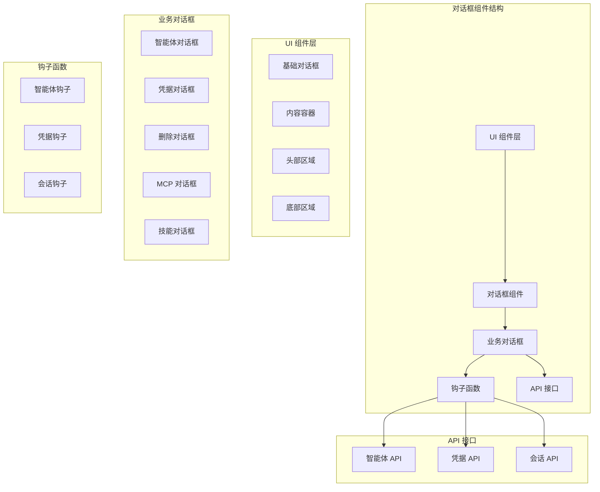

**图表来源**
- [dialog.tsx:1-147](file://examples/web_ui/frontend/src/components/ui/dialog.tsx#L1-L147)
- [AgentDialog.tsx](file://examples/web_ui/frontend/src/components/dialog/AgentDialog.tsx)
- [useAgents.ts](file://examples/web_ui/frontend/src/hooks/useAgents.ts)

**章节来源**
- [dialog.tsx:1-147](file://examples/web_ui/frontend/src/components/ui/dialog.tsx#L1-L147)

## 核心组件

### 基础对话框组件

基础对话框组件提供了完整的对话框功能实现，包括根组件、触发器、门户、覆盖层和内容容器等核心元素。

#### 组件层次结构

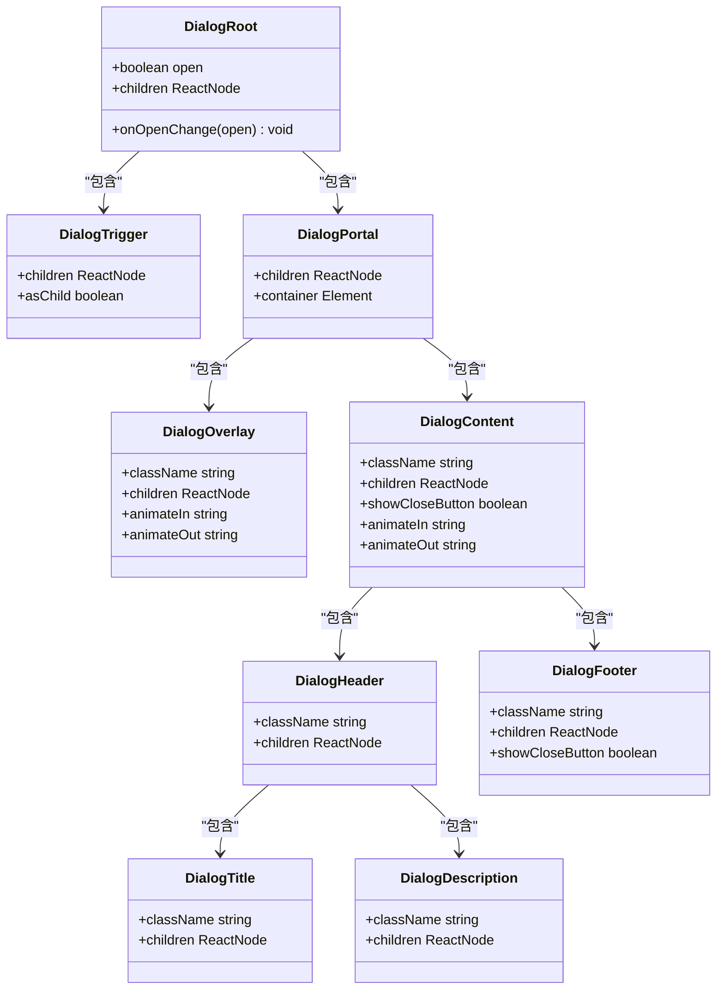

**图表来源**
- [dialog.tsx:8-147](file://examples/web_ui/frontend/src/components/ui/dialog.tsx#L8-L147)

#### 关键特性

1. **响应式设计**: 使用 CSS Grid 和 Flexbox 实现自适应布局
2. **动画系统**: 基于 CSS 动画的淡入淡出和缩放效果
3. **键盘导航**: 支持 Tab 键循环导航和 Escape 键关闭
4. **焦点管理**: 自动管理焦点转移和保持
5. **无障碍支持**: 符合 WCAG 标准的可访问性实现

**章节来源**
- [dialog.tsx:8-147](file://examples/web_ui/frontend/src/components/ui/dialog.tsx#L8-L147)

## 架构概览

### 整体架构设计

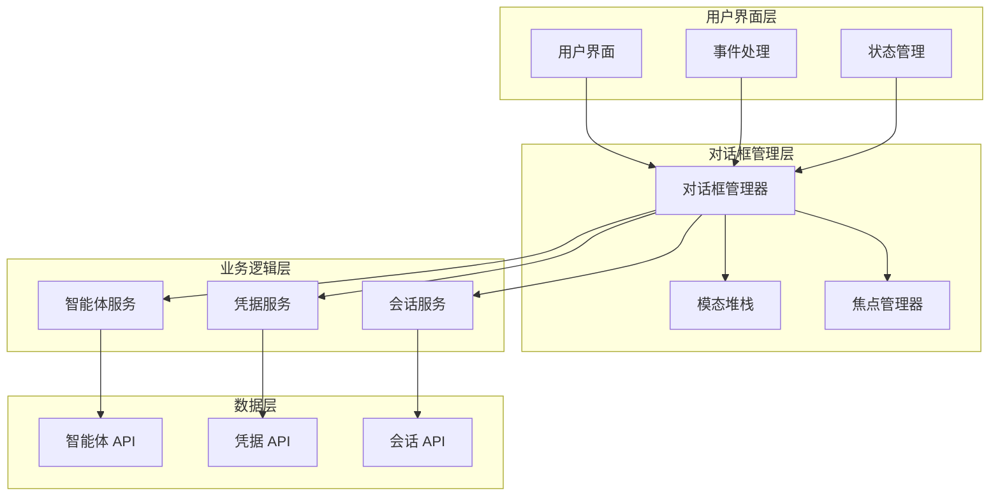

**图表来源**
- [AgentDialog.tsx](file://examples/web_ui/frontend/src/components/dialog/AgentDialog.tsx)
- [useAgents.ts](file://examples/web_ui/frontend/src/hooks/useAgents.ts)
- [agent.ts](file://examples/web_ui/frontend/src/api/agent.ts)

### 数据流架构

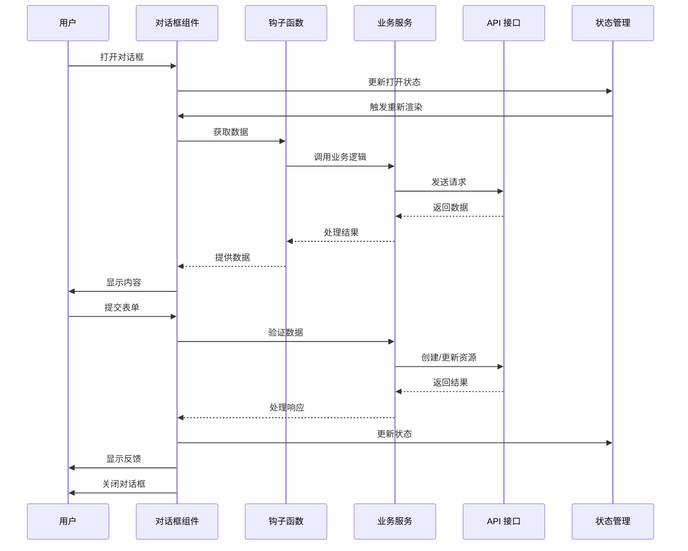

**图表来源**
- [dialog.tsx:40-71](file://examples/web_ui/frontend/src/components/ui/dialog.tsx#L40-L71)
- [useAgents.ts](file://examples/web_ui/frontend/src/hooks/useAgents.ts)
- [agent.ts](file://examples/web_ui/frontend/src/api/agent.ts)

## 详细组件分析

### 智能体管理对话框

智能体管理对话框是 AgentScope 的核心业务对话框之一，提供了完整的智能体生命周期管理功能。

#### 组件结构

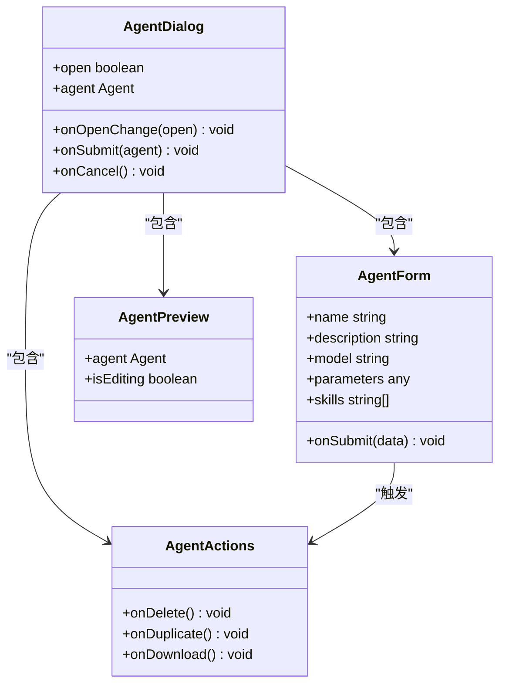

**图表来源**
- [AgentDialog.tsx](file://examples/web_ui/frontend/src/components/dialog/AgentDialog.tsx)
- [EditAgentDialog.tsx](file://examples/web_ui/frontend/src/components/dialog/EditAgentDialog.tsx)

#### 生命周期管理

智能体对话框的生命周期包括以下阶段：

1. **初始化阶段**: 加载现有智能体数据或准备空表单
2. **编辑阶段**: 用户输入和修改智能体配置
3. **验证阶段**: 表单验证和数据完整性检查
4. **提交阶段**: 发送到后端 API 进行处理
5. **完成阶段**: 显示操作结果并关闭对话框

#### 状态管理策略

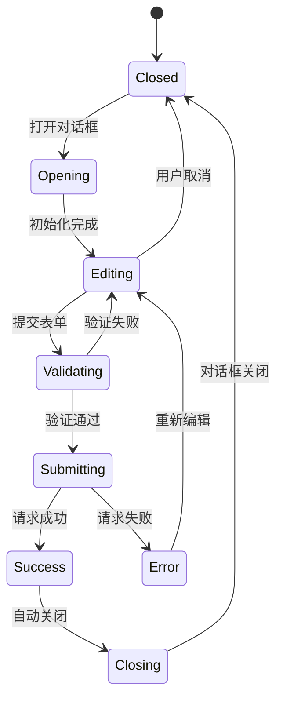

**图表来源**
- [AgentDialog.tsx](file://examples/web_ui/frontend/src/components/dialog/AgentDialog.tsx)

**章节来源**
- [AgentDialog.tsx](file://examples/web_ui/frontend/src/components/dialog/AgentDialog.tsx)
- [EditAgentDialog.tsx](file://examples/web_ui/frontend/src/components/dialog/EditAgentDialog.tsx)

### 凭据创建对话框

凭据创建对话框专门用于管理用户的 API 凭据信息，支持多种服务提供商的认证配置。

#### 数据模型

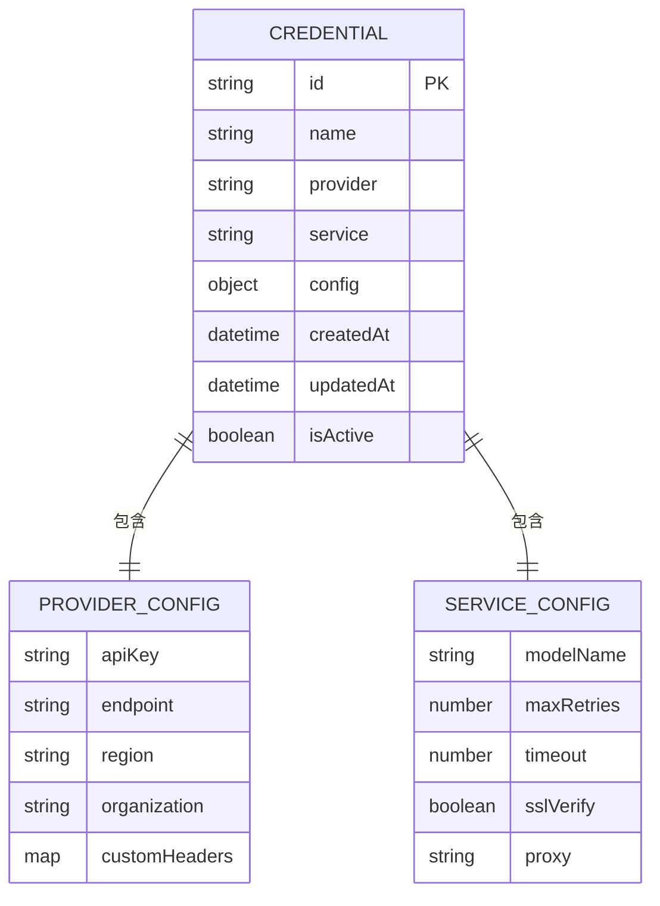

**图表来源**
- [CreateCredentialDialog.tsx](file://examples/web_ui/frontend/src/components/dialog/CreateCredentialDialog.tsx)
- [EditCredentialDialog.tsx](file://examples/web_ui/frontend/src/components/dialog/EditCredentialDialog.tsx)

#### 验证流程

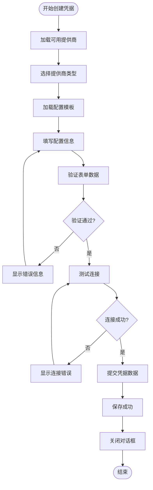

**图表来源**
- [CreateCredentialDialog.tsx](file://examples/web_ui/frontend/src/components/dialog/CreateCredentialDialog.tsx)

**章节来源**
- [CreateCredentialDialog.tsx](file://examples/web_ui/frontend/src/components/dialog/CreateCredentialDialog.tsx)
- [EditCredentialDialog.tsx](file://examples/web_ui/frontend/src/components/dialog/EditCredentialDialog.tsx)

### 确认删除对话框

确认删除对话框提供了安全的删除操作确认机制，防止误删重要数据。

#### 删除流程

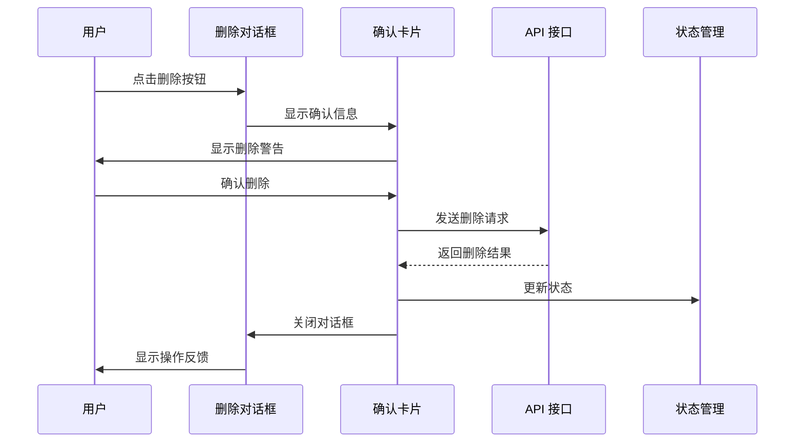

**图表来源**
- [DeleteDialog.tsx](file://examples/web_ui/frontend/src/components/dialog/DeleteDialog.tsx)
- [ConfirmCard.tsx](file://examples/web_ui/frontend/src/components/chat/ConfirmCard.tsx)

#### 安全机制

确认删除对话框实现了多层安全保护：

1. **二次确认**: 弹出独立的确认对话框
2. **文本确认**: 要求用户输入特定文本进行确认
3. **倒计时机制**: 提供有限时间内的撤销机会
4. **操作审计**: 记录所有删除操作的日志

**章节来源**
- [DeleteDialog.tsx](file://examples/web_ui/frontend/src/components/dialog/DeleteDialog.tsx)
- [ConfirmCard.tsx](file://examples/web_ui/frontend/src/components/chat/ConfirmCard.tsx)

### 其他业务对话框

#### MCP 对话框

MCP（Model Context Protocol）对话框用于管理和配置 MCP 服务连接。

#### 重命名会话对话框

重命名会话对话框允许用户修改会话名称，支持实时验证和冲突检测。

#### 添加技能对话框

添加技能对话框提供了向智能体添加新技能的功能，支持技能选择和参数配置。

**章节来源**
- [MCPDialog.tsx](file://examples/web_ui/frontend/src/components/dialog/MCPDialog.tsx)
- [RenameSessionDialog.tsx](file://examples/web_ui/frontend/src/components/dialog/RenameSessionDialog.tsx)
- [AddSkillDialog.tsx](file://examples/web_ui/frontend/src/components/dialog/AddSkillDialog.tsx)

## 依赖关系分析

### 组件依赖图

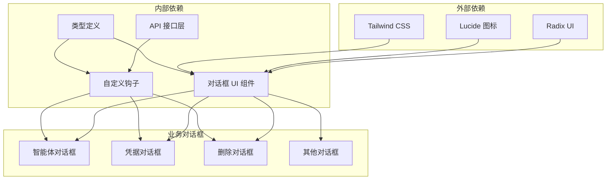

**图表来源**
- [dialog.tsx:1-10](file://examples/web_ui/frontend/src/components/ui/dialog.tsx#L1-L10)

### 数据传递机制

#### 父组件到子组件的数据传递

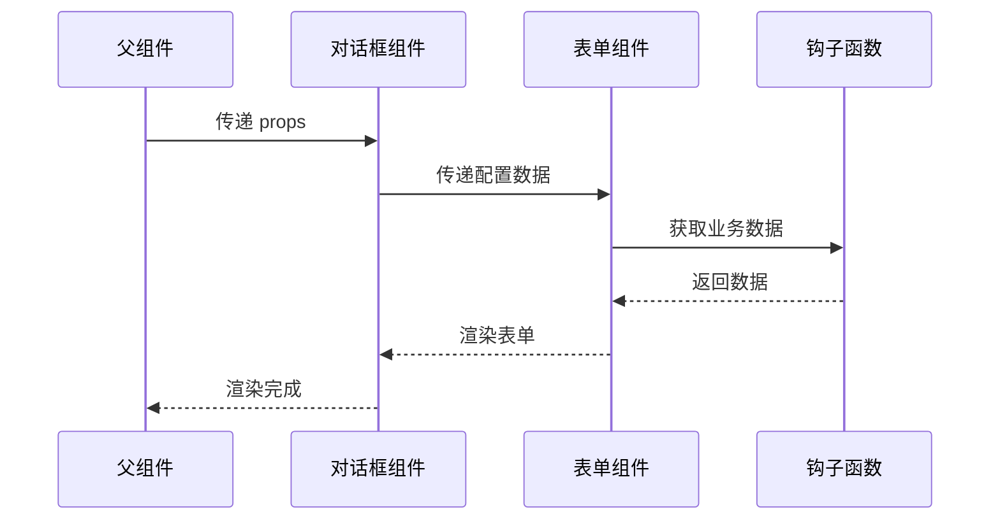

**图表来源**
- [AgentDialog.tsx](file://examples/web_ui/frontend/src/components/dialog/AgentDialog.tsx)
- [useAgents.ts](file://examples/web_ui/frontend/src/hooks/useAgents.ts)

#### 子组件到父组件的结果返回

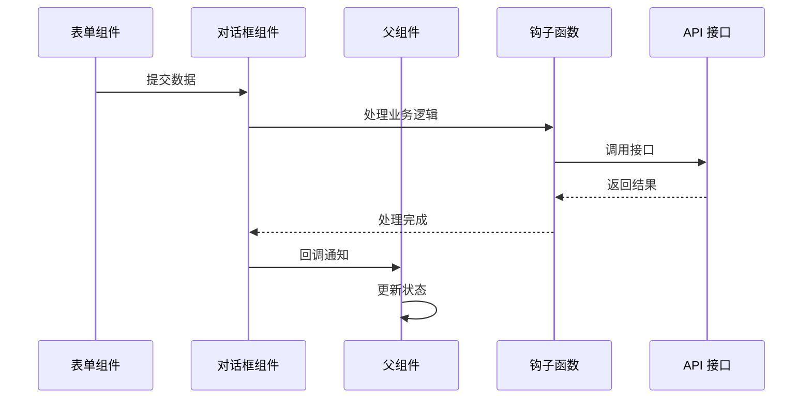

**图表来源**
- [EditAgentDialog.tsx](file://examples/web_ui/frontend/src/components/dialog/EditAgentDialog.tsx)
- [useAgents.ts](file://examples/web_ui/frontend/src/hooks/useAgents.ts)

**章节来源**
- [dialog.tsx:1-147](file://examples/web_ui/frontend/src/components/ui/dialog.tsx#L1-L147)

## 性能考虑

### 渲染优化

1. **条件渲染**: 使用 `React.memo` 优化重复渲染
2. **懒加载**: 对大型表单组件实施懒加载策略
3. **虚拟滚动**: 对长列表数据使用虚拟滚动技术
4. **防抖处理**: 对实时搜索和验证实施防抖机制

### 内存管理

1. **清理机制**: 确保对话框关闭时清理事件监听器
2. **引用释放**: 及时释放不再使用的对象引用
3. **缓存策略**: 合理使用缓存避免重复计算
4. **卸载处理**: 在组件卸载时清理定时器和订阅

### 网络优化

1. **请求合并**: 将多个小请求合并为批量请求
2. **缓存复用**: 利用缓存减少网络请求次数
3. **超时控制**: 设置合理的请求超时和重试机制
4. **错误恢复**: 实现优雅的错误恢复和降级策略

## 故障排除指南

### 常见问题及解决方案

#### 对话框无法打开

**症状**: 点击触发器后对话框不显示

**可能原因**:
1. `open` 状态未正确设置
2. `onOpenChange` 回调未正确实现
3. 父组件状态管理问题

**解决方法**:
1. 检查 `open` 属性绑定
2. 验证 `onOpenChange` 函数实现
3. 确认父组件状态同步

#### 焦点管理问题

**症状**: 键盘导航异常或焦点丢失

**可能原因**:
1. `aria-hidden` 属性设置不当
2. `tabIndex` 属性配置错误
3. 动画过渡影响焦点

**解决方法**:
1. 检查 `aria-hidden` 属性值
2. 验证 `tabIndex` 设置
3. 调整动画持续时间

#### 数据同步问题

**症状**: 表单数据与实际状态不一致

**可能原因**:
1. 受控组件状态管理
2. 异步数据更新延迟
3. 缓存数据过期

**解决方法**:
1. 确保受控组件正确更新
2. 实施数据同步机制
3. 设置合理的缓存失效策略

**章节来源**
- [dialog.tsx:40-71](file://examples/web_ui/frontend/src/components/ui/dialog.tsx#L40-L71)

## 结论

AgentScope 的对话框组件提供了一个完整、灵活且高性能的用户界面解决方案。通过模块化的架构设计和清晰的职责分离，这些组件能够满足各种复杂的业务场景需求。

关键优势包括：
- **高度可定制**: 支持主题定制和样式覆盖
- **类型安全**: 完整的 TypeScript 类型定义
- **可访问性**: 符合无障碍标准的实现
- **性能优化**: 多种优化策略确保流畅体验
- **易于扩展**: 清晰的接口设计便于功能扩展

建议在实际项目中：
1. 根据具体需求选择合适的对话框组件
2. 实施适当的性能优化策略
3. 建立完善的错误处理机制
4. 定期更新和维护组件代码

## 附录

### API 参考

#### 基础对话框 API

| 属性 | 类型 | 默认值 | 描述 |
|------|------|--------|------|
| `open` | `boolean` | `false` | 控制对话框的打开/关闭状态 |
| `onOpenChange` | `(open: boolean) => void` | - | 状态变化回调函数 |
| `children` | `ReactNode` | - | 对话框内容 |
| `className` | `string` | - | 自定义 CSS 类名 |

#### 业务对话框通用属性

| 属性 | 类型 | 默认值 | 描述 |
|------|------|--------|------|
| `onSubmit` | `(data: any) => void` | - | 表单提交回调 |
| `onCancel` | `() => void` | - | 取消操作回调 |
| `loading` | `boolean` | `false` | 加载状态指示 |
| `error` | `string` | - | 错误信息显示 |

### 最佳实践

1. **状态管理**: 使用受控组件模式管理对话框状态
2. **错误处理**: 实施全面的错误捕获和用户反馈
3. **性能优化**: 对大型对话框实施懒加载和虚拟滚动
4. **可访问性**: 确保完整的键盘导航和屏幕阅读器支持
5. **安全性**: 实施必要的输入验证和权限控制
6. **用户体验**: 提供清晰的反馈和进度指示