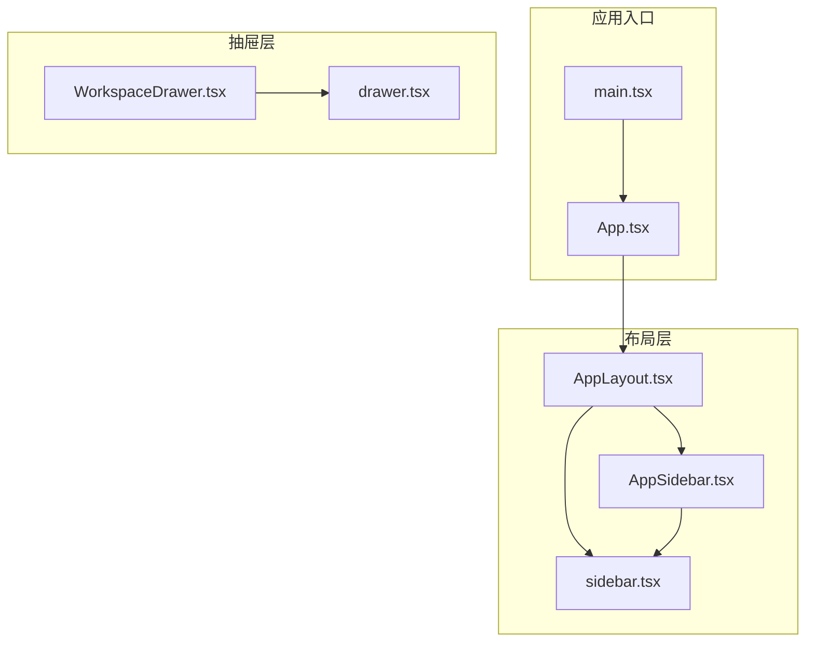
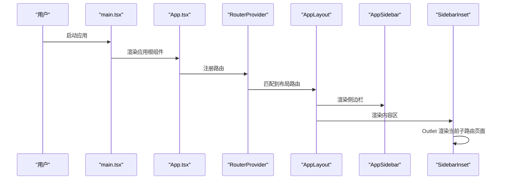
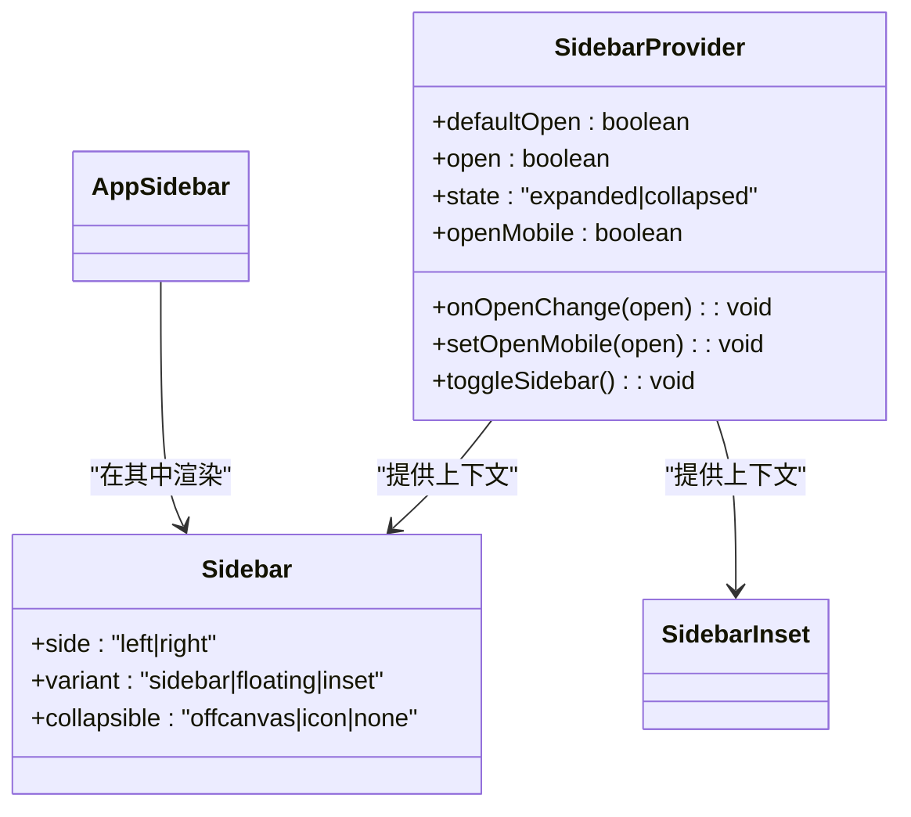
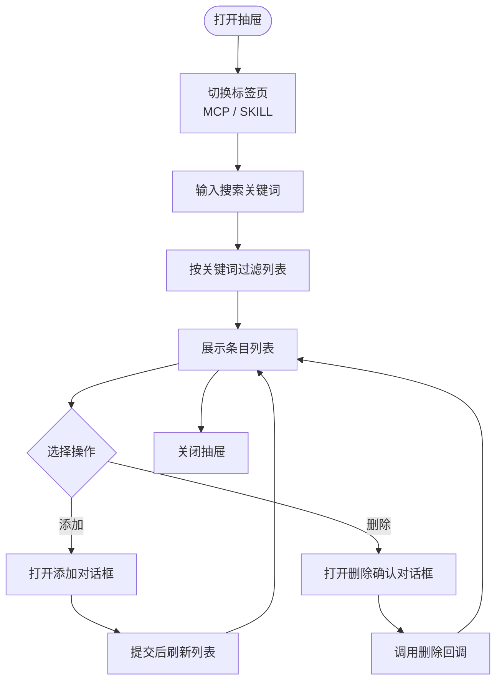
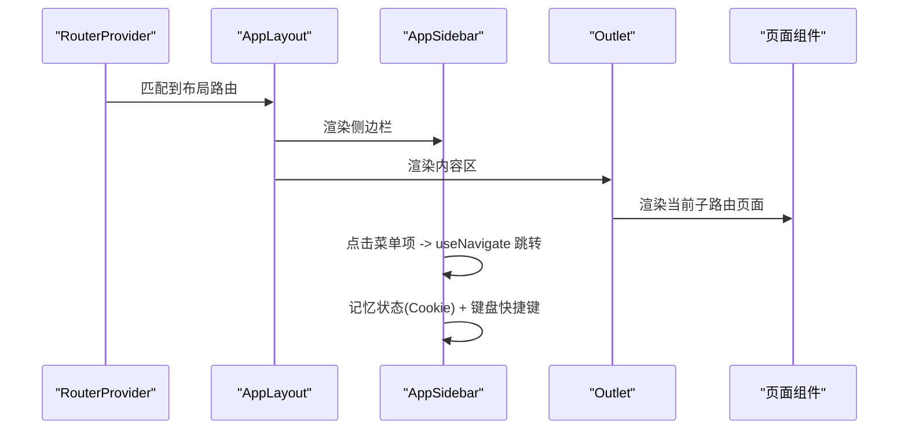
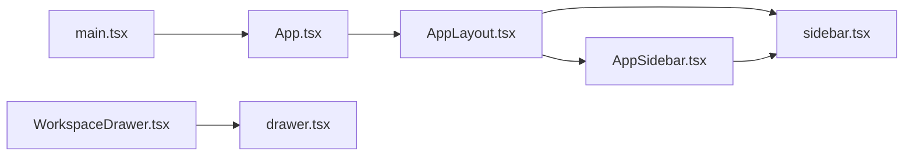

# 布局组件

<cite>
**本文引用的文件**
- [AppLayout.tsx](file://examples/web_ui/frontend/src/components/layout/AppLayout.tsx)
- [AppSidebar.tsx](file://examples/web_ui/frontend/src/components/layout/AppSidebar.tsx)
- [sidebar.tsx](file://examples/web_ui/frontend/src/components/ui/sidebar.tsx)
- [WorkspaceDrawer.tsx](file://examples/web_ui/frontend/src/components/drawer/WorkspaceDrawer.tsx)
- [drawer.tsx](file://examples/web_ui/frontend/src/components/ui/drawer.tsx)
- [App.tsx](file://examples/web_ui/frontend/src/App.tsx)
- [main.tsx](file://examples/web_ui/frontend/src/main.tsx)
</cite>

## 目录
1. [简介](#简介)
2. [项目结构](#项目结构)
3. [核心组件](#核心组件)
4. [架构总览](#架构总览)
5. [组件详解](#组件详解)
6. [依赖关系分析](#依赖关系分析)
7. [性能考量](#性能考量)
8. [故障排查指南](#故障排查指南)
9. [结论](#结论)
10. [附录：完整布局示例与最佳实践](#附录完整布局示例与最佳实践)

## 简介
本文件系统化梳理 AgentScope Web 前端的布局体系，围绕主布局容器、侧边栏导航与抽屉式工作空间三大核心组件，阐述设计理念、实现方式与扩展策略。重点覆盖：
- 响应式设计原则（断点、移动端适配、屏幕尺寸兼容）
- 组件嵌套与层次结构（如何通过布局组件构建复杂页面）
- 配置选项（侧边栏宽度、抽屉方向与显示状态控制）
- 与路由系统的集成与状态管理策略
- 完整示例与最佳实践

## 项目结构
AgentScope 的前端布局位于 examples/web_ui/frontend/src/components 目录下，采用“功能域+原子组件”组织方式：
- 布局层：AppLayout、AppSidebar
- UI 基础层：sidebar.tsx（侧边栏体系）、drawer.tsx（抽屉体系）
- 抽屉工作空间：WorkspaceDrawer
- 应用入口与路由：App.tsx、main.tsx

图表来源
- [main.tsx:1-16](file://examples/web_ui/frontend/src/main.tsx#L1-L16)
- [App.tsx:27-38](file://examples/web_ui/frontend/src/App.tsx#L27-L38)
- [AppLayout.tsx:6-17](file://examples/web_ui/frontend/src/components/layout/AppLayout.tsx#L6-L17)
- [AppSidebar.tsx:21-133](file://examples/web_ui/frontend/src/components/layout/AppSidebar.tsx#L21-L133)
- [sidebar.tsx:144-244](file://examples/web_ui/frontend/src/components/ui/sidebar.tsx#L144-L244)
- [WorkspaceDrawer.tsx:36-229](file://examples/web_ui/frontend/src/components/drawer/WorkspaceDrawer.tsx#L36-L229)
- [drawer.tsx:8-61](file://examples/web_ui/frontend/src/components/ui/drawer.tsx#L8-L61)

章节来源
- [main.tsx:1-16](file://examples/web_ui/frontend/src/main.tsx#L1-L16)
- [App.tsx:27-38](file://examples/web_ui/frontend/src/App.tsx#L27-L38)

## 核心组件
- 主布局容器 AppLayout：提供根级布局骨架，承载侧边栏与内容区，使用 react-router 的 Outlet 渲染当前路由页面。
- 侧边栏 AppSidebar：基于 UI 体系组件实现导航菜单、语言切换、引导向导触发与设置入口。
- 侧边栏 UI 体系 sidebar.tsx：提供 SidebarProvider/Sidebar/SidebarInset 等能力，支持桌面端展开/折叠、移动端抽屉、键盘快捷键、Cookie 记忆状态等。
- 抽屉工作空间 WorkspaceDrawer：右侧抽屉，用于 MCP 与技能的增删查改、搜索与标签页切换。
- 抽屉 UI 体系 drawer.tsx：基于 vaul 实现抽屉动画与交互，支持上下左右四个方向。

章节来源
- [AppLayout.tsx:6-17](file://examples/web_ui/frontend/src/components/layout/AppLayout.tsx#L6-L17)
- [AppSidebar.tsx:21-133](file://examples/web_ui/frontend/src/components/layout/AppSidebar.tsx#L21-L133)
- [sidebar.tsx:51-142](file://examples/web_ui/frontend/src/components/ui/sidebar.tsx#L51-L142)
- [WorkspaceDrawer.tsx:36-229](file://examples/web_ui/frontend/src/components/drawer/WorkspaceDrawer.tsx#L36-L229)
- [drawer.tsx:8-61](file://examples/web_ui/frontend/src/components/ui/drawer.tsx#L8-L61)

## 架构总览
整体采用“布局容器 + 导航侧栏 + 内容区 + 抽屉”的分层架构，配合路由系统实现页面切换与状态持久化。

图表来源
- [main.tsx:9-15](file://examples/web_ui/frontend/src/main.tsx#L9-L15)
- [App.tsx:27-38](file://examples/web_ui/frontend/src/App.tsx#L27-L38)
- [AppLayout.tsx:6-17](file://examples/web_ui/frontend/src/components/layout/AppLayout.tsx#L6-L17)

## 组件详解

### 主布局容器 AppLayout
- 职责：提供全屏布局骨架，包裹 SidebarProvider，左侧渲染 AppSidebar，右侧通过 SidebarInset 承载 Outlet。
- 关键点：
  - 使用 flex 布局保证高度占满视窗。
  - SidebarProvider 提供上下文状态，供侧边栏组件共享。
  - SidebarInset 作为内容区容器，配合 SidebarInset 样式类实现自适应。

章节来源
- [AppLayout.tsx:6-17](file://examples/web_ui/frontend/src/components/layout/AppLayout.tsx#L6-L17)

### 侧边栏导航 AppSidebar
- 职责：提供顶部 Logo 区域、中部导航菜单（聊天、日程、凭证）与底部操作区（语言切换、引导向导、设置）。
- 关键点：
  - 基于 UI 体系组件构建 Header/Content/Footer 三段式结构。
  - 使用 useLocation 与 useNavigate 实现路由跳转与激活态高亮。
  - 支持国际化切换与引导向导触发逻辑。
  - 侧边栏宽度由 SidebarProvider 注入的 CSS 变量控制。

章节来源
- [AppSidebar.tsx:21-133](file://examples/web_ui/frontend/src/components/layout/AppSidebar.tsx#L21-L133)

### 侧边栏 UI 体系 sidebar.tsx
- 设计理念：以 Provider/Context 模式统一管理展开/折叠、移动端抽屉、键盘快捷键与 Cookie 状态记忆。
- 关键配置与行为：
  - 默认变量：桌面端宽度、移动端宽度、图标模式宽度、键盘快捷键。
  - 状态管理：内部状态与外部受控状态双轨；支持 Cookie 记忆。
  - 响应式：移动端使用 Sheet 抽屉，桌面端使用固定侧边栏；支持右侧侧边栏。
  - 结构化组件：SidebarProvider、Sidebar、SidebarInset、SidebarTrigger、SidebarRail、各组块与菜单组件。
- 与 AppSidebar 的协作：AppSidebar 在 SidebarProvider 上下文中渲染，使用 SidebarHeader/SidebarContent/SidebarFooter 等子组件组织内容。

图表来源
- [sidebar.tsx:51-142](file://examples/web_ui/frontend/src/components/ui/sidebar.tsx#L51-L142)
- [sidebar.tsx:144-244](file://examples/web_ui/frontend/src/components/ui/sidebar.tsx#L144-L244)
- [AppSidebar.tsx:21-133](file://examples/web_ui/frontend/src/components/layout/AppSidebar.tsx#L21-L133)

章节来源
- [sidebar.tsx:23-28](file://examples/web_ui/frontend/src/components/ui/sidebar.tsx#L23-L28)
- [sidebar.tsx:51-142](file://examples/web_ui/frontend/src/components/ui/sidebar.tsx#L51-L142)
- [sidebar.tsx:144-244](file://examples/web_ui/frontend/src/components/ui/sidebar.tsx#L144-L244)

### 抽屉式工作空间 WorkspaceDrawer
- 职责：右侧抽屉容器，承载 MCP 与技能两类资源的列表、搜索、增删与标签页切换。
- 关键点：
  - 方向：通过 direction="right" 固定为右侧抽屉。
  - 数据流：接收 mcps/skills 列表与加载状态，暴露添加/删除回调。
  - 交互：Tabs 控制 MCP 与 SKILL 两个面板；支持搜索过滤；删除确认对话框。
  - 与 UI 体系：基于 Drawer/DrawerContent/DrawerHeader/Footer 等组件封装。

图表来源
- [WorkspaceDrawer.tsx:36-229](file://examples/web_ui/frontend/src/components/drawer/WorkspaceDrawer.tsx#L36-L229)

章节来源
- [WorkspaceDrawer.tsx:36-229](file://examples/web_ui/frontend/src/components/drawer/WorkspaceDrawer.tsx#L36-L229)
- [drawer.tsx:8-61](file://examples/web_ui/frontend/src/components/ui/drawer.tsx#L8-L61)

### 与路由系统的集成与状态管理
- 路由注册：App.tsx 中通过 createBrowserRouter 定义布局路由与页面路由，布局路由包裹 AppLayout，子路由渲染具体页面。
- 状态管理：
  - 侧边栏状态：SidebarProvider 使用 Cookie 记忆展开/折叠状态，支持键盘快捷键切换。
  - 页面状态：Outlet 渲染当前路由页面，页面内可使用 hooks 管理自身状态。
  - 引导向导：OnbordaProvider 提供 Tour 能力，AppSidebar 中触发 Tour。

图表来源
- [App.tsx:27-38](file://examples/web_ui/frontend/src/App.tsx#L27-L38)
- [AppLayout.tsx:6-17](file://examples/web_ui/frontend/src/components/layout/AppLayout.tsx#L6-L17)
- [AppSidebar.tsx:21-133](file://examples/web_ui/frontend/src/components/layout/AppSidebar.tsx#L21-L133)
- [sidebar.tsx:51-142](file://examples/web_ui/frontend/src/components/ui/sidebar.tsx#L51-L142)

章节来源
- [App.tsx:27-38](file://examples/web_ui/frontend/src/App.tsx#L27-L38)
- [sidebar.tsx:51-142](file://examples/web_ui/frontend/src/components/ui/sidebar.tsx#L51-L142)

## 依赖关系分析
- 组件耦合：
  - AppLayout 依赖 SidebarProvider 与 SidebarInset，不直接依赖具体页面组件。
  - AppSidebar 依赖 UI 体系的 Sidebar* 子组件，并与路由钩子协作。
  - WorkspaceDrawer 依赖 UI 体系的 Drawer* 子组件，并与对话框组件协作。
- 外部依赖：
  - 路由：react-router-dom
  - UI：Tailwind 类名 + Radix UI 组合
  - 动画：vaul（抽屉）
  - 引导：onborda
  - 通知：sonner

图表来源
- [App.tsx:27-38](file://examples/web_ui/frontend/src/App.tsx#L27-L38)
- [AppLayout.tsx:6-17](file://examples/web_ui/frontend/src/components/layout/AppLayout.tsx#L6-L17)
- [AppSidebar.tsx:21-133](file://examples/web_ui/frontend/src/components/layout/AppSidebar.tsx#L21-L133)
- [sidebar.tsx:144-244](file://examples/web_ui/frontend/src/components/ui/sidebar.tsx#L144-L244)
- [WorkspaceDrawer.tsx:36-229](file://examples/web_ui/frontend/src/components/drawer/WorkspaceDrawer.tsx#L36-L229)
- [drawer.tsx:8-61](file://examples/web_ui/frontend/src/components/ui/drawer.tsx#L8-L61)
- [main.tsx:9-15](file://examples/web_ui/frontend/src/main.tsx#L9-L15)

章节来源
- [App.tsx:27-38](file://examples/web_ui/frontend/src/App.tsx#L27-L38)
- [sidebar.tsx:144-244](file://examples/web_ui/frontend/src/components/ui/sidebar.tsx#L144-L244)
- [drawer.tsx:8-61](file://examples/web_ui/frontend/src/components/ui/drawer.tsx#L8-L61)

## 性能考量
- 渲染开销控制：
  - 侧边栏菜单项使用 Tooltip，在非折叠与非移动端时才显示，减少不必要的 DOM。
  - 抽屉内容区使用滚动容器与标签页切换，避免一次性渲染过多节点。
- 状态持久化：
  - 侧边栏状态通过 Cookie 记忆，减少重复计算与布局抖动。
- 路由懒加载：
  - 页面组件按需加载，结合 Outlet 渲染当前路由页面，降低初始包体。

## 故障排查指南
- 侧边栏不显示或无法折叠：
  - 检查是否包裹在 SidebarProvider 下。
  - 检查 collapsible 属性与设备类型（移动端使用 Sheet，桌面端使用固定侧边栏）。
- 侧边栏宽度异常：
  - 确认 CSS 变量 --sidebar-width 与 --sidebar-width-icon 是否被正确注入。
- 抽屉无法打开或样式错乱：
  - 检查 direction 与 DrawerContent 的样式类是否匹配。
  - 确认 vaul 的 Portal/Overlay 是否正确挂载。
- 路由跳转无效：
  - 检查 App.tsx 中路由定义与 AppLayout 的包裹关系。
  - 确认 useNavigate 的路径与路由表一致。

章节来源
- [sidebar.tsx:144-244](file://examples/web_ui/frontend/src/components/ui/sidebar.tsx#L144-L244)
- [drawer.tsx:40-61](file://examples/web_ui/frontend/src/components/ui/drawer.tsx#L40-L61)
- [App.tsx:27-38](file://examples/web_ui/frontend/src/App.tsx#L27-L38)

## 结论
AgentScope 的布局体系以“布局容器 + 侧边栏 + 内容区 + 抽屉”为核心，结合路由与状态管理，实现了清晰的层次结构与良好的响应式体验。通过 SidebarProvider 的上下文能力与 Cookie 记忆机制，确保了跨页面的一致性与可用性；WorkspaceDrawer 则提供了面向工作空间的交互范式，便于扩展更多资源管理场景。

## 附录：完整布局示例与最佳实践
- 示例一：基础布局
  - 步骤：在 App.tsx 中定义布局路由，AppLayout 包裹 AppSidebar 与 SidebarInset，SidebarInset 内部使用 Outlet 渲染子路由页面。
  - 适用：仪表盘、列表页、详情页等通用布局。
- 示例二：右侧抽屉工作空间
  - 步骤：在需要的页面中引入 WorkspaceDrawer，传入 mcps/skills 列表与回调，使用 Tabs 切换 MCP 与 SKILL 面板。
  - 适用：资源管理、工具箱、技能库等。
- 最佳实践：
  - 将导航逻辑集中在 AppSidebar，避免在页面中重复处理路由跳转。
  - 使用 SidebarProvider 的受控模式（open/onOpenChange）在复杂场景中精确控制侧边栏状态。
  - 对于移动端，优先使用 Sheet 抽屉；对于桌面端，根据业务需要选择 offcanvas 或 icon 模式。
  - 抽屉内容尽量拆分为可复用的 UI 组件，保持 WorkspaceDrawer 的职责单一。

章节来源
- [App.tsx:27-38](file://examples/web_ui/frontend/src/App.tsx#L27-L38)
- [AppLayout.tsx:6-17](file://examples/web_ui/frontend/src/components/layout/AppLayout.tsx#L6-L17)
- [AppSidebar.tsx:21-133](file://examples/web_ui/frontend/src/components/layout/AppSidebar.tsx#L21-L133)
- [WorkspaceDrawer.tsx:36-229](file://examples/web_ui/frontend/src/components/drawer/WorkspaceDrawer.tsx#L36-L229)