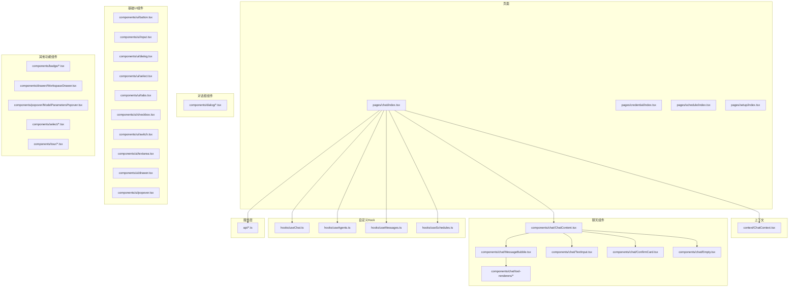
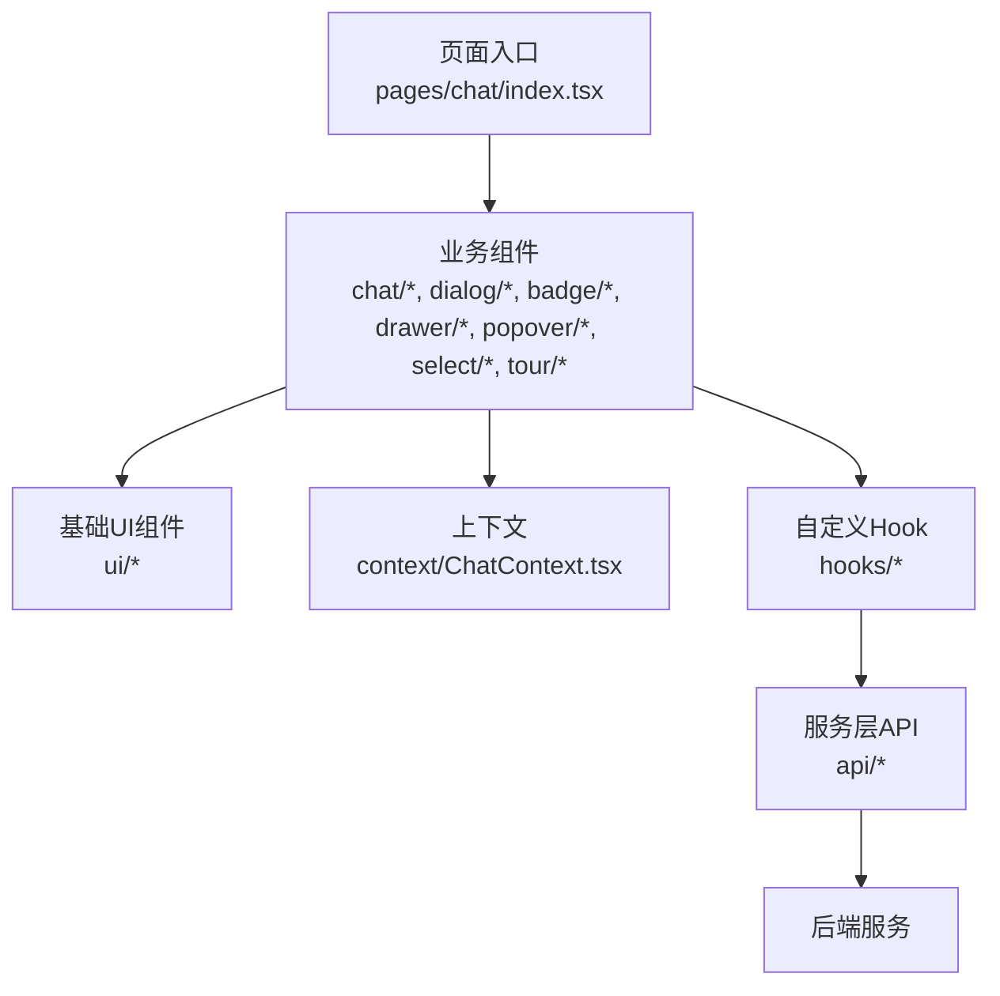
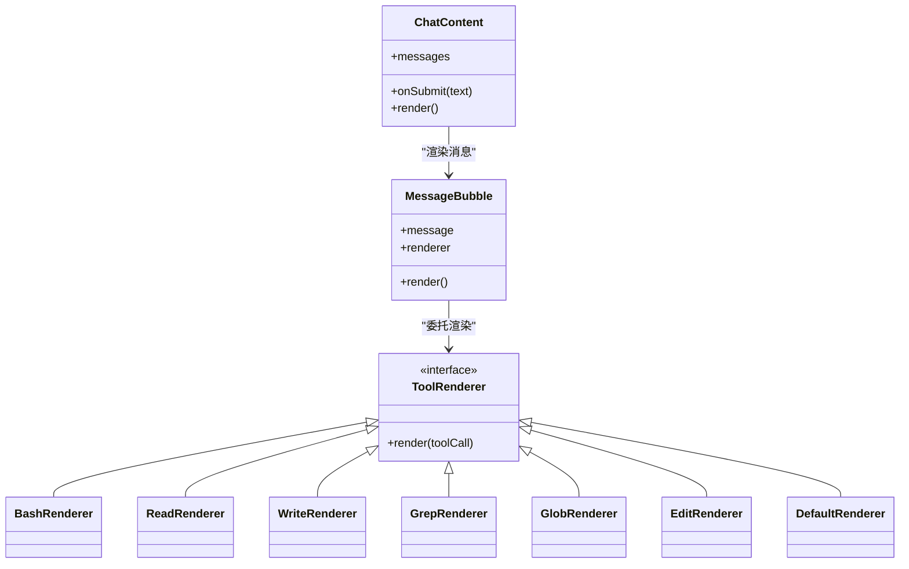
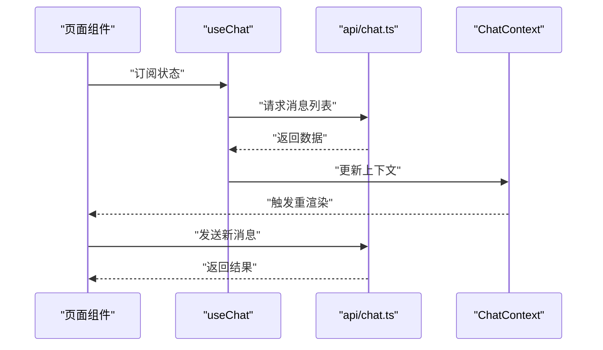
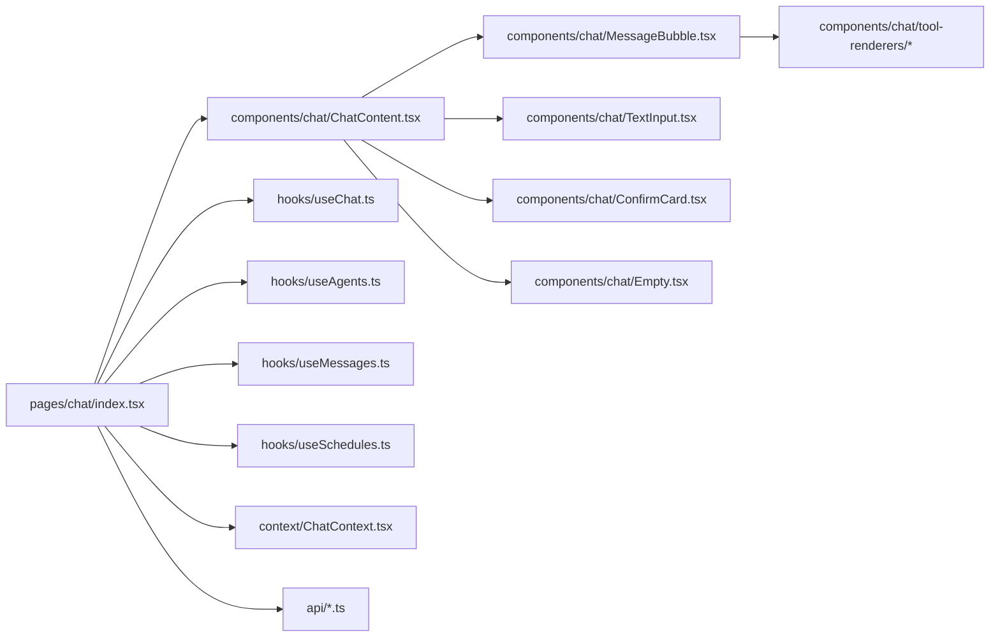

# 组件系统

<cite>
**本文引用的文件**
- [App.tsx](file://examples/web_ui/frontend/src/App.tsx)
- [index.tsx](file://examples/web_ui/frontend/src/pages/chat/index.tsx)
- [ChatContent.tsx](file://examples/web_ui/frontend/src/components/chat/ChatContent.tsx)
- [MessageBubble.tsx](file://examples/web_ui/frontend/src/components/chat/MessageBubble.tsx)
- [TextInput.tsx](file://examples/web_ui/frontend/src/components/chat/TextInput.tsx)
- [ConfirmCard.tsx](file://examples/web_ui/frontend/src/components/chat/ConfirmCard.tsx)
- [Empty.tsx](file://examples/web_ui/frontend/src/components/chat/Empty.tsx)
- [BashRenderer.tsx](file://examples/web_ui/frontend/src/components/chat/tool-renderers/BashRenderer.tsx)
- [DefaultRenderer.tsx](file://examples/web_ui/frontend/src/components/chat/tool-renderers/DefaultRenderer.tsx)
- [EditRenderer.tsx](file://examples/web_ui/frontend/src/components/chat/tool-renderers/EditRenderer.tsx)
- [GlobRenderer.tsx](file://examples/web_ui/frontend/src/components/chat/tool-renderers/GlobRenderer.tsx)
- [GrepRenderer.tsx](file://examples/web_ui/frontend/src/components/chat/tool-renderers/GrepRenderer.tsx)
- [ReadRenderer.tsx](file://examples/web_ui/frontend/src/components/chat/tool-renderers/ReadRenderer.tsx)
- [WriteRenderer.tsx](file://examples/web_ui/frontend/src/components/chat/tool-renderers/WriteRenderer.tsx)
- [_shared.tsx](file://examples/web_ui/frontend/src/components/chat/tool-renderers/_shared.tsx)
- [InputTypeBadges.tsx](file://examples/web_ui/frontend/src/components/badge/InputTypeBadges.tsx)
- [StatusBadge.tsx](file://examples/web_ui/frontend/src/components/badge/StatusBadge.tsx)
- [AgentDialog.tsx](file://examples/web_ui/frontend/src/components/dialog/AgentDialog.tsx)
- [DeleteAgentDialog.tsx](file://examples/web_ui/frontend/src/components/dialog/DeleteAgentDialog.tsx)
- [CreateCredentialDialog.tsx](file://examples/web_ui/frontend/src/components/dialog/CreateCredentialDialog.tsx)
- [MCPDialog.tsx](file://examples/web_ui/frontend/src/components/dialog/MCPDialog.tsx)
- [RenameSessionDialog.tsx](file://examples/web_ui/frontend/src/components/dialog/RenameSessionDialog.tsx)
- [AddSkillDialog.tsx](file://examples/web_ui/frontend/src/components/dialog/AddSkillDialog.tsx)
- [EditCredentialDialog.tsx](file://examples/web_ui/frontend/src/components/dialog/EditCredentialDialog.tsx)
- [WorkspaceDrawer.tsx](file://examples/web_ui/frontend/src/components/drawer/WorkspaceDrawer.tsx)
- [ModelParametersPopover.tsx](file://examples/web_ui/frontend/src/components/popover/ModelParametersPopover.tsx)
- [LlmSelect.tsx](file://examples/web_ui/frontend/src/components/select/LlmSelect.tsx)
- [PermissionModeSelect.tsx](file://examples/web_ui/frontend/src/components/select/PermissionModeSelect.tsx)
- [TimezoneSelect.tsx](file://examples/web_ui/frontend/src/components/select/TimezoneSelect.tsx)
- [ChatTourController.tsx](file://examples/web_ui/frontend/src/components/tour/ChatTourController.tsx)
- [TourCard.tsx](file://examples/web_ui/frontend/src/components/tour/TourCard.tsx)
- [chatTourSteps.ts](file://examples/web_ui/frontend/src/components/tour/chatTourSteps.ts)
- [button.tsx](file://examples/web_ui/frontend/src/components/ui/button.tsx)
- [input.tsx](file://examples/web_ui/frontend/src/components/ui/input.tsx)
- [textarea.tsx](file://examples/web_ui/frontend/src/components/ui/textarea.tsx)
- [dialog.tsx](file://examples/web_ui/frontend/src/components/ui/dialog.tsx)
- [drawer.tsx](file://examples/web_ui/frontend/src/components/ui/drawer.tsx)
- [select.tsx](file://examples/web_ui/frontend/src/components/ui/select.tsx)
- [checkbox.tsx](file://examples/web_ui/frontend/src/components/ui/checkbox.tsx)
- [switch.tsx](file://examples/web_ui/frontend/src/components/ui/switch.tsx)
- [tabs.tsx](file://examples/web_ui/frontend/src/components/ui/tabs.tsx)
- [tooltip.tsx](file://examples/web_ui/frontend/src/components/ui/tooltip.tsx)
- [popover.tsx](file://examples/web_ui/frontend/src/components/ui/popover.tsx)
- [dropdown-menu.tsx](file://examples/web_ui/frontend/src/components/ui/dropdown-menu.tsx)
- [alert.tsx](file://examples/web_ui/frontend/src/components/ui/alert.tsx)
- [badge.tsx](file://examples/web_ui/frontend/src/components/ui/badge.tsx)
- [card.tsx](file://examples/web_ui/frontend/src/components/ui/card.tsx)
- [separator.tsx](file://examples/web_ui/frontend/src/components/ui/separator.tsx)
- [sidebar.tsx](file://examples/web_ui/frontend/src/components/ui/sidebar.tsx)
- [sheet.tsx](file://examples/web_ui/frontend/src/components/ui/sheet.tsx)
- [field.tsx](file://examples/web_ui/frontend/src/components/ui/field.tsx)
- [label.tsx](file://examples/web_ui/frontend/src/components/ui/label.tsx)
- [kbd.tsx](file://examples/web_ui/frontend/src/components/ui/kbd.tsx)
- [spinner.tsx](file://examples/web_ui/frontend/src/components/ui/spinner.tsx)
- [empty.tsx](file://examples/web_ui/frontend/src/components/ui/empty.tsx)
- [collapsible.tsx](file://examples/web_ui/frontend/src/components/ui/collapsible.tsx)
- [calendar.tsx](file://examples/web_ui/frontend/src/components/ui/calendar.tsx)
- [button-group.tsx](file://examples/web_ui/frontend/src/components/ui/button-group.tsx)
- [input-group.tsx](file://examples/web_ui/frontend/src/components/ui/input-group.tsx)
- [item.tsx](file://examples/web_ui/frontend/src/components/ui/item.tsx)
- [sonner.tsx](file://examples/web_ui/frontend/src/components/ui/sonner.tsx)
- [skeleton.tsx](file://examples/web_ui/frontend/src/components/ui/skeleton.tsx)
- [useChat.ts](file://examples/web_ui/frontend/src/hooks/useChat.ts)
- [useAgents.ts](file://examples/web_ui/frontend/src/hooks/useAgents.ts)
- [useMessages.ts](file://examples/web_ui/frontend/src/hooks/useMessages.ts)
- [useSchedules.ts](file://examples/web_ui/frontend/src/hooks/useSchedules.ts)
- [useSessions.ts](file://examples/web_ui/frontend/src/hooks/useSessions.ts)
- [useSkills.ts](file://examples/web_ui/frontend/src/hooks/useSkills.ts)
- [useModels.ts](file://examples/web_ui/frontend/src/hooks/useModels.ts)
- [useCredentials.ts](file://examples/web_ui/frontend/src/hooks/useCredentials.ts)
- [useMobile.ts](file://examples/web_ui/frontend/src/hooks/use-mobile.ts)
- [useAgentSchema.ts](file://examples/web_ui/frontend/src/hooks/useAgentSchema.ts)
- [useWorkspace.ts](file://examples/web_ui/frontend/src/hooks/useWorkspace.ts)
- [ChatContext.tsx](file://examples/web_ui/frontend/src/context/ChatContext.tsx)
- [index.ts](file://examples/web_ui/frontend/src/api/types.ts)
- [client.ts](file://examples/web_ui/frontend/src/api/client.ts)
- [agent.ts](file://examples/web_ui/frontend/src/api/agent.ts)
- [chat.ts](file://examples/web_ui/frontend/src/api/chat.ts)
- [credential.ts](file://examples/web_ui/frontend/src/api/credential.ts)
- [model.ts](file://examples/web_ui/frontend/src/api/model.ts)
- [schedule.ts](file://examples/web_ui/frontend/src/api/schedule.ts)
- [session.ts](file://examples/web_ui/frontend/src/api/session.ts)
- [workspace.ts](file://examples/web_ui/frontend/src/api/workspace.ts)
- [package.json](file://examples/web_ui/frontend/package.json)
- [vite.config.ts](file://examples/web_ui/frontend/vite.config.ts)
- [index.css](file://examples/web_ui/frontend/src/index.css)
- [main.tsx](file://examples/web_ui/frontend/src/main.tsx)
</cite>

## 目录
1. [简介](#简介)
2. [项目结构](#项目结构)
3. [核心组件](#核心组件)
4. [架构总览](#架构总览)
5. [详细组件分析](#详细组件分析)
6. [依赖关系分析](#依赖关系分析)
7. [性能考量](#性能考量)
8. [故障排查指南](#故障排查指南)
9. [结论](#结论)
10. [附录](#附录)

## 简介
本文件系统性梳理 AgentScope 前端组件体系，聚焦于自定义 UI 组件库的设计理念与实现方式，覆盖基础 UI 组件（按钮、输入框、对话框等）与业务组件（聊天气泡、工具渲染器等），并深入解析组件设计规范（Props 接口、事件处理、样式系统）、复用策略（高阶组件、Hook 封装、组合模式）、组件间通信机制（父子、兄弟、跨层级），以及完整的组件 API 参考与使用示例及最佳实践。

## 项目结构
前端位于 examples/web_ui/frontend，采用 React + TypeScript 构建，通过 Vite 进行开发与打包。组件按功能域划分：ui 基础组件、chat 聊天相关、dialog 对话框、badge 徽章、drawer 抽屉、popover 浮层、select 选择器、tour 引导、hooks 自定义 Hook、context 上下文、api 服务层、pages 页面入口等。

图表来源
- [index.tsx:1-200](file://examples/web_ui/frontend/src/pages/chat/index.tsx#L1-L200)
- [ChatContent.tsx:1-200](file://examples/web_ui/frontend/src/components/chat/ChatContent.tsx#L1-L200)
- [MessageBubble.tsx:1-200](file://examples/web_ui/frontend/src/components/chat/MessageBubble.tsx#L1-L200)
- [TextInput.tsx:1-200](file://examples/web_ui/frontend/src/components/chat/TextInput.tsx#L1-L200)
- [ConfirmCard.tsx:1-200](file://examples/web_ui/frontend/src/components/chat/ConfirmCard.tsx#L1-L200)
- [Empty.tsx:1-200](file://examples/web_ui/frontend/src/components/chat/Empty.tsx#L1-L200)
- [button.tsx:1-200](file://examples/web_ui/frontend/src/components/ui/button.tsx#L1-L200)
- [input.tsx:1-200](file://examples/web_ui/frontend/src/components/ui/input.tsx#L1-L200)
- [dialog.tsx:1-200](file://examples/web_ui/frontend/src/components/ui/dialog.tsx#L1-L200)
- [select.tsx:1-200](file://examples/web_ui/frontend/src/components/ui/select.tsx#L1-L200)
- [checkbox.tsx:1-200](file://examples/web_ui/frontend/src/components/ui/checkbox.tsx#L1-L200)
- [switch.tsx:1-200](file://examples/web_ui/frontend/src/components/ui/switch.tsx#L1-L200)
- [textarea.tsx:1-200](file://examples/web_ui/frontend/src/components/ui/textarea.tsx#L1-L200)
- [drawer.tsx:1-200](file://examples/web_ui/frontend/src/components/ui/drawer.tsx#L1-L200)
- [popover.tsx:1-200](file://examples/web_ui/frontend/src/components/ui/popover.tsx#L1-L200)
- [useChat.ts:1-200](file://examples/web_ui/frontend/src/hooks/useChat.ts#L1-L200)
- [useAgents.ts:1-200](file://examples/web_ui/frontend/src/hooks/useAgents.ts#L1-L200)
- [useMessages.ts:1-200](file://examples/web_ui/frontend/src/hooks/useMessages.ts#L1-L200)
- [useSchedules.ts:1-200](file://examples/web_ui/frontend/src/hooks/useSchedules.ts#L1-L200)
- [ChatContext.tsx:1-200](file://examples/web_ui/frontend/src/context/ChatContext.tsx#L1-L200)
- [client.ts:1-200](file://examples/web_ui/frontend/src/api/client.ts#L1-L200)
- [agent.ts:1-200](file://examples/web_ui/frontend/src/api/agent.ts#L1-L200)
- [chat.ts:1-200](file://examples/web_ui/frontend/src/api/chat.ts#L1-L200)
- [credential.ts:1-200](file://examples/web_ui/frontend/src/api/credential.ts#L1-L200)
- [model.ts:1-200](file://examples/web_ui/frontend/src/api/model.ts#L1-L200)
- [schedule.ts:1-200](file://examples/web_ui/frontend/src/api/schedule.ts#L1-L200)
- [session.ts:1-200](file://examples/web_ui/frontend/src/api/session.ts#L1-L200)
- [workspace.ts:1-200](file://examples/web_ui/frontend/src/api/workspace.ts#L1-L200)

章节来源
- [package.json:1-200](file://examples/web_ui/frontend/package.json#L1-L200)
- [vite.config.ts:1-200](file://examples/web_ui/frontend/vite.config.ts#L1-L200)
- [index.css:1-200](file://examples/web_ui/frontend/src/index.css#L1-L200)
- [main.tsx:1-200](file://examples/web_ui/frontend/src/main.tsx#L1-L200)

## 核心组件
本节概述组件库的核心构成与职责边界：
- 基础 UI 组件：提供通用交互与视觉元素，如按钮、输入框、对话框、选择器、标签页、开关、提示等，统一风格与可访问性。
- 业务组件：面向具体业务场景，如聊天气泡、消息输入、工具渲染器、徽章、抽屉、引导等。
- 自定义 Hook：封装状态逻辑与副作用，提升组件复用性与可测试性。
- 服务层 API：封装后端接口调用，统一错误处理与数据转换。
- 上下文：在组件树中传递共享状态，支持跨层级通信。

章节来源
- [button.tsx:1-200](file://examples/web_ui/frontend/src/components/ui/button.tsx#L1-L200)
- [input.tsx:1-200](file://examples/web_ui/frontend/src/components/ui/input.tsx#L1-L200)
- [dialog.tsx:1-200](file://examples/web_ui/frontend/src/components/ui/dialog.tsx#L1-L200)
- [select.tsx:1-200](file://examples/web_ui/frontend/src/components/ui/select.tsx#L1-L200)
- [tabs.tsx:1-200](file://examples/web_ui/frontend/src/components/ui/tabs.tsx#L1-L200)
- [checkbox.tsx:1-200](file://examples/web_ui/frontend/src/components/ui/checkbox.tsx#L1-L200)
- [switch.tsx:1-200](file://examples/web_ui/frontend/src/components/ui/switch.tsx#L1-L200)
- [textarea.tsx:1-200](file://examples/web_ui/frontend/src/components/ui/textarea.tsx#L1-L200)
- [drawer.tsx:1-200](file://examples/web_ui/frontend/src/components/ui/drawer.tsx#L1-L200)
- [popover.tsx:1-200](file://examples/web_ui/frontend/src/components/ui/popover.tsx#L1-L200)
- [useChat.ts:1-200](file://examples/web_ui/frontend/src/hooks/useChat.ts#L1-L200)
- [useAgents.ts:1-200](file://examples/web_ui/frontend/src/hooks/useAgents.ts#L1-L200)
- [useMessages.ts:1-200](file://examples/web_ui/frontend/src/hooks/useMessages.ts#L1-L200)
- [useSchedules.ts:1-200](file://examples/web_ui/frontend/src/hooks/useSchedules.ts#L1-L200)
- [client.ts:1-200](file://examples/web_ui/frontend/src/api/client.ts#L1-L200)

## 架构总览
组件系统采用“页面 → 业务组件 → 基础UI组件”的分层架构，结合自定义 Hook 与上下文实现状态管理与跨层级通信；服务层负责与后端交互，统一错误处理与响应格式。

图表来源
- [index.tsx:1-200](file://examples/web_ui/frontend/src/pages/chat/index.tsx#L1-L200)
- [ChatContent.tsx:1-200](file://examples/web_ui/frontend/src/components/chat/ChatContent.tsx#L1-L200)
- [ChatContext.tsx:1-200](file://examples/web_ui/frontend/src/context/ChatContext.tsx#L1-L200)
- [useChat.ts:1-200](file://examples/web_ui/frontend/src/hooks/useChat.ts#L1-L200)
- [client.ts:1-200](file://examples/web_ui/frontend/src/api/client.ts#L1-L200)

## 详细组件分析

### 基础UI组件设计规范
- Props 接口定义：所有组件均以 TypeScript 接口定义 Props，确保类型安全与 IDE 提示。例如按钮组件的 Props 包含尺寸、状态、点击回调等字段；输入框组件包含值、变更回调、占位符、禁用态等。
- 事件处理机制：统一通过 onXxx 回调暴露事件，避免直接操作 DOM；支持受控与非受控两种模式。
- 样式系统：采用 Tailwind CSS 与原子化样式，结合主题变量与暗色模式适配，保证一致性与可维护性。

章节来源
- [button.tsx:1-200](file://examples/web_ui/frontend/src/components/ui/button.tsx#L1-L200)
- [input.tsx:1-200](file://examples/web_ui/frontend/src/components/ui/input.tsx#L1-L200)
- [dialog.tsx:1-200](file://examples/web_ui/frontend/src/components/ui/dialog.tsx#L1-L200)
- [select.tsx:1-200](file://examples/web_ui/frontend/src/components/ui/select.tsx#L1-L200)
- [textarea.tsx:1-200](file://examples/web_ui/frontend/src/components/ui/textarea.tsx#L1-L200)
- [checkbox.tsx:1-200](file://examples/web_ui/frontend/src/components/ui/checkbox.tsx#L1-L200)
- [switch.tsx:1-200](file://examples/web_ui/frontend/src/components/ui/switch.tsx#L1-L200)
- [tabs.tsx:1-200](file://examples/web_ui/frontend/src/components/ui/tabs.tsx#L1-L200)
- [popover.tsx:1-200](file://examples/web_ui/frontend/src/components/ui/popover.tsx#L1-L200)
- [drawer.tsx:1-200](file://examples/web_ui/frontend/src/components/ui/drawer.tsx#L1-L200)

### 聊天组件体系
- 聊天内容容器：承载消息列表、输入区域与确认卡片，负责消息渲染与用户输入处理。
- 消息气泡：根据消息类型（文本、工具调用、工具结果）渲染不同样式与交互。
- 工具渲染器：针对不同工具类型（如 Bash、Read、Write、Grep、Glob、Edit）提供专用渲染逻辑与交互。
- 输入与确认：提供多行输入与确认卡片，支持快捷键与自动补全。
- 空状态：在无消息或加载时展示占位内容。

图表来源
- [ChatContent.tsx:1-200](file://examples/web_ui/frontend/src/components/chat/ChatContent.tsx#L1-L200)
- [MessageBubble.tsx:1-200](file://examples/web_ui/frontend/src/components/chat/MessageBubble.tsx#L1-L200)
- [BashRenderer.tsx:1-200](file://examples/web_ui/frontend/src/components/chat/tool-renderers/BashRenderer.tsx#L1-L200)
- [ReadRenderer.tsx:1-200](file://examples/web_ui/frontend/src/components/chat/tool-renderers/ReadRenderer.tsx#L1-L200)
- [WriteRenderer.tsx:1-200](file://examples/web_ui/frontend/src/components/chat/tool-renderers/WriteRenderer.tsx#L1-L200)
- [GrepRenderer.tsx:1-200](file://examples/web_ui/frontend/src/components/chat/tool-renderers/GrepRenderer.tsx#L1-L200)
- [GlobRenderer.tsx:1-200](file://examples/web_ui/frontend/src/components/chat/tool-renderers/GlobRenderer.tsx#L1-L200)
- [EditRenderer.tsx:1-200](file://examples/web_ui/frontend/src/components/chat/tool-renderers/EditRenderer.tsx#L1-L200)
- [DefaultRenderer.tsx:1-200](file://examples/web_ui/frontend/src/components/chat/tool-renderers/DefaultRenderer.tsx#L1-L200)

章节来源
- [ChatContent.tsx:1-200](file://examples/web_ui/frontend/src/components/chat/ChatContent.tsx#L1-L200)
- [MessageBubble.tsx:1-200](file://examples/web_ui/frontend/src/components/chat/MessageBubble.tsx#L1-L200)
- [TextInput.tsx:1-200](file://examples/web_ui/frontend/src/components/chat/TextInput.tsx#L1-L200)
- [ConfirmCard.tsx:1-200](file://examples/web_ui/frontend/src/components/chat/ConfirmCard.tsx#L1-L200)
- [Empty.tsx:1-200](file://examples/web_ui/frontend/src/components/chat/Empty.tsx#L1-L200)
- [BashRenderer.tsx:1-200](file://examples/web_ui/frontend/src/components/chat/tool-renderers/BashRenderer.tsx#L1-L200)
- [DefaultRenderer.tsx:1-200](file://examples/web_ui/frontend/src/components/chat/tool-renderers/DefaultRenderer.tsx#L1-L200)
- [EditRenderer.tsx:1-200](file://examples/web_ui/frontend/src/components/chat/tool-renderers/EditRenderer.tsx#L1-L200)
- [GlobRenderer.tsx:1-200](file://examples/web_ui/frontend/src/components/chat/tool-renderers/GlobRenderer.tsx#L1-L200)
- [GrepRenderer.tsx:1-200](file://examples/web_ui/frontend/src/components/chat/tool-renderers/GrepRenderer.tsx#L1-L200)
- [ReadRenderer.tsx:1-200](file://examples/web_ui/frontend/src/components/chat/tool-renderers/ReadRenderer.tsx#L1-L200)
- [WriteRenderer.tsx:1-200](file://examples/web_ui/frontend/src/components/chat/tool-renderers/WriteRenderer.tsx#L1-L200)
- [_shared.tsx:1-200](file://examples/web_ui/frontend/src/components/chat/tool-renderers/_shared.tsx#L1-L200)

### 对话框与表单组件
- 对话框：用于创建、编辑、删除等操作确认与表单提交，支持键盘交互与回退处理。
- 表单：基于 Schema 的动态表单渲染，支持字段校验与联动。
- 选择器：针对模型、权限模式、时区等进行选择，提供搜索与分组能力。
- 抽屉与浮层：用于侧边栏、参数面板、引导等场景。

章节来源
- [AgentDialog.tsx:1-200](file://examples/web_ui/frontend/src/components/dialog/AgentDialog.tsx#L1-L200)
- [DeleteAgentDialog.tsx:1-200](file://examples/web_ui/frontend/src/components/dialog/DeleteAgentDialog.tsx#L1-L200)
- [CreateCredentialDialog.tsx:1-200](file://examples/web_ui/frontend/src/components/dialog/CreateCredentialDialog.tsx#L1-L200)
- [MCPDialog.tsx:1-200](file://examples/web_ui/frontend/src/components/dialog/MCPDialog.tsx#L1-L200)
- [RenameSessionDialog.tsx:1-200](file://examples/web_ui/frontend/src/components/dialog/RenameSessionDialog.tsx#L1-L200)
- [AddSkillDialog.tsx:1-200](file://examples/web_ui/frontend/src/components/dialog/AddSkillDialog.tsx#L1-L200)
- [EditCredentialDialog.tsx:1-200](file://examples/web_ui/frontend/src/components/dialog/EditCredentialDialog.tsx#L1-L200)
- [WorkspaceDrawer.tsx:1-200](file://examples/web_ui/frontend/src/components/drawer/WorkspaceDrawer.tsx#L1-L200)
- [ModelParametersPopover.tsx:1-200](file://examples/web_ui/frontend/src/components/popover/ModelParametersPopover.tsx#L1-L200)
- [LlmSelect.tsx:1-200](file://examples/web_ui/frontend/src/components/select/LlmSelect.tsx#L1-L200)
- [PermissionModeSelect.tsx:1-200](file://examples/web_ui/frontend/src/components/select/PermissionModeSelect.tsx#L1-L200)
- [TimezoneSelect.tsx:1-200](file://examples/web_ui/frontend/src/components/select/TimezoneSelect.tsx#L1-L200)

### 自定义Hook与组合模式
- 状态封装：useChat、useAgents、useMessages、useSchedules、useSessions、useSkills、useModels、useCredentials、useWorkspace 等，统一数据获取、缓存与刷新策略。
- 设备检测：useMobile 提供移动端适配逻辑。
- 组合模式：多个 Hook 可在页面组件中组合使用，形成复杂业务逻辑，同时保持组件职责单一。

图表来源
- [index.tsx:1-200](file://examples/web_ui/frontend/src/pages/chat/index.tsx#L1-L200)
- [useChat.ts:1-200](file://examples/web_ui/frontend/src/hooks/useChat.ts#L1-L200)
- [chat.ts:1-200](file://examples/web_ui/frontend/src/api/chat.ts#L1-L200)
- [ChatContext.tsx:1-200](file://examples/web_ui/frontend/src/context/ChatContext.tsx#L1-L200)

章节来源
- [useChat.ts:1-200](file://examples/web_ui/frontend/src/hooks/useChat.ts#L1-L200)
- [useAgents.ts:1-200](file://examples/web_ui/frontend/src/hooks/useAgents.ts#L1-L200)
- [useMessages.ts:1-200](file://examples/web_ui/frontend/src/hooks/useMessages.ts#L1-L200)
- [useSchedules.ts:1-200](file://examples/web_ui/frontend/src/hooks/useSchedules.ts#L1-L200)
- [useSessions.ts:1-200](file://examples/web_ui/frontend/src/hooks/useSessions.ts#L1-L200)
- [useSkills.ts:1-200](file://examples/web_ui/frontend/src/hooks/useSkills.ts#L1-L200)
- [useModels.ts:1-200](file://examples/web_ui/frontend/src/hooks/useModels.ts#L1-L200)
- [useCredentials.ts:1-200](file://examples/web_ui/frontend/src/hooks/useCredentials.ts#L1-L200)
- [useWorkspace.ts:1-200](file://examples/web_ui/frontend/src/hooks/useWorkspace.ts#L1-L200)
- [useMobile.ts:1-200](file://examples/web_ui/frontend/src/hooks/use-mobile.ts#L1-L200)
- [useAgentSchema.ts:1-200](file://examples/web_ui/frontend/src/hooks/useAgentSchema.ts#L1-L200)

### 组件间通信机制
- 父子组件通信：通过 Props 向子组件传递数据与回调，子组件通过回调向上游传递事件。
- 兄弟组件通信：通过共同父组件的回调与状态协调，或通过上下文共享状态。
- 跨层级通信：通过上下文 ChatContext 在任意层级传递共享状态与方法，减少 props 打洞。

章节来源
- [ChatContext.tsx:1-200](file://examples/web_ui/frontend/src/context/ChatContext.tsx#L1-L200)
- [index.tsx:1-200](file://examples/web_ui/frontend/src/pages/chat/index.tsx#L1-L200)

### 组件API参考（示例）
以下为部分组件的API要点（以路径代替具体代码）：
- Button（按钮）
  - 属性：size、variant、disabled、onClick、className 等
  - 事件：onClick
  - 插槽：children
  - 参考路径：[button.tsx:1-200](file://examples/web_ui/frontend/src/components/ui/button.tsx#L1-L200)
- Input（输入框）
  - 属性：value、onChange、placeholder、disabled、type、className
  - 事件：onChange
  - 插槽：无
  - 参考路径：[input.tsx:1-200](file://examples/web_ui/frontend/src/components/ui/input.tsx#L1-L200)
- Dialog（对话框）
  - 属性：open、onOpenChange、title、description、children
  - 事件：onOpenChange
  - 插槽：title、description、children
  - 参考路径：[dialog.tsx:1-200](file://examples/web_ui/frontend/src/components/ui/dialog.tsx#L1-L200)
- Select（选择器）
  - 属性：value、onValueChange、children、placeholder
  - 事件：onValueChange
  - 插槽：children
  - 参考路径：[select.tsx:1-200](file://examples/web_ui/frontend/src/components/ui/select.tsx#L1-L200)
- Tabs（标签页）
  - 属性：value、onValueChange、children
  - 事件：onValueChange
  - 插槽：children
  - 参考路径：[tabs.tsx:1-200](file://examples/web_ui/frontend/src/components/ui/tabs.tsx#L1-L200)
- Checkbox（复选框）
  - 属性：checked、onCheckedChange、disabled
  - 事件：onCheckedChange
  - 插槽：无
  - 参考路径：[checkbox.tsx:1-200](file://examples/web_ui/frontend/src/components/ui/checkbox.tsx#L1-L200)
- Switch（开关）
  - 属性：checked、onCheckedChange、disabled
  - 事件：onCheckedChange
  - 插槽：无
  - 参考路径：[switch.tsx:1-200](file://examples/web_ui/frontend/src/components/ui/switch.tsx#L1-L200)
- Textarea（多行输入）
  - 属性：value、onChange、placeholder、disabled
  - 事件：onChange
  - 插槽：无
  - 参考路径：[textarea.tsx:1-200](file://examples/web_ui/frontend/src/components/ui/textarea.tsx#L1-L200)
- Drawer（抽屉）
  - 属性：open、onOpenChange、children
  - 事件：onOpenChange
  - 插槽：children
  - 参考路径：[drawer.tsx:1-200](file://examples/web_ui/frontend/src/components/ui/drawer.tsx#L1-L200)
- Popover（浮层）
  - 属性：open、onOpenChange、children
  - 事件：onOpenChange
  - 插槽：children
  - 参考路径：[popover.tsx:1-200](file://examples/web_ui/frontend/src/components/ui/popover.tsx#L1-L200)
- ChatContent（聊天内容）
  - 属性：messages、onSubmit、confirmConfig
  - 事件：onSubmit
  - 插槽：无
  - 参考路径：[ChatContent.tsx:1-200](file://examples/web_ui/frontend/src/components/chat/ChatContent.tsx#L1-L200)
- MessageBubble（消息气泡）
  - 属性：message、renderer
  - 事件：无
  - 插槽：无
  - 参考路径：[MessageBubble.tsx:1-200](file://examples/web_ui/frontend/src/components/chat/MessageBubble.tsx#L1-L200)
- ToolRenderer（工具渲染器）
  - 属性：toolCall、onExecute、onCancel
  - 事件：onExecute、onCancel
  - 插槽：无
  - 参考路径：[BashRenderer.tsx:1-200](file://examples/web_ui/frontend/src/components/chat/tool-renderers/BashRenderer.tsx#L1-L200)

### 使用示例与最佳实践
- 使用基础UI组件时，优先选择语义化 props 与一致的尺寸/变体，避免直接内联样式。
- 在聊天场景中，通过 ChatContext 与 useChat Hook 管理消息状态，避免重复请求。
- 工具渲染器应遵循统一的输入输出约定，提供清晰的执行与取消流程。
- 对话框与表单组件建议配合表单验证与错误提示，提升用户体验。
- 移动端适配可通过 useMobile Hook 切换布局与交互方式。

## 依赖关系分析
组件系统依赖关系如下：

图表来源
- [index.tsx:1-200](file://examples/web_ui/frontend/src/pages/chat/index.tsx#L1-L200)
- [ChatContent.tsx:1-200](file://examples/web_ui/frontend/src/components/chat/ChatContent.tsx#L1-L200)
- [MessageBubble.tsx:1-200](file://examples/web_ui/frontend/src/components/chat/MessageBubble.tsx#L1-L200)
- [TextInput.tsx:1-200](file://examples/web_ui/frontend/src/components/chat/TextInput.tsx#L1-L200)
- [ConfirmCard.tsx:1-200](file://examples/web_ui/frontend/src/components/chat/ConfirmCard.tsx#L1-L200)
- [Empty.tsx:1-200](file://examples/web_ui/frontend/src/components/chat/Empty.tsx#L1-L200)
- [useChat.ts:1-200](file://examples/web_ui/frontend/src/hooks/useChat.ts#L1-L200)
- [useAgents.ts:1-200](file://examples/web_ui/frontend/src/hooks/useAgents.ts#L1-L200)
- [useMessages.ts:1-200](file://examples/web_ui/frontend/src/hooks/useMessages.ts#L1-L200)
- [useSchedules.ts:1-200](file://examples/web_ui/frontend/src/hooks/useSchedules.ts#L1-L200)
- [ChatContext.tsx:1-200](file://examples/web_ui/frontend/src/context/ChatContext.tsx#L1-L200)
- [client.ts:1-200](file://examples/web_ui/frontend/src/api/client.ts#L1-L200)

章节来源
- [package.json:1-200](file://examples/web_ui/frontend/package.json#L1-L200)
- [vite.config.ts:1-200](file://examples/web_ui/frontend/vite.config.ts#L1-L200)

## 性能考量
- 组件懒加载：对重型工具渲染器与对话框组件采用按需加载，减少首屏体积。
- 状态最小化：通过 ChatContext 与自定义 Hook 将状态收敛到必要范围，避免全局风暴。
- 渲染优化：消息列表使用虚拟滚动与稳定 key，降低重排与重绘成本。
- 缓存策略：对模型、会话、技能等静态数据进行本地缓存，减少重复请求。
- 图标与资源：使用 SVG 图标与压缩后的静态资源，控制网络开销。

## 故障排查指南
- 对话框无法关闭：检查 open/onOpenChange 是否正确绑定，确认回调链路是否被拦截。
- 消息不显示：核对 useMessages 与 ChatContext 的数据同步，检查消息类型与渲染器映射。
- 工具执行失败：查看工具渲染器的输入参数与 onExecute 回调，确认后端接口可用性与权限配置。
- 表单校验异常：检查 Schema 表单字段与校验规则，确保 onChange 与受控值一致。
- 移动端布局错乱：确认 useMobile 返回值与媒体查询断点，检查容器宽度与滚动行为。

章节来源
- [dialog.tsx:1-200](file://examples/web_ui/frontend/src/components/ui/dialog.tsx#L1-L200)
- [useMessages.ts:1-200](file://examples/web_ui/frontend/src/hooks/useMessages.ts#L1-L200)
- [ChatContext.tsx:1-200](file://examples/web_ui/frontend/src/context/ChatContext.tsx#L1-L200)
- [BashRenderer.tsx:1-200](file://examples/web_ui/frontend/src/components/chat/tool-renderers/BashRenderer.tsx#L1-L200)
- [client.ts:1-200](file://examples/web_ui/frontend/src/api/client.ts#L1-L200)

## 结论
AgentScope 前端组件系统以清晰的分层架构、统一的类型约束与事件机制、完善的 Hook 与上下文体系，实现了高复用、易扩展、可维护的 UI 组件库。通过工具渲染器与业务组件的解耦设计，系统能够灵活适配多样化的聊天与工作流场景；通过服务层与状态管理的抽象，提升了开发效率与运行稳定性。

## 附录
- 开发与构建：使用 Vite 进行开发与打包，Tailwind CSS 提供样式基础，ESLint/Prettier 规范代码风格。
- 国际化：提供英文与中文语言包，支持切换与动态加载。
- 部署：生产环境通过静态资源部署，后端接口通过代理转发。

章节来源
- [vite.config.ts:1-200](file://examples/web_ui/frontend/vite.config.ts#L1-L200)
- [index.css:1-200](file://examples/web_ui/frontend/src/index.css#L1-L200)
- [main.tsx:1-200](file://examples/web_ui/frontend/src/main.tsx#L1-L200)