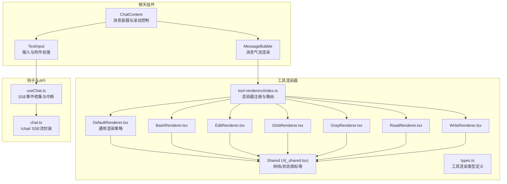
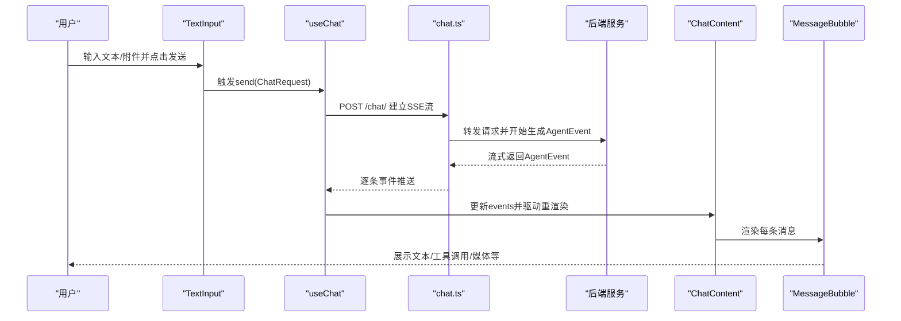
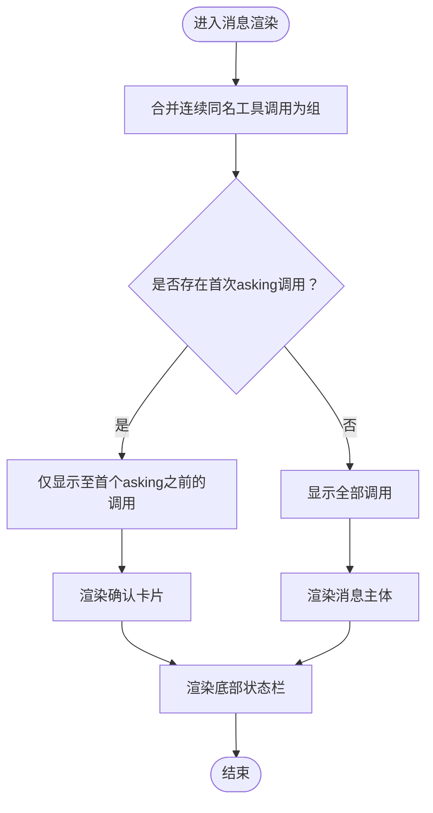
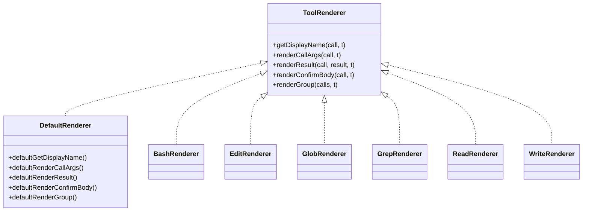
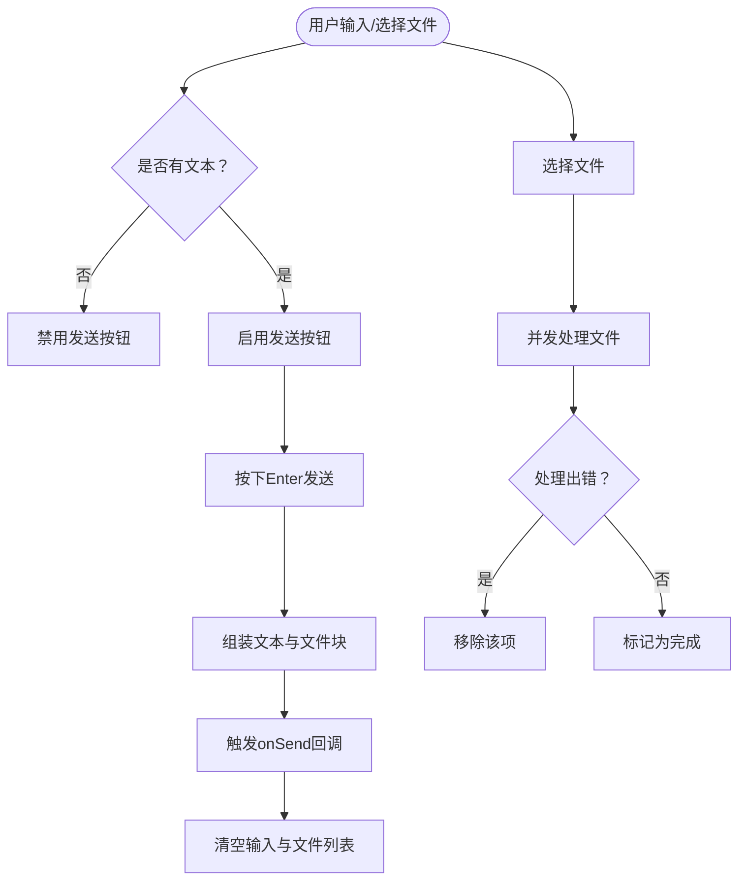
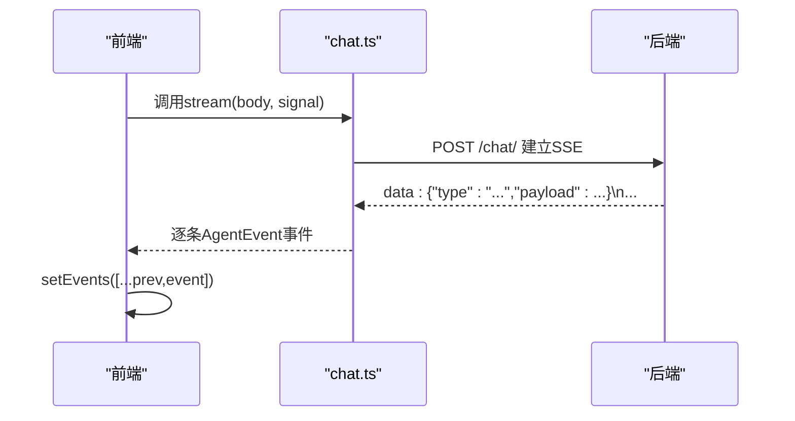
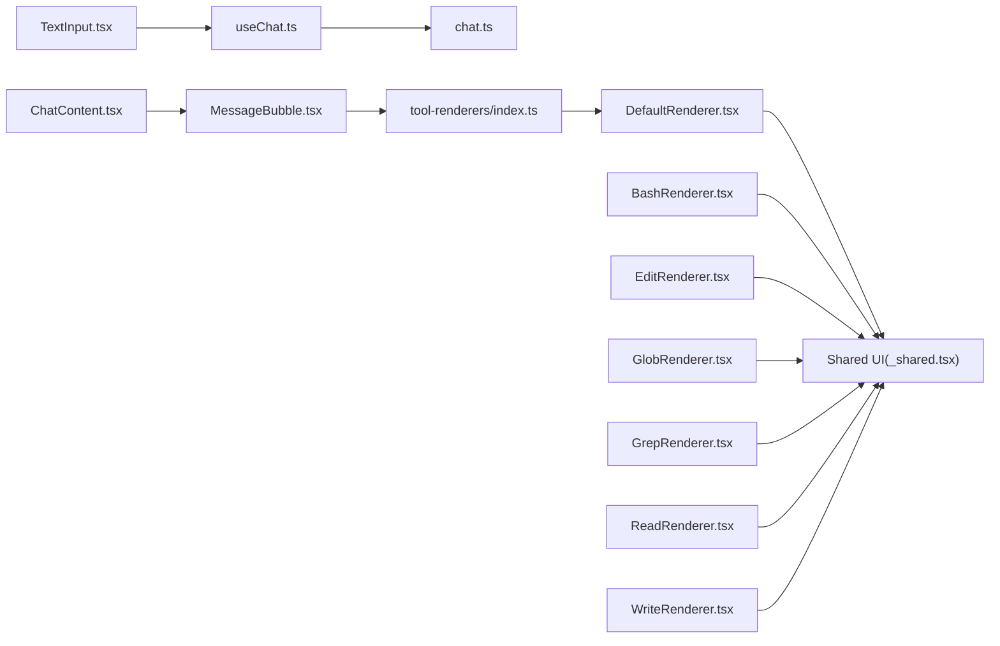

# 聊天组件

<cite>
**本文引用的文件**
- [ChatContent.tsx](file://examples/web_ui/frontend/src/components/chat/ChatContent.tsx)
- [MessageBubble.tsx](file://examples/web_ui/frontend/src/components/chat/MessageBubble.tsx)
- [TextInput.tsx](file://examples/web_ui/frontend/src/components/chat/TextInput.tsx)
- [tool-renderers/index.ts](file://examples/web_ui/frontend/src/components/chat/tool-renderers/index.ts)
- [DefaultRenderer.tsx](file://examples/web_ui/frontend/src/components/chat/tool-renderers/DefaultRenderer.tsx)
- [_shared.tsx](file://examples/web_ui/frontend/src/components/chat/tool-renderers/_shared.tsx)
- [types.ts](file://examples/web_ui/frontend/src/components/chat/tool-renderers/types.ts)
- [BashRenderer.tsx](file://examples/web_ui/frontend/src/components/chat/tool-renderers/BashRenderer.tsx)
- [EditRenderer.tsx](file://examples/web_ui/frontend/src/components/chat/tool-renderers/EditRenderer.tsx)
- [GlobRenderer.tsx](file://examples/web_ui/frontend/src/components/chat/tool-renderers/GlobRenderer.tsx)
- [GrepRenderer.tsx](file://examples/web_ui/frontend/src/components/chat/tool-renderers/GrepRenderer.tsx)
- [ReadRenderer.tsx](file://examples/web_ui/frontend/src/components/chat/tool-renderers/ReadRenderer.tsx)
- [WriteRenderer.tsx](file://examples/web_ui/frontend/src/components/chat/tool-renderers/WriteRenderer.tsx)
- [useChat.ts](file://examples/web_ui/frontend/src/hooks/useChat.ts)
- [chat.ts](file://examples/web_ui/frontend/src/api/chat.ts)
- [ChatContext.tsx](file://examples/web_ui/frontend/src/context/ChatContext.tsx)
</cite>

## 目录
1. [简介](#简介)
2. [项目结构](#项目结构)
3. [核心组件](#核心组件)
4. [架构总览](#架构总览)
5. [详细组件分析](#详细组件分析)
6. [依赖关系分析](#依赖关系分析)
7. [性能考量](#性能考量)
8. [故障排查指南](#故障排查指南)
9. [结论](#结论)
10. [附录：完整聊天示例与API协议](#附录完整聊天示例与api协议)

## 简介
本文件面向AgentScope Web前端聊天组件，系统性说明消息内容展示、聊天气泡渲染、输入组件以及工具渲染器体系的设计与实现。重点覆盖：
- 消息渲染机制：文本、思考（thinking）、数据（图像/音频/视频）与工具调用消息的差异化呈现策略
- 工具渲染器系统：对Bash、Edit、Glob、Grep、Read、Write等内置工具的可视化渲染实现
- 消息状态管理：发送中、已接收、错误状态的处理方式
- 交互逻辑：消息发送、撤销、编辑等能力的实现要点
- 完整聊天示例：如何集成各组件构建对话界面
- 后端API通信协议与数据格式：SSE流式事件与请求体规范

## 项目结构
聊天组件位于Web前端工程的聊天页面子模块中，采用“按功能域分层”的组织方式：
- 组件层：ChatContent、MessageBubble、TextInput
- 工具渲染器层：Bash、Edit、Glob、Grep、Read、Write及默认渲染器与共享UI元素
- 钩子与API层：useChat钩子与chat API封装
- 上下文层：ChatContext提供会话与代理选择状态

图表来源
- [ChatContent.tsx:1-116](file://examples/web_ui/frontend/src/components/chat/ChatContent.tsx#L1-L116)
- [MessageBubble.tsx:1-310](file://examples/web_ui/frontend/src/components/chat/MessageBubble.tsx#L1-L310)
- [TextInput.tsx:1-367](file://examples/web_ui/frontend/src/components/chat/TextInput.tsx#L1-L367)
- [tool-renderers/index.ts:1-79](file://examples/web_ui/frontend/src/components/chat/tool-renderers/index.ts#L1-L79)
- [DefaultRenderer.tsx:1-124](file://examples/web_ui/frontend/src/components/chat/tool-renderers/DefaultRenderer.tsx#L1-L124)
- [_shared.tsx:1-107](file://examples/web_ui/frontend/src/components/chat/tool-renderers/_shared.tsx#L1-L107)
- [types.ts:1-24](file://examples/web_ui/frontend/src/components/chat/tool-renderers/types.ts#L1-L24)
- [useChat.ts:1-49](file://examples/web_ui/frontend/src/hooks/useChat.ts#L1-L49)
- [chat.ts:1-29](file://examples/web_ui/frontend/src/api/chat.ts#L1-L29)

章节来源
- [ChatContent.tsx:1-116](file://examples/web_ui/frontend/src/components/chat/ChatContent.tsx#L1-L116)
- [MessageBubble.tsx:1-310](file://examples/web_ui/frontend/src/components/chat/MessageBubble.tsx#L1-L310)
- [TextInput.tsx:1-367](file://examples/web_ui/frontend/src/components/chat/TextInput.tsx#L1-L367)
- [tool-renderers/index.ts:1-79](file://examples/web_ui/frontend/src/components/chat/tool-renderers/index.ts#L1-L79)
- [DefaultRenderer.tsx:1-124](file://examples/web_ui/frontend/src/components/chat/tool-renderers/DefaultRenderer.tsx#L1-L124)
- [_shared.tsx:1-107](file://examples/web_ui/frontend/src/components/chat/tool-renderers/_shared.tsx#L1-L107)
- [types.ts:1-24](file://examples/web_ui/frontend/src/components/chat/tool-renderers/types.ts#L1-L24)
- [useChat.ts:1-49](file://examples/web_ui/frontend/src/hooks/useChat.ts#L1-L49)
- [chat.ts:1-29](file://examples/web_ui/frontend/src/api/chat.ts#L1-L29)

## 核心组件
- ChatContent：负责消息列表渲染、自动滚动、底部输入框承载，以及用户确认工具调用的回调转发
- MessageBubble：单条消息的渲染入口，支持文本、思考、数据（媒体）与工具调用组的差异化展示，并显示运行时长与用量
- TextInput：多行文本输入、文件附件处理、自动补全提示、快捷键与发送控制
- 工具渲染器：基于工具名的注册表，为不同工具提供名称、参数、结果与确认卡片的自定义渲染
- useChat：封装SSE流式聊天，统一事件收集、中断与错误处理
- chat API：对后端/chat/接口的SSE流读取封装

章节来源
- [ChatContent.tsx:1-116](file://examples/web_ui/frontend/src/components/chat/ChatContent.tsx#L1-L116)
- [MessageBubble.tsx:1-310](file://examples/web_ui/frontend/src/components/chat/MessageBubble.tsx#L1-L310)
- [TextInput.tsx:1-367](file://examples/web_ui/frontend/src/components/chat/TextInput.tsx#L1-L367)
- [tool-renderers/index.ts:1-79](file://examples/web_ui/frontend/src/components/chat/tool-renderers/index.ts#L1-L79)
- [useChat.ts:1-49](file://examples/web_ui/frontend/src/hooks/useChat.ts#L1-L49)
- [chat.ts:1-29](file://examples/web_ui/frontend/src/api/chat.ts#L1-L29)

## 架构总览
聊天组件的运行流程如下：用户在TextInput输入并发送；前端通过useChat发起SSE流式请求；后端以AgentEvent事件逐步返回；前端将事件累积到状态中；ChatContent将消息映射为MessageBubble；MessageBubble根据内容类型与工具调用状态进行差异化渲染。

图表来源
- [TextInput.tsx:142-167](file://examples/web_ui/frontend/src/components/chat/TextInput.tsx#L142-L167)
- [useChat.ts:22-40](file://examples/web_ui/frontend/src/hooks/useChat.ts#L22-L40)
- [chat.ts:5-28](file://examples/web_ui/frontend/src/api/chat.ts#L5-L28)
- [ChatContent.tsx:90-100](file://examples/web_ui/frontend/src/components/chat/ChatContent.tsx#L90-L100)
- [MessageBubble.tsx:227-308](file://examples/web_ui/frontend/src/components/chat/MessageBubble.tsx#L227-L308)

## 详细组件分析

### 消息渲染机制与状态管理
- 文本消息（text）：使用Markdown渲染，支持内联与代码块复制按钮
- 思考消息（thinking）：折叠式显示，展开查看内部内容
- 数据消息（data）：根据媒体类型渲染图片、音频或视频
- 工具调用消息：将连续相同工具名的tool_call合并为“工具调用组”，并在遇到第一个“asking”状态前显示；随后单独渲染确认卡片供用户授权

消息状态管理：
- 运行中：未填充finished_at，底部状态栏显示旋转加载图标与实时耗时
- 已完成：显示完成图标、总耗时与输入/输出用量
- 错误/中断：由工具渲染器或默认渲染器根据结果状态显示对应文案

图表来源
- [MessageBubble.tsx:30-84](file://examples/web_ui/frontend/src/components/chat/MessageBubble.tsx#L30-L84)
- [MessageBubble.tsx:102-198](file://examples/web_ui/frontend/src/components/chat/MessageBubble.tsx#L102-L198)
- [MessageBubble.tsx:227-308](file://examples/web_ui/frontend/src/components/chat/MessageBubble.tsx#L227-L308)

章节来源
- [MessageBubble.tsx:1-310](file://examples/web_ui/frontend/src/components/chat/MessageBubble.tsx#L1-L310)

### 工具渲染器系统
- 注册与路由：通过工具名映射到具体渲染器，未匹配则回退到默认渲染器
- 默认渲染器：提供通用的显示名、参数渲染、结果截断与确认卡片渲染
- 共享UI：树线连接、状态圆点图标、分组列表等
- 内置工具渲染器：
  - Bash：解析命令与描述，显示运行/中断状态
  - Edit：解析文件路径，展示确认卡片
  - Glob/Grep：按模式聚合展示
  - Read：按文件路径分桶，统计行数，支持折叠
  - Write：解析文件路径，展示确认卡片

图表来源
- [types.ts:11-23](file://examples/web_ui/frontend/src/components/chat/tool-renderers/types.ts#L11-L23)
- [DefaultRenderer.tsx:18-69](file://examples/web_ui/frontend/src/components/chat/tool-renderers/DefaultRenderer.tsx#L18-L69)
- [BashRenderer.tsx:17-58](file://examples/web_ui/frontend/src/components/chat/tool-renderers/BashRenderer.tsx#L17-L58)
- [EditRenderer.tsx:24-45](file://examples/web_ui/frontend/src/components/chat/tool-renderers/EditRenderer.tsx#L24-L45)
- [GlobRenderer.tsx:17-30](file://examples/web_ui/frontend/src/components/chat/tool-renderers/GlobRenderer.tsx#L17-L30)
- [GrepRenderer.tsx:17-30](file://examples/web_ui/frontend/src/components/chat/tool-renderers/GrepRenderer.tsx#L17-L30)
- [ReadRenderer.tsx:113-125](file://examples/web_ui/frontend/src/components/chat/tool-renderers/ReadRenderer.tsx#L113-L125)
- [WriteRenderer.tsx:22-43](file://examples/web_ui/frontend/src/components/chat/tool-renderers/WriteRenderer.tsx#L22-L43)

章节来源
- [tool-renderers/index.ts:19-79](file://examples/web_ui/frontend/src/components/chat/tool-renderers/index.ts#L19-L79)
- [DefaultRenderer.tsx:1-124](file://examples/web_ui/frontend/src/components/chat/tool-renderers/DefaultRenderer.tsx#L1-L124)
- [_shared.tsx:1-107](file://examples/web_ui/frontend/src/components/chat/tool-renderers/_shared.tsx#L1-L107)
- [BashRenderer.tsx:1-59](file://examples/web_ui/frontend/src/components/chat/tool-renderers/BashRenderer.tsx#L1-L59)
- [EditRenderer.tsx:1-46](file://examples/web_ui/frontend/src/components/chat/tool-renderers/EditRenderer.tsx#L1-L46)
- [GlobRenderer.tsx:1-31](file://examples/web_ui/frontend/src/components/chat/tool-renderers/GlobRenderer.tsx#L1-L31)
- [GrepRenderer.tsx:1-31](file://examples/web_ui/frontend/src/components/chat/tool-renderers/GrepRenderer.tsx#L1-L31)
- [ReadRenderer.tsx:1-126](file://examples/web_ui/frontend/src/components/chat/tool-renderers/ReadRenderer.tsx#L1-L126)
- [WriteRenderer.tsx:1-44](file://examples/web_ui/frontend/src/components/chat/tool-renderers/WriteRenderer.tsx#L1-L44)

### 输入组件交互逻辑
- 多行文本输入：支持自动高度测量、最大行数限制、聚焦与失焦状态
- 文件附件：并发处理多个文件，显示处理中/完成状态，失败静默移除
- 自动补全：基于焦点与输入值计算建议，Tab键快速插入
- 发送控制：禁用条件包括无文本、有文件处理中、禁用态；发送时将文本与已处理文件块一并提交
- 快捷键：Enter发送，Shift+Enter换行

图表来源
- [TextInput.tsx:142-167](file://examples/web_ui/frontend/src/components/chat/TextInput.tsx#L142-L167)
- [TextInput.tsx:169-210](file://examples/web_ui/frontend/src/components/chat/TextInput.tsx#L169-L210)
- [TextInput.tsx:114-125](file://examples/web_ui/frontend/src/components/chat/TextInput.tsx#L114-L125)

章节来源
- [TextInput.tsx:1-367](file://examples/web_ui/frontend/src/components/chat/TextInput.tsx#L1-L367)

### 消息状态管理与生命周期
- 运行中：消息未完成，底部状态栏显示旋转图标与实时耗时
- 已完成：填充完成时间，显示总耗时与用量
- 错误/中断：工具结果状态为error/interrupted时，渲染器显示相应文案
- 用户确认：当存在“asking”状态的工具调用时，单独渲染确认卡片，用户同意后更新调用状态为allowed/finished

章节来源
- [MessageBubble.tsx:227-308](file://examples/web_ui/frontend/src/components/chat/MessageBubble.tsx#L227-L308)
- [DefaultRenderer.tsx:27-69](file://examples/web_ui/frontend/src/components/chat/tool-renderers/DefaultRenderer.tsx#L27-L69)

### 与后端API的通信协议
- 接口：POST /chat/
- 协议：SSE（Server-Sent Events），逐行传输"data: "前缀的JSON事件
- 事件类型：AgentEvent（由后端流式推送）
- 中断与取消：通过AbortController中断当前流
- 请求体：ChatRequest（由前端构造）

图表来源
- [chat.ts:5-28](file://examples/web_ui/frontend/src/api/chat.ts#L5-L28)
- [useChat.ts:22-40](file://examples/web_ui/frontend/src/hooks/useChat.ts#L22-L40)

章节来源
- [chat.ts:1-29](file://examples/web_ui/frontend/src/api/chat.ts#L1-L29)
- [useChat.ts:1-49](file://examples/web_ui/frontend/src/hooks/useChat.ts#L1-L49)

## 依赖关系分析
- 组件耦合
  - ChatContent依赖MessageBubble与TextInput，负责布局与滚动
  - MessageBubble依赖工具渲染器注册表与共享UI
  - TextInput依赖useChat与API层，负责发送与文件处理
- 外部依赖
  - React生态（hooks、memo、forwardRef等）
  - react-markdown与remarkGfm用于文本渲染
  - MIME类型识别用于结果块类型提示
- 可能的循环依赖
  - 渲染器之间无直接相互依赖，通过注册表解耦
  - 共享UI模块被所有渲染器复用，形成单向依赖

图表来源
- [TextInput.tsx:1-367](file://examples/web_ui/frontend/src/components/chat/TextInput.tsx#L1-L367)
- [useChat.ts:1-49](file://examples/web_ui/frontend/src/hooks/useChat.ts#L1-L49)
- [chat.ts:1-29](file://examples/web_ui/frontend/src/api/chat.ts#L1-L29)
- [ChatContent.tsx:1-116](file://examples/web_ui/frontend/src/components/chat/ChatContent.tsx#L1-L116)
- [MessageBubble.tsx:1-310](file://examples/web_ui/frontend/src/components/chat/MessageBubble.tsx#L1-L310)
- [tool-renderers/index.ts:1-79](file://examples/web_ui/frontend/src/components/chat/tool-renderers/index.ts#L1-L79)
- [DefaultRenderer.tsx:1-124](file://examples/web_ui/frontend/src/components/chat/tool-renderers/DefaultRenderer.tsx#L1-L124)
- [_shared.tsx:1-107](file://examples/web_ui/frontend/src/components/chat/tool-renderers/_shared.tsx#L1-L107)
- [BashRenderer.tsx:1-59](file://examples/web_ui/frontend/src/components/chat/tool-renderers/BashRenderer.tsx#L1-L59)
- [EditRenderer.tsx:1-46](file://examples/web_ui/frontend/src/components/chat/tool-renderers/EditRenderer.tsx#L1-L46)
- [GlobRenderer.tsx:1-31](file://examples/web_ui/frontend/src/components/chat/tool-renderers/GlobRenderer.tsx#L1-L31)
- [GrepRenderer.tsx:1-31](file://examples/web_ui/frontend/src/components/chat/tool-renderers/GrepRenderer.tsx#L1-L31)
- [ReadRenderer.tsx:1-126](file://examples/web_ui/frontend/src/components/chat/tool-renderers/ReadRenderer.tsx#L1-L126)
- [WriteRenderer.tsx:1-44](file://examples/web_ui/frontend/src/components/chat/tool-renderers/WriteRenderer.tsx#L1-L44)

章节来源
- [tool-renderers/index.ts:19-79](file://examples/web_ui/frontend/src/components/chat/tool-renderers/index.ts#L19-L79)
- [DefaultRenderer.tsx:88-123](file://examples/web_ui/frontend/src/components/chat/tool-renderers/DefaultRenderer.tsx#L88-L123)
- [_shared.tsx:76-106](file://examples/web_ui/frontend/src/components/chat/tool-renderers/_shared.tsx#L76-L106)

## 性能考量
- 滚动优化：仅在用户靠近底部时自动滚动，避免频繁强制滚动影响体验
- 渲染优化：消息列表使用React.memo包裹的ChatContent，减少重渲染
- 工具结果截断：默认渲染器对工具结果进行行数截断，避免大文本导致的渲染压力
- 并发文件处理：附件上传并发执行，UI即时反馈处理中状态
- SSE中断：每次新请求前中断上一次流，防止资源泄漏

章节来源
- [ChatContent.tsx:44-81](file://examples/web_ui/frontend/src/components/chat/ChatContent.tsx#L44-L81)
- [ChatContent.tsx:115](file://examples/web_ui/frontend/src/components/chat/ChatContent.tsx#L115)
- [DefaultRenderer.tsx:53-69](file://examples/web_ui/frontend/src/components/chat/tool-renderers/DefaultRenderer.tsx#L53-L69)
- [TextInput.tsx:185-209](file://examples/web_ui/frontend/src/components/chat/TextInput.tsx#L185-L209)
- [useChat.ts:22-40](file://examples/web_ui/frontend/src/hooks/useChat.ts#L22-L40)

## 故障排查指南
- 无法发送消息
  - 检查是否处于禁用态或存在正在处理的文件
  - 确认输入非空且无并发处理中的文件
- 工具调用未显示确认卡片
  - 确认工具调用状态包含“asking”，否则不会渲染确认卡片
- 工具结果未显示或显示异常
  - 检查工具结果状态是否为error/interrupted或仍在运行
  - 对于非字符串输出，检查媒体类型与扩展名识别
- SSE流中断或重复
  - 确认AbortController正确中断旧流
  - 检查网络状况与后端服务可用性

章节来源
- [TextInput.tsx:142-167](file://examples/web_ui/frontend/src/components/chat/TextInput.tsx#L142-L167)
- [MessageBubble.tsx:102-119](file://examples/web_ui/frontend/src/components/chat/MessageBubble.tsx#L102-L119)
- [DefaultRenderer.tsx:27-69](file://examples/web_ui/frontend/src/components/chat/tool-renderers/DefaultRenderer.tsx#L27-L69)
- [useChat.ts:22-40](file://examples/web_ui/frontend/src/hooks/useChat.ts#L22-L40)

## 结论
AgentScope聊天组件通过清晰的职责划分与可插拔的工具渲染器体系，实现了从消息渲染、工具调用可视化到SSE流式通信的完整闭环。组件间低耦合、高内聚，具备良好的可维护性与扩展性。内置工具渲染器覆盖常见场景，同时保留默认渲染器与共享UI，便于快速适配新工具与定制化需求。

## 附录：完整聊天示例与API协议
- 完整聊天示例
  - 在页面根部使用ChatProvider提供上下文
  - 使用ChatContent承载消息列表与输入框
  - 通过useChat钩子订阅AgentEvent流，将事件累积并驱动ChatContent渲染
  - 用户在TextInput输入文本与附件后发送，触发后端/chat/接口
- API协议
  - 端点：POST /chat/
  - 协议：SSE，逐行"data: "前缀的JSON事件
  - 请求体：ChatRequest（包含会话、代理与消息内容等字段）
  - 事件体：AgentEvent（包含消息增量、工具调用状态、结果等）

章节来源
- [ChatContext.tsx:19-45](file://examples/web_ui/frontend/src/context/ChatContext.tsx#L19-L45)
- [ChatContent.tsx:29-115](file://examples/web_ui/frontend/src/components/chat/ChatContent.tsx#L29-L115)
- [useChat.ts:12-48](file://examples/web_ui/frontend/src/hooks/useChat.ts#L12-L48)
- [chat.ts:4-28](file://examples/web_ui/frontend/src/api/chat.ts#L4-L28)