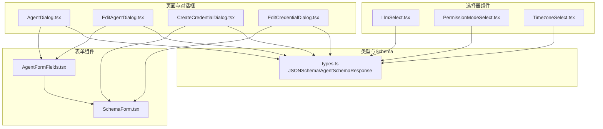
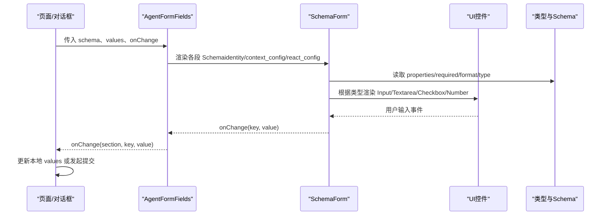
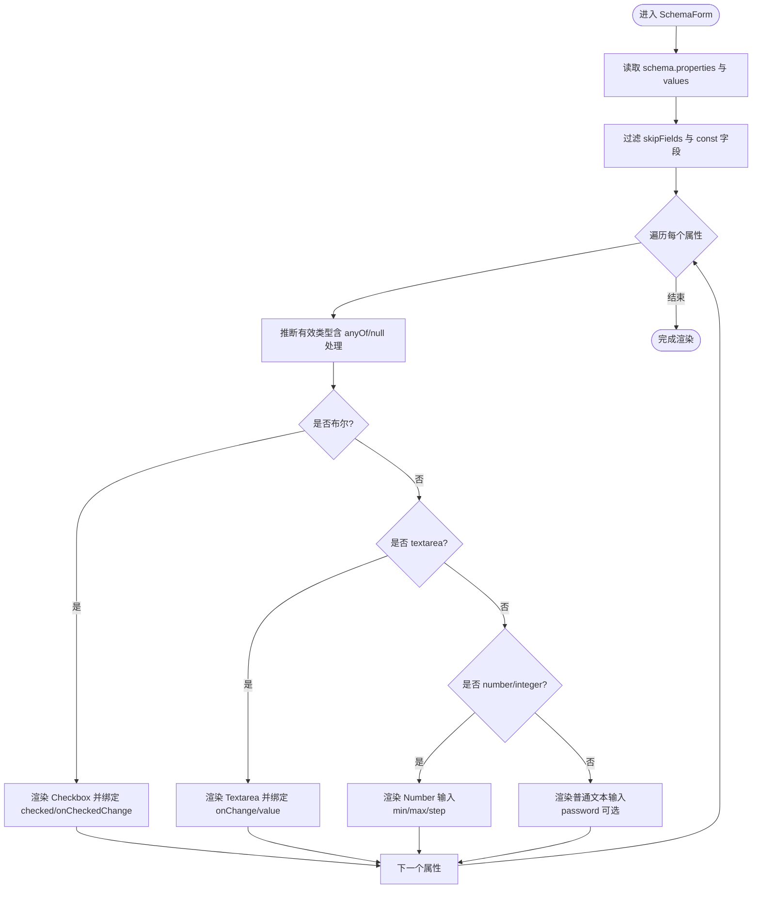
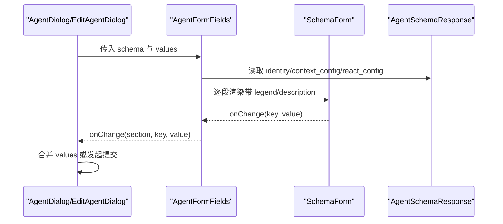
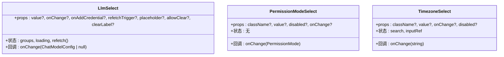
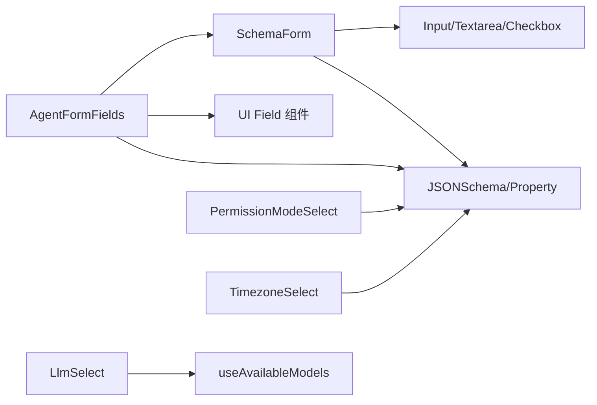

# 表单组件

<cite>
**本文引用的文件**
- [AgentFormFields.tsx](file://examples/web_ui/frontend/src/components/form/AgentFormFields.tsx)
- [SchemaForm.tsx](file://examples/web_ui/frontend/src/components/form/SchemaForm.tsx)
- [types.ts](file://examples/web_ui/frontend/src/api/types.ts)
- [AgentDialog.tsx](file://examples/web_ui/frontend/src/components/dialog/AgentDialog.tsx)
- [EditAgentDialog.tsx](file://examples/web_ui/frontend/src/components/dialog/EditAgentDialog.tsx)
- [CreateCredentialDialog.tsx](file://examples/web_ui/frontend/src/components/dialog/CreateCredentialDialog.tsx)
- [EditCredentialDialog.tsx](file://examples/web_ui/frontend/src/components/dialog/EditCredentialDialog.tsx)
- [LlmSelect.tsx](file://examples/web_ui/frontend/src/components/select/LlmSelect.tsx)
- [PermissionModeSelect.tsx](file://examples/web_ui/frontend/src/components/select/PermissionModeSelect.tsx)
- [TimezoneSelect.tsx](file://examples/web_ui/frontend/src/components/select/TimezoneSelect.tsx)
</cite>

## 目录
1. [简介](#简介)
2. [项目结构](#项目结构)
3. [核心组件](#核心组件)
4. [架构总览](#架构总览)
5. [详细组件分析](#详细组件分析)
6. [依赖关系分析](#依赖关系分析)
7. [性能考量](#性能考量)
8. [故障排查指南](#故障排查指南)
9. [结论](#结论)
10. [附录：完整表单示例与最佳实践](#附录完整表单示例与最佳实践)

## 简介
本文件系统性梳理 AgentScope Web 前端中的表单体系，重点覆盖以下方面：
- 智能体表单字段与分段组织
- Schema 驱动的通用表单渲染（SchemaForm）
- 各类选择器组件（LLM 选择、权限模式、时区选择）
- 表单验证机制（必填、数值范围、格式提示）
- 动态表单生成与字段值绑定
- 表单状态管理（字段变更、提交、错误处理）
- 配置项（字段标签/占位符/描述覆写、跳过字段、ID 前缀）
- 数据模型绑定与数据流转
- 完整示例与最佳实践

## 项目结构
表单相关代码集中在前端工程的 form 与 select 组件目录，并通过对话框页面进行组合使用。

**图表来源**
- [AgentFormFields.tsx:33-74](file://examples/web_ui/frontend/src/components/form/AgentFormFields.tsx#L33-L74)
- [SchemaForm.tsx:52-174](file://examples/web_ui/frontend/src/components/form/SchemaForm.tsx#L52-L174)
- [types.ts:67-76](file://examples/web_ui/frontend/src/api/types.ts#L67-L76)
- [AgentDialog.tsx:80-90](file://examples/web_ui/frontend/src/components/dialog/AgentDialog.tsx#L80-L90)
- [EditAgentDialog.tsx:85-95](file://examples/web_ui/frontend/src/components/dialog/EditAgentDialog.tsx#L85-L95)
- [CreateCredentialDialog.tsx:110-125](file://examples/web_ui/frontend/src/components/dialog/CreateCredentialDialog.tsx#L110-L125)
- [EditCredentialDialog.tsx:80-95](file://examples/web_ui/frontend/src/components/dialog/EditCredentialDialog.tsx#L80-L95)
- [LlmSelect.tsx:41-153](file://examples/web_ui/frontend/src/components/select/LlmSelect.tsx#L41-L153)
- [PermissionModeSelect.tsx:32-76](file://examples/web_ui/frontend/src/components/select/PermissionModeSelect.tsx#L32-L76)
- [TimezoneSelect.tsx:25-90](file://examples/web_ui/frontend/src/components/select/TimezoneSelect.tsx#L25-L90)

**章节来源**
- [AgentFormFields.tsx:1-94](file://examples/web_ui/frontend/src/components/form/AgentFormFields.tsx#L1-L94)
- [SchemaForm.tsx:1-175](file://examples/web_ui/frontend/src/components/form/SchemaForm.tsx#L1-L175)
- [types.ts:67-76](file://examples/web_ui/frontend/src/api/types.ts#L67-L76)

## 核心组件
- SchemaForm：基于 JSON Schema 的通用表单渲染器，支持布尔、文本、密码、多行文本、数字（整数/小数）等类型推断与渲染；支持最小/最大值约束、必填标记、占位符与描述覆写、ID 前缀等配置。
- AgentFormFields：将智能体的多段 Schema（identity/context_config/react_config）按分组渲染为多个 FieldSet，并提供默认值填充工具函数。
- 选择器组件：LlmSelect、PermissionModeSelect、TimezoneSelect，用于复杂输入场景的交互式选择。

**章节来源**
- [SchemaForm.tsx:52-174](file://examples/web_ui/frontend/src/components/form/SchemaForm.tsx#L52-L174)
- [AgentFormFields.tsx:33-94](file://examples/web_ui/frontend/src/components/form/AgentFormFields.tsx#L33-L94)
- [LlmSelect.tsx:41-153](file://examples/web_ui/frontend/src/components/select/LlmSelect.tsx#L41-L153)
- [PermissionModeSelect.tsx:32-76](file://examples/web_ui/frontend/src/components/select/PermissionModeSelect.tsx#L32-L76)
- [TimezoneSelect.tsx:25-90](file://examples/web_ui/frontend/src/components/select/TimezoneSelect.tsx#L25-L90)

## 架构总览
下图展示了从页面到表单组件的数据流与控制流：

**图表来源**
- [AgentFormFields.tsx:33-74](file://examples/web_ui/frontend/src/components/form/AgentFormFields.tsx#L33-L74)
- [SchemaForm.tsx:52-174](file://examples/web_ui/frontend/src/components/form/SchemaForm.tsx#L52-L174)
- [types.ts:139-159](file://examples/web_ui/frontend/src/api/types.ts#L139-L159)

## 详细组件分析

### SchemaForm 组件
- 设计要点
  - 类型推断：优先使用 prop.type，若无则从 anyOf 中剔除 null 的首个类型；数字类型推断同时考虑 integer/number。
  - 字段过滤：默认跳过 id、type；const 字段不渲染。
  - 输入类型映射：boolean → 复选框；format=textarea → 多行文本；format=password → 密码输入；number/integer → 数字输入（含最小/最大/步进推断）。
  - 必填标记：根据 schema.required 显示星号。
  - 值绑定：统一通过 onChange(key, value) 回调更新父级状态。
  - 可选覆写：labelFor、placeholderFor、descriptionFor、idPrefix。
  - 默认值提取：defaultValuesFromSchema 支持从 Schema 的 default 字段批量生成初始值。
- 验证机制
  - 必填：required 字段缺失时仍可编辑，但渲染会显示必填标记；提交阶段由后端或上层逻辑校验。
  - 数值范围：minimum/exclusiveMinimum、maximum/exclusiveMaximum 自动映射到 HTML input 属性。
  - 格式提示：format=password/password、format=textarea 控制渲染与行为。
  - 自定义规则：通过 labelFor/placeholderFor/descriptionFor 覆盖文案；也可在上层结合业务规则进行二次校验。
- 性能与可用性
  - 使用 useMemo 过滤时建议在上层缓存 filtered 列表（如 TimezoneSelect）。
  - 数字输入空字符串转 undefined，避免发送空字符串导致后端类型转换失败。

**图表来源**
- [SchemaForm.tsx:52-174](file://examples/web_ui/frontend/src/components/form/SchemaForm.tsx#L52-L174)

**章节来源**
- [SchemaForm.tsx:11-25](file://examples/web_ui/frontend/src/components/form/SchemaForm.tsx#L11-L25)
- [SchemaForm.tsx:27-35](file://examples/web_ui/frontend/src/components/form/SchemaForm.tsx#L27-L35)
- [SchemaForm.tsx:37-50](file://examples/web_ui/frontend/src/components/form/SchemaForm.tsx#L37-L50)
- [SchemaForm.tsx:52-174](file://examples/web_ui/frontend/src/components/form/SchemaForm.tsx#L52-L174)

### AgentFormFields 组件
- 设计要点
  - 将 AgentSchemaResponse 的三段 Schema 分别渲染为三个 FieldSet（identity/context_config/react_config），并提供 i18n 标题与描述。
  - 通过 onChange(section, key, value) 将字段变更回传给上层，便于集中管理。
  - 提供 defaultAgentFormValues 工具：从每段 Schema 的 properties.default 生成初始 values。
- 使用场景
  - 在新建/编辑智能体对话框中作为主表单容器，内部嵌套 SchemaForm 渲染具体字段。
- 交互细节
  - 通过 labelFor/placeholderFor 将 i18n 键映射到对应字段标签与占位符，提升本地化能力。

**图表来源**
- [AgentFormFields.tsx:33-74](file://examples/web_ui/frontend/src/components/form/AgentFormFields.tsx#L33-L74)
- [types.ts:67-76](file://examples/web_ui/frontend/src/api/types.ts#L67-L76)

**章节来源**
- [AgentFormFields.tsx:13-29](file://examples/web_ui/frontend/src/components/form/AgentFormFields.tsx#L13-L29)
- [AgentFormFields.tsx:33-74](file://examples/web_ui/frontend/src/components/form/AgentFormFields.tsx#L33-L74)
- [AgentFormFields.tsx:76-94](file://examples/web_ui/frontend/src/components/form/AgentFormFields.tsx#L76-L94)

### 选择器组件
- LlmSelect
  - 功能：按 provider 分组展示可用模型，支持清空选择（allowClear）、添加凭据入口、加载状态与空状态提示。
  - 数据来源：useAvailableModels 返回分组数据，onChange 回传 ChatModelConfig 结构。
- PermissionModeSelect
  - 功能：权限模式下拉选择，支持 Tooltip 辅助说明，onChange 回传 PermissionMode。
- TimezoneSelect
  - 功能：时区搜索与选择，支持本地时区回退显示，onChange 回传时区字符串。

**图表来源**
- [LlmSelect.tsx:21-49](file://examples/web_ui/frontend/src/components/select/LlmSelect.tsx#L21-L49)
- [PermissionModeSelect.tsx:25-30](file://examples/web_ui/frontend/src/components/select/PermissionModeSelect.tsx#L25-L30)
- [TimezoneSelect.tsx:18-23](file://examples/web_ui/frontend/src/components/select/TimezoneSelect.tsx#L18-L23)

**章节来源**
- [LlmSelect.tsx:41-153](file://examples/web_ui/frontend/src/components/select/LlmSelect.tsx#L41-L153)
- [PermissionModeSelect.tsx:32-76](file://examples/web_ui/frontend/src/components/select/PermissionModeSelect.tsx#L32-L76)
- [TimezoneSelect.tsx:25-90](file://examples/web_ui/frontend/src/components/select/TimezoneSelect.tsx#L25-L90)

## 依赖关系分析
- 组件耦合
  - AgentFormFields 依赖 SchemaForm 与 UI field 组件，负责分段渲染与默认值生成。
  - SchemaForm 依赖 UI 输入组件（Input、Textarea、Checkbox），并读取 JSONSchema 类型信息。
  - 选择器组件独立性强，通过 props 回调与上层页面/对话框集成。
- 外部依赖
  - i18n：通过 useTranslation 提供标签与描述的国际化键映射。
  - hooks：如 useAvailableModels 为 LlmSelect 提供数据源。
- 数据契约
  - AgentSchemaResponse：identity/context_config/react_config 三段 Schema。
  - JSONSchema/JSONSchemaProperty：字段类型、格式、默认值、必填、范围等。

**图表来源**
- [AgentFormFields.tsx:3-11](file://examples/web_ui/frontend/src/components/form/AgentFormFields.tsx#L3-L11)
- [SchemaForm.tsx:1-6](file://examples/web_ui/frontend/src/components/form/SchemaForm.tsx#L1-L6)
- [types.ts:67-76](file://examples/web_ui/frontend/src/api/types.ts#L67-L76)
- [LlmSelect.tsx:18-20](file://examples/web_ui/frontend/src/components/select/LlmSelect.tsx#L18-L20)

**章节来源**
- [types.ts:67-76](file://examples/web_ui/frontend/src/api/types.ts#L67-L76)
- [types.ts:139-159](file://examples/web_ui/frontend/src/api/types.ts#L139-L159)

## 性能考量
- 渲染优化
  - 对于长列表（如时区选择），使用虚拟滚动或分页可进一步优化（当前已采用滚动容器）。
  - 使用 useMemo 缓存过滤结果，减少重复计算。
- 输入处理
  - 数字输入空值转 undefined，避免无效字符串传输，降低后端解析成本。
- 组件复用
  - 将通用逻辑抽取至 SchemaForm，减少重复渲染与分支判断。

[本节为通用指导，无需特定文件引用]

## 故障排查指南
- 必填字段未生效
  - 确认 JSON Schema 的 required 字段包含目标键；前端仅做渲染标记，实际校验需在提交阶段执行。
- 数值输入异常
  - 检查 minimum/maximum/exclusiveMinimum/exclusiveMaximum 是否正确设置；确认输入为空时已转为 undefined。
- 多行文本未出现
  - 确认 prop.format 设置为 textarea；否则将按普通文本输入渲染。
- 选择器无选项
  - LlmSelect 在无可用模型时显示空状态与“添加凭据”入口；检查 useAvailableModels 的数据拉取与 refetchTrigger。
- 本地化标签缺失
  - 确认 i18n 键路径与 AgentFormFields 的 labelFor/placeholderFor 映射一致。

**章节来源**
- [SchemaForm.tsx:117-153](file://examples/web_ui/frontend/src/components/form/SchemaForm.tsx#L117-L153)
- [LlmSelect.tsx:77-82](file://examples/web_ui/frontend/src/components/select/LlmSelect.tsx#L77-L82)
- [AgentFormFields.tsx:52-66](file://examples/web_ui/frontend/src/components/form/AgentFormFields.tsx#L52-L66)

## 结论
AgentScope 的表单体系以 JSON Schema 为核心，通过 SchemaForm 实现高度可配置的动态渲染；配合 AgentFormFields 的分段组织与选择器组件，能够快速构建复杂配置界面。通过明确的字段类型映射、可覆写的标签/占位符/描述以及严格的默认值策略，既保证了灵活性，也确保了用户体验与一致性。

[本节为总结，无需特定文件引用]

## 附录：完整表单示例与最佳实践

### 示例一：智能体创建/编辑表单
- 页面职责
  - AgentDialog 与 EditAgentDialog 通过 AgentFormFields 组织三段 Schema，集中管理 values 与 onChange。
- 关键流程
  - 初始化：defaultAgentFormValues 从 Schema 生成初始值。
  - 编辑：onChange(section, key, value) 合并到本地状态。
  - 提交：将 values 序列化为后端请求体并发起创建/更新请求。
- 最佳实践
  - 在提交前对必填字段进行前端轻量校验（如非空、数值范围），并在失败时聚焦首个错误字段。
  - 对于大字段（如系统提示词），使用 SchemaForm 的 textarea 渲染并限制长度。

**章节来源**
- [AgentDialog.tsx:40-90](file://examples/web_ui/frontend/src/components/dialog/AgentDialog.tsx#L40-L90)
- [EditAgentDialog.tsx:50-95](file://examples/web_ui/frontend/src/components/dialog/EditAgentDialog.tsx#L50-L95)
- [AgentFormFields.tsx:76-94](file://examples/web_ui/frontend/src/components/form/AgentFormFields.tsx#L76-L94)

### 示例二：凭据创建/编辑表单
- 页面职责
  - CreateCredentialDialog 与 EditCredentialDialog 使用 SchemaForm 直接渲染凭据 Schema。
- 关键流程
  - 初始化：SchemaForm 的 defaultValuesFromSchema 或手动填充 prefill。
  - 编辑：onChange(key, value) 更新本地 values。
  - 提交：将 values 作为 CreateCredentialRequest/UpdateCredentialRequest 发送。
- 最佳实践
  - 对敏感字段使用 format=password，避免明文显示。
  - 对多行配置使用 format=textarea，提升可读性。

**章节来源**
- [CreateCredentialDialog.tsx:30-125](file://examples/web_ui/frontend/src/components/dialog/CreateCredentialDialog.tsx#L30-L125)
- [EditCredentialDialog.tsx:25-95](file://examples/web_ui/frontend/src/components/dialog/EditCredentialDialog.tsx#L25-L95)
- [SchemaForm.tsx:37-50](file://examples/web_ui/frontend/src/components/form/SchemaForm.tsx#L37-L50)

### 示例三：高级输入场景
- LLM 选择
  - 使用 LlmSelect 选择 ChatModelConfig，支持清空与添加凭据。
- 权限模式
  - 使用 PermissionModeSelect 选择权限策略，搭配 Tooltip 提供上下文说明。
- 时区选择
  - 使用 TimezoneSelect 支持搜索与时区展示，自动回退到本地时区。

**章节来源**
- [LlmSelect.tsx:41-153](file://examples/web_ui/frontend/src/components/select/LlmSelect.tsx#L41-L153)
- [PermissionModeSelect.tsx:32-76](file://examples/web_ui/frontend/src/components/select/PermissionModeSelect.tsx#L32-L76)
- [TimezoneSelect.tsx:25-90](file://examples/web_ui/frontend/src/components/select/TimezoneSelect.tsx#L25-L90)

### 配置选项清单
- SchemaForm
  - skipFields：跳过的字段集合，默认包含 id、type。
  - labelFor：覆写字段标签。
  - placeholderFor：覆写占位符/描述。
  - descriptionFor：覆写帮助文本。
  - idPrefix：生成 DOM ID 的前缀，避免同页冲突。
- AgentFormFields
  - 通过 labelFor/placeholderFor 将 i18n 键映射到字段标签与占位符。
  - 提供 defaultAgentFormValues 从 Schema 默认值生成初始表单值。
- 选择器组件
  - LlmSelect：allowClear、clearLabel、placeholder、refetchTrigger。
  - PermissionModeSelect：className、disabled、value、onChange。
  - TimezoneSelect：className、disabled、value、onChange。

**章节来源**
- [SchemaForm.tsx:11-25](file://examples/web_ui/frontend/src/components/form/SchemaForm.tsx#L11-L25)
- [AgentFormFields.tsx:52-66](file://examples/web_ui/frontend/src/components/form/AgentFormFields.tsx#L52-L66)
- [LlmSelect.tsx:21-39](file://examples/web_ui/frontend/src/components/select/LlmSelect.tsx#L21-L39)
- [PermissionModeSelect.tsx:25-30](file://examples/web_ui/frontend/src/components/select/PermissionModeSelect.tsx#L25-L30)
- [TimezoneSelect.tsx:18-23](file://examples/web_ui/frontend/src/components/select/TimezoneSelect.tsx#L18-L23)