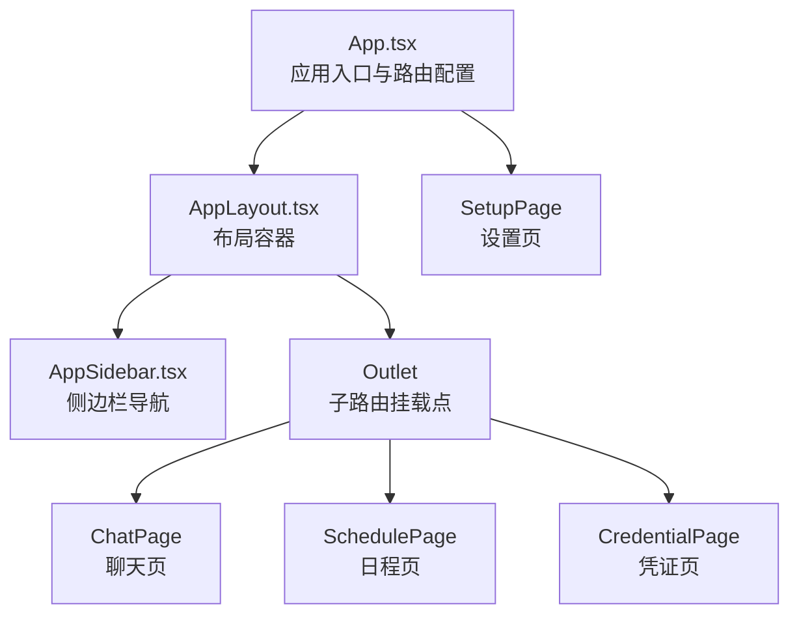
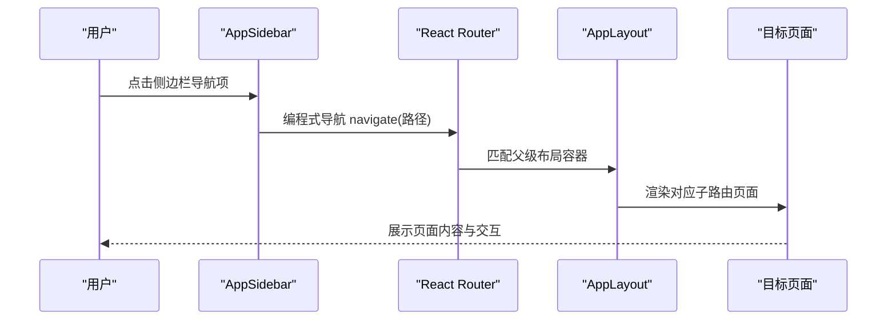
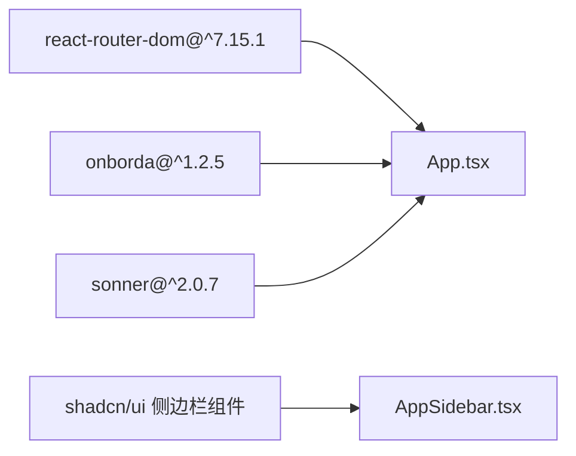

# 路由导航

<cite>
**本文引用的文件**
- [App.tsx](file://examples/web_ui/frontend/src/App.tsx)
- [AppLayout.tsx](file://examples/web_ui/frontend/src/components/layout/AppLayout.tsx)
- [AppSidebar.tsx](file://examples/web_ui/frontend/src/components/layout/AppSidebar.tsx)
- [chat/index.tsx](file://examples/web_ui/frontend/src/pages/chat/index.tsx)
- [credential/index.tsx](file://examples/web_ui/frontend/src/pages/credential/index.tsx)
- [schedule/index.tsx](file://examples/web_ui/frontend/src/pages/schedule/index.tsx)
- [setup/index.tsx](file://examples/web_ui/frontend/src/pages/setup/index.tsx)
- [package.json](file://examples/web_ui/frontend/package.json)
</cite>

## 目录
1. [简介](#简介)
2. [项目结构](#项目结构)
3. [核心组件](#核心组件)
4. [架构总览](#架构总览)
5. [组件详解](#组件详解)
6. [依赖分析](#依赖分析)
7. [性能考量](#性能考量)
8. [故障排查指南](#故障排查指南)
9. [结论](#结论)
10. [附录](#附录)

## 简介
本文件系统化梳理 AgentScope 前端路由导航体系，覆盖 React Router 配置与使用策略（路由定义、嵌套路由、动态路由参数）、页面组件结构（聊天、凭证、日程、设置）的路由映射关系、导航组件设计（侧边栏、面包屑、页面切换动画）、路由守卫与权限控制（登录验证、访问控制、页面保护策略），并提供路由配置示例与导航 API 参考（编程式导航、声明式导航、路由参数传递），最后给出用户体验优化与 SEO 友好性建议。

## 项目结构
前端位于 examples/web_ui/frontend，采用 Vite + React 19 + React Router 7 的现代技术栈。路由集中在应用入口文件中集中定义，页面组件按功能模块划分，布局组件负责容器与侧边栏组织，导航组件通过声明式与编程式结合的方式实现页面跳转与状态同步。

图表来源
- [App.tsx:27-38](file://examples/web_ui/frontend/src/App.tsx#L27-L38)
- [AppLayout.tsx:6-17](file://examples/web_ui/frontend/src/components/layout/AppLayout.tsx#L6-L17)
- [AppSidebar.tsx:21-133](file://examples/web_ui/frontend/src/components/layout/AppSidebar.tsx#L21-L133)
- [chat/index.tsx:608-612](file://examples/web_ui/frontend/src/pages/chat/index.tsx#L608-L612)
- [schedule/index.tsx:51-132](file://examples/web_ui/frontend/src/pages/schedule/index.tsx#L51-L132)
- [credential/index.tsx:232-397](file://examples/web_ui/frontend/src/pages/credential/index.tsx#L232-L397)
- [setup/index.tsx:21-83](file://examples/web_ui/frontend/src/pages/setup/index.tsx#L21-L83)

章节来源
- [App.tsx:1-65](file://examples/web_ui/frontend/src/App.tsx#L1-L65)
- [AppLayout.tsx:1-18](file://examples/web_ui/frontend/src/components/layout/AppLayout.tsx#L1-L18)
- [AppSidebar.tsx:1-134](file://examples/web_ui/frontend/src/components/layout/AppSidebar.tsx#L1-L134)
- [chat/index.tsx:1-613](file://examples/web_ui/frontend/src/pages/chat/index.tsx#L1-L613)
- [credential/index.tsx:1-398](file://examples/web_ui/frontend/src/pages/credential/index.tsx#L1-L398)
- [schedule/index.tsx:1-133](file://examples/web_ui/frontend/src/pages/schedule/index.tsx#L1-L133)
- [setup/index.tsx:1-84](file://examples/web_ui/frontend/src/pages/setup/index.tsx#L1-L84)

## 核心组件
- 应用入口与路由配置：在应用入口集中定义路由表，包含嵌套路由与动态路由参数，并通过 RouterProvider 提供路由能力。
- 布局容器：AppLayout 作为路由容器，内部包含侧边栏与 Outlet，用于承载子路由内容。
- 导航组件：AppSidebar 提供图标化导航按钮，支持当前激活态高亮与语言切换、引导向导触发等。
- 页面组件：聊天、凭证、日程、设置页面分别承担不同业务域的展示与交互。
- 设置流程：首次启动时通过 SetupPage 收集服务端地址与用户名，完成后进入主路由。

章节来源
- [App.tsx:27-38](file://examples/web_ui/frontend/src/App.tsx#L27-L38)
- [AppLayout.tsx:6-17](file://examples/web_ui/frontend/src/components/layout/AppLayout.tsx#L6-L17)
- [AppSidebar.tsx:21-133](file://examples/web_ui/frontend/src/components/layout/AppSidebar.tsx#L21-L133)
- [setup/index.tsx:21-83](file://examples/web_ui/frontend/src/pages/setup/index.tsx#L21-L83)

## 架构总览
下图展示从应用入口到各页面的路由流向与导航交互：

图表来源
- [AppSidebar.tsx:22-36](file://examples/web_ui/frontend/src/components/layout/AppSidebar.tsx#L22-L36)
- [AppLayout.tsx:6-17](file://examples/web_ui/frontend/src/components/layout/AppLayout.tsx#L6-L17)
- [App.tsx:27-38](file://examples/web_ui/frontend/src/App.tsx#L27-L38)

## 组件详解

### 路由定义与嵌套路由
- 路由表集中于应用入口，使用 createBrowserRouter 定义父子层级关系。
- 父级容器为 AppLayout，其内部包含 Outlet，所有子路由在此挂载。
- 子路由包括：
  - 根路径“/”与带动态参数的聊天路径“/chat/:agentId/:sessionId”
  - 日程路径“/schedule”
  - 凭证路径“/credential”
  - 设置路径“/setup”，该路径独立于 AppLayout，用于首次配置

章节来源
- [App.tsx:27-38](file://examples/web_ui/frontend/src/App.tsx#L27-L38)
- [AppLayout.tsx:6-17](file://examples/web_ui/frontend/src/components/layout/AppLayout.tsx#L6-L17)

### 动态路由参数与页面联动
- 聊天页面支持动态路由参数“agentId”和“sessionId”，在页面内通过 useParams 获取参数并与本地状态同步，确保首次加载时优先使用 URL 参数，其次回退到默认值。
- 页面逻辑在依赖变化时自动更新上下文选择（如模型、会话、权限模式等），保证参数变更后界面与数据一致。

章节来源
- [chat/index.tsx:72-151](file://examples/web_ui/frontend/src/pages/chat/index.tsx#L72-L151)

### 页面组件结构与职责
- 聊天页面（ChatPage）
  - 结构：左侧侧边栏（代理与会话列表）、中间聊天区域、右侧工作区抽屉
  - 功能：代理选择、会话管理、模型配置、权限模式切换、文件处理、对话流式渲染
- 凭证页面（CredentialPage）
  - 结构：左侧按类型分组的凭证列表、右侧详情面板
  - 功能：凭证增删改查、模型可用性展示、字段遮罩显示
- 日程页面（SchedulePage）
  - 结构：顶部视图切换（日历/列表）、主体内容区域、详情抽屉、新建日程弹窗
  - 功能：Cron 表达式解析生成事件、月度范围计算、事件点击联动详情
- 设置页面（SetupPage）
  - 结构：表单收集服务端地址与用户名
  - 功能：写入本地存储，完成初始化后返回主路由

章节来源
- [chat/index.tsx:276-606](file://examples/web_ui/frontend/src/pages/chat/index.tsx#L276-L606)
- [credential/index.tsx:285-397](file://examples/web_ui/frontend/src/pages/credential/index.tsx#L285-L397)
- [schedule/index.tsx:80-132](file://examples/web_ui/frontend/src/pages/schedule/index.tsx#L80-L132)
- [setup/index.tsx:21-83](file://examples/web_ui/frontend/src/pages/setup/index.tsx#L21-L83)

### 导航组件设计
- 侧边栏导航（AppSidebar）
  - 图标化导航项，支持当前路径激活态高亮
  - 语言切换、引导向导触发、设置入口
  - 使用 useNavigate 进行编程式导航，结合 useLocation 判断当前路径
- 面包屑导航
  - 当前实现未包含显式面包屑组件；可基于当前路径与页面标题构建轻量面包屑
- 页面切换动画
  - 未引入专门的路由过渡动画库；可在 AppLayout 外层包裹动画容器或使用第三方方案（如 Framer Motion）实现淡入淡出等效果

章节来源
- [AppSidebar.tsx:21-133](file://examples/web_ui/frontend/src/components/layout/AppSidebar.tsx#L21-L133)
- [AppLayout.tsx:6-17](file://examples/web_ui/frontend/src/components/layout/AppLayout.tsx#L6-L17)

### 路由守卫与权限控制
- 登录验证与访问控制
  - 应用通过本地存储键“server_url”判断是否完成初始化；未完成时直接渲染设置页，不进入主路由
  - 该策略起到基础的“登录/初始化校验”作用，非网络层鉴权
- 页面保护策略
  - 当前未实现细粒度的路由守卫（如基于角色或令牌的拦截器）
  - 建议在路由表外层增加通用守卫，结合后端接口校验用户状态

章节来源
- [App.tsx:40-62](file://examples/web_ui/frontend/src/App.tsx#L40-L62)

### 导航 API 参考
- 编程式导航
  - 在组件中使用 useNavigate 获取导航函数，调用 navigate(路径) 实现跳转
  - 示例：侧边栏点击、设置完成后的返回
- 声明式导航
  - 使用 Link 或在 UI 组件中绑定 onClick 调用 navigate
- 路由参数传递
  - 动态路由参数通过路径占位符传递，页面通过 useParams 读取
  - 示例：/chat/:agentId/:sessionId

章节来源
- [AppSidebar.tsx:22-36](file://examples/web_ui/frontend/src/components/layout/AppSidebar.tsx#L22-L36)
- [chat/index.tsx:75-78](file://examples/web_ui/frontend/src/pages/chat/index.tsx#L75-L78)

### 用户体验优化建议
- 首屏加载
  - 将设置页与主路由分离，避免阻塞主界面渲染
- 导航一致性
  - 保持侧边栏图标与页面标题一致，提供悬浮提示
- 错误与空状态
  - 为聊天、凭证、日程等页面补充完善的空状态与错误提示
- 移动端适配
  - 结合 useIsMobile 钩子对移动端布局进行自适应调整

章节来源
- [App.tsx:40-62](file://examples/web_ui/frontend/src/App.tsx#L40-L62)
- [chat/index.tsx:296-314](file://examples/web_ui/frontend/src/pages/chat/index.tsx#L296-L314)
- [credential/index.tsx:294-306](file://examples/web_ui/frontend/src/pages/credential/index.tsx#L294-L306)
- [schedule/index.tsx:107-115](file://examples/web_ui/frontend/src/pages/schedule/index.tsx#L107-L115)

### SEO 友好性考虑
- 当前未集成 SSR/SSG 或静态资源预渲染
- 建议在部署阶段引入静态导出或服务端渲染，以提升首屏速度与搜索引擎收录
- 对关键页面（如日程列表）可考虑提供可抓取的 HTML 片段

## 依赖分析
- React Router 7：提供路由定义、嵌套与参数解析能力
- shadcn/ui：UI 组件库，支撑侧边栏、卡片、按钮等组件
- onborda：引导向导集成，配合侧边栏“Tour”入口使用
- sonner：全局通知组件，用于操作反馈

图表来源
- [package.json:35-39](file://examples/web_ui/frontend/package.json#L35-L39)
- [App.tsx:1-65](file://examples/web_ui/frontend/src/App.tsx#L1-L65)
- [AppSidebar.tsx:1-134](file://examples/web_ui/frontend/src/components/layout/AppSidebar.tsx#L1-L134)

章节来源
- [package.json:13-44](file://examples/web_ui/frontend/package.json#L13-L44)

## 性能考量
- 路由懒加载
  - 可将页面组件改为动态导入，减少首屏包体与初次渲染时间
- 状态持久化
  - 将聊天上下文、会话选择等状态持久化至本地存储，避免频繁请求
- 动画与滚动
  - 页面切换动画建议使用轻量方案，避免影响滚动性能

## 故障排查指南
- 路由无法匹配
  - 检查路径拼写与嵌套层级，确认父级容器为 AppLayout
- 动态参数无效
  - 确认页面 useParams 是否正确读取，URL 中参数是否与路由定义一致
- 侧边栏点击无响应
  - 检查 navigate 调用与路径是否正确，确认未被条件渲染阻断
- 设置页无法跳转
  - 确认设置完成回调是否执行，以及 App.tsx 中的条件渲染逻辑

章节来源
- [App.tsx:27-38](file://examples/web_ui/frontend/src/App.tsx#L27-L38)
- [AppSidebar.tsx:22-36](file://examples/web_ui/frontend/src/components/layout/AppSidebar.tsx#L22-L36)
- [chat/index.tsx:75-78](file://examples/web_ui/frontend/src/pages/chat/index.tsx#L75-L78)

## 结论
AgentScope 前端路由采用集中式配置与嵌套路由设计，结合侧边栏导航与页面组件职责清晰，满足聊天、凭证、日程等核心场景。当前路由守卫以本地初始化状态为主，建议后续扩展为更细粒度的鉴权与权限控制。通过引入懒加载、动画优化与 SEO 支持，可进一步提升性能与可发现性。

## 附录
- 路由配置示例（片段路径）
  - 路由表定义：[App.tsx:27-38](file://examples/web_ui/frontend/src/App.tsx#L27-L38)
  - 布局容器：[AppLayout.tsx:6-17](file://examples/web_ui/frontend/src/components/layout/AppLayout.tsx#L6-L17)
  - 侧边栏导航：[AppSidebar.tsx:21-133](file://examples/web_ui/frontend/src/components/layout/AppSidebar.tsx#L21-L133)
- 页面映射关系
  - 聊天页：[chat/index.tsx:608-612](file://examples/web_ui/frontend/src/pages/chat/index.tsx#L608-L612)
  - 凭证页：[credential/index.tsx:232-397](file://examples/web_ui/frontend/src/pages/credential/index.tsx#L232-L397)
  - 日程页：[schedule/index.tsx:51-132](file://examples/web_ui/frontend/src/pages/schedule/index.tsx#L51-L132)
  - 设置页：[setup/index.tsx:21-83](file://examples/web_ui/frontend/src/pages/setup/index.tsx#L21-L83)