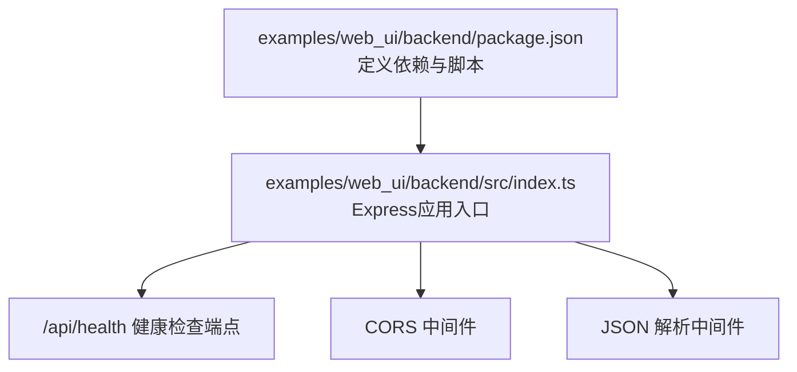
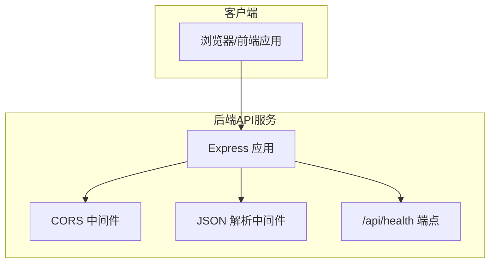
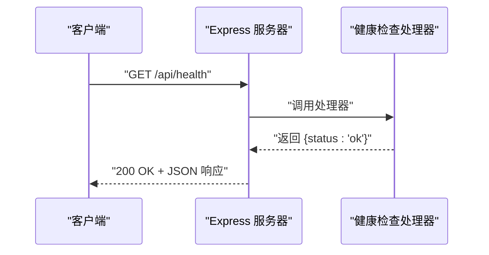
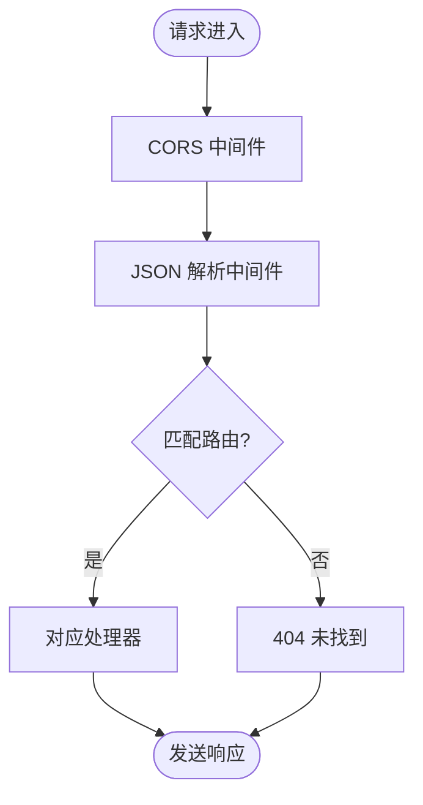
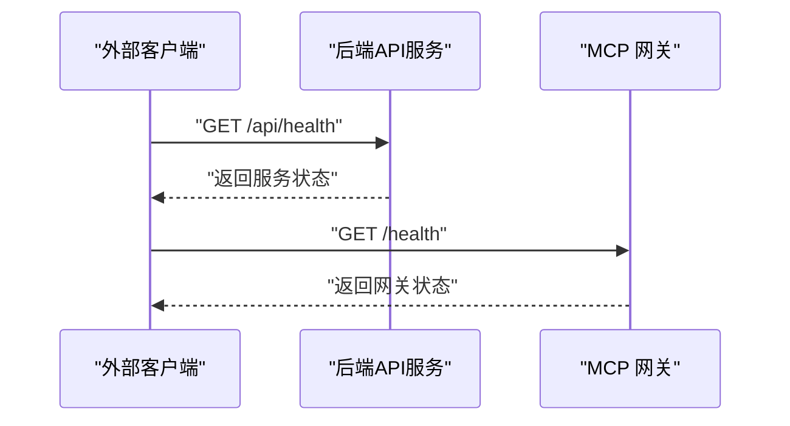
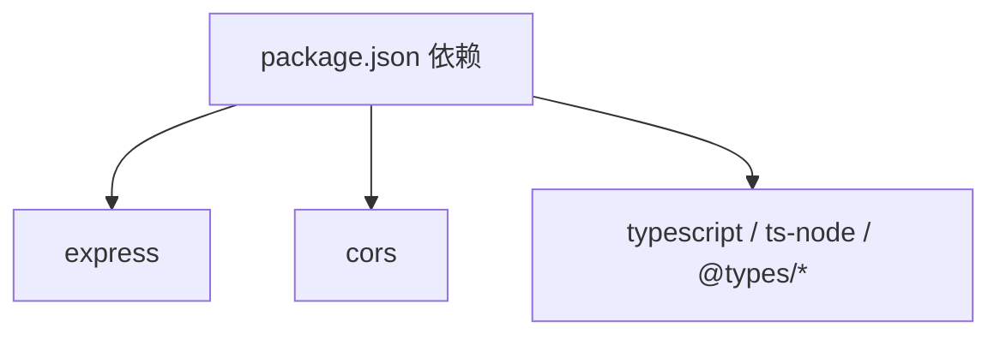

# 后端API服务

<cite>
**本文引用的文件**
- [package.json](file://examples/web_ui/backend/package.json)
- [index.ts](file://examples/web_ui/backend/src/index.ts)
- [mcp_gateway_app.py](file://src/agentscope/workspace/_mcp_gateway/_mcp_gateway_app.py)
- [_gateway_client.py](file://src/agentscope/workspace/_gateway_client.py)
- [README.md](file://examples/web_ui/backend/README.md)
</cite>

## 目录
1. [简介](#简介)
2. [项目结构](#项目结构)
3. [核心组件](#核心组件)
4. [架构总览](#架构总览)
5. [详细组件分析](#详细组件分析)
6. [依赖关系分析](#依赖关系分析)
7. [性能考虑](#性能考虑)
8. [故障排查指南](#故障排查指南)
9. [结论](#结论)
10. [附录](#附录)

## 简介
本文件面向AgentScope后端API服务，聚焦于基于Express.js的RESTful API实现与运行时行为，涵盖以下主题：
- 健康检查端点与CORS配置
- JSON请求处理与中间件体系
- 路由设计模式（基础路径约定、HTTP方法映射、响应格式）
- 环境变量与端口设置
- 部署与前后端通信协议
- 与MCP网关的健康检查对接

该服务当前以最小化实现提供健康检查端点，并通过CORS与JSON解析中间件支持跨域与JSON请求。

## 项目结构
后端API服务位于 examples/web_ui/backend 目录，采用TypeScript + Express.js实现，核心文件为入口脚本与包管理配置。

图表来源
- [package.json:1-22](file://examples/web_ui/backend/package.json#L1-L22)
- [index.ts:1-16](file://examples/web_ui/backend/src/index.ts#L1-L16)

章节来源
- [package.json:1-22](file://examples/web_ui/backend/package.json#L1-L22)
- [index.ts:1-16](file://examples/web_ui/backend/src/index.ts#L1-L16)

## 核心组件
- Express应用实例：创建并启动HTTP服务器
- CORS中间件：允许跨域请求
- JSON解析中间件：自动解析application/json请求体
- 健康检查端点：GET /api/health 返回状态信息

章节来源
- [index.ts:1-16](file://examples/web_ui/backend/src/index.ts#L1-L16)

## 架构总览
下图展示后端API服务的整体交互：前端浏览器或客户端向后端发起HTTP请求，后端通过CORS与JSON中间件进行预处理，再路由到具体端点；当前仅暴露健康检查端点。

图表来源
- [index.ts:1-16](file://examples/web_ui/backend/src/index.ts#L1-L16)

## 详细组件分析

### 健康检查端点
- 路径：GET /api/health
- 功能：返回服务可用性状态
- 响应格式：标准JSON对象，包含状态字段
- 典型响应：{"status":"ok"}

图表来源
- [index.ts:10-12](file://examples/web_ui/backend/src/index.ts#L10-L12)

章节来源
- [index.ts:10-12](file://examples/web_ui/backend/src/index.ts#L10-L12)

### 中间件体系
- CORS中间件
  - 作用：允许来自任意源的跨域请求
  - 配置：默认启用，无需额外参数
- JSON解析中间件
  - 作用：自动解析application/json请求体
  - 行为：对非JSON请求体可能产生解析错误

图表来源
- [index.ts:7-8](file://examples/web_ui/backend/src/index.ts#L7-L8)

章节来源
- [index.ts:7-8](file://examples/web_ui/backend/src/index.ts#L7-L8)

### 路由设计模式
- 基础路径约定：所有API端点以/api/开头
- HTTP方法映射：当前仅暴露GET /api/health
- 响应格式标准化：统一返回JSON对象，错误场景建议返回标准错误结构（当前未实现）

章节来源
- [index.ts:10-12](file://examples/web_ui/backend/src/index.ts#L10-L12)

### 错误处理机制
- 当前实现未显式注册全局错误处理中间件
- 建议：在生产环境中添加错误捕获中间件，统一处理未捕获异常与404未匹配路由

章节来源
- [index.ts:1-16](file://examples/web_ui/backend/src/index.ts#L1-L16)

### 与MCP网关的健康检查对接
- AgentScope内部存在独立的MCP网关应用，其健康检查端点为GET /health
- 网关客户端通过HTTP GET调用 /health 探测网关可用性
- 该能力可作为后端API服务健康检查的参考实现

图表来源
- [index.ts:10-12](file://examples/web_ui/backend/src/index.ts#L10-L12)
- [mcp_gateway_app.py:18-25](file://src/agentscope/workspace/_mcp_gateway/_mcp_gateway_app.py#L18-L25)
- [_gateway_client.py:514-517](file://src/agentscope/workspace/_gateway_client.py#L514-L517)

章节来源
- [mcp_gateway_app.py:18-25](file://src/agentscope/workspace/_mcp_gateway/_mcp_gateway_app.py#L18-L25)
- [_gateway_client.py:514-517](file://src/agentscope/workspace/_gateway_client.py#L514-L517)

## 依赖关系分析
后端API服务依赖Express与CORS库，开发期依赖TypeScript与相关类型声明。

图表来源
- [package.json:10-21](file://examples/web_ui/backend/package.json#L10-L21)

章节来源
- [package.json:10-21](file://examples/web_ui/backend/package.json#L10-L21)

## 性能考虑
- 中间件顺序：CORS与JSON解析中间件的顺序影响性能与兼容性，当前顺序合理
- 并发处理：Express默认并发模型适用于小型服务，如需扩展可引入进程池或容器编排
- 健康检查：轻量级端点，建议保持简单以降低开销

## 故障排查指南
- 端口占用
  - 现象：启动失败并提示端口冲突
  - 处理：修改PORT环境变量或释放占用端口
- CORS问题
  - 现象：浏览器报跨域错误
  - 处理：确认CORS中间件已启用；若需要自定义策略，请参考Express CORS中间件文档
- JSON解析错误
  - 现象：请求体非JSON导致解析失败
  - 处理：确保Content-Type为application/json且请求体为合法JSON
- 404未找到
  - 现象：访问不存在的端点
  - 处理：检查路由是否正确注册；建议添加全局404处理中间件

章节来源
- [index.ts:5-16](file://examples/web_ui/backend/src/index.ts#L5-L16)

## 结论
当前后端API服务实现了最小可用的健康检查端点与基础中间件栈，满足跨域与JSON请求的基本需求。建议后续补充：
- 完整的路由与控制器层
- 统一的错误处理中间件
- 更丰富的健康检查与监控端点
- 明确的响应与错误格式规范
- 生产环境的部署与安全加固

## 附录

### 环境变量与端口设置
- 端口：通过PORT环境变量设置，默认3000
- 启动命令：
  - 开发：使用脚本启动TypeScript编译与热重载
  - 构建：编译TypeScript至dist目录
  - 运行：启动dist/index.js

章节来源
- [package.json:5-8](file://examples/web_ui/backend/package.json#L5-L8)
- [index.ts:5-16](file://examples/web_ui/backend/src/index.ts#L5-L16)

### API端点清单与使用示例
- GET /api/health
  - 描述：服务健康检查
  - 请求：无
  - 响应：{"status":"ok"}
  - 示例：curl http://localhost:3000/api/health

章节来源
- [index.ts:10-12](file://examples/web_ui/backend/src/index.ts#L10-L12)

### 部署要求
- 运行时：Node.js（版本与依赖见package.json）
- 依赖安装：使用包管理器安装依赖
- 启动方式：按package.json脚本执行

章节来源
- [package.json:1-22](file://examples/web_ui/backend/package.json#L1-L22)

### 前后端通信协议与数据交换格式
- 协议：HTTP/HTTPS
- 内容类型：application/json
- 请求体：JSON对象（由JSON解析中间件处理）
- 响应体：JSON对象（当前仅健康检查端点）

章节来源
- [index.ts:7-12](file://examples/web_ui/backend/src/index.ts#L7-L12)