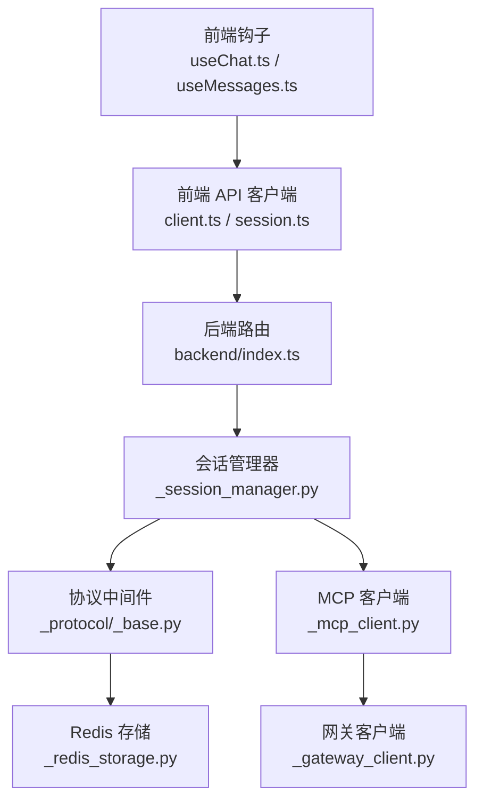
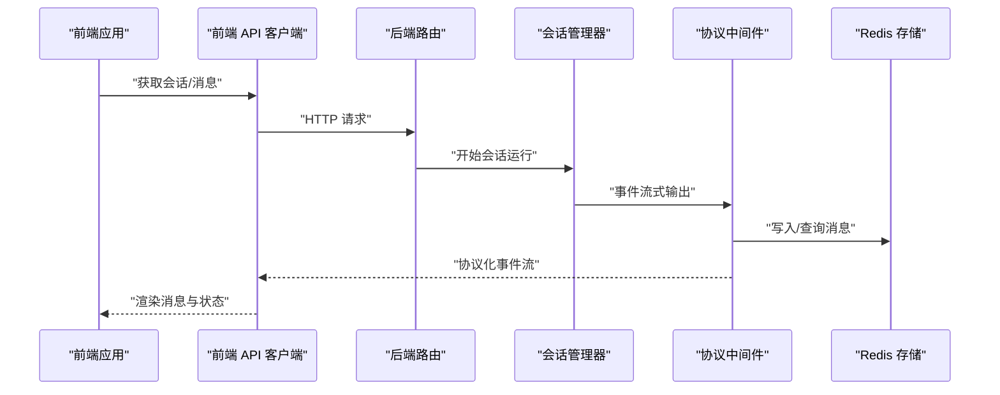
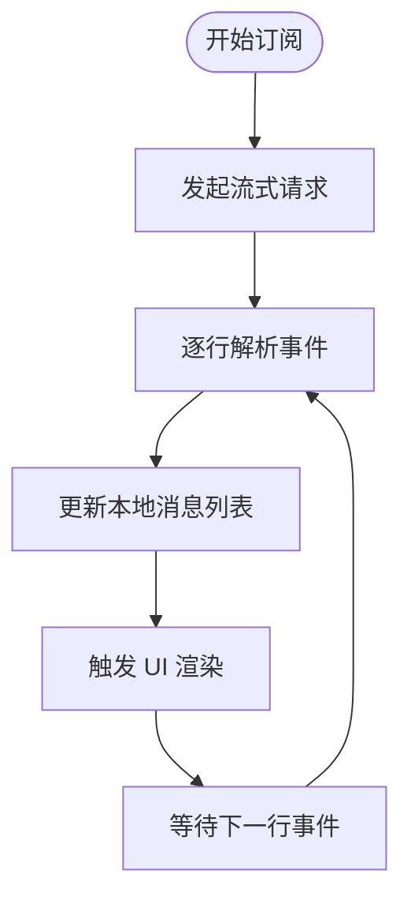
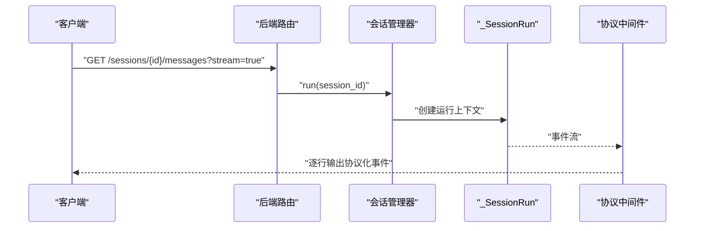
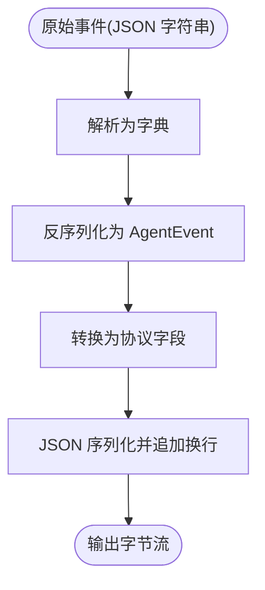
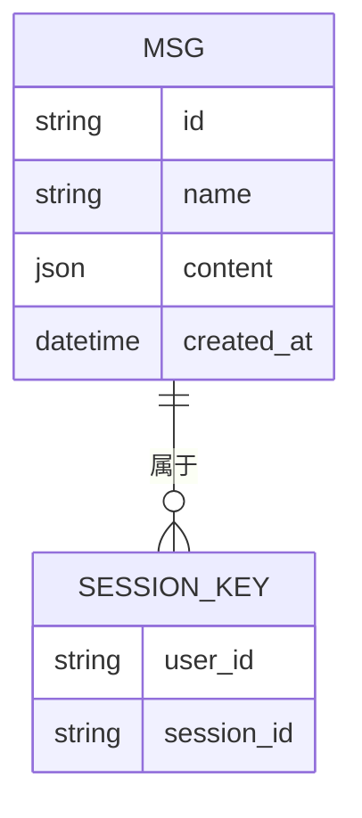
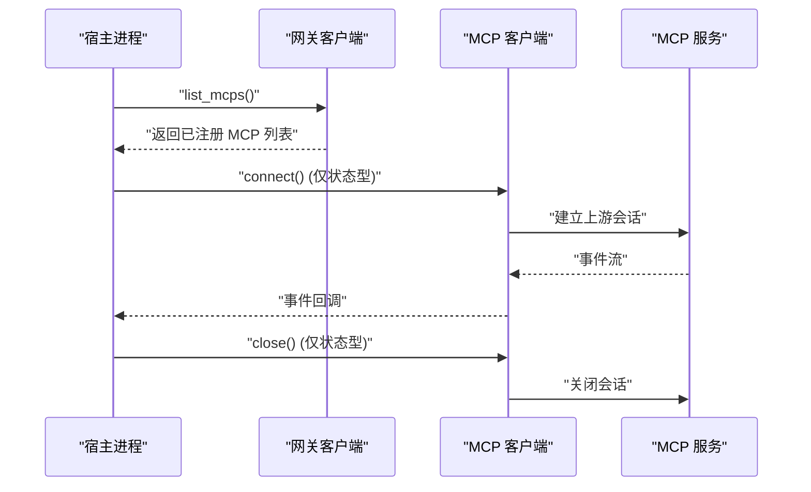
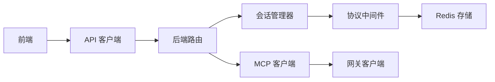

# 实时通信机制

<cite>
**本文引用的文件**
- [examples/web_ui/frontend/src/hooks/useChat.ts](file://examples/web_ui/frontend/src/hooks/useChat.ts)
- [examples/web_ui/frontend/src/hooks/useMessages.ts](file://examples/web_ui/frontend/src/hooks/useMessages.ts)
- [examples/web_ui/frontend/src/components/chat/ChatContent.tsx](file://examples/web_ui/frontend/src/components/chat/ChatContent.tsx)
- [examples/web_ui/frontend/src/api/client.ts](file://examples/web_ui/frontend/src/api/client.ts)
- [examples/web_ui/frontend/src/api/session.ts](file://examples/web_ui/frontend/src/api/session.ts)
- [examples/web_ui/backend/src/index.ts](file://examples/web_ui/backend/src/index.ts)
- [src/agentscope/app/_middleware/_protocol/_base.py](file://src/agentscope/app/_middleware/_protocol/_base.py)
- [src/agentscope/app/_manager/_session_manager.py](file://src/agentscope/app/_manager/_session_manager.py)
- [src/agentscope/workspace/_gateway_client.py](file://src/agentscope/workspace/_gateway_client.py)
- [src/agentscope/middleware/_tracing/_utils.py](file://src/agentscope/middleware/_tracing/_utils.py)
- [src/agentscope/app/storage/_redis_storage.py](file://src/agentscope/app/storage/_redis_storage.py)
- [src/agentscope/mcp/_mcp_client.py](file://src/agentscope/mcp/_mcp_client.py)
- [tests/mcp_sse_client_test.py](file://tests/mcp_sse_client_test.py)
- [tests/agui_protocol_test.py](file://tests/agui_protocol_test.py)
</cite>

## 目录
1. [引言](#引言)
2. [项目结构](#项目结构)
3. [核心组件](#核心组件)
4. [架构总览](#架构总览)
5. [详细组件分析](#详细组件分析)
6. [依赖关系分析](#依赖关系分析)
7. [性能考虑](#性能考虑)
8. [故障排查指南](#故障排查指南)
9. [结论](#结论)
10. [附录](#附录)

## 引言
本文件系统性梳理 AgentScope 的实时通信机制，重点覆盖以下方面：
- WebSocket 连接建立流程（连接参数、认证与重连策略）
- 消息传输协议（消息格式、事件类型与数据序列化）
- 双向通信实现（客户端到服务器的消息发送与服务器到客户端的消息推送）
- 状态同步机制（聊天历史管理、消息状态跟踪与 UI 更新策略）
- 完整通信 API 文档（连接生命周期、消息队列与错误处理）
- 性能优化建议与调试工具使用指南

说明：在当前仓库中，实时通信主要通过后端的会话管理与事件流式输出实现，前端通过标准 HTTP 流式接口消费事件；未发现直接的 WebSocket 服务端或客户端实现。本文据此进行准确描述，并对可能的 WebSocket 扩展给出设计建议。

## 项目结构
围绕实时通信的关键目录与文件如下：
- 前端（React + TypeScript）：会话与消息钩子、聊天界面组件、通用 API 客户端
- 后端（Python FastAPI）：会话管理器、协议中间件、存储层、MCP 客户端
- 测试：SSE 客户端行为测试、AGUI 协议转换测试

图表来源
- [examples/web_ui/frontend/src/hooks/useChat.ts](file://examples/web_ui/frontend/src/hooks/useChat.ts)
- [examples/web_ui/frontend/src/api/client.ts](file://examples/web_ui/frontend/src/api/client.ts)
- [examples/web_ui/frontend/src/api/session.ts](file://examples/web_ui/frontend/src/api/session.ts)
- [examples/web_ui/backend/src/index.ts](file://examples/web_ui/backend/src/index.ts)
- [src/agentscope/app/_manager/_session_manager.py](file://src/agentscope/app/_manager/_session_manager.py)
- [src/agentscope/app/_middleware/_protocol/_base.py](file://src/agentscope/app/_middleware/_protocol/_base.py)
- [src/agentscope/app/storage/_redis_storage.py](file://src/agentscope/app/storage/_redis_storage.py)
- [src/agentscope/mcp/_mcp_client.py](file://src/agentscope/mcp/_mcp_client.py)
- [src/agentscope/workspace/_gateway_client.py](file://src/agentscope/workspace/_gateway_client.py)

章节来源
- [examples/web_ui/frontend/src/hooks/useChat.ts](file://examples/web_ui/frontend/src/hooks/useChat.ts)
- [examples/web_ui/frontend/src/hooks/useMessages.ts](file://examples/web_ui/frontend/src/hooks/useMessages.ts)
- [examples/web_ui/frontend/src/components/chat/ChatContent.tsx](file://examples/web_ui/frontend/src/components/chat/ChatContent.tsx)
- [examples/web_ui/frontend/src/api/client.ts](file://examples/web_ui/frontend/src/api/client.ts)
- [examples/web_ui/frontend/src/api/session.ts](file://examples/web_ui/frontend/src/api/session.ts)
- [examples/web_ui/backend/src/index.ts](file://examples/web_ui/backend/src/index.ts)

## 核心组件
- 前端会话与消息钩子：负责拉取会话列表、消息分页、订阅事件流并驱动 UI 更新
- 前端 API 客户端：封装基础请求、错误提取与流式请求
- 后端会话管理器：串行化会话运行、维护事件队列、回放历史事件
- 协议中间件：将内部 AgentEvent 转换为统一协议格式并以流式输出
- Redis 存储：持久化消息列表，支持分页与 TTL 刷新
- MCP 客户端：根据 URL 自动选择 SSE 或可流式 HTTP 传输
- 网关客户端：与外部 MCP 网关交互，支持注册/注销与健康检查

章节来源
- [examples/web_ui/frontend/src/hooks/useChat.ts](file://examples/web_ui/frontend/src/hooks/useChat.ts)
- [examples/web_ui/frontend/src/hooks/useMessages.ts](file://examples/web_ui/frontend/src/hooks/useMessages.ts)
- [examples/web_ui/frontend/src/api/client.ts](file://examples/web_ui/frontend/src/api/client.ts)
- [examples/web_ui/frontend/src/api/session.ts](file://examples/web_ui/frontend/src/api/session.ts)
- [src/agentscope/app/_manager/_session_manager.py](file://src/agentscope/app/_manager/_session_manager.py)
- [src/agentscope/app/_middleware/_protocol/_base.py](file://src/agentscope/app/_middleware/_protocol/_base.py)
- [src/agentscope/app/storage/_redis_storage.py](file://src/agentscope/app/storage/_redis_storage.py)
- [src/agentscope/mcp/_mcp_client.py](file://src/agentscope/mcp/_mcp_client.py)
- [src/agentscope/workspace/_gateway_client.py](file://src/agentscope/workspace/_gateway_client.py)

## 架构总览
下图展示从前端到后端的实时通信路径，以及事件在系统内的流转：

图表来源
- [examples/web_ui/backend/src/index.ts](file://examples/web_ui/backend/src/index.ts)
- [src/agentscope/app/_manager/_session_manager.py](file://src/agentscope/app/_manager/_session_manager.py)
- [src/agentscope/app/_middleware/_protocol/_base.py](file://src/agentscope/app/_middleware/_protocol/_base.py)
- [src/agentscope/app/storage/_redis_storage.py](file://src/agentscope/app/storage/_redis_storage.py)

## 详细组件分析

### 前端实时订阅与 UI 更新
- 订阅方式：前端通过流式请求订阅后端事件流，按行解析协议化事件
- 状态管理：使用消息钩子维护本地消息列表、分页偏移与运行状态
- UI 更新：基于消息变更触发 React 组件重渲染，支持增量追加与替换

图表来源
- [examples/web_ui/frontend/src/api/client.ts](file://examples/web_ui/frontend/src/api/client.ts)
- [examples/web_ui/frontend/src/hooks/useMessages.ts](file://examples/web_ui/frontend/src/hooks/useMessages.ts)
- [examples/web_ui/frontend/src/hooks/useChat.ts](file://examples/web_ui/frontend/src/hooks/useChat.ts)

章节来源
- [examples/web_ui/frontend/src/api/client.ts](file://examples/web_ui/frontend/src/api/client.ts)
- [examples/web_ui/frontend/src/hooks/useMessages.ts](file://examples/web_ui/frontend/src/hooks/useMessages.ts)
- [examples/web_ui/frontend/src/hooks/useChat.ts](file://examples/web_ui/frontend/src/hooks/useChat.ts)

### 后端会话管理与事件流
- 串行化运行：每个会话在独立锁内顺序执行，避免并发冲突
- 队列与回放：运行期间将事件推入队列，新订阅者可回放历史事件至指定位置
- 流式输出：通过协议中间件将事件转换为统一格式并逐行输出

图表来源
- [src/agentscope/app/_manager/_session_manager.py](file://src/agentscope/app/_manager/_session_manager.py)
- [src/agentscope/app/_middleware/_protocol/_base.py](file://src/agentscope/app/_middleware/_protocol/_base.py)

章节来源
- [src/agentscope/app/_manager/_session_manager.py](file://src/agentscope/app/_manager/_session_manager.py)
- [src/agentscope/app/_middleware/_protocol/_base.py](file://src/agentscope/app/_middleware/_protocol/_base.py)

### 协议中间件与消息序列化
- 事件转换：将内部 AgentEvent 解析为字典后转换为统一协议字段
- 序列化规则：使用可序列化工具将复杂对象转为字符串或基本类型
- 输出格式：每条事件以 JSON 行结束符输出，便于前端逐行解析

图表来源
- [src/agentscope/app/_middleware/_protocol/_base.py](file://src/agentscope/app/_middleware/_protocol/_base.py)
- [src/agentscope/middleware/_tracing/_utils.py](file://src/agentscope/middleware/_tracing/_utils.py)

章节来源
- [src/agentscope/app/_middleware/_protocol/_base.py](file://src/agentscope/app/_middleware/_protocol/_base.py)
- [src/agentscope/middleware/_tracing/_utils.py](file://src/agentscope/middleware/_tracing/_utils.py)

### 消息存储与分页
- 数据结构：使用 Redis 列表存储消息，键名包含用户与会话标识
- 分页接口：支持 offset/limit 查询，保持插入顺序（时间顺序）
- TTL 策略：刷新消息列表键的过期时间，确保活跃会话持续可用

图表来源
- [src/agentscope/app/storage/_redis_storage.py](file://src/agentscope/app/storage/_redis_storage.py)

章节来源
- [src/agentscope/app/storage/_redis_storage.py](file://src/agentscope/app/storage/_redis_storage.py)

### MCP 客户端与网关集成
- 传输选择：根据 URL 后缀自动选择 SSE 或可流式 HTTP
- 生命周期：状态型 MCP 需要显式 connect/close，状态型 MCP 由网关维护会话
- 网关交互：通过网关注册/注销 MCP，支持健康检查与工具模式

图表来源
- [src/agentscope/workspace/_gateway_client.py](file://src/agentscope/workspace/_gateway_client.py)
- [src/agentscope/mcp/_mcp_client.py](file://src/agentscope/mcp/_mcp_client.py)

章节来源
- [src/agentscope/workspace/_gateway_client.py](file://src/agentscope/workspace/_gateway_client.py)
- [src/agentscope/mcp/_mcp_client.py](file://src/agentscope/mcp/_mcp_client.py)

## 依赖关系分析
- 前端依赖后端提供的会话与消息 API；通过流式接口消费事件
- 后端会话管理器依赖协议中间件进行事件转换与输出
- 协议中间件依赖存储层进行消息持久化与查询
- MCP 客户端与网关客户端共同构成外部能力接入层

图表来源
- [examples/web_ui/frontend/src/api/client.ts](file://examples/web_ui/frontend/src/api/client.ts)
- [examples/web_ui/backend/src/index.ts](file://examples/web_ui/backend/src/index.ts)
- [src/agentscope/app/_manager/_session_manager.py](file://src/agentscope/app/_manager/_session_manager.py)
- [src/agentscope/app/_middleware/_protocol/_base.py](file://src/agentscope/app/_middleware/_protocol/_base.py)
- [src/agentscope/app/storage/_redis_storage.py](file://src/agentscope/app/storage/_redis_storage.py)
- [src/agentscope/mcp/_mcp_client.py](file://src/agentscope/mcp/_mcp_client.py)
- [src/agentscope/workspace/_gateway_client.py](file://src/agentscope/workspace/_gateway_client.py)

章节来源
- [examples/web_ui/frontend/src/api/client.ts](file://examples/web_ui/frontend/src/api/client.ts)
- [examples/web_ui/backend/src/index.ts](file://examples/web_ui/backend/src/index.ts)
- [src/agentscope/app/_manager/_session_manager.py](file://src/agentscope/app/_manager/_session_manager.py)
- [src/agentscope/app/_middleware/_protocol/_base.py](file://src/agentscope/app/_middleware/_protocol/_base.py)
- [src/agentscope/app/storage/_redis_storage.py](file://src/agentscope/app/storage/_redis_storage.py)
- [src/agentscope/mcp/_mcp_client.py](file://src/agentscope/mcp/_mcp_client.py)
- [src/agentscope/workspace/_gateway_client.py](file://src/agentscope/workspace/_gateway_client.py)

## 性能考虑
- 事件流式输出：采用逐行输出减少内存占用，前端按行解析降低延迟
- 消息分页：后端提供 offset/limit 接口，前端按需加载，避免一次性传输大量历史消息
- Redis 列表：使用 lrange 实现高效分页；通过 TTL 策略控制内存占用
- 连接池复用：MCP 客户端共享 httpx 异步客户端，减少连接开销
- 串行化运行：会话级锁保证事件顺序一致性，避免并发写入带来的额外开销

## 故障排查指南
- 前端错误处理：统一从响应体提取错误详情并提示，支持静默模式
- 后端健康检查：工作空间通过轮询 /health 确认网关就绪
- SSE 客户端行为：测试覆盖无状态客户端的幂等调用与工具模式
- 协议转换验证：测试覆盖多种事件到 CUSTOM 类型的转换

章节来源
- [examples/web_ui/frontend/src/api/client.ts](file://examples/web_ui/frontend/src/api/client.ts)
- [src/agentscope/workspace/_docker/_docker_workspace.py](file://src/agentscope/workspace/_docker/_docker_workspace.py)
- [tests/mcp_sse_client_test.py](file://tests/mcp_sse_client_test.py)
- [tests/agui_protocol_test.py](file://tests/agui_protocol_test.py)

## 结论
AgentScope 的实时通信以“后端事件流 + 前端流式解析”为核心，结合会话管理器的串行化与队列回放、协议中间件的统一事件格式、Redis 的消息持久化与分页，形成稳定高效的双向通信方案。当前未发现原生 WebSocket 实现，但整体架构具备良好的扩展性，可在需要时平滑引入 WebSocket 作为补充或替代方案。

## 附录

### 通信 API 文档（概要）
- 会话与消息
  - GET /sessions/{agent_id}：列出会话
  - POST /sessions：创建会话
  - PATCH /sessions/{id}：更新会话
  - DELETE /sessions/{id}：删除会话
  - GET /sessions/{id}/messages：分页获取消息（offset、limit）
- 事件流
  - GET /sessions/{id}/messages?stream=true：订阅事件流（逐行输出协议化事件）
- MCP 网关
  - GET /mcps：列出已注册 MCP
  - POST /mcps：注册 MCP
  - DELETE /mcps/{name}：注销 MCP
  - GET /health：健康检查

章节来源
- [examples/web_ui/frontend/src/api/session.ts](file://examples/web_ui/frontend/src/api/session.ts)
- [examples/web_ui/backend/src/index.ts](file://examples/web_ui/backend/src/index.ts)
- [src/agentscope/workspace/_gateway_client.py](file://src/agentscope/workspace/_gateway_client.py)