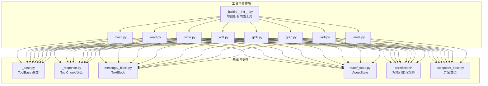
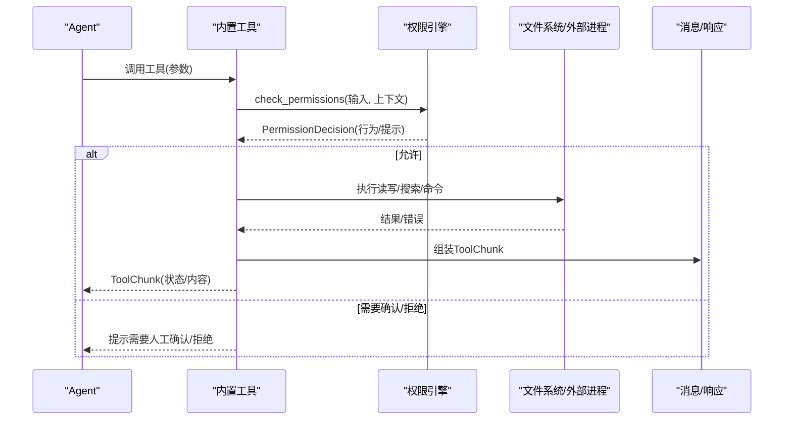
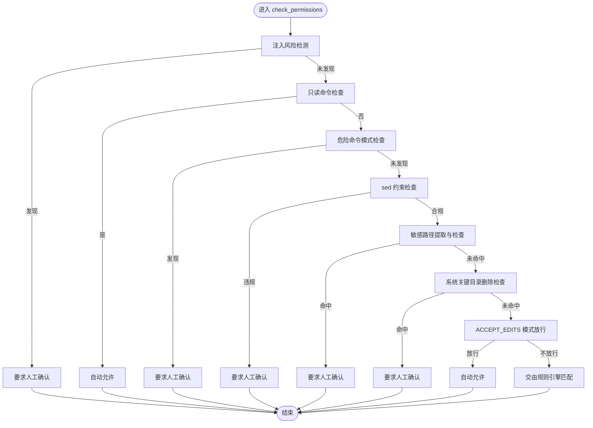
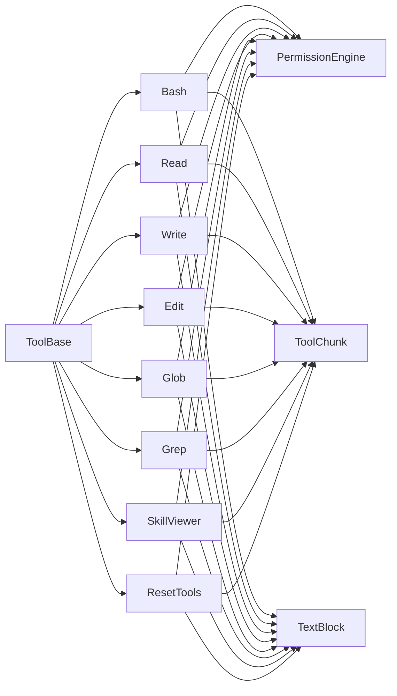

# 内置工具

<cite>
**本文引用的文件**
- [src/agentscope/tool/_builtin/__init__.py](file://src/agentscope/tool/_builtin/__init__.py)
- [src/agentscope/tool/_builtin/_bash.py](file://src/agentscope/tool/_builtin/_bash.py)
- [src/agentscope/tool/_builtin/_read.py](file://src/agentscope/tool/_builtin/_read.py)
- [src/agentscope/tool/_builtin/_write.py](file://src/agentscope/tool/_builtin/_write.py)
- [src/agentscope/tool/_builtin/_edit.py](file://src/agentscope/tool/_builtin/_edit.py)
- [src/agentscope/tool/_builtin/_glob.py](file://src/agentscope/tool/_builtin/_glob.py)
- [src/agentscope/tool/_builtin/_grep.py](file://src/agentscope/tool/_builtin/_grep.py)
- [src/agentscope/tool/_builtin/_skill.py](file://src/agentscope/tool/_builtin/_skill.py)
- [src/agentscope/tool/_builtin/_meta.py](file://src/agentscope/tool/_builtin/_meta.py)
- [src/agentscope/tool/_base.py](file://src/agentscope/tool/_base.py)
- [src/agentscope/tool/_response.py](file://src/agentscope/tool/_response.py)
- [src/agentscope/message/_block.py](file://src/agentscope/message/_block.py)
- [src/agentscope/state/_state.py](file://src/agentscope/state/_state.py)
- [src/agentscope/permission/_engine.py](file://src/agentscope/permission/_engine.py)
- [src/agentscope/permission/_types.py](file://src/agentscope/permission/_types.py)
- [src/agentscope/exception/_base.py](file://src/agentscope/exception/_base.py)
- [tests/builtin_bash_test.py](file://tests/builtin_bash_test.py)
- [tests/builtin_read_test.py](file://tests/builtin_read_test.py)
- [tests/builtin_write_test.py](file://tests/builtin_write_test.py)
- [tests/builtin_edit_test.py](file://tests/builtin_edit_test.py)
- [tests/builtin_glob_test.py](file://tests/builtin_glob_test.py)
- [tests/builtin_grep_test.py](file://tests/builtin_grep_test.py)
</cite>

## 目录
1. [简介](#简介)
2. [项目结构](#项目结构)
3. [核心组件](#核心组件)
4. [架构总览](#架构总览)
5. [详细组件分析](#详细组件分析)
6. [依赖关系分析](#依赖关系分析)
7. [性能考量](#性能考量)
8. [故障排查指南](#故障排查指南)
9. [结论](#结论)
10. [附录](#附录)

## 简介
本文件系统性梳理 AgentScope 的内置工具集，覆盖以下工具：Bash、Read、Write、Edit、Glob、Grep、Skill（SkillViewer）、Meta（ResetTools）。内容包括：
- 功能特性与使用场景
- 安全机制与权限控制
- API 接口定义（参数、返回值、错误处理）
- 实际使用示例与最佳实践
- 架构与数据流图示

## 项目结构
内置工具位于工具子模块中，统一通过导出入口暴露给上层使用。

图表来源
- [src/agentscope/tool/_builtin/__init__.py:1-24](file://src/agentscope/tool/_builtin/__init__.py#L1-L24)
- [src/agentscope/tool/_builtin/_bash.py:41-151](file://src/agentscope/tool/_builtin/_bash.py#L41-L151)
- [src/agentscope/tool/_builtin/_read.py:21-70](file://src/agentscope/tool/_builtin/_read.py#L21-L70)
- [src/agentscope/tool/_builtin/_write.py:27-64](file://src/agentscope/tool/_builtin/_write.py#L27-L64)
- [src/agentscope/tool/_builtin/_edit.py:26-86](file://src/agentscope/tool/_builtin/_edit.py#L26-L86)
- [src/agentscope/tool/_builtin/_glob.py:19-56](file://src/agentscope/tool/_builtin/_glob.py#L19-L56)
- [src/agentscope/tool/_builtin/_grep.py:42-158](file://src/agentscope/tool/_builtin/_grep.py#L42-L158)
- [src/agentscope/tool/_builtin/_skill.py:18-58](file://src/agentscope/tool/_builtin/_skill.py#L18-L58)
- [src/agentscope/tool/_builtin/_meta.py:21-46](file://src/agentscope/tool/_builtin/_meta.py#L21-L46)

章节来源
- [src/agentscope/tool/_builtin/__init__.py:1-24](file://src/agentscope/tool/_builtin/__init__.py#L1-L24)

## 核心组件
- 工具基类：所有内置工具均继承自通用基类，具备统一的生命周期、权限检查、规则匹配与建议生成能力。
- 权限系统：内置工具在执行前进行权限决策，结合权限模式（如 ACCEPT_EDITS）与规则匹配实现细粒度控制。
- 消息与响应：工具输出统一包装为消息块与工具响应状态，便于前端渲染与会话管理。
- 状态注入：部分工具可访问 AgentState，以实现缓存、上下文感知等能力。

章节来源
- [src/agentscope/tool/_base.py](file://src/agentscope/tool/_base.py)
- [src/agentscope/tool/_response.py](file://src/agentscope/tool/_response.py)
- [src/agentscope/message/_block.py](file://src/agentscope/message/_block.py)
- [src/agentscope/state/_state.py](file://src/agentscope/state/_state.py)
- [src/agentscope/permission/_engine.py](file://src/agentscope/permission/_engine.py)
- [src/agentscope/permission/_types.py](file://src/agentscope/permission/_types.py)

## 架构总览
内置工具的调用链路如下：Agent 发起调用 → 工具执行权限检查 → 规则匹配或模式放行 → 执行具体逻辑 → 返回 ToolChunk 结果。

图表来源
- [src/agentscope/tool/_builtin/_bash.py:181-319](file://src/agentscope/tool/_builtin/_bash.py#L181-L319)
- [src/agentscope/tool/_builtin/_read.py:89-103](file://src/agentscope/tool/_builtin/_read.py#L89-L103)
- [src/agentscope/tool/_builtin/_write.py:91-146](file://src/agentscope/tool/_builtin/_write.py#L91-L146)
- [src/agentscope/tool/_builtin/_edit.py:113-168](file://src/agentscope/tool/_builtin/_edit.py#L113-L168)
- [src/agentscope/tool/_builtin/_glob.py:61-74](file://src/agentscope/tool/_builtin/_glob.py#L61-L74)
- [src/agentscope/tool/_builtin/_grep.py:164-173](file://src/agentscope/tool/_builtin/_grep.py#L164-L173)
- [src/agentscope/tool/_builtin/_skill.py:75-84](file://src/agentscope/tool/_builtin/_skill.py#L75-L84)
- [src/agentscope/tool/_builtin/_meta.py:77-86](file://src/agentscope/tool/_builtin/_meta.py#L77-L86)

## 详细组件分析

### Bash 工具
- 功能概述
  - 在受控环境中执行 Bash 命令，支持超时、输出截断、分片流式输出。
  - 内置多级安全检查：注入风险检测、只读命令白名单、危险命令模式、sed 约束、敏感路径、系统关键目录删除保护、ACCEPT_EDITS 模式放行。
  - 支持基于规则的通配符匹配与建议生成。
- 关键参数
  - command: 必填，待执行的 Bash 命令字符串。
  - description: 可选，简要描述命令用途。
  - timeout: 可选，毫秒，默认 120000，最大 600000。
- 返回值
  - ToolChunk，状态为运行中（成功）或错误（失败/超时），内容为文本块。
- 错误处理
  - 命令失败：组合 stdout/stderr 并截断上限。
  - 超时：抛出超时错误。
  - 异常：捕获并返回错误信息。
- 安全机制
  - 注入风险检测：静态解析命令，识别动态扩展结构。
  - 危险命令模式：禁止高危命令组合。
  - sed 约束：禁止对敏感文件进行就地修改。
  - 敏感路径检测：针对配置文件/目录进行拦截。
  - 系统关键目录删除保护：禁止删除根、家目录、子关键目录等。
  - ACCEPT_EDITS 模式：允许工作目录内的文件系统操作。
- 使用示例
  - 读取当前目录文件列表：使用 ls/grep/cat 等专用工具替代 Bash。
  - 复杂任务：将多个独立命令并行调用，或将相关命令用 && 连接。
- 最佳实践
  - 优先使用专用工具（Glob/Grep/Read/Edit/Write）。
  - 对含空格路径加双引号；尽量使用绝对路径。
  - 合理设置 timeout；避免不必要的 sleep。
  - Git 操作避免破坏性操作，必要时先备份。

图表来源
- [src/agentscope/tool/_builtin/_bash.py:181-319](file://src/agentscope/tool/_builtin/_bash.py#L181-L319)

章节来源
- [src/agentscope/tool/_builtin/_bash.py:41-697](file://src/agentscope/tool/_builtin/_bash.py#L41-L697)

### Read 工具
- 功能概述
  - 读取本地文件内容，支持偏移与限制（默认最多 2000 行），按行编号输出。
  - 支持图片/PDF 等二进制文件的可视化呈现。
  - 支持 PDF 分页读取（大文件需指定页码范围）。
- 关键参数
  - file_path: 必填，绝对路径。
  - offset: 可选，从第 1 行开始的行号，默认 1。
  - limit: 可选，最大读取行数，默认 2000，最大 2000。
- 返回值
  - ToolChunk，状态为运行中，内容为带行号的文本。
- 错误处理
  - 非绝对路径：错误。
  - 文件不存在：错误。
  - 路径为目录：错误。
  - 读取异常：错误。
- 安全机制
  - 仅读取，无写入风险；EXPLORE 模式下由引擎处理自动允许。
- 使用示例
  - 读取源代码文件：直接提供绝对路径与默认参数。
  - 读取长文件片段：设置 offset 与 limit。
- 最佳实践
  - 优先使用绝对路径。
  - 长文件分段读取，避免一次性传输过多内容。

章节来源
- [src/agentscope/tool/_builtin/_read.py:21-276](file://src/agentscope/tool/_builtin/_read.py#L21-L276)

### Write 工具
- 功能概述
  - 将内容写入文件，覆盖既有文件；若目标文件已存在且未被读取过，则会报错。
  - 支持工作目录内文件的 ACCEPT_EDITS 模式放行。
- 关键参数
  - file_path: 必填，绝对路径。
  - content: 必填，写入内容。
- 返回值
  - ToolChunk，状态为运行中，包含写入行数统计。
- 错误处理
  - 非绝对路径：错误。
  - 目标文件存在但未读取：错误。
  - 写入异常：错误。
- 安全机制
  - 敏感路径检测：命中敏感文件/目录需人工确认。
  - ACCEPT_EDITS 模式：允许工作目录内文件写入。
- 使用示例
  - 编辑现有文件：先 Read，再 Write。
  - 新增文件：仅在明确需求下创建，避免随意新增文档。
- 最佳实践
  - 修改前务必先 Read，确保上下文一致。
  - 严格限定工作目录范围。

章节来源
- [src/agentscope/tool/_builtin/_write.py:27-317](file://src/agentscope/tool/_builtin/_write.py#L27-L317)

### Edit 工具
- 功能概述
  - 在文件中执行精确字符串替换，支持单次或全部替换。
  - 要求目标文件必须先被读取过，否则报错。
- 关键参数
  - file_path: 必填，绝对路径。
  - old_string: 必填，精确旧字符串（包含缩进与空白）。
  - new_string: 必填，新字符串。
  - replace_all: 可选，是否替换全部，默认 False。
- 返回值
  - ToolChunk，状态为运行中，包含替换次数说明。
- 错误处理
  - 非绝对路径：错误。
  - 文件不存在：错误。
  - old_string 与 new_string 相同：错误。
  - 未读取文件：错误。
  - 未找到 old_string：错误。
  - 多处出现且未开启 replace_all：错误。
  - 写入异常：错误。
- 安全机制
  - 敏感路径检测：命中敏感文件/目录需人工确认。
  - ACCEPT_EDITS 模式：允许工作目录内文件编辑。
- 使用示例
  - 替换单个唯一出现的字符串：默认即可。
  - 替换全部：设置 replace_all=true。
- 最佳实践
  - 保持 Read 输出中的行号前缀格式，避免包含行号前缀参与匹配。
  - 使 old_string 具备足够上下文，避免多处匹配。

章节来源
- [src/agentscope/tool/_builtin/_edit.py:26-433](file://src/agentscope/tool/_builtin/_edit.py#L26-L433)

### Glob 工具
- 功能概述
  - 基于 glob 模式快速匹配文件，支持递归与排序（按修改时间倒序）。
- 关键参数
  - pattern: 必填，glob 模式（如 **/*.py）。
  - path: 可选，搜索起始目录，默认当前工作目录。
- 返回值
  - ToolChunk，状态为运行中，内容为匹配到的文件路径列表（每行一个）。
- 错误处理
  - 起始目录不存在：错误。
  - 无匹配：返回空结果。
- 安全机制
  - 仅读取，无写入风险。
- 使用示例
  - 查找所有 Python 文件：pattern 设置为 **/*.py。
  - 限定搜索范围：path 指定 src 目录。
- 最佳实践
  - 使用 ** 递归匹配时注意性能，配合更具体的模式减少扫描范围。

章节来源
- [src/agentscope/tool/_builtin/_glob.py:19-317](file://src/agentscope/tool/_builtin/_glob.py#L19-L317)

### Grep 工具
- 功能概述
  - 基于 ripgrep 的强大搜索工具，支持正则、文件类型过滤、上下文行、大小写忽略、多行模式、结果限制与偏移。
  - 自动排除版本控制目录，限制单行最大长度。
- 关键参数
  - pattern: 必填，正则表达式。
  - path: 可选，搜索目录或文件，默认当前工作目录。
  - output_mode: 可选，content/files_with_matches/count，默认 files_with_matches。
  - glob/type: 可选，文件过滤器。
  - i/case_insensitive: 可选，大小写忽略。
  - multiline: 可选，多行模式。
  - context/-A/-B/-C/n: 可选，上下文与行号显示。
  - head_limit/offset: 可选，结果数量限制与偏移。
- 返回值
  - ToolChunk，状态为运行中，内容为搜索结果（按模式不同而异）。
- 错误处理
  - 未安装 ripgrep：错误。
  - 搜索超时：错误（返回部分结果提示）。
  - ripgrep 返回非零：错误。
  - 无匹配：返回空结果。
- 安全机制
  - 仅读取，无写入风险。
- 使用示例
  - 搜索函数定义：pattern 使用正则，output_mode 设为 content。
  - 仅列出含匹配的文件：output_mode 设为 files_with_matches。
- 最佳实践
  - 优先使用 Grep 替代 Bash 中的 grep/rg。
  - 合理设置 head_limit 与 offset，避免大量结果导致上下文膨胀。

章节来源
- [src/agentscope/tool/_builtin/_grep.py:42-465](file://src/agentscope/tool/_builtin/_grep.py#L42-L465)

### Skill（SkillViewer）工具
- 功能概述
  - 查看当前激活的技能详情，用于任务匹配与能力检索。
- 关键参数
  - skill: 必填，技能名称。
- 返回值
  - ToolChunk，状态为运行中，内容为技能的 Markdown 描述。
- 错误处理
  - 未提供 AgentState：开发者异常。
  - 技能不存在：错误。
- 安全机制
  - 仅读取，无写入风险。
- 使用示例
  - 当用户请求特定任务时，先用 Skill 查看可用技能描述，再决定是否调用。
- 最佳实践
  - 通过 Skill 工具了解可用能力，避免盲目调用未知工具。

章节来源
- [src/agentscope/tool/_builtin/_skill.py:18-124](file://src/agentscope/tool/_builtin/_skill.py#L18-L124)

### Meta（ResetTools）工具
- 功能概述
  - 动态重置工具组的启用状态，按任务需求激活/停用，返回各组使用说明。
- 关键参数
  - 动态生成：每个工具组名对应一个布尔字段，True 表示激活该组。
- 返回值
  - ToolChunk，状态为运行中，内容为模板化后的使用说明。
- 错误处理
  - 未提供 AgentState：开发者异常。
  - 参数类型非法：错误。
- 安全机制
  - 仅控制工具组状态，无直接文件/命令操作。
- 使用示例
  - 任务切换：先停用不需要的组，再激活当前任务所需的组。
- 最佳实践
  - 任务完成后及时停用不再使用的工具组，节省上下文空间。

章节来源
- [src/agentscope/tool/_builtin/_meta.py:21-129](file://src/agentscope/tool/_builtin/_meta.py#L21-L129)

## 依赖关系分析
- 工具与基类：所有内置工具继承自 ToolBase，复用统一的生命周期与接口规范。
- 权限系统：工具在执行前调用权限检查，结合 PermissionEngine 的规则与模式进行决策。
- 消息与状态：工具输出统一封装为 ToolChunk，配合消息块与状态枚举，便于前端渲染。
- 外部依赖：Grep 依赖 ripgrep；Bash 依赖系统 shell 与子进程；Read/Write/Edit 依赖文件系统。

图表来源
- [src/agentscope/tool/_base.py](file://src/agentscope/tool/_base.py)
- [src/agentscope/tool/_builtin/_bash.py:41-151](file://src/agentscope/tool/_builtin/_bash.py#L41-L151)
- [src/agentscope/tool/_builtin/_read.py:21-70](file://src/agentscope/tool/_builtin/_read.py#L21-L70)
- [src/agentscope/tool/_builtin/_write.py:27-64](file://src/agentscope/tool/_builtin/_write.py#L27-L64)
- [src/agentscope/tool/_builtin/_edit.py:26-86](file://src/agentscope/tool/_builtin/_edit.py#L26-L86)
- [src/agentscope/tool/_builtin/_glob.py:19-56](file://src/agentscope/tool/_builtin/_glob.py#L19-L56)
- [src/agentscope/tool/_builtin/_grep.py:42-158](file://src/agentscope/tool/_builtin/_grep.py#L42-L158)
- [src/agentscope/tool/_builtin/_skill.py:18-58](file://src/agentscope/tool/_builtin/_skill.py#L18-L58)
- [src/agentscope/tool/_builtin/_meta.py:21-46](file://src/agentscope/tool/_builtin/_meta.py#L21-L46)

## 性能考量
- Bash
  - 默认超时 120 秒，最大 600 秒；合理设置 timeout，避免长时间阻塞。
  - 输出截断上限约 30000 字符，防止大输出拖慢会话。
- Read
  - 默认最多读取 2000 行，长文件建议分段读取。
  - 支持缓存，首次读取后可复用以提升性能。
- Write/Edit
  - 仅覆盖写入，避免频繁小改动；批量修改优于多次小改。
- Glob
  - 递归匹配可能带来大量 IO，建议缩小搜索范围或使用更具体的模式。
- Grep
  - 依赖 ripgrep，性能优异；合理设置 head_limit 与过滤条件。
- Skill/ResetTools
  - 仅内存操作，性能开销极低。

## 故障排查指南
- Bash
  - 注入风险：命令包含动态扩展结构会被拦截，建议改用专用工具或简化命令。
  - 危险命令：如 rm、chmod 等被识别为高危，需人工确认。
  - 敏感路径：对敏感文件/目录的操作会被拦截。
  - 系统关键目录删除：删除根、家目录等会被拒绝。
  - ACCEPT_EDITS：工作目录内文件系统操作可自动放行。
- Read
  - 非绝对路径：请修正为绝对路径。
  - 文件不存在：确认路径正确或先创建文件。
  - 目录：请传入文件路径而非目录。
- Write
  - 未读取文件：先调用 Read 获取上下文。
  - 非绝对路径：请修正为绝对路径。
- Edit
  - 未读取文件：先调用 Read。
  - old_string 未找到：确认内容与上下文。
  - 多处出现：设置 replace_all=true 或提高匹配精度。
- Glob
  - 起始目录不存在：检查 path 是否正确。
- Grep
  - 未安装 ripgrep：根据提示安装。
  - 搜索超时：缩小范围或优化 pattern。
- Skill/ResetTools
  - 未提供 AgentState：确保调用时注入状态。
  - 参数类型错误：确保布尔值传入正确。

章节来源
- [src/agentscope/tool/_builtin/_bash.py:181-319](file://src/agentscope/tool/_builtin/_bash.py#L181-L319)
- [src/agentscope/tool/_builtin/_read.py:170-276](file://src/agentscope/tool/_builtin/_read.py#L170-L276)
- [src/agentscope/tool/_builtin/_write.py:259-317](file://src/agentscope/tool/_builtin/_write.py#L259-L317)
- [src/agentscope/tool/_builtin/_edit.py:281-433](file://src/agentscope/tool/_builtin/_edit.py#L281-L433)
- [src/agentscope/tool/_builtin/_glob.py:266-317](file://src/agentscope/tool/_builtin/_glob.py#L266-L317)
- [src/agentscope/tool/_builtin/_grep.py:300-465](file://src/agentscope/tool/_builtin/_grep.py#L300-L465)
- [src/agentscope/tool/_builtin/_skill.py:86-124](file://src/agentscope/tool/_builtin/_skill.py#L86-L124)
- [src/agentscope/tool/_builtin/_meta.py:88-129](file://src/agentscope/tool/_builtin/_meta.py#L88-L129)

## 结论
AgentScope 的内置工具以“专用工具优先、安全可控”为核心设计原则，通过严格的权限检查、规则匹配与模式放行，确保在开放交互场景下的安全性与易用性。建议在日常使用中优先采用 Read/Glob/Grep/Edit/Write 等专用工具，并在确有必要时才使用 Bash；同时合理利用 Skill 与 ResetTools 管理工具组，提升任务执行效率与安全性。

## 附录
- 测试参考
  - Bash：[tests/builtin_bash_test.py](file://tests/builtin_bash_test.py)
  - Read：[tests/builtin_read_test.py](file://tests/builtin_read_test.py)
  - Write：[tests/builtin_write_test.py](file://tests/builtin_write_test.py)
  - Edit：[tests/builtin_edit_test.py](file://tests/builtin_edit_test.py)
  - Glob：[tests/builtin_glob_test.py](file://tests/builtin_glob_test.py)
  - Grep：[tests/builtin_grep_test.py](file://tests/builtin_grep_test.py)