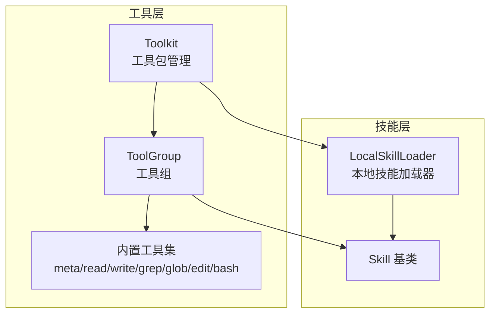
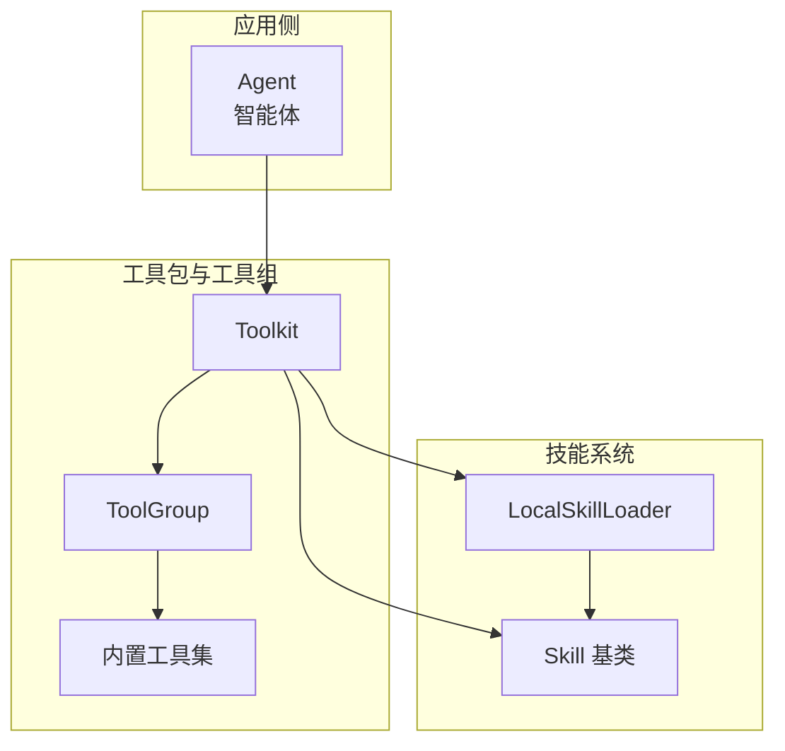
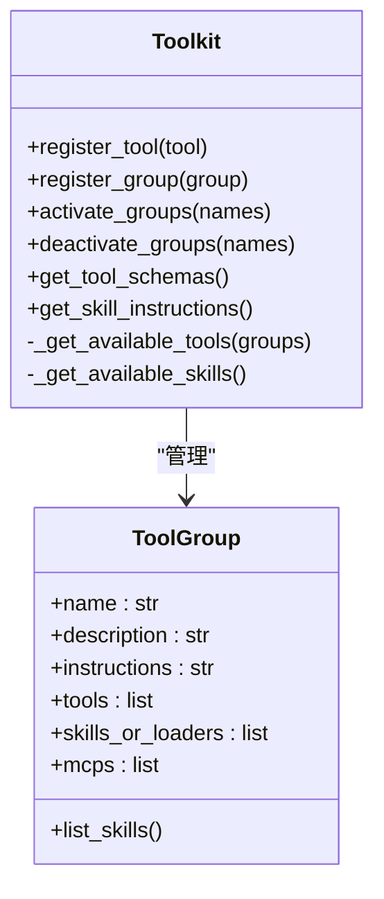
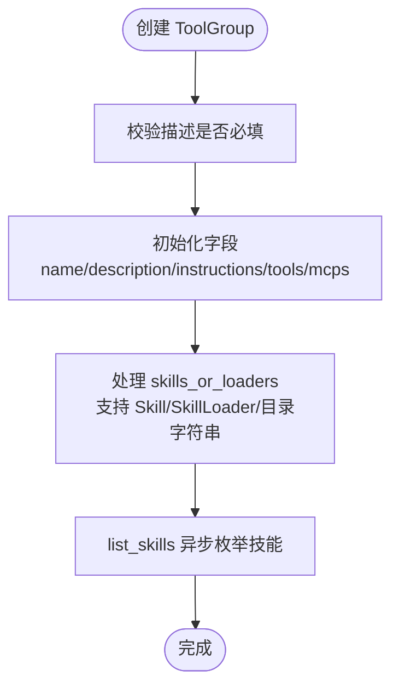
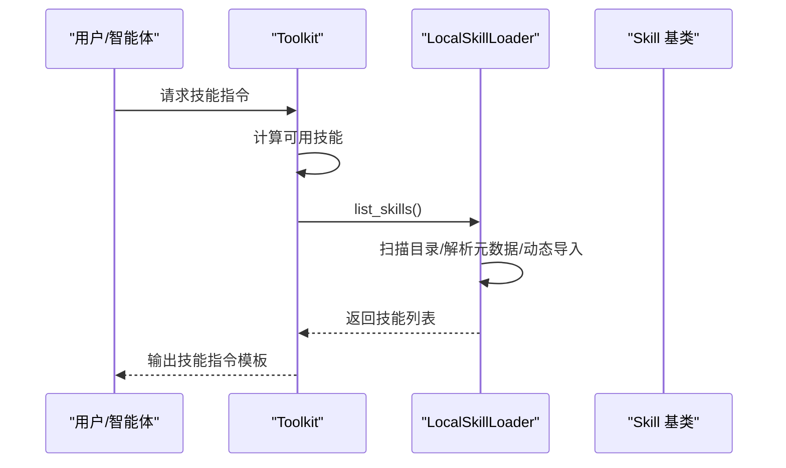
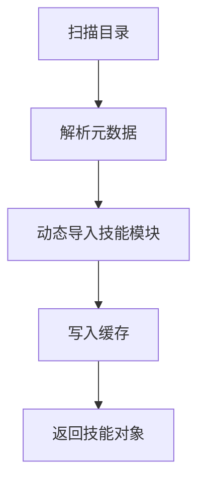
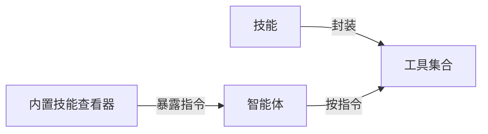
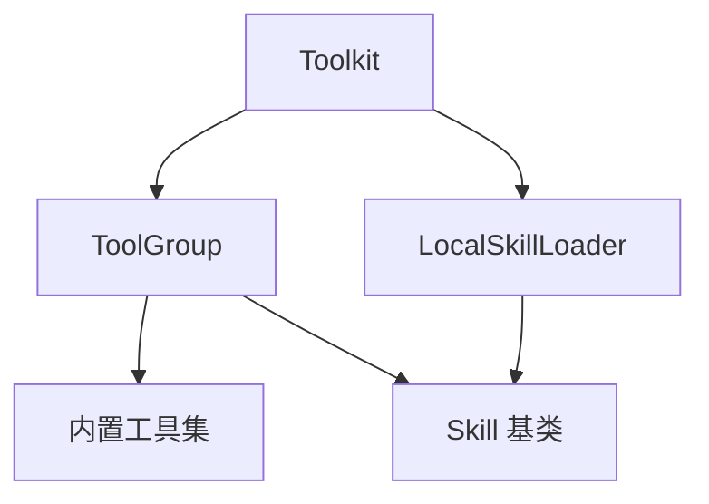

# 工具包管理

<cite>
**本文引用的文件**
- [toolkit.py](file://src/agentscope/tool/_toolkit.py)
- [tool_group.py](file://src/agentscope/tool/_tool_group.py)
- [skill_base.py](file://src/agentscope/skill/_base.py)
- [local_loader.py](file://src/agentscope/skill/_local_loader.py)
- [builtin_skill.py](file://src/agentscope/tool/_builtin/_skill.py)
- [builtin_meta.py](file://src/agentscope/tool/_builtin/_meta.py)
- [builtin_read.py](file://src/agentscope/tool/_builtin/_read.py)
- [builtin_write.py](file://src/agentscope/tool/_builtin/_write.py)
- [builtin_grep.py](file://src/agentscope/tool/_builtin/_grep.py)
- [builtin_glob.py](file://src/agentscope/tool/_builtin/_glob.py)
- [builtin_edit.py](file://src/agentscope/tool/_builtin/_edit.py)
- [builtin_bash.py](file://src/agentscope/tool/_builtin/_bash.py)
- [toolkit_test.py](file://tests/toolkit_test.py)
- [toolkit_skill_test.py](file://tests/toolkit_skill_test.py)
</cite>

## 目录
1. [简介](#简介)
2. [项目结构](#项目结构)
3. [核心组件](#核心组件)
4. [架构总览](#架构总览)
5. [详细组件分析](#详细组件分析)
6. [依赖关系分析](#依赖关系分析)
7. [性能考虑](#性能考虑)
8. [故障排除指南](#故障排除指南)
9. [结论](#结论)
10. [附录](#附录)

## 简介
本文件面向工具包与技能管理系统，围绕以下目标展开：深入解析 Toolkit 类的设计理念与使用方法，涵盖工具的组合、分组与批量管理；说明 ToolGroup 的功能特性，包括工具集合的创建、查询与操作；阐述技能（Skill）系统的架构，包括技能的定义、加载、执行与缓存机制；解释本地技能加载器的工作原理，包括文件扫描、元数据提取与动态导入；阐明技能与工具的关系，展示技能如何封装复杂的工具组合；给出工具包与技能在多智能体协作、复杂任务分解与自动化流程中的实际应用场景，并提供最佳实践与性能优化建议。

## 项目结构
工具包与技能管理相关的核心代码位于 src/agentscope/tool 与 src/agentscope/skill 目录中，测试用例位于 tests 目录。关键模块包括：
- 工具包与工具组：toolkit.py、tool_group.py
- 技能系统：skill_base.py、local_loader.py
- 内置工具：builtin_skill.py、builtin_meta.py 及各类内置工具（如 _read、_write、_grep、_glob、_edit、_bash）
- 测试：toolkit_test.py、toolkit_skill_test.py

图表来源
- [toolkit.py](file://src/agentscope/tool/_toolkit.py)
- [tool_group.py](file://src/agentscope/tool/_tool_group.py)
- [skill_base.py](file://src/agentscope/skill/_base.py)
- [local_loader.py](file://src/agentscope/skill/_local_loader.py)

章节来源
- [toolkit.py](file://src/agentscope/tool/_toolkit.py)
- [tool_group.py](file://src/agentscope/tool/_tool_group.py)
- [skill_base.py](file://src/agentscope/skill/_base.py)
- [local_loader.py](file://src/agentscope/skill/_local_loader.py)

## 核心组件
- Toolkit：统一注册、管理与删除工具函数、MCP 客户端、Agent 技能的中心模块。支持基于工具组的激活/停用、工具函数 JSON 模式自动解析、动态扩展模式、内置技能查看器与元工具等。
- ToolGroup：一组相关工具、MCP 与技能的集合，支持序列化与生命周期管理，通过 ResetTools 元工具进行激活/停用。
- Skill 系统：由 Skill 基类与本地加载器组成，负责技能的定义、发现、加载与执行；支持缓存与异步列表能力。
- 内置工具：提供文件读写、搜索、匹配、编辑、脚本执行等基础能力，作为工具组的基础构件。

章节来源
- [toolkit.py](file://src/agentscope/tool/_toolkit.py)
- [tool_group.py](file://src/agentscope/tool/_tool_group.py)
- [skill_base.py](file://src/agentscope/skill/_base.py)
- [local_loader.py](file://src/agentscope/skill/_local_loader.py)

## 架构总览
下图展示了工具包、工具组、技能与内置工具之间的交互关系，以及 Toolkit 如何聚合这些组件以提供统一的可用工具集与技能指令。

图表来源
- [toolkit.py](file://src/agentscope/tool/_toolkit.py)
- [tool_group.py](file://src/agentscope/tool/_tool_group.py)
- [skill_base.py](file://src/agentscope/skill/_base.py)
- [local_loader.py](file://src/agentscope/skill/_local_loader.py)

## 详细组件分析

### Toolkit 设计与使用
- 组合与分组：Toolkit 聚合多个 ToolGroup，每个 ToolGroup 可包含工具、MCP 与技能。默认存在名为 "basic" 的特殊工具组，始终激活。
- 批量管理：通过工具组的激活/停用实现批量工具的启用与禁用；同时维护内置技能查看器与元工具，用于技能与工具的统一呈现。
- 动态模式扩展：支持从工具函数 docstring 自动解析 JSON 模式，并可使用 Pydantic BaseModel 动态扩展模式。
- 技能指令生成：根据已注册技能生成技能指令模板，指导智能体正确调用技能查看器以获取技能详情。
- 可用工具选择：根据当前激活的工具组计算可用工具集合，确保 "basic" 组始终可用，并在有工具组注册时包含内置 meta 工具。

图表来源
- [toolkit.py](file://src/agentscope/tool/_toolkit.py)
- [tool_group.py](file://src/agentscope/tool/_tool_group.py)

章节来源
- [toolkit.py](file://src/agentscope/tool/_toolkit.py)

### ToolGroup 功能特性
- 创建：构造时校验非 "basic" 组必须提供描述；支持直接传入工具、MCP 与技能或技能加载器（含字符串目录路径，将被包装为本地加载器）。
- 查询：list_skills 异步枚举技能或加载器中的技能，统一输出 Skill 列表。
- 操作：与 Toolkit 协作完成激活/停用与工具集合的合并。

图表来源
- [tool_group.py](file://src/agentscope/tool/_tool_group.py)

章节来源
- [tool_group.py](file://src/agentscope/tool/_tool_group.py)

### 技能系统架构
- Skill 基类：定义技能的抽象接口与通用属性（名称、描述、目录等），为具体技能实现提供契约。
- 本地加载器：实现从本地目录扫描、解析与动态导入技能的能力，支持异步列出技能清单。
- 缓存机制：加载器内部维护缓存，避免重复扫描与导入，提升性能。
- 执行链路：技能通过 Toolkit 注册后，由内置技能查看器向智能体暴露技能指令，智能体再调用相应工具完成任务。

图表来源
- [toolkit.py](file://src/agentscope/tool/_toolkit.py)
- [local_loader.py](file://src/agentscope/skill/_local_loader.py)
- [skill_base.py](file://src/agentscope/skill/_base.py)

章节来源
- [skill_base.py](file://src/agentscope/skill/_base.py)
- [local_loader.py](file://src/agentscope/skill/_local_loader.py)
- [toolkit.py](file://src/agentscope/tool/_toolkit.py)

### 本地技能加载器工作原理
- 文件扫描：遍历指定目录，识别技能文件与元数据文件。
- 元数据提取：解析技能描述、入口函数、依赖等信息。
- 动态导入：使用 Python 动态导入机制加载技能模块，实例化技能对象。
- 缓存策略：对已扫描的目录与已导入的技能进行缓存，减少重复 I/O 与导入开销。

图表来源
- [local_loader.py](file://src/agentscope/skill/_local_loader.py)

章节来源
- [local_loader.py](file://src/agentscope/skill/_local_loader.py)

### 技能与工具的关系
- 封装复杂组合：技能可封装多个工具与资源，形成“工具+上下文”的复合能力单元。
- 指令驱动：智能体不直接调用技能，而是通过内置技能查看器读取技能指令，再按指令调用工具完成任务。
- 统一呈现：Toolkit 将技能与工具统一纳入可用工具集，保证智能体在一次对话中获得一致的工具调用体验。

图表来源
- [toolkit.py](file://src/agentscope/tool/_toolkit.py)
- [builtin_skill.py](file://src/agentscope/tool/_builtin/_skill.py)

章节来源
- [toolkit.py](file://src/agentscope/tool/_toolkit.py)
- [builtin_skill.py](file://src/agentscope/tool/_builtin/_skill.py)

### 实际应用场景
- 多智能体协作：通过 ToolGroup 将不同领域的工具集分配给不同角色智能体，借助技能封装跨域能力，实现分工协作。
- 复杂任务分解：将大任务拆分为若干子任务，每个子任务对应一个技能，技能内部组合多个工具，由智能体按需调用。
- 自动化流程：将重复性流程固化为技能，结合工具组的批量管理，实现端到端自动化。

（本节为概念性说明，无需引用具体文件）

## 依赖关系分析
- Toolkit 依赖 ToolGroup、内置工具与技能加载器；ToolGroup 依赖工具基类与技能加载器；技能加载器依赖技能基类。
- 内置工具提供文件系统与命令执行等底层能力，支撑上层工具组与技能的实现。

图表来源
- [toolkit.py](file://src/agentscope/tool/_toolkit.py)
- [tool_group.py](file://src/agentscope/tool/_tool_group.py)
- [local_loader.py](file://src/agentscope/skill/_local_loader.py)
- [skill_base.py](file://src/agentscope/skill/_base.py)

章节来源
- [toolkit.py](file://src/agentscope/tool/_toolkit.py)
- [tool_group.py](file://src/agentscope/tool/_tool_group.py)
- [local_loader.py](file://src/agentscope/skill/_local_loader.py)
- [skill_base.py](file://src/agentscope/skill/_base.py)

## 性能考虑
- 缓存优先：利用技能加载器的缓存机制，避免重复扫描与导入；合理设计工具组的激活策略，减少不必要的工具解析与注册。
- 异步化：充分利用异步列表与异步加载能力，降低阻塞风险；在工具组切换时采用增量更新策略。
- 模式复用：通过统一的 JSON 模式扩展与复用，减少重复解析成本；对常用工具的模式进行预热。
- I/O 优化：内置工具尽量使用内存级操作（如文件读写缓存），减少磁盘访问频率。

（本节提供通用建议，无需引用具体文件）

## 故障排除指南
- 工具组描述缺失：非 "basic" 组在创建时必须提供描述，否则会抛出参数错误异常。
- 技能加载失败：检查技能目录结构与元数据文件格式；确认动态导入所需的模块路径与依赖项完整。
- 工具不可用：确认工具组已激活；检查内置 meta 工具与技能查看器是否正常注册。
- 性能问题：开启缓存并定期清理过期缓存；避免频繁切换工具组导致的重复解析。

章节来源
- [tool_group.py](file://src/agentscope/tool/_tool_group.py)
- [local_loader.py](file://src/agentscope/skill/_local_loader.py)
- [toolkit.py](file://src/agentscope/tool/_toolkit.py)

## 结论
工具包与技能管理系统通过 Toolkit 的统一编排、ToolGroup 的分组管理、技能加载器的动态发现与缓存机制，实现了工具与技能的有机融合。该体系既满足了多智能体协作与复杂任务分解的需求，又提供了良好的扩展性与性能保障。实践中应重视工具组的合理划分、技能的模块化封装与缓存策略的配置，以获得更稳定高效的运行效果。

## 附录
- 测试参考：可通过 toolkit_test.py 与 toolkit_skill_test.py 中的用例验证工具包与技能的集成行为与边界条件。

章节来源
- [toolkit_test.py](file://tests/toolkit_test.py)
- [toolkit_skill_test.py](file://tests/toolkit_skill_test.py)