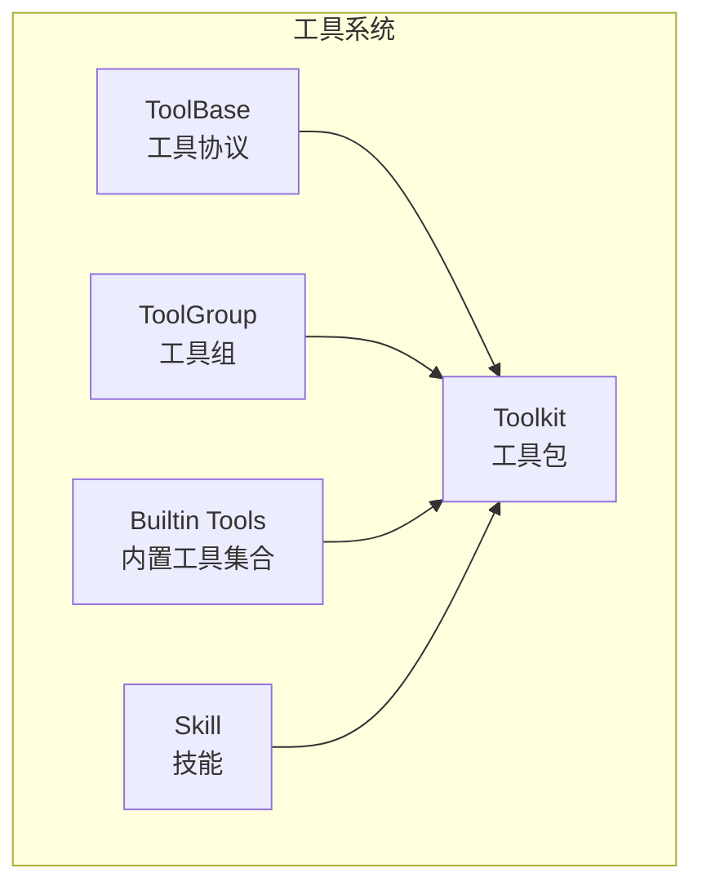
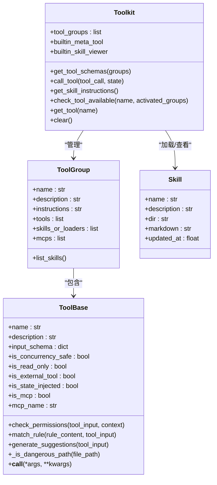
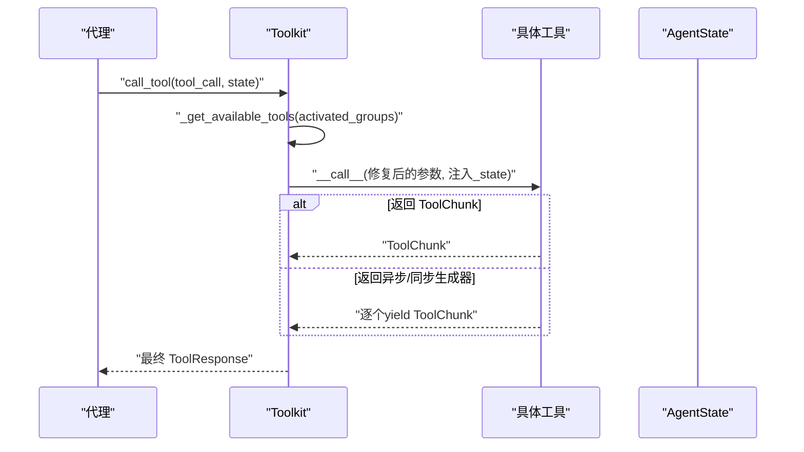
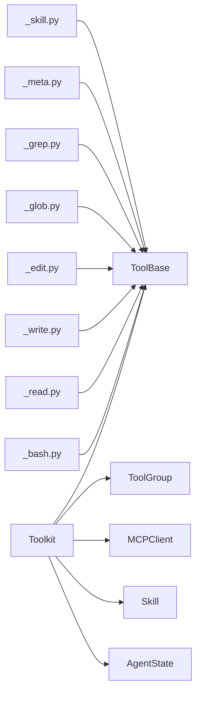

# 工具系统

<cite>
**本文引用的文件**
- [tool/__init__.py](file://src/agentscope/tool/__init__.py)
- [tool/_base.py](file://src/agentscope/tool/_base.py)
- [tool/_toolkit.py](file://src/agentscope/tool/_toolkit.py)
- [tool/_tool_group.py](file://src/agentscope/tool/_tool_group.py)
- [tool/_builtin/__init__.py](file://src/agentscope/tool/_builtin/__init__.py)
- [tool/_builtin/_meta.py](file://src/agentscope/tool/_builtin/_meta.py)
- [tool/_builtin/_skill.py](file://src/agentscope/tool/_builtin/_skill.py)
- [tool/_builtin/_bash.py](file://src/agentscope/tool/_builtin/_bash.py)
- [tool/_builtin/_read.py](file://src/agentscope/tool/_builtin/_read.py)
- [tool/_builtin/_write.py](file://src/agentscope/tool/_builtin/_write.py)
- [tool/_builtin/_edit.py](file://src/agentscope/tool/_builtin/_edit.py)
- [tool/_builtin/_glob.py](file://src/agentscope/tool/_builtin/_glob.py)
- [tool/_builtin/_grep.py](file://src/agentscope/tool/_builtin/_grep.py)
- [skill/_base.py](file://src/agentscope/skill/_base.py)
- [skill/_local_loader.py](file://src/agentscope/skill/_local_loader.py)
</cite>

## 目录
1. [简介](#简介)
2. [项目结构](#项目结构)
3. [核心组件](#核心组件)
4. [架构总览](#架构总览)
5. [详细组件分析](#详细组件分析)
6. [依赖分析](#依赖分析)
7. [性能考量](#性能考量)
8. [故障排查指南](#故障排查指南)
9. [结论](#结论)
10. [附录：使用示例与最佳实践](#附录使用示例与最佳实践)

## 简介
本文件系统性梳理 AgentScope 的工具系统，覆盖工具（Tool）的定义、注册、调用与结果处理；内置工具集（Bash、文件读写、文本编辑、全局搜索、内容匹配等）；工具包（Toolkit）与工具组（ToolGroup）的组织方式；技能（Skill）的加载与查看；以及自定义工具开发、权限控制、错误处理与调试技巧。目标是帮助开发者快速理解并高效使用 AgentScope 的工具体系。

## 项目结构
工具系统主要位于 src/agentscope/tool 目录，核心模块包括：
- 工具协议与基类：_base.py
- 工具包与调度：_toolkit.py
- 工具组：_tool_group.py
- 内置工具：_builtin 子包
- 技能系统：skill 包

图示来源
- [tool/_base.py:35-212](file://src/agentscope/tool/_base.py#L35-L212)
- [tool/_toolkit.py:66-602](file://src/agentscope/tool/_toolkit.py#L66-L602)
- [tool/_tool_group.py:10-109](file://src/agentscope/tool/_tool_group.py#L10-L109)
- [tool/_builtin/__init__.py:1-24](file://src/agentscope/tool/_builtin/__init__.py#L1-L24)
- [skill/_base.py:7-30](file://src/agentscope/skill/_base.py#L7-L30)

章节来源
- [tool/__init__.py:1-51](file://src/agentscope/tool/__init__.py#L1-L51)
- [tool/_base.py:35-212](file://src/agentscope/tool/_base.py#L35-L212)
- [tool/_toolkit.py:66-602](file://src/agentscope/tool/_toolkit.py#L66-L602)
- [tool/_tool_group.py:10-109](file://src/agentscope/tool/_tool_group.py#L10-L109)
- [tool/_builtin/__init__.py:1-24](file://src/agentscope/tool/_builtin/__init__.py#L1-L24)
- [skill/_base.py:7-30](file://src/agentscope/skill/_base.py#L7-L30)

## 核心组件
- 工具协议（ToolBase）
  - 定义工具名称、描述、输入模式、并发与只读属性、外部工具标记、状态注入标记、MCP 标记与名称等。
  - 提供权限检查接口 check_permissions、规则匹配 match_rule、建议规则生成 generate_suggestions、危险路径检测 _is_dangerous_path。
  - 统一调用入口 __call__（默认抛出未实现或外部工具不可直接调用异常）。

- 工具包（Toolkit）
  - 负责工具注册、激活/停用、统一调度与结果聚合。
  - 支持多工具组（ToolGroup），内置元工具 ResetTools 与技能查看器 SkillViewer。
  - 提供工具模式生成、工具调用、可用工具查询、技能指令生成等能力。

- 工具组（ToolGroup）
  - 将一组工具、MCP 客户端与技能封装为可激活/停用的逻辑单元。
  - basic 组默认激活，其他组需通过 ResetTools 动态启用。

- 技能（Skill）
  - 技能由 SkillLoaderBase 加载，包含名称、描述、目录、Markdown 内容与更新时间。
  - 通过 SkillViewer 工具在对话中查看技能详情。

章节来源
- [tool/_base.py:35-212](file://src/agentscope/tool/_base.py#L35-L212)
- [tool/_toolkit.py:66-602](file://src/agentscope/tool/_toolkit.py#L66-L602)
- [tool/_tool_group.py:10-109](file://src/agentscope/tool/_tool_group.py#L10-L109)
- [skill/_base.py:7-30](file://src/agentscope/skill/_base.py#L7-L30)

## 架构总览
工具系统采用“协议 + 包装 + 组合”的分层设计：
- 协议层：ToolBase 规范工具行为与权限。
- 组合层：ToolGroup 将工具/MCP/技能聚合。
- 调度层：Toolkit 统一暴露工具模式、执行工具、生成技能提示。
- 内置层：_builtin 提供常用工具与元工具。

图示来源
- [tool/_base.py:35-212](file://src/agentscope/tool/_base.py#L35-L212)
- [tool/_toolkit.py:66-602](file://src/agentscope/tool/_toolkit.py#L66-L602)
- [tool/_tool_group.py:10-109](file://src/agentscope/tool/_tool_group.py#L10-L109)
- [skill/_base.py:7-30](file://src/agentscope/skill/_base.py#L7-L30)

## 详细组件分析

### 工具协议（ToolBase）
- 关键职责
  - 权限检查：check_permissions(tool_input, context) 返回允许/拒绝/放行决策。
  - 规则匹配：match_rule(rule_content, tool_input) 支持 None（工具级匹配）与具体规则。
  - 建议规则：generate_suggestions(tool_input) 为 Read/Write/Edit/Bash/Glob/Grep 等生成合理建议。
  - 危险路径检测：_is_dangerous_path(file_path) 防止对敏感文件/目录的误操作。
  - 统一调用：__call__ 默认抛异常，具体工具实现异步流式返回 ToolChunk 或同步 ToolChunk。

- 设计要点
  - 使用 Pydantic 模型导出 JSON Schema，并移除 title 字段以简化展示。
  - 外部工具（is_external_tool=True）不实现 __call__，由代理产生事件而非直接调用。
  - 状态注入（is_state_injected=True）时，调用时自动注入 _agent_state 参数。

章节来源
- [tool/_base.py:22-212](file://src/agentscope/tool/_base.py#L22-L212)

### 工具包（Toolkit）
- 工具注册与激活
  - 构造时自动创建名为 “basic” 的默认工具组，其余工具组通过 tool_groups 参数传入。
  - 通过 ResetTools 动态切换 activated_groups，仅激活组内的工具可见。

- 工具调用流程
  - 解析 ToolCallBlock 输入，修复 JSON。
  - 注入状态（当工具声明需要状态注入且非 MCP/非外部工具）。
  - 判断返回类型：ToolChunk、异步生成器或同步生成器，统一累积为 ToolResponse。
  - 异常处理：MCP 错误、取消中断、通用异常均转换为 ToolChunk 并标记状态。

- 技能集成
  - 内置 SkillViewer 工具用于查看已激活技能的 Markdown 描述。
  - 可通过模板生成技能指令，附加到系统提示中。

图示来源
- [tool/_toolkit.py:225-389](file://src/agentscope/tool/_toolkit.py#L225-L389)

章节来源
- [tool/_toolkit.py:66-602](file://src/agentscope/tool/_toolkit.py#L66-L602)

### 工具组（ToolGroup）
- 组织方式
  - name 必填；basic 组描述可选，其他组必须提供 description。
  - tools/mcps/skills_or_loaders 三类资源可同时存在。
  - list_skills() 统一收集技能，支持 Skill、SkillLoaderBase 与目录路径（LocalSkillLoader）。

- 激活策略
  - basic 组始终激活；其他组通过 ResetTools 的布尔输入精确控制最终状态。

章节来源
- [tool/_tool_group.py:10-109](file://src/agentscope/tool/_tool_group.py#L10-L109)

### 内置工具集
- Bash（命令执行）
  - 输入包含 command、description、timeout；默认超时 120 秒，最大 600 秒。
  - 权限检查涵盖注入风险、只读命令、危险模式、sed 约束、敏感路径、系统级删除路径等。
  - 支持通配符规则匹配与前缀规则建议。
  - 流式输出 ToolChunk，失败时包含 stdout/stderr。

- Read（文件读取）
  - 输入 file_path（绝对路径）、offset（默认 1）、limit（默认 2000）。
  - 自动缓存与行号格式化输出，支持状态注入缓存复用。
  - glob 规则匹配与父目录建议。

- Write（文件写入）
  - 输入 file_path（绝对路径）、content。
  - 若文件存在，要求先 Read 才能写入；否则报错。
  - 危险路径检查与工作目录白名单（ACCEPT_EDITS 模式）。

- Edit（精确字符串替换）
  - 输入 file_path、old_string、new_string、replace_all（默认 False）。
  - 要求先 Read；若 old_string 出现次数 >1 且 replace_all=False，则报错。
  - 支持工作目录白名单与危险路径检查。

- Glob（文件模式匹配）
  - 输入 pattern、path（默认当前目录）。
  - 递归匹配并按修改时间排序，支持大小写敏感的正则转换。
  - glob 规则建议基于搜索路径。

- Grep（内容搜索，基于 ripgrep）
  - 输入 pattern、path、output_mode、glob/type、上下文参数、大小写、多行、限制与偏移。
  - 自动排除版本控制目录，限制单行长度，超时保护。
  - 支持 head_limit 与 offset 分页。

- ResetTools（元工具）
  - 动态激活/停用工具组，输入为各组名对应的布尔值。
  - 渲染模板输出当前激活组的使用说明。

- SkillViewer（技能查看器）
  - 查看已激活技能的 Markdown 描述；不存在时报错。

章节来源
- [tool/_builtin/_bash.py:41-697](file://src/agentscope/tool/_builtin/_bash.py#L41-L697)
- [tool/_builtin/_read.py:21-276](file://src/agentscope/tool/_builtin/_read.py#L21-L276)
- [tool/_builtin/_write.py:27-317](file://src/agentscope/tool/_builtin/_write.py#L27-L317)
- [tool/_builtin/_edit.py:26-433](file://src/agentscope/tool/_builtin/_edit.py#L26-L433)
- [tool/_builtin/_glob.py:19-317](file://src/agentscope/tool/_builtin/_glob.py#L19-L317)
- [tool/_builtin/_grep.py:42-465](file://src/agentscope/tool/_builtin/_grep.py#L42-L465)
- [tool/_builtin/_meta.py:21-129](file://src/agentscope/tool/_builtin/_meta.py#L21-L129)
- [tool/_builtin/_skill.py:18-124](file://src/agentscope/tool/_builtin/_skill.py#L18-L124)

### 技能系统
- 技能数据结构
  - Skill：包含 name/description/dir/markdown/updated_at。
  - SkillLoaderBase：抽象加载器，提供 list_skills()。

- 加载与查看
  - Toolkit 在构造时注册技能加载器；通过 SkillViewer 查看指定技能 Markdown。
  - 技能指令模板可生成系统提示，指导代理正确使用技能。

章节来源
- [skill/_base.py:7-30](file://src/agentscope/skill/_base.py#L7-L30)
- [tool/_toolkit.py:390-454](file://src/agentscope/tool/_toolkit.py#L390-L454)
- [tool/_builtin/_skill.py:63-124](file://src/agentscope/tool/_builtin/_skill.py#L63-L124)

## 依赖分析
- 工具系统内部耦合
  - Toolkit 依赖 ToolGroup、ToolBase、MCPClient、Skill、AgentState、消息与响应模型。
  - 内置工具依赖 ToolBase、权限引擎、消息块、状态注入。
- 外部依赖
  - 子进程执行（Bash）、异步文件读写（aiofiles）、树形语法解析（Bash 路径提取）、ripgrep（Grep）。
- 循环依赖
  - 未发现循环导入；模块间为单向依赖（如 Toolkit -> ToolGroup/ToolBase/Skill）。

图示来源
- [tool/_toolkit.py:66-602](file://src/agentscope/tool/_toolkit.py#L66-L602)
- [tool/_builtin/_bash.py:41-697](file://src/agentscope/tool/_builtin/_bash.py#L41-L697)
- [tool/_builtin/_read.py:21-276](file://src/agentscope/tool/_builtin/_read.py#L21-L276)
- [tool/_builtin/_write.py:27-317](file://src/agentscope/tool/_builtin/_write.py#L27-L317)
- [tool/_builtin/_edit.py:26-433](file://src/agentscope/tool/_builtin/_edit.py#L26-L433)
- [tool/_builtin/_glob.py:19-317](file://src/agentscope/tool/_builtin/_glob.py#L19-L317)
- [tool/_builtin/_grep.py:42-465](file://src/agentscope/tool/_builtin/_grep.py#L42-L465)
- [tool/_builtin/_meta.py:21-129](file://src/agentscope/tool/_builtin/_meta.py#L21-L129)
- [tool/_builtin/_skill.py:18-124](file://src/agentscope/tool/_builtin/_skill.py#L18-L124)

章节来源
- [tool/_toolkit.py:66-602](file://src/agentscope/tool/_toolkit.py#L66-L602)
- [tool/_builtin/__init__.py:1-24](file://src/agentscope/tool/_builtin/__init__.py#L1-L24)

## 性能考量
- 文件读取缓存
  - Read 工具在 AgentState 中缓存文件行，避免重复 IO。
- 流式输出
  - 工具统一返回 ToolChunk 流，减少一次性大对象内存占用。
- 搜索优化
  - Glob 使用分段正则与目录扫描，跳过不可读目录。
  - Grep 使用 ripgrep 并限制单行长度与默认 head_limit，避免大文件污染。
- 超时与截断
  - Bash 命令超时保护与输出截断；Grep 超时抛出自定义异常并可返回部分结果。

[本节为通用性能建议，无需特定文件引用]

## 故障排查指南
- 工具未找到或未激活
  - 现象：ToolNotFoundError 或 ToolGroupInactiveError。
  - 排查：确认工具名拼写、是否在当前激活组内；使用 ResetTools 激活所需组。
- 权限被拒绝
  - 现象：PermissionDecision 行为为 ASK/ASK_WITH_RULES。
  - 排查：根据工具的 match_rule/generate_suggestions 生成更细粒度规则；必要时调整模式（如 ACCEPT_EDITS）。
- Bash 命令失败
  - 现象：返回错误信息与退出码。
  - 排查：检查命令注入风险、危险模式、路径合法性；缩短命令或拆分为多个调用。
- 文件操作异常
  - Read：确保 file_path 为绝对路径且存在；避免目录。
  - Write/Edit：若文件已存在，需先 Read；Edit 要求 old_string 唯一或显式设置 replace_all。
- Grep 未安装 ripgrep
  - 现象：提示安装 ripgrep。
  - 排查：在系统 PATH 中安装并可用。
- 中断与取消
  - 现象：CancelledError 转换为 INTERRUPED 状态。
  - 处理：代理侧应妥善处理中断并恢复上下文。

章节来源
- [tool/_toolkit.py:225-389](file://src/agentscope/tool/_toolkit.py#L225-L389)
- [tool/_builtin/_bash.py:181-320](file://src/agentscope/tool/_builtin/_bash.py#L181-L320)
- [tool/_builtin/_read.py:170-276](file://src/agentscope/tool/_builtin/_read.py#L170-L276)
- [tool/_builtin/_write.py:259-317](file://src/agentscope/tool/_builtin/_write.py#L259-L317)
- [tool/_builtin/_edit.py:281-433](file://src/agentscope/tool/_builtin/_edit.py#L281-L433)
- [tool/_builtin/_grep.py:300-465](file://src/agentscope/tool/_builtin/_grep.py#L300-L465)

## 结论
AgentScope 的工具系统以 ToolBase 为核心协议，通过 Toolkit 实现统一调度与权限控制，借助 ToolGroup 实现工具的分组与动态激活，并以内置工具与技能系统提供开箱即用的能力。该设计兼顾安全性（危险路径检测、规则匹配、模式控制）、可扩展性（外部工具/MCP、自定义工具）与易用性（流式结果、模板化提示）。遵循本文的开发与使用规范，可高效构建稳定可靠的智能体工具链。

[本节为总结，无需特定文件引用]

## 附录：使用示例与最佳实践

### 使用示例（概念性步骤）
- 初始化工具包
  - 创建 ToolGroup（含 tools/mcps/skills），构造 Toolkit。
- 激活工具组
  - 调用 reset_tools（ResetTools）传入各组布尔值，仅保留当前任务所需的工具组。
- 调用工具
  - 通过 Toolkit.call_tool 传入 ToolCallBlock 与 AgentState，接收 ToolChunk 流与最终 ToolResponse。
- 查看技能
  - 使用 SkillViewer 查看已激活技能的 Markdown 描述，按技能指引调用工具。

[本节为使用说明，不涉及具体代码片段]

### 最佳实践
- 工具开发
  - 明确定义 input_schema，遵循 JSON Schema 规范；必要时重写 match_rule/generate_suggestions。
  - 对可能破坏性的操作（写入、删除、命令执行）实现严格的危险路径与模式检查。
  - 使用异步生成器返回增量结果，提升交互体验。
- 权限控制
  - 合理使用 EXPLORE/ACCEPT_EDITS 等模式；优先生成细粒度规则（如 Bash 前缀、文件 glob）。
- 错误处理
  - 明确区分用户可恢复错误（如路径不存在）与系统错误（如超时），并返回可读的 ToolChunk。
- 安全考虑
  - Bash：避免动态结构与危险命令；对 sed、rm/rmdir 等进行特殊约束。
  - 文件：Write/Edit 强制 Read 先行；限制危险文件/目录。
  - Grep：排除 VCS 目录，限制单行长度，设置 head_limit 与超时。
- 调试技巧
  - 使用 ResetTools 输出当前激活组的使用说明，核对工具可用性。
  - 在代理日志中记录 ToolCallBlock 的 name 与 input，便于回溯。
  - 对长输出进行截断与分页，避免上下文溢出。

[本节为通用建议，无需特定文件引用]