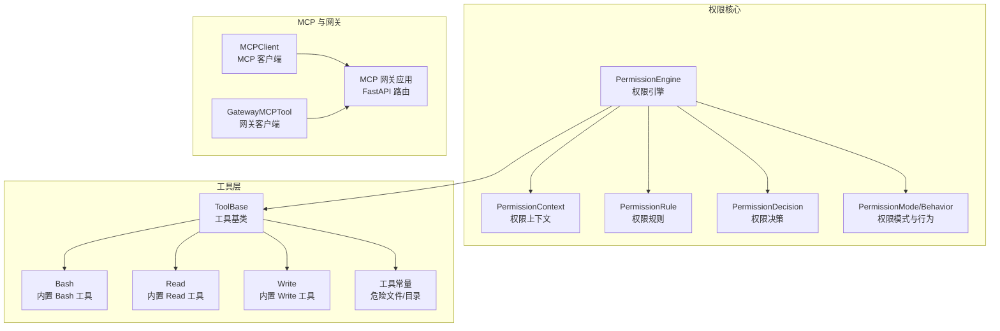
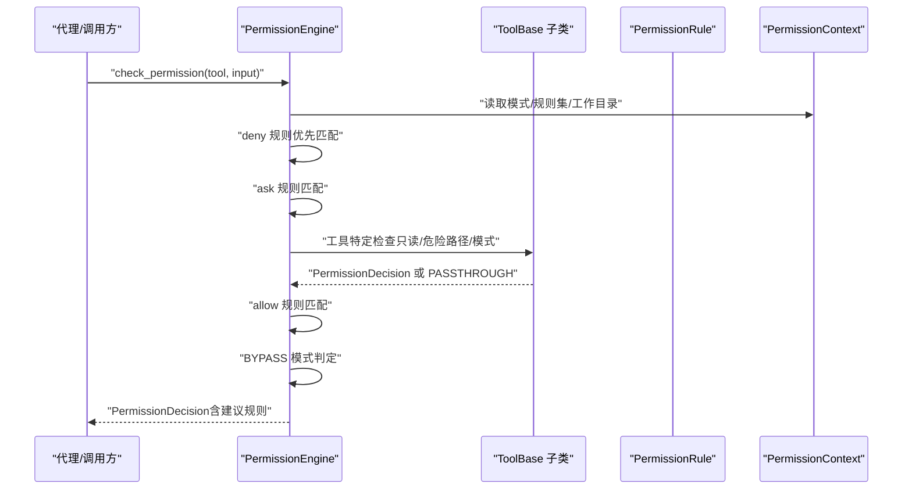
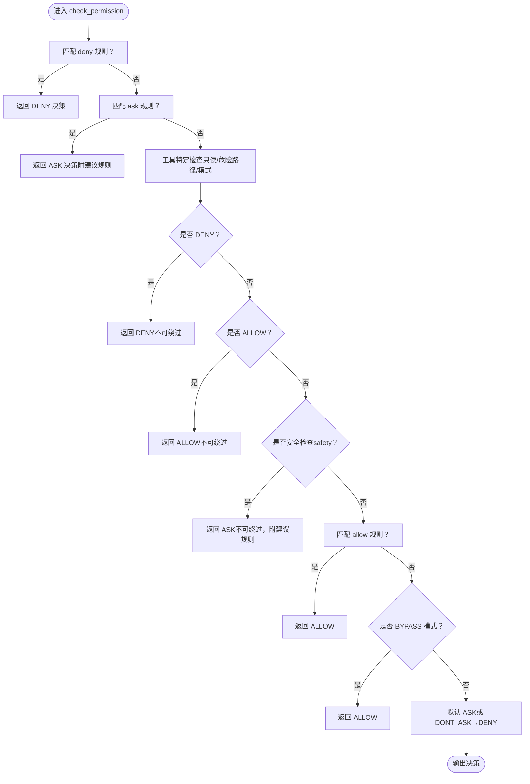
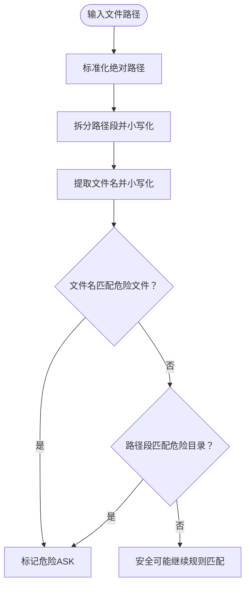
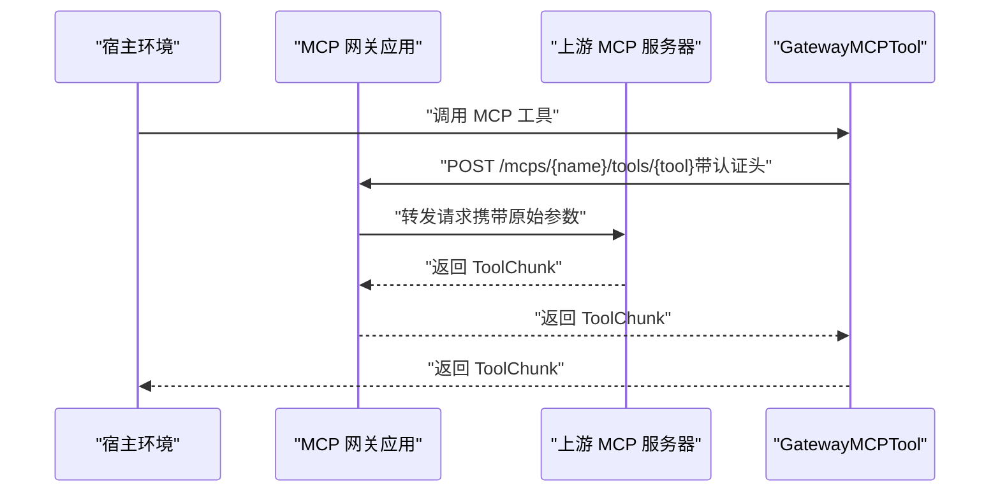
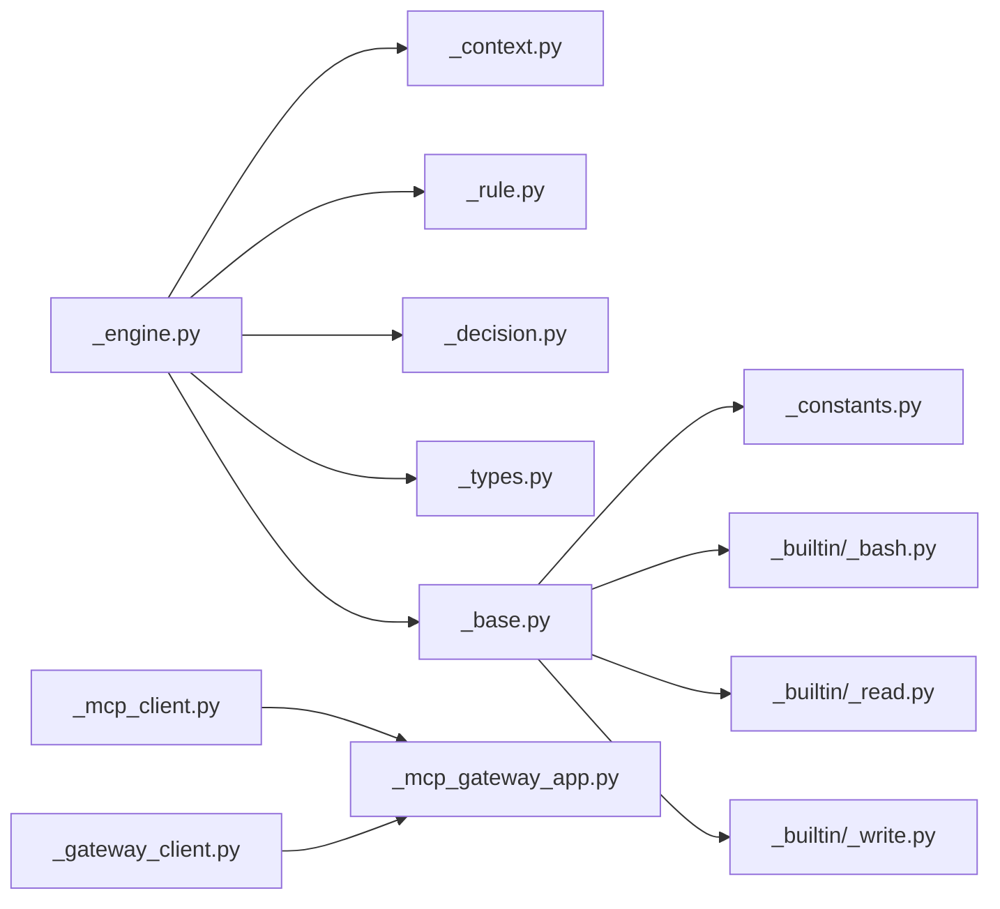

# 权限与安全

<cite>
**本文引用的文件**
- [权限引擎](file://src/agentscope/permission/_engine.py)
- [权限规则模型](file://src/agentscope/permission/_rule.py)
- [权限决策结果](file://src/agentscope/permission/_decision.py)
- [权限上下文](file://src/agentscope/permission/_context.py)
- [权限类型与模式](file://src/agentscope/permission/_types.py)
- [工具基类](file://src/agentscope/tool/_base.py)
- [内置 Bash 工具](file://src/agentscope/tool/_builtin/_bash.py)
- [内置 Read 工具](file://src/agentscope/tool/_builtin/_read.py)
- [内置 Write 工具](file://src/agentscope/tool/_builtin/_write.py)
- [工具常量（危险文件/目录）](file://src/agentscope/tool/_constants.py)
- [MCP 客户端](file://src/agentscope/mcp/_mcp_client.py)
- [MCP 网关应用](file://src/agentscope/workspace/_mcp_gateway/_mcp_gateway_app.py)
- [MCP 网关客户端](file://src/agentscope/workspace/_gateway_client.py)
- [权限引擎测试](file://tests/permission_engine_test.py)
</cite>

## 目录
1. [简介](#简介)
2. [项目结构](#项目结构)
3. [核心组件](#核心组件)
4. [架构总览](#架构总览)
5. [详细组件分析](#详细组件分析)
6. [依赖关系分析](#依赖关系分析)
7. [性能考量](#性能考量)
8. [故障排查指南](#故障排查指南)
9. [结论](#结论)
10. [附录](#附录)

## 简介
本文件为 AgentScope 工具系统权限与安全机制的权威文档，聚焦于 PermissionEngine 的工作原理与决策流程，解释权限规则的定义与匹配机制（工具级、内容级、行为控制），阐述危险路径检测算法（敏感文件识别与目录保护策略），说明权限决策类型（ALLOW、DENY、ASK）及处理逻辑，给出工具权限检查的实现细节（输入验证与上下文分析），并提供权限配置最佳实践（最小权限原则与安全审计）、常见安全威胁防护与应急响应方案，以及 MCP 工具的特殊权限处理与外部工具安全考虑。

## 项目结构
围绕权限与安全的关键模块如下：
- 权限核心：PermissionEngine、PermissionContext、PermissionRule、PermissionDecision、PermissionMode/Behavior
- 工具层：ToolBase 及其内置工具（Bash、Read、Write），工具常量（危险文件/目录）
- MCP 与网关：MCP 客户端、容器内网关应用、网关客户端
- 测试：覆盖规则优先级、模式行为、危险路径、只读命令自动放行等场景

**图表来源**
- [权限引擎:16-450](file://src/agentscope/permission/_engine.py#L16-L450)
- [权限上下文:24-47](file://src/agentscope/permission/_context.py#L24-L47)
- [权限规则模型:8-37](file://src/agentscope/permission/_rule.py#L8-L37)
- [权限决策结果:10-32](file://src/agentscope/permission/_decision.py#L10-L32)
- [权限类型与模式:18-76](file://src/agentscope/permission/_types.py#L18-L76)
- [工具基类:35-212](file://src/agentscope/tool/_base.py#L35-L212)
- [内置 Bash 工具:41-697](file://src/agentscope/tool/_builtin/_bash.py#L41-L697)
- [内置 Read 工具:21-276](file://src/agentscope/tool/_builtin/_read.py#L21-L276)
- [内置 Write 工具:27-317](file://src/agentscope/tool/_builtin/_write.py#L27-L317)
- [工具常量（危险文件/目录）:4-111](file://src/agentscope/tool/_constants.py#L4-L111)
- [MCP 客户端:23-429](file://src/agentscope/mcp/_mcp_client.py#L23-L429)
- [MCP 网关应用:1-243](file://src/agentscope/workspace/_mcp_gateway/_mcp_gateway_app.py#L1-L243)
- [MCP 网关客户端:43-160](file://src/agentscope/workspace/_gateway_client.py#L43-L160)

**章节来源**
- [权限引擎:16-450](file://src/agentscope/permission/_engine.py#L16-L450)
- [权限上下文:24-47](file://src/agentscope/permission/_context.py#L24-L47)
- [工具基类:35-212](file://src/agentscope/tool/_base.py#L35-L212)

## 核心组件
- 权限引擎（PermissionEngine）：负责对工具调用请求进行评估，按优先级顺序匹配规则与执行工具特定检查，最终生成 ALLOW/DENY/ASK 决策，并可提供建议规则。
- 权限上下文（PermissionContext）：承载当前权限模式、工作目录集合、允许/拒绝/询问规则集。
- 权限规则（PermissionRule）：定义规则作用对象（工具名）、规则内容（不同工具语义不同）与行为（allow/deny/ask）。
- 权限决策（PermissionDecision）：封装决策结果、消息、原因、更新后的输入与建议规则。
- 权限模式与行为（PermissionMode/PermissionBehavior）：定义 DEFAULT、ACCEPT_EDITS、EXPLORE、BYPASS、DONT_ASK 等模式与 ALLOW、DENY、ASK、PASSTHROUGH 行为。

**章节来源**
- [权限引擎:16-178](file://src/agentscope/permission/_engine.py#L16-L178)
- [权限上下文:24-47](file://src/agentscope/permission/_context.py#L24-L47)
- [权限规则模型:8-37](file://src/agentscope/permission/_rule.py#L8-L37)
- [权限决策结果:10-32](file://src/agentscope/permission/_decision.py#L10-L32)
- [权限类型与模式:18-76](file://src/agentscope/permission/_types.py#L18-L76)

## 架构总览
下图展示权限系统在工具调用链中的位置与交互：

**图表来源**
- [权限引擎:81-178](file://src/agentscope/permission/_engine.py#L81-L178)
- [工具基类:70-110](file://src/agentscope/tool/_base.py#L70-L110)

## 详细组件分析

### 权限引擎（PermissionEngine）
- 决策流程要点
  - 规则优先级：deny > ask > allow；deny 具有最高优先级，即使在 BYPASS 模式中仍有效。
  - 工具特定检查（不可绕过）：EXPLORE/ACCEPT_EDITS 模式下的只读/工作目录检查；危险路径/系统级删除检查；Bash 注入风险、只读命令、sed 约束等。
  - 默认行为：DONT_ASK 将 ASK 转为 DENY；否则默认 ASK 并生成建议规则。
- 规则匹配策略
  - Bash：前缀模式“git:*”、通配符模式、子串模式；支持转义与优化。
  - Read/Write：glob 模式匹配文件路径。
  - 其他工具：通用匹配逻辑，未覆盖时返回 False。
- 建议规则生成
  - Bash：基于命令前缀生成“前缀:*”规则。
  - 文件操作：基于父目录生成“父目录/**”规则。
  - 其他工具：生成工具级“无内容”规则（允许该工具所有调用）。

**图表来源**
- [权限引擎:81-178](file://src/agentscope/permission/_engine.py#L81-L178)
- [权限引擎:361-389](file://src/agentscope/permission/_engine.py#L361-L389)
- [权限引擎:419-449](file://src/agentscope/permission/_engine.py#L419-L449)

**章节来源**
- [权限引擎:81-178](file://src/agentscope/permission/_engine.py#L81-L178)
- [权限引擎:361-389](file://src/agentscope/permission/_engine.py#L361-L389)
- [权限引擎:419-449](file://src/agentscope/permission/_engine.py#L419-L449)

### 权限规则与匹配机制
- 规则模型
  - 工具名（tool_name）：作用范围（如 Bash、Read、Write）。
  - 规则内容（rule_content）：不同工具语义不同（Bash 命令前缀/通配符/子串；Read/Write 为 glob 模式；其他工具为工具自定义过滤）。
  - 行为（behavior）：allow/deny/ask。
- 匹配策略
  - Bash：前缀“:*”、通配符“*”、子串匹配；支持转义序列与正则回退。
  - Read/Write：fnmatch/glob 模式匹配文件路径。
  - 其他工具：若 rule_content 为空则匹配所有调用，否则需工具覆盖 match_rule 才能匹配。

**章节来源**
- [权限规则模型:8-37](file://src/agentscope/permission/_rule.py#L8-L37)
- [内置 Bash 工具:321-417](file://src/agentscope/tool/_builtin/_bash.py#L321-L417)
- [内置 Read 工具:105-134](file://src/agentscope/tool/_builtin/_read.py#L105-L134)
- [内置 Write 工具:195-223](file://src/agentscope/tool/_builtin/_write.py#L195-L223)

### 危险路径检测算法
- 敏感文件识别
  - 基于工具常量列表（如 .bashrc、.gitconfig、.ssh/config、.env* 等）进行大小写不敏感匹配。
- 目录保护策略
  - 对路径段进行大小写不敏感检查，命中 .git、.ssh、.vscode、.idea 等目录视为危险。
- 系统级删除保护（Bash）
  - 检测 rm/rmdir 针对根目录、家目录、/usr 等关键路径或通配符“/*”的删除，此类操作不可绕过，强制 ASK。
- 工作目录豁免
  - ACCEPT_EDITS 模式下，仅允许在工作目录（含附加工作目录）内的文件修改；危险路径即便在工作目录也需确认。

**图表来源**
- [工具基类:146-195](file://src/agentscope/tool/_base.py#L146-L195)
- [工具常量（危险文件/目录）:4-54](file://src/agentscope/tool/_constants.py#L4-L54)
- [内置 Bash 工具:464-491](file://src/agentscope/tool/_builtin/_bash.py#L464-L491)
- [内置 Bash 工具:493-594](file://src/agentscope/tool/_builtin/_bash.py#L493-L594)
- [内置 Write 工具:148-193](file://src/agentscope/tool/_builtin/_write.py#L148-L193)

**章节来源**
- [工具基类:146-195](file://src/agentscope/tool/_base.py#L146-L195)
- [工具常量（危险文件/目录）:4-54](file://src/agentscope/tool/_constants.py#L4-L54)
- [内置 Bash 工具:464-594](file://src/agentscope/tool/_builtin/_bash.py#L464-L594)
- [内置 Write 工具:148-193](file://src/agentscope/tool/_builtin/_write.py#L148-L193)

### 权限决策类型与处理逻辑
- ALLOW：直接放行，通常来自 deny/ask/allow 规则或工具特定放行（如只读命令、EXPLORE/ACCEPT_EDITS）。
- DENY：拒绝执行，优先级最高，且对危险路径检查不可绕过。
- ASK：需要用户确认；默认生成建议规则以减少未来确认次数；DONT_ASK 模式下转换为 DENY。
- PASSTHROUGH：工具内部无法确定，交由引擎继续规则匹配。

**章节来源**
- [权限类型与模式:61-76](file://src/agentscope/permission/_types.py#L61-L76)
- [权限引擎:164-178](file://src/agentscope/permission/_engine.py#L164-L178)
- [权限引擎:216-218](file://src/agentscope/permission/_engine.py#L216-L218)

### 工具权限检查实现细节
- 输入验证
  - Read/Write：要求绝对路径；Write 在存在目标文件时需先读取缓存以确保一致性。
- 上下文分析
  - EXPLORE 模式：只读工具自动 ALLOW，修改工具自动 DENY。
  - ACCEPT_EDITS 模式：工作目录内文件读写与常用文件系统命令自动 ALLOW；危险路径仍需确认。
  - Bash：注入风险（命令替换、进程替换、复杂扩展等）、只读命令、sed 约束、危险路径与系统级删除均不可绕过。
- 建议规则生成
  - Bash：基于命令前缀生成“前缀:*”规则。
  - 文件工具：基于父目录生成“父目录/**”规则。

**章节来源**
- [内置 Read 工具:170-276](file://src/agentscope/tool/_builtin/_read.py#L170-L276)
- [内置 Write 工具:259-317](file://src/agentscope/tool/_builtin/_write.py#L259-L317)
- [权限引擎:223-278](file://src/agentscope/permission/_engine.py#L223-L278)
- [内置 Bash 工具:181-319](file://src/agentscope/tool/_builtin/_bash.py#L181-L319)
- [权限引擎:419-449](file://src/agentscope/permission/_engine.py#L419-L449)

### MCP 工具的特殊权限处理与外部工具安全
- MCP 客户端
  - 支持 STDIO/HTTP 两类传输，状态型（stateful）与非状态型（stateless）连接；提供工具列表与调用封装。
- 网关应用
  - 容器内运行的 FastAPI 网关，暴露健康检查、MCP 列表、工具调用等端点；支持 Bearer Token 认证。
- 网关客户端
  - 将上游 MCP 工具通过 HTTP 转发到网关；默认策略：只读工具自动 ALLOW，其他工具要求用户确认。
- 外部工具安全
  - MCP 工具默认需要用户显式允许（ASK），避免未知外部服务被滥用；只读提示（readOnlyHint）用于自动放行只读 MCP 工具。

**图表来源**
- [MCP 网关应用:100-172](file://src/agentscope/workspace/_mcp_gateway/_mcp_gateway_app.py#L100-L172)
- [MCP 网关客户端:136-160](file://src/agentscope/workspace/_gateway_client.py#L136-L160)
- [MCP 客户端:354-411](file://src/agentscope/mcp/_mcp_client.py#L354-L411)

**章节来源**
- [MCP 客户端:23-429](file://src/agentscope/mcp/_mcp_client.py#L23-L429)
- [MCP 网关应用:1-243](file://src/agentscope/workspace/_mcp_gateway/_mcp_gateway_app.py#L1-L243)
- [MCP 网关客户端:43-160](file://src/agentscope/workspace/_gateway_client.py#L43-L160)

## 依赖关系分析
- 权限引擎依赖
  - 权限上下文（模式、规则集、工作目录）
  - 工具实例（调用工具特定检查、匹配规则、生成建议）
- 工具层依赖
  - 工具常量（危险文件/目录）
  - 权限类型与决策（行为枚举、决策数据结构）
- MCP 与网关
  - MCP 客户端封装连接与工具调用；网关应用提供统一入口与认证；网关客户端在宿主侧透明调用。

**图表来源**
- [权限引擎:16-51](file://src/agentscope/permission/_engine.py#L16-L51)
- [工具基类:11-20](file://src/agentscope/tool/_base.py#L11-L20)
- [MCP 客户端:23-42](file://src/agentscope/mcp/_mcp_client.py#L23-L42)
- [MCP 网关应用:45-46](file://src/agentscope/workspace/_mcp_gateway/_mcp_gateway_app.py#L45-L46)
- [MCP 网关客户端:43-62](file://src/agentscope/workspace/_gateway_client.py#L43-L62)

**章节来源**
- [权限引擎:16-51](file://src/agentscope/permission/_engine.py#L16-L51)
- [工具基类:11-20](file://src/agentscope/tool/_base.py#L11-L20)
- [MCP 客户端:23-42](file://src/agentscope/mcp/_mcp_client.py#L23-L42)
- [MCP 网关应用:45-46](file://src/agentscope/workspace/_mcp_gateway/_mcp_gateway_app.py#L45-L46)
- [MCP 网关客户端:43-62](file://src/agentscope/workspace/_gateway_client.py#L43-L62)

## 性能考量
- 规则匹配
  - Bash 命令匹配采用前缀优化与通配符转正则策略，注意避免过于宽泛的“*”导致大量回溯；建议使用更具体的“前缀:*”规则。
- 文件路径匹配
  - Read/Write 使用 fnmatch/glob，建议尽量使用父目录“/**”规则减少细粒度匹配开销。
- 工具特定检查
  - Bash 注入检测、只读命令判断、危险路径扫描等均为静态分析，成本较低；系统级删除检查仅针对 rm/rmdir，影响面有限。
- MCP 调用
  - 状态型连接复用会话，减少握手开销；网关客户端在宿主侧透明转发，避免额外序列化成本。

[本节为通用指导，无需具体文件引用]

## 故障排查指南
- 规则优先级问题
  - 若 deny 与 allow 同时存在，deny 优先；ASK 不会覆盖 deny。
- BYPASS 模式误解
  - BYPASS 仅对规则匹配生效，危险路径与注入风险等安全检查不可绕过。
- EXPLORE/ACCEPT_EDITS 模式
  - EXPLORE 仅允许只读工具；ACCEPT_EDITS 仅在工作目录内允许文件修改，危险路径仍需确认。
- Bash 命令匹配异常
  - 注意通配符“*”与转义序列；使用“前缀:*”更稳定；必要时启用建议规则。
- 文件路径匹配异常
  - Read/Write 使用绝对路径；Windows 下注意路径分隔符与大小写不敏感匹配。
- MCP 工具调用失败
  - 检查网关认证头（Bearer Token）；确认工具名称与参数；查看网关健康状态与日志。

**章节来源**
- [权限引擎测试:33-124](file://tests/permission_engine_test.py#L33-L124)
- [权限引擎测试:134-201](file://tests/permission_engine_test.py#L134-L201)
- [权限引擎测试:549-662](file://tests/permission_engine_test.py#L549-L662)
- [MCP 网关应用:60-73](file://src/agentscope/workspace/_mcp_gateway/_mcp_gateway_app.py#L60-L73)

## 结论
AgentScope 的权限系统通过 PermissionEngine 实现了灵活而安全的工具访问控制：以明确的优先级与模式驱动决策，结合工具特定的安全检查与危险路径保护，既满足探索与开发场景的便捷性，又在高风险操作上保持审慎。配合建议规则生成与 MCP 的只读提示策略，系统在可用性与安全性之间取得良好平衡。

[本节为总结性内容，无需具体文件引用]

## 附录

### 权限配置最佳实践
- 最小权限原则
  - 从 DEFAULT 模式开始，仅添加必要的 allow/ask 规则；避免授予全局“*”规则。
- 规则粒度
  - Bash 优先使用“前缀:*”规则；文件操作使用父目录“/**”规则；仅在确有必要时使用通配符。
- 模式选择
  - 开发调试：ACCEPT_EDITS（仅工作目录内修改）；探索代码库：EXPLORE（只读）；无人值守：DONT_ASK（ASK 转 DENY）；沙箱/测试：BYPASS（谨慎使用）。
- 审计与建议
  - 定期审查建议规则，将其固化为 allow/ask 规则；记录 deny 规则的原因与来源。

[本节为通用指导，无需具体文件引用]

### 常见安全威胁与防护
- 注入风险
  - Bash 注入检测（命令替换、进程替换、复杂扩展）强制 ASK。
- 危险命令
  - rm -rf、chmod 777、chown -R、kill -9 等高危命令需明确授权。
- 危险路径
  - .bashrc、.gitconfig、.ssh、.env* 等敏感文件与目录保护；系统关键路径（/、~、/usr 等）删除操作不可绕过。
- MCP 工具
  - 默认 ASK；只读提示（readOnlyHint）自动放行只读 MCP 工具；启用网关认证与最小权限访问。

**章节来源**
- [内置 Bash 工具:216-290](file://src/agentscope/tool/_builtin/_bash.py#L216-L290)
- [工具常量（危险文件/目录）:56-111](file://src/agentscope/tool/_constants.py#L56-L111)
- [MCP 网关应用:60-73](file://src/agentscope/workspace/_mcp_gateway/_mcp_gateway_app.py#L60-L73)