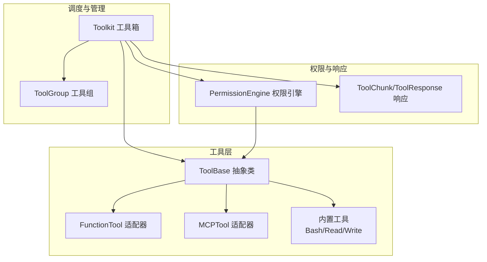
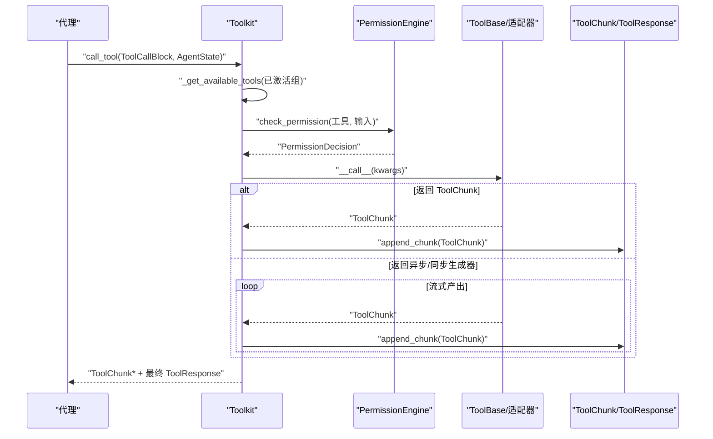
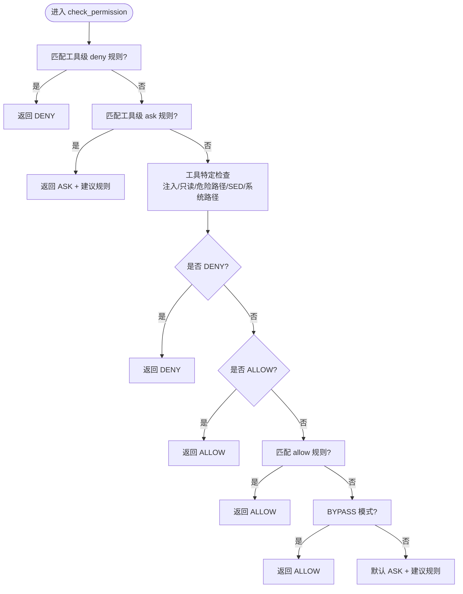
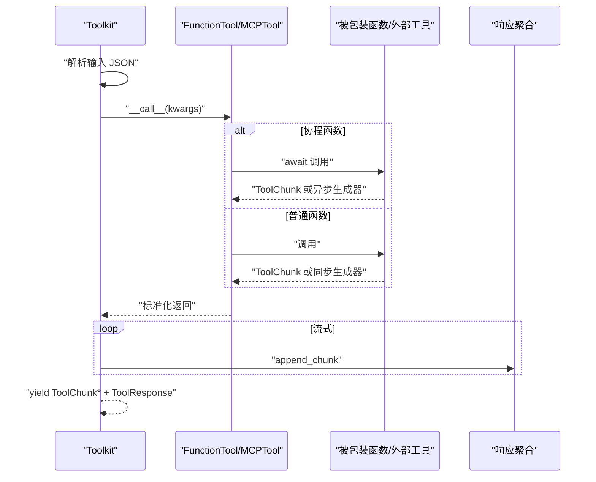
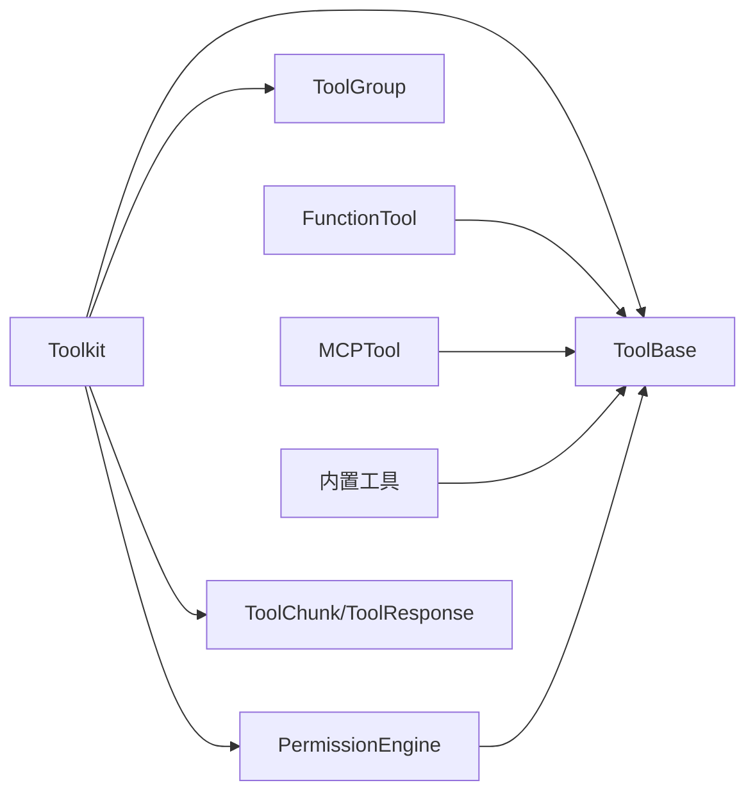

# 自定义工具开发

<cite>
**本文引用的文件**
- [tool/_base.py](file://src/agentscope/tool/_base.py)
- [tool/_types.py](file://src/agentscope/tool/_types.py)
- [tool/_response.py](file://src/agentscope/tool/_response.py)
- [tool/_adapters.py](file://src/agentscope/tool/_adapters.py)
- [tool/_toolkit.py](file://src/agentscope/tool/_toolkit.py)
- [tool/_tool_group.py](file://src/agentscope/tool/_tool_group.py)
- [tool/_builtin/_bash.py](file://src/agentscope/tool/_builtin/_bash.py)
- [tool/_builtin/_read.py](file://src/agentscope/tool/_builtin/_read.py)
- [tool/_builtin/_write.py](file://src/agentscope/tool/_builtin/_write.py)
- [permission/_engine.py](file://src/agentscope/permission/_engine.py)
- [app/_middleware/_tool_offload_middleware.py](file://src/agentscope/app/_middleware/_tool_offload_middleware.py)
- [tool/__init__.py](file://src/agentscope/tool/__init__.py)
- [tests/toolkit_test.py](file://tests/toolkit_test.py)
- [tests/mcp_sse_client_test.py](file://tests/mcp_sse_client_test.py)
</cite>

## 目录
1. [简介](#简介)
2. [项目结构](#项目结构)
3. [核心组件](#核心组件)
4. [架构总览](#架构总览)
5. [详细组件分析](#详细组件分析)
6. [依赖分析](#依赖分析)
7. [性能考虑](#性能考虑)
8. [故障排查指南](#故障排查指南)
9. [结论](#结论)
10. [附录：完整开发示例](#附录完整开发示例)

## 简介
本指南面向希望在 AgentScope 中开发自定义工具的工程师与研究者，系统讲解 ToolBase 抽象类的实现要求、工具参数验证（Pydantic 模型与 JSON Schema）、权限检查（规则匹配与决策逻辑）、异步工具调用支持（同步/异步差异）、工具响应与流式输出处理、调试技巧、性能优化与安全注意事项，并特别说明工具状态注入与 MCP 工具的特殊处理。

## 项目结构
AgentScope 的工具体系围绕 ToolBase 抽象类展开，通过 FunctionTool/MCPTool 适配器统一函数与 MCP 工具接口；工具注册与调度由 Toolkit 负责；权限控制由 PermissionEngine 实施；响应格式统一为 ToolChunk/ToolResponse 并支持流式累积。

图示来源
- [tool/_base.py:35-212](file://src/agentscope/tool/_base.py#L35-L212)
- [tool/_adapters.py:30-371](file://src/agentscope/tool/_adapters.py#L30-L371)
- [tool/_builtin/_bash.py:41-697](file://src/agentscope/tool/_builtin/_bash.py#L41-L697)
- [tool/_builtin/_read.py:21-276](file://src/agentscope/tool/_builtin/_read.py#L21-L276)
- [tool/_builtin/_write.py:27-317](file://src/agentscope/tool/_builtin/_write.py#L27-L317)
- [tool/_toolkit.py:66-602](file://src/agentscope/tool/_toolkit.py#L66-L602)
- [tool/_tool_group.py:10-109](file://src/agentscope/tool/_tool_group.py#L10-L109)
- [permission/_engine.py:75-395](file://src/agentscope/permission/_engine.py#L75-L395)
- [tool/_response.py:11-145](file://src/agentscope/tool/_response.py#L11-L145)

章节来源
- [tool/__init__.py:1-50](file://src/agentscope/tool/__init__.py#L1-L50)
- [tool/_toolkit.py:66-175](file://src/agentscope/tool/_toolkit.py#L66-L175)

## 核心组件
- ToolBase 抽象类：定义工具名称、描述、输入 JSON Schema、并发安全与只读属性等；提供权限检查与规则匹配的默认实现；定义统一的异步调用接口。
- FunctionTool/MCPTool 适配器：将普通函数或 MCP 工具转换为 ToolBase 接口，自动提取函数签名与文档生成 JSON Schema，并规范化返回值为 ToolChunk/异步生成器。
- 内置工具：Bash/Read/Write 等，提供细粒度的安全检查与规则匹配策略。
- Toolkit：工具注册、分组、激活/停用、执行与流式响应聚合。
- PermissionEngine：按优先级评估 deny/ask/工具特定检查/allow/BYPASS/default，生成建议规则。
- ToolChunk/ToolResponse：统一的增量与最终响应格式，支持文本与多模态数据块累积。

章节来源
- [tool/_base.py:35-212](file://src/agentscope/tool/_base.py#L35-L212)
- [tool/_adapters.py:30-160](file://src/agentscope/tool/_adapters.py#L30-L160)
- [tool/_builtin/_bash.py:41-146](file://src/agentscope/tool/_builtin/_bash.py#L41-L146)
- [tool/_builtin/_read.py:21-70](file://src/agentscope/tool/_builtin/_read.py#L21-L70)
- [tool/_builtin/_write.py:27-64](file://src/agentscope/tool/_builtin/_write.py#L27-L64)
- [tool/_toolkit.py:225-389](file://src/agentscope/tool/_toolkit.py#L225-L389)
- [permission/_engine.py:75-178](file://src/agentscope/permission/_engine.py#L75-L178)
- [tool/_response.py:11-145](file://src/agentscope/tool/_response.py#L11-L145)

## 架构总览
下图展示从工具注册到执行、权限校验与响应聚合的关键流程。

图示来源
- [tool/_toolkit.py:225-389](file://src/agentscope/tool/_toolkit.py#L225-L389)
- [permission/_engine.py:75-178](file://src/agentscope/permission/_engine.py#L75-L178)
- [tool/_response.py:55-145](file://src/agentscope/tool/_response.py#L55-L145)

## 详细组件分析

### ToolBase 抽象类与实现要求
- 必需字段与属性
  - name/description/input_schema/is_concurrency_safe/is_read_only：用于向代理暴露工具能力、约束与安全属性。
  - is_external_tool/is_state_injected/is_mcp/mcp_name：用于区分外部工具、状态注入需求与 MCP 工具标识。
- 必需方法
  - check_permissions(tool_input, context) -> PermissionDecision：实现工具级权限判定。
  - __call__(...) -> ToolChunk 或异步/同步生成器：实现工具执行逻辑。
- 可选方法
  - match_rule(rule_content, tool_input) -> bool：对规则内容进行匹配（如 Bash/Read/Write 的模式匹配）。
  - generate_suggestions(tool_input) -> List[PermissionRule]：为工具输入生成建议规则。
- 安全辅助
  - _is_dangerous_path(file_path)：基于敏感文件/目录列表判断路径风险。

章节来源
- [tool/_base.py:35-212](file://src/agentscope/tool/_base.py#L35-L212)

### 参数验证：Pydantic 模型与 JSON Schema
- 函数签名到 Schema 的自动提取
  - FunctionTool 通过解析函数签名与文档字符串，生成 input_schema；支持可变关键字参数与默认值。
- 动态扩展 Schema
  - RegisteredTool 支持通过扩展 BaseModel 合并 schema，合并时去重 title 字段，避免 LLM 不兼容。
- JSON Schema 规范
  - input_schema 必须为对象类型且包含 properties；title 字段在导出时被移除以保持简洁。

章节来源
- [tool/_adapters.py:48-84](file://src/agentscope/tool/_adapters.py#L48-L84)
- [tool/_types.py:43-153](file://src/agentscope/tool/_types.py#L43-L153)
- [tool/_utils.py:79-117](file://src/agentscope/tool/_utils.py#L79-L117)

### 权限检查：规则匹配与决策逻辑
- 决策优先级
  1) 工具级 deny 规则（最高）
  2) 工具级 ask 规则
  3) 工具特定检查（危险路径、只读命令、注入检测等，不可被 BYPASS 覆盖）
  4) allow 规则
  5) BYPASS 模式检查
  6) 默认行为（ASK）
- 规则匹配策略
  - Bash：前缀匹配、通配符转正则、转义处理。
  - Read/Write：glob 模式匹配文件路径。
  - 其他工具：通用模式匹配。
- 工具特定安全检查示例
  - Bash：注入风险检测、只读命令白名单、危险命令/SED 约束、敏感路径操作、系统关键目录删除检测。
  - Read：EXPLORE 模式下只读放行。
  - Write：敏感路径检测、ACCEPT_EDITS 下工作目录内放行。

图示来源
- [permission/_engine.py:75-178](file://src/agentscope/permission/_engine.py#L75-L178)
- [tool/_builtin/_bash.py:181-320](file://src/agentscope/tool/_builtin/_bash.py#L181-L320)
- [tool/_builtin/_read.py:89-103](file://src/agentscope/tool/_builtin/_read.py#L89-L103)
- [tool/_builtin/_write.py:91-146](file://src/agentscope/tool/_builtin/_write.py#L91-L146)

章节来源
- [permission/_engine.py:75-395](file://src/agentscope/permission/_engine.py#L75-L395)
- [tool/_builtin/_bash.py:321-462](file://src/agentscope/tool/_builtin/_bash.py#L321-L462)
- [tool/_builtin/_read.py:105-168](file://src/agentscope/tool/_builtin/_read.py#L105-L168)
- [tool/_builtin/_write.py:195-257](file://src/agentscope/tool/_builtin/_write.py#L195-L257)

### 异步工具调用与同步/异步差异
- 统一接口
  - Toolkit.call_tool 统一接收 ToolChunk 或生成器返回；内部自动识别协程/生成器并进行流式聚合。
- 同步工具
  - 返回 ToolChunk 或同步生成器；FunctionTool 将任意结果归一化为 ToolChunk。
- 异步工具
  - 返回异步生成器；MCPTool 通过会话调用 MCP 工具并将结果转换为 ToolChunk。
- 状态注入
  - 当 is_state_injected 为真且非 MCP/非外部工具时，Toolkit 会将 AgentState 注入为 _agent_state 参数。

图示来源
- [tool/_toolkit.py:296-337](file://src/agentscope/tool/_toolkit.py#L296-L337)
- [tool/_adapters.py:104-159](file://src/agentscope/tool/_adapters.py#L104-L159)
- [tool/_adapters.py:265-304](file://src/agentscope/tool/_adapters.py#L265-L304)

章节来源
- [tool/_toolkit.py:225-389](file://src/agentscope/tool/_toolkit.py#L225-L389)
- [tool/_adapters.py:104-159](file://src/agentscope/tool/_adapters.py#L104-L159)
- [tool/_adapters.py:265-304](file://src/agentscope/tool/_adapters.py#L265-L304)

### 工具响应格式与流式输出
- ToolChunk
  - content：文本/多模态数据块列表；同一 id 的数据块会被合并。
  - state：运行中/错误/中断/成功等状态。
  - is_last：是否为最后一次流式块。
  - metadata/id：元信息与唯一标识。
- ToolResponse
  - 由 ToolChunk 累积生成，自动合并相邻文本块，保留最差状态（错误优先于中断，再于拒绝）。
- 多模态支持
  - DataBlock 支持 Base64/URL 数据源；同 id 的 DataBlock 会合并媒体类型与名称。

章节来源
- [tool/_response.py:11-145](file://src/agentscope/tool/_response.py#L11-L145)

### 工具状态注入与 MCP 工具的特殊处理
- 状态注入
  - is_state_injected=True 时，Toolkit 在调用前将 AgentState 注入为 _agent_state；内置 Read/Write 标记为需要状态注入。
- MCP 工具
  - is_mcp=True；禁止状态注入（安全限制）；input_schema 保留 $defs/anyOf/oneOf 等以支持 LLM 解析 $ref。
  - 仅在只读情况下自动允许，否则要求显式许可。

章节来源
- [tool/_base.py:49-61](file://src/agentscope/tool/_base.py#L49-L61)
- [tool/_builtin/_read.py:69-70](file://src/agentscope/tool/_builtin/_read.py#L69-L70)
- [tool/_builtin/_write.py:63-64](file://src/agentscope/tool/_builtin/_write.py#L63-L64)
- [tool/_adapters.py:170-173](file://src/agentscope/tool/_adapters.py#L170-L173)
- [tool/_adapters.py:201-213](file://src/agentscope/tool/_adapters.py#L201-L213)

### 工具组与元工具
- ToolGroup
  - 工具分组容器，支持 tools/skills/mcps；basic 组始终激活。
- 元工具 ResetTools
  - 通过布尔字段切换各组激活状态；支持模板化提示与技能指令注入。

章节来源
- [tool/_tool_group.py:10-109](file://src/agentscope/tool/_tool_group.py#L10-L109)
- [tool/_toolkit.py:88-175](file://src/agentscope/tool/_toolkit.py#L88-L175)

## 依赖分析
- 组件耦合
  - Toolkit 依赖 ToolBase/MCP 客户端/技能加载器；PermissionEngine 依赖 ToolBase 的规则匹配与工具特定检查。
  - FunctionTool/MCPTool 依赖消息与响应模块，负责结果归一化。
- 外部依赖
  - mcp 客户端用于 MCP 工具调用；aiofiles 用于异步文件读写；jinja2 用于元工具模板渲染。
- 循环依赖
  - 未发现直接循环；工具与权限解耦，通过接口交互。

图示来源
- [tool/_toolkit.py:66-175](file://src/agentscope/tool/_toolkit.py#L66-L175)
- [tool/_base.py:35-212](file://src/agentscope/tool/_base.py#L35-L212)
- [permission/_engine.py:75-178](file://src/agentscope/permission/_engine.py#L75-L178)
- [tool/_response.py:11-145](file://src/agentscope/tool/_response.py#L11-L145)

## 性能考虑
- 流式输出
  - 使用生成器逐步产出 ToolChunk，降低内存峰值；Toolkit 负责累积与状态合并。
- 并发安全
  - is_concurrency_safe=True 的工具可并行调用；避免共享可变状态。
- I/O 优化
  - Read/Write 利用缓存与异步文件访问减少重复读取与阻塞。
- MCP 连接
  - 状态化客户端复用会话，减少握手开销；超时合理设置避免长时间阻塞。
- 背压与降级
  - 长耗时工具可通过中间件迁移至后台任务并返回占位响应，提升用户体验。

章节来源
- [tool/_builtin/_read.py:214-237](file://src/agentscope/tool/_builtin/_read.py#L214-L237)
- [tool/_builtin/_write.py:295-301](file://src/agentscope/tool/_builtin/_write.py#L295-L301)
- [app/_middleware/_tool_offload_middleware.py:358-406](file://src/agentscope/app/_middleware/_tool_offload_middleware.py#L358-L406)

## 故障排查指南
- 工具不存在/未激活
  - 现象：返回错误块与 ToolResponse；检查工具名与已激活组。
- 权限被拒/需要确认
  - 现象：PermissionDecision 行为为 ASK/DENY；根据建议规则调整或手动授权。
- 注入/危险路径检测
  - 现象：Bash 等工具因注入或系统关键路径删除被拦截；修正命令或路径。
- 异常与取消
  - 现象：异常被捕获并转为 ToolChunk 错误；用户中断产生中断状态。
- MCP 错误
  - 现象：MCP 工具调用异常；检查客户端连接、会话与超时配置。

章节来源
- [tool/_toolkit.py:254-389](file://src/agentscope/tool/_toolkit.py#L254-L389)
- [permission/_engine.py:106-178](file://src/agentscope/permission/_engine.py#L106-L178)
- [tool/_builtin/_bash.py:216-289](file://src/agentscope/tool/_builtin/_bash.py#L216-L289)

## 结论
通过 ToolBase 抽象与适配器模式，AgentScope 提供了统一、可扩展、安全可控的工具开发框架。结合完善的参数验证、细粒度权限控制、流式响应与状态注入机制，开发者可以快速构建从简单函数到复杂外部工具（MCP）的各类工具，并在保证安全的前提下获得良好的用户体验与性能表现。

## 附录：完整开发示例

### 示例一：简单工具（FunctionTool）
- 目标：封装一个同步/异步函数，自动提取参数与描述，返回 ToolChunk 或生成器。
- 关键点
  - 使用 FunctionTool 包装函数；若返回字符串或字典，自动序列化为 ToolChunk。
  - 若返回生成器，Toolkit 会逐块累积并最终生成 ToolResponse。
- 参考测试
  - 同步函数返回字符串、异步非流式函数、同步/异步生成器等用例。

章节来源
- [tool/_adapters.py:104-159](file://src/agentscope/tool/_adapters.py#L104-L159)
- [tests/toolkit_test.py:526-572](file://tests/toolkit_test.py#L526-L572)
- [tests/toolkit_test.py:795-816](file://tests/toolkit_test.py#L795-L816)
- [tests/toolkit_test.py:891-944](file://tests/toolkit_test.py#L891-L944)

### 示例二：复杂工具（内置 Bash/Read/Write）
- 目标：实现具备安全检查与规则匹配的工具。
- 关键点
  - Bash：注入检测、只读命令白名单、危险命令/SED/敏感路径/系统关键目录删除检测。
  - Read：只读工具，EXPLORE 模式下自动放行；glob 规则匹配；建议规则覆盖父目录。
  - Write：敏感路径检测；ACCEPT_EDITS 下工作目录内放行；首次写入需先读取。
- 参考实现
  - Bash/Read/Write 的 check_permissions 与 match_rule/generate_suggestions。

章节来源
- [tool/_builtin/_bash.py:181-320](file://src/agentscope/tool/_builtin/_bash.py#L181-L320)
- [tool/_builtin/_bash.py:321-462](file://src/agentscope/tool/_builtin/_bash.py#L321-L462)
- [tool/_builtin/_read.py:89-168](file://src/agentscope/tool/_builtin/_read.py#L89-L168)
- [tool/_builtin/_write.py:91-146](file://src/agentscope/tool/_builtin/_write.py#L91-L146)
- [tool/_builtin/_write.py:195-257](file://src/agentscope/tool/_builtin/_write.py#L195-L257)

### 示例三：外部工具（MCP 工具）
- 目标：将 MCP 工具桥接为 ToolBase 接口，支持只读自动放行与错误状态映射。
- 关键点
  - MCPTool 保存原始 inputSchema（含 $defs/anyOf/oneOf），确保 LLM 能解析嵌套类型。
  - 禁止状态注入；只读 MCP 工具自动允许，否则要求显式许可。
  - 通过状态化/无状态客户端生成器调用 MCP 工具并转换为 ToolChunk。
- 参考测试
  - SSE/HTTP MCP 客户端连接与工具调用验证。

章节来源
- [tool/_adapters.py:162-304](file://src/agentscope/tool/_adapters.py#L162-L304)
- [tests/mcp_sse_client_test.py:202-244](file://tests/mcp_sse_client_test.py#L202-L244)

### 调试技巧与最佳实践
- 调试
  - 使用最小化输入与明确的 ToolCallBlock；观察 Toolkit 的错误块与 ToolResponse 的状态变化。
  - 对于 MCP 工具，检查客户端连接状态与超时设置。
- 性能
  - 优先使用生成器进行流式输出；避免一次性构造大对象；合理设置超时与缓存。
- 安全
  - 为自定义函数工具提供明确的 check_permissions 实现；谨慎使用 is_read_only 与 BYPASS 模式。
  - 对 Bash 命令进行注入检测与路径校验；对 Write 工具严格限制敏感路径。

章节来源
- [tool/_toolkit.py:352-389](file://src/agentscope/tool/_toolkit.py#L352-L389)
- [tool/_builtin/_bash.py:216-289](file://src/agentscope/tool/_builtin/_bash.py#L216-L289)
- [tool/_builtin/_write.py:121-146](file://src/agentscope/tool/_builtin/_write.py#L121-L146)