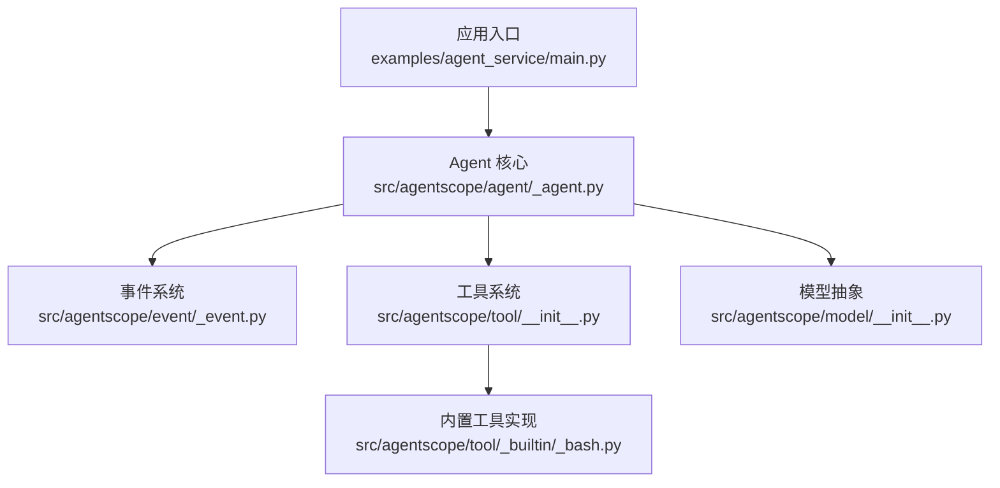
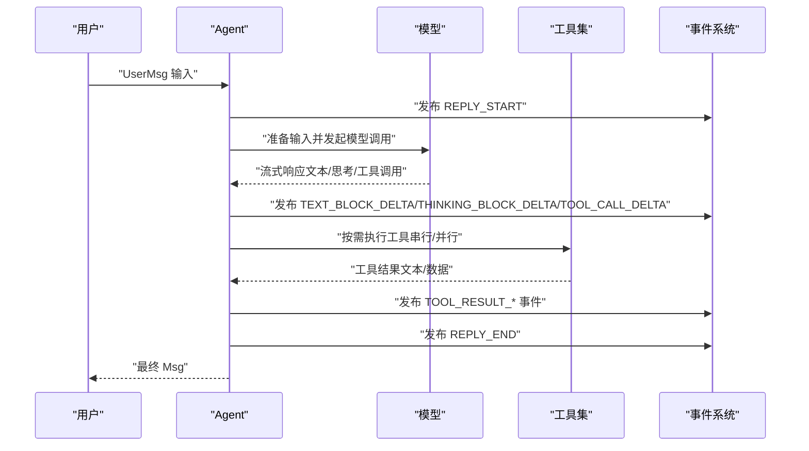
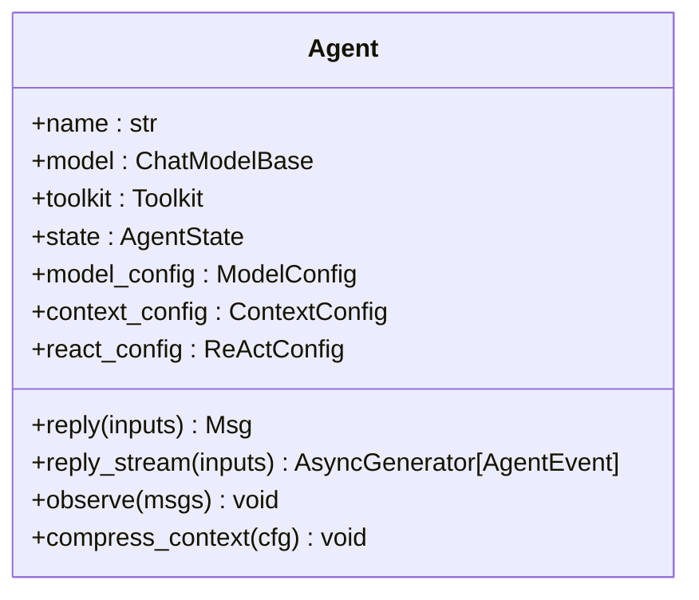
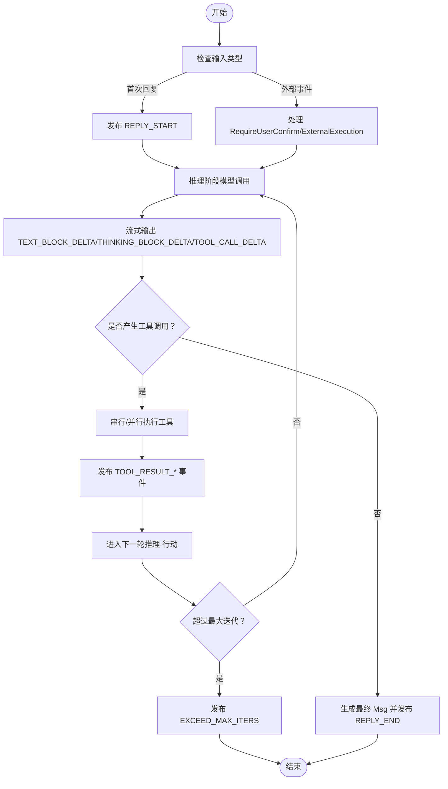
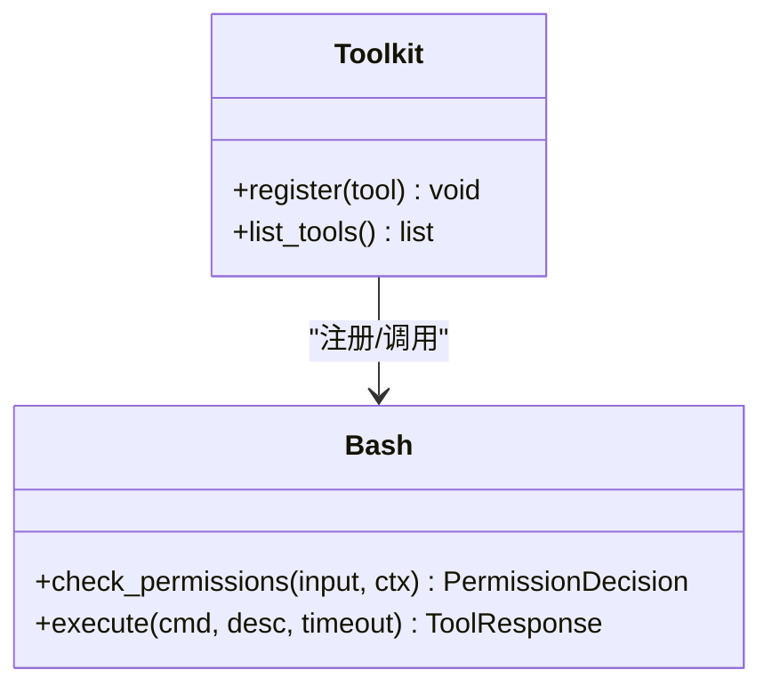
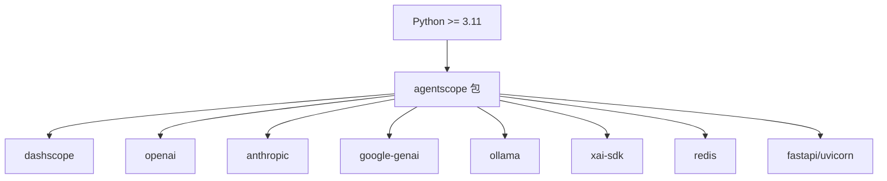

# 快速开始

<cite>
**本文引用的文件**
- [README.md](file://README.md)
- [pyproject.toml](file://pyproject.toml)
- [src/agentscope/__init__.py](file://src/agentscope/__init__.py)
- [src/agentscope/agent/_agent.py](file://src/agentscope/agent/_agent.py)
- [src/agentscope/agent/__init__.py](file://src/agentscope/agent/__init__.py)
- [src/agentscope/tool/__init__.py](file://src/agentscope/tool/__init__.py)
- [src/agentscope/model/__init__.py](file://src/agentscope/model/__init__.py)
- [src/agentscope/event/_event.py](file://src/agentscope/event/_event.py)
- [src/agentscope/tool/_builtin/_bash.py](file://src/agentscope/tool/_builtin/_bash.py)
- [examples/agent_service/main.py](file://examples/agent_service/main.py)
</cite>

## 目录
1. [简介](#简介)
2. [项目结构](#项目结构)
3. [核心组件](#核心组件)
4. [架构总览](#架构总览)
5. [详细组件解析](#详细组件解析)
6. [依赖关系分析](#依赖关系分析)
7. [性能与运行建议](#性能与运行建议)
8. [故障排除指南](#故障排除指南)
9. [结论](#结论)
10. [附录：安装与运行步骤](#附录安装与运行步骤)

## 简介
本指南面向首次接触 AgentScope 2.0 的开发者，帮助你在 5 分钟内完成安装、配置与运行第一个智能体。你将学会：
- 从 PyPI 或源码安装
- 准备必要的环境变量（如模型 API Key）
- 初始化 Agent、配置模型与工具包
- 处理事件流（文本块、思考块、工具调用等）
- 运行内置 ReAct 智能体与常用工具（Bash、Grep、Glob、Read、Write、Edit）

AgentScope 提供统一的事件流接口，支持人机交互（HITL）、权限控制、上下文压缩、工作空间卸载等能力，适合快速构建生产级多智能体应用。

## 项目结构
AgentScope 采用模块化设计，核心目录与职责概览如下：
- src/agentscope：核心库，包含 Agent、消息、事件、工具、模型、权限、工作空间、中间件等子模块
- examples：示例工程，包含基于 FastAPI 的 Agent Service 后端与 Web UI 前端
- scripts/model_examples：各模型提供商的调用示例（可作为扩展参考）

图表来源
- [examples/agent_service/main.py:1-72](file://examples/agent_service/main.py#L1-L72)
- [src/agentscope/agent/_agent.py:1-800](file://src/agentscope/agent/_agent.py#L1-L800)
- [src/agentscope/event/_event.py:1-432](file://src/agentscope/event/_event.py#L1-L432)
- [src/agentscope/tool/__init__.py:1-51](file://src/agentscope/tool/__init__.py#L1-L51)
- [src/agentscope/model/__init__.py:1-34](file://src/agentscope/model/__init__.py#L1-L34)
- [src/agentscope/tool/_builtin/_bash.py:1-200](file://src/agentscope/tool/_builtin/_bash.py#L1-L200)

章节来源
- [README.md:106-133](file://README.md#L106-L133)
- [pyproject.toml:21-48](file://pyproject.toml#L21-L48)

## 核心组件
- Agent：统一的智能体类，负责推理-行动循环、事件流生成、上下文压缩、权限校验、工具执行等
- 事件系统：标准化的事件类型（如文本块、思考块、工具调用、模型调用等），用于流式输出与前端渲染
- 工具系统：内置 Bash、Grep、Glob、Read、Write、Edit 等工具，支持权限控制与批量执行
- 模型抽象：统一 ChatModel 接口，支持多家模型供应商（DashScope、OpenAI、Anthropic、Gemini、Moonshot、Ollama、XAI 等）

章节来源
- [src/agentscope/agent/_agent.py:94-186](file://src/agentscope/agent/_agent.py#L94-L186)
- [src/agentscope/event/_event.py:14-51](file://src/agentscope/event/_event.py#L14-L51)
- [src/agentscope/tool/__init__.py:1-51](file://src/agentscope/tool/__init__.py#L1-L51)
- [src/agentscope/model/__init__.py:1-34](file://src/agentscope/model/__init__.py#L1-L34)

## 架构总览
下图展示了从用户输入到事件流输出的整体流程，以及 Agent 与工具、模型、事件系统的交互关系。

图表来源
- [src/agentscope/agent/_agent.py:542-686](file://src/agentscope/agent/_agent.py#L542-L686)
- [src/agentscope/event/_event.py:64-112](file://src/agentscope/event/_event.py#L64-L112)
- [src/agentscope/tool/__init__.py:38-50](file://src/agentscope/tool/__init__.py#L38-L50)

## 详细组件解析

### Agent 类与初始化
- 职责：封装系统提示词、模型、工具集、状态、中间件、上下文压缩策略与 ReAct 循环配置
- 关键点：
  - 支持中间件链（on_reply/on_reasoning/on_acting/on_model_call 等）
  - 支持上下文压缩与工作空间卸载
  - 提供 reply 与 reply_stream 两种回复方式

图表来源
- [src/agentscope/agent/_agent.py:94-186](file://src/agentscope/agent/_agent.py#L94-L186)

章节来源
- [src/agentscope/agent/_agent.py:94-186](file://src/agentscope/agent/_agent.py#L94-L186)
- [src/agentscope/agent/__init__.py:1-6](file://src/agentscope/agent/__init__.py#L1-L6)

### 事件系统与事件流
- 事件类型覆盖：回复开始/结束、模型调用开始/结束、文本块、思考块、数据块、工具调用、工具结果、最大迭代超限、人机交互请求等
- 流式处理：通过 async for 遍历事件，前端可实时渲染

图表来源
- [src/agentscope/agent/_agent.py:542-686](file://src/agentscope/agent/_agent.py#L542-L686)
- [src/agentscope/event/_event.py:14-51](file://src/agentscope/event/_event.py#L14-L51)

章节来源
- [src/agentscope/event/_event.py:14-51](file://src/agentscope/event/_event.py#L14-L51)
- [src/agentscope/agent/_agent.py:542-686](file://src/agentscope/agent/_agent.py#L542-L686)

### 工具系统与内置工具
- 工具注册：通过 Toolkit 统一注册工具、MCP、技能
- 内置工具：Bash、Grep、Glob、Read、Write、Edit 等
- 权限控制：对危险命令与路径进行安全检查，必要时触发 RequireUserConfirm

图表来源
- [src/agentscope/tool/__init__.py:1-51](file://src/agentscope/tool/__init__.py#L1-L51)
- [src/agentscope/tool/_builtin/_bash.py:41-200](file://src/agentscope/tool/_builtin/_bash.py#L41-L200)

章节来源
- [src/agentscope/tool/__init__.py:1-51](file://src/agentscope/tool/__init__.py#L1-L51)
- [src/agentscope/tool/_builtin/_bash.py:41-200](file://src/agentscope/tool/_builtin/_bash.py#L41-L200)

### 模型抽象与配置
- 统一 ChatModel 接口，支持多家模型供应商
- 支持结构化输出、计数令牌、流式响应等

章节来源
- [src/agentscope/model/__init__.py:1-34](file://src/agentscope/model/__init__.py#L1-L34)

## 依赖关系分析
- Python 版本：要求 3.11+
- 核心依赖：aiohttp、dashscope、openai、anthropic、google-genai、ollama、xai-sdk、redis、fastapi、uvicorn 等
- 可选依赖：models（集成多模型）、service（服务端）、storage（存储）、workspace（工作空间）

图表来源
- [pyproject.toml:21-48](file://pyproject.toml#L21-L48)
- [pyproject.toml:50-82](file://pyproject.toml#L50-L82)

章节来源
- [pyproject.toml:21-48](file://pyproject.toml#L21-L48)
- [pyproject.toml:50-82](file://pyproject.toml#L50-L82)

## 性能与运行建议
- 上下文压缩：当 token 使用接近阈值时自动压缩历史消息，减少开销
- 流式输出：优先使用 reply_stream 实时渲染，降低首帧延迟感知
- 工具批处理：合理选择串行/并行执行，避免阻塞
- 日志与追踪：利用内置日志与 OpenTelemetry 支持，便于定位性能瓶颈

[本节为通用建议，不直接分析具体文件]

## 故障排除指南
- 安装失败（Python 版本过低）
  - 症状：pip 报错或无法安装
  - 处理：升级至 Python 3.11+
- 缺少 API Key
  - 症状：模型调用报错
  - 处理：在环境中设置对应模型的 API Key，并在代码中正确传入
- 事件流未显示
  - 症状：只看到最终回复，无中间事件
  - 处理：确认使用 reply_stream 并遍历事件；检查前端是否订阅事件流
- 工具执行被拒绝
  - 症状：出现 RequireUserConfirm
  - 处理：根据权限规则进行确认或调整工具参数
- 上下文溢出
  - 症状：压缩失败或报错
  - 处理：降低保留比例或缩短系统提示词长度

章节来源
- [src/agentscope/agent/_agent.py:300-492](file://src/agentscope/agent/_agent.py#L300-L492)
- [src/agentscope/event/_event.py:328-363](file://src/agentscope/event/_event.py#L328-L363)

## 结论
通过本指南，你已掌握：
- 在 5 分钟内完成安装与运行
- 初始化 Agent、配置模型与工具包
- 处理事件流并实现人机交互
- 使用内置工具与权限控制

下一步建议：结合 examples/web_ui 体验完整的聊天界面，或基于 Agent Service 快速搭建多智能体服务。

[本节为总结性内容，不直接分析具体文件]

## 附录：安装与运行步骤

### 环境要求
- Python 3.11+

章节来源
- [README.md:110](file://README.md#L110)
- [pyproject.toml:21](file://pyproject.toml#L21)

### 从 PyPI 安装
- 使用 uv 或 pip 安装 agentscope
- 如需服务端与存储功能，可安装可选依赖组（见后文“可选依赖”）

章节来源
- [README.md:112-118](file://README.md#L112-L118)

### 从源码安装
- 克隆仓库并以可编辑模式安装
- 可选：安装可选依赖组（models/service/storage/workspace/full）

章节来源
- [README.md:120-132](file://README.md#L120-L132)
- [pyproject.toml:50-82](file://pyproject.toml#L50-L82)

### 第一个智能体：Hello AgentScope
- 步骤概览
  1) 导入所需模块（Agent、Toolkit、内置工具、模型与凭据、消息、事件）
  2) 初始化模型与凭据（示例使用 DashScope）
  3) 创建工具集（Bash、Grep、Glob、Read、Write、Edit）
  4) 构造 Agent（指定名称、系统提示词、模型、工具集）
  5) 通过 reply_stream 获取事件流并处理各类事件
  6) 运行异步主函数

- 代码示例路径
  - [README.md:138-188](file://README.md#L138-L188)

- 逐步解释
  - Agent 初始化：设置 name、system_prompt、model、toolkit
  - 模型配置：DashScopeChatModel + DashScopeCredential
  - 工具包设置：Toolkit 注册 Bash/Grep/Glob/Read/Write/Edit
  - 事件流处理：匹配 EventType.REPLY_START/模型调用/文本块/思考块/工具调用/工具结果等
  - 运行：使用 asyncio.run(main())

章节来源
- [README.md:138-188](file://README.md#L138-L188)
- [src/agentscope/event/_event.py:14-51](file://src/agentscope/event/_event.py#L14-L51)

### 可选依赖（按需安装）
- models：集成 Ollama、Gemini、xAI 等模型
- service：FastAPI、Uvicorn、调度器、UI 协议
- storage：Redis
- workspace：Docker、E2B
- full：同时安装上述所有可选依赖

章节来源
- [pyproject.toml:50-82](file://pyproject.toml#L50-L82)

### 运行 Agent Service（可选）
- 后端示例：examples/agent_service/main.py
- 功能：创建 FastAPI 应用、连接 Redis 存储、配置本地工作空间与默认 MCP
- 启动：在 examples/agent_service 目录下运行 main.py，默认监听 8000 端口

章节来源
- [examples/agent_service/main.py:1-72](file://examples/agent_service/main.py#L1-L72)