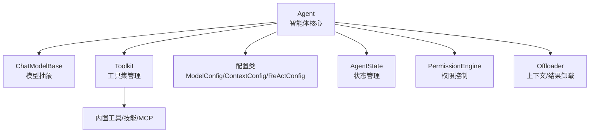
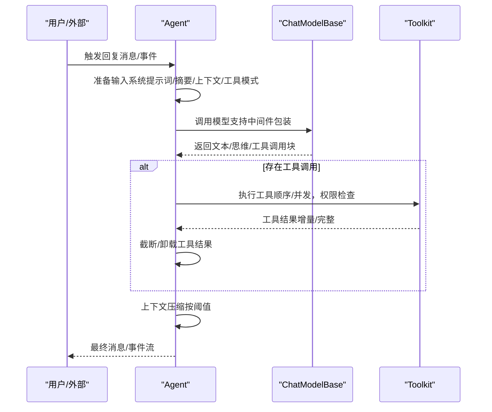
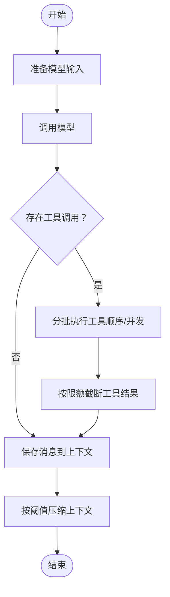
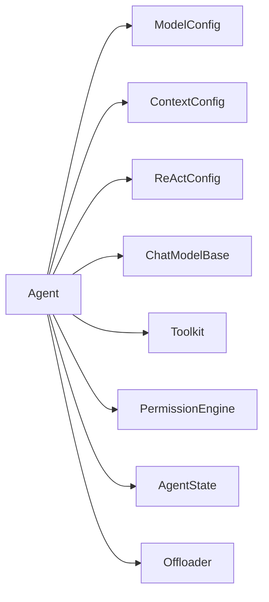

# 智能体定义与配置

<cite>
**本文引用的文件**
- [src/agentscope/agent/_agent.py](file://src/agentscope/agent/_agent.py)
- [src/agentscope/agent/_config.py](file://src/agentscope/agent/_config.py)
- [src/agentscope/tool/_toolkit.py](file://src/agentscope/tool/_toolkit.py)
- [src/agentscope/model/_base.py](file://src/agentscope/model/_base.py)
- [src/agentscope/agent/__init__.py](file://src/agentscope/agent/__init__.py)
</cite>

## 目录
1. [简介](#简介)
2. [项目结构](#项目结构)
3. [核心组件](#核心组件)
4. [架构总览](#架构总览)
5. [详细组件分析](#详细组件分析)
6. [依赖分析](#依赖分析)
7. [性能考虑](#性能考虑)
8. [故障排查指南](#故障排查指南)
9. [结论](#结论)
10. [附录](#附录)

## 简介
本文件系统性地梳理 AgentScope 中“智能体定义与配置”的实现与使用方法，重点围绕以下主题展开：
- Agent 类核心构造函数参数：name、system_prompt、model、toolkit 等的作用与用法
- 配置类：ModelConfig、ContextConfig、ReActConfig 的功能与参数设置
- 智能体初始化流程、配置验证机制与默认值处理
- 不同场景下的配置策略与性能优化建议
- 完整配置示例与常见问题解决方案

## 项目结构
AgentScope 的智能体体系由“智能体核心（Agent）+ 模型抽象（ChatModelBase）+ 工具集（Toolkit）+ 配置类（ModelConfig/ContextConfig/ReActConfig）”构成，模块间通过清晰的职责边界协作。

图表来源
- [src/agentscope/agent/_agent.py](file://src/agentscope/agent/_agent.py)
- [src/agentscope/model/_base.py](file://src/agentscope/model/_base.py)
- [src/agentscope/tool/_toolkit.py](file://src/agentscope/tool/_toolkit.py)
- [src/agentscope/agent/_config.py](file://src/agentscope/agent/_config.py)

章节来源
- [src/agentscope/agent/_agent.py](file://src/agentscope/agent/_agent.py)
- [src/agentscope/agent/__init__.py](file://src/agentscope/agent/__init__.py)

## 核心组件
本节聚焦 Agent 类的构造函数参数与职责，以及三大配置类的用途与参数含义。

- Agent 构造函数关键参数
  - name: 智能体标识符，用于事件与日志区分
  - system_prompt: 系统提示词，可动态附加指令；最终拼接后作为模型输入的一部分
  - model: ChatModelBase 实例，承载具体模型调用能力（含重试、流式、上下文长度等）
  - toolkit: Toolkit 实例，统一注册与管理工具、技能、MCP 客户端
  - middlewares: 中间件列表，按钩子点（如 on_reply/on_reasoning/on_acting/on_model_call/on_system_prompt/on_compress_context）增强行为
  - state: AgentState 实例，维护对话上下文、摘要、工具组激活状态等
  - offloader: 上下文/工具结果卸载器，用于超长上下文或大结果的外存存储
  - model_config: ModelConfig，控制主备模型与重试策略
  - context_config: ContextConfig，控制上下文压缩阈值、保留比例、压缩模板与工具结果截断
  - react_config: ReActConfig，控制推理-行动循环的最大迭代次数与拒绝时的行为

- 配置类概览
  - ModelConfig：主模型重试次数、备用模型
  - ContextConfig：触发压缩的比例、保留比例、压缩提示词、摘要模板、摘要结构、工具结果最大令牌数
  - ReActConfig：最大迭代次数、遇到拒绝时是否停止回复

章节来源
- [src/agentscope/agent/_agent.py](file://src/agentscope/agent/_agent.py)
- [src/agentscope/agent/_config.py](file://src/agentscope/agent/_config.py)

## 架构总览
Agent 的运行时核心是“推理-行动”循环（ReAct），在每次回复中：
- 准备模型输入（系统提示词、压缩摘要、历史消息、可用工具模式）
- 调用模型生成文本/思维/工具调用块
- 若有工具调用，则进入工具执行阶段（顺序或并发）
- 支持用户确认与外部执行事件的接入
- 周期性进行上下文压缩与工具结果截断，避免超出模型上下文

图表来源
- [src/agentscope/agent/_agent.py](file://src/agentscope/agent/_agent.py)
- [src/agentscope/model/_base.py](file://src/agentscope/model/_base.py)
- [src/agentscope/tool/_toolkit.py](file://src/agentscope/tool/_toolkit.py)

## 详细组件分析

### Agent 类：构造与初始化流程
- 参数绑定与默认值
  - name/system_prompt/model/toolkit/state/offloader 直接赋值
  - model_config/context_config/react_config 默认使用对应配置类的实例
  - 权限引擎基于 AgentState 的权限上下文初始化
  - 中间件按钩子过滤并缓存，仅在需要时参与链式调用
- 初始化要点
  - 若未提供 state，自动创建默认状态
  - 若未提供 toolkit，创建空工具集
  - 中间件仅保留实现了相应钩子的处理器
- 配置验证与默认值
  - 配置类基于 Pydantic，具备字段范围校验与默认值
  - ChatModelBase 提供参数类与上下文长度等基础能力
  - 未显式传入的配置均采用默认值，确保最小可用性

章节来源
- [src/agentscope/agent/_agent.py](file://src/agentscope/agent/_agent.py)
- [src/agentscope/agent/_config.py](file://src/agentscope/agent/_config.py)
- [src/agentscope/model/_base.py](file://src/agentscope/model/_base.py)

### 配置类详解：ModelConfig/ContextConfig/ReActConfig
- ModelConfig
  - max_retries：在初始调用基础上的重试次数，避免与底层模型内建重试叠加
  - fallback_model：失败时的备用模型，配合重试策略形成降级链
- ContextConfig
  - trigger_ratio/reserve_ratio：触发压缩与保留比例，二者需满足约束以保证压缩空间
  - compression_prompt/summary_template/summary_schema：压缩摘要生成的提示、模板与结构化模式
  - tool_result_limit：工具结果最大令牌数，超过则截断并可卸载
- ReActConfig
  - max_iters：单次回复内推理-行动的最大迭代轮数
  - stop_on_reject：当工具被拒绝时是否提前结束回复

章节来源
- [src/agentscope/agent/_config.py](file://src/agentscope/agent/_config.py)

### 工具集 Toolkit：注册、选择与执行
- 组织结构
  - 默认“basic”工具组，支持注册普通工具、技能加载器、MCP 客户端
  - 可自定义多个工具组，并通过元工具动态切换激活状态
- 能力
  - 动态生成工具 JSON 模式
  - 统一执行接口，支持同步/异步/流式返回
  - 错误处理与异常转换（工具不存在、组未激活、MCP 异常等）
- 使用建议
  - 将高风险或外部执行工具置于非 basic 组并通过元工具激活
  - 对需要状态注入的工具谨慎启用后台卸载，避免并发状态冲突

章节来源
- [src/agentscope/tool/_toolkit.py](file://src/agentscope/tool/_toolkit.py)

### 模型抽象 ChatModelBase：调用、重试与结构化输出
- 关键能力
  - 统一调用入口，内置可重试逻辑（受可重试异常类型限制）
  - 计算令牌数的快速估算方法，支持多模态数据块
  - 结构化输出生成（通过注入工具强制 LLM 输出符合模式）
- 与 Agent 协作
  - Agent 在推理前准备输入，调用模型时可叠加 on_model_call 中间件
  - 支持流式/非流式响应，统一事件转换

章节来源
- [src/agentscope/model/_base.py](file://src/agentscope/model/_base.py)
- [src/agentscope/agent/_agent.py](file://src/agentscope/agent/_agent.py)

### 推理-行动循环与上下文压缩
- 循环控制
  - 根据工具调用状态决定下一步动作（继续推理/执行工具/退出等待）
  - 迭代上限由 ReActConfig.max_iters 控制
- 上下文压缩
  - 当预估令牌数超过阈值时触发，保留部分消息并生成摘要
  - 支持卸载被压缩的历史消息到外存
- 工具结果截断
  - 超过工具结果限额时对文本块进行截断，并可将剩余内容卸载

图表来源
- [src/agentscope/agent/_agent.py](file://src/agentscope/agent/_agent.py)

章节来源
- [src/agentscope/agent/_agent.py](file://src/agentscope/agent/_agent.py)

## 依赖分析
- Agent 对各模块的依赖关系
  - 依赖 ChatModelBase 进行模型调用与令牌计数
  - 依赖 Toolkit 提供工具模式与执行
  - 依赖配置类提供运行时参数
  - 依赖权限引擎进行工具调用决策
  - 可选依赖 Offloader 进行上下文/结果卸载

图表来源
- [src/agentscope/agent/_agent.py](file://src/agentscope/agent/_agent.py)
- [src/agentscope/agent/_config.py](file://src/agentscope/agent/_config.py)
- [src/agentscope/model/_base.py](file://src/agentscope/model/_base.py)
- [src/agentscope/tool/_toolkit.py](file://src/agentscope/tool/_toolkit.py)

章节来源
- [src/agentscope/agent/_agent.py](file://src/agentscope/agent/_agent.py)
- [src/agentscope/agent/_config.py](file://src/agentscope/agent/_config.py)

## 性能考虑
- 上下文压缩
  - 合理设置 trigger_ratio 与 reserve_ratio，避免频繁压缩或保留不足
  - 使用 offloader 将压缩历史与大结果外存化，降低内存压力
- 工具执行
  - 对可并发且无副作用的工具尽量并发执行，减少总耗时
  - 对需要状态注入的工具避免后台卸载，防止竞态
- 模型调用
  - 合理设置 max_retries，避免与底层模型重试叠加导致延迟放大
  - 使用流式响应提升交互体验，但注意事件转换开销
- 令牌估算
  - 使用模型提供的令牌估算方法，结合实际分词器优化精度

## 故障排查指南
- 工具相关
  - 工具不存在：检查工具名与已注册工具集合
  - 工具组未激活：通过元工具激活目标组后再调用
  - 输入解析失败：核对工具输入模式与传入参数
- 权限相关
  - 工具被拒绝：根据权限引擎建议规则调整或人工确认
- 上下文相关
  - 压缩阈值过高：提高触发比例或降低保留比例
  - 压缩失败：尝试移除旧上下文片段以腾出空间
- 模型相关
  - 调用失败：启用备用模型或增加重试次数
  - 结构化输出失败：检查注入的工具模式与系统提示词

章节来源
- [src/agentscope/tool/_toolkit.py](file://src/agentscope/tool/_toolkit.py)
- [src/agentscope/agent/_agent.py](file://src/agentscope/agent/_agent.py)
- [src/agentscope/model/_base.py](file://src/agentscope/model/_base.py)

## 结论
AgentScope 的智能体定义与配置以“配置即契约”的方式提供了高度可组合的能力：
- Agent 通过明确的构造参数与配置类，将系统提示词、模型、工具集、中间件、状态与卸载等能力解耦
- ContextConfig/ReActConfig/ModelConfig 分别从“上下文管理”“推理控制”“模型鲁棒性”三个维度保障稳定性与性能
- Toolkit 与权限引擎共同确保工具使用的安全与可控
- 在不同场景下，应依据任务复杂度、上下文长度、工具并发需求与可靠性要求，合理设置配置参数并进行性能优化

## 附录

### 配置最佳实践
- 通用场景
  - 启用上下文压缩：设置合理的 trigger_ratio 与 reserve_ratio
  - 控制工具结果大小：通过 tool_result_limit 限制单次结果规模
  - 适度并发：对只读/低风险工具并发执行，对写操作工具顺序执行
- 高可靠性场景
  - 设置 fallback_model 与合理的 max_retries
  - 在关键路径上启用 on_model_call 中间件进行可观测性增强
- 大模型/长上下文场景
  - 提前评估模型上下文长度，合理拆分任务
  - 使用 offloader 将历史消息与大结果外存化

### 常见问题与解决
- “系统提示词超出阈值无法压缩”
  - 解决：降低系统提示词长度或提高模型上下文长度
- “工具调用被拒绝”
  - 解决：根据权限建议规则调整或人工确认
- “模型调用超时/失败”
  - 解决：启用备用模型、增加重试次数、检查网络与凭据