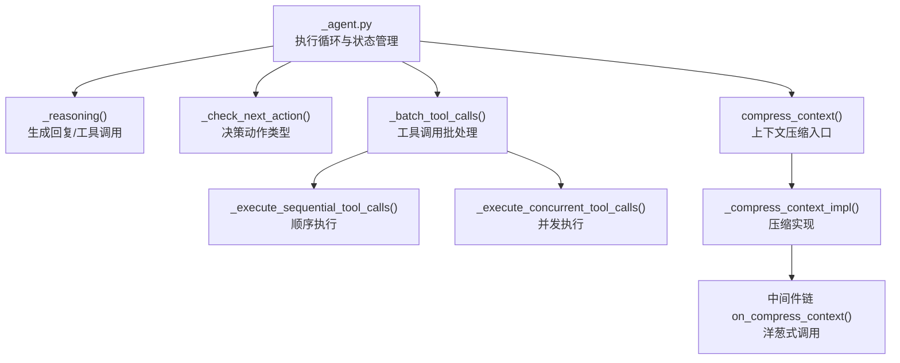
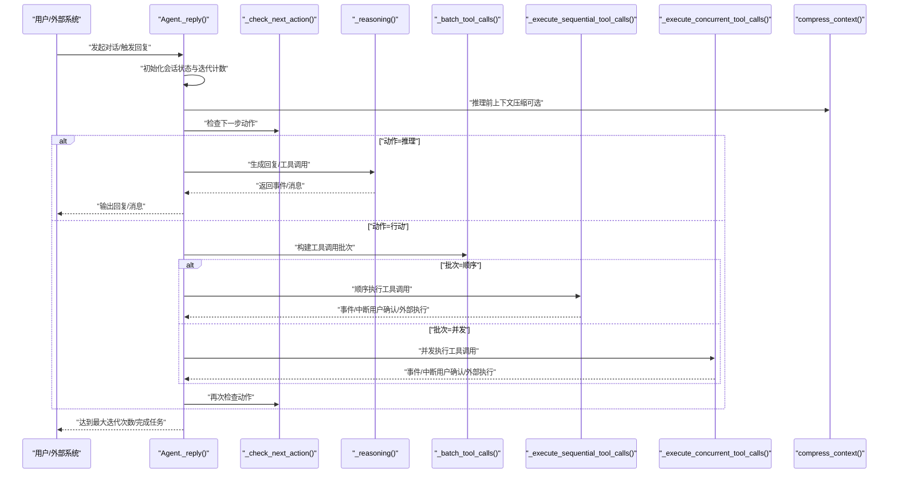
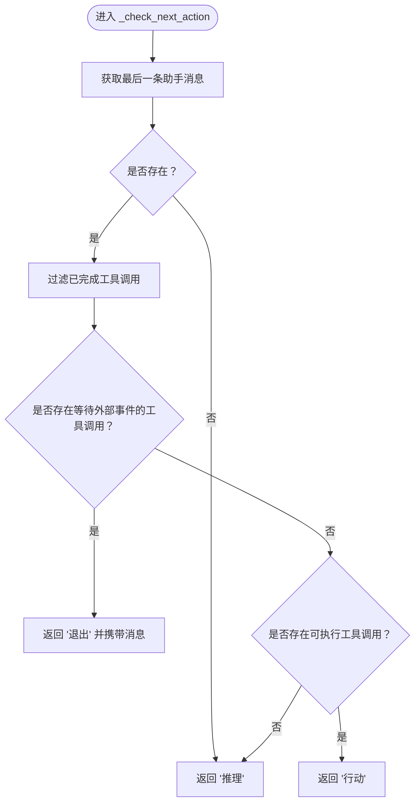
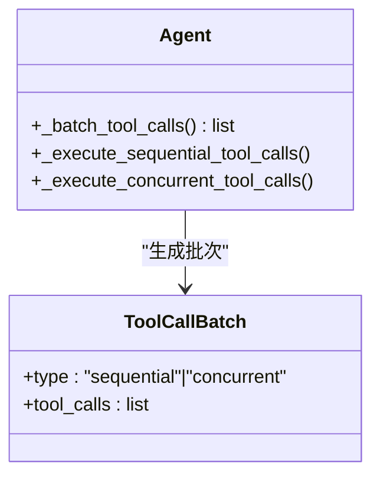
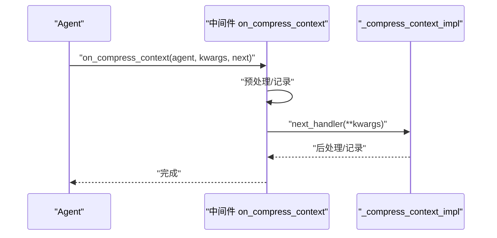
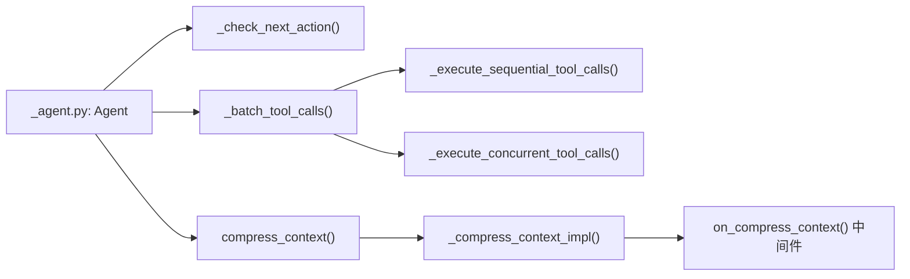

# 智能体执行循环

<cite>
**本文引用的文件**
- [src/agentscope/agent/_agent.py](file://src/agentscope/agent/_agent.py)
- [src/agentscope/middleware/_base.py](file://src/agentscope/middleware/_base.py)
- [tests/middleware_test.py](file://tests/middleware_test.py)
- [tests/compress_context_test.py](file://tests/compress_context_test.py)
</cite>

## 目录
1. [引言](#引言)
2. [项目结构](#项目结构)
3. [核心组件](#核心组件)
4. [架构总览](#架构总览)
5. [详细组件分析](#详细组件分析)
6. [依赖关系分析](#依赖关系分析)
7. [性能考量](#性能考量)
8. [故障排查指南](#故障排查指南)
9. [结论](#结论)
10. [附录](#附录)

## 引言
本文件系统性阐述智能体执行循环（推理-行动循环，Reasoning-Acting Loop）的设计与实现，重点覆盖以下主题：
- 循环启动条件、执行步骤与终止条件
- _check_next_action() 决策逻辑与三种动作分支
- 推理（reasoning）与行动（acting）两种模式的区别与适用场景
- 工具调用的批处理机制：顺序执行与并发执行的策略选择
- 最大迭代次数限制与异常处理机制
- 上下文压缩在执行循环中的作用与触发时机
- 性能优化建议与调试方法

## 项目结构
围绕执行循环的核心代码位于智能体模块中，关键文件如下：
- 执行循环主体与状态管理：src/agentscope/agent/_agent.py
- 中间件钩子定义（上下文压缩中间件接口）：src/agentscope/middleware/_base.py
- 上下文压缩中间件行为测试：tests/middleware_test.py
- 上下文压缩功能测试：tests/compress_context_test.py

图表来源
- [src/agentscope/agent/_agent.py:595-686](file://src/agentscope/agent/_agent.py#L595-L686)
- [src/agentscope/agent/_agent.py:1077-1164](file://src/agentscope/agent/_agent.py#L1077-L1164)
- [src/agentscope/agent/_agent.py:258-301](file://src/agentscope/agent/_agent.py#L258-L301)
- [src/agentscope/middleware/_base.py:187-206](file://src/agentscope/middleware/_base.py#L187-L206)

章节来源
- [src/agentscope/agent/_agent.py:591-686](file://src/agentscope/agent/_agent.py#L591-L686)
- [src/agentscope/agent/_agent.py:1077-1164](file://src/agentscope/agent/_agent.py#L1077-L1164)
- [src/agentscope/agent/_agent.py:258-301](file://src/agentscope/agent/_agent.py#L258-L301)
- [src/agentscope/middleware/_base.py:187-206](file://src/agentscope/middleware/_base.py#L187-L206)

## 核心组件
- 执行循环入口与控制流：负责初始化会话状态、进入推理-行动循环、处理最大迭代超限事件
- 动作决策器：根据上下文与工具调用状态判断下一步是“退出”、“推理”还是“行动”
- 工具调用批处理器：将待执行工具调用按安全性和并发能力分组为顺序或并发批次
- 顺序/并发执行器：串行或并行执行工具调用，并在需要时暂停等待外部确认或执行结果
- 上下文压缩：在推理前按配置触发压缩，支持中间件洋葱式扩展

章节来源
- [src/agentscope/agent/_agent.py:595-686](file://src/agentscope/agent/_agent.py#L595-L686)
- [src/agentscope/agent/_agent.py:2218-2265](file://src/agentscope/agent/_agent.py#L2218-L2265)
- [src/agentscope/agent/_agent.py:1077-1164](file://src/agentscope/agent/_agent.py#L1077-L1164)
- [src/agentscope/agent/_agent.py:258-301](file://src/agentscope/agent/_agent.py#L258-L301)

## 架构总览
推理-行动循环以“状态驱动”的方式运行，每轮迭代由动作决策器决定下一步是推理生成回复，还是行动执行工具调用；当存在可执行工具调用时，按安全性与并发能力进行批处理，再顺序或并发执行；在推理前可触发上下文压缩以控制上下文长度。

图表来源
- [src/agentscope/agent/_agent.py:595-686](file://src/agentscope/agent/_agent.py#L595-L686)
- [src/agentscope/agent/_agent.py:687-720](file://src/agentscope/agent/_agent.py#L687-L720)
- [src/agentscope/agent/_agent.py:1077-1164](file://src/agentscope/agent/_agent.py#L1077-L1164)
- [src/agentscope/agent/_agent.py:1117-1164](file://src/agentscope/agent/_agent.py#L1117-L1164)
- [src/agentscope/agent/_agent.py:258-301](file://src/agentscope/agent/_agent.py#L258-L301)

## 详细组件分析

### 启动条件、执行步骤与终止条件
- 启动条件
  - 初始化会话状态：分配新的回复ID，迭代计数清零
  - 触发“回复开始”事件
- 执行步骤
  - 进入循环：当当前迭代小于最大迭代次数时继续
  - 动作决策：调用 _check_next_action() 获取动作类型
  - 若动作为“推理”：在推理前进行上下文压缩，随后进入 _reasoning() 生成回复或工具调用
  - 若动作为“行动”：通过 _batch_tool_calls() 构建批次，按顺序或并发执行
  - 在每次行动批次执行过程中，若产生需要外部交互的事件，则暂停等待外部触发
  - 每轮结束后迭代计数+1
- 终止条件
  - 达到最大迭代次数：发出“超过最大迭代”事件并提示
  - 无可用工具调用且无需外部交互：结束循环

章节来源
- [src/agentscope/agent/_agent.py:585-686](file://src/agentscope/agent/_agent.py#L585-L686)

### _check_next_action() 决策逻辑
该方法基于最后一条助手消息中的工具调用块与工具结果块，判断是否仍有未完成的工具调用，从而决定下一步动作：
- 若没有最后一条助手消息：直接进入“推理”
- 若存在工具调用但尚未有对应工具结果：存在“未完成工具调用”，需继续“行动”
- 若存在“等待外部事件”的工具调用（例如待确认或已提交），而无可执行工具调用：返回“退出”，等待外部事件
- 若既无等待外部事件的工具调用，也无可执行工具调用：返回“推理”

图表来源
- [src/agentscope/agent/_agent.py:2218-2265](file://src/agentscope/agent/_agent.py#L2218-L2265)

章节来源
- [src/agentscope/agent/_agent.py:2218-2265](file://src/agentscope/agent/_agent.py#L2218-L2265)

### 推理（reasoning）与行动（acting）两种模式
- 推理模式
  - 触发时机：无可用工具调用且无需外部交互
  - 行为：在推理前进行上下文压缩，随后生成回复或工具调用
  - 适用场景：需要模型进一步思考、总结、规划或生成下一步指令
- 行动模式
  - 触发时机：存在可执行工具调用
  - 行为：将工具调用按安全性与并发能力分批，顺序或并发执行
  - 适用场景：需要访问外部资源、执行脚本、读写文件等

章节来源
- [src/agentscope/agent/_agent.py:607-622](file://src/agentscope/agent/_agent.py#L607-L622)
- [src/agentscope/agent/_agent.py:624-670](file://src/agentscope/agent/_agent.py#L624-L670)

### 工具调用的批处理机制
- 批处理策略
  - 顺序执行：适用于非并发安全的工具（如可能产生竞态或状态冲突）
  - 并发执行：适用于并发安全的工具（如独立的IO操作）
- 分批规则
  - 基于工具的并发安全性标记，将连续的并发安全工具合并为一个“并发”批次，否则拆分为“顺序”批次
- 执行流程
  - 顺序执行：逐个工具调用执行，遇到需要外部交互的事件则暂停
  - 并发执行：并发调度多个工具调用，遇到需要外部交互的事件则暂停
- 外部交互中断
  - 当产生“需要用户确认”或“需要外部执行”事件时，停止当前批次，等待外部触发后再继续

图表来源
- [src/agentscope/agent/_agent.py:1077-1164](file://src/agentscope/agent/_agent.py#L1077-L1164)

章节来源
- [src/agentscope/agent/_agent.py:1077-1164](file://src/agentscope/agent/_agent.py#L1077-L1164)
- [src/agentscope/agent/_agent.py:1117-1164](file://src/agentscope/agent/_agent.py#L1117-L1164)

### 最大迭代次数限制与异常处理
- 最大迭代次数
  - 由配置项提供，循环在达到上限后发出“超过最大迭代”事件并提示
- 异常处理
  - 行动批次执行过程中若产生需要外部交互的事件，循环会暂停并等待外部触发，避免强制继续
  - 循环结束后统一产出“完成”或“超时”类事件，便于上层感知

章节来源
- [src/agentscope/agent/_agent.py:672-686](file://src/agentscope/agent/_agent.py#L672-L686)
- [src/agentscope/agent/_agent.py:644-667](file://src/agentscope/agent/_agent.py#L644-L667)

### 上下文压缩在执行循环中的作用与时机
- 作用
  - 控制上下文长度，降低token消耗，提升推理稳定性
- 触发时机
  - 在“推理”分支进入前调用 compress_context()，确保输入上下文满足阈值要求
- 中间件扩展
  - 支持注册 on_compress_context 钩子，采用洋葱式链路调用，允许前置记录、短路跳过等行为
- 测试验证
  - 单测覆盖了中间件洋葱链顺序、短路跳过、无中间件直连实现等场景

图表来源
- [src/agentscope/agent/_agent.py:258-301](file://src/agentscope/agent/_agent.py#L258-L301)
- [src/agentscope/middleware/_base.py:187-206](file://src/agentscope/middleware/_base.py#L187-L206)
- [tests/middleware_test.py:818-952](file://tests/middleware_test.py#L818-L952)

章节来源
- [src/agentscope/agent/_agent.py:258-301](file://src/agentscope/agent/_agent.py#L258-L301)
- [src/agentscope/middleware/_base.py:187-206](file://src/agentscope/middleware/_base.py#L187-L206)
- [tests/middleware_test.py:818-952](file://tests/middleware_test.py#L818-L952)
- [tests/compress_context_test.py:605-867](file://tests/compress_context_test.py#L605-L867)

## 依赖关系分析
- Agent 对工具调用与状态的依赖
  - _check_next_action 依赖最后一条助手消息中的工具调用/结果块
  - _batch_tool_calls 依赖工具的并发安全性标记
  - _execute_sequential_tool_calls/_execute_concurrent_tool_calls 依赖工具调用执行器
- 上下文压缩的依赖
  - compress_context 可通过中间件链扩展，最终委托给 _compress_context_impl 实现
- 外部交互依赖
  - 行动执行过程中可能产生 RequireUserConfirmEvent 或 RequireExternalExecutionEvent，导致循环暂停

图表来源
- [src/agentscope/agent/_agent.py:2218-2265](file://src/agentscope/agent/_agent.py#L2218-L2265)
- [src/agentscope/agent/_agent.py:1077-1164](file://src/agentscope/agent/_agent.py#L1077-L1164)
- [src/agentscope/agent/_agent.py:258-301](file://src/agentscope/agent/_agent.py#L258-L301)
- [src/agentscope/middleware/_base.py:187-206](file://src/agentscope/middleware/_base.py#L187-L206)

章节来源
- [src/agentscope/agent/_agent.py:2218-2265](file://src/agentscope/agent/_agent.py#L2218-L2265)
- [src/agentscope/agent/_agent.py:1077-1164](file://src/agentscope/agent/_agent.py#L1077-L1164)
- [src/agentscope/agent/_agent.py:258-301](file://src/agentscope/agent/_agent.py#L258-L301)
- [src/agentscope/middleware/_base.py:187-206](file://src/agentscope/middleware/_base.py#L187-L206)

## 性能考量
- 批处理策略
  - 将并发安全工具合并为并发批次，减少调度开销；对非并发安全工具保持顺序执行，避免竞态
- 上下文压缩
  - 在推理前压缩上下文，有助于降低token使用与延迟，提高稳定性
- 中间件短路
  - 若中间件可判定无需压缩，可通过短路跳过实际实现，减少额外调用
- 调度与并发
  - 并发执行应结合工具的资源占用与外部服务限流策略，避免过度并发导致失败率上升

[本节为通用指导，不直接分析具体文件]

## 故障排查指南
- 症状：循环长时间不结束
  - 检查是否存在“等待外部事件”的工具调用，确认外部系统是否已触发后续事件
  - 查看是否达到最大迭代次数
- 症状：工具调用未被执行
  - 检查 _check_next_action 的返回动作是否为“行动”，以及工具调用是否处于“可执行”状态
- 症状：上下文过长导致失败
  - 确认 compress_context 是否被调用，以及中间件链是否正确转发至实现
- 症状：并发工具调用出现竞态
  - 检查工具的并发安全性标记，必要时调整为顺序执行

章节来源
- [src/agentscope/agent/_agent.py:644-667](file://src/agentscope/agent/_agent.py#L644-L667)
- [src/agentscope/agent/_agent.py:2218-2265](file://src/agentscope/agent/_agent.py#L2218-L2265)
- [src/agentscope/agent/_agent.py:258-301](file://src/agentscope/agent/_agent.py#L258-L301)
- [tests/middleware_test.py:818-952](file://tests/middleware_test.py#L818-L952)

## 结论
推理-行动循环通过明确的动作决策、严谨的工具调用批处理与上下文压缩机制，实现了可控、可观测、可扩展的智能体执行流程。借助中间件链，系统可在不侵入核心逻辑的前提下实现灵活扩展。实践中应结合工具特性与外部约束合理选择顺序/并发策略，并重视上下文长度与最大迭代次数的配置，以获得稳定高效的执行效果。

[本节为总结性内容，不直接分析具体文件]

## 附录
- 关键实现位置参考
  - 执行循环入口与终止条件：[src/agentscope/agent/_agent.py:595-686](file://src/agentscope/agent/_agent.py#L595-L686)
  - 动作决策器：[src/agentscope/agent/_agent.py:2218-2265](file://src/agentscope/agent/_agent.py#L2218-L2265)
  - 工具调用批处理与执行：[src/agentscope/agent/_agent.py:1077-1164](file://src/agentscope/agent/_agent.py#L1077-L1164)
  - 上下文压缩入口与实现：[src/agentscope/agent/_agent.py:258-301](file://src/agentscope/agent/_agent.py#L258-L301)
  - 中间件钩子定义：[src/agentscope/middleware/_base.py:187-206](file://src/agentscope/middleware/_base.py#L187-L206)
  - 中间件行为测试：[tests/middleware_test.py:818-952](file://tests/middleware_test.py#L818-L952)
  - 上下文压缩功能测试：[tests/compress_context_test.py:605-867](file://tests/compress_context_test.py#L605-L867)

[本节为索引性内容，不直接分析具体文件]