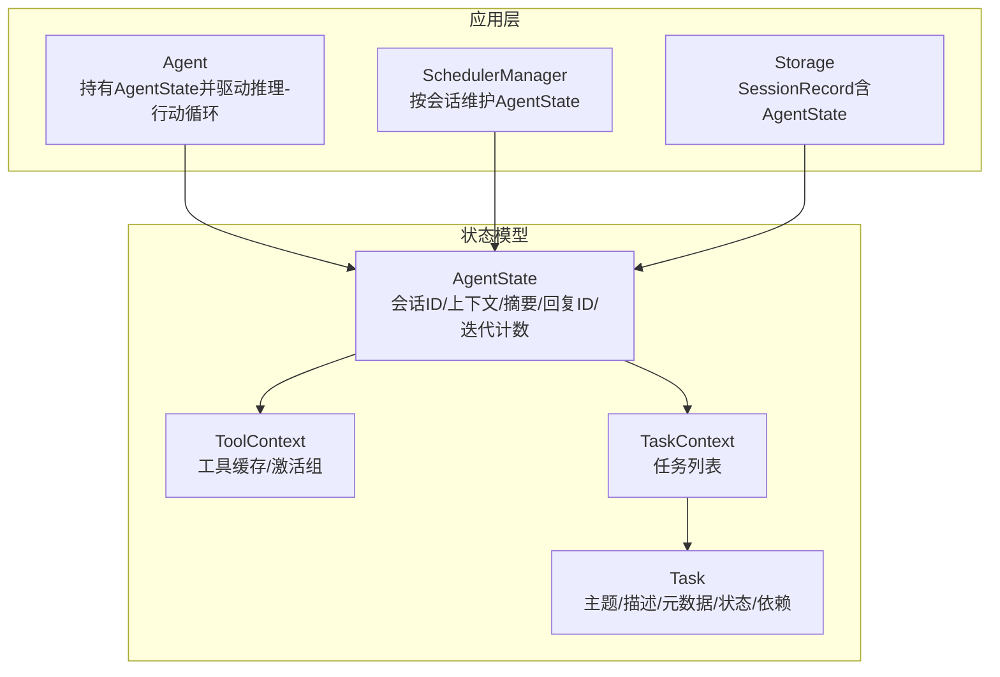
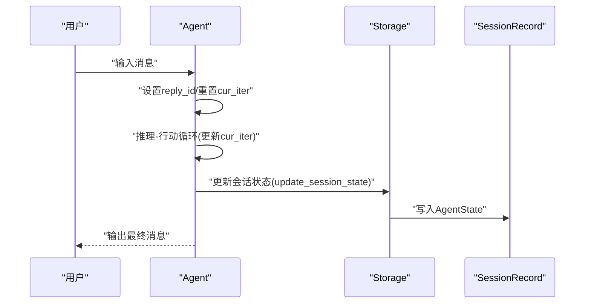
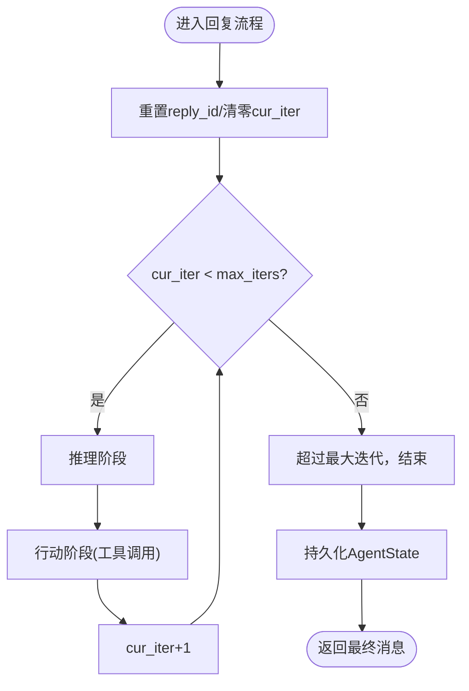
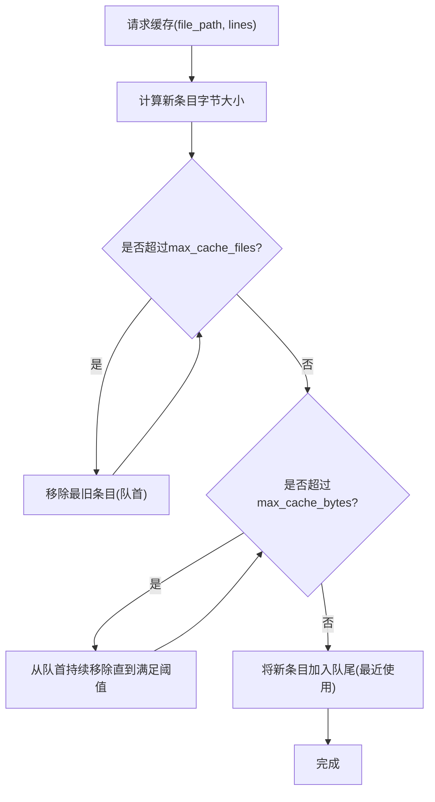
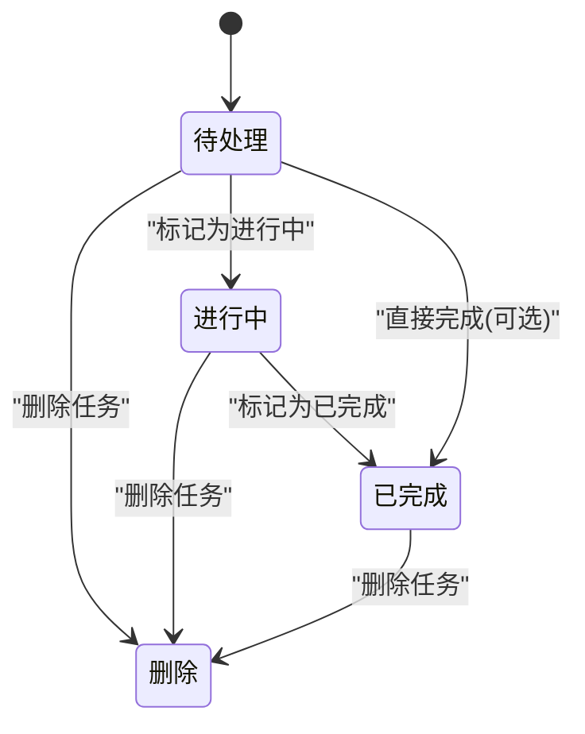
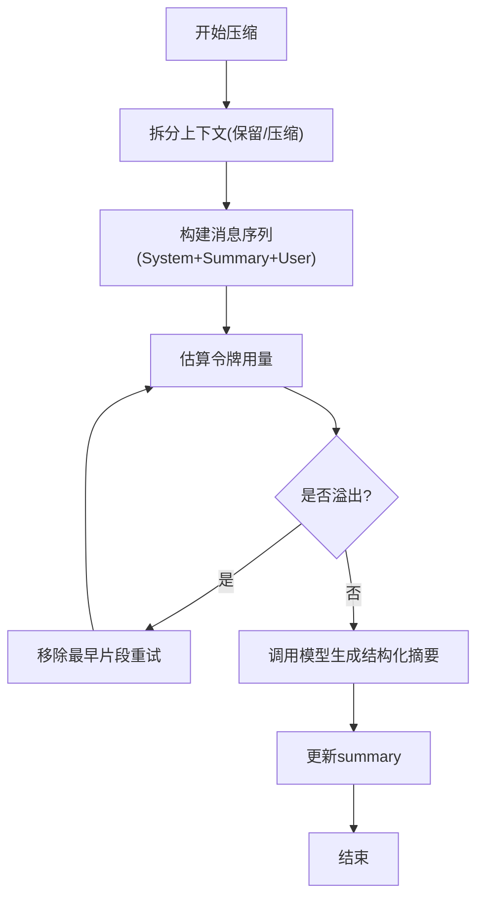
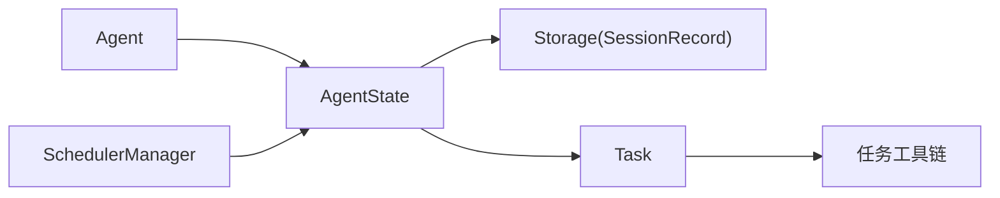

# 智能体状态管理

<cite>
**本文引用的文件**
- [src/agentscope/state/_state.py](file://src/agentscope/state/_state.py)
- [src/agentscope/state/_task.py](file://src/agentscope/state/_task.py)
- [src/agentscope/state/__init__.py](file://src/agentscope/state/__init__.py)
- [src/agentscope/agent/_agent.py](file://src/agentscope/agent/_agent.py)
- [src/agentscope/app/storage/_model/_session.py](file://src/agentscope/app/storage/_model/_session.py)
- [src/agentscope/app/storage/_base.py](file://src/agentscope/app/storage/_base.py)
- [src/agentscope/app/storage/_redis_storage.py](file://src/agentscope/app/storage/_redis_storage.py)
- [src/agentscope/app/_manager/_scheduler/_scheduler_manager.py](file://src/agentscope/app/_manager/_scheduler/_scheduler_manager.py)
- [src/agentscope/tool/_task/_update_task.py](file://src/agentscope/tool/_task/_update_task.py)
- [tests/compress_context_test.py](file://tests/compress_context_test.py)
</cite>

## 目录
1. [简介](#简介)
2. [项目结构](#项目结构)
3. [核心组件](#核心组件)
4. [架构总览](#架构总览)
5. [组件详解](#组件详解)
6. [依赖关系分析](#依赖关系分析)
7. [性能考量](#性能考量)
8. [故障排查指南](#故障排查指南)
9. [结论](#结论)
10. [附录](#附录)

## 简介
本文件系统性梳理智能体状态管理系统，重点围绕以下目标展开：
- 解释 AgentState 类的设计理念与核心状态字段：context、summary、reply_id、cur_iter 等，并说明其在推理-行动循环中的作用
- 阐述状态生命周期：初始化、更新、持久化与清理机制
- 介绍任务状态管理 TaskState 的实现与使用场景
- 提供最佳实践与调试技巧，帮助开发者正确使用与扩展状态管理

## 项目结构
状态管理相关代码主要位于 state 子模块，并在 agent、storage、scheduler 等模块中被广泛使用：
- state 子模块：定义 AgentState、Task、工具上下文与任务上下文
- agent 子模块：智能体持有并驱动状态流转
- storage 子模块：会话记录包含可变运行时状态，负责持久化
- scheduler 子模块：调度器在会话层面维护状态
- tool 子模块：任务工具链对 Task 进行增删改查与状态推进

图表来源
- [src/agentscope/state/_state.py:140-176](file://src/agentscope/state/_state.py#L140-L176)
- [src/agentscope/state/_task.py:10-39](file://src/agentscope/state/_task.py#L10-L39)
- [src/agentscope/agent/_agent.py:145-146](file://src/agentscope/agent/_agent.py#L145-L146)
- [src/agentscope/app/storage/_model/_session.py:73-74](file://src/agentscope/app/storage/_model/_session.py#L73-L74)
- [src/agentscope/app/_manager/_scheduler/_scheduler_manager.py:178-214](file://src/agentscope/app/_manager/_scheduler/_scheduler_manager.py#L178-L214)

章节来源
- [src/agentscope/state/_state.py:140-176](file://src/agentscope/state/_state.py#L140-L176)
- [src/agentscope/state/_task.py:10-39](file://src/agentscope/state/_task.py#L10-L39)
- [src/agentscope/state/__init__.py:4-10](file://src/agentscope/state/__init__.py#L4-L10)

## 核心组件
本节聚焦 AgentState 与 Task 的设计与职责。

- AgentState
  - 会话标识：用于区分不同会话的独立状态
  - 上下文 context：未压缩的历史消息列表，作为 LLM 输入
  - 摘要 summary：压缩后的上下文摘要，前置拼接到 LLM 输入
  - 回复 ID reply_id：当前回复的唯一标识，亦作为最终消息 ID
  - 当前迭代 cur_iter：推理-行动循环的迭代计数
  - 权限上下文 permission_context：控制工具权限
  - 工具上下文 tool_context：工具缓存与激活组
  - 任务上下文 tasks_context：任务集合

- Task
  - 主题 subject、描述 description、元数据 metadata
  - 创建时间 created_at、状态 state（pending/in_progress/completed）
  - 唯一标识 id、所有者 owner
  - 依赖 blocks/blocked_by：任务间阻塞关系

章节来源
- [src/agentscope/state/_state.py:140-176](file://src/agentscope/state/_state.py#L140-L176)
- [src/agentscope/state/_task.py:10-39](file://src/agentscope/state/_task.py#L10-L39)

## 架构总览
状态在系统中的关键路径如下：
- 初始化：Agent 在构造时创建或接收 AgentState；Scheduler 在需要时为会话创建状态
- 推理-行动循环：Agent 基于 AgentState 的 context/summary 决策，更新 reply_id 与 cur_iter
- 上下文压缩：根据配置与阈值，将历史消息压缩为 summary，减少上下文长度
- 持久化：每次交互后，Storage 将最新 AgentState 写入 SessionRecord
- 清理：工具缓存按大小与数量进行 LRU 淘汰；任务依赖关系由任务工具链维护

图表来源
- [src/agentscope/agent/_agent.py:582-589](file://src/agentscope/agent/_agent.py#L582-L589)
- [src/agentscope/agent/_agent.py:669-670](file://src/agentscope/agent/_agent.py#L669-L670)
- [src/agentscope/app/storage/_base.py:205-211](file://src/agentscope/app/storage/_base.py#L205-L211)
- [src/agentscope/app/storage/_model/_session.py:73-74](file://src/agentscope/app/storage/_model/_session.py#L73-L74)

## 组件详解

### AgentState 设计与字段语义
- 字段与职责
  - session_id：区分不同会话的独立状态
  - summary：压缩摘要，前置拼接到 LLM 输入，降低上下文开销
  - context：未压缩的历史消息，作为 LLM 输入主体
  - reply_id：当前回复的唯一标识，便于事件追踪与外部交互
  - cur_iter：推理-行动循环的迭代计数，用于限制最大迭代次数
  - permission_context：权限引擎上下文，决定工具可用性
  - tool_context：工具缓存与激活组，提升工具调用效率
  - tasks_context：任务集合，支持任务驱动的智能体行为

- 生命周期管理
  - 初始化：Agent 构造时创建或注入 AgentState；Scheduler 在会话创建时生成默认状态
  - 更新：每次回复开始重置 reply_id 并清零 cur_iter；推理-行动循环中递增 cur_iter
  - 持久化：每次交互后通过 Storage.update_session_state 写入 SessionRecord.state
  - 清理：工具缓存按文件数量与字节数进行 LRU 淘汰；任务依赖关系由任务工具链维护

- 在推理-行动循环中的作用
  - 上下文选择：优先使用 summary + 最新 context，避免超出模型上下文长度
  - 迭代控制：以 cur_iter 与配置的最大迭代次数比较，防止无限循环
  - 外部交互：当需要用户确认或外部执行时，通过 reply_id 保持会话一致性

图表来源
- [src/agentscope/agent/_agent.py:582-589](file://src/agentscope/agent/_agent.py#L582-L589)
- [src/agentscope/agent/_agent.py:669-670](file://src/agentscope/agent/_agent.py#L669-L670)
- [src/agentscope/app/storage/_base.py:205-211](file://src/agentscope/app/storage/_base.py#L205-L211)

章节来源
- [src/agentscope/state/_state.py:140-176](file://src/agentscope/state/_state.py#L140-L176)
- [src/agentscope/agent/_agent.py:582-589](file://src/agentscope/agent/_agent.py#L582-L589)
- [src/agentscope/agent/_agent.py:669-670](file://src/agentscope/agent/_agent.py#L669-L670)
- [src/agentscope/app/storage/_base.py:205-211](file://src/agentscope/app/storage/_base.py#L205-L211)

### ToolContext 与文件缓存策略
- 功能概述
  - 维护读取/写入/编辑工具的文件缓存，支持 LRU 淘汰
  - 通过文件修改时间校验缓存有效性，避免脏读
  - 支持按保留路径集清理缓存，仅保留当前活跃文件

- 缓存淘汰策略
  - 数量上限：超过最大文件数时，逐出最旧条目
  - 字节上限：累计缓存大小超过阈值时，逐出最旧条目直至满足条件
  - 逐出顺序：按访问时间（最近使用）排序，优先淘汰最早条目

图表来源
- [src/agentscope/state/_state.py:65-111](file://src/agentscope/state/_state.py#L65-L111)

章节来源
- [src/agentscope/state/_state.py:37-131](file://src/agentscope/state/_state.py#L37-L131)

### Task 与任务状态管理
- 状态机
  - pending → in_progress → completed
  - 支持删除（deleted）永久移除任务
- 依赖关系
  - blocks：本任务阻止的其他任务
  - blocked_by：阻塞本任务的任务
- 使用场景
  - 任务驱动的智能体行为编排
  - 任务间串并行约束与进度追踪
  - 与工具链配合，实现任务的创建、查询、更新与删除

图表来源
- [src/agentscope/tool/_task/_update_task.py:96-100](file://src/agentscope/tool/_task/_update_task.py#L96-L100)
- [src/agentscope/state/_task.py:25-26](file://src/agentscope/state/_task.py#L25-L26)

章节来源
- [src/agentscope/state/_task.py:10-39](file://src/agentscope/state/_task.py#L10-L39)
- [src/agentscope/tool/_task/_update_task.py:80-130](file://src/agentscope/tool/_task/_update_task.py#L80-L130)

### 上下文压缩与摘要更新
- 触发条件
  - 当 context 长度接近模型上下文上限时触发压缩
  - 可通过配置调整触发比例与保留比例
- 压缩流程
  - 准备系统提示与现有摘要
  - 对待压缩消息进行分段与令牌估算
  - 调用模型生成结构化摘要，更新 summary
  - 若首次失败且存在溢出风险，尝试移除最早上下文后重试

图表来源
- [src/agentscope/agent/_agent.py:364-471](file://src/agentscope/agent/_agent.py#L364-L471)
- [tests/compress_context_test.py:567-609](file://tests/compress_context_test.py#L567-L609)

章节来源
- [src/agentscope/agent/_agent.py:364-471](file://src/agentscope/agent/_agent.py#L364-L471)
- [tests/compress_context_test.py:567-609](file://tests/compress_context_test.py#L567-L609)

## 依赖关系分析
- AgentState 与 Agent
  - Agent 持有 AgentState 并在回复流程中更新其字段
- AgentState 与 Storage
  - Storage 的 SessionRecord 含有 AgentState 字段，提供 upsert/update_session_state 接口
- AgentState 与 Scheduler
  - Scheduler 在会话创建时生成 AgentState，支持状态化与非状态化两种模式
- Task 与工具链
  - 任务工具链提供任务的创建、查询、更新与删除，驱动 Task 状态机

图表来源
- [src/agentscope/agent/_agent.py:145-146](file://src/agentscope/agent/_agent.py#L145-L146)
- [src/agentscope/app/storage/_model/_session.py:73-74](file://src/agentscope/app/storage/_model/_session.py#L73-L74)
- [src/agentscope/app/_manager/_scheduler/_scheduler_manager.py:178-214](file://src/agentscope/app/_manager/_scheduler/_scheduler_manager.py#L178-L214)
- [src/agentscope/state/_task.py:10-39](file://src/agentscope/state/_task.py#L10-L39)

章节来源
- [src/agentscope/agent/_agent.py:145-146](file://src/agentscope/agent/_agent.py#L145-L146)
- [src/agentscope/app/storage/_model/_session.py:73-74](file://src/agentscope/app/storage/_model/_session.py#L73-L74)
- [src/agentscope/app/_manager/_scheduler/_scheduler_manager.py:178-214](file://src/agentscope/app/_manager/_scheduler/_scheduler_manager.py#L178-L214)
- [src/agentscope/state/_task.py:10-39](file://src/agentscope/state/_task.py#L10-L39)

## 性能考量
- 上下文压缩
  - 合理设置触发比例与保留比例，避免频繁压缩带来的额外开销
  - 在压缩失败时尝试移除最早片段，提高成功率
- 工具缓存
  - 控制最大缓存文件数与总字节数，平衡内存占用与命中率
  - 定期清理不活跃文件，避免缓存膨胀
- 迭代限制
  - 设置合理的最大迭代次数，防止长时间推理-行动循环
- 持久化频率
  - 在高频交互场景下，采用批量或异步持久化策略，降低写放大

## 故障排查指南
- 上下文过长导致压缩失败
  - 现象：压缩过程中出现令牌估算超限警告
  - 处理：适当降低触发比例或增加保留比例；必要时先移除最早片段再重试
- 工具缓存失效
  - 现象：缓存命中异常或读取到旧内容
  - 处理：检查文件修改时间是否变化；清理无效缓存条目
- 任务状态异常
  - 现象：任务状态无法推进或依赖关系错误
  - 处理：确保在更新前读取最新任务状态；检查 blocks 与 blocked_by 是否一致
- 会话状态未持久化
  - 现象：重启后状态丢失
  - 处理：确认 Storage.update_session_state 被调用；检查会话 ID 与存储键映射

章节来源
- [src/agentscope/agent/_agent.py:414-467](file://src/agentscope/agent/_agent.py#L414-L467)
- [src/agentscope/state/_state.py:37-131](file://src/agentscope/state/_state.py#L37-L131)
- [src/agentscope/tool/_task/_update_task.py:102-104](file://src/agentscope/tool/_task/_update_task.py#L102-L104)

## 结论
智能体状态管理系统通过 AgentState 将会话、上下文、摘要、回复与迭代等关键信息统一建模，并在 Agent 的推理-行动循环中动态更新。结合 Storage 的会话持久化与 Scheduler 的会话管理，实现了跨会话的状态延续。Task 则提供了任务驱动的行为编排能力。通过合理的上下文压缩、工具缓存与迭代限制策略，系统在保证性能的同时提升了稳定性与可维护性。

## 附录
- 最佳实践
  - 明确区分 context 与 summary 的使用场景，避免同时承载过多历史
  - 合理设置工具缓存上限，定期清理不活跃文件
  - 在高频交互场景下，采用异步或批量持久化策略
  - 使用 reply_id 串联外部交互事件，确保会话一致性
- 调试建议
  - 打印关键状态字段（如 summary 长度、cur_iter、缓存条目数量）
  - 记录压缩失败原因与重试路径
  - 校验任务依赖关系的一致性与完整性