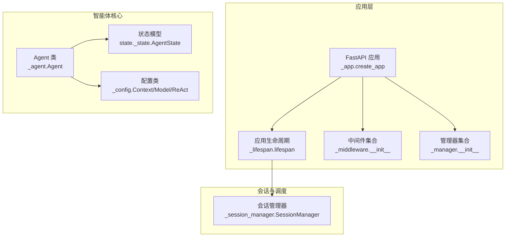
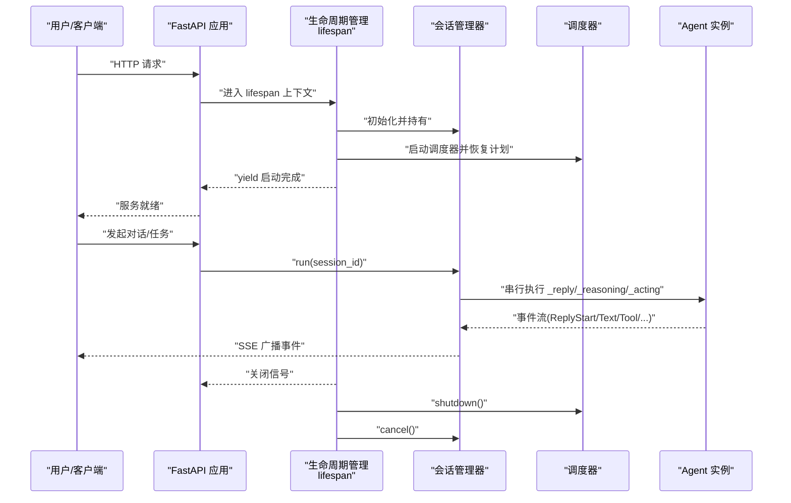
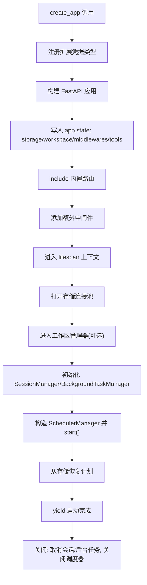
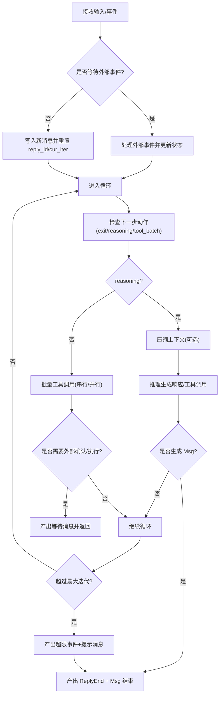
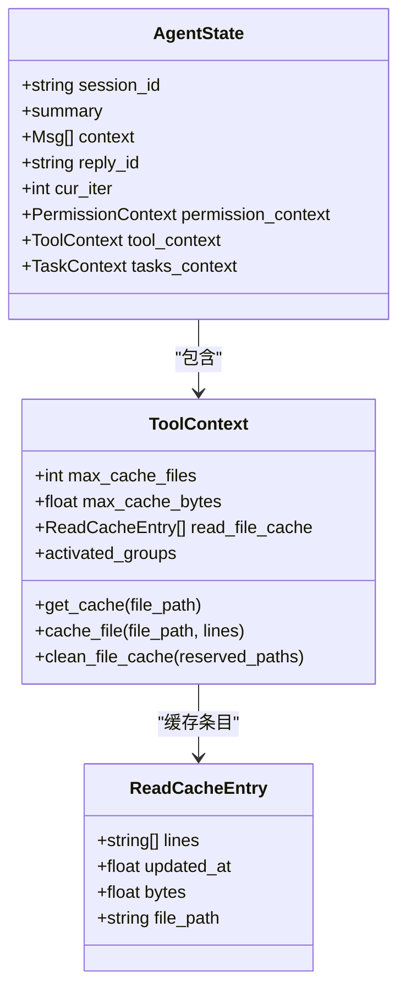
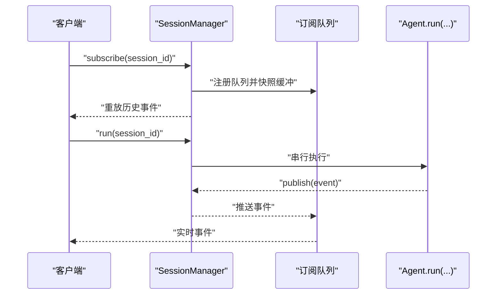
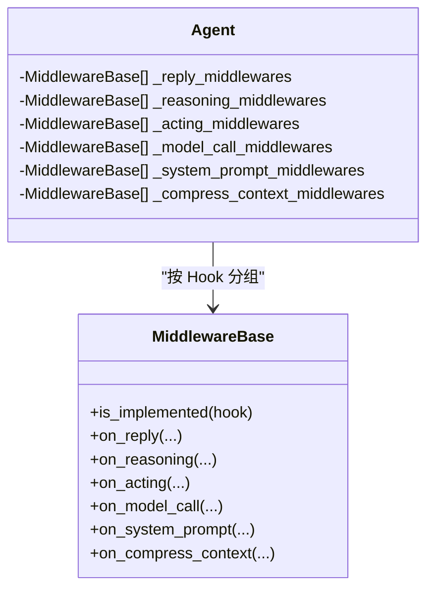
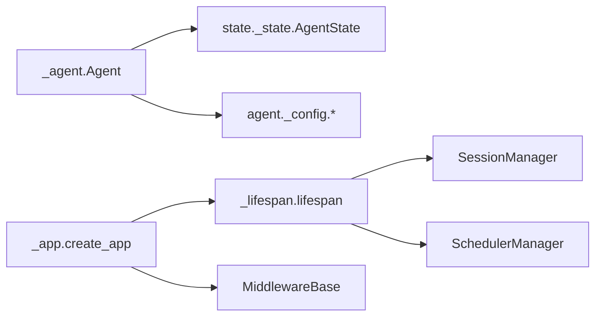

# 智能体生命周期

<cite>
**本文引用的文件**
- [src/agentscope/__init__.py](file://src/agentscope/__init__.py)
- [src/agentscope/app/__init__.py](file://src/agentscope/app/__init__.py)
- [src/agentscope/app/_app.py](file://src/agentscope/app/_app.py)
- [src/agentscope/app/_lifespan.py](file://src/agentscope/app/_lifespan.py)
- [src/agentscope/app/_manager/__init__.py](file://src/agentscope/app/_manager/__init__.py)
- [src/agentscope/app/_manager/_session_manager.py](file://src/agentscope/app/_manager/_session_manager.py)
- [src/agentscope/app/_middleware/__init__.py](file://src/agentscope/app/_middleware/__init__.py)
- [src/agentscope/agent/__init__.py](file://src/agentscope/agent/__init__.py)
- [src/agentscope/agent/_agent.py](file://src/agentscope/agent/_agent.py)
- [src/agentscope/agent/_config.py](file://src/agentscope/agent/_config.py)
- [src/agentscope/middleware/__init__.py](file://src/agentscope/middleware/__init__.py)
- [src/agentscope/state/__init__.py](file://src/agentscope/state/__init__.py)
- [src/agentscope/state/_state.py](file://src/agentscope/state/_state.py)
</cite>

## 目录
1. [引言](#引言)
2. [项目结构](#项目结构)
3. [核心组件](#核心组件)
4. [架构总览](#架构总览)
5. [详细组件分析](#详细组件分析)
6. [依赖分析](#依赖分析)
7. [性能考虑](#性能考虑)
8. [故障排查指南](#故障排查指南)
9. [结论](#结论)
10. [附录](#附录)

## 引言
本文件围绕智能体（Agent）在 AgentScope 应用中的生命周期进行系统化梳理，覆盖从创建、初始化、运行、暂停/恢复/重启、到清理与销毁的全链路。重点解释启动流程中的依赖注入、中间件注册与状态初始化；阐述应用环境中的托管机制（会话管理、调度器、后台任务、工作区管理）；说明智能体之间的协调与通信方式；并给出资源管理与内存优化策略及监控与故障恢复的最佳实践。

## 项目结构
AgentScope 将“应用服务”“智能体核心”“中间件体系”“状态与工具上下文”等模块分层组织，形成以 FastAPI 应用为中心的服务框架，配合会话管理、调度与工作区管理实现多智能体并发与持久化能力。

图示来源
- [src/agentscope/app/_app.py:29-129](file://src/agentscope/app/_app.py#L29-L129)
- [src/agentscope/app/_lifespan.py:14-63](file://src/agentscope/app/_lifespan.py#L14-L63)
- [src/agentscope/app/_manager/__init__.py:1-22](file://src/agentscope/app/_manager/__init__.py#L1-L22)
- [src/agentscope/app/_middleware/__init__.py:1-13](file://src/agentscope/app/_middleware/__init__.py#L1-L13)
- [src/agentscope/agent/_agent.py:94-186](file://src/agentscope/agent/_agent.py#L94-L186)
- [src/agentscope/agent/_config.py:56-178](file://src/agentscope/agent/_config.py#L56-L178)
- [src/agentscope/state/_state.py:140-177](file://src/agentscope/state/_state.py#L140-L177)
- [src/agentscope/app/_manager/_session_manager.py:49-198](file://src/agentscope/app/_manager/_session_manager.py#L49-L198)

章节来源
- [src/agentscope/app/__init__.py:1-50](file://src/agentscope/app/__init__.py#L1-L50)
- [src/agentscope/agent/__init__.py:1-7](file://src/agentscope/agent/__init__.py#L1-L7)
- [src/agentscope/middleware/__init__.py:1-11](file://src/agentscope/middleware/__init__.py#L1-L11)
- [src/agentscope/state/__init__.py:1-11](file://src/agentscope/state/__init__.py#L1-L11)

## 核心组件
- 应用工厂与生命周期
  - 应用工厂负责装配路由、中间件、共享状态与依赖注入点；生命周期钩子负责启动与关闭时的资源管理。
- 智能体核心
  - Agent 类封装推理-行动循环、事件流、权限控制、工具调用与中间件链式扩展。
- 状态与上下文
  - AgentState 统一承载会话、上下文、摘要、权限与工具缓存等可持久化状态。
- 中间件体系
  - 提供统一的 Hook 扩展点，支持回复、推理、行动、模型调用、系统提示与上下文压缩等阶段的拦截与增强。
- 会话与调度
  - SessionManager 实现同一会话内的串行化执行与事件广播；生命周期中启动调度器并恢复持久化计划。

章节来源
- [src/agentscope/app/_app.py:29-129](file://src/agentscope/app/_app.py#L29-L129)
- [src/agentscope/app/_lifespan.py:14-63](file://src/agentscope/app/_lifespan.py#L14-L63)
- [src/agentscope/agent/_agent.py:94-186](file://src/agentscope/agent/_agent.py#L94-L186)
- [src/agentscope/state/_state.py:140-177](file://src/agentscope/state/_state.py#L140-L177)
- [src/agentscope/app/_manager/_session_manager.py:49-198](file://src/agentscope/app/_manager/_session_manager.py#L49-L198)

## 架构总览
下图展示应用启动、智能体运行与资源清理的关键交互路径。

图示来源
- [src/agentscope/app/_app.py:104-129](file://src/agentscope/app/_app.py#L104-L129)
- [src/agentscope/app/_lifespan.py:35-63](file://src/agentscope/app/_lifespan.py#L35-L63)
- [src/agentscope/app/_manager/_session_manager.py:83-112](file://src/agentscope/app/_manager/_session_manager.py#L83-L112)
- [src/agentscope/agent/_agent.py:497-686](file://src/agentscope/agent/_agent.py#L497-L686)

## 详细组件分析

### 启动流程：依赖注入、中间件注册与状态初始化
- 依赖注入与共享状态
  - 应用工厂将存储后端、工作区管理器、额外中间件与工具工厂写入 app.state，生命周期与各管理器从该上下文读取。
- 中间件注册
  - 支持全局中间件与按智能体/会话动态生成的中间件工厂；动态中间件在每次智能体装配时按需返回，便于鉴权、审计、租户隔离等场景。
- 状态初始化
  - 生命周期在启动时创建会话管理器、后台任务管理器与调度器，并恢复持久化的计划；关闭时取消会话与后台任务、优雅关闭调度器。

图示来源
- [src/agentscope/app/_app.py:100-129](file://src/agentscope/app/_app.py#L100-L129)
- [src/agentscope/app/_lifespan.py:35-63](file://src/agentscope/app/_lifespan.py#L35-L63)

章节来源
- [src/agentscope/app/_app.py:29-129](file://src/agentscope/app/_app.py#L29-L129)
- [src/agentscope/app/_lifespan.py:14-63](file://src/agentscope/app/_lifespan.py#L14-L63)

### 运行阶段：推理-行动循环与事件流
- 推理-行动循环
  - 智能体在一次回复中迭代执行“推理-工具调用-观察-再推理”，受最大迭代次数限制；当需要外部确认或执行时，产生等待事件并中断当前批次。
- 事件流
  - 回复开始/结束、文本块、思考块、工具调用/结果、数据块、模型调用开始/结束、超出最大迭代等事件被持续产出，供会话管理器广播与前端订阅。
- 中间件链
  - 在回复、推理、行动、模型调用、系统提示与上下文压缩等 Hook 点，按顺序执行自定义中间件，支持 next_handler 串联。

图示来源
- [src/agentscope/agent/_agent.py:569-686](file://src/agentscope/agent/_agent.py#L569-L686)

章节来源
- [src/agentscope/agent/_agent.py:191-252](file://src/agentscope/agent/_agent.py#L191-L252)
- [src/agentscope/agent/_agent.py:497-686](file://src/agentscope/agent/_agent.py#L497-L686)

### 状态管理与内存优化
- AgentState
  - 包含会话 ID、上下文消息列表、压缩摘要、当前回复 ID、当前迭代计数、权限上下文、工具上下文与任务上下文。
- 工具读缓存
  - 基于 LRU 的文件读缓存，支持按数量与字节上限淘汰，保留特定路径的缓存，避免重复 IO。
- 上下文压缩
  - 当预估 token 超过阈值时，使用结构化摘要模型生成压缩摘要，并将未保留内容移出上下文，必要时回退删除最早条目。

图示来源
- [src/agentscope/state/_state.py:14-177](file://src/agentscope/state/_state.py#L14-L177)

章节来源
- [src/agentscope/state/_state.py:14-177](file://src/agentscope/state/_state.py#L14-L177)
- [src/agentscope/agent/_agent.py:259-492](file://src/agentscope/agent/_agent.py#L259-L492)

### 会话管理与并发控制
- 串行化
  - 按 session_id 维度持有 asyncio.Lock，确保同一会话内仅有一个活动运行。
- 事件广播
  - 每个会话运行维护事件缓冲区与订阅队列，新事件写入缓冲并广播给所有订阅者；订阅者可先收到历史事件快照，再接收实时事件。
- 生命周期
  - 应用关闭时取消所有活动运行，清空内部状态，使 SSE 生成器在队列被回收时自然结束。

图示来源
- [src/agentscope/app/_manager/_session_manager.py:145-184](file://src/agentscope/app/_manager/_session_manager.py#L145-L184)
- [src/agentscope/app/_manager/_session_manager.py:83-112](file://src/agentscope/app/_manager/_session_manager.py#L83-L112)

章节来源
- [src/agentscope/app/_manager/_session_manager.py:49-198](file://src/agentscope/app/_manager/_session_manager.py#L49-L198)

### 中间件与扩展点
- 中间件接口
  - 通过统一基类提供 on_reply/on_reasoning/on_acting/on_model_call/on_system_prompt/on_compress_context 等 Hook，智能体在对应阶段按序执行。
- 动态中间件工厂
  - 按用户/智能体/会话维度动态生成中间件列表，适合鉴权、审计、租户隔离等场景。

图示来源
- [src/agentscope/middleware/__init__.py:1-11](file://src/agentscope/middleware/__init__.py#L1-L11)
- [src/agentscope/agent/_agent.py:166-186](file://src/agentscope/agent/_agent.py#L166-L186)

章节来源
- [src/agentscope/middleware/__init__.py:1-11](file://src/agentscope/middleware/__init__.py#L1-L11)
- [src/agentscope/agent/_agent.py:166-186](file://src/agentscope/agent/_agent.py#L166-L186)

### 配置与行为约束
- 上下文压缩配置
  - 触发比例、保留比例、压缩提示词模板、摘要结构化模式与工具结果长度限制，保障长上下文下的稳定性。
- 推理-行动配置
  - 最大迭代次数、被拒绝时是否停止等参数，影响智能体的收敛性与交互节奏。
- 模型配置
  - 重试次数与回退模型，提升鲁棒性。

章节来源
- [src/agentscope/agent/_config.py:56-178](file://src/agentscope/agent/_config.py#L56-L178)

### 暂停、恢复与重启机制
- 暂停与恢复
  - 通过外部确认/执行事件实现“暂停”：当工具调用需要用户确认或外部执行时，智能体产出等待消息并停止当前批次，待事件到达后继续。
- 重启
  - 重启通常指重新发起一次回复流程（例如更换输入或触发新的会话），由上层控制器或调度器驱动；智能体内部通过重置回复 ID 与迭代计数参与重启语义。
- 计划与持久化
  - 调度器在生命周期启动时从存储恢复计划，使定时任务与计划任务在服务重启后继续执行。

章节来源
- [src/agentscope/agent/_agent.py:644-686](file://src/agentscope/agent/_agent.py#L644-L686)
- [src/agentscope/app/_lifespan.py:54-57](file://src/agentscope/app/_lifespan.py#L54-L57)

## 依赖分析
- 模块耦合
  - 应用层通过 app.state 与管理器解耦；智能体通过中间件与配置扩展，保持核心逻辑稳定。
- 外部依赖
  - FastAPI 作为应用框架；异步上下文与锁用于并发控制；事件模型贯穿会话与中间件扩展。
- 循环依赖
  - 未见直接循环导入；状态与工具上下文通过 Pydantic 模型解耦。

图示来源
- [src/agentscope/agent/_agent.py:94-186](file://src/agentscope/agent/_agent.py#L94-L186)
- [src/agentscope/state/_state.py:140-177](file://src/agentscope/state/_state.py#L140-L177)
- [src/agentscope/agent/_config.py:56-178](file://src/agentscope/agent/_config.py#L56-L178)
- [src/agentscope/app/_app.py:29-129](file://src/agentscope/app/_app.py#L29-L129)
- [src/agentscope/app/_lifespan.py:35-63](file://src/agentscope/app/_lifespan.py#L35-L63)
- [src/agentscope/app/_manager/_session_manager.py:49-198](file://src/agentscope/app/_manager/_session_manager.py#L49-L198)

章节来源
- [src/agentscope/app/_app.py:29-129](file://src/agentscope/app/_app.py#L29-L129)
- [src/agentscope/app/_lifespan.py:14-63](file://src/agentscope/app/_lifespan.py#L14-L63)
- [src/agentscope/app/_manager/__init__.py:1-22](file://src/agentscope/app/_manager/__init__.py#L1-L22)

## 性能考虑
- 事件流与广播
  - 使用队列与缓冲区实现事件广播，订阅者按需消费；建议控制单会话事件速率与消息大小，避免内存峰值。
- 上下文压缩
  - 合理设置触发比例与保留比例，减少模型输入 token；必要时启用工具结果截断，防止爆文。
- 工具缓存
  - 控制缓存数量与体积，结合 LRU 淘汰策略，降低重复 IO；仅保留当前会话相关文件路径。
- 并发串行化
  - 通过会话级锁保证串行执行，避免竞态；若需高吞吐，应拆分会话边界或采用更细粒度的任务模型。

## 故障排查指南
- 启动失败
  - 检查存储后端连接池与工作区管理器初始化；确认 app.state 注入项完整。
- 会话阻塞
  - 若出现长时间无响应，检查是否存在未释放的订阅队列或异常事件导致的死锁。
- 事件丢失
  - 订阅时需先注册队列再快照缓冲，确保无竞争窗口；如仍丢失，核查缓冲区容量与事件生产速率。
- 上下文溢出
  - 压缩阈值设置过低或保留比例过高会导致无法压缩；适当提高保留比例或降低触发比例。
- 中间件异常
  - 中间件链中任一环节抛错会中断流程；建议为关键中间件增加日志与降级策略。

章节来源
- [src/agentscope/app/_lifespan.py:35-63](file://src/agentscope/app/_lifespan.py#L35-L63)
- [src/agentscope/app/_manager/_session_manager.py:145-184](file://src/agentscope/app/_manager/_session_manager.py#L145-L184)
- [src/agentscope/agent/_agent.py:315-342](file://src/agentscope/agent/_agent.py#L315-L342)

## 结论
AgentScope 通过清晰的应用生命周期、会话串行化与事件广播、可插拔中间件与可配置的智能体行为，提供了稳定且可扩展的智能体托管平台。结合上下文压缩、工具缓存与并发控制策略，可在复杂场景中实现高效、可控的智能体运行与资源管理。

## 附录
- 快速参考
  - 应用工厂：[create_app:29-129](file://src/agentscope/app/_app.py#L29-L129)
  - 生命周期：[lifespan:14-63](file://src/agentscope/app/_lifespan.py#L14-L63)
  - 会话管理：[SessionManager:49-198](file://src/agentscope/app/_manager/_session_manager.py#L49-L198)
  - 智能体核心：[Agent:94-186](file://src/agentscope/agent/_agent.py#L94-L186)
  - 状态模型：[AgentState:140-177](file://src/agentscope/state/_state.py#L140-L177)
  - 中间件接口：[MiddlewareBase:1-11](file://src/agentscope/middleware/__init__.py#L1-L11)