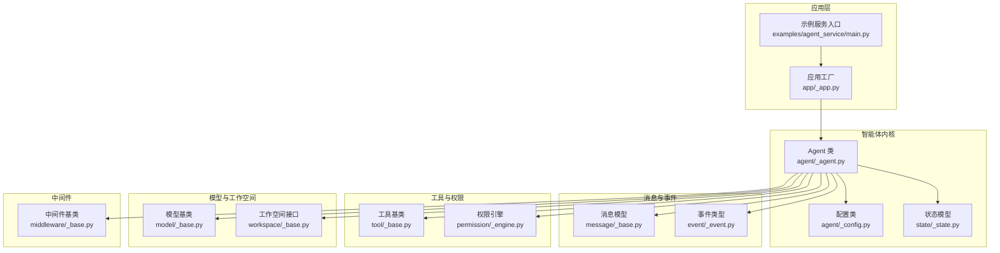
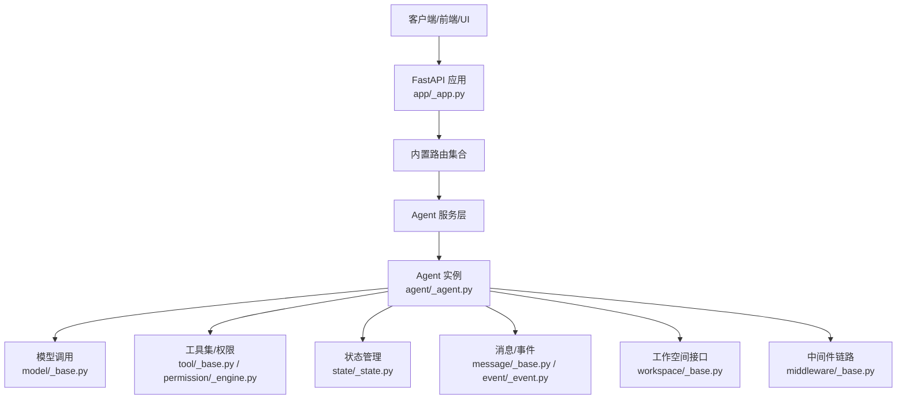
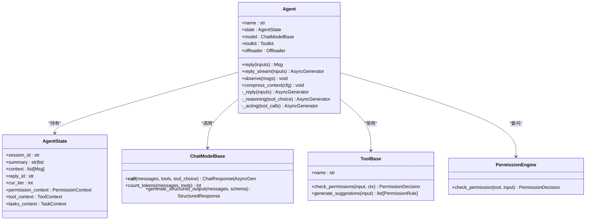
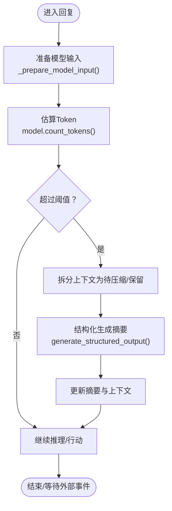
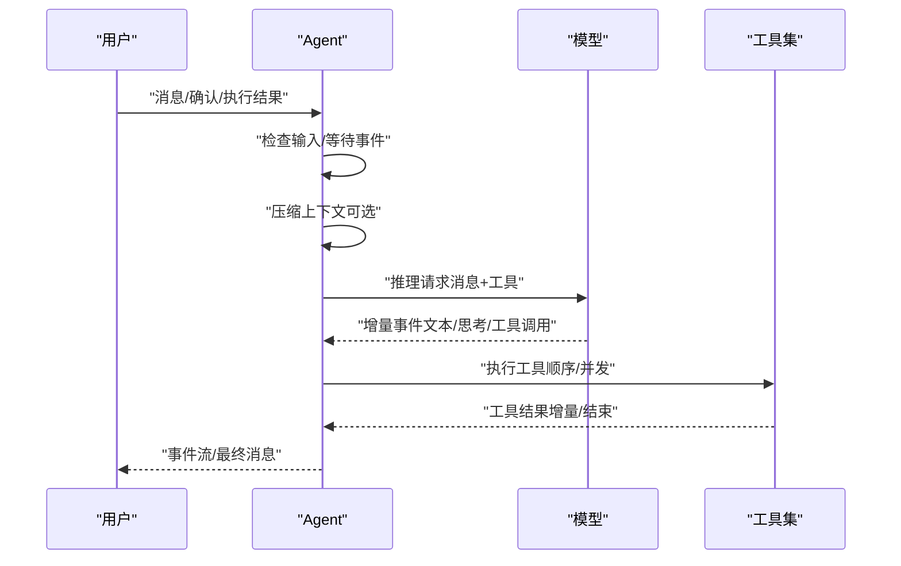
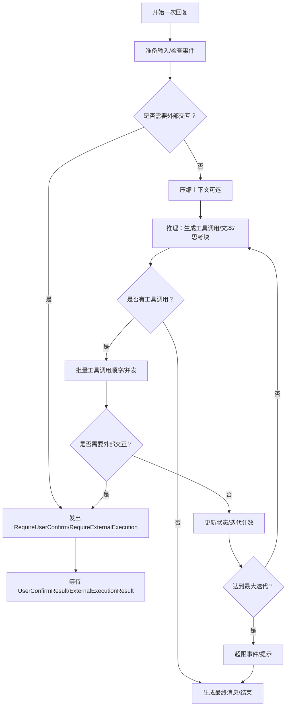
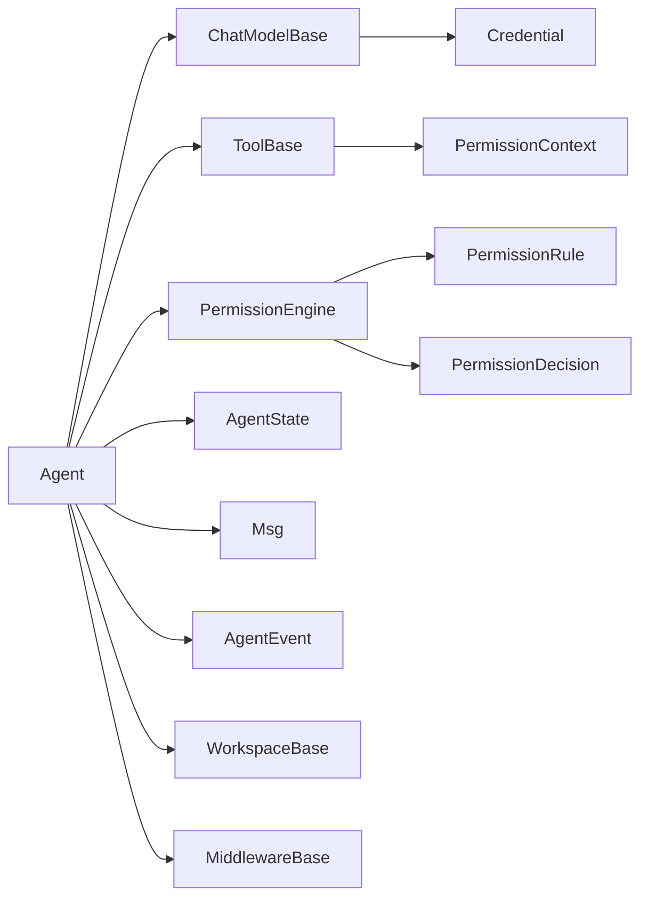

# 智能体系统

<cite>
**本文引用的文件**
- [src/agentscope/agent/_agent.py](file://src/agentscope/agent/_agent.py)
- [src/agentscope/state/_state.py](file://src/agentscope/state/_state.py)
- [src/agentscope/message/_base.py](file://src/agentscope/message/_base.py)
- [src/agentscope/event/_event.py](file://src/agentscope/event/_event.py)
- [src/agentscope/tool/_base.py](file://src/agentscope/tool/_base.py)
- [src/agentscope/model/_base.py](file://src/agentscope/model/_base.py)
- [src/agentscope/app/_app.py](file://src/agentscope/app/_app.py)
- [src/agentscope/agent/_config.py](file://src/agentscope/agent/_config.py)
- [src/agentscope/permission/_engine.py](file://src/agentscope/permission/_engine.py)
- [src/agentscope/workspace/_base.py](file://src/agentscope/workspace/_base.py)
- [src/agentscope/middleware/_base.py](file://src/agentscope/middleware/_base.py)
- [examples/agent_service/main.py](file://examples/agent_service/main.py)
- [README.md](file://README.md)
</cite>

## 目录
1. [简介](#简介)
2. [项目结构](#项目结构)
3. [核心组件](#核心组件)
4. [架构总览](#架构总览)
5. [详细组件分析](#详细组件分析)
6. [依赖分析](#依赖分析)
7. [性能考量](#性能考量)
8. [故障排查指南](#故障排查指南)
9. [结论](#结论)
10. [附录](#附录)

## 简介
本文件面向开发者与使用者，系统化梳理 AgentScope 智能体系统的定义、配置与管理机制，覆盖初始化参数、配置选项、生命周期管理；深入解析状态管理（存储、同步、恢复）、通信协议（消息传递、事件通知、状态更新）、调度与执行机制（任务分配、并发控制、资源管理），并总结最佳实践与常见问题排查方法。文末提供可直接定位到源码的路径指引与流程图示，帮助快速上手与深度定制。

## 项目结构
AgentScope 采用模块化分层组织：智能体内核（agent）、消息与事件（message/event）、工具与权限（tool/permission）、模型抽象（model）、工作空间（workspace）、中间件（middleware）、应用入口（app）以及示例服务（examples）。下图给出与本文相关的高层结构映射：

**图表来源**
- [src/agentscope/app/_app.py](file://src/agentscope/app/_app.py)
- [examples/agent_service/main.py](file://examples/agent_service/main.py)
- [src/agentscope/agent/_agent.py](file://src/agentscope/agent/_agent.py)
- [src/agentscope/agent/_config.py](file://src/agentscope/agent/_config.py)
- [src/agentscope/state/_state.py](file://src/agentscope/state/_state.py)
- [src/agentscope/message/_base.py](file://src/agentscope/message/_base.py)
- [src/agentscope/event/_event.py](file://src/agentscope/event/_event.py)
- [src/agentscope/tool/_base.py](file://src/agentscope/tool/_base.py)
- [src/agentscope/permission/_engine.py](file://src/agentscope/permission/_engine.py)
- [src/agentscope/model/_base.py](file://src/agentscope/model/_base.py)
- [src/agentscope/workspace/_base.py](file://src/agentscope/workspace/_base.py)
- [src/agentscope/middleware/_base.py](file://src/agentscope/middleware/_base.py)

**章节来源**
- [README.md](file://README.md)
- [src/agentscope/app/_app.py](file://src/agentscope/app/_app.py)
- [examples/agent_service/main.py](file://examples/agent_service/main.py)

## 核心组件
- 智能体（Agent）
  - 职责：统一推理-行动循环（ReAct），消息流式输出，权限校验，上下文压缩，外部交互（用户确认、外部执行）。
  - 关键点：支持中间件洋葱模型钩子（on_reply/on_reasoning/on_acting/on_model_call/on_compress_context/on_system_prompt），支持观察外部消息、压缩上下文、批量工具调用（顺序/并发）。
- 配置（Config）
  - ContextConfig：上下文压缩阈值、保留比例、压缩提示词模板、摘要结构化模式、工具结果长度限制。
  - ReActConfig：最大迭代次数、被拒绝时是否停止。
  - ModelConfig：重试次数、回退模型。
- 状态（AgentState）
  - 包含会话标识、压缩摘要、未压缩上下文、回复标识、当前迭代、权限上下文、工具缓存、任务上下文等。
- 消息与事件（Msg/AgentEvent）
  - Msg：角色、内容块（文本/思考/工具调用/工具结果/数据）、使用量统计、时间戳等。
  - AgentEvent：回复开始/结束、模型调用开始/结束、文本/数据/思考块增量、工具调用/结果增量、用户确认/外部执行触发与结果、超过最大迭代等。
- 工具与权限（ToolBase/PermissionEngine）
  - ToolBase：工具名称、描述、输入模式、并发安全、只读、外部工具标记、危险路径保护、权限检查与建议规则生成。
  - PermissionEngine：按规则优先级（拒绝/询问/工具特定检查/允许/BYPASS/默认）评估决策，并生成建议规则。
- 模型与工作空间（ChatModelBase/WorkspaceBase）
  - ChatModelBase：统一模型调用、重试、令牌估算、结构化输出生成、工具选择校验。
  - WorkspaceBase：工作空间生命周期（initialize/close/reset）、指令片段、工具/MCP/技能发现、离线持久化（offload_context/offload_tool_result）、动态增删MCP/技能。
- 中间件（MiddlewareBase）
  - 提供 on_reply/on_reasoning/on_acting/on_model_call/on_compress_context/on_system_prompt 等钩子，支持洋葱模型与变换管线。

**章节来源**
- [src/agentscope/agent/_agent.py](file://src/agentscope/agent/_agent.py)
- [src/agentscope/agent/_config.py](file://src/agentscope/agent/_config.py)
- [src/agentscope/state/_state.py](file://src/agentscope/state/_state.py)
- [src/agentscope/message/_base.py](file://src/agentscope/message/_base.py)
- [src/agentscope/event/_event.py](file://src/agentscope/event/_event.py)
- [src/agentscope/tool/_base.py](file://src/agentscope/tool/_base.py)
- [src/agentscope/permission/_engine.py](file://src/agentscope/permission/_engine.py)
- [src/agentscope/model/_base.py](file://src/agentscope/model/_base.py)
- [src/agentscope/workspace/_base.py](file://src/agentscope/workspace/_base.py)
- [src/agentscope/middleware/_base.py](file://src/agentscope/middleware/_base.py)

## 架构总览
AgentScope 的运行时由“应用工厂”创建 FastAPI 应用，挂载路由后，客户端通过 HTTP 与智能体交互。智能体内部以事件驱动的方式完成推理-行动循环，并通过消息与事件进行跨模块通信。

**图表来源**
- [src/agentscope/app/_app.py](file://src/agentscope/app/_app.py)
- [src/agentscope/agent/_agent.py](file://src/agentscope/agent/_agent.py)
- [src/agentscope/model/_base.py](file://src/agentscope/model/_base.py)
- [src/agentscope/tool/_base.py](file://src/agentscope/tool/_base.py)
- [src/agentscope/permission/_engine.py](file://src/agentscope/permission/_engine.py)
- [src/agentscope/state/_state.py](file://src/agentscope/state/_state.py)
- [src/agentscope/message/_base.py](file://src/agentscope/message/_base.py)
- [src/agentscope/event/_event.py](file://src/agentscope/event/_event.py)
- [src/agentscope/workspace/_base.py](file://src/agentscope/workspace/_base.py)
- [src/agentscope/middleware/_base.py](file://src/agentscope/middleware/_base.py)

## 详细组件分析

### 智能体类（Agent）与生命周期
- 初始化参数
  - 基础：name、system_prompt、model（ChatModelBase）、toolkit（Toolkit）、middlewares（MiddlewareBase 列表）。
  - 状态与上下文：state（AgentState）、offloader（上下文/工具结果离线）、model_config/context_config/react_config（配置对象）。
- 生命周期与核心方法
  - reply_stream：异步事件流，逐段产出事件或最终消息。
  - reply：消费事件流，返回最终 Msg。
  - observe：接收外部观察消息并写入上下文。
  - compress_context：基于 Token 预估与配置阈值进行上下文压缩，支持中间件链。
  - 内部循环：_reply_impl（推理-行动循环），_reasoning_impl（模型调用与增量事件转换），批量工具调用（顺序/并发）。
- 外部交互
  - 用户确认/外部执行：在需要时发出 RequireUserConfirmEvent/RequireExternalExecutionEvent，并等待 UserConfirmResultEvent/ExternalExecutionResultEvent 恢复。

**图表来源**
- [src/agentscope/agent/_agent.py](file://src/agentscope/agent/_agent.py)
- [src/agentscope/state/_state.py](file://src/agentscope/state/_state.py)
- [src/agentscope/model/_base.py](file://src/agentscope/model/_base.py)
- [src/agentscope/tool/_base.py](file://src/agentscope/tool/_base.py)
- [src/agentscope/permission/_engine.py](file://src/agentscope/permission/_engine.py)

**章节来源**
- [src/agentscope/agent/_agent.py](file://src/agentscope/agent/_agent.py)
- [src/agentscope/state/_state.py](file://src/agentscope/state/_state.py)
- [src/agentscope/model/_base.py](file://src/agentscope/model/_base.py)
- [src/agentscope/tool/_base.py](file://src/agentscope/tool/_base.py)
- [src/agentscope/permission/_engine.py](file://src/agentscope/permission/_engine.py)

### 状态管理系统（存储、同步、恢复）
- 存储单元
  - AgentState：会话标识、压缩摘要、未压缩上下文、回复标识、当前迭代、权限上下文、工具缓存、任务上下文。
  - ToolContext：文件读取缓存（LRU）、激活工具组、缓存上限与字节上限。
- 同步与更新
  - 事件驱动：Msg 支持根据 AgentEvent 追加/合并内容块、累计使用量、标记完成时间。
  - 文件缓存：按文件路径维护缓存条目，过期自动剔除，支持保留白名单清理。
- 恢复机制
  - 通过 session_id 维持独立状态；压缩摘要作为系统提示前缀注入，实现长上下文恢复。

**图表来源**
- [src/agentscope/agent/_agent.py](file://src/agentscope/agent/_agent.py)
- [src/agentscope/model/_base.py](file://src/agentscope/model/_base.py)
- [src/agentscope/state/_state.py](file://src/agentscope/state/_state.py)
- [src/agentscope/message/_base.py](file://src/agentscope/message/_base.py)

**章节来源**
- [src/agentscope/state/_state.py](file://src/agentscope/state/_state.py)
- [src/agentscope/message/_base.py](file://src/agentscope/message/_base.py)
- [src/agentscope/agent/_agent.py](file://src/agentscope/agent/_agent.py)
- [src/agentscope/model/_base.py](file://src/agentscope/model/_base.py)

### 通信协议（消息传递、事件通知、状态更新）
- 消息模型（Msg）
  - 角色：user/assistant/system；内容块：文本、数据、思考、工具调用、工具结果；元数据、使用量、时间戳。
  - 支持按块类型检索、拼接文本、追加事件并累计使用量。
- 事件模型（AgentEvent）
  - 覆盖回复生命周期、模型调用、文本/数据/思考块增量、工具调用/结果增量、用户确认/外部执行、超过最大迭代等。
- 状态更新
  - 事件到消息：Msg.append_event 根据事件类型更新内容块、累计使用量、完成时间戳。
  - 事件到状态：Agent 在推理-行动循环中产生/消费事件，驱动状态推进。

**图表来源**
- [src/agentscope/agent/_agent.py](file://src/agentscope/agent/_agent.py)
- [src/agentscope/message/_base.py](file://src/agentscope/message/_base.py)
- [src/agentscope/event/_event.py](file://src/agentscope/event/_event.py)
- [src/agentscope/tool/_base.py](file://src/agentscope/tool/_base.py)
- [src/agentscope/model/_base.py](file://src/agentscope/model/_base.py)

**章节来源**
- [src/agentscope/message/_base.py](file://src/agentscope/message/_base.py)
- [src/agentscope/event/_event.py](file://src/agentscope/event/_event.py)
- [src/agentscope/agent/_agent.py](file://src/agentscope/agent/_agent.py)

### 调度与执行机制（任务分配、并发控制、资源管理）
- 任务分配
  - ReAct 循环：每次迭代根据模型输出决定继续推理或执行工具调用；支持批量工具调用（顺序/并发）。
- 并发控制
  - 顺序执行：_execute_sequential_tool_calls；并发执行：_execute_concurrent_tool_calls。
  - 中间件 on_acting 可对工具执行进行拦截与异步化（注意带状态注入的工具需避免并发修改）。
- 资源管理
  - 上下文压缩：基于触发比例与保留比例估算 Token，必要时生成结构化摘要并清理未保留缓存。
  - 工作空间：提供工具/MCP/技能发现与离线持久化能力，支持本地/Docker/E2B 等后端。

**图表来源**
- [src/agentscope/agent/_agent.py](file://src/agentscope/agent/_agent.py)
- [src/agentscope/middleware/_base.py](file://src/agentscope/middleware/_base.py)
- [src/agentscope/workspace/_base.py](file://src/agentscope/workspace/_base.py)

**章节来源**
- [src/agentscope/agent/_agent.py](file://src/agentscope/agent/_agent.py)
- [src/agentscope/middleware/_base.py](file://src/agentscope/middleware/_base.py)
- [src/agentscope/workspace/_base.py](file://src/agentscope/workspace/_base.py)

### 配置与最佳实践
- 配置项
  - ContextConfig：触发比例、保留比例、压缩提示词、摘要模板、摘要结构化模式、工具结果长度限制。
  - ReActConfig：最大迭代次数、被拒绝时是否停止。
  - ModelConfig：重试次数、回退模型。
- 最佳实践
  - 合理设置 ContextConfig 的触发与保留比例，避免频繁压缩导致信息丢失。
  - 使用中间件 on_system_prompt 注入个性化系统提示，on_model_call/on_acting/on_reply/on_reasoning/on_compress_context 进行可观测性与审计。
  - 对高风险工具（如 Bash/Write/Edit）启用权限引擎的危险路径检查与建议规则生成。
  - 将长上下文与工具结果通过工作空间离线持久化，提升可追溯性与恢复能力。

**章节来源**
- [src/agentscope/agent/_config.py](file://src/agentscope/agent/_config.py)
- [src/agentscope/middleware/_base.py](file://src/agentscope/middleware/_base.py)
- [src/agentscope/permission/_engine.py](file://src/agentscope/permission/_engine.py)
- [src/agentscope/workspace/_base.py](file://src/agentscope/workspace/_base.py)

## 依赖分析
- 组件耦合
  - Agent 依赖 ChatModelBase、ToolBase、PermissionEngine、AgentState、Msg/AgentEvent、WorkspaceBase、MiddlewareBase。
  - ChatModelBase 依赖 Credential 与消息/工具模式；ToolBase 依赖 PermissionContext；PermissionEngine 依赖 Rule/Context/Decision。
- 外部集成
  - 应用层通过 create_app 挂载路由，支持 CORS 等中间件扩展；示例服务展示如何启动 AgentScope 服务并接入 MCP 客户端。

**图表来源**
- [src/agentscope/agent/_agent.py](file://src/agentscope/agent/_agent.py)
- [src/agentscope/model/_base.py](file://src/agentscope/model/_base.py)
- [src/agentscope/tool/_base.py](file://src/agentscope/tool/_base.py)
- [src/agentscope/permission/_engine.py](file://src/agentscope/permission/_engine.py)
- [src/agentscope/state/_state.py](file://src/agentscope/state/_state.py)
- [src/agentscope/message/_base.py](file://src/agentscope/message/_base.py)
- [src/agentscope/event/_event.py](file://src/agentscope/event/_event.py)
- [src/agentscope/workspace/_base.py](file://src/agentscope/workspace/_base.py)
- [src/agentscope/middleware/_base.py](file://src/agentscope/middleware/_base.py)

**章节来源**
- [src/agentscope/app/_app.py](file://src/agentscope/app/_app.py)
- [examples/agent_service/main.py](file://examples/agent_service/main.py)

## 性能考量
- Token 估算与上下文压缩
  - 使用 count_tokens 快速估算输入大小，结合 ContextConfig 的触发比例与保留比例，避免超出模型上下文窗口。
- 流式响应与事件增量
  - 模型调用支持流式返回，事件增量传输减少 UI 卡顿与内存占用。
- 工具执行并发
  - 并发工具调用可提升吞吐，但需注意工具并发安全性与状态注入带来的竞态风险。
- 离线持久化
  - 将压缩上下文与工具结果离线存储，降低在线负载并支持后续检索。

[本节为通用指导，无需具体文件分析]

## 故障排查指南
- 上下文压缩失败
  - 现象：压缩失败或上下文溢出。
  - 排查：检查 ContextConfig 的触发比例与保留比例；必要时降低保留比例或缩短压缩提示词；查看日志警告。
- 权限拒绝或需要确认
  - 现象：工具调用被拒绝或触发 RequireUserConfirmEvent。
  - 排查：检查 PermissionEngine 的规则匹配与建议规则；确认 EXPLORE/ACCEPT_EDITS/BYPASS 等模式设置；为危险路径生成更精确的规则。
- 模型调用异常
  - 现象：模型调用失败或超时。
  - 排查：检查 ChatModelBase 的重试配置与异常类型；确认工具选择模式与函数名有效性；查看日志中的重试记录。
- 事件不生效或消息不更新
  - 现象：事件到达但消息未更新。
  - 排查：确认事件 reply_id 与消息 id 匹配；检查 Msg.append_event 的日志警告；确保事件类型正确。

**章节来源**
- [src/agentscope/agent/_agent.py](file://src/agentscope/agent/_agent.py)
- [src/agentscope/message/_base.py](file://src/agentscope/message/_base.py)
- [src/agentscope/permission/_engine.py](file://src/agentscope/permission/_engine.py)
- [src/agentscope/model/_base.py](file://src/agentscope/model/_base.py)

## 结论
AgentScope 通过清晰的模块划分与事件驱动架构，提供了从智能体定义、配置管理、状态持久化到消息通信、权限控制与工作空间集成的完整能力。借助中间件与可插拔的工具/模型/工作空间后端，开发者可在保证生产可用性的前提下快速构建与演进智能体应用。建议在实际部署中结合业务场景合理配置上下文压缩、权限规则与并发策略，并通过中间件增强可观测性与可审计性。

[本节为总结性内容，无需具体文件分析]

## 附录
- 快速开始与示例服务
  - 参考示例服务入口脚本，了解如何创建应用、注册工作空间与中间件、启动服务。
- 代码示例路径
  - 智能体初始化与事件流处理：[示例脚本](file://examples/agent_service/main.py)
  - 应用工厂与路由挂载：[应用工厂](file://src/agentscope/app/_app.py)
  - 智能体核心逻辑：[Agent 类](file://src/agentscope/agent/_agent.py)
  - 配置类：[配置类](file://src/agentscope/agent/_config.py)
  - 状态模型：[状态模型](file://src/agentscope/state/_state.py)
  - 消息与事件：[消息模型](file://src/agentscope/message/_base.py)、[事件类型](file://src/agentscope/event/_event.py)
  - 工具与权限：[工具基类](file://src/agentscope/tool/_base.py)、[权限引擎](file://src/agentscope/permission/_engine.py)
  - 模型与工作空间：[模型基类](file://src/agentscope/model/_base.py)、[工作空间接口](file://src/agentscope/workspace/_base.py)
  - 中间件：[中间件基类](file://src/agentscope/middleware/_base.py)

**章节来源**
- [examples/agent_service/main.py](file://examples/agent_service/main.py)
- [src/agentscope/app/_app.py](file://src/agentscope/app/_app.py)
- [README.md](file://README.md)