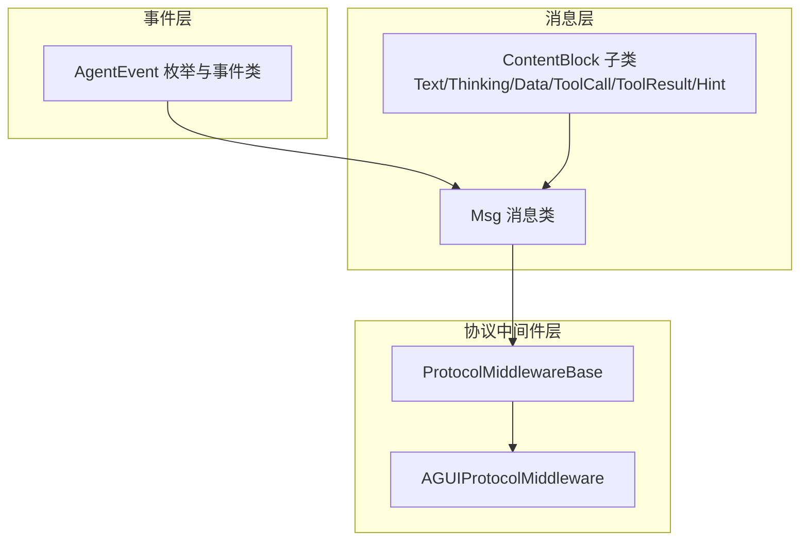
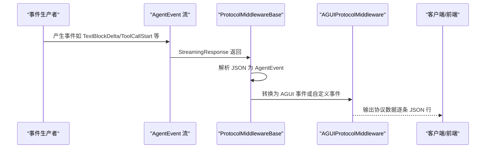
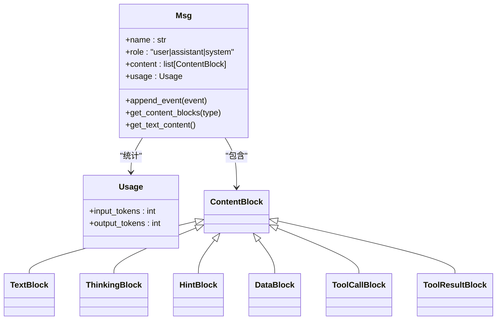
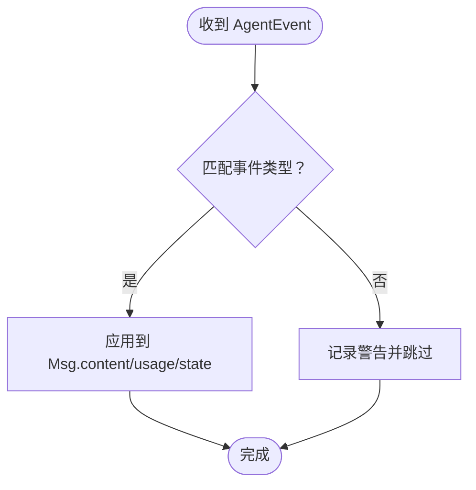
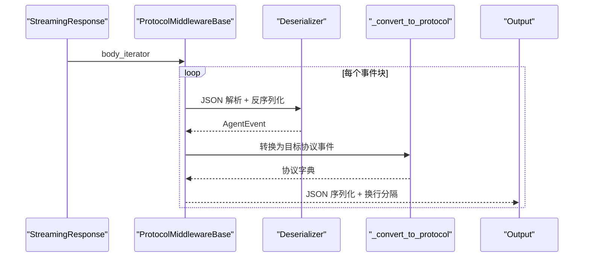
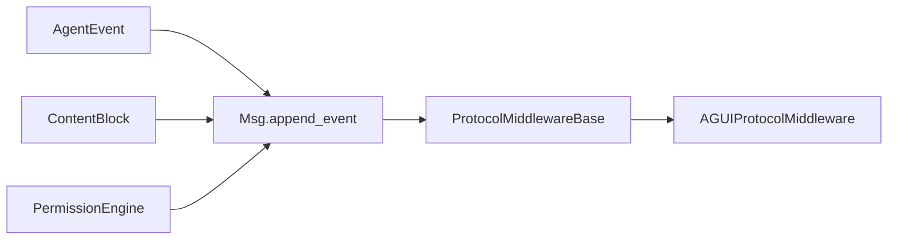

# 智能体通信协议

<cite>
**本文档引用的文件**
- [event/_event.py](file://src/agentscope/event/_event.py)
- [message/_base.py](file://src/agentscope/message/_base.py)
- [message/_block.py](file://src/agentscope/message/_block.py)
- [app/_middleware/_protocol/_base.py](file://src/agentscope/app/_middleware/_protocol/_base.py)
- [_agui.py](file://src/agentscope/app/_middleware/_protocol/_agui.py)
- [permission/_engine.py](file://src/agentscope/permission/_engine.py)
- [event_test.py](file://tests/event_test.py)
- [message_test.py](file://tests/message_test.py)
- [event_to_message_test.py](file://tests/event_to_message_test.py)
- [agui_protocol_test.py](file://tests/agui_protocol_test.py)
</cite>

## 目录
1. [简介](#简介)
2. [项目结构](#项目结构)
3. [核心组件](#核心组件)
4. [架构总览](#架构总览)
5. [详细组件分析](#详细组件分析)
6. [依赖关系分析](#依赖关系分析)
7. [性能考量](#性能考量)
8. [故障排查指南](#故障排查指南)
9. [结论](#结论)
10. [附录：扩展与自定义指南](#附录扩展与自定义指南)

## 简介
本文件系统性阐述 AgentScope 的智能体通信协议，重点围绕以下方面：
- 事件系统（AgentEvent）的设计与事件类型（如 ModelCallStartEvent、ReplyStartEvent、ToolCallBlock 等）的语义与用途
- 消息系统（Msg）的实现，包括 SystemMsg、AssistantMsg、UserMsg 等消息类型及其特性与使用场景
- 消息块（Message Block）的概念与结构，如 TextBlock、ThinkingBlock、ToolCallBlock 等
- 事件流与消息流的处理机制，以及基于 FastAPI 中间件的异步通信协议转换
- 协议扩展方法与自定义事件的开发指南

## 项目结构
该通信协议由三层协同构成：
- 事件层：定义标准化的 AgentEvent 类型集合，覆盖回复、模型调用、文本/思维/数据块、工具调用与结果、权限与外部执行等生命周期事件
- 消息层：以 Msg 为核心，承载多模态内容块（ContentBlock），支持从事件流增量构建消息
- 协议中间件层：将 AgentEvent 流转换为具体协议（如 AGUI）格式，实现异步流式传输

图表来源
- [event/_event.py:14-431](file://src/agentscope/event/_event.py#L14-L431)
- [message/_base.py:65-574](file://src/agentscope/message/_base.py#L65-L574)
- [message/_block.py:11-197](file://src/agentscope/message/_block.py#L11-L197)
- [app/_middleware/_protocol/_base.py:16-170](file://src/agentscope/app/_middleware/_protocol/_base.py#L16-L170)
- [_agui.py:43-258](file://src/agentscope/app/_middleware/_protocol/_agui.py#L43-L258)

章节来源
- [event/_event.py:14-431](file://src/agentscope/event/_event.py#L14-L431)
- [message/_base.py:65-574](file://src/agentscope/message/_base.py#L65-L574)
- [message/_block.py:11-197](file://src/agentscope/message/_block.py#L11-L197)
- [app/_middleware/_protocol/_base.py:16-170](file://src/agentscope/app/_middleware/_protocol/_base.py#L16-L170)
- [_agui.py:43-258](file://src/agentscope/app/_middleware/_protocol/_agui.py#L43-L258)

## 核心组件
- 事件类型（EventType 与具体事件类）
  - 回复生命周期：ReplyStartEvent、ReplyEndEvent
  - 模型调用：ModelCallStartEvent、ModelCallEndEvent
  - 文本块：TextBlockStartEvent、TextBlockDeltaEvent、TextBlockEndEvent
  - 思维块：ThinkingBlockStartEvent、ThinkingBlockDeltaEvent、ThinkingBlockEndEvent
  - 数据块：DataBlockStartEvent、DataBlockDeltaEvent、DataBlockEndEvent
  - 工具调用：ToolCallStartEvent、ToolCallDeltaEvent、ToolCallEndEvent
  - 工具结果：ToolResultStartEvent、ToolResultTextDeltaEvent、ToolResultDataDeltaEvent、ToolResultEndEvent
  - 权限与外部执行：RequireUserConfirmEvent、UserConfirmResultEvent、RequireExternalExecutionEvent、ExternalExecutionResultEvent
  - 其他：ExceedMaxItersEvent
- 消息（Msg）
  - 角色：user、assistant、system
  - 内容块：TextBlock、ThinkingBlock、HintBlock、DataBlock、ToolCallBlock、ToolResultBlock
  - 能力：按事件增量更新、统计 token 使用、查询与过滤内容块
- 协议中间件
  - 基类：拦截 StreamingResponse，将 AgentEvent 流转换为目标协议
  - AGUI 实现：将 AgentEvent 映射到 AGUI 事件或自定义事件

章节来源
- [event/_event.py:14-431](file://src/agentscope/event/_event.py#L14-L431)
- [message/_base.py:65-574](file://src/agentscope/message/_base.py#L65-L574)
- [message/_block.py:11-197](file://src/agentscope/message/_block.py#L11-L197)
- [app/_middleware/_protocol/_base.py:16-170](file://src/agentscope/app/_middleware/_protocol/_base.py#L16-L170)
- [_agui.py:43-258](file://src/agentscope/app/_middleware/_protocol/_agui.py#L43-L258)

## 架构总览
下图展示事件流到消息再到协议输出的端到端流程。

图表来源
- [app/_middleware/_protocol/_base.py:80-124](file://src/agentscope/app/_middleware/_protocol/_base.py#L80-L124)
- [_agui.py:60-93](file://src/agentscope/app/_middleware/_protocol/_agui.py#L60-L93)

章节来源
- [app/_middleware/_protocol/_base.py:16-170](file://src/agentscope/app/_middleware/_protocol/_base.py#L16-L170)
- [_agui.py:43-258](file://src/agentscope/app/_middleware/_protocol/_agui.py#L43-L258)

## 详细组件分析

### 事件系统（AgentEvent）
- 设计要点
  - 使用 StrEnum 定义事件类型，确保序列化一致性
  - 使用 Pydantic BaseModel 统一字段校验与序列化
  - 通过 Discriminated Union（按 type 字段）在协议中间件中自动反序列化
- 关键事件类型
  - 回复：ReplyStartEvent、ReplyEndEvent
  - 模型调用：ModelCallStartEvent、ModelCallEndEvent（携带 token 统计）
  - 文本/思维/数据块：分别对应 Start/Delta/End 三阶段，支持增量推送
  - 工具调用与结果：ToolCall* 与 ToolResult*，支持参数增量与结果增量（文本/二进制）
  - 权限与外部执行：RequireUserConfirmEvent、UserConfirmResultEvent、RequireExternalExecutionEvent、ExternalExecutionResultEvent
  - 其他：ExceedMaxItersEvent
- 事件流处理
  - 事件按顺序到达，Delta 事件用于增量更新，End 事件表示块完成
  - 不匹配的 reply_id 将被忽略并记录警告
  - 缺失目标块的 Delta 事件仅记录警告，不中断整体流程

```mermaid
classDiagram
class EventBase {
+id : str
+created_at : str
}
class ReplyStartEvent
class ReplyEndEvent
class ModelCallStartEvent
class ModelCallEndEvent
class TextBlockStartEvent
class TextBlockDeltaEvent
class TextBlockEndEvent
class ThinkingBlockStartEvent
class ThinkingBlockDeltaEvent
class ThinkingBlockEndEvent
class DataBlockStartEvent
class DataBlockDeltaEvent
class DataBlockEndEvent
class ToolCallStartEvent
class ToolCallDeltaEvent
class ToolCallEndEvent
class ToolResultStartEvent
class ToolResultTextDeltaEvent
class ToolResultDataDeltaEvent
class ToolResultEndEvent
class RequireUserConfirmEvent
class UserConfirmResultEvent
class RequireExternalExecutionEvent
class ExternalExecutionResultEvent
class ExceedMaxItersEvent
EventBase <|-- ReplyStartEvent
EventBase <|-- ReplyEndEvent
EventBase <|-- ModelCallStartEvent
EventBase <|-- ModelCallEndEvent
EventBase <|-- TextBlockStartEvent
EventBase <|-- TextBlockDeltaEvent
EventBase <|-- TextBlockEndEvent
EventBase <|-- ThinkingBlockStartEvent
EventBase <|-- ThinkingBlockDeltaEvent
EventBase <|-- ThinkingBlockEndEvent
EventBase <|-- DataBlockStartEvent
EventBase <|-- DataBlockDeltaEvent
EventBase <|-- DataBlockEndEvent
EventBase <|-- ToolCallStartEvent
EventBase <|-- ToolCallDeltaEvent
EventBase <|-- ToolCallEndEvent
EventBase <|-- ToolResultStartEvent
EventBase <|-- ToolResultTextDeltaEvent
EventBase <|-- ToolResultDataDeltaEvent
EventBase <|-- ToolResultEndEvent
EventBase <|-- RequireUserConfirmEvent
EventBase <|-- UserConfirmResultEvent
EventBase <|-- RequireExternalExecutionEvent
EventBase <|-- ExternalExecutionResultEvent
EventBase <|-- ExceedMaxItersEvent
```

图表来源
- [event/_event.py:53-431](file://src/agentscope/event/_event.py#L53-L431)

章节来源
- [event/_event.py:14-431](file://src/agentscope/event/_event.py#L14-L431)

### 消息系统（Msg 与 ContentBlock）
- Msg
  - 角色约束：不同角色允许的内容块不同（例如 user 只允许 text/data；system 仅允许 text）
  - 增量更新：通过 append_event 将事件映射到内容块，支持文本、思维、数据、工具调用与结果的增量累积
  - Token 统计：MODEL_CALL_END 事件会累加输入/输出 token
  - 查询能力：按类型筛选内容块、拼接文本、查找指定块
- ContentBlock
  - TextBlock：纯文本块
  - ThinkingBlock：推理/思考内容块（支持额外字段）
  - HintBlock：提示块（在传入 LLM API 时转为用户消息）
  - DataBlock：二进制数据块，支持 base64 或 URL 两种来源
  - ToolCallBlock：工具调用块，包含状态机（pending/asking/allowed/submitted/finished）
  - ToolResultBlock：工具结果块，支持文本列表或数据块列表，状态枚举（success/error/interrupted/denied/running）

图表来源
- [message/_base.py:65-574](file://src/agentscope/message/_base.py#L65-L574)
- [message/_block.py:11-197](file://src/agentscope/message/_block.py#L11-L197)

章节来源
- [message/_base.py:65-574](file://src/agentscope/message/_base.py#L65-L574)
- [message/_block.py:11-197](file://src/agentscope/message/_block.py#L11-L197)

### 消息块（Message Block）详解
- TextBlock
  - 用途：承载自然语言文本
  - 特性：唯一 id，可增量拼接
- ThinkingBlock
  - 用途：承载推理过程（如“让我思考...”）
  - 特性：支持额外字段，便于适配不同模型的扩展元数据
- DataBlock
  - 用途：承载图片、音频、视频等二进制内容
  - 来源：Base64Source 或 URLSource
- ToolCallBlock 与 ToolResultBlock
  - ToolCallBlock：包含工具名、累积的 JSON 参数字符串、状态机
  - ToolResultBlock：包含工具名、输出（文本或内容块列表）、最终状态
- HintBlock
  - 用途：向 LLM 提示或注入指令，在 API 层转换为用户消息

章节来源
- [message/_block.py:11-197](file://src/agentscope/message/_block.py#L11-L197)

### 事件流与消息流处理机制
- 事件到消息的映射
  - TextBlock：Start 新建空块，Delta 追加文本，End 不变
  - ThinkingBlock：同上
  - DataBlock：Start 新建空 base64 源，Delta 追加 base64 数据，End 不变
  - ToolCall：Start 新建空输入，Delta 追加 JSON 片段，End 不变
  - ToolResult：Start 新建运行中结果，TextDelta 追加文本块，DataDelta 追加数据块，End 更新状态
  - 权限与外部执行：RequireUserConfirmEvent/RequireExternalExecutionEvent 更新 ToolCallBlock 状态与建议规则；UserConfirmResultEvent/ExternalExecutionResultEvent 更新状态或追加 ToolResultBlock
- 错误与边界处理
  - reply_id 不匹配：跳过并记录警告
  - 缺失目标块的 Delta：记录警告但不崩溃
  - MODEL_CALL_END：首次出现时初始化 Usage，后续累加 token

图表来源
- [message/_base.py:210-428](file://src/agentscope/message/_base.py#L210-L428)

章节来源
- [message/_base.py:210-428](file://src/agentscope/message/_base.py#L210-L428)
- [event_to_message_test.py:192-870](file://tests/event_to_message_test.py#L192-L870)

### 异步通信与协议转换
- 中间件工作流
  - 拦截 StreamingResponse
  - 逐条解析 JSON 字符串为字典
  - 使用 Pydantic Discriminated Union 反序列化为 AgentEvent
  - 调用子类实现的 _convert_to_protocol 转换为目标协议对象
  - 序列化为 JSON 并以换行分隔的字节流返回
- AGUI 协议映射
  - ReplyStart/End → RunStarted/RunFinished
  - ModelCallStart/End → StepStarted/StepFinished
  - Text/Thinking/Data/ToolCall/ToolResult → 对应 AGUI 事件或自定义事件
  - 需要缓冲的事件（如 ToolResultTextDelta）在 ToolResultEnd 合并输出
- 错误处理
  - 解析失败或未知事件类型时，保留原始字节透传或回退为自定义事件

图表来源
- [app/_middleware/_protocol/_base.py:80-124](file://src/agentscope/app/_middleware/_protocol/_base.py#L80-L124)
- [_agui.py:60-93](file://src/agentscope/app/_middleware/_protocol/_agui.py#L60-L93)

章节来源
- [app/_middleware/_protocol/_base.py:16-170](file://src/agentscope/app/_middleware/_protocol/_base.py#L16-L170)
- [_agui.py:43-258](file://src/agentscope/app/_middleware/_protocol/_agui.py#L43-L258)
- [agui_protocol_test.py:44-80](file://tests/agui_protocol_test.py#L44-L80)

### 权限系统与工具调用状态管理
- 权限决策流程
  - deny 规则优先
  - ask 规则触发后生成建议规则
  - 工具特定检查（如只读工具、危险路径等）
  - allow 规则
  - bypass 模式
  - 默认 ask
- ToolCallBlock 状态机
  - pending → asking（用户确认）→ allowed（允许执行）→ submitted（外部执行）→ finished（结束）
  - 支持在 RequireUserConfirmEvent/RequireExternalExecutionEvent 期间维护 suggested_rules

章节来源
- [permission/_engine.py:16-450](file://src/agentscope/permission/_engine.py#L16-L450)
- [message/_block.py:105-178](file://src/agentscope/message/_block.py#L105-L178)
- [event/_event.py:339-403](file://src/agentscope/event/_event.py#L339-L403)

## 依赖关系分析
- 事件与消息
  - 事件驱动消息构建：Msg.append_event 根据事件类型更新内容块与状态
  - 事件与消息共享 id（reply_id/block_id/tool_call_id）以保证跨层关联
- 协议中间件
  - ProtocolMiddlewareBase 依赖 AgentEvent 类型别名进行反序列化
  - AGUIProtocolMiddleware 将 AgentEvent 映射到 AGUI 事件或自定义事件
- 权限系统
  - 事件与消息中的 ToolCallBlock/ToolResultBlock 与权限引擎决策耦合，状态变化由事件驱动

图表来源
- [event/_event.py:405-431](file://src/agentscope/event/_event.py#L405-L431)
- [message/_base.py:210-428](file://src/agentscope/message/_base.py#L210-L428)
- [app/_middleware/_protocol/_base.py:137-145](file://src/agentscope/app/_middleware/_protocol/_base.py#L137-L145)
- [_agui.py:60-93](file://src/agentscope/app/_middleware/_protocol/_agui.py#L60-L93)
- [permission/_engine.py:81-178](file://src/agentscope/permission/_engine.py#L81-L178)

章节来源
- [event/_event.py:405-431](file://src/agentscope/event/_event.py#L405-L431)
- [message/_base.py:210-428](file://src/agentscope/message/_base.py#L210-L428)
- [app/_middleware/_protocol/_base.py:137-145](file://src/agentscope/app/_middleware/_protocol/_base.py#L137-L145)
- [_agui.py:60-93](file://src/agentscope/app/_middleware/_protocol/_agui.py#L60-L93)
- [permission/_engine.py:81-178](file://src/agentscope/permission/_engine.py#L81-L178)

## 性能考量
- 流式处理
  - 中间件逐条处理事件，避免一次性加载全部事件，降低内存峰值
- 序列化与反序列化
  - 使用 Pydantic Discriminated Union 自动反序列化，减少分支判断开销
- 缓冲策略
  - ToolResultTextDelta 在 ToolResultEnd 合并输出，减少前端渲染压力
- 日志与告警
  - 缺失块的 Delta 仅记录警告，避免阻塞主流程

[本节为通用指导，无需列出章节来源]

## 故障排查指南
- 事件未生效
  - 检查事件 reply_id 是否与消息 id 匹配
  - 若不匹配，事件会被跳过并记录警告
- Delta 事件无效
  - 若目标块尚未 Start，Delta 会被忽略并记录警告
- 协议转换异常
  - JSON 解析失败或未知事件类型时，中间件会透传原始字节或回退为自定义事件
- 角色与内容块不合法
  - 用户消息仅允许 text/data；系统消息仅允许 text；否则抛出异常

章节来源
- [message/_base.py:225-235](file://src/agentscope/message/_base.py#L225-L235)
- [message/_base.py:254-262](file://src/agentscope/message/_base.py#L254-L262)
- [app/_middleware/_protocol/_base.py:116-123](file://src/agentscope/app/_middleware/_protocol/_base.py#L116-L123)
- [message_test.py:173-267](file://tests/message_test.py#L173-L267)

## 结论
AgentScope 的通信协议通过标准化的 AgentEvent 事件体系、灵活的 Msg 消息模型与可插拔的协议中间件，实现了从模型推理到工具调用、从权限控制到外部执行的全链路异步流式通信。其设计兼顾了可扩展性与易用性，既满足多模态内容的增量传输，也支持复杂的状态流转与权限治理。

[本节为总结，无需列出章节来源]

## 附录：扩展与自定义指南

### 扩展新的事件类型
- 步骤
  - 在事件模块新增事件类，继承 EventBase
  - 在 EventType 中添加新类型常量
  - 在 AgentEvent 类型别名中加入新事件类型
  - 在 Msg.append_event 中增加对该事件的处理逻辑
  - 在协议中间件中实现新事件到目标协议的映射
- 注意事项
  - 保持事件字段与 Msg 内容块的 id 对齐（如 block_id/tool_call_id）
  - 对于需要缓冲的增量事件（如 ToolResultTextDelta），在 End 事件中合并输出

章节来源
- [event/_event.py:14-431](file://src/agentscope/event/_event.py#L14-L431)
- [message/_base.py:210-428](file://src/agentscope/message/_base.py#L210-L428)
- [app/_middleware/_protocol/_base.py:137-145](file://src/agentscope/app/_middleware/_protocol/_base.py#L137-L145)

### 开发自定义协议中间件
- 继承 ProtocolMiddlewareBase
  - 实现 _convert_to_protocol 方法，将 AgentEvent 转换为目标协议字典
  - 可参考 AGUIProtocolMiddleware 的映射策略
- 配置中间件
  - 在 FastAPI 应用中注册中间件，拦截 StreamingResponse 并转换事件流

章节来源
- [app/_middleware/_protocol/_base.py:16-170](file://src/agentscope/app/_middleware/_protocol/_base.py#L16-L170)
- [_agui.py:43-258](file://src/agentscope/app/_middleware/_protocol/_agui.py#L43-L258)

### 与权限系统集成
- 在工具调用前评估权限，必要时发出 RequireUserConfirmEvent
- 根据 UserConfirmResultEvent 更新 ToolCallBlock 状态
- 对外部执行工具发出 RequireExternalExecutionEvent，并在结果返回后追加 ToolResultBlock

章节来源
- [permission/_engine.py:81-178](file://src/agentscope/permission/_engine.py#L81-L178)
- [event/_event.py:339-403](file://src/agentscope/event/_event.py#L339-L403)
- [message/_base.py:396-427](file://src/agentscope/message/_base.py#L396-L427)