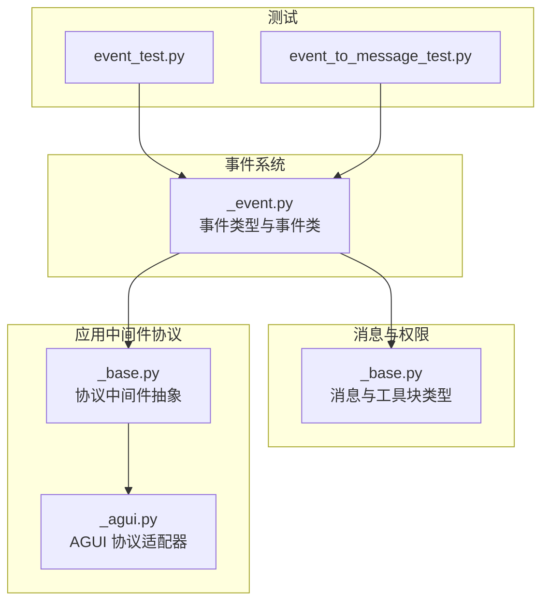
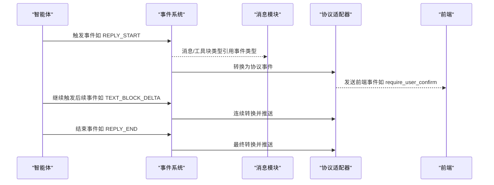
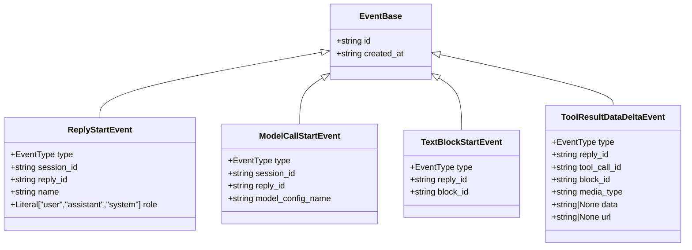
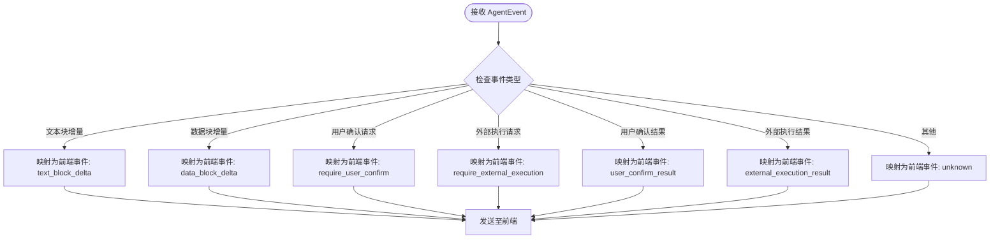
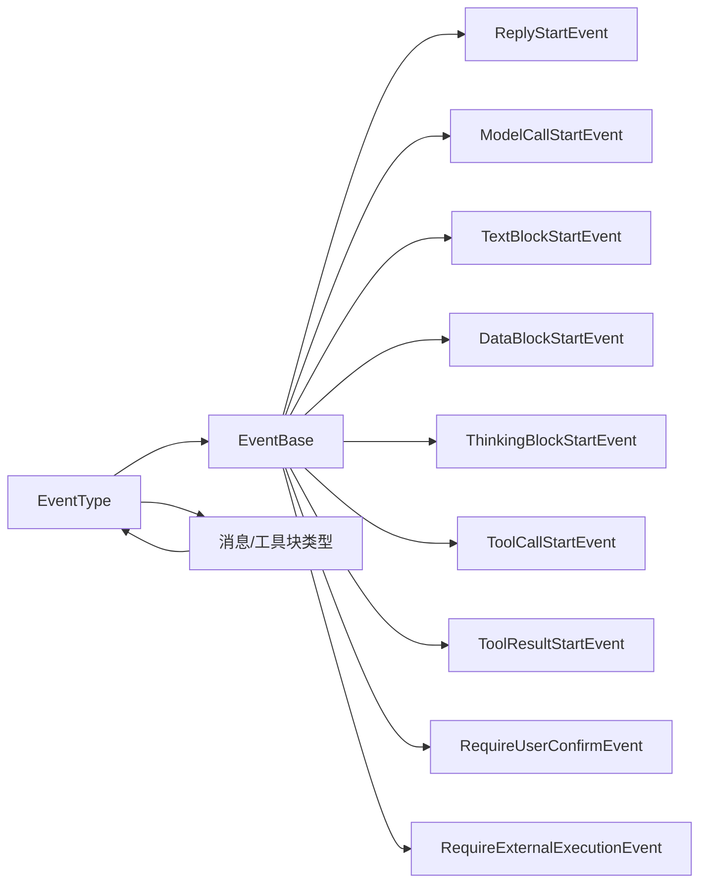

# 事件类型概览

<cite>
**本文引用的文件**
- [event/_event.py](file://src/agentscope/event/_event.py)
- [message/_base.py](file://src/agentscope/message/_base.py)
- [app/_middleware/_protocol/_agui.py](file://src/agentscope/app/_middleware/_protocol/_agui.py)
- [app/_middleware/_protocol/_base.py](file://src/agentscope/app/_middleware/_protocol/_base.py)
- [tests/event_test.py](file://tests/event_test.py)
- [tests/event_to_message_test.py](file://tests/event_to_message_test.py)
</cite>

## 目录
1. [简介](#简介)
2. [项目结构](#项目结构)
3. [核心组件](#核心组件)
4. [架构总览](#架构总览)
5. [详细组件分析](#详细组件分析)
6. [依赖关系分析](#依赖关系分析)
7. [性能考量](#性能考量)
8. [故障排查指南](#故障排查指南)
9. [结论](#结论)
10. [附录](#附录)

## 简介
本文件聚焦于 AgentScope 事件系统的基础架构，系统性梳理事件类型设计、事件基类与协议转换机制，并结合测试用例说明事件在智能体执行流程中的作用，以及如何支撑调试、监控与可观测性需求。同时给出事件类型选择与使用场景的最佳实践建议。

## 项目结构
事件系统位于 agentscope 的 event 子模块中，核心文件为事件类型与事件类定义；消息模块对事件类型进行引用以避免循环导入；应用中间件协议层负责将事件转换为前端或外部系统可消费的格式。

图表来源
- [event/_event.py:1-86](file://src/agentscope/event/_event.py#L1-L86)
- [message/_base.py:224-224](file://src/agentscope/message/_base.py#L224-L224)
- [app/_middleware/_protocol/_base.py:145-169](file://src/agentscope/app/_middleware/_protocol/_base.py#L145-L169)
- [app/_middleware/_protocol/_agui.py:217-257](file://src/agentscope/app/_middleware/_protocol/_agui.py#L217-L257)
- [tests/event_test.py:1-50](file://tests/event_test.py#L1-L50)
- [tests/event_to_message_test.py:716-800](file://tests/event_to_message_test.py#L716-L800)

章节来源
- [event/_event.py:1-86](file://src/agentscope/event/_event.py#L1-L86)
- [message/_base.py:224-224](file://src/agentscope/message/_base.py#L224-L224)
- [app/_middleware/_protocol/_base.py:145-169](file://src/agentscope/app/_middleware/_protocol/_base.py#L145-L169)
- [app/_middleware/_protocol/_agui.py:217-257](file://src/agentscope/app/_middleware/_protocol/_agui.py#L217-L257)
- [tests/event_test.py:1-50](file://tests/event_test.py#L1-L50)
- [tests/event_to_message_test.py:716-800](file://tests/event_to_message_test.py#L716-L800)

## 核心组件
- 事件类型枚举：EventType 定义了事件系统中的所有事件类型，覆盖回复、模型调用、文本块、数据块、思考块、工具调用与结果、用户确认、外部执行等全链路阶段。
- 事件基类 EventBase：统一提供唯一标识符与创建时间戳字段，确保每个事件具备可追踪性与可排序性。
- 具体事件类：围绕 EventType 的各类事件类，承载具体上下文信息（如会话 ID、回复 ID、块 ID、增量内容等）。
- 协议适配器：将 AgentScope 事件转换为特定协议（如 AGUI）所需的格式，便于前端或外部系统消费。

章节来源
- [event/_event.py:14-51](file://src/agentscope/event/_event.py#L14-L51)
- [event/_event.py:53-62](file://src/agentscope/event/_event.py#L53-L62)
- [event/_event.py:63-431](file://src/agentscope/event/_event.py#L63-L431)
- [app/_middleware/_protocol/_agui.py:217-257](file://src/agentscope/app/_middleware/_protocol/_agui.py#L217-L257)

## 架构总览
事件系统贯穿智能体执行全流程，从回复开始到结束，从模型调用到工具执行，再到用户确认与外部执行，形成完整的可观测闭环。消息模块通过事件类型实现与事件的解耦，协议层将事件映射为前端友好的事件名称，测试用例验证事件序列与转换逻辑。

图表来源
- [event/_event.py:14-51](file://src/agentscope/event/_event.py#L14-L51)
- [message/_base.py:224-224](file://src/agentscope/message/_base.py#L224-L224)
- [app/_middleware/_protocol/_agui.py:217-257](file://src/agentscope/app/_middleware/_protocol/_agui.py#L217-L257)

## 详细组件分析

### 事件类型枚举与分类体系
- 分类维度
  - 回复阶段：REPLY_START、REPLY_END
  - 模型调用阶段：MODEL_CALL_START、MODEL_CALL_END
  - 文本块阶段：TEXT_BLOCK_START、TEXT_BLOCK_DELTA、TEXT_BLOCK_END
  - 数据块阶段：DATA_BLOCK_START、DATA_BLOCK_DELTA、DATA_BLOCK_END
  - 思考块阶段：THINKING_BLOCK_START、THINKING_BLOCK_DELTA、THINKING_BLOCK_END
  - 工具调用阶段：TOOL_CALL_START、TOOL_CALL_DELTA、TOOL_CALL_END
  - 工具结果阶段：TOOL_RESULT_START、TOOL_RESULT_TEXT_DELTA、TOOL_RESULT_DATA_DELTA、TOOL_RESULT_END
  - 控制与交互：EXCEED_MAX_ITERS、REQUIRE_USER_CONFIRM、REQUIRE_EXTERNAL_EXECUTION、USER_CONFIRM_RESULT、EXTERNAL_EXECUTION_RESULT

- 设计要点
  - 使用 StrEnum 保证事件类型为字符串值，便于序列化与传输。
  - 通过 Literal 类型约束事件类的 type 字段，确保类型安全与反序列化一致性。
  - 事件命名遵循“阶段_动作”的语义化风格，便于理解与检索。

章节来源
- [event/_event.py:14-51](file://src/agentscope/event/_event.py#L14-L51)

### 事件基类 EventBase
- 基本属性
  - id：全局唯一标识符，采用随机十六进制字符串，确保事件可追踪且无冲突。
  - created_at：ISO 8601 时间戳，记录事件创建时刻，用于排序与审计。
- 设计模式
  - 使用 Pydantic BaseModel 提供结构化校验与序列化能力。
  - model_config 中启用 use_enum_values，使枚举字段以字符串形式输出，提升兼容性。

图表来源
- [event/_event.py:53-62](file://src/agentscope/event/_event.py#L53-L62)
- [event/_event.py:63-77](file://src/agentscope/event/_event.py#L63-L77)
- [event/_event.py:89-100](file://src/agentscope/event/_event.py#L89-L100)
- [event/_event.py:113-124](file://src/agentscope/event/_event.py#L113-L124)
- [event/_event.py:293-311](file://src/agentscope/event/_event.py#L293-L311)

章节来源
- [event/_event.py:53-62](file://src/agentscope/event/_event.py#L53-L62)

### 事件系统在智能体执行流程中的作用
- 流程阶段映射
  - 回复阶段：标记一次回复的开始与结束，便于统计吞吐与耗时。
  - 模型调用阶段：记录模型调用生命周期，支持调用次数、失败率与耗时分析。
  - 文本/数据/思考块阶段：细粒度流式输出与增量内容，支持实时渲染与增量聚合。
  - 工具调用与结果阶段：覆盖工具调用生命周期与结果输出，支持成功/失败状态与二进制数据处理。
  - 用户确认与外部执行：桥接人机交互与外部系统执行，支持中断与恢复。
- 可观测性支撑
  - 唯一 ID 与时间戳确保事件可串联、可回放。
  - 分类清晰的事件类型便于构建仪表盘与告警规则。
  - 流式事件支持实时监控与前端交互。

章节来源
- [event/_event.py:63-431](file://src/agentscope/event/_event.py#L63-L431)
- [tests/event_to_message_test.py:716-800](file://tests/event_to_message_test.py#L716-L800)

### 协议适配与前端集成
- 协议适配器职责
  - 将 AgentScope 事件转换为目标协议格式（如 AGUI），并为每种事件类型映射到前端可识别的事件名。
- 适配策略
  - 针对不同事件类型返回不同的 name 字段（如 require_user_confirm、external_execution_result 等），并携带事件的完整数据。
  - 对未知事件返回 unknown，便于兜底与扩展。

图表来源
- [app/_middleware/_protocol/_agui.py:217-257](file://src/agentscope/app/_middleware/_protocol/_agui.py#L217-L257)

章节来源
- [app/_middleware/_protocol/_agui.py:217-257](file://src/agentscope/app/_middleware/_protocol/_agui.py#L217-L257)
- [app/_middleware/_protocol/_base.py:145-169](file://src/agentscope/app/_middleware/_protocol/_base.py#L145-L169)

### 事件类型选择与使用场景最佳实践
- 优先使用语义明确的事件类型，避免混用相近类型导致可观测性混乱。
- 对需要流式的输出（文本、数据、思考）使用 START/DELTA/END 三段式事件，确保前端可增量渲染。
- 工具结果包含二进制数据时，优先使用数据块相关事件，并明确 media_type 与二选一的数据载体（data 或 url）。
- 用户确认与外部执行应成对出现，确保可追踪的人机交互闭环。
- 在协议适配层保持事件名与业务含义一致，便于前端开发与维护。

章节来源
- [event/_event.py:14-51](file://src/agentscope/event/_event.py#L14-L51)
- [event/_event.py:149-176](file://src/agentscope/event/_event.py#L149-L176)
- [event/_event.py:293-311](file://src/agentscope/event/_event.py#L293-L311)
- [app/_middleware/_protocol/_agui.py:217-257](file://src/agentscope/app/_middleware/_protocol/_agui.py#L217-L257)

## 依赖关系分析
- 事件类型与消息模块的耦合
  - 消息模块在需要处局部引入事件类型，避免循环依赖，同时通过事件类型实现与事件的解耦。
- 事件类与消息/工具块类型的关系
  - 事件类中引用工具调用/结果块的状态与类型，确保事件与消息结构的一致性与可验证性。
- 协议适配器与事件系统的边界
  - 协议适配器仅负责事件到协议的转换，不改变事件本身的结构与语义。

图表来源
- [event/_event.py:14-51](file://src/agentscope/event/_event.py#L14-L51)
- [event/_event.py:53-62](file://src/agentscope/event/_event.py#L53-L62)
- [message/_base.py:224-224](file://src/agentscope/message/_base.py#L224-L224)

章节来源
- [message/_base.py:224-224](file://src/agentscope/message/_base.py#L224-L224)
- [event/_event.py:14-51](file://src/agentscope/event/_event.py#L14-L51)
- [event/_event.py:53-62](file://src/agentscope/event/_event.py#L53-L62)

## 性能考量
- 事件序列化与传输
  - 使用 Pydantic 序列化，建议在高并发场景下对事件进行批量压缩与限流。
- 流式事件处理
  - 文本/数据/思考块的 DELTA 事件应控制大小与频率，避免前端渲染压力过大。
- 唯一标识与索引
  - 建议基于 reply_id、block_id 等关键字段建立索引，便于查询与聚合。

## 故障排查指南
- 事件缺失或顺序异常
  - 检查事件序列是否完整覆盖 START/DELTA/END 三段式，参考测试用例中的事件编排顺序。
- 协议转换异常
  - 确认事件类型是否在协议适配器中有对应映射，未知事件将被归类为 unknown。
- 二进制数据问题
  - 确保数据块事件中 media_type 正确设置，且 data 与 url 二选一，避免歧义。

章节来源
- [tests/event_to_message_test.py:716-800](file://tests/event_to_message_test.py#L716-L800)
- [app/_middleware/_protocol/_agui.py:217-257](file://src/agentscope/app/_middleware/_protocol/_agui.py#L217-L257)
- [event/_event.py:293-311](file://src/agentscope/event/_event.py#L293-L311)

## 结论
AgentScope 事件系统通过清晰的事件类型分类、统一的事件基类与完善的协议适配，实现了从模型调用到工具执行、从流式输出到人机交互的全链路可观测性。配合测试用例与协议映射，事件系统既满足调试与监控需求，又为前端与外部系统提供了稳定的集成接口。

## 附录
- 相关测试用例路径
  - 事件序列与转换测试：[tests/event_to_message_test.py:716-800](file://tests/event_to_message_test.py#L716-L800)
  - 事件基础功能测试：[tests/event_test.py:1-50](file://tests/event_test.py#L1-L50)