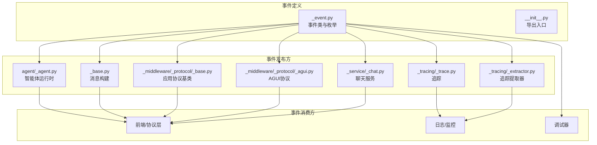
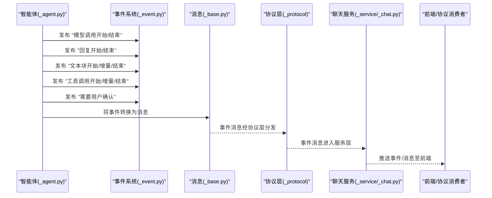
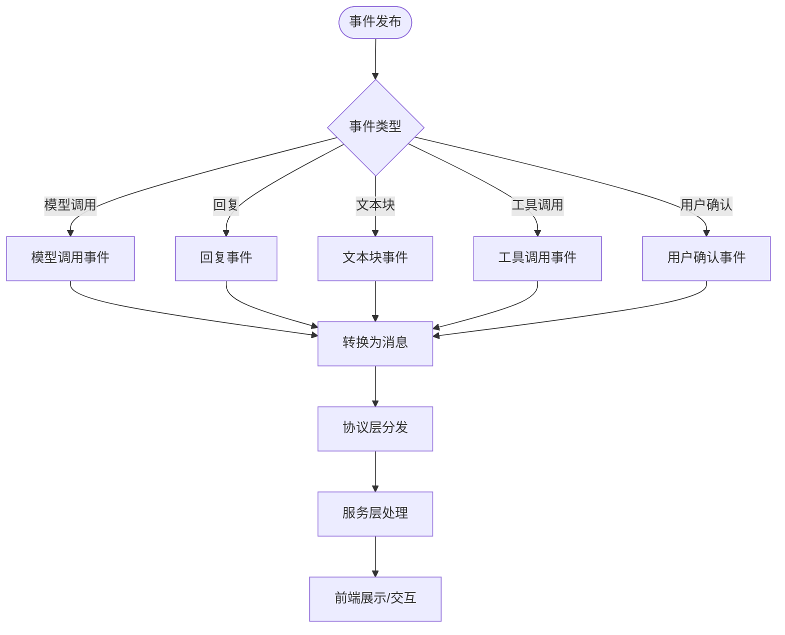
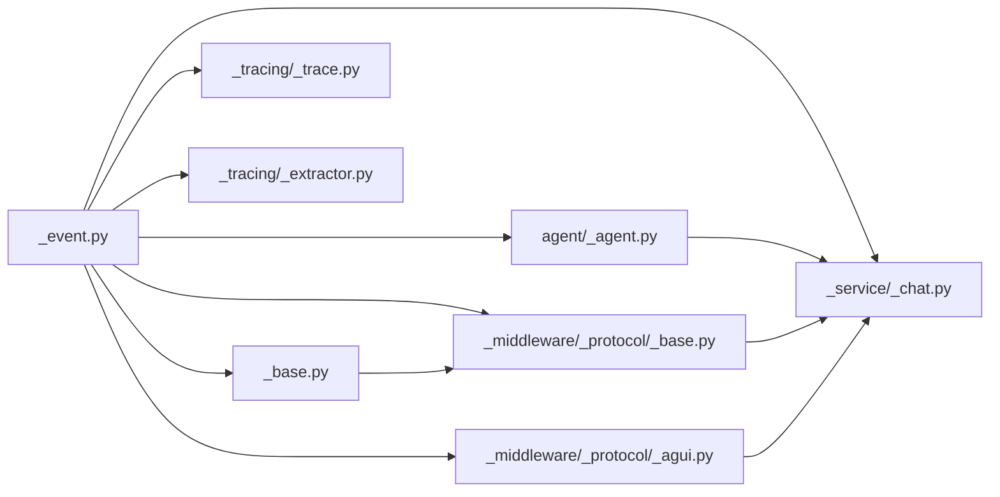

# 事件系统（Event）

<cite>
**本文引用的文件**
- [event/_event.py](file://src/agentscope/event/_event.py)
- [event/__init__.py](file://src/agentscope/event/__init__.py)
- [agent/_agent.py](file://src/agentscope/agent/_agent.py)
- [message/_base.py](file://src/agentscope/message/_base.py)
- [app/_middleware/_protocol/_base.py](file://src/agentscope/app/_middleware/_protocol/_base.py)
- [app/_middleware/_protocol/_agui.py](file://src/agentscope/app/_middleware/_protocol/_agui.py)
- [app/_service/_chat.py](file://src/agentscope/app/_service/_chat.py)
- [middleware/_tracing/_trace.py](file://src/agentscope/middleware/_tracing/_trace.py)
- [middleware/_tracing/_extractor.py](file://src/agentscope/middleware/_tracing/_extractor.py)
- [tests/event_test.py](file://tests/event_test.py)
- [tests/event_to_message_test.py](file://tests/event_to_message_test.py)
- [tests/hitl_user_confirmation_test.py](file://tests/hitl_user_confirmation_test.py)
- [tests/hitl_external_execution_test.py](file://tests/hitl_external_execution_test.py)
</cite>

## 目录
1. [简介](#简介)
2. [项目结构](#项目结构)
3. [核心组件](#核心组件)
4. [架构总览](#架构总览)
5. [详细组件分析](#详细组件分析)
6. [依赖分析](#依赖分析)
7. [性能考虑](#性能考虑)
8. [故障排查指南](#故障排查指南)
9. [结论](#结论)
10. [附录](#附录)

## 简介
本文件系统性梳理 AgentScope 的事件系统，围绕事件的分类、事件流处理与事件监听器注册展开，重点覆盖以下事件类型：
- 模型调用事件：ModelCallStartEvent、ModelCallEndEvent
- 回复事件：ReplyStartEvent、ReplyEndEvent
- 文本块事件：TextBlockStartEvent、TextBlockDeltaEvent、TextBlockEndEvent
- 工具调用事件：ToolCallStartEvent、ToolCallDeltaEvent、ToolCallEndEvent
- 用户确认事件：RequireUserConfirmEvent
- 外部执行结果事件：ExternalExecutionResultEvent
- 用户确认结果事件：UserConfirmResultEvent

同时阐明事件在智能体内部的流转过程，以及事件系统如何支撑调试与监控能力，并提供事件订阅与事件处理的参考路径。

## 项目结构
事件系统主要位于 src/agentscope/event 目录，对外通过 __init__.py 导出统一接口；多个模块在运行时发布事件，如 agent、message、app 中间件协议、服务层、追踪中间件等均与事件交互。

图示来源
- [event/_event.py:1-200](file://src/agentscope/event/_event.py#L1-L200)
- [event/__init__.py:1-100](file://src/agentscope/event/__init__.py#L1-L100)
- [agent/_agent.py:1-200](file://src/agentscope/agent/_agent.py#L1-L200)
- [message/_base.py:1-250](file://src/agentscope/message/_base.py#L1-L250)
- [app/_middleware/_protocol/_base.py:1-120](file://src/agentscope/app/_middleware/_protocol/_base.py#L1-L120)
- [app/_middleware/_protocol/_agui.py:1-120](file://src/agentscope/app/_middleware/_protocol/_agui.py#L1-L120)
- [app/_service/_chat.py:1-250](file://src/agentscope/app/_service/_chat.py#L1-L250)
- [middleware/_tracing/_trace.py:1-120](file://src/agentscope/middleware/_tracing/_trace.py#L1-L120)
- [middleware/_tracing/_extractor.py:1-120](file://src/agentscope/middleware/_tracing/_extractor.py#L1-L120)

章节来源
- [event/_event.py:1-200](file://src/agentscope/event/_event.py#L1-L200)
- [event/__init__.py:1-100](file://src/agentscope/event/__init__.py#L1-L100)

## 核心组件
- 事件类与事件类型枚举：定义了各类事件的结构、字段与语义，作为事件系统的基础契约。
- 事件发布与订阅：智能体运行时、消息构建、协议层、服务层、追踪中间件等在关键节点发布事件；上层可订阅以实现调试、监控或交互。
- 事件到消息映射：事件可被转换为消息对象，用于后续处理或展示。
- 协议与服务集成：应用协议层与聊天服务对特定事件进行消费，驱动 UI 或业务流程。

章节来源
- [event/_event.py:1-200](file://src/agentscope/event/_event.py#L1-L200)
- [message/_base.py:1-250](file://src/agentscope/message/_base.py#L1-L250)
- [app/_middleware/_protocol/_base.py:1-120](file://src/agentscope/app/_middleware/_protocol/_base.py#L1-L120)
- [app/_middleware/_protocol/_agui.py:1-120](file://src/agentscope/app/_middleware/_protocol/_agui.py#L1-L120)
- [app/_service/_chat.py:1-250](file://src/agentscope/app/_service/_chat.py#L1-L250)
- [middleware/_tracing/_trace.py:1-120](file://src/agentscope/middleware/_tracing/_trace.py#L1-L120)
- [middleware/_tracing/_extractor.py:1-120](file://src/agentscope/middleware/_tracing/_extractor.py#L1-L120)

## 架构总览
事件系统采用“发布-订阅”模式：各模块在关键生命周期节点发布事件，订阅者按需消费事件以实现调试、监控或交互。下图展示了典型事件流在智能体与服务层之间的传递。

图示来源
- [agent/_agent.py:1-200](file://src/agentscope/agent/_agent.py#L1-L200)
- [event/_event.py:1-200](file://src/agentscope/event/_event.py#L1-L200)
- [message/_base.py:1-250](file://src/agentscope/message/_base.py#L1-L250)
- [app/_middleware/_protocol/_base.py:1-120](file://src/agentscope/app/_middleware/_protocol/_base.py#L1-L120)
- [app/_middleware/_protocol/_agui.py:1-120](file://src/agentscope/app/_middleware/_protocol/_agui.py#L1-L120)
- [app/_service/_chat.py:1-250](file://src/agentscope/app/_service/_chat.py#L1-L250)

## 详细组件分析

### 事件类型与语义
- 模型调用事件
  - ModelCallStartEvent：模型调用开始，携带请求上下文信息。
  - ModelCallEndEvent：模型调用结束，携带响应与耗时等统计信息。
- 回复事件
  - ReplyStartEvent：回复生成开始。
  - ReplyEndEvent：回复生成结束。
- 文本块事件
  - TextBlockStartEvent：单个文本块开始。
  - TextBlockDeltaEvent：文本块增量更新。
  - TextBlockEndEvent：文本块结束。
- 工具调用事件
  - ToolCallStartEvent：工具调用开始。
  - ToolCallDeltaEvent：工具调用增量更新。
  - ToolCallEndEvent：工具调用结束。
- 用户确认事件
  - RequireUserConfirmEvent：触发用户确认，等待确认结果。
  - UserConfirmResultEvent：用户确认结果返回。
  - ExternalExecutionResultEvent：外部执行结果返回（与 HITL 相关）。

这些事件共同构成智能体内部的可观测性与可控性基础，便于调试与监控。

章节来源
- [event/_event.py:1-200](file://src/agentscope/event/_event.py#L1-L200)
- [tests/hitl_user_confirmation_test.py:1-120](file://tests/hitl_user_confirmation_test.py#L1-L120)
- [tests/hitl_external_execution_test.py:1-120](file://tests/hitl_external_execution_test.py#L1-L120)

### 事件在智能体内部的流转
- 智能体运行时在不同阶段发布事件，例如模型调用、回复生成、文本块输出、工具调用等。
- 事件随后被转换为消息对象，供协议层与服务层消费。
- 协议层负责将事件消息分发给前端或下游消费者。
- 聊天服务根据事件状态推进会话流程，如工具调用状态变更、用户确认等待等。

图示来源
- [agent/_agent.py:1-200](file://src/agentscope/agent/_agent.py#L1-L200)
- [message/_base.py:1-250](file://src/agentscope/message/_base.py#L1-L250)
- [app/_middleware/_protocol/_base.py:1-120](file://src/agentscope/app/_middleware/_protocol/_base.py#L1-L120)
- [app/_middleware/_protocol/_agui.py:1-120](file://src/agentscope/app/_middleware/_protocol/_agui.py#L1-L120)
- [app/_service/_chat.py:1-250](file://src/agentscope/app/_service/_chat.py#L1-L250)

### 事件订阅与事件处理（参考路径）
- 订阅事件：在应用协议层或服务层中注册事件回调，以接收并处理事件。
- 事件处理：根据事件类型进行分支处理，如更新 UI、记录日志、推进工作流等。
- 事件到消息映射：事件可被转换为消息对象，以便统一处理与传输。

参考路径（不含具体代码内容）：
- 事件订阅与处理示例路径
  - [app/_middleware/_protocol/_base.py:1-120](file://src/agentscope/app/_middleware/_protocol/_base.py#L1-L120)
  - [app/_middleware/_protocol/_agui.py:1-120](file://src/agentscope/app/_middleware/_protocol/_agui.py#L1-L120)
  - [app/_service/_chat.py:1-250](file://src/agentscope/app/_service/_chat.py#L1-L250)
- 事件到消息映射示例路径
  - [message/_base.py:1-250](file://src/agentscope/message/_base.py#L1-L250)
  - [tests/event_to_message_test.py:1-200](file://tests/event_to_message_test.py#L1-L200)

章节来源
- [app/_middleware/_protocol/_base.py:1-120](file://src/agentscope/app/_middleware/_protocol/_base.py#L1-L120)
- [app/_middleware/_protocol/_agui.py:1-120](file://src/agentscope/app/_middleware/_protocol/_agui.py#L1-L120)
- [app/_service/_chat.py:1-250](file://src/agentscope/app/_service/_chat.py#L1-L250)
- [message/_base.py:1-250](file://src/agentscope/message/_base.py#L1-L250)
- [tests/event_to_message_test.py:1-200](file://tests/event_to_message_test.py#L1-L200)

### 事件系统与调试、监控
- 追踪中间件：事件可用于生成追踪数据，辅助定位问题与性能瓶颈。
- 日志与可视化：事件消息可被记录与展示，形成完整的事件轨迹。
- 交互式控制：RequireUserConfirmEvent、UserConfirmResultEvent 等事件支持人机交互与中断恢复。

参考路径（不含具体代码内容）：
- 追踪与提取
  - [middleware/_tracing/_trace.py:1-120](file://src/agentscope/middleware/_tracing/_trace.py#L1-L120)
  - [middleware/_tracing/_extractor.py:1-120](file://src/agentscope/middleware/_tracing/_extractor.py#L1-L120)
- 用户确认与外部执行
  - [tests/hitl_user_confirmation_test.py:1-120](file://tests/hitl_user_confirmation_test.py#L1-L120)
  - [tests/hitl_external_execution_test.py:1-120](file://tests/hitl_external_execution_test.py#L1-L120)

章节来源
- [middleware/_tracing/_trace.py:1-120](file://src/agentscope/middleware/_tracing/_trace.py#L1-L120)
- [middleware/_tracing/_extractor.py:1-120](file://src/agentscope/middleware/_tracing/_extractor.py#L1-L120)
- [tests/hitl_user_confirmation_test.py:1-120](file://tests/hitl_user_confirmation_test.py#L1-L120)
- [tests/hitl_external_execution_test.py:1-120](file://tests/hitl_external_execution_test.py#L1-L120)

## 依赖分析
事件系统在多处模块中被导入与使用，形成如下依赖关系：

图示来源
- [event/_event.py:1-200](file://src/agentscope/event/_event.py#L1-L200)
- [agent/_agent.py:1-200](file://src/agentscope/agent/_agent.py#L1-L200)
- [message/_base.py:1-250](file://src/agentscope/message/_base.py#L1-L250)
- [app/_middleware/_protocol/_base.py:1-120](file://src/agentscope/app/_middleware/_protocol/_base.py#L1-L120)
- [app/_middleware/_protocol/_agui.py:1-120](file://src/agentscope/app/_middleware/_protocol/_agui.py#L1-L120)
- [app/_service/_chat.py:1-250](file://src/agentscope/app/_service/_chat.py#L1-L250)
- [middleware/_tracing/_trace.py:1-120](file://src/agentscope/middleware/_tracing/_trace.py#L1-L120)
- [middleware/_tracing/_extractor.py:1-120](file://src/agentscope/middleware/_tracing/_extractor.py#L1-L120)

章节来源
- [event/_event.py:1-200](file://src/agentscope/event/_event.py#L1-L200)
- [agent/_agent.py:1-200](file://src/agentscope/agent/_agent.py#L1-L200)
- [message/_base.py:1-250](file://src/agentscope/message/_base.py#L1-L250)
- [app/_middleware/_protocol/_base.py:1-120](file://src/agentscope/app/_middleware/_protocol/_base.py#L1-L120)
- [app/_middleware/_protocol/_agui.py:1-120](file://src/agentscope/app/_middleware/_protocol/_agui.py#L1-L120)
- [app/_service/_chat.py:1-250](file://src/agentscope/app/_service/_chat.py#L1-L250)
- [middleware/_tracing/_trace.py:1-120](file://src/agentscope/middleware/_tracing/_trace.py#L1-L120)
- [middleware/_tracing/_extractor.py:1-120](file://src/agentscope/middleware/_tracing/_extractor.py#L1-L120)

## 性能考虑
- 事件发布频率与开销：高频事件（如文本块增量、工具调用增量）可能带来网络与渲染压力，应结合节流/合并策略优化。
- 事件序列化与传输：事件转消息时的序列化成本与协议层传输效率需关注。
- 追踪与日志：事件驱动的追踪与日志应避免阻塞主流程，建议异步写入与采样策略。

## 故障排查指南
- 事件未到达前端：检查协议层与服务层是否正确订阅并转发事件。
- 事件顺序异常：核对事件发布顺序与消费顺序，确保无并发竞态。
- 用户确认不生效：确认 RequireUserConfirmEvent 是否被正确触发，UserConfirmResultEvent 是否被正确回传。
- 外部执行结果缺失：检查 ExternalExecutionResultEvent 的产生与传递链路。

参考路径（不含具体代码内容）：
- 事件测试用例
  - [tests/event_test.py:1-200](file://tests/event_test.py#L1-L200)
  - [tests/event_to_message_test.py:1-200](file://tests/event_to_message_test.py#L1-L200)
  - [tests/hitl_user_confirmation_test.py:1-120](file://tests/hitl_user_confirmation_test.py#L1-L120)
  - [tests/hitl_external_execution_test.py:1-120](file://tests/hitl_external_execution_test.py#L1-L120)

章节来源
- [tests/event_test.py:1-200](file://tests/event_test.py#L1-L200)
- [tests/event_to_message_test.py:1-200](file://tests/event_to_message_test.py#L1-L200)
- [tests/hitl_user_confirmation_test.py:1-120](file://tests/hitl_user_confirmation_test.py#L1-L120)
- [tests/hitl_external_execution_test.py:1-120](file://tests/hitl_external_execution_test.py#L1-L120)

## 结论
事件系统是 AgentScope 可观测性与可控性的关键基础设施。通过明确的事件类型、清晰的事件流与灵活的订阅机制，事件系统支撑了从智能体内部到前端/协议层的全链路可观测与交互。配合调试与监控中间件，事件系统能够有效提升开发与运维效率。

## 附录
- 事件导出入口：通过 event/__init__.py 对外暴露事件类与枚举，便于统一导入与使用。
- 典型使用场景：模型调用追踪、回复生成可视化、文本块增量渲染、工具调用状态管理、用户确认与外部执行结果反馈。

章节来源
- [event/__init__.py:1-100](file://src/agentscope/event/__init__.py#L1-L100)