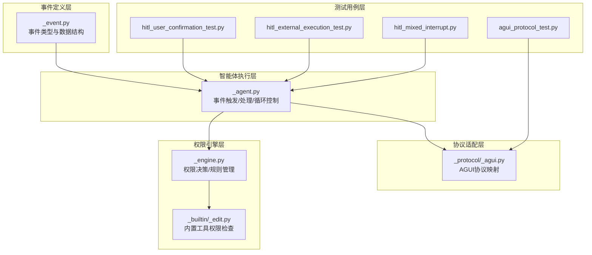
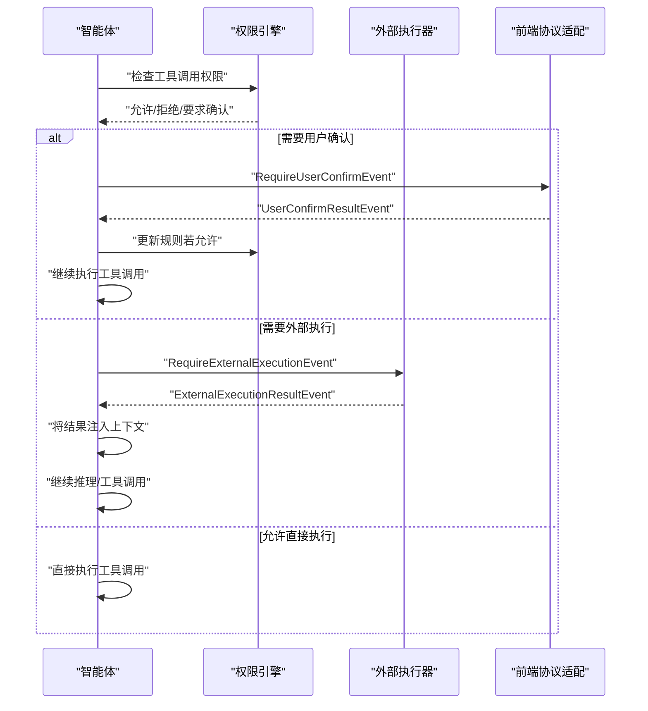
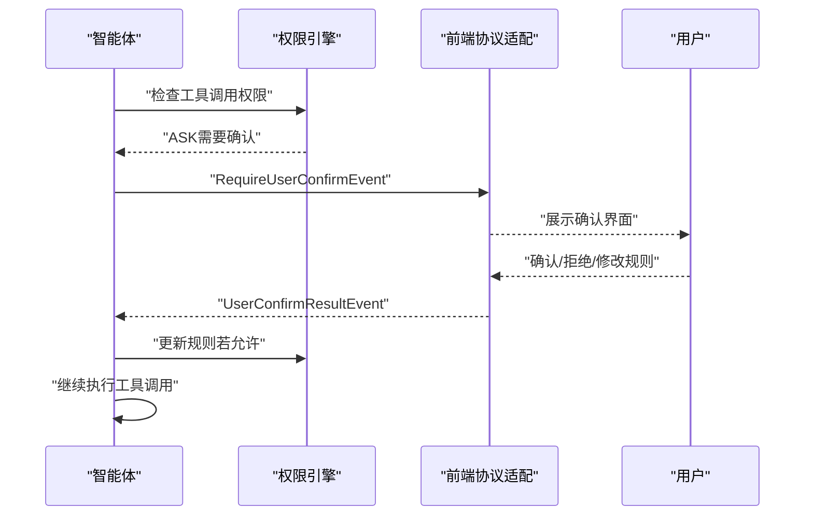
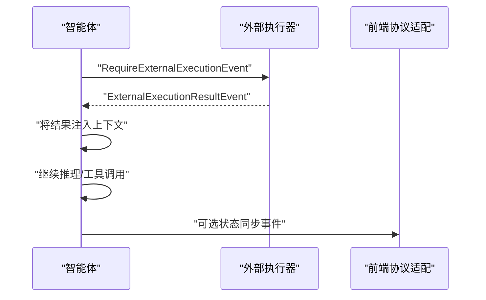
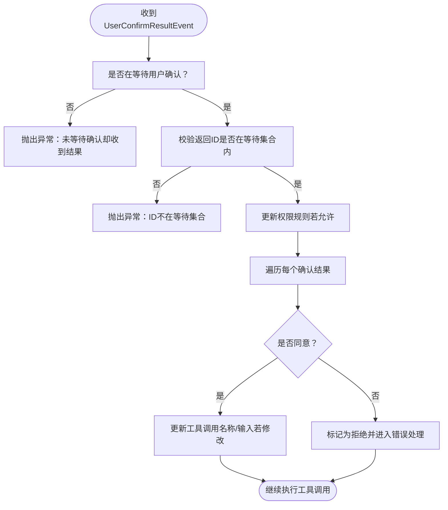
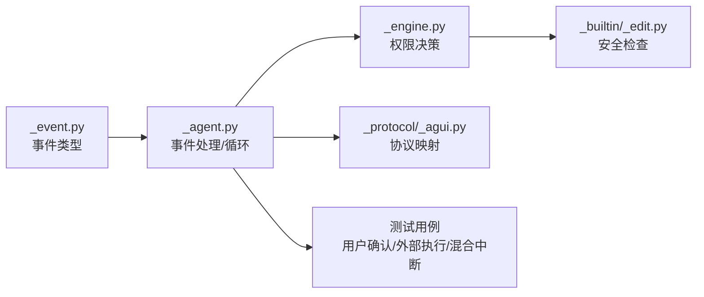

# 交互控制事件

<cite>
**本文引用的文件**
- [src/agentscope/event/_event.py](file://src/agentscope/event/_event.py)
- [src/agentscope/agent/_agent.py](file://src/agentscope/agent/_agent.py)
- [src/agentscope/app/_middleware/_protocol/_agui.py](file://src/agentscope/app/_middleware/_protocol/_agui.py)
- [src/agentscope/permission/_engine.py](file://src/agentscope/permission/_engine.py)
- [src/agentscope/tool/_builtin/_edit.py](file://src/agentscope/tool/_builtin/_edit.py)
- [tests/hitl_user_confirmation_test.py](file://tests/hitl_user_confirmation_test.py)
- [tests/hitl_external_execution_test.py](file://tests/hitl_external_execution_test.py)
- [tests/hitl_mixed_interrupt.py](file://tests/hitl_mixed_interrupt.py)
- [tests/agui_protocol_test.py](file://tests/agui_protocol_test.py)
</cite>

## 目录
1. [简介](#简介)
2. [项目结构](#项目结构)
3. [核心组件](#核心组件)
4. [架构总览](#架构总览)
5. [详细组件分析](#详细组件分析)
6. [依赖关系分析](#依赖关系分析)
7. [性能考量](#性能考量)
8. [故障排查指南](#故障排查指南)
9. [结论](#结论)
10. [附录](#附录)

## 简介
本文件聚焦于AgentScope的“交互控制事件”体系，围绕以下五类事件展开：ExceedMaxItersEvent（最大迭代次数超限）、RequireUserConfirmEvent（需要用户确认）、RequireExternalExecutionEvent（需要外部执行）、UserConfirmResultEvent（用户确认结果）与ExternalExecutionResultEvent（外部执行结果）。文档将从设计目的、使用场景、实现机制与集成方式等方面进行系统化说明，并通过序列图与流程图展示它们在复杂工作流中的协调作用，帮助开发者构建具备人机协作与外部系统集成能力的智能体应用。

## 项目结构
交互控制事件主要分布在如下模块：
- 事件定义层：事件类型与数据结构定义
- 智能体执行层：事件的触发、接收与处理逻辑
- 协议适配层：将内部事件转换为前端协议（如AGUI）
- 权限引擎层：权限决策与规则管理，支撑用户确认与外部执行的前置校验
- 测试用例层：覆盖用户确认、外部执行与混合中断等典型场景

图表来源
- [src/agentscope/event/_event.py](file://src/agentscope/event/_event.py)
- [src/agentscope/agent/_agent.py](file://src/agentscope/agent/_agent.py)
- [src/agentscope/app/_middleware/_protocol/_agui.py](file://src/agentscope/app/_middleware/_protocol/_agui.py)
- [src/agentscope/permission/_engine.py](file://src/agentscope/permission/_engine.py)
- [src/agentscope/tool/_builtin/_edit.py](file://src/agentscope/tool/_builtin/_edit.py)
- [tests/hitl_user_confirmation_test.py](file://tests/hitl_user_confirmation_test.py)
- [tests/hitl_external_execution_test.py](file://tests/hitl_external_execution_test.py)
- [tests/hitl_mixed_interrupt.py](file://tests/hitl_mixed_interrupt.py)
- [tests/agui_protocol_test.py](file://tests/agui_protocol_test.py)

章节来源
- [src/agentscope/event/_event.py](file://src/agentscope/event/_event.py)
- [src/agentscope/agent/_agent.py](file://src/agentscope/agent/_agent.py)
- [src/agentscope/app/_middleware/_protocol/_agui.py](file://src/agentscope/app/_middleware/_protocol/_agui.py)
- [src/agentscope/permission/_engine.py](file://src/agentscope/permission/_engine.py)
- [src/agentscope/tool/_builtin/_edit.py](file://src/agentscope/tool/_builtin/_edit.py)
- [tests/hitl_user_confirmation_test.py](file://tests/hitl_user_confirmation_test.py)
- [tests/hitl_external_execution_test.py](file://tests/hitl_external_execution_test.py)
- [tests/hitl_mixed_interrupt.py](file://tests/hitl_mixed_interrupt.py)
- [tests/agui_protocol_test.py](file://tests/agui_protocol_test.py)

## 核心组件
本节对五类交互控制事件进行逐项解析，明确其职责、字段与典型使用场景。

- ExceedMaxItersEvent（最大迭代次数超限）
  - 设计目的：当智能体在一次推理或执行过程中达到预设的最大迭代次数时，发出该事件以中止继续执行，防止无限循环或资源耗尽。
  - 使用场景：长链路推理、多轮对话、工具调用批处理等可能产生高迭代风险的流程。
  - 关键点：通常由智能体执行循环在检测到迭代上限后触发；后续可结合用户确认或外部执行策略决定是否放宽限制或终止。

- RequireUserConfirmEvent（需要用户确认）
  - 设计目的：当工具调用涉及敏感操作或权限规则要求人工审核时，向用户发起确认请求。
  - 使用场景：写入系统关键配置、编辑受保护文件、跨目录文件操作、高危命令等。
  - 关键点：事件携带待确认的工具调用列表及建议规则；智能体在收到该事件后暂停执行，等待UserConfirmResultEvent返回。

- RequireExternalExecutionEvent（需要外部执行）
  - 设计目的：当工具调用需要在外部环境或专用执行器中完成时，触发该事件以交由外部系统处理。
  - 使用场景：需要沙箱、容器或特定硬件环境的命令执行；需要跨进程或跨服务的工具调用。
  - 关键点：事件包含待提交的工具调用信息；外部执行完成后通过ExternalExecutionResultEvent回调结果。

- UserConfirmResultEvent（用户确认结果）
  - 设计目的：承载用户的确认/拒绝决定以及可能的规则修改建议。
  - 使用场景：用户同意、拒绝或要求调整权限规则后再执行。
  - 关键点：智能体在收到该事件后更新权限规则（若允许），并继续执行对应工具调用。

- ExternalExecutionResultEvent（外部执行结果）
  - 设计目的：承载外部执行器返回的工具调用结果，作为后续推理或执行的输入。
  - 使用场景：外部命令执行、远程API调用、跨进程任务完成。
  - 关键点：智能体将结果注入上下文，继续后续推理或工具调用。

章节来源
- [src/agentscope/event/_event.py](file://src/agentscope/event/_event.py)
- [src/agentscope/agent/_agent.py](file://src/agentscope/agent/_agent.py)

## 架构总览
下图展示了交互控制事件在智能体执行循环中的触发与处理路径，以及与权限引擎、协议适配层的协作关系。

图表来源
- [src/agentscope/agent/_agent.py](file://src/agentscope/agent/_agent.py)
- [src/agentscope/permission/_engine.py](file://src/agentscope/permission/_engine.py)
- [src/agentscope/app/_middleware/_protocol/_agui.py](file://src/agentscope/app/_middleware/_protocol/_agui.py)
- [src/agentscope/event/_event.py](file://src/agentscope/event/_event.py)

## 详细组件分析

### ExceedMaxItersEvent（最大迭代次数超限）
- 触发条件
  - 智能体在单次推理或执行循环中达到预设的迭代上限。
  - 常见于长链路工具调用、递归式推理或批量处理未正确收敛。
- 处理策略
  - 发出ExceedMaxItersEvent，中止继续执行。
  - 可结合用户确认放宽限制或外部执行策略决定后续动作。
- 错误处理
  - 若在等待用户确认或外部执行结果期间未收到任何事件，将抛出异常，提示“仍在等待但未收到事件”。

章节来源
- [src/agentscope/agent/_agent.py](file://src/agentscope/agent/_agent.py)

### RequireUserConfirmEvent（需要用户确认）
- 触发条件
  - 工具调用被权限引擎判定为需要人工确认（例如危险路径、禁止行为或安全策略触发）。
  - 内置工具（如文件编辑）在检查到敏感操作时会返回“要求确认”的决策。
- 数据结构要点
  - 包含待确认的工具调用列表，以及建议的权限规则（用于用户修改支持）。
- 用户确认流程
  - 智能体发送RequireUserConfirmEvent给前端协议适配层。
  - 用户在前端界面确认/拒绝，或提出规则修改建议。
  - 前端返回UserConfirmResultEvent，智能体据此更新权限规则并继续执行。

图表来源
- [src/agentscope/agent/_agent.py](file://src/agentscope/agent/_agent.py)
- [src/agentscope/permission/_engine.py](file://src/agentscope/permission/_engine.py)
- [src/agentscope/app/_middleware/_protocol/_agui.py](file://src/agentscope/app/_middleware/_protocol/_agui.py)
- [src/agentscope/tool/_builtin/_edit.py](file://src/agentscope/tool/_builtin/_edit.py)

章节来源
- [src/agentscope/agent/_agent.py](file://src/agentscope/agent/_agent.py)
- [src/agentscope/permission/_engine.py](file://src/agentscope/permission/_engine.py)
- [src/agentscope/tool/_builtin/_edit.py](file://src/agentscope/tool/_builtin/_edit.py)
- [tests/hitl_user_confirmation_test.py](file://tests/hitl_user_confirmation_test.py)
- [tests/agui_protocol_test.py](file://tests/agui_protocol_test.py)

### RequireExternalExecutionEvent（需要外部执行）
- 触发条件
  - 工具调用需要在外部环境或专用执行器中完成（如沙箱、容器、跨进程）。
  - 智能体在执行循环中检测到需要外部介入的工具调用。
- 结果回调
  - 外部执行完成后，通过ExternalExecutionResultEvent返回结果。
  - 智能体将结果注入上下文，继续后续推理或工具调用。
- 协作流程
  - 智能体发送RequireExternalExecutionEvent给外部执行器。
  - 外部执行器在完成后返回ExternalExecutionResultEvent。
  - 智能体将结果转换为内部消息块并继续执行。

图表来源
- [src/agentscope/agent/_agent.py](file://src/agentscope/agent/_agent.py)
- [src/agentscope/app/_middleware/_protocol/_agui.py](file://src/agentscope/app/_middleware/_protocol/_agui.py)
- [src/agentscope/event/_event.py](file://src/agentscope/event/_event.py)

章节来源
- [src/agentscope/agent/_agent.py](file://src/agentscope/agent/_agent.py)
- [tests/hitl_external_execution_test.py](file://tests/hitl_external_execution_test.py)
- [tests/hitl_mixed_interrupt.py](file://tests/hitl_mixed_interrupt.py)
- [tests/agui_protocol_test.py](file://tests/agui_protocol_test.py)

### UserConfirmResultEvent（用户确认结果）
- 字段与语义
  - reply_id：与当前回复关联的标识。
  - confirm_results：每个待确认工具调用的确认结果（同意/拒绝、规则变更等）。
- 校验与约束
  - 智能体在收到该事件时会校验：
    - 是否确实在等待用户确认；
    - 返回的工具调用ID是否与等待集合一致；
    - 若规则允许，将更新权限引擎中的规则。
- 后续处理
  - 对于同意的工具调用，更新名称与输入（若用户修改），并可更新权限规则；
  - 对于拒绝的工具调用，生成“已拒绝”的状态并进入错误处理流程。

图表来源
- [src/agentscope/agent/_agent.py](file://src/agentscope/agent/_agent.py)
- [src/agentscope/permission/_engine.py](file://src/agentscope/permission/_engine.py)

章节来源
- [src/agentscope/agent/_agent.py](file://src/agentscope/agent/_agent.py)
- [src/agentscope/permission/_engine.py](file://src/agentscope/permission/_engine.py)

### ExternalExecutionResultEvent（外部执行结果）
- 字段与语义
  - reply_id：与当前回复关联的标识。
  - execution_results：外部执行器返回的工具调用结果列表。
- 处理流程
  - 智能体将结果转换为内部消息块并注入上下文；
  - 继续后续推理或工具调用；
  - 若在等待外部执行结果期间未收到任何事件，将抛出异常，提示“仍在等待但未收到事件”。

章节来源
- [src/agentscope/agent/_agent.py](file://src/agentscope/agent/_agent.py)
- [src/agentscope/event/_event.py](file://src/agentscope/event/_event.py)

### 权限规则验证与用户修改支持
- 权限引擎
  - 支持不同模式（如绕过、接受修改、严格等），并维护允许/拒绝规则；
  - 在工具调用前进行决策，必要时返回“要求确认”。
- 内置工具的安全检查
  - 如文件编辑工具对危险路径进行安全检查，强制要求确认；
  - 在接受修改模式下，仅允许工作目录内的安全操作。
- 用户修改支持
  - RequireUserConfirmEvent可携带建议规则；
  - UserConfirmResultEvent可包含用户提出的规则变更；
  - 智能体在权限允许时更新规则，使后续调用得以继续。

章节来源
- [src/agentscope/permission/_engine.py](file://src/agentscope/permission/_engine.py)
- [src/agentscope/tool/_builtin/_edit.py](file://src/agentscope/tool/_builtin/_edit.py)
- [src/agentscope/agent/_agent.py](file://src/agentscope/agent/_agent.py)

### 协议适配与前端交互
- AGUI协议映射
  - 将RequireUserConfirmEvent、RequireExternalExecutionEvent、UserConfirmResultEvent、ExternalExecutionResultEvent映射为前端自定义事件；
  - 便于Web UI或桌面应用接收并展示交互控件。
- 测试验证
  - 单元测试覆盖了事件到协议的转换，确保前端能够正确识别各类交互事件。

章节来源
- [src/agentscope/app/_middleware/_protocol/_agui.py](file://src/agentscope/app/_middleware/_protocol/_agui.py)
- [tests/agui_protocol_test.py](file://tests/agui_protocol_test.py)

## 依赖关系分析
交互控制事件的依赖关系如下：

图表来源
- [src/agentscope/event/_event.py](file://src/agentscope/event/_event.py)
- [src/agentscope/agent/_agent.py](file://src/agentscope/agent/_agent.py)
- [src/agentscope/permission/_engine.py](file://src/agentscope/permission/_engine.py)
- [src/agentscope/tool/_builtin/_edit.py](file://src/agentscope/tool/_builtin/_edit.py)
- [src/agentscope/app/_middleware/_protocol/_agui.py](file://src/agentscope/app/_middleware/_protocol/_agui.py)
- [tests/hitl_user_confirmation_test.py](file://tests/hitl_user_confirmation_test.py)
- [tests/hitl_external_execution_test.py](file://tests/hitl_external_execution_test.py)
- [tests/hitl_mixed_interrupt.py](file://tests/hitl_mixed_interrupt.py)

章节来源
- [src/agentscope/event/_event.py](file://src/agentscope/event/_event.py)
- [src/agentscope/agent/_agent.py](file://src/agentscope/agent/_agent.py)
- [src/agentscope/permission/_engine.py](file://src/agentscope/permission/_engine.py)
- [src/agentscope/tool/_builtin/_edit.py](file://src/agentscope/tool/_builtin/_edit.py)
- [src/agentscope/app/_middleware/_protocol/_agui.py](file://src/agentscope/app/_middleware/_protocol/_agui.py)
- [tests/hitl_user_confirmation_test.py](file://tests/hitl_user_confirmation_test.py)
- [tests/hitl_external_execution_test.py](file://tests/hitl_external_execution_test.py)
- [tests/hitl_mixed_interrupt.py](file://tests/hitl_mixed_interrupt.py)

## 性能考量
- 迭代上限控制
  - 合理设置最大迭代次数，避免长时间阻塞或资源占用；
  - 在复杂工作流中分阶段设置不同的上限，便于快速失败与恢复。
- 事件处理开销
  - 用户确认与外部执行均会导致执行暂停，应尽量减少不必要的确认与外部调用；
  - 批量工具调用时优先考虑并发执行，降低等待时间。
- 权限检查成本
  - 安全检查与规则匹配会带来额外开销，应在工具调用前进行必要的缓存与去重；
  - 对于高频操作，可采用白名单或简化规则以提升性能。

## 故障排查指南
- “仍在等待但未收到事件”
  - 现象：在等待用户确认或外部执行结果期间，未收到任何事件。
  - 排查：确认前端是否正确发送UserConfirmResultEvent或ExternalExecutionResultEvent；检查协议适配层映射是否正确。
  - 参考位置：[src/agentscope/agent/_agent.py](file://src/agentscope/agent/_agent.py)
- “未等待确认却收到UserConfirmResultEvent”
  - 现象：智能体未处于等待用户确认状态，却收到了UserConfirmResultEvent。
  - 排查：检查工具调用流程，确保RequireUserConfirmEvent与UserConfirmResultEvent成对出现。
  - 参考位置：[src/agentscope/agent/_agent.py](file://src/agentscope/agent/_agent.py)
- “返回的工具调用ID不在等待集合”
  - 现象：UserConfirmResultEvent中包含未知ID。
  - 排查：核对RequireUserConfirmEvent的工具调用列表与UserConfirmResultEvent的ID集合一致性。
  - 参考位置：[src/agentscope/agent/_agent.py](file://src/agentscope/agent/_agent.py)
- “外部执行结果未到达”
  - 现象：RequireExternalExecutionEvent已发送，但未收到ExternalExecutionResultEvent。
  - 排查：检查外部执行器回调逻辑与事件发送方的一致性；确认协议适配层映射正常。
  - 参考位置：[src/agentscope/agent/_agent.py](file://src/agentscope/agent/_agent.py)

章节来源
- [src/agentscope/agent/_agent.py](file://src/agentscope/agent/_agent.py)
- [tests/agui_protocol_test.py](file://tests/agui_protocol_test.py)

## 结论
交互控制事件体系通过ExceedMaxItersEvent、RequireUserConfirmEvent、RequireExternalExecutionEvent、UserConfirmResultEvent与ExternalExecutionResultEvent，实现了对智能体执行过程的精细化控制与人机协作。配合权限引擎与协议适配层，系统能够在保证安全性的同时，灵活地处理复杂工作流中的中断与恢复。开发者可基于这些事件构建具备强交互性与外部集成能力的智能体应用。

## 附录
- 实现示例与最佳实践
  - 用户确认流程：在权限引擎判定为“要求确认”时，发送RequireUserConfirmEvent，等待UserConfirmResultEvent；根据用户选择更新规则并继续执行。
  - 外部执行流程：在需要沙箱或专用环境时，发送RequireExternalExecutionEvent，等待ExternalExecutionResultEvent并将结果注入上下文。
  - 混合中断场景：在同一轮推理中同时触发用户确认与外部执行，需分别处理两类事件并协调后续流程。
- 相关测试参考
  - 用户确认测试：[tests/hitl_user_confirmation_test.py](file://tests/hitl_user_confirmation_test.py)
  - 外部执行测试：[tests/hitl_external_execution_test.py](file://tests/hitl_external_execution_test.py)
  - 混合中断测试：[tests/hitl_mixed_interrupt.py](file://tests/hitl_mixed_interrupt.py)
  - 协议映射测试：[tests/agui_protocol_test.py](file://tests/agui_protocol_test.py)