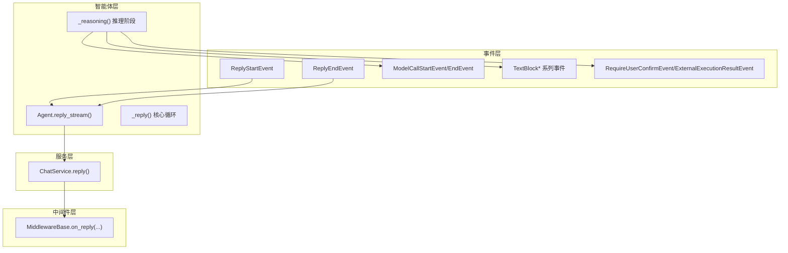
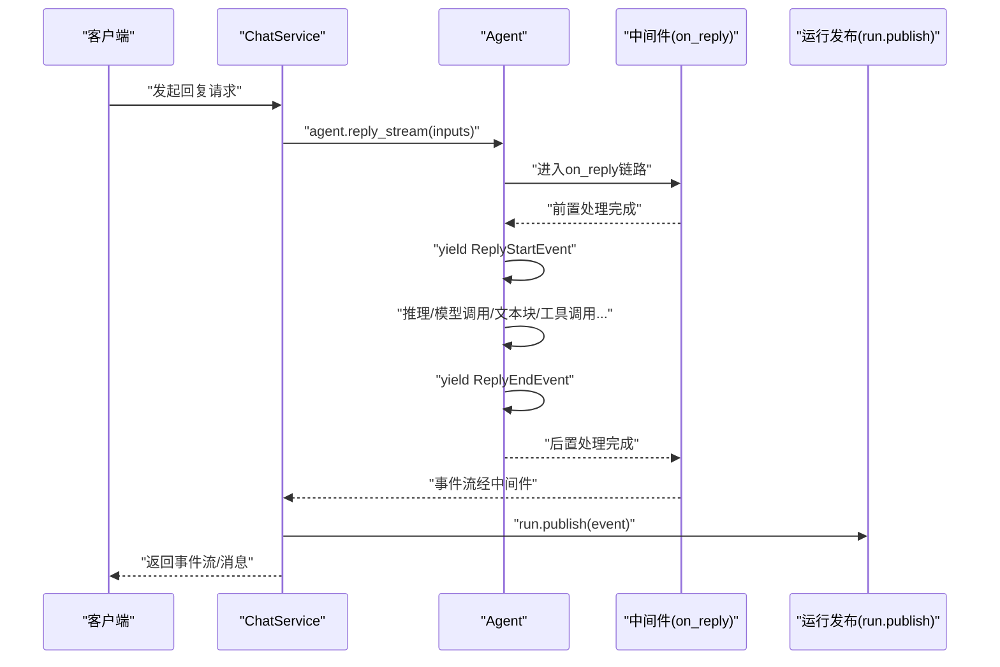
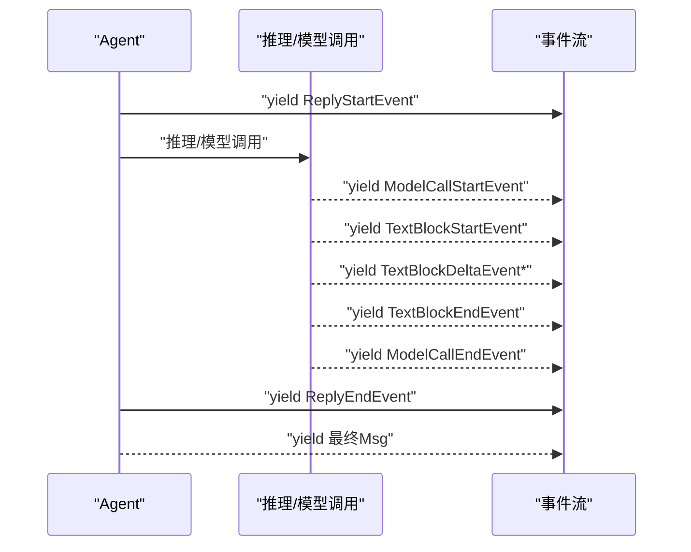
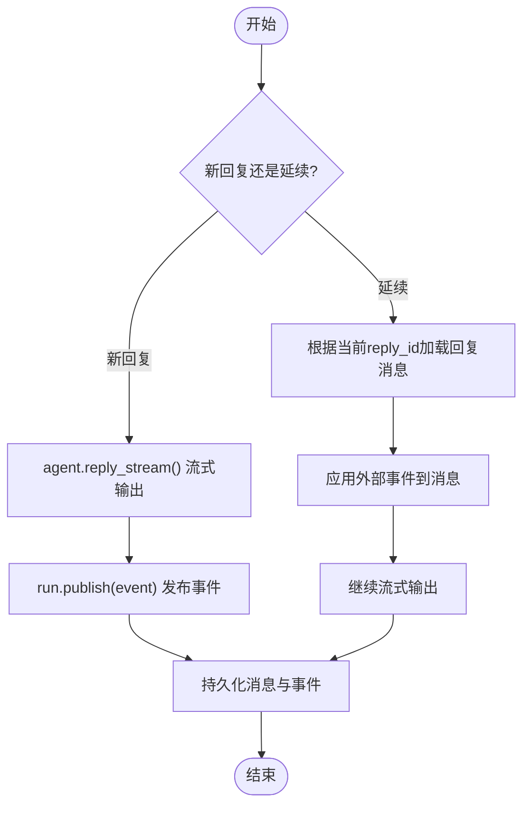
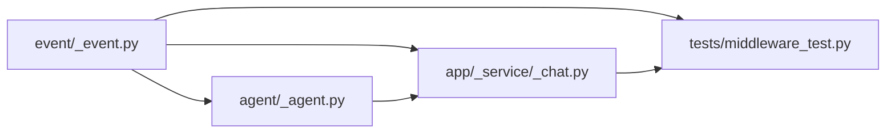

# 回复事件

<cite>
**本文引用的文件**
- [event/_event.py](file://src/agentscope/event/_event.py)
- [event/__init__.py](file://src/agentscope/event/__init__.py)
- [agent/_agent.py](file://src/agentscope/agent/_agent.py)
- [app/_service/_chat.py](file://src/agentscope/app/_service/_chat.py)
- [middleware_test.py](file://tests/middleware_test.py)
- [event_test.py](file://tests/event_test.py)
- [event_to_message_test.py](file://tests/event_to_message_test.py)
- [app/_middleware/_protocol/_agui.py](file://src/agentscope/app/_middleware/_protocol/_agui.py)
</cite>

## 目录
1. [引言](#引言)
2. [项目结构](#项目结构)
3. [核心组件](#核心组件)
4. [架构总览](#架构总览)
5. [组件详解](#组件详解)
6. [依赖关系分析](#依赖关系分析)
7. [性能考量](#性能考量)
8. [故障排查指南](#故障排查指南)
9. [结论](#结论)

## 引言
本文件聚焦于AgentScope的“回复事件”体系，系统性阐述ReplyStartEvent与ReplyEndEvent的设计目的、关键属性（会话ID、回复ID、智能体名称、角色）及其在对话流程中的触发时机与数据传递机制；并结合中间件与服务层的实际用法，给出订阅与处理示例，解释其与模型调用、文本块、工具调用等事件的关系，以及如何通过回复事件实现对话状态管理。

## 项目结构
与回复事件直接相关的核心模块分布如下：
- 事件定义：位于事件模块，包含ReplyStartEvent、ReplyEndEvent及其它事件类型
- 智能体执行：Agent类在回复生成流程中发出ReplyStartEvent与ReplyEndEvent
- 服务层集成：聊天服务在流式输出时发布并持久化回复事件
- 中间件钩子：on_reply钩子可拦截与扩展回复事件
- 单元测试：覆盖事件序列、消息转换、中间件行为等

图表来源
- [event/_event.py:64-88](file://src/agentscope/event/_event.py#L64-L88)
- [agent/_agent.py:191-235](file://src/agentscope/agent/_agent.py#L191-L235)
- [agent/_agent.py:584-620](file://src/agentscope/agent/_agent.py#L584-L620)
- [app/_service/_chat.py:179-220](file://src/agentscope/app/_service/_chat.py#L179-L220)
- [middleware_test.py:38-116](file://tests/middleware_test.py#L38-L116)

章节来源
- [event/_event.py:14-52](file://src/agentscope/event/_event.py#L14-L52)
- [event/__init__.py:4-34](file://src/agentscope/event/__init__.py#L4-L34)
- [agent/_agent.py:191-235](file://src/agentscope/agent/_agent.py#L191-L235)
- [app/_service/_chat.py:179-220](file://src/agentscope/app/_service/_chat.py#L179-L220)

## 核心组件
- ReplyStartEvent：标识一次回复开始，携带会话ID、回复ID、智能体名称与角色
- ReplyEndEvent：标识一次回复结束，携带会话ID与回复ID
- Agent.reply_stream：在回复生命周期内发出上述两类事件，并持续产出推理与工具调用过程事件
- ChatService：在流式输出时发布事件、构建并持久化回复消息

章节来源
- [event/_event.py:64-88](file://src/agentscope/event/_event.py#L64-L88)
- [agent/_agent.py:191-235](file://src/agentscope/agent/_agent.py#L191-L235)
- [agent/_agent.py:584-620](file://src/agentscope/agent/_agent.py#L584-L620)
- [app/_service/_chat.py:179-220](file://src/agentscope/app/_service/_chat.py#L179-L220)

## 架构总览
下图展示了从Agent到服务层的回复事件流，以及与中间件的交互位置：

图表来源
- [agent/_agent.py:191-235](file://src/agentscope/agent/_agent.py#L191-L235)
- [agent/_agent.py:584-620](file://src/agentscope/agent/_agent.py#L584-L620)
- [app/_service/_chat.py:179-220](file://src/agentscope/app/_service/_chat.py#L179-L220)
- [middleware_test.py:38-116](file://tests/middleware_test.py#L38-L116)

## 组件详解

### ReplyStartEvent 与 ReplyEndEvent 的设计与用途
- 设计目的
  - ReplyStartEvent用于标记一次回复的开始，便于中间件、服务层与UI侧进行初始化与状态同步
  - ReplyEndEvent用于标记一次回复的结束，便于收尾处理、持久化与状态更新
- 关键属性
  - 会话ID（session_id）：标识该回复所属的会话，用于跨轮次上下文管理
  - 回复ID（reply_id）：唯一标识本次回复产生的消息，贯穿整个事件流
  - 智能体名称（name）：用于显示与审计
  - 角色（role）：默认“assistant”，用于区分不同角色的回复
- 使用场景
  - 中间件订阅on_reply钩子，基于ReplyStartEvent进行预处理（如注入日志、修改输入）
  - 服务层在收到ReplyStartEvent时创建或定位回复消息对象，随后持续追加事件
  - UI协议层将ReplyStartEvent映射为“开始运行”，ReplyEndEvent映射为“结束运行”

章节来源
- [event/_event.py:64-88](file://src/agentscope/event/_event.py#L64-L88)
- [event_test.py:14-34](file://tests/event_test.py#L14-L34)
- [app/_middleware/_protocol/_agui.py:94-100](file://src/agentscope/app/_middleware/_protocol/_agui.py#L94-L100)

### 事件触发时机与数据传递
- 触发时机
  - ReplyStartEvent在Agent._reply()入口处发出，此时已生成reply_id并初始化迭代计数
  - ReplyEndEvent在推理阶段产出最终消息时发出，随后直接返回最终Msg
- 数据传递
  - 事件通过AsyncGenerator逐条传递，服务层在每一步发布run.publish(event)，同时可持久化到消息存储
  - 服务层在收到ReplyStartEvent后构造回复消息对象，并在后续事件到达时append_event

章节来源
- [agent/_agent.py:584-620](file://src/agentscope/agent/_agent.py#L584-L620)
- [app/_service/_chat.py:179-220](file://src/agentscope/app/_service/_chat.py#L179-L220)

### 与模型调用、文本块、工具调用事件的关系
- ReplyStartEvent与ReplyEndEvent是“回复级”事件，包裹着更细粒度的事件：
  - 模型调用事件（ModelCallStartEvent/ModelCallEndEvent）描述单次模型调用的生命周期
  - 文本块事件（TextBlockStart/Delta/End）描述文本增量生成
  - 工具调用事件（ToolCall*）与工具结果事件（ToolResult*）描述工具执行过程
- 这些事件共同构成一次回复的完整轨迹，ReplyStartEvent/ReplyEndEvent提供高层边界

章节来源
- [event/_event.py:90-147](file://src/agentscope/event/_event.py#L90-L147)
- [agent/_agent.py:687-779](file://src/agentscope/agent/_agent.py#L687-L779)

### 订阅与处理示例（中间件 on_reply 钩子）
- 示例目标：在回复开始前、期间与结束后插入日志或处理逻辑
- 实现要点
  - 定义MiddlewareBase的on_reply方法，按“pre → 事件遍历 → post”的顺序处理
  - 在事件遍历时识别AgentEvent类型，记录事件类型或对消息进行处理
- 行为验证
  - 测试用例验证了on_reply钩子在REPLY_START、REPLY_END等事件上的回调顺序与前后置处理

章节来源
- [middleware_test.py:38-116](file://tests/middleware_test.py#L38-L116)

### 通过回复事件实现对话状态管理
- 会话维度的状态
  - 会话ID（session_id）贯穿所有事件，确保跨轮次一致性
  - 服务层在收到ReplyStartEvent时创建回复消息对象，后续事件作为消息的事件片段被追加
- 回复维度的状态
  - 回复ID（reply_id）用于唯一标识一次回复，便于并发多回复场景下的隔离
  - ReplyEndEvent标志着回复完成，服务层可据此持久化最终消息与统计信息（如token用量）
- 外部交互与恢复
  - 当需要用户确认或外部执行时，Agent会产出RequireUserConfirmEvent/RequireExternalExecutionEvent，并在后续以UserConfirmResultEvent/ExternalExecutionResultEvent恢复继续
  - 服务层在“延续模式”下根据当前reply_id获取已持久化的回复消息，应用外部事件后再继续流式输出

章节来源
- [app/_service/_chat.py:179-220](file://src/agentscope/app/_service/_chat.py#L179-L220)
- [event_to_message_test.py:698-709](file://tests/event_to_message_test.py#L698-L709)

### 类关系图（事件模型）

```mermaid
classDiagram
class EventBase {
+string id
+string created_at
}
class ReplyStartEvent {
+string type
+string session_id
+string reply_id
+string name
+string role
}
class ReplyEndEvent {
+string type
+string session_id
+string reply_id
}
class ModelCallStartEvent {
+string type
+string reply_id
+string model_name
}
class ModelCallEndEvent {
+string type
+string reply_id
+int input_tokens
+int output_tokens
}
class TextBlockStartEvent {
+string type
+string reply_id
+string block_id
}
class TextBlockDeltaEvent {
+string type
+string reply_id
+string block_id
+string delta
}
class TextBlockEndEvent {
+string type
+string reply_id
+string block_id
}
class ToolCallStartEvent {
+string type
+string reply_id
+string tool_call_id
+string tool_call_name
}
class ToolCallEndEvent {
+string type
+string reply_id
+string tool_call_id
}
class ToolResultStartEvent {
+string type
+string reply_id
+string tool_call_id
+string tool_call_name
}
class ToolResultEndEvent {
+string type
+string reply_id
+string tool_call_id
+ToolResultState state
}
ReplyStartEvent --|> EventBase
ReplyEndEvent --|> EventBase
ModelCallStartEvent --|> EventBase
ModelCallEndEvent --|> EventBase
TextBlockStartEvent --|> EventBase
TextBlockDeltaEvent --|> EventBase
TextBlockEndEvent --|> EventBase
ToolCallStartEvent --|> EventBase
ToolCallEndEvent --|> EventBase
ToolResultStartEvent --|> EventBase
ToolResultEndEvent --|> EventBase
```

图表来源
- [event/_event.py:53-432](file://src/agentscope/event/_event.py#L53-L432)

### 事件序列图（一次典型回复）

图表来源
- [agent/_agent.py:584-620](file://src/agentscope/agent/_agent.py#L584-L620)
- [agent/_agent.py:687-779](file://src/agentscope/agent/_agent.py#L687-L779)

### 外部交互与恢复（延续模式）

图表来源
- [app/_service/_chat.py:179-220](file://src/agentscope/app/_service/_chat.py#L179-L220)

## 依赖关系分析
- 事件导出
  - event/__init__.py统一导出ReplyStartEvent、ReplyEndEvent等事件类型，供上层模块使用
- 智能体依赖
  - Agent在回复主循环中直接产出ReplyStartEvent与ReplyEndEvent，并在推理阶段产出更细粒度事件
- 服务层依赖
  - ChatService在流式输出时订阅事件，发布到运行通道，并在ReplyStartEvent时准备回复消息对象
- 中间件依赖
  - 中间件通过on_reply钩子拦截事件流，实现横切关注点（如日志、权限、审计）

图表来源
- [event/__init__.py:4-34](file://src/agentscope/event/__init__.py#L4-L34)
- [agent/_agent.py:191-235](file://src/agentscope/agent/_agent.py#L191-L235)
- [app/_service/_chat.py:179-220](file://src/agentscope/app/_service/_chat.py#L179-L220)
- [middleware_test.py:38-116](file://tests/middleware_test.py#L38-L116)

章节来源
- [event/__init__.py:4-34](file://src/agentscope/event/__init__.py#L4-L34)
- [agent/_agent.py:191-235](file://src/agentscope/agent/_agent.py#L191-L235)
- [app/_service/_chat.py:179-220](file://src/agentscope/app/_service/_chat.py#L179-L220)
- [middleware_test.py:38-116](file://tests/middleware_test.py#L38-L116)

## 性能考量
- 事件流式输出避免一次性聚合大量事件，降低内存峰值
- 中间件按需处理事件，建议仅在必要时进行昂贵操作（如网络调用、磁盘写入）
- 对于并发工具调用，事件可能并行产生，服务层应保证事件追加的原子性与一致性

## 故障排查指南
- 事件缺失
  - 若未收到ReplyStartEvent或ReplyEndEvent，检查Agent._reply()是否正常执行，以及中间件是否正确透传事件
- 会话/回复ID不一致
  - 确认服务层在收到ReplyStartEvent后使用reply_id创建消息对象，并在后续事件中保持一致
- 外部交互未恢复
  - 确保在延续模式下正确加载当前reply_id对应的回复消息，并应用UserConfirmResultEvent/ExternalExecutionResultEvent后再继续流式输出
- 中间件阻塞
  - 检查on_reply钩子是否正确yield上游事件，避免遗漏导致事件流中断

章节来源
- [agent/_agent.py:584-620](file://src/agentscope/agent/_agent.py#L584-L620)
- [app/_service/_chat.py:179-220](file://src/agentscope/app/_service/_chat.py#L179-L220)
- [middleware_test.py:38-116](file://tests/middleware_test.py#L38-L116)

## 结论
ReplyStartEvent与ReplyEndEvent构成了AgentScope回复事件系统的边界与骨架，配合模型调用、文本块与工具调用事件，形成完整的对话生命周期追踪。通过中间件与服务层的协同，开发者可以基于回复事件实现强大的可观测性、可审计性与可恢复性，从而支撑复杂对话场景的状态管理与用户体验优化。