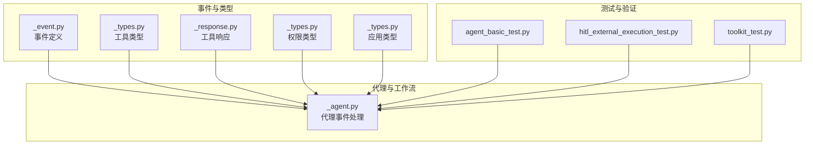
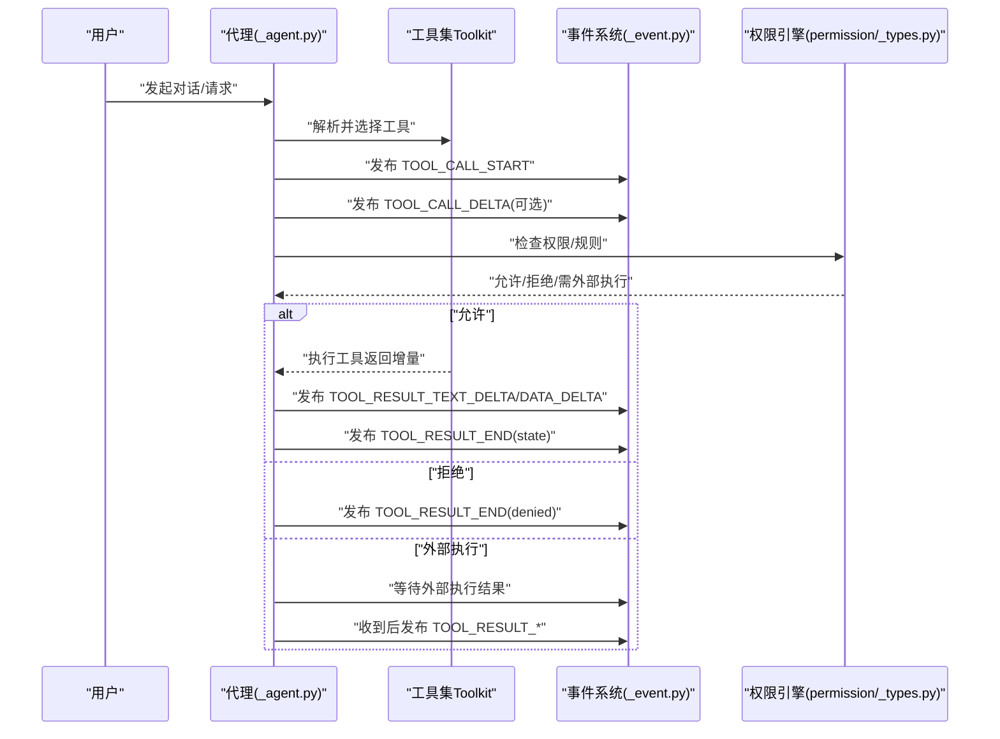
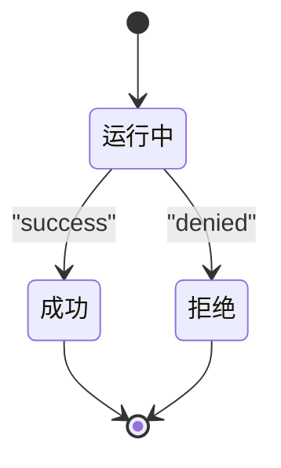
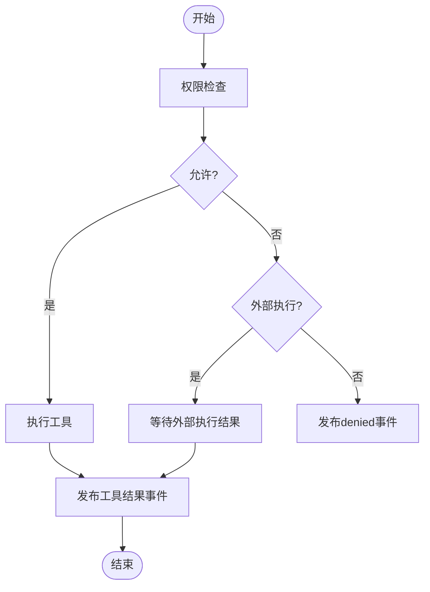
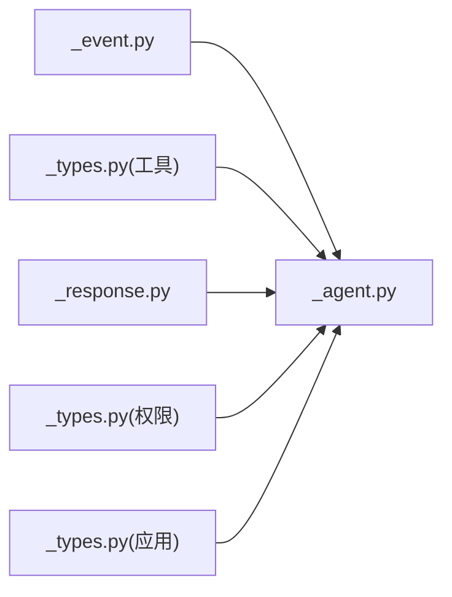

# 工具调用与结果事件

<cite>
**本文引用的文件**   
- [src/agentscope/event/_event.py](file://src/agentscope/event/_event.py)
- [src/agentscope/tool/_types.py](file://src/agentscope/tool/_types.py)
- [src/agentscope/tool/_response.py](file://src/agentscope/tool/_response.py)
- [src/agentscope/permission/_types.py](file://src/agentscope/permission/_types.py)
- [src/agentscope/agent/_agent.py](file://src/agentscope/agent/_agent.py)
- [src/agentscope/app/_types.py](file://src/agentscope/app/_types.py)
- [tests/agent_basic_test.py](file://tests/agent_basic_test.py)
- [tests/hitl_external_execution_test.py](file://tests/hitl_external_execution_test.py)
- [tests/toolkit_test.py](file://tests/toolkit_test.py)
</cite>

## 目录
1. [简介](#简介)
2. [项目结构](#项目结构)
3. [核心组件](#核心组件)
4. [架构总览](#架构总览)
5. [详细组件分析](#详细组件分析)
6. [依赖关系分析](#依赖关系分析)
7. [性能考量](#性能考量)
8. [故障排查指南](#故障排查指南)
9. [结论](#结论)
10. [附录](#附录)

## 简介
本文件聚焦于AgentScope中“工具调用与结果事件”系统，系统围绕两类事件流展开：工具调用事件（ToolCall系列）与工具结果事件（ToolResult系列）。前者用于描述一次工具调用的生命周期（开始、增量、结束），后者用于承载工具执行产生的输出（开始、文本增量、数据增量、结束）。文档将深入解释：
- 工具调用ID的生成与传递机制
- 工具名称识别与参数增量传输
- 工具执行状态管理（ToolResultState状态转换）
- 最终结果处理与事件订阅
- 与权限控制系统（含外部执行与用户确认）的集成

## 项目结构
与工具调用和结果事件直接相关的模块与测试如下：
- 事件定义与类型：src/agentscope/event/_event.py
- 工具类型与响应：src/agentscope/tool/_types.py、src/agentscope/tool/_response.py
- 权限类型与规则：src/agentscope/permission/_types.py
- 应用层类型与上下文：src/agentscope/app/_types.py
- 代理逻辑与事件处理：src/agentscope/agent/_agent.py
- 行为验证与事件序列：tests/agent_basic_test.py、tests/hitl_external_execution_test.py、tests/toolkit_test.py

**图表来源**
- [src/agentscope/event/_event.py](file://src/agentscope/event/_event.py)
- [src/agentscope/tool/_types.py](file://src/agentscope/tool/_types.py)
- [src/agentscope/tool/_response.py](file://src/agentscope/tool/_response.py)
- [src/agentscope/permission/_types.py](file://src/agentscope/permission/_types.py)
- [src/agentscope/app/_types.py](file://src/agentscope/app/_types.py)
- [src/agentscope/agent/_agent.py](file://src/agentscope/agent/_agent.py)
- [tests/agent_basic_test.py](file://tests/agent_basic_test.py)
- [tests/hitl_external_execution_test.py](file://tests/hitl_external_execution_test.py)
- [tests/toolkit_test.py](file://tests/toolkit_test.py)

**章节来源**
- [src/agentscope/event/_event.py](file://src/agentscope/event/_event.py)
- [src/agentscope/tool/_types.py](file://src/agentscope/tool/_types.py)
- [src/agentscope/tool/_response.py](file://src/agentscope/tool/_response.py)
- [src/agentscope/permission/_types.py](file://src/agentscope/permission/_types.py)
- [src/agentscope/app/_types.py](file://src/agentscope/app/_types.py)
- [src/agentscope/agent/_agent.py](file://src/agentscope/agent/_agent.py)
- [tests/agent_basic_test.py](file://tests/agent_basic_test.py)
- [tests/hitl_external_execution_test.py](file://tests/hitl_external_execution_test.py)
- [tests/toolkit_test.py](file://tests/toolkit_test.py)

## 核心组件
- 工具调用事件（ToolCall系列）
  - TOOL_CALL_START：表示一次工具调用开始，携带工具调用ID与工具名称
  - TOOL_CALL_DELTA：表示工具调用参数的增量内容（如逐步输入）
  - TOOL_CALL_END：表示工具调用结束
- 工具结果事件（ToolResult系列）
  - TOOL_RESULT_START：表示工具结果开始，携带工具调用ID与工具名称
  - TOOL_RESULT_TEXT_DELTA：表示文本类结果的增量
  - TOOL_RESULT_DATA_DELTA：表示非文本类结果的增量（如二进制或结构化数据）
  - TOOL_RESULT_END：表示工具结果结束，并包含最终状态（如success、denied等）

上述事件在测试中被广泛使用，用于断言工具调用与结果的完整生命周期。

**章节来源**
- [tests/agent_basic_test.py](file://tests/agent_basic_test.py)
- [tests/hitl_external_execution_test.py](file://tests/hitl_external_execution_test.py)

## 架构总览
下图展示了从代理到工具执行、再到事件产出的整体流程，以及与权限系统的交互点。

**图表来源**
- [src/agentscope/agent/_agent.py](file://src/agentscope/agent/_agent.py)
- [src/agentscope/event/_event.py](file://src/agentscope/event/_event.py)
- [src/agentscope/permission/_types.py](file://src/agentscope/permission/_types.py)
- [src/agentscope/tool/_types.py](file://src/agentscope/tool/_types.py)

## 详细组件分析

### 事件模型与状态
- 工具调用事件
  - TOOL_CALL_START：携带工具调用ID与工具名称
  - TOOL_CALL_DELTA：携带参数增量
  - TOOL_CALL_END：结束标记
- 工具结果事件
  - TOOL_RESULT_START：携带工具调用ID与工具名称
  - TOOL_RESULT_TEXT_DELTA：文本增量
  - TOOL_RESULT_DATA_DELTA：数据增量
  - TOOL_RESULT_END：结束并附带最终状态（如success、denied等）

这些事件在测试中被严格断言，确保顺序与完整性。

**章节来源**
- [tests/agent_basic_test.py](file://tests/agent_basic_test.py)
- [tests/hitl_external_execution_test.py](file://tests/hitl_external_execution_test.py)

### 工具调用ID生成与传递
- 工具调用ID由上游生成并在事件中透传，测试中通过AnyString()进行断言，表明ID为系统自动生成且稳定传递至事件层
- 在并发场景中，不同工具调用拥有独立ID，事件序列中通过tool_call_id区分不同调用

**章节来源**
- [tests/hitl_external_execution_test.py](file://tests/hitl_external_execution_test.py)
- [tests/agent_basic_test.py](file://tests/agent_basic_test.py)

### 工具名称识别与参数增量传输
- 工具名称在TOOL_CALL_START中明确给出，后续事件均以该名称标识归属
- 参数增量通过TOOL_CALL_DELTA传输，支持逐步输入与流式参数构建

**章节来源**
- [tests/hitl_external_execution_test.py](file://tests/hitl_external_execution_test.py)
- [tests/agent_basic_test.py](file://tests/agent_basic_test.py)

### 工具执行状态管理与ToolResultState
- ToolResultState用于表达工具执行的最终状态，常见值包括success、denied等
- 流程状态转换示意：

- 在代理侧，当收到外部执行结果或用户确认时，会根据规则更新状态并发布最终事件

**图表来源**
- [src/agentscope/agent/_agent.py](file://src/agentscope/agent/_agent.py)
- [src/agentscope/tool/_types.py](file://src/agentscope/tool/_types.py)

**章节来源**
- [src/agentscope/agent/_agent.py](file://src/agentscope/agent/_agent.py)
- [src/agentscope/tool/_types.py](file://src/agentscope/tool/_types.py)

### 最终结果处理与事件订阅
- 代理在处理外部执行结果时，会将工具结果转换为事件并注入上下文
- 订阅示例（基于测试中的期望事件序列）：
  - 订阅TOOL_RESULT_START/TOOL_RESULT_TEXT_DELTA/TOOL_RESULT_END，实现对工具执行的实时监控与结果收集
  - 并发场景下，多个工具调用的事件通过tool_call_id进行区分与聚合

**章节来源**
- [src/agentscope/agent/_agent.py](file://src/agentscope/agent/_agent.py)
- [tests/agent_basic_test.py](file://tests/agent_basic_test.py)
- [tests/hitl_external_execution_test.py](file://tests/hitl_external_execution_test.py)

### 与权限控制系统的集成
- 权限引擎负责判断是否允许工具执行、是否需要外部执行或用户确认
- 集成点：
  - 在工具调用前触发权限检查
  - 若需要外部执行，则等待外部执行结果并发布事件
  - 若用户拒绝，则发布denied状态的TOOL_RESULT_END
  - 用户确认后，可动态更新权限规则并继续执行

**图表来源**
- [src/agentscope/agent/_agent.py](file://src/agentscope/agent/_agent.py)
- [src/agentscope/permission/_types.py](file://src/agentscope/permission/_types.py)

**章节来源**
- [src/agentscope/agent/_agent.py](file://src/agentscope/agent/_agent.py)
- [src/agentscope/permission/_types.py](file://src/agentscope/permission/_types.py)

### 工具执行与增量输出示例（来自测试）
- 测试展示了工具执行的增量输出合并与最终响应的断言，验证了：
  - 多个文本块的连续输出会被合并
  - 增量事件的正确顺序与内容
  - 并发与串行工具调用的事件区分与聚合

**章节来源**
- [tests/toolkit_test.py](file://tests/toolkit_test.py)

## 依赖关系分析
- 事件系统与代理紧密耦合：代理负责将工具调用与结果转化为事件，并驱动状态机推进
- 工具类型与响应为事件提供数据载体；权限类型为事件提供决策依据
- 应用层类型为事件与UI/协议层提供统一接口

**图表来源**
- [src/agentscope/event/_event.py](file://src/agentscope/event/_event.py)
- [src/agentscope/tool/_types.py](file://src/agentscope/tool/_types.py)
- [src/agentscope/tool/_response.py](file://src/agentscope/tool/_response.py)
- [src/agentscope/permission/_types.py](file://src/agentscope/permission/_types.py)
- [src/agentscope/app/_types.py](file://src/agentscope/app/_types.py)
- [src/agentscope/agent/_agent.py](file://src/agentscope/agent/_agent.py)

**章节来源**
- [src/agentscope/event/_event.py](file://src/agentscope/event/_event.py)
- [src/agentscope/tool/_types.py](file://src/agentscope/tool/_types.py)
- [src/agentscope/tool/_response.py](file://src/agentscope/tool/_response.py)
- [src/agentscope/permission/_types.py](file://src/agentscope/permission/_types.py)
- [src/agentscope/app/_types.py](file://src/agentscope/app/_types.py)
- [src/agentscope/agent/_agent.py](file://src/agentscope/agent/_agent.py)

## 性能考量
- 增量事件有助于降低单次响应体积，提升前端渲染与网络传输效率
- 并发工具调用应避免共享状态冲突，建议通过tool_call_id进行隔离
- 权限检查前置可减少无效执行，提高整体吞吐

## 故障排查指南
- 工具调用未产生结果事件
  - 检查代理是否正确发布TOOL_CALL_START/TOOL_CALL_DELTA/TOOL_CALL_END
  - 确认权限引擎未阻断执行
- 结果事件状态异常
  - 核对ToolResultState的设置与传播链路
  - 关注外部执行与用户确认的分支
- 并发事件错乱
  - 确保每个工具调用使用唯一ID，并按ID聚合事件

**章节来源**
- [src/agentscope/agent/_agent.py](file://src/agentscope/agent/_agent.py)
- [src/agentscope/tool/_types.py](file://src/agentscope/tool/_types.py)

## 结论
AgentScope的工具调用与结果事件体系通过清晰的生命周期事件与状态机，实现了对工具执行过程的可观测与可控。配合权限系统，可在保证安全的前提下实现灵活的工具编排与外部执行。测试覆盖验证了事件序列的正确性与鲁棒性，为上层应用提供了可靠的事件订阅与处理基础。

## 附录
- 事件订阅最佳实践
  - 使用tool_call_id作为事件聚合键
  - 对文本与数据增量分别处理，避免阻塞UI渲染
  - 在并发场景下，维护调用ID到状态的映射表，便于回溯与调试