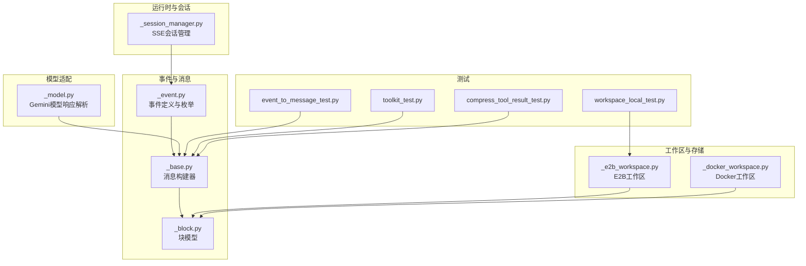
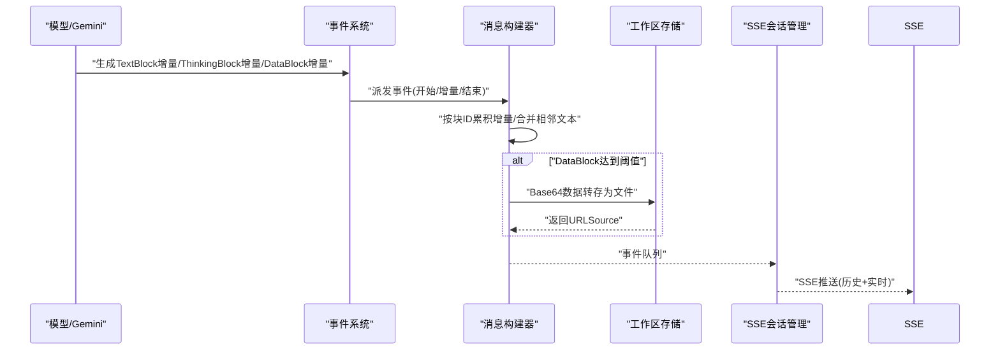
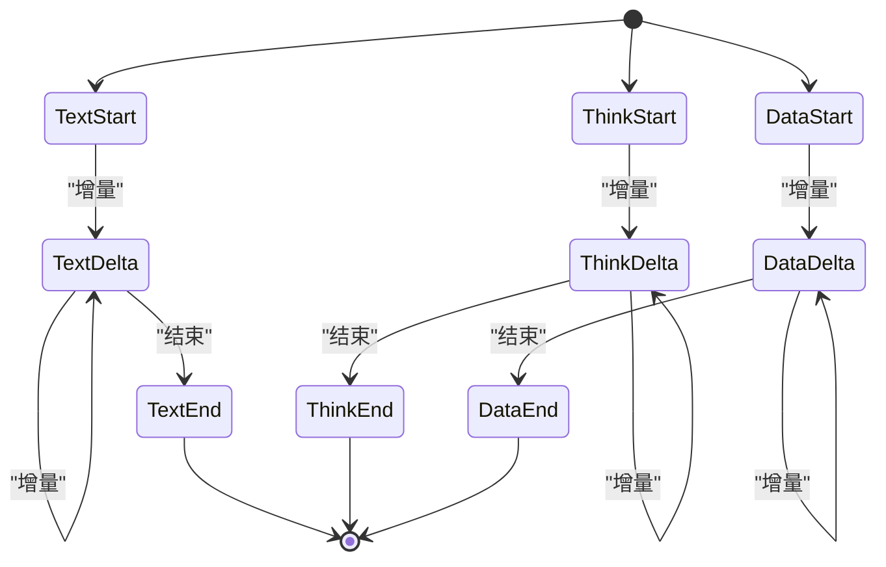
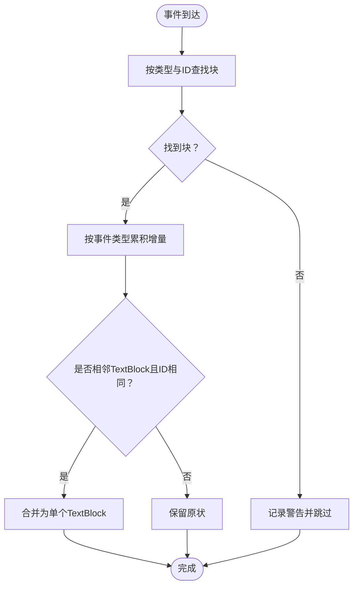
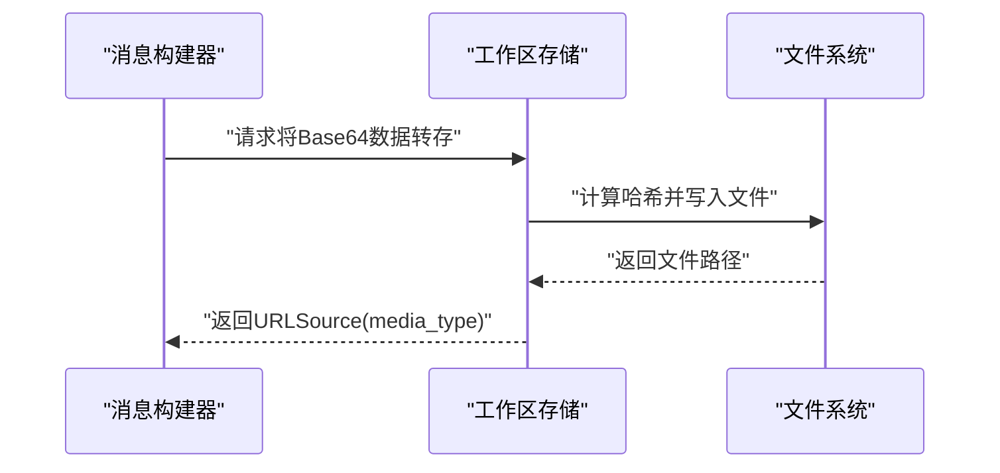
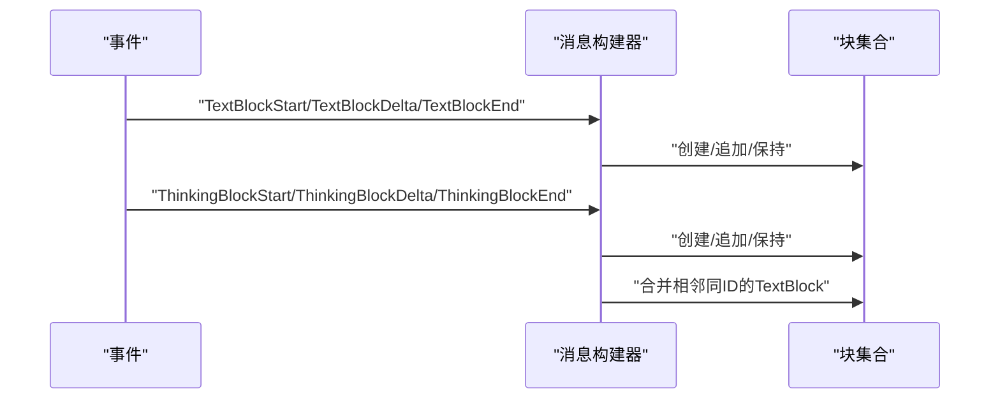
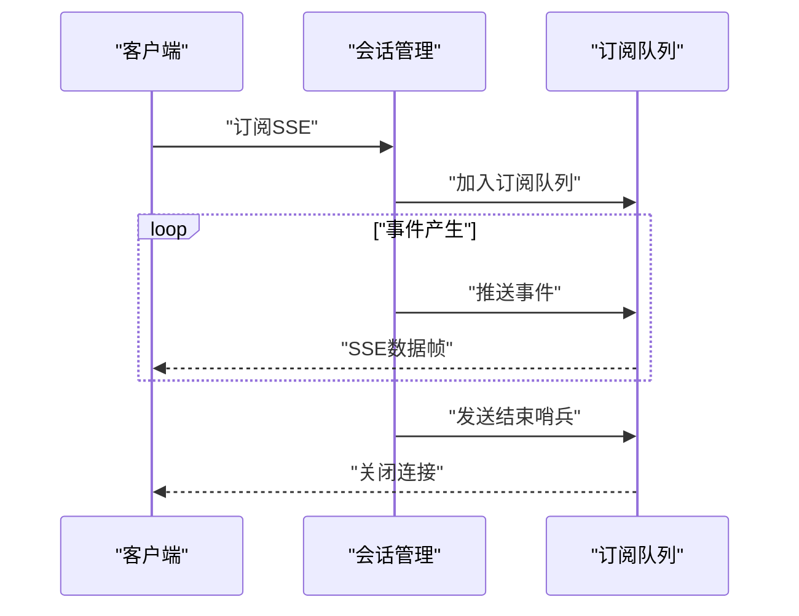
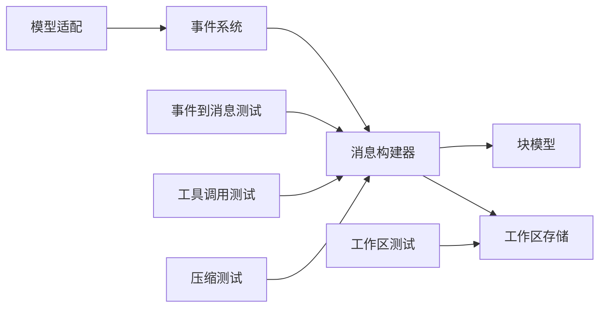

# 文本/数据/思考块事件

<cite>
**本文引用的文件**
- [event/_event.py](file://src/agentscope/event/_event.py)
- [message/_base.py](file://src/agentscope/message/_base.py)
- [message/_block.py](file://src/agentscope/message/_block.py)
- [app/_manager/_session_manager.py](file://src/agentscope/app/_manager/_session_manager.py)
- [_utils/_common.py](file://src/agentscope/_utils/_common.py)
- [workspace/_e2b/_e2b_workspace.py](file://src/agentscope/workspace/_e2b/_e2b_workspace.py)
- [workspace/_docker/_docker_workspace.py](file://src/agentscope/workspace/_docker/_docker_workspace.py)
- [model/_gemini/_model.py](file://src/agentscope/model/_gemini/_model.py)
- [tests/event_to_message_test.py](file://tests/event_to_message_test.py)
- [tests/toolkit_test.py](file://tests/toolkit_test.py)
- [tests/compress_tool_result_test.py](file://tests/compress_tool_result_test.py)
- [tests/workspace_local_test.py](file://tests/workspace_local_test.py)
</cite>

## 目录
1. [引言](#引言)
2. [项目结构](#项目结构)
3. [核心组件](#核心组件)
4. [架构总览](#架构总览)
5. [详细组件分析](#详细组件分析)
6. [依赖关系分析](#依赖关系分析)
7. [性能考量](#性能考量)
8. [故障排查指南](#故障排查指南)
9. [结论](#结论)
10. [附录](#附录)

## 引言
本文件聚焦于AgentScope中“文本块”“数据块”与“思考块”的事件系统设计与实现，系统性阐述以下主题：
- TextBlock系列事件（开始、增量、结束）的生命周期与合并策略
- DataBlock系列事件（开始、增量、结束）的base64编码与持久化路径
- ThinkingBlock系列事件（开始、增量、结束）的累积与呈现
- 块ID的唯一性保障与增量数据传输机制
- 多媒体内容支持：MIME类型识别与二进制数据处理
- 实时流式输出的实现思路与交互体验建议

## 项目结构
围绕块事件系统的关键代码分布在如下模块：
- 事件定义与分发：src/agentscope/event/_event.py
- 消息构建与块解析：src/agentscope/message/_base.py、src/agentscope/message/_block.py
- 会话与事件流：src/agentscope/app/_manager/_session_manager.py
- 工具与工作区：src/agentscope/workspace/_e2b/_e2b_workspace.py、src/agentscope/workspace/_docker/_docker_workspace.py
- 模型适配：src/agentscope/model/_gemini/_model.py
- 通用工具：src/agentscope/_utils/_common.py
- 测试用例：tests/event_to_message_test.py、tests/toolkit_test.py、tests/compress_tool_result_test.py、tests/workspace_local_test.py

**图表来源**
- [event/_event.py](file://src/agentscope/event/_event.py)
- [message/_base.py](file://src/agentscope/message/_base.py)
- [message/_block.py](file://src/agentscope/message/_block.py)
- [app/_manager/_session_manager.py](file://src/agentscope/app/_manager/_session_manager.py)
- [workspace/_e2b/_e2b_workspace.py](file://src/agentscope/workspace/_e2b/_e2b_workspace.py)
- [workspace/_docker/_docker_workspace.py](file://src/agentscope/workspace/_docker/_docker_workspace.py)
- [model/_gemini/_model.py](file://src/agentscope/model/_gemini/_model.py)
- [tests/event_to_message_test.py](file://tests/event_to_message_test.py)
- [tests/toolkit_test.py](file://tests/toolkit_test.py)
- [tests/compress_tool_result_test.py](file://tests/compress_tool_result_test.py)
- [tests/workspace_local_test.py](file://tests/workspace_local_test.py)

**章节来源**
- [event/_event.py](file://src/agentscope/event/_event.py)
- [message/_base.py](file://src/agentscope/message/_base.py)
- [message/_block.py](file://src/agentscope/message/_block.py)
- [app/_manager/_session_manager.py](file://src/agentscope/app/_manager/_session_manager.py)
- [workspace/_e2b/_e2b_workspace.py](file://src/agentscope/workspace/_e2b/_e2b_workspace.py)
- [workspace/_docker/_docker_workspace.py](file://src/agentscope/workspace/_docker/_docker_workspace.py)
- [model/_gemini/_model.py](file://src/agentscope/model/_gemini/_model.py)
- [tests/event_to_message_test.py](file://tests/event_to_message_test.py)
- [tests/toolkit_test.py](file://tests/toolkit_test.py)
- [tests/compress_tool_result_test.py](file://tests/compress_tool_result_test.py)
- [tests/workspace_local_test.py](file://tests/workspace_local_test.py)

## 核心组件
- 事件系统
  - 定义了TextBlock、DataBlock、ThinkingBlock等块事件的开始、增量、结束三阶段，以及事件枚举与序列化约定
- 消息构建器
  - 将事件转换为消息中的块对象，维护块列表、按块ID合并策略与增量累积
- 会话管理
  - 提供SSE订阅与回放能力，确保新加入客户端可接收历史事件与实时事件
- 工作区与存储
  - 在工作区内将Base64数据转存为持久化文件，生成URLSource以替代Base64Source
- 模型适配
  - 将模型响应拆分为TextBlock与ThinkingBlock增量，驱动事件流

**章节来源**
- [event/_event.py](file://src/agentscope/event/_event.py)
- [message/_base.py](file://src/agentscope/message/_base.py)
- [app/_manager/_session_manager.py](file://src/agentscope/app/_manager/_session_manager.py)
- [workspace/_e2b/_e2b_workspace.py](file://src/agentscope/workspace/_e2b/_e2b_workspace.py)
- [workspace/_docker/_docker_workspace.py](file://src/agentscope/workspace/_docker/_docker_workspace.py)
- [model/_gemini/_model.py](file://src/agentscope/model/_gemini/_model.py)

## 架构总览
块事件系统在AgentScope中的运行链路如下：
- 事件产生：模型或工具调用产生Text/DATA/THINKING块事件
- 事件汇聚：消息构建器根据事件类型与块ID，将增量写入对应块
- 合并策略：同一块ID的连续增量进行拼接；相邻文本块自动合并
- 存储优化：当数据块达到阈值时，将Base64数据落盘为文件，并替换为URLSource
- 会话分发：通过SSE向订阅者推送事件，支持回放与实时流

**图表来源**
- [model/_gemini/_model.py](file://src/agentscope/model/_gemini/_model.py)
- [message/_base.py](file://src/agentscope/message/_base.py)
- [workspace/_e2b/_e2b_workspace.py](file://src/agentscope/workspace/_e2b/_e2b_workspace.py)
- [workspace/_docker/_docker_workspace.py](file://src/agentscope/workspace/_docker/_docker_workspace.py)
- [app/_manager/_session_manager.py](file://src/agentscope/app/_manager/_session_manager.py)

## 详细组件分析

### 事件定义与生命周期
- TextBlock
  - 开始：创建空文本块，ID由调用方指定
  - 增量：对同一ID的文本块进行追加
  - 结束：保持最终文本不变
- ThinkingBlock
  - 开始：创建空思考块，ID由调用方指定
  - 增量：对同一ID的思考块进行追加
  - 结束：保持最终思考内容不变
- DataBlock
  - 开始：创建Base64Source为空的数据块，携带媒体类型
  - 增量：对同一ID的数据块追加Base64片段
  - 结束：保持最终数据不变

**图表来源**
- [event/_event.py](file://src/agentscope/event/_event.py)

**章节来源**
- [event/_event.py](file://src/agentscope/event/_event.py)
- [tests/event_to_message_test.py](file://tests/event_to_message_test.py)

### 消息构建与块合并策略
- 按块ID累积
  - 文本块与思考块：同一ID的增量直接拼接到已有内容
  - 数据块：同一ID的增量以Base64拼接
- 相邻文本块合并
  - 连续出现的多个TextBlock，若ID相同则合并为一个块；若ID不同则保留各自块
- 错误处理
  - 若找不到对应块，记录警告并跳过该增量

**图表来源**
- [message/_base.py](file://src/agentscope/message/_base.py)

**章节来源**
- [message/_base.py](file://src/agentscope/message/_base.py)
- [tests/toolkit_test.py](file://tests/toolkit_test.py)

### 数据块的Base64与持久化
- 媒体类型与二进制处理
  - DataBlock携带media_type，用于后续MIME识别与渲染
  - 当数据量较大时，将Base64数据解码后写入工作区目录，生成文件名基于哈希与扩展名
- 路径与URL
  - E2B工作区：在沙箱内写入文件，返回file://URL
  - Docker工作区：在容器内写入文件，返回file://URL
- 测试验证
  - 本地工作区测试验证了Base64到文件的落盘与URL生成

**图表来源**
- [workspace/_e2b/_e2b_workspace.py](file://src/agentscope/workspace/_e2b/_e2b_workspace.py)
- [workspace/_docker/_docker_workspace.py](file://src/agentscope/workspace/_docker/_docker_workspace.py)
- [tests/workspace_local_test.py](file://tests/workspace_local_test.py)

**章节来源**
- [workspace/_e2b/_e2b_workspace.py](file://src/agentscope/workspace/_e2b/_e2b_workspace.py)
- [workspace/_docker/_docker_workspace.py](file://src/agentscope/workspace/_docker/_docker_workspace.py)
- [tests/workspace_local_test.py](file://tests/workspace_local_test.py)

### 思考块与文本块的增量合并
- ThinkingBlock
  - 事件驱动：Start清零，Delta累加，End保持不变
- TextBlock
  - 相邻同ID合并：多个连续TextBlock若ID相同，会被合并为一个块
  - 不同ID保留：不同ID的TextBlock保持独立
- 测试验证
  - 事件到消息的测试覆盖了Text/Think/Data三类块的起止与增量行为

**图表来源**
- [tests/event_to_message_test.py](file://tests/event_to_message_test.py)
- [tests/toolkit_test.py](file://tests/toolkit_test.py)

**章节来源**
- [tests/event_to_message_test.py](file://tests/event_to_message_test.py)
- [tests/toolkit_test.py](file://tests/toolkit_test.py)

### 块ID唯一性与增量传输
- 唯一性保障
  - 块ID由调用方在Start事件中提供；系统按ID进行累积与合并
  - 相邻同ID的TextBlock会被合并，避免重复块
- 增量传输
  - TextBlock与ThinkingBlock：以字符串增量形式传输
  - DataBlock：以Base64片段传输，结束前保持完整
- MIME类型与二进制
  - DataBlock携带media_type，用于正确渲染与处理
  - Base64到文件的转换与扩展名推断由mimetypes辅助

**章节来源**
- [message/_base.py](file://src/agentscope/message/_base.py)
- [workspace/_e2b/_e2b_workspace.py](file://src/agentscope/workspace/_e2b/_e2b_workspace.py)
- [workspace/_docker/_docker_workspace.py](file://src/agentscope/workspace/_docker/_docker_workspace.py)
- [_utils/_common.py](file://src/agentscope/_utils/_common.py)

### 实时流式输出与SSE
- 会话管理
  - 维护每个会话的事件缓冲区，支持回放到新订阅者
  - 订阅者队列广播所有新事件，直到哨兵信号结束
- 流式体验
  - 客户端通过SSE持续接收事件，实现“所见即所得”的交互
  - 支持中途加入：先回放历史事件，再接收实时事件

**图表来源**
- [app/_manager/_session_manager.py](file://src/agentscope/app/_manager/_session_manager.py)

**章节来源**
- [app/_manager/_session_manager.py](file://src/agentscope/app/_manager/_session_manager.py)

## 依赖关系分析
- 事件到消息的依赖
  - 事件系统定义事件类型与字段
  - 消息构建器根据事件类型与块ID进行累积与合并
  - 工作区在需要时将Base64转为URLSource
- 模型适配
  - 某些模型响应被拆分为TextBlock与ThinkingBlock增量，驱动事件流
- 测试覆盖
  - 事件到消息、工具调用、压缩与工作区落盘均有测试验证

**图表来源**
- [event/_event.py](file://src/agentscope/event/_event.py)
- [message/_base.py](file://src/agentscope/message/_base.py)
- [message/_block.py](file://src/agentscope/message/_block.py)
- [workspace/_e2b/_e2b_workspace.py](file://src/agentscope/workspace/_e2b/_e2b_workspace.py)
- [workspace/_docker/_docker_workspace.py](file://src/agentscope/workspace/_docker/_docker_workspace.py)
- [model/_gemini/_model.py](file://src/agentscope/model/_gemini/_model.py)
- [tests/event_to_message_test.py](file://tests/event_to_message_test.py)
- [tests/toolkit_test.py](file://tests/toolkit_test.py)
- [tests/compress_tool_result_test.py](file://tests/compress_tool_result_test.py)
- [tests/workspace_local_test.py](file://tests/workspace_local_test.py)

**章节来源**
- [event/_event.py](file://src/agentscope/event/_event.py)
- [message/_base.py](file://src/agentscope/message/_base.py)
- [message/_block.py](file://src/agentscope/message/_block.py)
- [workspace/_e2b/_e2b_workspace.py](file://src/agentscope/workspace/_e2b/_e2b_workspace.py)
- [workspace/_docker/_docker_workspace.py](file://src/agentscope/workspace/_docker/_docker_workspace.py)
- [model/_gemini/_model.py](file://src/agentscope/model/_gemini/_model.py)
- [tests/event_to_message_test.py](file://tests/event_to_message_test.py)
- [tests/toolkit_test.py](file://tests/toolkit_test.py)
- [tests/compress_tool_result_test.py](file://tests/compress_tool_result_test.py)
- [tests/workspace_local_test.py](file://tests/workspace_local_test.py)

## 性能考量
- 增量累积与合并
  - 合理使用同ID的增量可减少块数量，提升渲染效率
  - 相邻文本块合并避免冗余块，降低前端渲染开销
- 数据块落盘
  - 大数据块及时转存为文件，避免内存压力与网络传输成本
  - 哈希命名与扩展名推断提高缓存命中与文件定位效率
- SSE推送
  - 事件缓冲与订阅队列设计支持高并发与低延迟
  - 回放机制减少丢包风险，提升用户体验

[本节为通用指导，不直接分析具体文件]

## 故障排查指南
- 找不到块
  - 现象：日志出现“未找到块”的警告
  - 排查：确认事件顺序是否正确（先Start后Delta/End），块ID是否一致
- 增量丢失
  - 现象：部分增量未出现在最终结果
  - 排查：检查事件是否按序到达，是否存在同ID但不同块的误用
- 数据块未落盘
  - 现象：DataBlock仍为Base64且体积过大
  - 排查：确认是否触发阈值与工作区配置；检查文件写入权限与路径
- 渲染异常
  - 现象：图片无法显示或格式错误
  - 排查：确认media_type与实际数据一致；检查扩展名推断与文件完整性

**章节来源**
- [message/_base.py](file://src/agentscope/message/_base.py)
- [workspace/_e2b/_e2b_workspace.py](file://src/agentscope/workspace/_e2b/_e2b_workspace.py)
- [workspace/_docker/_docker_workspace.py](file://src/agentscope/workspace/_docker/_docker_workspace.py)
- [tests/workspace_local_test.py](file://tests/workspace_local_test.py)

## 结论
AgentScope的块事件系统通过明确的三阶段生命周期、严格的块ID语义与增量累积策略，实现了文本、思考与数据的统一建模与高效传输。配合工作区的Base64到文件转换与SSE的实时分发，系统在保证交互流畅的同时兼顾了性能与可维护性。测试用例覆盖了典型场景，为集成与扩展提供了可靠参考。

[本节为总结性内容，不直接分析具体文件]

## 附录
- 关键流程参考
  - 文本/思考块：事件到消息的合并与累积
  - 数据块：Base64到文件的转换与URL生成
  - 会话：SSE订阅、回放与实时推送

**章节来源**
- [tests/event_to_message_test.py](file://tests/event_to_message_test.py)
- [tests/toolkit_test.py](file://tests/toolkit_test.py)
- [tests/workspace_local_test.py](file://tests/workspace_local_test.py)
- [app/_manager/_session_manager.py](file://src/agentscope/app/_manager/_session_manager.py)