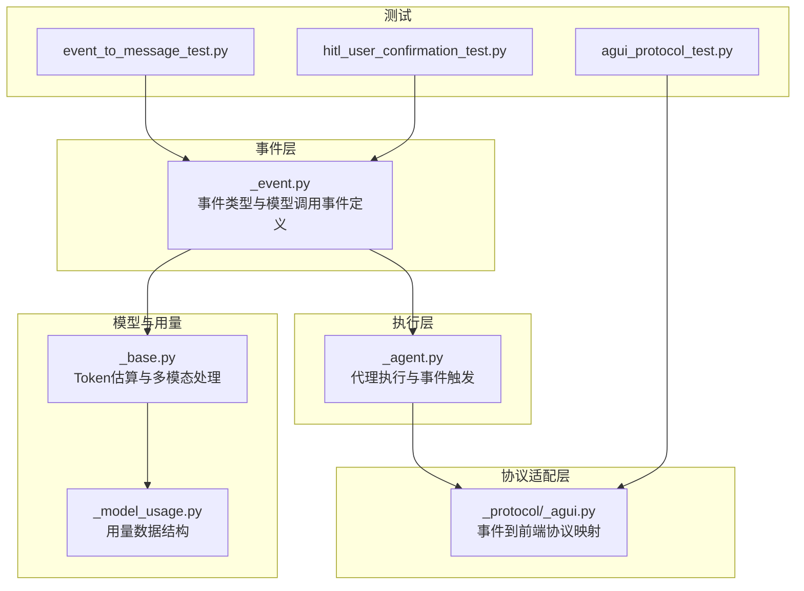
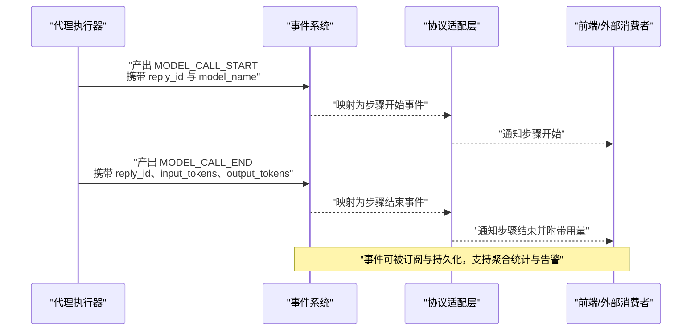
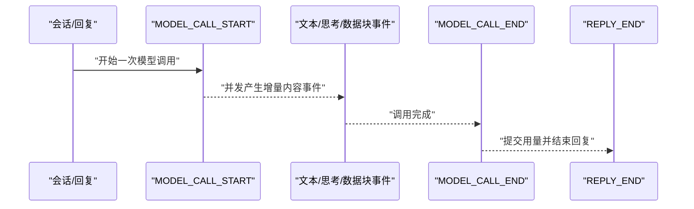
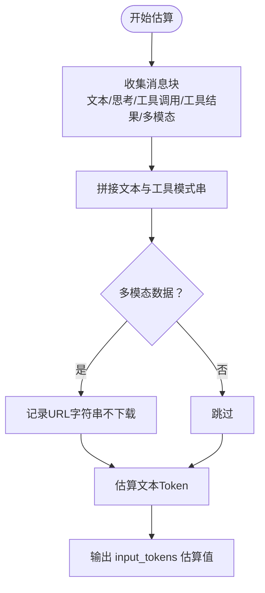
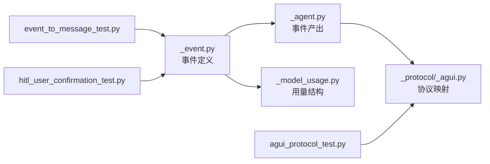

# 模型调用事件

<cite>
**本文引用的文件**
- [src/agentscope/event/_event.py](file://src/agentscope/event/_event.py)
- [src/agentscope/agent/_agent.py](file://src/agentscope/agent/_agent.py)
- [src/agentscope/app/_middleware/_protocol/_agui.py](file://src/agentscope/app/_middleware/_protocol/_agui.py)
- [src/agentscope/model/_base.py](file://src/agentscope/model/_base.py)
- [src/agentscope/model/_model_usage.py](file://src/agentscope/model/_model_usage.py)
- [tests/event_to_message_test.py](file://tests/event_to_message_test.py)
- [tests/hitl_user_confirmation_test.py](file://tests/hitl_user_confirmation_test.py)
- [tests/agui_protocol_test.py](file://tests/agui_protocol_test.py)
</cite>

## 目录
1. [简介](#简介)
2. [项目结构](#项目结构)
3. [核心组件](#核心组件)
4. [架构总览](#架构总览)
5. [详细组件分析](#详细组件分析)
6. [依赖关系分析](#依赖关系分析)
7. [性能考量](#性能考量)
8. [故障排查指南](#故障排查指南)
9. [结论](#结论)
10. [附录](#附录)

## 简介
本文件围绕 AgentScope 的“模型调用事件”体系，系统性梳理并解释 ModelCallStartEvent 与 ModelCallEndEvent 的设计原理与使用方式，覆盖以下主题：
- 事件设计目标：以标准化事件形式记录模型调用的生命周期与用量信息，便于可观测性、订阅与性能优化。
- 关键属性解析：模型名称识别、回复 ID 关联、输入/输出 Token 统计等。
- 生命周期管理：从开始到结束的完整流程与事件时序。
- Token 消耗统计：输入 Token 与输出 Token 的计算方式与累计策略。
- 订阅示例与性能监控：如何通过事件数据进行订阅与优化。

## 项目结构
与模型调用事件相关的核心位置如下：
- 事件定义与类型枚举：src/agentscope/event/_event.py
- 事件在代理执行中的触发点：src/agentscope/agent/_agent.py
- 事件到前端协议的映射（如 AGUI）：src/agentscope/app/_middleware/_protocol/_agui.py
- Token 统计与用量模型：src/agentscope/model/_base.py、src/agentscope/model/_model_usage.py
- 测试用例与行为验证：tests/event_to_message_test.py、tests/hitl_user_confirmation_test.py、tests/agui_protocol_test.py

图表来源
- [src/agentscope/event/_event.py:90-112](file://src/agentscope/event/_event.py#L90-L112)
- [src/agentscope/agent/_agent.py:763-822](file://src/agentscope/agent/_agent.py#L763-L822)
- [src/agentscope/app/_middleware/_protocol/_agui.py:113-118](file://src/agentscope/app/_middleware/_protocol/_agui.py#L113-L118)
- [src/agentscope/model/_base.py:299-367](file://src/agentscope/model/_base.py#L299-L367)
- [src/agentscope/model/_model_usage.py:9-32](file://src/agentscope/model/_model_usage.py#L9-L32)
- [tests/event_to_message_test.py:677-709](file://tests/event_to_message_test.py#L677-L709)
- [tests/hitl_user_confirmation_test.py:1250-1259](file://tests/hitl_user_confirmation_test.py#L1250-L1259)
- [tests/agui_protocol_test.py:95-106](file://tests/agui_protocol_test.py#L95-L106)

章节来源
- [src/agentscope/event/_event.py:90-112](file://src/agentscope/event/_event.py#L90-L112)
- [src/agentscope/agent/_agent.py:763-822](file://src/agentscope/agent/_agent.py#L763-L822)
- [src/agentscope/app/_middleware/_protocol/_agui.py:113-118](file://src/agentscope/app/_middleware/_protocol/_agui.py#L113-L118)
- [src/agentscope/model/_base.py:299-367](file://src/agentscope/model/_base.py#L299-L367)
- [src/agentscope/model/_model_usage.py:9-32](file://src/agentscope/model/_model_usage.py#L9-L32)
- [tests/event_to_message_test.py:677-709](file://tests/event_to_message_test.py#L677-L709)
- [tests/hitl_user_confirmation_test.py:1250-1259](file://tests/hitl_user_confirmation_test.py#L1250-L1259)
- [tests/agui_protocol_test.py:95-106](file://tests/agui_protocol_test.py#L95-L106)

## 核心组件
- 事件类型与基类
  - 事件基类 EventBase 提供唯一标识与时间戳字段，确保所有事件具备一致的元数据。
  - 事件类型枚举 EventType 定义了模型调用事件的两类：MODEL_CALL_START 与 MODEL_CALL_END。
- 模型调用事件
  - ModelCallStartEvent：包含 reply_id 与 model_name，用于标识所属回复与被调用的模型。
  - ModelCallEndEvent：包含 reply_id、input_tokens、output_tokens，用于记录本次调用的用量。
- 用量数据结构
  - ChatUsage：封装 input_tokens、output_tokens、time、缓存相关用量与元数据，作为统一的用量载体。

章节来源
- [src/agentscope/event/_event.py:53-62](file://src/agentscope/event/_event.py#L53-L62)
- [src/agentscope/event/_event.py:14-52](file://src/agentscope/event/_event.py#L14-L52)
- [src/agentscope/event/_event.py:90-112](file://src/agentscope/event/_event.py#L90-L112)
- [src/agentscope/model/_model_usage.py:9-32](file://src/agentscope/model/_model_usage.py#L9-L32)

## 架构总览
模型调用事件贯穿“生成执行—事件产出—协议映射—可观测”的闭环：

图表来源
- [src/agentscope/agent/_agent.py:763-822](file://src/agentscope/agent/_agent.py#L763-L822)
- [src/agentscope/app/_middleware/_protocol/_agui.py:113-118](file://src/agentscope/app/_middleware/_protocol/_agui.py#L113-L118)
- [tests/agui_protocol_test.py:95-106](file://tests/agui_protocol_test.py#L95-L106)

## 详细组件分析

### ModelCallStartEvent 设计与用途
- 属性与语义
  - reply_id：将模型调用与特定回复关联，便于跨块流式内容与工具调用的归并。
  - model_name：明确当前调用的模型名称，便于按模型维度做统计与成本归集。
- 触发时机
  - 在代理执行模型调用前发出，作为一次调用生命周期的起点。
- 前端映射
  - 协议适配层将其映射为“步骤开始”，并缓存最近一次模型名，便于后续步骤命名与追踪。

章节来源
- [src/agentscope/event/_event.py:90-99](file://src/agentscope/event/_event.py#L90-L99)
- [src/agentscope/agent/_agent.py:763-763](file://src/agentscope/agent/_agent.py#L763-L763)
- [src/agentscope/app/_middleware/_protocol/_agui.py:113-115](file://src/agentscope/app/_middleware/_protocol/_agui.py#L113-L115)
- [tests/hitl_user_confirmation_test.py:1250-1250](file://tests/hitl_user_confirmation_test.py#L1250-L1250)

### ModelCallEndEvent 设计与用途
- 属性与语义
  - reply_id：与开始事件保持一致，确保调用对的完整性。
  - input_tokens、output_tokens：记录本次调用的输入与输出 Token 数量，支持累计与聚合。
- 触发时机
  - 在模型调用完成后发出，作为一次调用生命周期的终点。
- 行为验证
  - 测试用例展示了首次调用初始化用量、二次调用累计用量，并在回复结束时汇总最终用量的行为。

章节来源
- [src/agentscope/event/_event.py:101-112](file://src/agentscope/event/_event.py#L101-L112)
- [src/agentscope/agent/_agent.py:822-822](file://src/agentscope/agent/_agent.py#L822-L822)
- [tests/event_to_message_test.py:677-709](file://tests/event_to_message_test.py#L677-L709)

### 事件生命周期管理
- 典型顺序
  - REPLY_START → MODEL_CALL_START → 文本/思考/数据块流式事件（可并发）→ MODEL_CALL_END → REPLY_END
- 并发特性
  - 文本块、思考块、工具调用等事件可能与模型调用事件并发发生，但均共享同一 reply_id。
- 结束与汇总
  - MODEL_CALL_END 负责用量上报；REPLY_END 负责最终完成时间与整体用量汇总。

图表来源
- [tests/event_to_message_test.py:714-720](file://tests/event_to_message_test.py#L714-L720)
- [tests/event_to_message_test.py:677-709](file://tests/event_to_message_test.py#L677-L709)

章节来源
- [tests/event_to_message_test.py:714-720](file://tests/event_to_message_test.py#L714-L720)
- [tests/event_to_message_test.py:677-709](file://tests/event_to_message_test.py#L677-L709)

### Token 消耗统计机制
- 输入 Token（input_tokens）
  - 由模型基类的估算方法综合文本块、工具 JSON 模式串与多模态 URL 字段估算。
  - 多模态数据（Base64）按字节长度近似换算，避免下载大体积资源带来的阻塞。
- 输出 Token（output_tokens）
  - 由具体模型调用返回的用量信息填充；测试用例展示了多次调用的累加逻辑。
- 用量聚合
  - ChatUsage 提供统一的数据结构，便于在上层进行统计与可视化。

图表来源
- [src/agentscope/model/_base.py:299-367](file://src/agentscope/model/_base.py#L299-L367)
- [tests/event_to_message_test.py:677-695](file://tests/event_to_message_test.py#L677-L695)

章节来源
- [src/agentscope/model/_base.py:299-367](file://src/agentscope/model/_base.py#L299-L367)
- [src/agentscope/model/_model_usage.py:9-32](file://src/agentscope/model/_model_usage.py#L9-L32)
- [tests/event_to_message_test.py:677-695](file://tests/event_to_message_test.py#L677-L695)

### 事件订阅示例与性能监控应用
- 订阅示例
  - 在前端或外部服务中监听 AGUI 的步骤开始/结束事件，结合 model_name 与用量数据进行展示与告警。
  - 示例参考：AGUI 协议测试中对 MODEL_CALL_START/END 的映射与断言。
- 性能监控场景
  - 按模型维度统计平均响应时间与 Token 使用量，识别高成本调用。
  - 对并发工具调用与模型调用的组合进行时序分析，定位瓶颈。
  - 将 input_tokens 与 output_tokens 与业务指标（如成本、SLA）联动，实现自动化告警。

章节来源
- [tests/agui_protocol_test.py:95-106](file://tests/agui_protocol_test.py#L95-L106)
- [src/agentscope/app/_middleware/_protocol/_agui.py:113-118](file://src/agentscope/app/_middleware/_protocol/_agui.py#L113-L118)

## 依赖关系分析
- 事件定义与使用
  - 事件定义位于 event/_event.py，被 agent/_agent.py 在执行路径中产出。
  - app/_middleware/_protocol/_agui.py 将模型调用事件映射为前端协议事件。
- 数据结构依赖
  - 模型调用事件依赖 ChatUsage 进行用量承载，二者共同构成用量统计的基础。
- 测试驱动的行为验证
  - event_to_message_test.py 验证了多次调用的用量累加与最终汇总。
  - hitl_user_confirmation_test.py 验证了模型调用事件与用户确认流程的协同。

图表来源
- [src/agentscope/event/_event.py:90-112](file://src/agentscope/event/_event.py#L90-L112)
- [src/agentscope/agent/_agent.py:763-822](file://src/agentscope/agent/_agent.py#L763-L822)
- [src/agentscope/app/_middleware/_protocol/_agui.py:113-118](file://src/agentscope/app/_middleware/_protocol/_agui.py#L113-L118)
- [src/agentscope/model/_model_usage.py:9-32](file://src/agentscope/model/_model_usage.py#L9-L32)
- [tests/event_to_message_test.py:677-709](file://tests/event_to_message_test.py#L677-L709)
- [tests/hitl_user_confirmation_test.py:1250-1259](file://tests/hitl_user_confirmation_test.py#L1250-L1259)
- [tests/agui_protocol_test.py:95-106](file://tests/agui_protocol_test.py#L95-L106)

章节来源
- [src/agentscope/event/_event.py:90-112](file://src/agentscope/event/_event.py#L90-L112)
- [src/agentscope/agent/_agent.py:763-822](file://src/agentscope/agent/_agent.py#L763-L822)
- [src/agentscope/app/_middleware/_protocol/_agui.py:113-118](file://src/agentscope/app/_middleware/_protocol/_agui.py#L113-L118)
- [src/agentscope/model/_model_usage.py:9-32](file://src/agentscope/model/_model_usage.py#L9-L32)
- [tests/event_to_message_test.py:677-709](file://tests/event_to_message_test.py#L677-L709)
- [tests/hitl_user_confirmation_test.py:1250-1259](file://tests/hitl_user_confirmation_test.py#L1250-L1259)
- [tests/agui_protocol_test.py:95-106](file://tests/agui_protocol_test.py#L95-L106)

## 性能考量
- Token 估算策略
  - 文本与工具模式串统一估算，多模态 Base64 按字节近似换算，避免下载资源导致的阻塞。
- 用量累计与一致性
  - 支持多次模型调用的用量累加，最终在回复结束时汇总，保证统计口径一致。
- 前端映射与可观测性
  - 将模型调用事件映射为步骤事件，便于前端实时展示与交互反馈。

## 故障排查指南
- 常见问题
  - 用量未更新：检查是否在模型调用结束后正确发出 MODEL_CALL_END，并传入 input_tokens 与 output_tokens。
  - 事件缺失：确认代理执行路径中已产出 MODEL_CALL_START/END，且未被过滤或丢弃。
  - 前端无显示：检查协议适配层是否正确映射 MODEL_CALL_START/END 到前端协议事件。
- 参考测试
  - 使用 event_to_message_test.py 中的多次调用累加与汇总断言，快速定位问题。
  - 使用 agui_protocol_test.py 验证事件映射是否符合预期。

章节来源
- [tests/event_to_message_test.py:677-709](file://tests/event_to_message_test.py#L677-L709)
- [tests/agui_protocol_test.py:95-106](file://tests/agui_protocol_test.py#L95-L106)

## 结论
模型调用事件体系通过标准化的 MODEL_CALL_START/END 事件，实现了对模型调用生命周期与用量的可观测与可订阅。配合 ChatUsage 的统一用量结构与 AGUI 的协议映射，可在前端与后端形成完整的监控闭环。通过测试用例的行为验证，可以确保在多调用场景下的用量统计准确可靠，并为性能优化与成本控制提供数据基础。

## 附录
- 关键属性速查
  - ModelCallStartEvent：reply_id、model_name
  - ModelCallEndEvent：reply_id、input_tokens、output_tokens
- 相关实现路径
  - 事件定义：[src/agentscope/event/_event.py:90-112](file://src/agentscope/event/_event.py#L90-L112)
  - 事件产出：[src/agentscope/agent/_agent.py:763-822](file://src/agentscope/agent/_agent.py#L763-L822)
  - 协议映射：[src/agentscope/app/_middleware/_protocol/_agui.py:113-118](file://src/agentscope/app/_middleware/_protocol/_agui.py#L113-L118)
  - Token 估算：[src/agentscope/model/_base.py:299-367](file://src/agentscope/model/_base.py#L299-L367)
  - 用量结构：[src/agentscope/model/_model_usage.py:9-32](file://src/agentscope/model/_model_usage.py#L9-L32)
- 行为验证参考
  - 多次调用累加与汇总：[tests/event_to_message_test.py:677-709](file://tests/event_to_message_test.py#L677-L709)
  - 用户确认流程中的模型调用事件：[tests/hitl_user_confirmation_test.py:1250-1259](file://tests/hitl_user_confirmation_test.py#L1250-L1259)
  - 事件映射测试：[tests/agui_protocol_test.py:95-106](file://tests/agui_protocol_test.py#L95-L106)