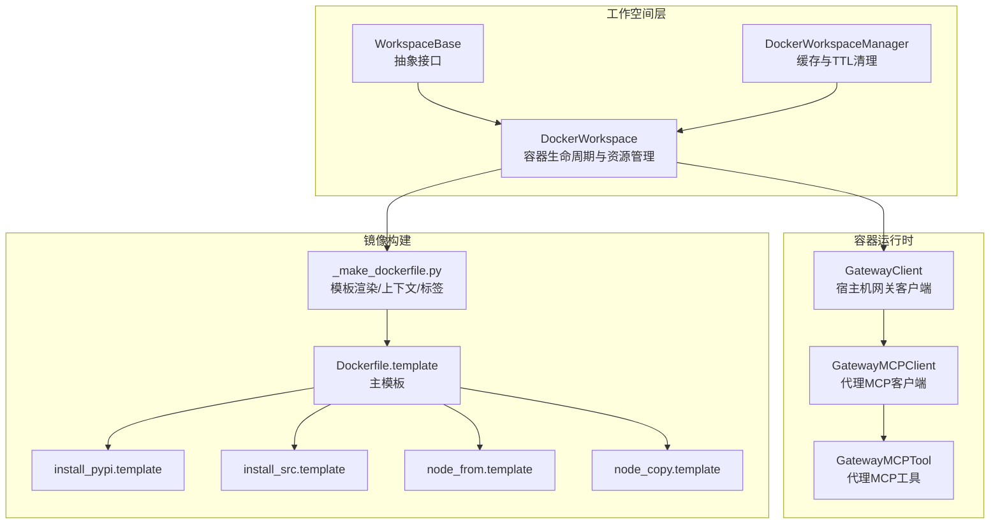
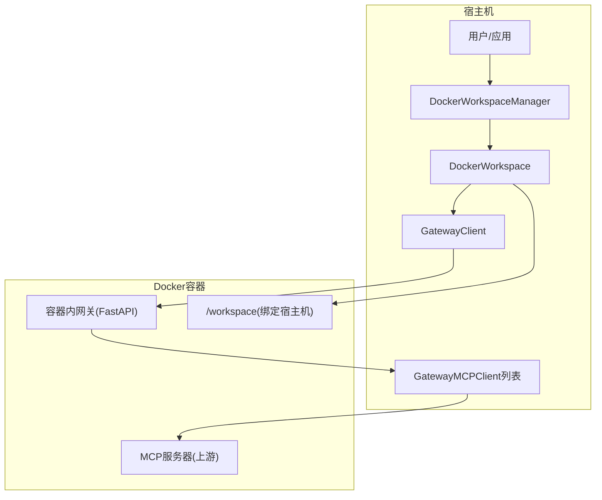
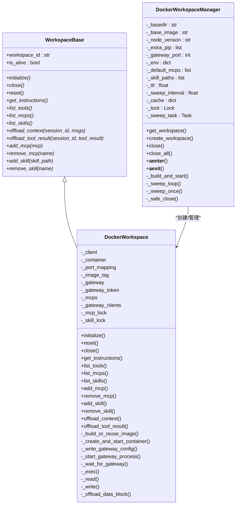
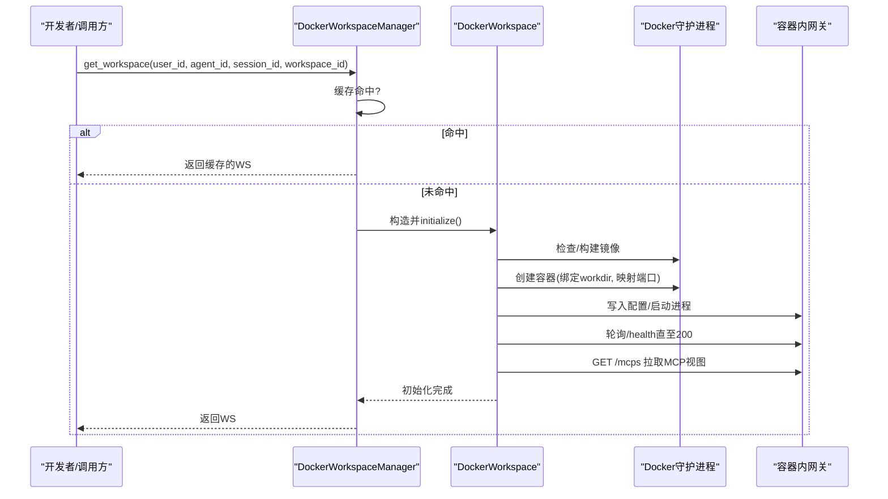
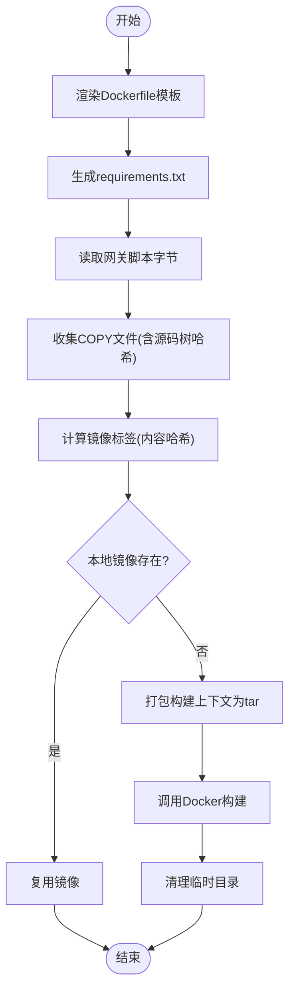
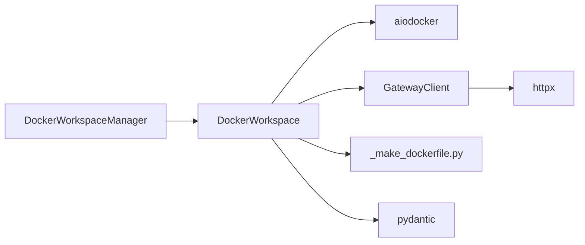

# Docker工作空间

<cite>
**本文档引用的文件**
- [Docker工作空间实现](file://src/agentscope/workspace/_docker/_docker_workspace.py)
- [Docker工作空间管理器](file://src/agentscope/app/_manager/_docker_workspace_manager.py)
- [Docker工作空间基类](file://src/agentscope/workspace/_base.py)
- [网关客户端](file://src/agentscope/workspace/_gateway_client.py)
- [Dockerfile生成与构建上下文](file://src/agentscope/workspace/_docker/_make_dockerfile.py)
- [Dockerfile模板](file://src/agentscope/workspace/_docker/Dockerfile.template)
- [Dockerfile安装-PyPI模板](file://src/agentscope/workspace/_docker/Dockerfile.install_pypi.template)
- [Dockerfile安装-源码模板](file://src/agentscope/workspace/_docker/Dockerfile.install_src.template)
- [Dockerfile Node复制模板](file://src/agentscope/workspace/_docker/Dockerfile.node_copy.template)
- [Dockerfile Node来源模板](file://src/agentscope/workspace/_docker/Dockerfile.node_from.template)
- [Docker工作空间测试](file://tests/workspace_docker_test.py)
</cite>

## 目录
1. [简介](#简介)
2. [项目结构](#项目结构)
3. [核心组件](#核心组件)
4. [架构总览](#架构总览)
5. [详细组件分析](#详细组件分析)
6. [依赖关系分析](#依赖关系分析)
7. [性能考虑](#性能考虑)
8. [故障排除指南](#故障排除指南)
9. [结论](#结论)
10. [附录](#附录)

## 简介
本文件面向AgentScope的Docker工作空间实现，系统性阐述DockerWorkspace类如何通过Docker容器提供隔离的执行环境。内容涵盖容器生命周期管理、镜像构建与缓存、资源隔离机制、初始化流程、容器配置参数、网络设置、卷挂载策略、安全特性、资源限制与性能优化、Dockerfile模板使用与自定义镜像构建、容器编排配置、部署示例、故障排除指南以及生产环境最佳实践（含容器监控与日志管理）。

## 项目结构
Docker工作空间相关代码主要分布在以下模块中：
- 工作空间实现：DockerWorkspace类及其内部方法
- 工作空间管理器：DockerWorkspaceManager负责生命周期管理与缓存
- 基类接口：WorkspaceBase定义统一接口契约
- 网关客户端：GatewayClient/GatewayMCPClient实现宿主机与容器内网关的通信
- Dockerfile生成：_make_dockerfile.py负责模板渲染、上下文准备与镜像标签计算
- 模板文件：Dockerfile.template及若干子模板
- 测试用例：workspace_docker_test.py验证功能与行为

**图表来源**
- [Docker工作空间实现:127-384](file://src/agentscope/workspace/_docker/_docker_workspace.py#L127-L384)
- [Docker工作空间管理器:45-122](file://src/agentscope/app/_manager/_docker_workspace_manager.py#L45-L122)
- [网关客户端:450-597](file://src/agentscope/workspace/_gateway_client.py#L450-L597)
- [Docker工作空间基类:36-100](file://src/agentscope/workspace/_base.py#L36-L100)
- [Dockerfile生成与构建上下文:109-276](file://src/agentscope/workspace/_docker/_make_dockerfile.py#L109-L276)
- [Dockerfile模板:1-46](file://src/agentscope/workspace/_docker/Dockerfile.template#L1-L46)

**章节来源**
- [Docker工作空间实现:1-120](file://src/agentscope/workspace/_docker/_docker_workspace.py#L1-L120)
- [Docker工作空间管理器:1-60](file://src/agentscope/app/_manager/_docker_workspace_manager.py#L1-L60)
- [Docker工作空间基类:1-50](file://src/agentscope/workspace/_base.py#L1-L50)

## 核心组件
- DockerWorkspace：基于Docker容器的沙箱工作空间，提供隔离执行环境；支持持久化工作目录、MCP动态注册、技能管理、上下文与工具结果离线存储等。
- DockerWorkspaceManager：负责工作空间实例的创建、缓存、TTL清理与批量关闭；支持按用户/代理维度的隔离路径。
- WorkspaceBase：定义工作空间的生命周期与能力接口（initialize/close/reset、指令生成、工具/MCP/技能发现、离线数据写入等）。
- GatewayClient/GatewayMCPClient/GatewayMCPTool：在宿主机侧以HTTP方式代理容器内MCP网关，实现工具调用与权限控制。
- _make_dockerfile.py与模板：根据配置渲染Dockerfile、准备构建上下文、计算镜像标签，支持PyPI与源码两种安装模式。

**章节来源**
- [Docker工作空间实现:127-227](file://src/agentscope/workspace/_docker/_docker_workspace.py#L127-L227)
- [Docker工作空间管理器:45-122](file://src/agentscope/app/_manager/_docker_workspace_manager.py#L45-L122)
- [Docker工作空间基类:36-100](file://src/agentscope/workspace/_base.py#L36-L100)
- [网关客户端:450-597](file://src/agentscope/workspace/_gateway_client.py#L450-L597)
- [Dockerfile生成与构建上下文:109-276](file://src/agentscope/workspace/_docker/_make_dockerfile.py#L109-L276)

## 架构总览
Docker工作空间采用“宿主机-容器内网关-上游MCP服务器”的三层架构：
- 宿主机侧：DockerWorkspace负责镜像构建/容器启动/网关健康检查/动态MCP管理/技能上传等；DockerWorkspaceManager负责缓存与TTL清理。
- 容器内侧：FastAPI网关监听指定端口，承载MCP会话；容器工作目录映射到宿主机持久化目录。
- 上游侧：通过MCP协议连接外部服务（如文件系统、进程、HTTP API等），工具调用在容器内执行。

**图表来源**
- [Docker工作空间实现:230-293](file://src/agentscope/workspace/_docker/_docker_workspace.py#L230-L293)
- [网关客户端:450-597](file://src/agentscope/workspace/_gateway_client.py#L450-L597)
- [Docker工作空间管理器:136-163](file://src/agentscope/app/_manager/_docker_workspace_manager.py#L136-L163)

## 详细组件分析

### DockerWorkspace类
- 生命周期管理
  - initialize：镜像构建或复用、MCP恢复/种子、容器创建与启动、网关配置写入、网关健康检查、拉取网关侧MCP视图、持久化.MCP与技能种子。
  - reset：注销所有MCP、清空sessions/data/skills目录、重写.MCP为空。
  - close：停止容器、删除容器、释放客户端；Linux平台尝试修正宿主机文件所有权。
- 资源与工具发现
  - list_skills：通过容器内find查找SKILL.md并解析front matter。
  - list_mcps：返回GatewayMCPClient列表，每个对应一个已注册的MCP。
  - list_tools：始终为空（工具均由MCP提供）。
- 动态MCP管理
  - add_mcp/remove_mcp：注册/注销MCP，同步更新.MCP文件（当启用持久化）。
- 动态技能管理
  - add_skill/remove_skill：上传本地技能目录至容器skills/，支持冲突检测与删除。
- 离线数据
  - offload_context/offload_tool_result：将消息与工具结果序列化为JSONL/文本文件，大体积二进制数据转为URL并落盘，保持容器内路径一致性。
- 内部机制
  - _build_or_reuse_image：渲染模板、计算标签、检查本地镜像缓存、tar上下文并调用Docker构建。
  - _create_and_start_container：设置命令、暴露端口、绑定工作目录、添加标签、记录端口映射。
  - _write_gateway_config/_start_gateway_process/_wait_for_gateway：写入网关配置、启动进程、等待健康检查。
  - _exec/_read/_write/_offload_data_block：容器内命令执行、文件读写、数据块离线处理。

**图表来源**
- [Docker工作空间基类:36-204](file://src/agentscope/workspace/_base.py#L36-L204)
- [Docker工作空间实现:127-726](file://src/agentscope/workspace/_docker/_docker_workspace.py#L127-L726)
- [Docker工作空间管理器:45-372](file://src/agentscope/app/_manager/_docker_workspace_manager.py#L45-L372)

**章节来源**
- [Docker工作空间实现:230-384](file://src/agentscope/workspace/_docker/_docker_workspace.py#L230-L384)
- [Docker工作空间实现:466-626](file://src/agentscope/workspace/_docker/_docker_workspace.py#L466-L626)
- [Docker工作空间实现:621-726](file://src/agentscope/workspace/_docker/_docker_workspace.py#L621-L726)

### 初始化流程与容器配置
- 镜像构建与缓存
  - 渲染Dockerfile模板，计算镜像标签（内容哈希：Dockerfile+COPY文件），检查本地是否存在命中；未命中则打包上下文并构建。
  - 支持两种安装模式：PyPI版本安装与源码安装（开发模式），避免引入重型依赖。
- 容器创建与启动
  - CMD设置为sleep infinity，确保容器在网关重启后仍保持运行。
  - 暴露网关端口（默认5600），随机映射到宿主机127.0.0.1端口，仅本机可访问。
  - 可选bind mount宿主机工作目录到容器/workspace，实现持久化。
  - 添加标签用于后续发现与管理。
- 网关配置与健康检查
  - 在容器内写入网关配置文件（包含bearer token），启动网关进程并通过/health端点轮询直到可用。
  - 拉取网关侧MCP视图，转换为GatewayMCPClient实例，建立代理调用链。
- MCP与技能
  - 从.MCP文件恢复或使用默认种子；持久化.MCP与技能目录（当启用workdir）。

**图表来源**
- [Docker工作空间管理器:167-226](file://src/agentscope/app/_manager/_docker_workspace_manager.py#L167-L226)
- [Docker工作空间实现:230-293](file://src/agentscope/workspace/_docker/_docker_workspace.py#L230-L293)
- [网关客户端:515-547](file://src/agentscope/workspace/_gateway_client.py#L515-L547)

**章节来源**
- [Docker工作空间实现:728-806](file://src/agentscope/workspace/_docker/_docker_workspace.py#L728-L806)
- [Docker工作空间实现:809-860](file://src/agentscope/workspace/_docker/_docker_workspace.py#L809-L860)
- [Docker工作空间实现:271-280](file://src/agentscope/workspace/_docker/_docker_workspace.py#L271-L280)

### Dockerfile模板与镜像构建
- 模板结构
  - 主模板：设置基础镜像、安装uv、创建虚拟环境、安装requirements.txt、安装agentscope（PyPI或源码）、拷贝网关脚本、设置工作目录。
  - 子模板：Node.js来源与复制、PyPI安装、源码安装。
- 构建上下文
  - 渲染Dockerfile文本、生成requirements.txt、读取网关脚本字节、收集需要COPY的文件（requirements、网关脚本、源码树）。
  - 计算镜像标签：对Dockerfile与所有COPY文件内容进行哈希，形成稳定标签，避免重复构建。
- 安装模式
  - 发布版：从PyPI安装agentscope指定版本，仅安装轻量依赖。
  - 开发版：复制源码树到镜像并在虚拟环境中安装，跳过完整依赖树以避免重型C/Rust依赖。

**图表来源**
- [Dockerfile生成与构建上下文:110-276](file://src/agentscope/workspace/_docker/_make_dockerfile.py#L110-L276)
- [Docker工作空间实现:728-806](file://src/agentscope/workspace/_docker/_docker_workspace.py#L728-L806)

**章节来源**
- [Dockerfile生成与构建上下文:109-276](file://src/agentscope/workspace/_docker/_make_dockerfile.py#L109-L276)
- [Dockerfile模板:1-46](file://src/agentscope/workspace/_docker/Dockerfile.template#L1-L46)
- [Dockerfile安装-PyPI模板:1-6](file://src/agentscope/workspace/_docker/Dockerfile.install_pypi.template#L1-L6)
- [Dockerfile安装-源码模板:1-13](file://src/agentscope/workspace/_docker/Dockerfile.install_src.template#L1-L13)

### 网络与卷挂载策略
- 网络
  - 容器内网关端口（默认5600）通过Docker端口映射暴露到宿主机，绑定到127.0.0.1，仅本机可达，提升安全性。
  - GatewayClient通过宿主机可见URL与网关通信，携带bearer token。
- 卷挂载
  - 可选将宿主机工作目录绑定到容器/workspace，实现跨容器重启的数据持久化。
  - 关闭时在Linux平台尝试修正宿主机文件所有权，避免非root用户无法删除的问题。

**章节来源**
- [Docker工作空间实现:809-860](file://src/agentscope/workspace/_docker/_docker_workspace.py#L809-L860)
- [Docker工作空间实现:358-375](file://src/agentscope/workspace/_docker/_docker_workspace.py#L358-L375)
- [网关客户端:450-597](file://src/agentscope/workspace/_gateway_client.py#L450-L597)

### 安全特性与资源限制
- 安全
  - 网关使用bearer token进行认证，token在每次initialize时重新生成并注入容器，不持久化。
  - 端口仅映射到127.0.0.1，降低外网暴露风险。
  - 关闭时Linux平台修正宿主机文件所有权，减少权限问题。
- 资源限制
  - 当前实现未显式设置CPU/内存限制；可通过Docker运行时参数在部署层面补充（建议在生产环境配置）。
  - 使用uv虚拟环境隔离Python依赖，避免系统污染。

**章节来源**
- [Docker工作空间实现:267-267](file://src/agentscope/workspace/_docker/_docker_workspace.py#L267-L267)
- [Docker工作空间实现:809-860](file://src/agentscope/workspace/_docker/_docker_workspace.py#L809-L860)
- [Docker工作空间实现:358-375](file://src/agentscope/workspace/_docker/_docker_workspace.py#L358-L375)

### 性能优化
- 镜像构建缓存
  - 基于内容哈希的镜像标签，避免重复构建；即使使用传统构建端点，仍可利用uv缓存提升单次构建效率。
- 连接池
  - GatewayClient共享httpx.AsyncClient，复用TCP连接与TLS握手，降低工具调用开销。
- 并发与清理
  - DockerWorkspaceManager在关闭时并行关闭多个容器，缩短停机时间。
  - TTL清理后台任务定期回收闲置工作空间，降低资源占用。

**章节来源**
- [Docker工作空间实现:788-806](file://src/agentscope/workspace/_docker/_docker_workspace.py#L788-L806)
- [网关客户端:500-508](file://src/agentscope/workspace/_gateway_client.py#L500-L508)
- [Docker工作空间管理器:289-304](file://src/agentscope/app/_manager/_docker_workspace_manager.py#L289-L304)
- [Docker工作空间管理器:327-361](file://src/agentscope/app/_manager/_docker_workspace_manager.py#L327-L361)

## 依赖关系分析
- 组件耦合
  - DockerWorkspace依赖aiodocker进行容器操作，依赖GatewayClient进行网关通信。
  - DockerWorkspaceManager聚合DockerWorkspace，负责缓存与生命周期管理。
  - _make_dockerfile.py独立于具体运行时，仅负责模板渲染与标签计算。
- 外部依赖
  - Docker守护进程（aiodocker）
  - httpx（异步HTTP客户端）
  - pydantic（模型序列化/校验）

**图表来源**
- [Docker工作空间实现:259-261](file://src/agentscope/workspace/_docker/_docker_workspace.py#L259-L261)
- [网关客户端:27-29](file://src/agentscope/workspace/_gateway_client.py#L27-L29)
- [Docker工作空间管理器:35-40](file://src/agentscope/app/_manager/_docker_workspace_manager.py#L35-L40)

**章节来源**
- [Docker工作空间实现:259-261](file://src/agentscope/workspace/_docker/_docker_workspace.py#L259-L261)
- [网关客户端:27-29](file://src/agentscope/workspace/_gateway_client.py#L27-L29)
- [Docker工作空间管理器:35-40](file://src/agentscope/app/_manager/_docker_workspace_manager.py#L35-L40)

## 性能考虑
- 镜像构建
  - 利用内容哈希标签避免重复构建；在CI/CD中缓存Docker层可显著加速。
- 运行时
  - 启用连接池减少HTTP开销；合理设置工具超时与网关超时。
  - 对大量工具调用场景，考虑批量化或并发控制。
- 资源
  - 生产环境建议在Docker运行时设置CPU/内存限制，防止资源争用。
  - 使用只读工作目录策略（如可行）进一步增强隔离性。

[本节为通用指导，无需特定文件引用]

## 故障排除指南
- Docker守护进程不可达
  - 现象：测试用例跳过或初始化失败。
  - 排查：确认docker命令可用且docker info返回成功。
- 镜像构建失败
  - 现象：构建流中出现错误，堆栈包含最后N行日志。
  - 排查：查看构建日志定位具体RUN步骤错误；检查模板渲染与上下文文件完整性。
- 网关健康检查超时
  - 现象：initialize等待/health超时。
  - 排查：检查容器端口映射、防火墙、网关启动日志；确认bearer token正确注入。
- 权限问题（Linux）
  - 现象：容器内root写入导致宿主机文件属主为root，非root用户无法删除。
  - 处理：关闭时尝试chown修正属主；或以root运行宿主机进程。
- MCP工具调用失败
  - 现象：工具返回错误状态。
  - 排查：检查GatewayMCPTool的4xx/5xx响应详情；确认上游MCP可用性与权限策略。

**章节来源**
- [Docker工作空间实现:788-806](file://src/agentscope/workspace/_docker/_docker_workspace.py#L788-L806)
- [Docker工作空间实现:358-375](file://src/agentscope/workspace/_docker/_docker_workspace.py#L358-L375)
- [网关客户端:162-181](file://src/agentscope/workspace/_gateway_client.py#L162-L181)
- [Docker工作空间测试:65-86](file://tests/workspace_docker_test.py#L65-L86)

## 结论
Docker工作空间通过容器提供强隔离的执行环境，结合FastAPI网关与MCP协议实现工具调用的透明代理。其设计强调：
- 可重复的镜像构建与缓存
- 可观测的容器生命周期与健康检查
- 可扩展的MCP与技能生态
- 可靠的持久化与权限控制
在生产环境中建议配合资源限制、监控与日志管理策略，以获得更稳健的运行表现。

[本节为总结，无需特定文件引用]

## 附录

### 部署示例（概念性）
- 本地开发
  - 确保Docker可用，运行DockerWorkspaceManager，通过get_workspace获取工作空间。
- 生产部署
  - 使用容器编排（如Kubernetes）管理DockerWorkspaceManager与工作空间容器。
  - 为容器设置资源限制、健康探针与日志采集。
  - 将workdir挂载到持久化存储，确保跨节点迁移与高可用。

[本节为概念性说明，无需特定文件引用]

### 监控与日志管理（建议）
- 容器监控
  - CPU/内存/磁盘使用率、容器重启次数、端口占用情况。
- 网关日志
  - 容器内网关日志输出到标准输出，结合宿主机日志收集系统集中管理。
- 业务指标
  - 工具调用成功率、平均耗时、MCP连接数、技能加载耗时。

[本节为通用指导，无需特定文件引用]