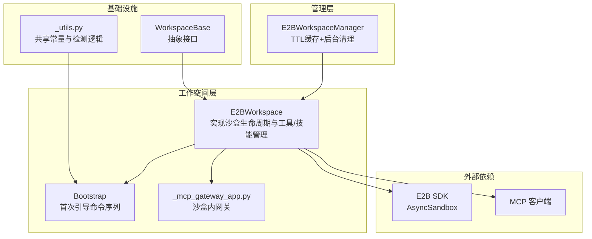
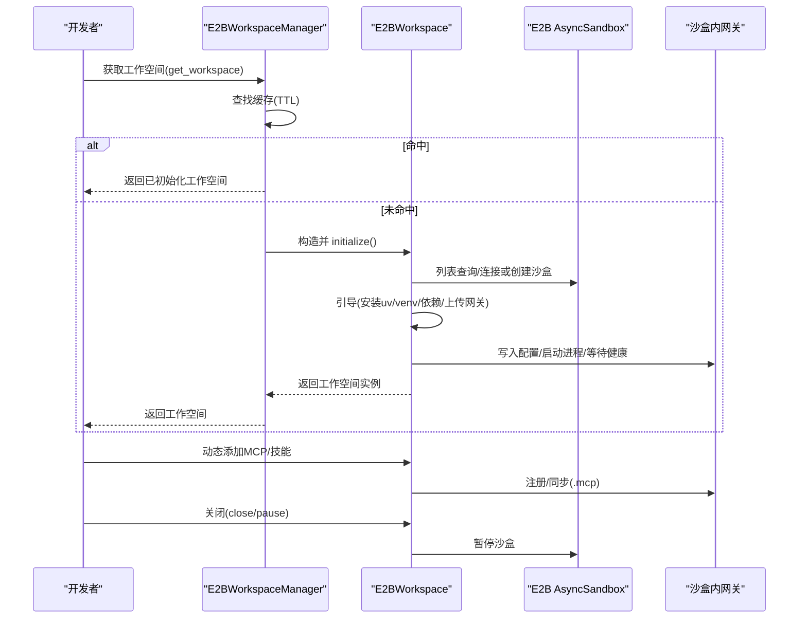
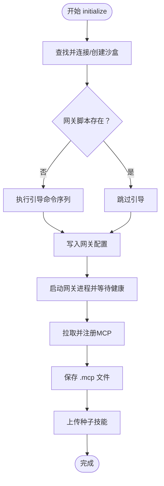
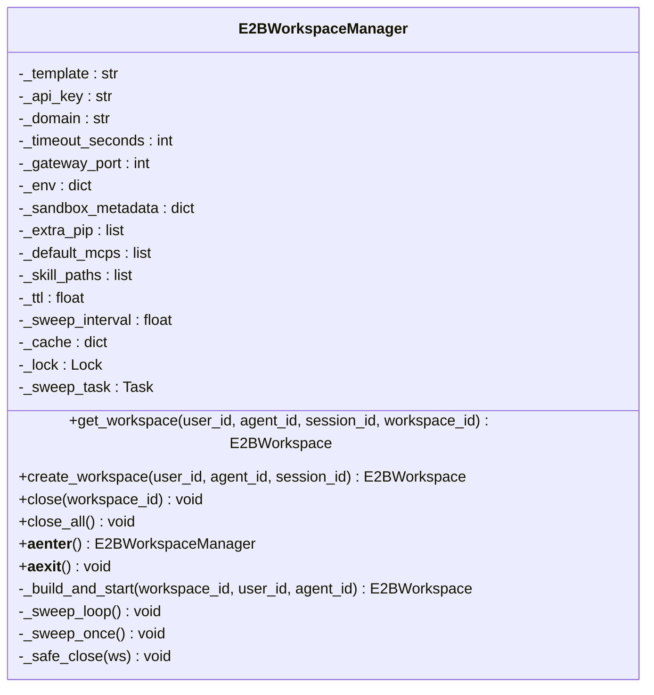
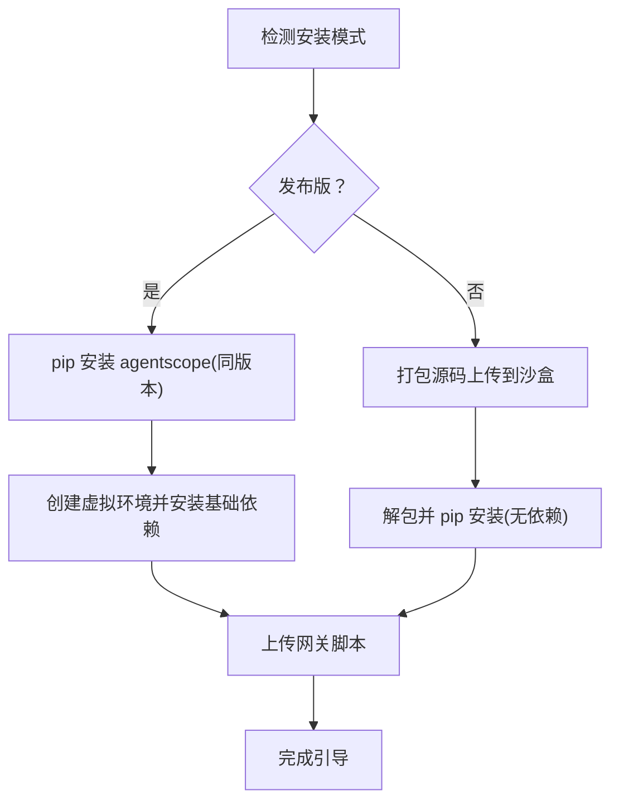
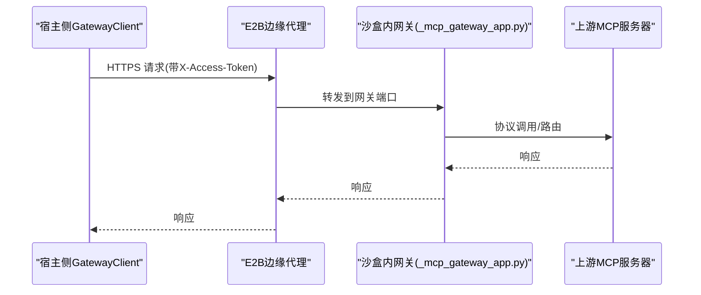
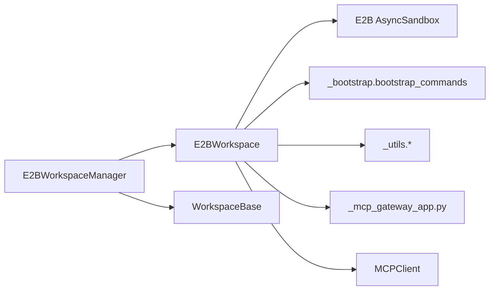

# E2B云沙盒工作空间

<cite>
**本文档引用的文件**
- [workspace/_e2b/_e2b_workspace.py](file://src/agentscope/workspace/_e2b/_e2b_workspace.py)
- [workspace/_e2b/_bootstrap.py](file://src/agentscope/workspace/_e2b/_bootstrap.py)
- [app/_manager/_e2b_workspace_manager.py](file://src/agentscope/app/_manager/_e2b_workspace_manager.py)
- [workspace/_base.py](file://src/agentscope/workspace/_base.py)
- [workspace/_utils.py](file://src/agentscope/workspace/_utils.py)
- [workspace/_mcp_gateway/_mcp_gateway_app.py](file://src/agentscope/workspace/_mcp_gateway/_mcp_gateway_app.py)
- [tests/workspace_e2b_test.py](file://tests/workspace_e2b_test.py)
</cite>

## 目录
1. [简介](#简介)
2. [项目结构](#项目结构)
3. [核心组件](#核心组件)
4. [架构总览](#架构总览)
5. [详细组件分析](#详细组件分析)
6. [依赖关系分析](#依赖关系分析)
7. [性能考量](#性能考量)
8. [故障排查指南](#故障排查指南)
9. [结论](#结论)
10. [附录](#附录)

## 简介
本文件系统性阐述 AgentScope 中基于 E2B 云平台的沙盒工作空间实现（E2BWorkspace）。文档重点覆盖以下方面：
- E2BWorkspace 如何利用 E2B 提供的云端沙盒执行环境，实现资源管理、自动扩缩容与分布式计算能力
- 初始化流程、云端连接配置、资源配额管理与成本控制策略
- 沙盒安全隔离机制、网络访问控制与数据安全保障
- 扩展性、性能优势与适用场景
- 配置示例、API 密钥管理、故障恢复与监控告警设置，以及云端资源优化与成本控制建议

## 项目结构
E2B 工作空间由三层组成：抽象基类定义统一接口，具体实现负责与 E2B SDK 交互，管理器负责生命周期与缓存调度。

**图表来源**
- [workspace/_e2b/_e2b_workspace.py:143-391](file://src/agentscope/workspace/_e2b/_e2b_workspace.py#L143-L391)
- [workspace/_e2b/_bootstrap.py:42-195](file://src/agentscope/workspace/_e2b/_bootstrap.py#L42-L195)
- [app/_manager/_e2b_workspace_manager.py:52-388](file://src/agentscope/app/_manager/_e2b_workspace_manager.py#L52-L388)
- [workspace/_base.py:36-204](file://src/agentscope/workspace/_base.py#L36-L204)
- [workspace/_utils.py:20-164](file://src/agentscope/workspace/_utils.py#L20-L164)

**章节来源**
- [workspace/_e2b/_e2b_workspace.py:1-114](file://src/agentscope/workspace/_e2b/_e2b_workspace.py#L1-L114)
- [workspace/_base.py:1-50](file://src/agentscope/workspace/_base.py#L1-L50)

## 核心组件
- E2BWorkspace：面向 E2B 的工作空间实现，封装沙盒生命周期、MCP/技能管理、上下文离线存储等
- E2BWorkspaceManager：工作空间管理器，提供 TTL 缓存、后台清理、并发安全的获取/创建/关闭
- Bootstrap：首次引导时在沙盒内安装 uv、虚拟环境、依赖与网关脚本
- WorkspaceBase：统一的工作空间抽象接口
- _utils：跨后端共享的安装模式检测、忽略规则与网关脚本读取

关键职责与特性：
- 生命周期：initialize/connect/create → 运行网关 → 注册 MCP/技能 → close/pause 持久化状态
- 资源管理：通过沙盒元数据映射 workspace_id 与 sandbox_id，支持重连与自动恢复
- 自动扩缩容：管理器按 TTL 后台轮询清理空闲沙盒；E2B 平台侧按模板与超时策略进行资源回收
- 分布式计算：每个工作空间独立沙盒，天然隔离，便于横向扩展

**章节来源**
- [workspace/_e2b/_e2b_workspace.py:244-391](file://src/agentscope/workspace/_e2b/_e2b_workspace.py#L244-L391)
- [app/_manager/_e2b_workspace_manager.py:155-388](file://src/agentscope/app/_manager/_e2b_workspace_manager.py#L155-L388)
- [workspace/_e2b/_bootstrap.py:122-195](file://src/agentscope/workspace/_e2b/_bootstrap.py#L122-L195)

## 架构总览
E2B 工作空间采用“管理器 + 工作空间 + 沙盒”的分层设计。管理器负责缓存与生命周期调度，工作空间负责与 E2B SDK 交互、引导与服务发现，沙盒内运行网关与工具。

**图表来源**
- [app/_manager/_e2b_workspace_manager.py:187-250](file://src/agentscope/app/_manager/_e2b_workspace_manager.py#L187-L250)
- [workspace/_e2b/_e2b_workspace.py:244-328](file://src/agentscope/workspace/_e2b/_e2b_workspace.py#L244-L328)

## 详细组件分析

### E2BWorkspace 类
E2BWorkspace 实现了 WorkspaceBase 接口，提供与 E2B 云端沙盒交互的能力。其核心方法包括：
- initialize：重连或创建沙盒，执行引导，启动网关，注册 MCP/技能
- close/reset：暂停沙盒/释放资源或重置到空状态
- list_mcps/add_mcp/remove_mcp：动态管理 MCP
- list_skills/add_skill/remove_skill：动态管理技能
- offload_context/offload_tool_result：将对话与工具结果持久化到沙盒

初始化流程要点：
- 元数据重连：根据 workspace_id 查询并连接现有沙盒，自动恢复暂停状态
- 首次引导：若网关脚本缺失，则执行引导命令序列（创建目录、安装 uv、创建虚拟环境、安装依赖、安装 agentscope、上传网关脚本）
- 网关启动：生成临时令牌，写入配置，启动网关并等待健康检查
- MCP/技能同步：从 .mcp 文件恢复或使用默认种子，随后将本地技能上传至沙盒

**图表来源**
- [workspace/_e2b/_e2b_workspace.py:244-328](file://src/agentscope/workspace/_e2b/_e2b_workspace.py#L244-L328)
- [workspace/_e2b/_bootstrap.py:122-163](file://src/agentscope/workspace/_e2b/_bootstrap.py#L122-L163)

**章节来源**
- [workspace/_e2b/_e2b_workspace.py:143-391](file://src/agentscope/workspace/_e2b/_e2b_workspace.py#L143-L391)
- [workspace/_e2b/_bootstrap.py:122-195](file://src/agentscope/workspace/_e2b/_bootstrap.py#L122-L195)

### E2BWorkspaceManager 类
E2BWorkspaceManager 提供 TTL 缓存与后台清理任务，确保资源高效利用与成本可控：
- get_workspace：缓存命中则更新访问时间；未命中则构建并初始化新工作空间
- create_workspace：创建全新工作空间并跟踪
- close/close_all：单个或批量暂停沙盒，避免顺序阻塞
- 后台清扫：周期性扫描缓存，对超过 TTL 的空闲工作空间调用 close

**图表来源**
- [app/_manager/_e2b_workspace_manager.py:52-388](file://src/agentscope/app/_manager/_e2b_workspace_manager.py#L52-L388)

**章节来源**
- [app/_manager/_e2b_workspace_manager.py:52-388](file://src/agentscope/app/_manager/_e2b_workspace_manager.py#L52-L388)

### 引导与网关
- 引导命令序列：创建工作目录、安装 uv、创建虚拟环境、安装基础依赖、安装 agentscope、上传网关脚本
- 网关脚本：通过 importlib.resources 读取，部署到沙盒固定路径，以减少导入开销
- 安装模式：发布版（PyPI）与开发版（源码打包上传）两种模式，保证两端一致

**图表来源**
- [workspace/_e2b/_bootstrap.py:122-195](file://src/agentscope/workspace/_e2b/_bootstrap.py#L122-L195)
- [workspace/_utils.py:150-164](file://src/agentscope/workspace/_utils.py#L150-L164)

**章节来源**
- [workspace/_e2b/_bootstrap.py:1-195](file://src/agentscope/workspace/_e2b/_bootstrap.py#L1-L195)
- [workspace/_utils.py:20-164](file://src/agentscope/workspace/_utils.py#L20-L164)

### 网关应用（沙盒内）
网关应用作为沙盒内的 FastAPI 服务，承载 MCP 协议转发与工具调用路由，宿主侧通过 HTTPS 与 E2B 边缘代理通信，使用 X-Access-Token 头进行鉴权。

**图表来源**
- [workspace/_e2b/_e2b_workspace.py:306-317](file://src/agentscope/workspace/_e2b/_e2b_workspace.py#L306-L317)
- [workspace/_mcp_gateway/_mcp_gateway_app.py](file://src/agentscope/workspace/_mcp_gateway/_mcp_gateway_app.py)

**章节来源**
- [workspace/_e2b/_e2b_workspace.py:306-317](file://src/agentscope/workspace/_e2b/_e2b_workspace.py#L306-L317)

## 依赖关系分析
- E2BWorkspace 依赖 E2B SDK 的 AsyncSandbox 进行沙盒生命周期管理
- 引导阶段依赖 _utils 提供的安装模式检测与网关脚本读取
- 管理器依赖 WorkspaceBase 抽象，屏蔽不同后端差异
- 网关应用与 MCP 客户端配合，实现工具发现与调用

**图表来源**
- [workspace/_e2b/_e2b_workspace.py:64-95](file://src/agentscope/workspace/_e2b/_e2b_workspace.py#L64-L95)
- [workspace/_e2b/_bootstrap.py:34-39](file://src/agentscope/workspace/_e2b/_bootstrap.py#L34-L39)
- [workspace/_utils.py:150-164](file://src/agentscope/workspace/_utils.py#L150-L164)
- [app/_manager/_e2b_workspace_manager.py:41-47](file://src/agentscope/app/_manager/_e2b_workspace_manager.py#L41-L47)

**章节来源**
- [workspace/_e2b/_e2b_workspace.py:64-95](file://src/agentscope/workspace/_e2b/_e2b_workspace.py#L64-L95)
- [workspace/_e2b/_bootstrap.py:34-39](file://src/agentscope/workspace/_e2b/_bootstrap.py#L34-L39)
- [workspace/_utils.py:150-164](file://src/agentscope/workspace/_utils.py#L150-L164)
- [app/_manager/_e2b_workspace_manager.py:41-47](file://src/agentscope/app/_manager/_e2b_workspace_manager.py#L41-L47)

## 性能考量
- 启动延迟优化
  - 引导仅在首次或缺失网关脚本时执行，后续重连复用已安装环境
  - 等待沙盒环境就绪（is_running）避免早期网络错误导致的重试风暴
- 并发与吞吐
  - 管理器在关闭所有工作空间时使用并行 gather，降低应用退出停顿
  - 网关令牌每轮初始化重新生成，避免旧令牌干扰
- 成本控制
  - TTL 清扫减少闲置沙盒占用
  - 按需创建/连接，避免长期占用资源
  - 使用最小必要模板与基础依赖，缩短引导时间

[本节为通用性能讨论，不直接分析具体文件]

## 故障排查指南
常见问题与处理建议：
- 沙盒未就绪
  - 现象：initialize 抛出超时异常
  - 原因：沙盒内部环境尚未可路由
  - 处理：确认引导完成、网关健康检查通过；检查网络与代理头配置
- 引导失败
  - 现象：引导命令返回非零退出码
  - 原因：网络受限、权限不足、uv 安装失败
  - 处理：检查 API Key、域名、网络策略；确认沙盒模板具备 curl/uv 安装条件
- MCP 注册冲突
  - 现象：重复添加同名 MCP 抛出异常
  - 处理：先 remove_mcp，再 add_mcp
- 技能上传冲突
  - 现象：目标目录已存在抛出异常
  - 处理：更换技能名称或删除已有目录后重试
- 关闭失败
  - 现象：close/pause 抛出异常
  - 处理：管理器会吞掉异常确保幂等；可在日志中定位具体原因

**章节来源**
- [workspace/_e2b/_e2b_workspace.py:705-724](file://src/agentscope/workspace/_e2b/_e2b_workspace.py#L705-L724)
- [workspace/_e2b/_e2b_workspace.py:464-500](file://src/agentscope/workspace/_e2b/_e2b_workspace.py#L464-L500)
- [workspace/_e2b/_e2b_workspace.py:503-565](file://src/agentscope/workspace/_e2b/_e2b_workspace.py#L503-L565)
- [app/_manager/_e2b_workspace_manager.py:378-388](file://src/agentscope/app/_manager/_e2b_workspace_manager.py#L378-L388)

## 结论
E2B 云沙盒工作空间通过“管理器 + 工作空间 + 沙盒”的分层设计，实现了：
- 可靠的云端资源管理与自动扩缩容（TTL 清扫 + 沙盒暂停）
- 高效的分布式执行能力（多工作空间隔离）
- 安全的隔离与访问控制（代理头鉴权、最小权限）
- 易于扩展与维护的架构（抽象接口、一致的引导流程）

在成本控制与性能优化方面，结合 TTL 清扫、最小模板与基础依赖、并行关闭等策略，可在保障稳定性的同时显著降低资源占用与运行成本。

[本节为总结性内容，不直接分析具体文件]

## 附录

### 配置示例与最佳实践
- API 密钥管理
  - 优先通过构造参数传入；否则 SDK 将回退到环境变量 E2B_API_KEY
- 模板与超时
  - 默认模板为 base，适合首次引导；可根据需要调整 timeout_seconds 控制沙盒存活时间
- 环境变量与元数据
  - env 在创建时注入到沙盒；sandbox_metadata 用于在 E2B 仪表盘过滤
- 网关端口与额外依赖
  - gateway_port 为沙盒内网关监听端口；extra_pip 用于安装网关虚拟环境的附加包
- 指令与种子
  - instructions 用于定制系统提示；default_mcps/skill_paths 用于首次种子

**章节来源**
- [workspace/_e2b/_e2b_workspace.py:150-210](file://src/agentscope/workspace/_e2b/_e2b_workspace.py#L150-L210)
- [app/_manager/_e2b_workspace_manager.py:60-115](file://src/agentscope/app/_manager/_e2b_workspace_manager.py#L60-L115)

### 测试与验证
- 测试套件要求 E2B_API_KEY 环境变量存在，否则整套测试跳过
- 测试覆盖初始化、MCP 列举与工具可用性、关闭流程

**章节来源**
- [tests/workspace_e2b_test.py:1-73](file://tests/workspace_e2b_test.py#L1-L73)