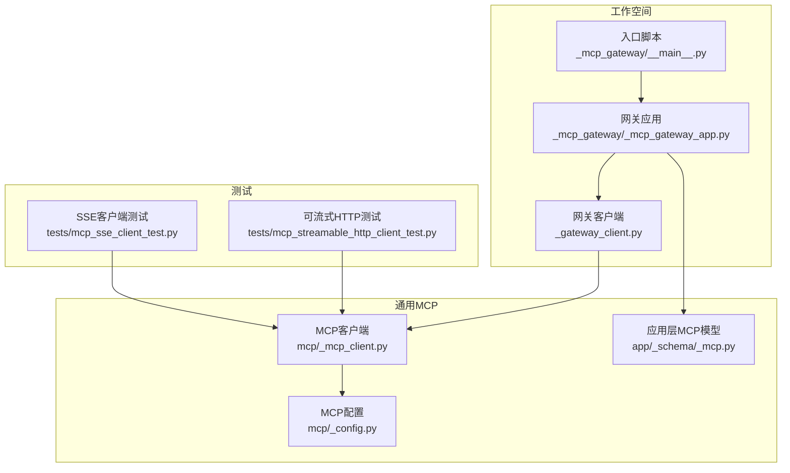
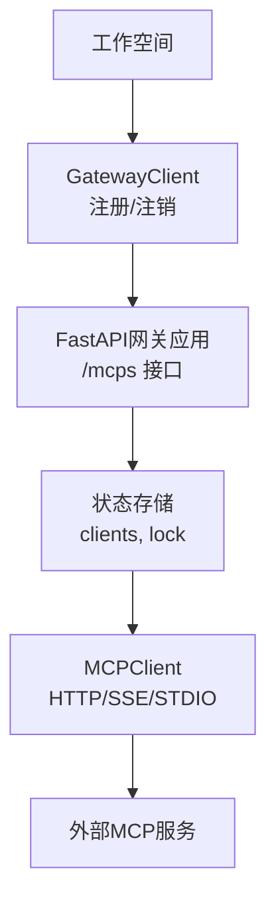
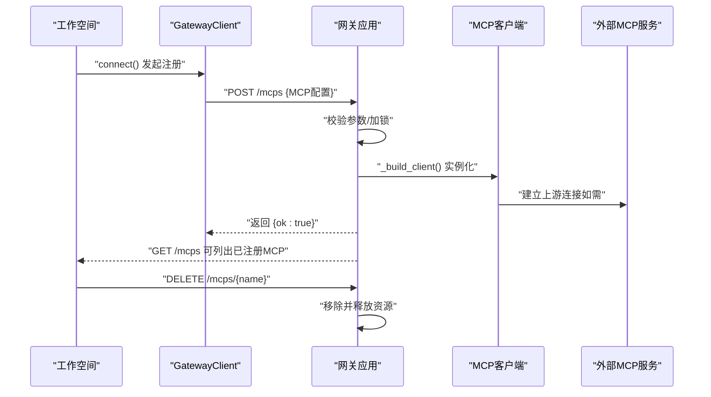
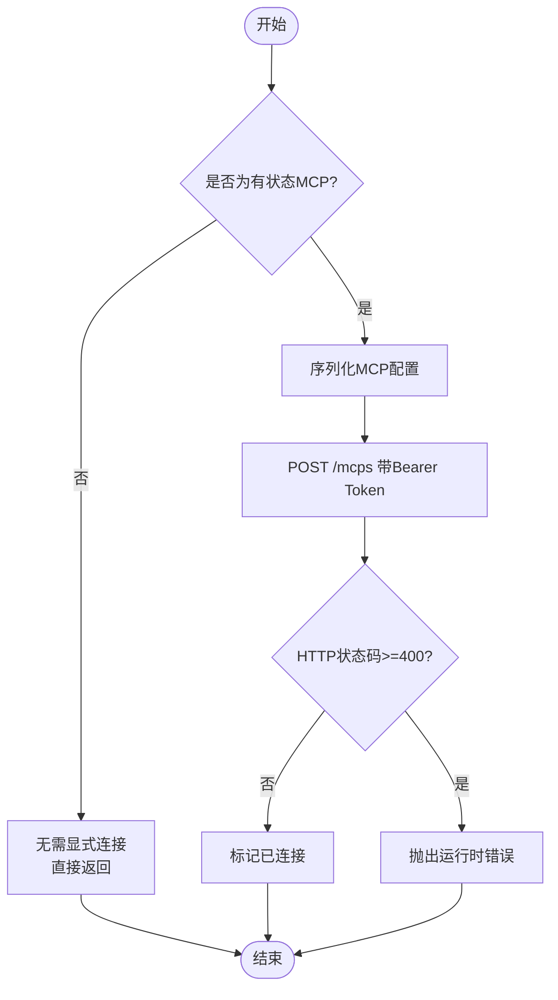
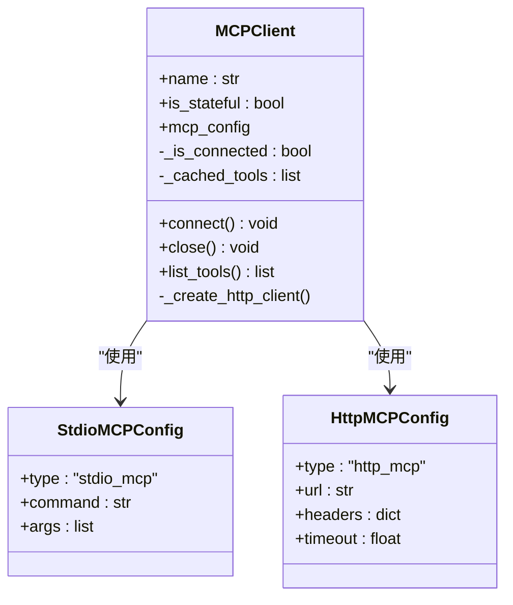
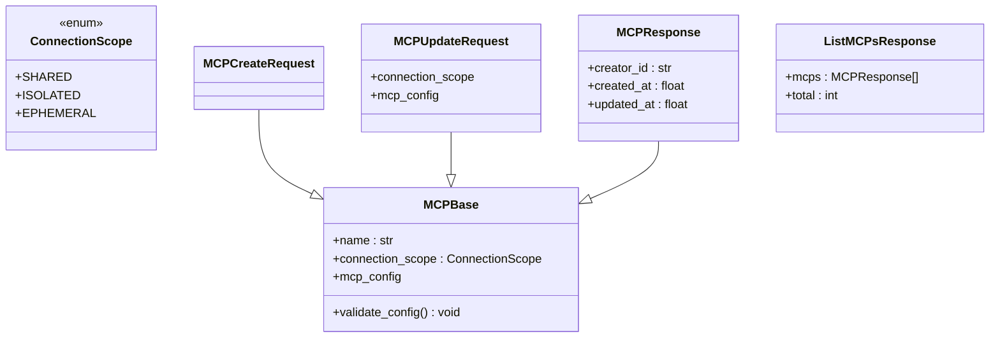
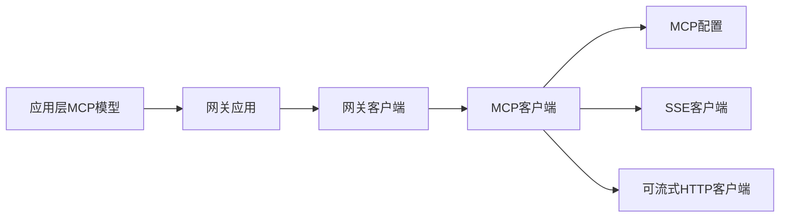

# 工作空间MCP网关

<cite>
**本文引用的文件**
- [src/agentscope/workspace/_mcp_gateway/__main__.py](file://src/agentscope/workspace/_mcp_gateway/__main__.py)
- [src/agentscope/workspace/_mcp_gateway/_mcp_gateway_app.py](file://src/agentscope/workspace/_mcp_gateway/_mcp_gateway_app.py)
- [src/agentscope/workspace/_gateway_client.py](file://src/agentscope/workspace/_gateway_client.py)
- [src/agentscope/mcp/_mcp_client.py](file://src/agentscope/mcp/_mcp_client.py)
- [src/agentscope/app/_schema/_mcp.py](file://src/agentscope/app/_schema/_mcp.py)
- [src/agentscope/mcp/_config.py](file://src/agentscope/mcp/_config.py)
- [tests/mcp_sse_client_test.py](file://tests/mcp_sse_client_test.py)
- [tests/mcp_streamable_http_client_test.py](file://tests/mcp_streamable_http_client_test.py)
</cite>

## 目录
1. [简介](#简介)
2. [项目结构](#项目结构)
3. [核心组件](#核心组件)
4. [架构总览](#架构总览)
5. [详细组件分析](#详细组件分析)
6. [依赖关系分析](#依赖关系分析)
7. [性能考虑](#性能考虑)
8. [故障排查指南](#故障排查指南)
9. [结论](#结论)
10. [附录](#附录)

## 简介
本文件系统性阐述 AgentScope 工作空间中的 MCP（Model Context Protocol）网关，重点覆盖以下方面：
- MCP 服务器的发现、注册与通信协议
- MCP 网关应用的启动流程、HTTP 接口设计与 WebSocket/SSE 连接管理
- 工作空间与外部 MCP 服务的桥接：消息转发、状态同步与错误处理
- 安全认证机制、访问控制与流量管理策略
- 配置示例、部署指南与调试技巧，包含多 MCP 服务管理与负载均衡策略

## 项目结构
围绕 MCP 网关的关键代码位于工作空间模块下的 _mcp_gateway 子包，并与通用 MCP 客户端、应用层模型以及测试用例共同构成完整能力闭环。

图表来源
- [src/agentscope/workspace/_mcp_gateway/__main__.py](file://src/agentscope/workspace/_mcp_gateway/__main__.py)
- [src/agentscope/workspace/_mcp_gateway/_mcp_gateway_app.py](file://src/agentscope/workspace/_mcp_gateway/_mcp_gateway_app.py)
- [src/agentscope/workspace/_gateway_client.py](file://src/agentscope/workspace/_gateway_client.py)
- [src/agentscope/mcp/_mcp_client.py](file://src/agentscope/mcp/_mcp_client.py)
- [src/agentscope/mcp/_config.py](file://src/agentscope/mcp/_config.py)
- [src/agentscope/app/_schema/_mcp.py](file://src/agentscope/app/_schema/_mcp.py)
- [tests/mcp_sse_client_test.py](file://tests/mcp_sse_client_test.py)
- [tests/mcp_streamable_http_client_test.py](file://tests/mcp_streamable_http_client_test.py)

章节来源
- [src/agentscope/workspace/_mcp_gateway/__main__.py](file://src/agentscope/workspace/_mcp_gateway/__main__.py)
- [src/agentscope/workspace/_mcp_gateway/_mcp_gateway_app.py](file://src/agentscope/workspace/_mcp_gateway/_mcp_gateway_app.py)
- [src/agentscope/workspace/_gateway_client.py](file://src/agentscope/workspace/_gateway_client.py)
- [src/agentscope/mcp/_mcp_client.py](file://src/agentscope/mcp/_mcp_client.py)
- [src/agentscope/mcp/_config.py](file://src/agentscope/mcp/_config.py)
- [src/agentscope/app/_schema/_mcp.py](file://src/agentscope/app/_schema/_mcp.py)
- [tests/mcp_sse_client_test.py](file://tests/mcp_sse_client_test.py)
- [tests/mcp_streamable_http_client_test.py](file://tests/mcp_streamable_http_client_test.py)

## 核心组件
- 网关应用（FastAPI）：提供 /mcps 的增删改查接口，负责 MCP 客户端实例化、并发安全与状态管理。
- 网关客户端（GatewayClient）：面向工作空间的 MCP 注册/注销客户端，支持 Bearer 认证与连接生命周期管理。
- MCP 客户端（MCPClient）：抽象 HTTP/SSE/STDIO 等传输方式，统一工具列表获取与调用流程；区分“有状态/无状态”两类连接。
- 应用层模型（APISchema）：定义 MCP 创建/更新/查询的请求/响应模型与连接范围策略（共享/隔离/临时）。
- MCP 配置（MCPCfg）：封装 STDIO/HTTP 类型的 MCP 配置项，用于客户端初始化与传输选择。

章节来源
- [src/agentscope/workspace/_mcp_gateway/_mcp_gateway_app.py](file://src/agentscope/workspace/_mcp_gateway/_mcp_gateway_app.py)
- [src/agentscope/workspace/_gateway_client.py](file://src/agentscope/workspace/_gateway_client.py)
- [src/agentscope/mcp/_mcp_client.py](file://src/agentscope/mcp/_mcp_client.py)
- [src/agentscope/app/_schema/_mcp.py](file://src/agentscope/app/_schema/_mcp.py)
- [src/agentscope/mcp/_config.py](file://src/agentscope/mcp/_config.py)

## 架构总览
下图展示工作空间 MCP 网关的整体交互：工作空间通过 GatewayClient 将 MCP 配置注册到网关；网关以 FastAPI 提供 HTTP 接口，内部维护 MCP 客户端集合并按连接范围策略进行生命周期管理；MCP 客户端根据配置选择合适的传输通道（HTTP/SSE/STDIO）并与外部 MCP 服务交互。

图表来源
- [src/agentscope/workspace/_mcp_gateway/_mcp_gateway_app.py](file://src/agentscope/workspace/_mcp_gateway/_mcp_gateway_app.py)
- [src/agentscope/workspace/_gateway_client.py](file://src/agentscope/workspace/_gateway_client.py)
- [src/agentscope/mcp/_mcp_client.py](file://src/agentscope/mcp/_mcp_client.py)

## 详细组件分析

### 网关应用（FastAPI）
- 路由与职责
  - GET /mcps：返回当前已注册的 MCP 客户端完整字段集，便于宿主重建客户端对象。
  - POST /mcps：接收 MCP 配置，校验必填字段，构建 MCP 客户端并加入全局集合；对有状态 MCP 执行连接确认。
  - DELETE /mcps/{name}：移除指定 MCP 客户端。
- 并发与一致性
  - 使用互斥锁保护 clients 字典的增删改操作，避免竞态。
- 错误处理
  - 对缺失 name、重复名称、连接失败等场景返回明确的 HTTP 状态码与错误信息。

图表来源
- [src/agentscope/workspace/_mcp_gateway/_mcp_gateway_app.py](file://src/agentscope/workspace/_mcp_gateway/_mcp_gateway_app.py)
- [src/agentscope/workspace/_gateway_client.py](file://src/agentscope/workspace/_gateway_client.py)
- [src/agentscope/mcp/_mcp_client.py](file://src/agentscope/mcp/_mcp_client.py)

章节来源
- [src/agentscope/workspace/_mcp_gateway/_mcp_gateway_app.py](file://src/agentscope/workspace/_mcp_gateway/_mcp_gateway_app.py)

### 网关客户端（GatewayClient）
- 角色定位
  - 作为工作空间侧的 MCP 注册代理，负责向网关发起注册/注销请求，并携带 Bearer Token。
- 关键行为
  - connect()：当 MCP 为有状态时，向网关提交配置并等待确认；若返回 4xx/5xx 则抛出异常。
  - close()：从网关停用并移除该 MCP。
- 认证与会话
  - 每次请求附加 Authorization: Bearer 头部；支持复用 httpx.AsyncClient 以实现连接池复用。

图表来源
- [src/agentscope/workspace/_gateway_client.py](file://src/agentscope/workspace/_gateway_client.py)

章节来源
- [src/agentscope/workspace/_gateway_client.py](file://src/agentscope/workspace/_gateway_client.py)

### MCP 客户端（MCPClient）
- 连接模式
  - 有状态：需要 connect()/close() 生命周期管理（STDIO 或需要持久会话的 HTTP）。
  - 无状态：无需显式 connect()，按需发起请求。
- 传输选择
  - 若 URL 以 /sse 或 /messages 结尾，则使用 SSE 客户端。
  - 否则使用可流式 HTTP 客户端，支持自定义 headers 与超时。
- 工具获取
  - 统一通过 list_tools() 获取工具清单，内部缓存工具列表以减少重复拉取。

图表来源
- [src/agentscope/mcp/_mcp_client.py](file://src/agentscope/mcp/_mcp_client.py)
- [src/agentscope/mcp/_config.py](file://src/agentscope/mcp/_config.py)

章节来源
- [src/agentscope/mcp/_mcp_client.py](file://src/agentscope/mcp/_mcp_client.py)
- [src/agentscope/mcp/_config.py](file://src/agentscope/mcp/_config.py)

### 应用层 MCP 模型（APISchema）
- 连接范围策略
  - shared：全局共享连接（适合无状态 HTTP MCP），首次使用创建，应用关闭时销毁。
  - isolated：按代理/用户隔离连接（适合有状态 MCP、STDIO MCP），每代理一份连接，会话结束销毁。
  - ephemeral：每次请求新建连接，请求结束后销毁（低频无状态 HTTP MCP）。
- 校验规则
  - STDIO MCP 不允许使用 ephemeral 模式。
- 请求/响应模型
  - MCPBase：包含 name、connection_scope、mcp_config。
  - MCPCreateRequest：创建时的请求体。
  - MCPUpdateRequest：部分更新请求体。
  - MCPResponse：带服务器生成元数据的响应体。
  - ListMCPsResponse：列表响应。

图表来源
- [src/agentscope/app/_schema/_mcp.py](file://src/agentscope/app/_schema/_mcp.py)

章节来源
- [src/agentscope/app/_schema/_mcp.py](file://src/agentscope/app/_schema/_mcp.py)

### 传输层细节（SSE/Streamable HTTP）
- SSE 客户端
  - 适用于以 /sse 或 /messages 结尾的 URL，支持事件流订阅与断线重连策略。
- 可流式 HTTP 客户端
  - 支持自定义 headers 与超时，适配不同 MCP 服务的鉴权与限速要求。
- 测试验证
  - 单测覆盖了 SSE 客户端与可流式 HTTP 客户端的行为，确保在不同 URL 模式下正确选择传输。

章节来源
- [src/agentscope/mcp/_mcp_client.py](file://src/agentscope/mcp/_mcp_client.py)
- [tests/mcp_sse_client_test.py](file://tests/mcp_sse_client_test.py)
- [tests/mcp_streamable_http_client_test.py](file://tests/mcp_streamable_http_client_test.py)

## 依赖关系分析
- 组件耦合
  - 网关应用依赖 GatewayClient 的注册流程与 MCP 客户端的实例化能力。
  - MCP 客户端依赖 MCP 配置与传输层实现（SSE/HTTP）。
  - 应用层模型为 API 层提供强类型约束与校验逻辑。
- 外部依赖
  - FastAPI（路由与中间件）、httpx（异步 HTTP 客户端）、Pydantic（数据模型与校验）。
- 潜在环路
  - 当前结构为单向依赖：应用层模型 → 网关应用 → 网关客户端 → MCP 客户端 → 传输层；未见循环依赖。

图表来源
- [src/agentscope/app/_schema/_mcp.py](file://src/agentscope/app/_schema/_mcp.py)
- [src/agentscope/workspace/_mcp_gateway/_mcp_gateway_app.py](file://src/agentscope/workspace/_mcp_gateway/_mcp_gateway_app.py)
- [src/agentscope/workspace/_gateway_client.py](file://src/agentscope/workspace/_gateway_client.py)
- [src/agentscope/mcp/_mcp_client.py](file://src/agentscope/mcp/_mcp_client.py)
- [src/agentscope/mcp/_config.py](file://src/agentscope/mcp/_config.py)

章节来源
- [src/agentscope/app/_schema/_mcp.py](file://src/agentscope/app/_schema/_mcp.py)
- [src/agentscope/workspace/_mcp_gateway/_mcp_gateway_app.py](file://src/agentscope/workspace/_mcp_gateway/_mcp_gateway_app.py)
- [src/agentscope/workspace/_gateway_client.py](file://src/agentscope/workspace/_gateway_client.py)
- [src/agentscope/mcp/_mcp_client.py](file://src/agentscope/mcp/_mcp_client.py)
- [src/agentscope/mcp/_config.py](file://src/agentscope/mcp/_config.py)

## 性能考虑
- 连接池与复用
  - 网关客户端支持传入共享的 httpx.AsyncClient，以复用底层 TCP 连接，降低握手开销。
- 连接生命周期
  - shared 模式适合高频调用的无状态 MCP；isolated 模式适合需要上下文保持的有状态 MCP；ephemeral 模式适合极低频调用。
- 传输选择
  - SSE 适合持续事件推送；可流式 HTTP 适合请求-响应或长轮询场景。
- 并发控制
  - 网关应用使用互斥锁保护客户端集合，避免高并发下的竞态；建议在业务侧也做必要的速率限制与熔断。

## 故障排查指南
- 注册失败（HTTP 4xx/5xx）
  - 检查 MCP 名称是否唯一、配置字段是否完整、外部服务可达性与鉴权头是否正确。
- 连接状态异常
  - 有状态 MCP 忘记 close() 导致资源泄漏；确认 connect() 仅在 is_stateful=True 时调用。
- SSE/HTTP 传输问题
  - 根据 URL 后缀自动选择 SSE 或可流式 HTTP；若 URL 不匹配预期，可能导致连接失败。
- 单元测试参考
  - 参考测试用例中对 SSE 客户端与可流式 HTTP 客户端的断言，快速定位传输层问题。

章节来源
- [src/agentscope/workspace/_gateway_client.py](file://src/agentscope/workspace/_gateway_client.py)
- [src/agentscope/workspace/_mcp_gateway/_mcp_gateway_app.py](file://src/agentscope/workspace/_mcp_gateway/_mcp_gateway_app.py)
- [tests/mcp_sse_client_test.py](file://tests/mcp_sse_client_test.py)
- [tests/mcp_streamable_http_client_test.py](file://tests/mcp_streamable_http_client_test.py)

## 结论
AgentScope 工作空间的 MCP 网关通过清晰的分层设计实现了对外部 MCP 服务的统一接入与管理：应用层提供强类型模型与连接策略，网关应用提供受控的注册/注销接口，网关客户端负责认证与生命周期管理，MCP 客户端抽象多种传输方式并屏蔽差异。配合合理的连接范围策略与传输选择，可在保证稳定性的同时兼顾性能与可扩展性。

## 附录

### 启动流程
- 入口脚本负责启动网关应用服务，随后工作空间通过 GatewayClient 发起注册。
- 注册成功后，工作空间可通过 GET /mcps 获取已注册 MCP 列表，必要时执行 DELETE /mcps/{name} 进行清理。

章节来源
- [src/agentscope/workspace/_mcp_gateway/__main__.py](file://src/agentscope/workspace/_mcp_gateway/__main__.py)
- [src/agentscope/workspace/_mcp_gateway/_mcp_gateway_app.py](file://src/agentscope/workspace/_mcp_gateway/_mcp_gateway_app.py)

### HTTP 接口设计
- GET /mcps：返回所有已注册 MCP 的完整配置快照。
- POST /mcps：注册新的 MCP，校验必填字段并尝试建立上游连接。
- DELETE /mcps/{name}：移除指定 MCP。

章节来源
- [src/agentscope/workspace/_mcp_gateway/_mcp_gateway_app.py](file://src/agentscope/workspace/_mcp_gateway/_mcp_gateway_app.py)

### WebSocket/SSE 连接管理
- 通过 URL 后缀自动识别传输类型：/sse 或 /messages 使用 SSE；其他情况使用可流式 HTTP。
- SSE 客户端具备事件流订阅能力，适合持续推送场景；可流式 HTTP 支持自定义头部与超时。

章节来源
- [src/agentscope/mcp/_mcp_client.py](file://src/agentscope/mcp/_mcp_client.py)

### 安全认证与访问控制
- Bearer Token：网关客户端在每次请求中附加 Authorization: Bearer 头部。
- 中间件：路由装饰器中注入认证依赖，确保只有持有有效令牌的请求才能操作 MCP 资源。

章节来源
- [src/agentscope/workspace/_gateway_client.py](file://src/agentscope/workspace/_gateway_client.py)
- [src/agentscope/workspace/_mcp_gateway/_mcp_gateway_app.py](file://src/agentscope/workspace/_mcp_gateway/_mcp_gateway_app.py)

### 流量管理与多 MCP 策略
- 连接范围策略
  - shared：全局共享，适合无状态高频调用。
  - isolated：按代理隔离，适合有状态或需要上下文保持的场景。
  - ephemeral：按请求创建，适合低频调用。
- 负载均衡建议
  - 在网关外层引入反向代理或服务网格，对多个 MCP 实例进行健康检查与流量分发；结合连接范围策略实现就近与隔离。

章节来源
- [src/agentscope/app/_schema/_mcp.py](file://src/agentscope/app/_schema/_mcp.py)